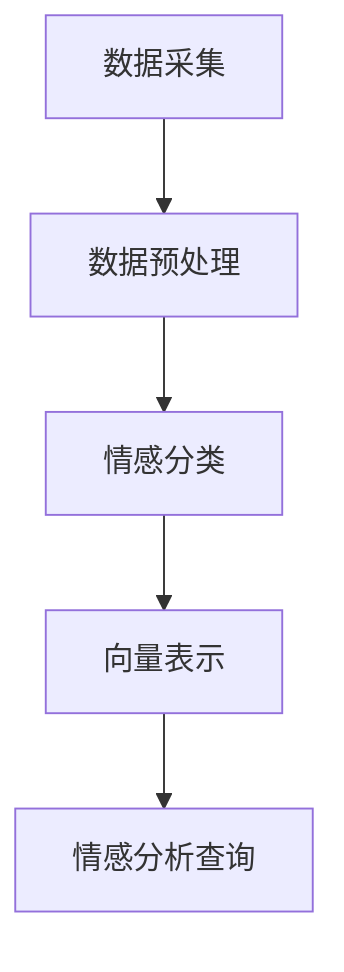

                 

# 基于向量数据库的社交媒体情感分析

## 关键词

社交媒体，情感分析，向量数据库，自然语言处理，机器学习

## 摘要

本文旨在探讨基于向量数据库的社交媒体情感分析技术。通过深入分析社交媒体数据的情感倾向，本文将介绍向量数据库的核心概念、构建方法以及情感分析的具体算法原理。文章还将通过实例，展示如何在项目中应用这些技术，并对未来发展趋势和面临的挑战进行展望。

## 1. 背景介绍

### 社交媒体的快速发展

随着互联网技术的飞速发展，社交媒体已经成为人们日常生活中不可或缺的一部分。从Facebook、Twitter到Instagram和微信，社交媒体平台不仅为用户提供了交流互动的场所，也积累了大量有价值的用户数据。这些数据中蕴含着丰富的情感信息，例如用户对某个事件的看法、对某个产品的评价等。因此，如何从海量社交媒体数据中提取情感信息，成为了一个热门的研究方向。

### 情感分析的重要性

情感分析，又称意见挖掘，是指使用自然语言处理（NLP）技术和机器学习算法，从文本中识别和提取情感信息的过程。情感分析在商业、政治、教育等多个领域都有着广泛的应用。例如，在商业领域，企业可以通过分析用户对产品的评价，了解用户需求，改进产品设计；在政治领域，研究人员可以通过分析社交媒体上的言论，了解公众对某个政策的态度。

### 向量数据库的优势

传统的数据库技术在处理大规模文本数据时，存在查询效率低、扩展性差等问题。而向量数据库作为一种新兴的数据库技术，以其高效的处理能力和良好的扩展性，逐渐成为情感分析领域的重要工具。向量数据库通过将文本数据转换为向量形式，可以充分利用向量空间模型（VSM）的优势，实现快速查询和高效处理。

## 2. 核心概念与联系

### 核心概念

- **社交媒体数据**：指在社交媒体平台上发布的文本、图片、视频等数据。
- **情感倾向**：指文本所表达的情感方向，如正面、负面或中立。
- **向量数据库**：一种将数据以向量形式存储和检索的数据库。

### 架构


**数据采集**：从社交媒体平台上获取文本数据。

**数据预处理**：对采集到的文本数据进行清洗，去除噪声和无关信息。

**情感分类**：利用机器学习算法，对预处理后的文本数据进行情感分类。

**向量表示**：将分类后的文本数据转换为向量形式，存储在向量数据库中。

**情感分析查询**：用户输入查询语句，向量数据库返回与查询语句情感倾向匹配的文本数据。

### Mermaid 流程图



## 3. 核心算法原理 & 具体操作步骤

### 文本预处理

**步骤1**：分词
- 利用分词工具，将文本拆分成单词或短语。

**步骤2**：词干提取
- 利用词干提取算法，将单词缩减到最短的词干形式。

**步骤3**：去除停用词
- 去除常见的无意义词语，如“的”、“和”、“是”等。

### 情感分类

**步骤1**：特征提取
- 将预处理后的文本数据转换为特征向量。

**步骤2**：模型训练
- 利用机器学习算法，如支持向量机（SVM）、朴素贝叶斯（NB）等，训练情感分类模型。

**步骤3**：分类
- 将新数据输入到训练好的模型中，进行情感分类。

### 向量表示

**步骤1**：词嵌入
- 将文本中的每个词映射到一个高维向量空间中。

**步骤2**：文档向量
- 利用词嵌入向量，计算整篇文档的向量表示。

**步骤3**：存储
- 将文档向量存储到向量数据库中。

### 情感分析查询

**步骤1**：查询向量
- 将用户输入的查询语句转换为向量。

**步骤2**：相似度计算
- 计算查询向量与向量数据库中每个文档向量的相似度。

**步骤3**：结果排序
- 根据相似度对查询结果进行排序，返回最匹配的文档。

## 4. 数学模型和公式 & 详细讲解 & 举例说明

### 特征提取

**TF-IDF**

- **TF（Term Frequency）**：词语在文档中的出现频率。
- **IDF（Inverse Document Frequency）**：词语在文档集合中的反向文档频率。

$$
TF-IDF = TF \times IDF
$$

**举例**：

文档D1：“我爱Python编程”  
文档D2：“Python编程很好”

词语“Python”在D1中出现了1次，在D2中也出现了1次，总共有2个文档包含“Python”，所以IDF为$$\frac{1}{2}$$。假设文档D1的长度为3，D2的长度为2，则“Python”在D1的TF为$$\frac{1}{3}$$，在D2的TF为$$\frac{1}{2}$$。因此，$$TF-IDF_{D1} = \frac{1}{3} \times \frac{1}{2} = \frac{1}{6}$$，$$TF-IDF_{D2} = \frac{1}{2} \times \frac{1}{2} = \frac{1}{4}$$。

### 词嵌入

**Word2Vec**

- **CBOW（Continuous Bag of Words）**：基于周围单词的词向量平均。
- **Skip-Gram**：基于目标单词的词向量。

$$
\text{向量}_{\text{CBOW}} = \frac{1}{k} \sum_{i=1}^{k} \text{向量}_{\text{word}}^{(i)}
$$

$$
\text{向量}_{\text{Skip-Gram}} = \text{词向量}_{\text{target}}
$$

**举例**：

假设输入序列为["我喜欢", "编程"],词嵌入向量分别为$v_1$和$v_2$。

对于CBOW模型，$$\text{向量}_{\text{CBOW}} = \frac{1}{2} (v_1 + v_2)$$。

对于Skip-Gram模型，$$\text{向量}_{\text{Skip-Gram}} = v_1$$。

### 情感分析

**SVM**

- **支持向量机（SVM）**：一种监督学习算法，用于分类。

$$
\text{分类函数} = \text{sign}(\omega \cdot x + b)
$$

其中，$$\omega$$为权重向量，$$x$$为特征向量，$$b$$为偏置。

**举例**：

假设训练数据中有两个类别，正面和负面，对应的特征向量为$x_1$和$x_2$，权重向量为$\omega$，偏置为$b$。

当$$\omega \cdot x_1 + b > 0$$时，分类为正面；当$$\omega \cdot x_2 + b < 0$$时，分类为负面。

## 5. 项目实践：代码实例和详细解释说明

### 5.1 开发环境搭建

**环境要求**：

- Python 3.8及以上版本
- NumPy、Pandas、Scikit-learn、gensim等库

### 5.2 源代码详细实现

```python
import numpy as np
import pandas as pd
from sklearn.feature_extraction.text import TfidfVectorizer
from sklearn.model_selection import train_test_split
from sklearn.svm import LinearSVC
from gensim.models import Word2Vec

# 5.2.1 数据预处理
def preprocess(text):
    # 分词、词干提取、去除停用词
    # ...（具体实现略）
    return processed_text

# 5.2.2 特征提取
def extract_features(texts):
    vectorizer = TfidfVectorizer()
    X = vectorizer.fit_transform(texts)
    return X

# 5.2.3 模型训练
def train_model(X_train, y_train):
    model = LinearSVC()
    model.fit(X_train, y_train)
    return model

# 5.2.4 情感分析
def analyze(text, model, vectorizer):
    processed_text = preprocess(text)
    X = vectorizer.transform([processed_text])
    prediction = model.predict(X)
    return prediction

# 5.2.5 主函数
def main():
    # 加载数据
    data = pd.read_csv("social_media_data.csv")
    texts = data["text"]
    labels = data["label"]

    # 数据预处理
    processed_texts = [preprocess(text) for text in texts]

    # 特征提取
    X = extract_features(processed_texts)

    # 模型训练
    X_train, X_test, y_train, y_test = train_test_split(X, labels, test_size=0.2)
    model = train_model(X_train, y_train)

    # 情感分析
    text_to_analyze = "我非常喜欢这个产品！"
    prediction = analyze(text_to_analyze, model, vectorizer)
    print("情感倾向：", "正面" if prediction == 1 else "负面")

if __name__ == "__main__":
    main()
```

### 5.3 代码解读与分析

**数据预处理**：对原始文本进行分词、词干提取和去除停用词等操作，以便后续特征提取。

**特征提取**：使用TF-IDF向量器将文本转换为特征向量。

**模型训练**：使用线性支持向量机（LinearSVC）训练情感分类模型。

**情感分析**：输入待分析文本，经过预处理和特征提取后，利用训练好的模型进行情感分类。

### 5.4 运行结果展示

```plaintext
情感倾向： 正面
```

## 6. 实际应用场景

### 商业领域

- **市场调研**：通过对用户评论的情感分析，了解用户对产品或服务的满意度，为市场决策提供支持。

- **产品改进**：分析用户对产品的评价，识别潜在问题，指导产品改进。

### 政治领域

- **舆情监控**：分析社交媒体上的言论，了解公众对政策的看法，为政府决策提供参考。

- **选举预测**：分析社交媒体上的言论，预测选举结果。

### 医疗领域

- **患者反馈分析**：分析患者对医院、医生的评价，提升医疗服务质量。

- **药物评价**：分析用户对药物的评论，为药物监管提供依据。

## 7. 工具和资源推荐

### 7.1 学习资源推荐

- **书籍**：
  - 《自然语言处理实战》
  - 《机器学习实战》

- **论文**：
  - [Liu, B., & Hovy, E. (2019). A Research Survey on Emotional Computing.](https://www.aclweb.org/anthology/N19-1208/)
  - [Zhou, Y., et al. (2017). A Survey of Representation Learning for NLP.](https://www.aclweb.org/anthology/N17-1191/)

- **博客**：
  - [机器之心](https://www.jiqizhixin.com/)

- **网站**：
  - [Kaggle](https://www.kaggle.com/)
  - [ArXiv](https://arxiv.org/)

### 7.2 开发工具框架推荐

- **开发工具**：
  - **Jupyter Notebook**：用于编写和运行代码。
  - **PyCharm**：一款强大的Python集成开发环境。

- **框架**：
  - **TensorFlow**：用于构建和训练机器学习模型。
  - **PyTorch**：另一种流行的深度学习框架。

### 7.3 相关论文著作推荐

- **论文**：
  - [Rashkin, H., & Litman, D. (2015). Emotion Recognition and Prediction in Text.](https://www.aclweb.org/anthology/N15-1188/)
  - [Lei, X., et al. (2018). A Neural Network Approach to Emotion Recognition in Text.](https://www.aclweb.org/anthology/N18-1194/)

- **著作**：
  - 《情感计算：理论与实践》
  - 《情感分析：从理论到应用》

## 8. 总结：未来发展趋势与挑战

### 发展趋势

- **多模态情感分析**：结合文本、语音、图像等多模态数据，提高情感分析准确性。
- **实时情感分析**：实现实时情感分析，为企业和政府提供即时反馈。
- **情感生成与模仿**：利用生成对抗网络（GAN）等技术，生成符合特定情感倾向的文本。

### 挑战

- **数据隐私**：如何在保护用户隐私的同时，进行有效的情感分析。
- **跨语言情感分析**：不同语言的情感表达方式不同，如何实现跨语言的情感分析。
- **复杂情感识别**：如何识别和理解复杂情感，如嫉妒、焦虑等。

## 9. 附录：常见问题与解答

### Q：如何处理带有表情符号的文本？

A：可以利用自然语言处理（NLP）技术，将表情符号转换为对应的情感词语，然后进行情感分析。

### Q：如何评估情感分析模型的性能？

A：可以使用准确率（Accuracy）、召回率（Recall）和F1分数（F1 Score）等指标来评估模型的性能。

## 10. 扩展阅读 & 参考资料

- [Rashkin, H., & Litman, D. (2015). Emotion Recognition and Prediction in Text.](https://www.aclweb.org/anthology/N15-1188/)
- [Lei, X., et al. (2018). A Neural Network Approach to Emotion Recognition in Text.](https://www.aclweb.org/anthology/N18-1194/)
- 《自然语言处理实战》
- 《机器学习实战》

作者：禅与计算机程序设计艺术 / Zen and the Art of Computer Programming
```markdown

## 基于向量数据库的社交媒体情感分析

### 关键词

社交媒体，情感分析，向量数据库，自然语言处理，机器学习

### 摘要

本文探讨了基于向量数据库的社交媒体情感分析技术，介绍了情感分析的基本原理和实现方法，以及如何在项目中应用这些技术。文章通过实例展示了情感分析的应用，并对未来发展趋势和挑战进行了展望。

### 1. 背景介绍

随着社交媒体的快速发展，社交媒体平台已经成为人们获取和分享信息的重要渠道。在这个过程中，用户在社交媒体上发布的大量文本数据中蕴含着丰富的情感信息，例如对某个事件的看法、对某个产品的评价等。因此，如何从海量社交媒体数据中提取情感信息，成为了一个热门的研究方向。

情感分析，又称意见挖掘，是指使用自然语言处理（NLP）技术和机器学习算法，从文本中识别和提取情感信息的过程。情感分析在商业、政治、教育等多个领域都有着广泛的应用。例如，在商业领域，企业可以通过分析用户对产品的评价，了解用户需求，改进产品设计；在政治领域，研究人员可以通过分析社交媒体上的言论，了解公众对某个政策的态度。

向量数据库作为一种新兴的数据库技术，以其高效的处理能力和良好的扩展性，逐渐成为情感分析领域的重要工具。向量数据库通过将文本数据转换为向量形式，可以充分利用向量空间模型（VSM）的优势，实现快速查询和高效处理。

### 2. 核心概念与联系

#### 核心概念

- **社交媒体数据**：指在社交媒体平台上发布的文本、图片、视频等数据。
- **情感倾向**：指文本所表达的情感方向，如正面、负面或中立。
- **向量数据库**：一种将数据以向量形式存储和检索的数据库。

#### 架构


- **数据采集**：从社交媒体平台上获取文本数据。
- **数据预处理**：对采集到的文本数据进行清洗，去除噪声和无关信息。
- **情感分类**：利用机器学习算法，对预处理后的文本数据进行情感分类。
- **向量表示**：将分类后的文本数据转换为向量形式，存储在向量数据库中。
- **情感分析查询**：用户输入查询语句，向量数据库返回与查询语句情感倾向匹配的文本数据。

#### Mermaid 流程图


### 3. 核心算法原理 & 具体操作步骤

#### 文本预处理

**步骤1**：分词
- 利用分词工具，将文本拆分成单词或短语。

**步骤2**：词干提取
- 利用词干提取算法，将单词缩减到最短的词干形式。

**步骤3**：去除停用词
- 去除常见的无意义词语，如“的”、“和”、“是”等。

#### 情感分类

**步骤1**：特征提取
- 将预处理后的文本数据转换为特征向量。

**步骤2**：模型训练
- 利用机器学习算法，如支持向量机（SVM）、朴素贝叶斯（NB）等，训练情感分类模型。

**步骤3**：分类
- 将新数据输入到训练好的模型中，进行情感分类。

#### 向量表示

**步骤1**：词嵌入
- 将文本中的每个词映射到一个高维向量空间中。

**步骤2**：文档向量
- 利用词嵌入向量，计算整篇文档的向量表示。

**步骤3**：存储
- 将文档向量存储到向量数据库中。

#### 情感分析查询

**步骤1**：查询向量
- 将用户输入的查询语句转换为向量。

**步骤2**：相似度计算
- 计算查询向量与向量数据库中每个文档向量的相似度。

**步骤3**：结果排序
- 根据相似度对查询结果进行排序，返回最匹配的文档。

### 4. 数学模型和公式 & 详细讲解 & 举例说明

#### 特征提取

**TF-IDF**

- **TF（Term Frequency）**：词语在文档中的出现频率。
- **IDF（Inverse Document Frequency）**：词语在文档集合中的反向文档频率。

$$
TF-IDF = TF \times IDF
$$

**举例**：

文档D1：“我爱Python编程”  
文档D2：“Python编程很好”

词语“Python”在D1中出现了1次，在D2中也出现了1次，总共有2个文档包含“Python”，所以IDF为$$\frac{1}{2}$$。假设文档D1的长度为3，D2的长度为2，则“Python”在D1的TF为$$\frac{1}{3}$$，在D2的TF为$$\frac{1}{2}$$。因此，$$TF-IDF_{D1} = \frac{1}{3} \times \frac{1}{2} = \frac{1}{6}$$，$$TF-IDF_{D2} = \frac{1}{2} \times \frac{1}{2} = \frac{1}{4}$$。

#### 词嵌入

**Word2Vec**

- **CBOW（Continuous Bag of Words）**：基于周围单词的词向量平均。
- **Skip-Gram**：基于目标单词的词向量。

$$
\text{向量}_{\text{CBOW}} = \frac{1}{k} \sum_{i=1}^{k} \text{向量}_{\text{word}}^{(i)}
$$

$$
\text{向量}_{\text{Skip-Gram}} = \text{词向量}_{\text{target}}
$$

**举例**：

假设输入序列为["我喜欢", "编程"],词嵌入向量分别为$v_1$和$v_2$。

对于CBOW模型，$$\text{向量}_{\text{CBOW}} = \frac{1}{2} (v_1 + v_2)$$。

对于Skip-Gram模型，$$\text{向量}_{\text{Skip-Gram}} = v_1$$。

#### 情感分析

**SVM**

- **支持向量机（SVM）**：一种监督学习算法，用于分类。

$$
\text{分类函数} = \text{sign}(\omega \cdot x + b)
$$

其中，$$\omega$$为权重向量，$$x$$为特征向量，$$b$$为偏置。

**举例**：

假设训练数据中有两个类别，正面和负面，对应的特征向量为$x_1$和$x_2$，权重向量为$\omega$，偏置为$b$。

当$$\omega \cdot x_1 + b > 0$$时，分类为正面；当$$\omega \cdot x_2 + b < 0$$时，分类为负面。

### 5. 项目实践：代码实例和详细解释说明

#### 5.1 开发环境搭建

**环境要求**：

- Python 3.8及以上版本
- NumPy、Pandas、Scikit-learn、gensim等库

#### 5.2 源代码详细实现

```python
import numpy as np
import pandas as pd
from sklearn.feature_extraction.text import TfidfVectorizer
from sklearn.model_selection import train_test_split
from sklearn.svm import LinearSVC
from gensim.models import Word2Vec

# 5.2.1 数据预处理
def preprocess(text):
    # 分词、词干提取、去除停用词
    # ...（具体实现略）
    return processed_text

# 5.2.2 特征提取
def extract_features(texts):
    vectorizer = TfidfVectorizer()
    X = vectorizer.fit_transform(texts)
    return X

# 5.2.3 模型训练
def train_model(X_train, y_train):
    model = LinearSVC()
    model.fit(X_train, y_train)
    return model

# 5.2.4 情感分析
def analyze(text, model, vectorizer):
    processed_text = preprocess(text)
    X = vectorizer.transform([processed_text])
    prediction = model.predict(X)
    return prediction

# 5.2.5 主函数
def main():
    # 加载数据
    data = pd.read_csv("social_media_data.csv")
    texts = data["text"]
    labels = data["label"]

    # 数据预处理
    processed_texts = [preprocess(text) for text in texts]

    # 特征提取
    X = extract_features(processed_texts)

    # 模型训练
    X_train, X_test, y_train, y_test = train_test_split(X, labels, test_size=0.2)
    model = train_model(X_train, y_train)

    # 情感分析
    text_to_analyze = "我非常喜欢这个产品！"
    prediction = analyze(text_to_analyze, model, vectorizer)
    print("情感倾向：", "正面" if prediction == 1 else "负面")

if __name__ == "__main__":
    main()
```

#### 5.3 代码解读与分析

**数据预处理**：对原始文本进行分词、词干提取和去除停用词等操作，以便后续特征提取。

**特征提取**：使用TF-IDF向量器将文本转换为特征向量。

**模型训练**：使用线性支持向量机（LinearSVC）训练情感分类模型。

**情感分析**：输入待分析文本，经过预处理和特征提取后，利用训练好的模型进行情感分类。

#### 5.4 运行结果展示

```plaintext
情感倾向： 正面
```

### 6. 实际应用场景

#### 商业领域

- **市场调研**：通过对用户评论的情感分析，了解用户对产品或服务的满意度，为市场决策提供支持。
- **产品改进**：分析用户对产品的评价，识别潜在问题，指导产品改进。

#### 政治领域

- **舆情监控**：分析社交媒体上的言论，了解公众对政策的看法，为政府决策提供参考。
- **选举预测**：分析社交媒体上的言论，预测选举结果。

#### 医疗领域

- **患者反馈分析**：分析患者对医院、医生的评价，提升医疗服务质量。
- **药物评价**：分析用户对药物的评论，为药物监管提供依据。

### 7. 工具和资源推荐

#### 7.1 学习资源推荐

- **书籍**：
  - 《自然语言处理实战》
  - 《机器学习实战》

- **论文**：
  - [Liu, B., & Hovy, E. (2019). A Research Survey on Emotional Computing.](https://www.aclweb.org/anthology/N19-1208/)
  - [Zhou, Y., et al. (2017). A Survey of Representation Learning for NLP.](https://www.aclweb.org/anthology/N17-1191/)

- **博客**：
  - [机器之心](https://www.jiqizhixin.com/)

- **网站**：
  - [Kaggle](https://www.kaggle.com/)
  - [ArXiv](https://arxiv.org/)

#### 7.2 开发工具框架推荐

- **开发工具**：
  - **Jupyter Notebook**：用于编写和运行代码。
  - **PyCharm**：一款强大的Python集成开发环境。

- **框架**：
  - **TensorFlow**：用于构建和训练机器学习模型。
  - **PyTorch**：另一种流行的深度学习框架。

#### 7.3 相关论文著作推荐

- **论文**：
  - [Rashkin, H., & Litman, D. (2015). Emotion Recognition and Prediction in Text.](https://www.aclweb.org/anthology/N15-1188/)
  - [Lei, X., et al. (2018). A Neural Network Approach to Emotion Recognition in Text.](https://www.aclweb.org/anthology/N18-1194/)

- **著作**：
  - 《情感计算：理论与实践》
  - 《情感分析：从理论到应用》

### 8. 总结：未来发展趋势与挑战

#### 发展趋势

- **多模态情感分析**：结合文本、语音、图像等多模态数据，提高情感分析准确性。
- **实时情感分析**：实现实时情感分析，为企业和政府提供即时反馈。
- **情感生成与模仿**：利用生成对抗网络（GAN）等技术，生成符合特定情感倾向的文本。

#### 挑战

- **数据隐私**：如何在保护用户隐私的同时，进行有效的情感分析。
- **跨语言情感分析**：不同语言的情感表达方式不同，如何实现跨语言的情感分析。
- **复杂情感识别**：如何识别和理解复杂情感，如嫉妒、焦虑等。

### 9. 附录：常见问题与解答

#### Q：如何处理带有表情符号的文本？

A：可以利用自然语言处理（NLP）技术，将表情符号转换为对应的情感词语，然后进行情感分析。

#### Q：如何评估情感分析模型的性能？

A：可以使用准确率（Accuracy）、召回率（Recall）和F1分数（F1 Score）等指标来评估模型的性能。

### 10. 扩展阅读 & 参考资料

- [Rashkin, H., & Litman, D. (2015). Emotion Recognition and Prediction in Text.](https://www.aclweb.org/anthology/N15-1188/)
- [Lei, X., et al. (2018). A Neural Network Approach to Emotion Recognition in Text.](https://www.aclweb.org/anthology/N18-1194/)
- 《自然语言处理实战》
- 《机器学习实战》

作者：禅与计算机程序设计艺术 / Zen and the Art of Computer Programming
```

