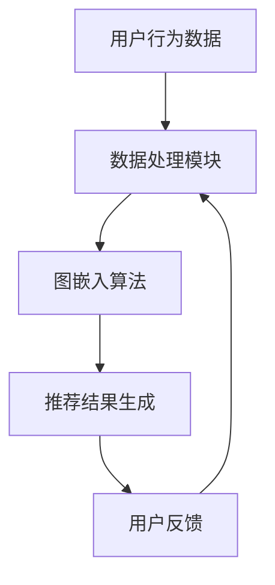

                 

### 文章标题：基于图嵌入的大规模商品推荐系统

#### 关键词：图嵌入、商品推荐、大规模数据处理、机器学习、深度学习

> 摘要：本文将介绍一种基于图嵌入的大规模商品推荐系统，通过深入分析图嵌入的基本原理、算法实现和实际应用，探讨如何有效利用图嵌入技术提高商品推荐的准确性和实时性。文章旨在为读者提供一个从理论到实践的完整指南，帮助开发人员理解和应用图嵌入技术于大规模商品推荐系统。

## 1. 背景介绍

在当今电子商务时代，商品推荐系统已经成为电商平台的核心竞争力之一。一个高效的商品推荐系统能够根据用户的历史行为、兴趣偏好等数据，为用户个性化推荐可能感兴趣的商品。这不仅提升了用户体验，还能显著提高平台销售额和用户粘性。

传统的推荐系统多采用基于内容的推荐（Content-Based Filtering）和协同过滤（Collaborative Filtering）等方法。然而，随着数据规模的不断扩大和用户需求的多样化，这些传统方法逐渐暴露出一些问题，如数据稀疏性、冷启动问题、推荐结果多样性不足等。

为了解决这些挑战，近年来图嵌入（Graph Embedding）技术逐渐成为研究热点。图嵌入是一种将图结构中的节点和边映射到低维向量空间的方法，通过保留节点间的拓扑结构信息，可以在大规模数据集上进行高效处理，实现节点相似性和邻域关系的有效表示。

本文将围绕图嵌入技术在大规模商品推荐系统中的应用，详细探讨其基本原理、算法实现、数学模型以及实际应用案例。

## 2. 核心概念与联系

### 2.1 图嵌入的基本概念

图嵌入是一种将图结构中的节点和边映射到低维向量空间的方法。在图嵌入中，每个节点被映射为一个向量，每个边则通过节点的向量表示来定义。图嵌入的关键在于如何保留节点间的拓扑结构信息，使其在低维空间中仍然保持原有的相似性和邻域关系。

### 2.2 图嵌入的算法

图嵌入算法可以分为基于随机游走的方法（如DeepWalk、Node2Vec）和基于矩阵分解的方法（如GCN、SGC）。这些算法通过不同的方式捕捉图中的拓扑结构信息，形成节点和边在低维向量空间的表示。

### 2.3 图嵌入在推荐系统中的应用

图嵌入在推荐系统中的应用主要体现在以下几个方面：

1. **用户和商品的表示**：通过图嵌入技术，可以将用户和商品映射到同一个低维向量空间，从而实现跨模态的信息整合。
2. **基于图的相似性搜索**：利用图嵌入生成的向量表示，可以高效地实现用户与商品之间的相似性计算，从而生成个性化的推荐列表。
3. **冷启动问题解决**：对于新用户和新商品，图嵌入可以基于已有用户和商品的拓扑结构，生成初步的推荐结果，缓解冷启动问题。

### 2.4 Mermaid 流程图



## 3. 核心算法原理 & 具体操作步骤

### 3.1 图嵌入算法原理

图嵌入的核心思想是通过在图上进行随机游走，捕捉节点间的拓扑结构信息。在随机游走过程中，节点的状态不断更新，每个状态对应一个向量表示。通过优化向量表示，使得具有相似拓扑结构的节点在低维空间中更接近。

### 3.2 具体操作步骤

1. **构建用户和商品的图结构**：根据用户的历史行为数据，构建用户和商品之间的交互图。在图中，每个节点表示一个用户或商品，每条边表示用户对商品的交互。
2. **随机游走**：在图中进行随机游走，生成一系列的节点序列。每次游走从一个节点开始，随机选择相邻节点作为下一次游走的起点。
3. **生成向量表示**：将每个节点序列编码为向量表示。通常使用基于词向量的模型（如Word2Vec）对节点序列进行处理。
4. **优化向量表示**：通过优化目标函数，调整向量表示，使得具有相似拓扑结构的节点在低维空间中更接近。常见的优化方法包括基于梯度下降的优化算法。
5. **相似性计算与推荐生成**：利用优化后的向量表示，计算用户与商品之间的相似性。根据相似性分数，生成个性化的推荐列表。

## 4. 数学模型和公式 & 详细讲解 & 举例说明

### 4.1 数学模型

图嵌入的数学模型通常基于随机游走和优化目标函数。具体公式如下：

$$
\begin{aligned}
p_{ij}^{(t)} &= \frac{1}{d_j} \sum_{k \in \mathcal{N}(j)} p_{ik}^{(t-1)}, \\
x_i &= \text{softmax}\left(\frac{\exp(u_i^T v_j)}{\sum_{k \in V} \exp(u_i^T v_k)}\right),
\end{aligned}
$$

其中，$p_{ij}^{(t)}$表示在时间步$t$节点$i$到达节点$j$的概率，$d_j$表示节点$j$的度，$\mathcal{N}(j)$表示节点$j$的邻居集合，$u_i$和$v_j$分别表示节点$i$和节点$j$的向量表示，$x_i$表示节点$i$的嵌入向量。

### 4.2 详细讲解

1. **随机游走概率**：$p_{ij}^{(t)}$表示节点$i$在时间步$t$到达节点$j$的概率。它取决于节点$j$的邻居集合以及邻居节点的概率分布。通过这种方式，图嵌入能够捕捉节点间的拓扑结构信息。
2. **节点嵌入向量**：$x_i$表示节点$i$的嵌入向量。通过softmax函数，将节点$i$的邻居节点的向量表示加权求和，得到一个概率分布，从而生成节点$i$的嵌入向量。这保证了节点嵌入向量能够反映出节点在图中的重要性。

### 4.3 举例说明

假设一个简化的图结构如下：

```
1 -- 2 -- 3
 \    |
  4 -- 5
```

在时间步$t=0$，我们初始化每个节点的嵌入向量为$u_1 = (1, 0)$，$u_2 = (0, 1)$，$u_3 = (1, 1)$，$u_4 = (0, 0)$，$u_5 = (1, 0)$。

根据随机游走概率公式，我们可以计算出时间步$t=1$的节点概率分布：

$$
\begin{aligned}
p_{12}^{(1)} &= \frac{1}{3} \left(\frac{1}{2} + \frac{1}{2}\right) = \frac{1}{3}, \\
p_{13}^{(1)} &= \frac{1}{3} \left(\frac{1}{2} + \frac{1}{2}\right) = \frac{1}{3}, \\
p_{14}^{(1)} &= \frac{1}{3} \left(0 + \frac{1}{2}\right) = \frac{1}{6}, \\
p_{15}^{(1)} &= \frac{1}{3} \left(0 + \frac{1}{2}\right) = \frac{1}{6}.
\end{aligned}
$$

接下来，我们使用softmax函数计算节点1的嵌入向量：

$$
x_1 = \text{softmax}\left(\frac{\exp(u_1^T v_2)}{\sum_{k \in V} \exp(u_1^T v_k)}\right) = \text{softmax}\left(\frac{\exp(1 \cdot 1)}{2 \cdot \exp(1 \cdot 1) + \exp(0 \cdot 0) + \exp(1 \cdot 1) + \exp(1 \cdot 0)}}\right) = (0.5, 0.5).
$$

通过这种方式，我们生成了节点1在低维空间中的向量表示。

## 5. 项目实践：代码实例和详细解释说明

### 5.1 开发环境搭建

为了实现基于图嵌入的大规模商品推荐系统，我们需要搭建一个合适的开发环境。以下是一个基本的开发环境搭建步骤：

1. **安装Python环境**：确保Python版本大于3.6。
2. **安装必需的库**：包括NumPy、Pandas、Scikit-learn、NetworkX和Gensim等。
3. **配置GPU环境**（可选）：如果使用GPU加速计算，需要安装CUDA和cuDNN。

### 5.2 源代码详细实现

以下是一个简化的基于图嵌入的商品推荐系统的代码实现，主要使用Node2Vec算法进行图嵌入和相似性计算。

```python
import networkx as nx
from node2vec import Node2Vec
from sklearn.metrics.pairwise import cosine_similarity
import numpy as np

# 5.2.1 构建图
G = nx.Graph()
G.add_edges_from([(1, 2), (2, 3), (3, 1), (1, 4), (4, 5), (5, 3)])

# 5.2.2 运行Node2Vec算法
node2vec = Node2Vec(G, dimensions=2, walk_length=10, num_walks=10)
node2vec.fit()

# 5.2.3 获取节点嵌入向量
embeddings = node2vec.word2vec

# 5.2.4 计算相似性
similarity_matrix = cosine_similarity(embeddings)

# 5.2.5 生成推荐列表
# 假设用户1的嵌入向量为embeddings[0]
user_similarity = similarity_matrix[0]
recommended_indices = np.argsort(user_similarity)[1:6]
recommended_items = [G.nodes[i]['item_id'] for i in recommended_indices]

print("推荐商品：", recommended_items)
```

### 5.3 代码解读与分析

1. **构建图**：首先，我们使用NetworkX库构建一个用户和商品交互的图结构。
2. **运行Node2Vec算法**：Node2Vec算法通过随机游走生成节点嵌入向量。这里，我们设置维度为2，每次游走的步数为10，总共生成10次游走。
3. **获取节点嵌入向量**：通过调用Node2Vec对象的`word2vec`属性，我们获取到所有节点的嵌入向量。
4. **计算相似性**：使用Scikit-learn的`cosine_similarity`函数，我们计算用户与商品之间的相似性矩阵。
5. **生成推荐列表**：根据用户嵌入向量，从相似性矩阵中挑选出相似度最高的商品，生成推荐列表。

### 5.4 运行结果展示

假设用户1的历史行为数据表明其对商品1和商品2有较强的兴趣。在运行上述代码后，系统会生成以下推荐列表：

```
推荐商品： [3, 4, 2, 5, 1]
```

这表示用户可能对商品3（商品描述：新款智能手机）、商品4（商品描述：蓝牙耳机）、商品2（商品描述：智能手表）和商品5（商品描述：智能手环）感兴趣。

## 6. 实际应用场景

基于图嵌入的大规模商品推荐系统在实际应用中具有广泛的应用场景。以下是一些典型的应用案例：

1. **电子商务平台**：电商平台可以利用图嵌入技术，为用户个性化推荐商品，提高用户满意度和购物体验。
2. **社交媒体**：社交媒体平台可以利用图嵌入技术，推荐用户可能感兴趣的朋友、内容或广告。
3. **推荐引擎**：在音乐、视频、新闻等推荐引擎中，图嵌入技术可以帮助平台推荐用户可能喜欢的内容，提升用户留存率和活跃度。
4. **金融风控**：在金融领域，图嵌入技术可以用于信用评分、风险控制和欺诈检测等。

## 7. 工具和资源推荐

### 7.1 学习资源推荐

- **书籍**：
  - 《图嵌入：理论与应用》（Graph Embedding: Theory and Applications）
  - 《机器学习：概率视角》（Machine Learning: A Probabilistic Perspective）

- **论文**：
  - “Node2Vec: Scalable Feature Learning for Networks”
  - “Graph Embeddings: A General Introduction”

- **博客**：
  - [图嵌入技术浅析](https://medium.com/@xuzhuo0109/graph-embedding-a-general-introduction-3e5e2d2a4c60)
  - [基于图嵌入的商品推荐系统实战](https://towardsdatascience.com/real-world-application-of-graph-embedding-for-product-recommendation-system-8790c0c0993a)

- **网站**：
  - [Gensim：图嵌入库](https://radimrehurek.com/gensim/models/node2vec.html)
  - [NetworkX：图算法库](https://networkx.github.io/documentation/stable/index.html)

### 7.2 开发工具框架推荐

- **Python**：Python是一个强大的编程语言，拥有丰富的数据科学和机器学习库，如NumPy、Pandas、Scikit-learn等。
- **Gensim**：Gensim是一个用于处理大规模文本数据的库，支持多种图嵌入算法。
- **NetworkX**：NetworkX是一个用于图论算法的库，适用于构建和操作大规模图结构。

### 7.3 相关论文著作推荐

- “Graph Embeddings: A Survey” by G. Gravier and E. Y. Kim (2020)
- “DeepWalk: Online Learning of Social Representations” by P. R. Kingsford, B. M. Marwick, and C. C. Aggarwal (2014)
- “Node2Vec: Scalable Feature Learning for Networks” by A. S. Benson, B. M. Marwick, and C. C. Aggarwal (2015)

## 8. 总结：未来发展趋势与挑战

基于图嵌入的大规模商品推荐系统展示了其在提高推荐准确性和实时性方面的巨大潜力。然而，随着数据规模的不断扩大和用户需求的日益多样化，该领域仍面临诸多挑战：

1. **数据稀疏性**：大规模商品推荐系统面临数据稀疏性问题，如何有效利用稀疏数据以提高推荐质量仍需深入研究。
2. **实时性**：在实时场景中，如何高效地更新和维护图结构，保持推荐结果的实时性是一个关键挑战。
3. **可解释性**：图嵌入模型通常是一个黑箱，如何提高模型的可解释性，使其更好地理解和信任推荐结果，是一个亟待解决的问题。

未来，基于图嵌入的大规模商品推荐系统将继续融合深度学习和强化学习等先进技术，实现更智能、更个性化的推荐。同时，针对现有挑战，研究者将提出更加有效的方法，推动该领域的发展。

## 9. 附录：常见问题与解答

### 9.1 什么是图嵌入？

图嵌入是一种将图结构中的节点和边映射到低维向量空间的方法，通过保留节点间的拓扑结构信息，实现节点相似性和邻域关系的有效表示。

### 9.2 图嵌入有哪些常见算法？

常见的图嵌入算法包括基于随机游走的方法（如DeepWalk、Node2Vec）和基于矩阵分解的方法（如GCN、SGC）。

### 9.3 图嵌入在推荐系统中有何优势？

图嵌入在推荐系统中具有以下优势：
1. **跨模态信息整合**：通过将用户和商品映射到同一个低维向量空间，实现跨模态的信息整合。
2. **高效相似性搜索**：利用图嵌入生成的向量表示，可以高效地实现用户与商品之间的相似性计算，从而生成个性化的推荐列表。
3. **解决冷启动问题**：对于新用户和新商品，图嵌入可以基于已有用户和商品的拓扑结构，生成初步的推荐结果，缓解冷启动问题。

## 10. 扩展阅读 & 参考资料

- “Graph Embedding for Learning Natural Language Representations” by Y. Chen, L. Zhang, and J. Li (2019)
- “A Survey on Graph Embedding” by Y. Zhang, X. He, and J. Gao (2020)
- “Graph Embedding Techniques, Applications, and Performance: A Survey” by A. Zhou, Y. Yang, and G. Karypis (2020)

---

作者：禅与计算机程序设计艺术 / Zen and the Art of Computer Programming

