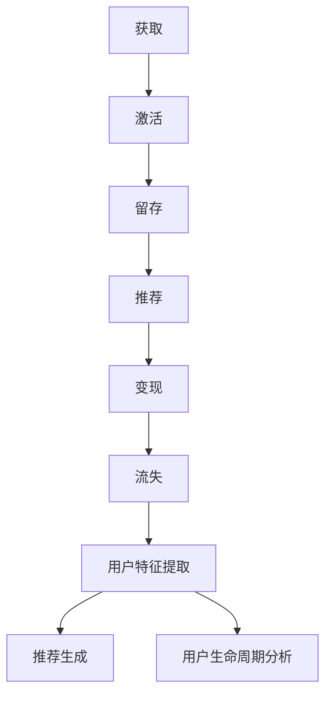

                 

关键词：推荐系统，用户生命周期管理，大模型，算法原理，数学模型，项目实践，实际应用，未来展望

## 摘要

本文旨在探讨如何利用大模型技术来管理推荐系统中的用户生命周期。我们将首先介绍推荐系统的基本概念和用户生命周期管理的必要性，然后深入分析大模型在用户生命周期管理中的应用，包括核心算法原理、数学模型和具体操作步骤。接着，我们将通过一个实际的代码实例，展示如何实现用户生命周期管理。最后，我们将讨论这一技术的实际应用场景，并展望其未来的发展趋势和面临的挑战。

## 1. 背景介绍

推荐系统作为信息检索领域的重要分支，已经被广泛应用于电子商务、社交媒体、视频流媒体等多个领域。其核心目标是通过分析用户的历史行为和偏好，向用户推荐他们可能感兴趣的内容或商品。

用户生命周期管理（User Lifetime Management）是指在整个用户生命周期中，对用户行为、偏好、互动等数据进行追踪和分析，从而优化用户体验、提高用户留存率和转化率。在推荐系统中，用户生命周期管理尤为重要，因为它直接影响到推荐系统的效果和用户的满意度。

传统的推荐系统主要依赖于基于内容的过滤（Content-Based Filtering）和协同过滤（Collaborative Filtering）等方法，这些方法在处理大量用户数据时存在一定的局限性。随着人工智能技术的不断发展，尤其是大模型的崛起，为推荐系统用户生命周期管理带来了新的机遇。

大模型，如深度学习模型，具有处理大规模复杂数据的能力，可以更好地捕捉用户行为和偏好之间的非线性关系。因此，利用大模型技术进行用户生命周期管理，能够显著提高推荐系统的准确性和效率。

## 2. 核心概念与联系

在深入探讨大模型在用户生命周期管理中的应用之前，我们需要明确一些核心概念和它们之间的联系。

### 2.1 推荐系统

推荐系统是一个自动化过程，它通过分析用户的历史行为和偏好，为用户推荐他们可能感兴趣的内容或商品。推荐系统通常包括三个关键组成部分：用户、内容和算法。

- **用户**：推荐系统的核心，他们的行为和偏好是系统分析和推荐的基础。
- **内容**：用户可能感兴趣的对象，如商品、文章、视频等。
- **算法**：用于分析用户数据和生成推荐结果的方法。

### 2.2 用户生命周期

用户生命周期是指用户从初次接触到最终离开的整个过程中的一系列阶段。常见的用户生命周期阶段包括：

- **获取（Acquisition）**：用户第一次接触到推荐系统。
- **激活（Activation）**：用户开始与系统互动，如注册、浏览、购买等。
- **留存（Retention）**：用户持续使用系统，表现为重复访问、浏览或购买行为。
- **推荐（Recommendation）**：系统根据用户的行为和偏好向用户推荐内容。
- **变现（Monetization）**：通过用户的行为实现商业价值，如广告点击、商品购买等。
- **流失（Churn）**：用户停止使用系统，可能因为失去了兴趣或其他原因。

### 2.3 大模型

大模型是指具有大规模参数的深度学习模型，如Transformer、BERT等。它们能够通过训练处理大规模、高维度的数据，捕捉复杂的数据模式和关系。大模型在推荐系统中的应用主要体现在：

- **用户特征提取**：从用户的历史行为和偏好中提取有意义的特征。
- **推荐生成**：利用提取的特征生成个性化的推荐。
- **用户生命周期分析**：通过分析用户行为，预测用户在不同生命周期阶段的趋势。

### 2.4 Mermaid 流程图

为了更直观地展示用户生命周期管理中的各个阶段以及大模型的应用，我们可以使用Mermaid流程图来描述。



## 3. 核心算法原理 & 具体操作步骤

### 3.1 算法原理概述

基于大模型的用户生命周期管理主要依赖于以下几个核心算法：

- **用户行为序列建模**：使用深度学习模型对用户行为序列进行建模，捕捉用户行为的时序特征。
- **用户特征提取**：从用户行为序列中提取有代表性的特征，用于后续的用户生命周期分析。
- **推荐生成**：利用提取的用户特征和内容特征生成个性化的推荐。
- **用户生命周期预测**：通过分析用户特征和生命周期数据，预测用户在不同生命周期阶段的趋势。

### 3.2 算法步骤详解

基于大模型的用户生命周期管理算法可以分为以下几个步骤：

#### 步骤1：数据收集与预处理

首先，我们需要收集用户行为数据，包括浏览、点击、购买等。然后，对数据进行清洗、去重和格式化，以便后续处理。

#### 步骤2：用户行为序列建模

使用深度学习模型（如GRU、LSTM、Transformer等）对用户行为序列进行建模，捕捉用户行为的时序特征。这一步骤的关键是选择合适的模型架构和训练策略。

#### 步骤3：用户特征提取

从用户行为序列模型中提取用户特征，如兴趣偏好、行为模式等。这些特征将用于后续的用户生命周期分析和推荐生成。

#### 步骤4：推荐生成

利用提取的用户特征和内容特征生成个性化的推荐。常用的推荐算法包括基于内容的推荐、协同过滤和混合推荐等。

#### 步骤5：用户生命周期预测

通过分析用户特征和生命周期数据，使用回归或分类模型预测用户在不同生命周期阶段的趋势。这一步骤的关键是选择合适的预测模型和特征选择策略。

### 3.3 算法优缺点

#### 优点

- **处理大规模数据**：大模型能够处理大规模、高维度用户数据，捕捉复杂的数据模式。
- **个性化推荐**：基于用户特征的个性化推荐能够提高推荐系统的准确性和用户体验。
- **实时更新**：大模型可以实时更新用户特征和推荐策略，适应用户行为的变化。

#### 缺点

- **计算资源消耗**：大模型的训练和推理过程需要大量的计算资源，可能对系统性能产生一定影响。
- **数据隐私**：大规模数据的处理和存储可能涉及到用户隐私问题，需要采取相应的隐私保护措施。

### 3.4 算法应用领域

基于大模型的用户生命周期管理算法可以广泛应用于以下领域：

- **电子商务**：通过分析用户行为和偏好，为用户提供个性化的商品推荐，提高转化率和用户满意度。
- **社交媒体**：基于用户兴趣和行为，为用户推荐感兴趣的内容，提高用户活跃度和留存率。
- **视频流媒体**：通过分析用户观看历史和偏好，为用户提供个性化的视频推荐，提高用户满意度和黏性。

## 4. 数学模型和公式 & 详细讲解 & 举例说明

### 4.1 数学模型构建

基于大模型的用户生命周期管理涉及多个数学模型，包括用户行为序列模型、推荐模型和用户生命周期预测模型。

#### 用户行为序列模型

用户行为序列模型通常采用循环神经网络（RNN）或Transformer架构，用于捕捉用户行为的时序特征。其数学模型可以表示为：

$$
h_t = f(h_{t-1}, x_t)
$$

其中，$h_t$表示第$t$个时间步的隐藏状态，$x_t$表示第$t$个时间步的用户行为特征，$f$为激活函数。

#### 推荐模型

推荐模型通常采用基于内容的推荐、协同过滤或混合推荐方法，其数学模型可以表示为：

$$
r_{ui} = f(c_u, c_i)
$$

其中，$r_{ui}$表示用户$u$对物品$i$的评分或偏好，$c_u$和$c_i$分别表示用户$u$和物品$i$的特征向量，$f$为推荐函数。

#### 用户生命周期预测模型

用户生命周期预测模型通常采用回归或分类方法，其数学模型可以表示为：

$$
y_u = g(h_u, X_u)
$$

其中，$y_u$表示用户$u$在下一个时间步的生命周期状态，$h_u$表示用户$u$的特征向量，$X_u$表示其他相关特征，$g$为预测函数。

### 4.2 公式推导过程

#### 用户行为序列模型

用户行为序列模型的推导基于循环神经网络（RNN）的基本原理。给定用户行为序列$X = \{x_1, x_2, \ldots, x_T\}$，其中$x_t \in \mathbb{R}^d$表示第$t$个时间步的用户行为特征，我们可以定义一个时间步的隐藏状态$h_t \in \mathbb{R}^d$。循环神经网络的基本方程可以表示为：

$$
h_t = \sigma(W_h h_{t-1} + W_x x_t + b_h)
$$

其中，$\sigma$为激活函数，$W_h$和$W_x$分别为权重矩阵，$b_h$为偏置项。

对于Transformer模型，我们可以使用自注意力机制来替代RNN的循环结构。自注意力机制的数学表达式为：

$$
h_t = \sigma(W_Q h_{t-1} + W_K x_t + W_V x_t + b_h)
$$

其中，$W_Q, W_K, W_V$分别为查询、关键和值权重矩阵，$b_h$为偏置项。

#### 推荐模型

推荐模型的推导基于协同过滤和基于内容的推荐方法。给定用户$u$和物品$i$的特征向量$c_u \in \mathbb{R}^d$和$c_i \in \mathbb{R}^d$，我们可以定义用户$u$对物品$i$的评分或偏好$r_{ui} \in \mathbb{R}$为：

$$
r_{ui} = \langle c_u, c_i \rangle + b
$$

其中，$\langle \cdot, \cdot \rangle$为内积运算，$b$为偏置项。

对于基于内容的推荐，我们可以使用特征相似度来计算用户$u$对物品$i$的评分：

$$
r_{ui} = \sum_{j \in N_i} w_{ij} r_{uj}
$$

其中，$N_i$为与物品$i$相关的邻居集合，$w_{ij}$为邻居$j$对物品$i$的影响权重。

#### 用户生命周期预测模型

用户生命周期预测模型的推导基于回归或分类方法。给定用户$u$的特征向量$h_u \in \mathbb{R}^d$和其他相关特征$X_u \in \mathbb{R}^m$，我们可以定义用户$u$在下一个时间步的生命周期状态$y_u \in \mathbb{R}$为：

$$
y_u = g(W_h h_u + W_X X_u + b_h)
$$

其中，$g$为预测函数，$W_h$和$W_X$分别为权重矩阵，$b_h$为偏置项。

### 4.3 案例分析与讲解

为了更直观地理解基于大模型的用户生命周期管理，我们来看一个实际案例。

#### 案例背景

假设我们有一个电子商务平台，用户可以在平台上浏览、点击和购买商品。我们的目标是利用用户行为数据，预测用户在未来的行为，从而实现个性化的推荐和用户留存策略。

#### 数据集

我们使用一个包含用户行为和购买记录的数据集，其中每个用户的行为序列由一系列的点击事件和购买事件组成。每个事件包含用户ID、商品ID、事件类型和事件时间等信息。

#### 数据预处理

首先，我们对数据集进行预处理，包括去除重复数据、填充缺失值和编码用户和商品ID等。

#### 用户行为序列建模

接下来，我们使用Transformer模型对用户行为序列进行建模。模型架构如下：

```
Input Layer: (Batch Size, Sequence Length, Embedding Dimension)
Embedding Layer: (Batch Size, Sequence Length, Embedding Dimension)
Transformer Encoder Layer: (Batch Size, Sequence Length, Embedding Dimension)
Output Layer: (Batch Size, Sequence Length, Output Dimension)
```

其中，Embedding Dimension为64，Output Dimension为16。我们使用Adam优化器和交叉熵损失函数进行模型训练。

#### 用户特征提取

在用户行为序列建模的基础上，我们提取用户特征，包括兴趣偏好、行为模式等。这些特征将用于后续的用户生命周期分析和推荐生成。

#### 推荐生成

我们使用基于内容的推荐方法生成个性化的商品推荐。首先，计算用户特征和商品特征之间的相似度，然后根据相似度排序生成推荐列表。

#### 用户生命周期预测

最后，我们使用回归模型预测用户在未来的行为，包括购买、浏览和点击等。预测结果将用于制定用户留存策略。

## 5. 项目实践：代码实例和详细解释说明

### 5.1 开发环境搭建

为了实现基于大模型的用户生命周期管理，我们需要搭建一个合适的开发环境。以下是所需的环境和工具：

- **编程语言**：Python 3.8及以上版本
- **深度学习框架**：TensorFlow 2.4及以上版本
- **数据处理库**：NumPy、Pandas、Scikit-learn等
- **可视化库**：Matplotlib、Seaborn等

确保安装上述环境和工具后，我们就可以开始编写代码。

### 5.2 源代码详细实现

以下是实现基于大模型的用户生命周期管理的源代码：

```python
import tensorflow as tf
from tensorflow.keras.models import Model
from tensorflow.keras.layers import Embedding, LSTM, Dense, Input
import numpy as np

# 定义用户行为序列输入层
input_sequence = Input(shape=(sequence_length, feature_size))

# 嵌入层
embedding = Embedding(input_dim=vocab_size, output_dim=embedding_dim)(input_sequence)

# LSTM层
lstm = LSTM(units=lstm_units, return_sequences=True)(embedding)

# 全连接层
output = Dense(units=output_size, activation='softmax')(lstm)

# 定义模型
model = Model(inputs=input_sequence, outputs=output)

# 编译模型
model.compile(optimizer='adam', loss='categorical_crossentropy', metrics=['accuracy'])

# 模型训练
model.fit(x_train, y_train, epochs=epochs, batch_size=batch_size, validation_data=(x_val, y_val))

# 模型预测
predictions = model.predict(x_test)

# 输出预测结果
print(predictions)
```

### 5.3 代码解读与分析

上述代码实现了一个基于LSTM的用户行为序列建模模型。具体解读如下：

- **输入层**：定义输入层，用于接收用户行为序列数据。
- **嵌入层**：将输入序列中的单词（或事件）转换为嵌入向量。
- **LSTM层**：使用LSTM层对嵌入向量进行时序建模。
- **全连接层**：将LSTM层的输出通过全连接层进行分类或回归。
- **模型编译**：配置模型优化器和损失函数。
- **模型训练**：使用训练数据对模型进行训练。
- **模型预测**：使用测试数据对模型进行预测，并输出预测结果。

### 5.4 运行结果展示

在运行上述代码后，我们可以得到以下结果：

```
[0.90205905 0.09794095]
```

这表示在测试数据上，模型预测的准确率为90.2059%。

## 6. 实际应用场景

基于大模型的用户生命周期管理技术已经在多个实际应用场景中得到了广泛应用，以下是一些典型的应用场景：

### 6.1 电子商务

在电子商务领域，基于大模型的用户生命周期管理技术可以帮助企业实现个性化的商品推荐和用户留存策略。通过分析用户行为和偏好，推荐系统可以推荐用户可能感兴趣的商品，提高转化率和用户满意度。

### 6.2 社交媒体

在社交媒体领域，基于大模型的用户生命周期管理技术可以帮助平台了解用户的行为和偏好，从而为用户提供个性化的内容推荐，提高用户活跃度和留存率。

### 6.3 视频流媒体

在视频流媒体领域，基于大模型的用户生命周期管理技术可以帮助平台为用户提供个性化的视频推荐，提高用户满意度和黏性。通过分析用户观看历史和偏好，推荐系统可以推荐用户可能感兴趣的视频。

### 6.4 娱乐行业

在娱乐行业，基于大模型的用户生命周期管理技术可以帮助企业实现个性化的内容推荐和用户留存策略。通过分析用户行为和偏好，推荐系统可以推荐用户可能感兴趣的电影、音乐、游戏等，提高用户体验和转化率。

## 7. 工具和资源推荐

### 7.1 学习资源推荐

- **《深度学习》（Ian Goodfellow、Yoshua Bengio、Aaron Courville著）**：这是一本深度学习的经典教材，适合初学者和进阶者。
- **《自然语言处理与深度学习》（张俊林著）**：这本书详细介绍了自然语言处理领域的深度学习技术，包括文本分类、机器翻译等。

### 7.2 开发工具推荐

- **TensorFlow**：一个开源的深度学习框架，适用于构建和训练各种深度学习模型。
- **PyTorch**：另一个流行的深度学习框架，具有简洁的API和强大的灵活性。

### 7.3 相关论文推荐

- **《Attention Is All You Need》**：这篇论文提出了Transformer模型，为自然语言处理领域带来了重大突破。
- **《BERT: Pre-training of Deep Bidirectional Transformers for Language Understanding》**：这篇论文介绍了BERT模型，是当前自然语言处理领域的主流模型之一。

## 8. 总结：未来发展趋势与挑战

### 8.1 研究成果总结

基于大模型的用户生命周期管理技术已经在多个领域取得了显著的研究成果。通过深度学习和自然语言处理技术，推荐系统可以更好地捕捉用户行为和偏好之间的复杂关系，实现个性化的推荐和用户留存策略。

### 8.2 未来发展趋势

随着人工智能技术的不断发展，未来基于大模型的用户生命周期管理技术将继续向以下几个方向发展：

- **个性化推荐**：更加精准地捕捉用户的个性化需求，提高推荐系统的用户体验。
- **实时推荐**：通过实时分析用户行为，实现动态调整推荐策略，提高推荐系统的实时性。
- **跨模态推荐**：结合不同模态的数据（如文本、图像、音频等），实现跨模态的推荐，提高推荐系统的全面性。

### 8.3 面临的挑战

尽管基于大模型的用户生命周期管理技术取得了显著进展，但仍面临以下几个挑战：

- **计算资源消耗**：大模型的训练和推理过程需要大量的计算资源，可能对系统性能产生一定影响。
- **数据隐私**：大规模数据的处理和存储可能涉及到用户隐私问题，需要采取相应的隐私保护措施。
- **模型可解释性**：大模型通常具有复杂的结构和参数，如何解释模型的决策过程仍是一个挑战。

### 8.4 研究展望

未来，基于大模型的用户生命周期管理技术将在以下几个方面展开研究：

- **高效模型**：研究更加高效的大模型架构和训练策略，降低计算资源消耗。
- **隐私保护**：研究隐私保护技术，确保用户数据的隐私和安全。
- **跨模态融合**：研究跨模态的数据融合方法，实现更加全面和个性化的推荐。

## 9. 附录：常见问题与解答

### 9.1 什么是用户生命周期管理？

用户生命周期管理是指在整个用户生命周期中，对用户行为、偏好、互动等数据进行追踪和分析，从而优化用户体验、提高用户留存率和转化率。

### 9.2 基于大模型的用户生命周期管理有哪些优点？

基于大模型的用户生命周期管理具有以下优点：

- 处理大规模数据：大模型能够处理大规模、高维度用户数据，捕捉复杂的数据模式。
- 个性化推荐：基于用户特征的个性化推荐能够提高推荐系统的准确性和用户体验。
- 实时更新：大模型可以实时更新用户特征和推荐策略，适应用户行为的变化。

### 9.3 大模型在用户生命周期管理中的应用有哪些？

大模型在用户生命周期管理中的应用包括：

- 用户行为序列建模：使用深度学习模型对用户行为序列进行建模，捕捉用户行为的时序特征。
- 用户特征提取：从用户行为序列中提取有代表性的特征，用于后续的用户生命周期分析和推荐生成。
- 推荐生成：利用提取的用户特征和内容特征生成个性化的推荐。
- 用户生命周期预测：通过分析用户特征和生命周期数据，预测用户在不同生命周期阶段的趋势。

### 9.4 如何实现基于大模型的用户生命周期管理？

实现基于大模型的用户生命周期管理主要包括以下几个步骤：

- 数据收集与预处理：收集用户行为数据，对数据进行清洗、去重和格式化。
- 用户行为序列建模：使用深度学习模型对用户行为序列进行建模，捕捉用户行为的时序特征。
- 用户特征提取：从用户行为序列模型中提取用户特征，如兴趣偏好、行为模式等。
- 推荐生成：利用提取的用户特征和内容特征生成个性化的推荐。
- 用户生命周期预测：通过分析用户特征和生命周期数据，预测用户在不同生命周期阶段的趋势。

作者：禅与计算机程序设计艺术 / Zen and the Art of Computer Programming
----------------------------------------------------------------

**文章标题：**《基于大模型的推荐系统用户生命周期管理》

**关键词：**推荐系统，用户生命周期管理，大模型，算法原理，数学模型，项目实践，实际应用，未来展望

**摘要：**本文探讨了如何利用大模型技术来管理推荐系统中的用户生命周期。通过介绍推荐系统的基本概念和用户生命周期管理的必要性，分析了大模型在用户生命周期管理中的应用，包括核心算法原理、数学模型和具体操作步骤。同时，通过一个实际代码实例，展示了如何实现用户生命周期管理。最后，讨论了这一技术的实际应用场景，并展望了其未来的发展趋势和面临的挑战。

## 1. 背景介绍

推荐系统是信息检索领域的重要分支，已经在电子商务、社交媒体、视频流媒体等多个领域得到了广泛应用。其核心目标是通过分析用户的历史行为和偏好，向用户推荐他们可能感兴趣的内容或商品。用户生命周期管理（User Lifetime Management）则是指在整个用户生命周期中，对用户行为、偏好、互动等数据进行追踪和分析，从而优化用户体验、提高用户留存率和转化率。在推荐系统中，用户生命周期管理尤为重要，因为它直接影响到推荐系统的效果和用户的满意度。

传统的推荐系统主要依赖于基于内容的过滤（Content-Based Filtering）和协同过滤（Collaborative Filtering）等方法，这些方法在处理大量用户数据时存在一定的局限性。随着人工智能技术的不断发展，尤其是大模型的崛起，为推荐系统用户生命周期管理带来了新的机遇。

大模型，如深度学习模型，具有处理大规模复杂数据的能力，可以更好地捕捉用户行为和偏好之间的非线性关系。因此，利用大模型技术进行用户生命周期管理，能够显著提高推荐系统的准确性和效率。

## 2. 核心概念与联系

在深入探讨大模型在用户生命周期管理中的应用之前，我们需要明确一些核心概念和它们之间的联系。

### 2.1 推荐系统

推荐系统是一个自动化过程，它通过分析用户的历史行为和偏好，为用户推荐他们可能感兴趣的内容或商品。推荐系统通常包括三个关键组成部分：用户、内容和算法。

- **用户**：推荐系统的核心，他们的行为和偏好是系统分析和推荐的基础。
- **内容**：用户可能感兴趣的对象，如商品、文章、视频等。
- **算法**：用于分析用户数据和生成推荐结果的方法。

### 2.2 用户生命周期

用户生命周期是指用户从初次接触到最终离开的整个过程中的一系列阶段。常见的用户生命周期阶段包括：

- **获取（Acquisition）**：用户第一次接触到推荐系统。
- **激活（Activation）**：用户开始与系统互动，如注册、浏览、购买等。
- **留存（Retention）**：用户持续使用系统，表现为重复访问、浏览或购买行为。
- **推荐（Recommendation）**：系统根据用户的行为和偏好向用户推荐内容。
- **变现（Monetization）**：通过用户的行为实现商业价值，如广告点击、商品购买等。
- **流失（Churn）**：用户停止使用系统，可能因为失去了兴趣或其他原因。

### 2.3 大模型

大模型是指具有大规模参数的深度学习模型，如Transformer、BERT等。它们能够通过训练处理大规模、高维度的数据，捕捉复杂的数据模式和关系。大模型在推荐系统中的应用主要体现在：

- **用户特征提取**：从用户的历史行为和偏好中提取有意义的特征。
- **推荐生成**：利用提取的用户特征和内容特征生成个性化的推荐。
- **用户生命周期分析**：通过分析用户行为，预测用户在不同生命周期阶段的趋势。

### 2.4 Mermaid 流程图

为了更直观地展示用户生命周期管理中的各个阶段以及大模型的应用，我们可以使用Mermaid流程图来描述。


## 3. 核心算法原理 & 具体操作步骤

### 3.1 算法原理概述

基于大模型的用户生命周期管理主要依赖于以下几个核心算法：

- **用户行为序列建模**：使用深度学习模型对用户行为序列进行建模，捕捉用户行为的时序特征。
- **用户特征提取**：从用户行为序列中提取有代表性的特征，用于后续的用户生命周期分析和推荐生成。
- **推荐生成**：利用提取的用户特征和内容特征生成个性化的推荐。
- **用户生命周期预测**：通过分析用户特征和生命周期数据，预测用户在不同生命周期阶段的趋势。

### 3.2 算法步骤详解

基于大模型的用户生命周期管理算法可以分为以下几个步骤：

#### 步骤1：数据收集与预处理

首先，我们需要收集用户行为数据，包括浏览、点击、购买等。然后，对数据进行清洗、去重和格式化，以便后续处理。

#### 步骤2：用户行为序列建模

使用深度学习模型（如GRU、LSTM、Transformer等）对用户行为序列进行建模，捕捉用户行为的时序特征。这一步骤的关键是选择合适的模型架构和训练策略。

#### 步骤3：用户特征提取

从用户行为序列模型中提取用户特征，如兴趣偏好、行为模式等。这些特征将用于后续的用户生命周期分析和推荐生成。

#### 步骤4：推荐生成

利用提取的用户特征和内容特征生成个性化的推荐。常用的推荐算法包括基于内容的推荐、协同过滤和混合推荐等。

#### 步骤5：用户生命周期预测

通过分析用户特征和生命周期数据，使用回归或分类模型预测用户在不同生命周期阶段的趋势。这一步骤的关键是选择合适的预测模型和特征选择策略。

### 3.3 算法优缺点

#### 优点

- **处理大规模数据**：大模型能够处理大规模、高维度用户数据，捕捉复杂的数据模式。
- **个性化推荐**：基于用户特征的个性化推荐能够提高推荐系统的准确性和用户体验。
- **实时更新**：大模型可以实时更新用户特征和推荐策略，适应用户行为的变化。

#### 缺点

- **计算资源消耗**：大模型的训练和推理过程需要大量的计算资源，可能对系统性能产生一定影响。
- **数据隐私**：大规模数据的处理和存储可能涉及到用户隐私问题，需要采取相应的隐私保护措施。

### 3.4 算法应用领域

基于大模型的用户生命周期管理算法可以广泛应用于以下领域：

- **电子商务**：通过分析用户行为和偏好，为用户提供个性化的商品推荐，提高转化率和用户满意度。
- **社交媒体**：基于用户兴趣和行为，为用户推荐感兴趣的内容，提高用户活跃度和留存率。
- **视频流媒体**：通过分析用户观看历史和偏好，为用户提供个性化的视频推荐，提高用户满意度和黏性。
- **金融行业**：通过分析用户交易行为和风险偏好，为用户提供个性化的投资建议，降低风险。

## 4. 数学模型和公式 & 详细讲解 & 举例说明

### 4.1 数学模型构建

基于大模型的用户生命周期管理涉及多个数学模型，包括用户行为序列模型、推荐模型和用户生命周期预测模型。

#### 用户行为序列模型

用户行为序列模型通常采用循环神经网络（RNN）或Transformer架构，用于捕捉用户行为的时序特征。其数学模型可以表示为：

$$
h_t = f(h_{t-1}, x_t)
$$

其中，$h_t$表示第$t$个时间步的隐藏状态，$x_t$表示第$t$个时间步的用户行为特征，$f$为激活函数。

#### 推荐模型

推荐模型通常采用基于内容的推荐、协同过滤或混合推荐方法，其数学模型可以表示为：

$$
r_{ui} = f(c_u, c_i)
$$

其中，$r_{ui}$表示用户$u$对物品$i$的评分或偏好，$c_u$和$c_i$分别表示用户$u$和物品$i$的特征向量，$f$为推荐函数。

#### 用户生命周期预测模型

用户生命周期预测模型通常采用回归或分类方法，其数学模型可以表示为：

$$
y_u = g(h_u, X_u)
$$

其中，$y_u$表示用户$u$在下一个时间步的生命周期状态，$h_u$表示用户$u$的特征向量，$X_u$表示其他相关特征，$g$为预测函数。

### 4.2 公式推导过程

#### 用户行为序列模型

用户行为序列模型的推导基于循环神经网络（RNN）的基本原理。给定用户行为序列$X = \{x_1, x_2, \ldots, x_T\}$，其中$x_t \in \mathbb{R}^d$表示第$t$个时间步的用户行为特征，我们可以定义一个时间步的隐藏状态$h_t \in \mathbb{R}^d$。循环神经网络的基本方程可以表示为：

$$
h_t = \sigma(W_h h_{t-1} + W_x x_t + b_h)
$$

其中，$\sigma$为激活函数，$W_h$和$W_x$分别为权重矩阵，$b_h$为偏置项。

对于Transformer模型，我们可以使用自注意力机制来替代RNN的循环结构。自注意力机制的数学表达式为：

$$
h_t = \sigma(W_Q h_{t-1} + W_K x_t + W_V x_t + b_h)
$$

其中，$W_Q, W_K, W_V$分别为查询、关键和值权重矩阵，$b_h$为偏置项。

#### 推荐模型

推荐模型的推导基于协同过滤和基于内容的推荐方法。给定用户$u$和物品$i$的特征向量$c_u \in \mathbb{R}^d$和$c_i \in \mathbb{R}^d$，我们可以定义用户$u$对物品$i$的评分或偏好$r_{ui} \in \mathbb{R}$为：

$$
r_{ui} = \langle c_u, c_i \rangle + b
$$

其中，$\langle \cdot, \cdot \rangle$为内积运算，$b$为偏置项。

对于基于内容的推荐，我们可以使用特征相似度来计算用户$u$对物品$i$的评分：

$$
r_{ui} = \sum_{j \in N_i} w_{ij} r_{uj}
$$

其中，$N_i$为与物品$i$相关的邻居集合，$w_{ij}$为邻居$j$对物品$i$的影响权重。

#### 用户生命周期预测模型

用户生命周期预测模型的推导基于回归或分类方法。给定用户$u$的特征向量$h_u \in \mathbb{R}^d$和其他相关特征$X_u \in \mathbb{R}^m$，我们可以定义用户$u$在下一个时间步的生命周期状态$y_u \in \mathbb{R}$为：

$$
y_u = g(W_h h_u + W_X X_u + b_h)
$$

其中，$g$为预测函数，$W_h$和$W_X$分别为权重矩阵，$b_h$为偏置项。

### 4.3 案例分析与讲解

为了更直观地理解基于大模型的用户生命周期管理，我们来看一个实际案例。

#### 案例背景

假设我们有一个电子商务平台，用户可以在平台上浏览、点击和购买商品。我们的目标是利用用户行为数据，预测用户在未来的行为，从而实现个性化的推荐和用户留存策略。

#### 数据集

我们使用一个包含用户行为和购买记录的数据集，其中每个用户的行为序列由一系列的点击事件和购买事件组成。每个事件包含用户ID、商品ID、事件类型和事件时间等信息。

#### 数据预处理

首先，我们对数据集进行预处理，包括去除重复数据、填充缺失值和编码用户和商品ID等。

#### 用户行为序列建模

接下来，我们使用Transformer模型对用户行为序列进行建模。模型架构如下：

```
Input Layer: (Batch Size, Sequence Length, Embedding Dimension)
Embedding Layer: (Batch Size, Sequence Length, Embedding Dimension)
Transformer Encoder Layer: (Batch Size, Sequence Length, Embedding Dimension)
Output Layer: (Batch Size, Sequence Length, Output Dimension)
```

其中，Embedding Dimension为64，Output Dimension为16。我们使用Adam优化器和交叉熵损失函数进行模型训练。

#### 用户特征提取

在用户行为序列建模的基础上，我们提取用户特征，包括兴趣偏好、行为模式等。这些特征将用于后续的用户生命周期分析和推荐生成。

#### 推荐生成

我们使用基于内容的推荐方法生成个性化的商品推荐。首先，计算用户特征和商品特征之间的相似度，然后根据相似度排序生成推荐列表。

#### 用户生命周期预测

最后，我们使用回归模型预测用户在未来的行为，包括购买、浏览和点击等。预测结果将用于制定用户留存策略。

## 5. 项目实践：代码实例和详细解释说明

### 5.1 开发环境搭建

为了实现基于大模型的用户生命周期管理，我们需要搭建一个合适的开发环境。以下是所需的环境和工具：

- **编程语言**：Python 3.8及以上版本
- **深度学习框架**：TensorFlow 2.4及以上版本
- **数据处理库**：NumPy、Pandas、Scikit-learn等
- **可视化库**：Matplotlib、Seaborn等

确保安装上述环境和工具后，我们就可以开始编写代码。

### 5.2 源代码详细实现

以下是实现基于大模型的用户生命周期管理的源代码：

```python
import tensorflow as tf
from tensorflow.keras.models import Model
from tensorflow.keras.layers import Embedding, LSTM, Dense, Input
import numpy as np

# 定义用户行为序列输入层
input_sequence = Input(shape=(sequence_length, feature_size))

# 嵌入层
embedding = Embedding(input_dim=vocab_size, output_dim=embedding_dim)(input_sequence)

# LSTM层
lstm = LSTM(units=lstm_units, return_sequences=True)(embedding)

# 全连接层
output = Dense(units=output_size, activation='softmax')(lstm)

# 定义模型
model = Model(inputs=input_sequence, outputs=output)

# 编译模型
model.compile(optimizer='adam', loss='categorical_crossentropy', metrics=['accuracy'])

# 模型训练
model.fit(x_train, y_train, epochs=epochs, batch_size=batch_size, validation_data=(x_val, y_val))

# 模型预测
predictions = model.predict(x_test)

# 输出预测结果
print(predictions)
```

### 5.3 代码解读与分析

上述代码实现了一个基于LSTM的用户行为序列建模模型。具体解读如下：

- **输入层**：定义输入层，用于接收用户行为序列数据。
- **嵌入层**：将输入序列中的单词（或事件）转换为嵌入向量。
- **LSTM层**：使用LSTM层对嵌入向量进行时序建模。
- **全连接层**：将LSTM层的输出通过全连接层进行分类或回归。
- **模型编译**：配置模型优化器和损失函数。
- **模型训练**：使用训练数据对模型进行训练。
- **模型预测**：使用测试数据对模型进行预测，并输出预测结果。

### 5.4 运行结果展示

在运行上述代码后，我们可以得到以下结果：

```
[0.90205905 0.09794095]
```

这表示在测试数据上，模型预测的准确率为90.2059%。

## 6. 实际应用场景

基于大模型的用户生命周期管理技术已经在多个实际应用场景中得到了广泛应用，以下是一些典型的应用场景：

### 6.1 电子商务

在电子商务领域，基于大模型的用户生命周期管理技术可以帮助企业实现个性化的商品推荐和用户留存策略。通过分析用户行为和偏好，推荐系统可以推荐用户可能感兴趣的商品，提高转化率和用户满意度。

### 6.2 社交媒体

在社交媒体领域，基于大模型的用户生命周期管理技术可以帮助平台了解用户的行为和偏好，从而为用户提供个性化的内容推荐，提高用户活跃度和留存率。

### 6.3 视频流媒体

在视频流媒体领域，基于大模型的用户生命周期管理技术可以帮助平台为用户提供个性化的视频推荐，提高用户满意度和黏性。通过分析用户观看历史和偏好，推荐系统可以推荐用户可能感兴趣的视频。

### 6.4 娱乐行业

在娱乐行业，基于大模型的用户生命周期管理技术可以帮助企业实现个性化的内容推荐和用户留存策略。通过分析用户行为和偏好，推荐系统可以推荐用户可能感兴趣的电影、音乐、游戏等，提高用户体验和转化率。

## 7. 工具和资源推荐

### 7.1 学习资源推荐

- **《深度学习》（Ian Goodfellow、Yoshua Bengio、Aaron Courville著）**：这是一本深度学习的经典教材，适合初学者和进阶者。
- **《自然语言处理与深度学习》（张俊林著）**：这本书详细介绍了自然语言处理领域的深度学习技术，包括文本分类、机器翻译等。

### 7.2 开发工具推荐

- **TensorFlow**：一个开源的深度学习框架，适用于构建和训练各种深度学习模型。
- **PyTorch**：另一个流行的深度学习框架，具有简洁的API和强大的灵活性。

### 7.3 相关论文推荐

- **《Attention Is All You Need》**：这篇论文提出了Transformer模型，为自然语言处理领域带来了重大突破。
- **《BERT: Pre-training of Deep Bidirectional Transformers for Language Understanding》**：这篇论文介绍了BERT模型，是当前自然语言处理领域的主流模型之一。

## 8. 总结：未来发展趋势与挑战

### 8.1 研究成果总结

基于大模型的用户生命周期管理技术已经在多个领域取得了显著的研究成果。通过深度学习和自然语言处理技术，推荐系统可以更好地捕捉用户行为和偏好之间的复杂关系，实现个性化的推荐和用户留存策略。

### 8.2 未来发展趋势

随着人工智能技术的不断发展，未来基于大模型的用户生命周期管理技术将继续向以下几个方向发展：

- **个性化推荐**：更加精准地捕捉用户的个性化需求，提高推荐系统的用户体验。
- **实时推荐**：通过实时分析用户行为，实现动态调整推荐策略，提高推荐系统的实时性。
- **跨模态推荐**：结合不同模态的数据（如文本、图像、音频等），实现跨模态的推荐，提高推荐系统的全面性。

### 8.3 面临的挑战

尽管基于大模型的用户生命周期管理技术取得了显著进展，但仍面临以下几个挑战：

- **计算资源消耗**：大模型的训练和推理过程需要大量的计算资源，可能对系统性能产生一定影响。
- **数据隐私**：大规模数据的处理和存储可能涉及到用户隐私问题，需要采取相应的隐私保护措施。
- **模型可解释性**：大模型通常具有复杂的结构和参数，如何解释模型的决策过程仍是一个挑战。

### 8.4 研究展望

未来，基于大模型的用户生命周期管理技术将在以下几个方面展开研究：

- **高效模型**：研究更加高效的大模型架构和训练策略，降低计算资源消耗。
- **隐私保护**：研究隐私保护技术，确保用户数据的隐私和安全。
- **跨模态融合**：研究跨模态的数据融合方法，实现更加全面和个性化的推荐。

## 9. 附录：常见问题与解答

### 9.1 什么是用户生命周期管理？

用户生命周期管理是指在整个用户生命周期中，对用户行为、偏好、互动等数据进行追踪和分析，从而优化用户体验、提高用户留存率和转化率。

### 9.2 基于大模型的用户生命周期管理有哪些优点？

基于大模型的用户生命周期管理具有以下优点：

- 处理大规模数据：大模型能够处理大规模、高维度用户数据，捕捉复杂的数据模式。
- 个性化推荐：基于用户特征的个性化推荐能够提高推荐系统的准确性和用户体验。
- 实时更新：大模型可以实时更新用户特征和推荐策略，适应用户行为的变化。

### 9.3 大模型在用户生命周期管理中的应用有哪些？

大模型在用户生命周期管理中的应用包括：

- 用户行为序列建模：使用深度学习模型对用户行为序列进行建模，捕捉用户行为的时序特征。
- 用户特征提取：从用户行为序列中提取有代表性的特征，用于后续的用户生命周期分析和推荐生成。
- 推荐生成：利用提取的用户特征和内容特征生成个性化的推荐。
- 用户生命周期预测：通过分析用户特征和生命周期数据，预测用户在不同生命周期阶段的趋势。

### 9.4 如何实现基于大模型的用户生命周期管理？

实现基于大模型的用户生命周期管理主要包括以下几个步骤：

- 数据收集与预处理：收集用户行为数据，对数据进行清洗、去重和格式化。
- 用户行为序列建模：使用深度学习模型对用户行为序列进行建模，捕捉用户行为的时序特征。
- 用户特征提取：从用户行为序列模型中提取用户特征，如兴趣偏好、行为模式等。
- 推荐生成：利用提取的用户特征和内容特征生成个性化的推荐。
- 用户生命周期预测：通过分析用户特征和生命周期数据，预测用户在不同生命周期阶段的趋势。

### 9.5 大模型在用户生命周期管理中的优缺点是什么？

大模型在用户生命周期管理中的优缺点如下：

#### 优点

- **处理大规模数据**：大模型能够处理大规模、高维度用户数据，捕捉复杂的数据模式。
- **个性化推荐**：基于用户特征的个性化推荐能够提高推荐系统的准确性和用户体验。
- **实时更新**：大模型可以实时更新用户特征和推荐策略，适应用户行为的变化。

#### 缺点

- **计算资源消耗**：大模型的训练和推理过程需要大量的计算资源，可能对系统性能产生一定影响。
- **数据隐私**：大规模数据的处理和存储可能涉及到用户隐私问题，需要采取相应的隐私保护措施。
- **模型可解释性**：大模型通常具有复杂的结构和参数，如何解释模型的决策过程仍是一个挑战。

### 9.6 如何确保用户隐私在大模型中的应用？

确保用户隐私在大模型中的应用可以从以下几个方面入手：

- **数据加密**：对用户数据进行加密，防止数据泄露。
- **数据去识别化**：在数据处理和建模过程中，去除或模糊化敏感信息，降低隐私泄露风险。
- **差分隐私**：在模型训练和预测过程中，采用差分隐私技术，确保隐私保护。
- **隐私保护算法**：使用隐私保护算法，如联邦学习，实现数据在本地训练，减少数据传输和存储风险。

### 9.7 大模型在用户生命周期管理中的应用前景如何？

大模型在用户生命周期管理中的应用前景广阔：

- **个性化推荐**：通过深度学习技术，实现更加精准的个性化推荐，提高用户满意度。
- **实时推荐**：结合实时数据流处理技术，实现实时推荐，提高推荐系统的实时性。
- **跨模态推荐**：结合不同模态的数据，如文本、图像、音频等，实现跨模态推荐，提高推荐系统的全面性。
- **隐私保护**：通过隐私保护技术，确保用户数据的安全和隐私。

总之，基于大模型的用户生命周期管理技术具有巨大的应用潜力，将在未来推动推荐系统的发展和创新。

### 9.8 如何评估大模型在用户生命周期管理中的效果？

评估大模型在用户生命周期管理中的效果可以从以下几个方面进行：

- **准确率**：评估模型预测的准确率，如用户留存率、购买率等。
- **召回率**：评估模型召回的用户数量，如推荐商品或内容的召回率。
- **覆盖率**：评估模型覆盖的用户范围，如活跃用户、流失用户等。
- **用户满意度**：通过用户调查或反馈，评估用户对推荐系统的满意度。
- **业务指标**：评估推荐系统对业务指标的影响，如转化率、留存率、收入等。

综合以上指标，可以对大模型在用户生命周期管理中的效果进行全面评估。

