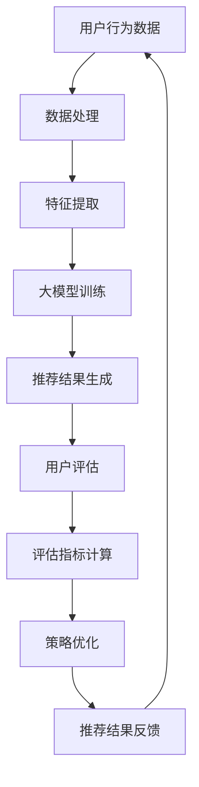

                 

### 文章标题

### 基于大模型的推荐系统长期用户价值评估

> 关键词：推荐系统、大模型、长期用户价值、评估指标、算法优化、应用实践

> 摘要：本文探讨了基于大模型的推荐系统在长期用户价值评估方面的重要性和挑战。首先介绍了推荐系统的基本概念和传统方法，然后分析了大模型在推荐系统中的应用及其优势。接着，详细讨论了评估长期用户价值的关键指标，包括用户活跃度、留存率、转化率和推荐满意度。最后，通过具体案例和实际应用，展示了大模型在推荐系统中的有效性和潜力，并展望了未来的发展趋势和挑战。

---

### 1. 背景介绍

随着互联网和大数据技术的飞速发展，推荐系统在电子商务、社交媒体、在线视频、新闻资讯等领域得到了广泛应用。推荐系统旨在根据用户的兴趣和行为，向用户个性化推荐相关信息或商品，从而提高用户的满意度和转化率。

传统的推荐系统主要基于基于内容过滤、协同过滤和混合方法等，这些方法在一定程度上能够满足用户的需求。然而，随着用户数据的爆炸性增长和用户行为的多样性，传统推荐系统面临着数据稀疏性、冷启动问题和多样性挑战等问题。

为了解决这些问题，近年来，大模型技术逐渐在推荐系统中得到应用。大模型，如深度学习模型、自然语言处理模型和图神经网络模型等，通过处理大规模用户数据，能够更好地捕捉用户兴趣和偏好，提高推荐的准确性和多样性。

长期用户价值评估是推荐系统的重要研究方向。评估长期用户价值不仅有助于优化推荐策略，提高用户的留存率和转化率，还可以为业务决策提供有力支持。然而，长期用户价值评估面临着数据稀疏性、动态性和复杂性等挑战，需要引入先进的大模型技术进行有效应对。

本文旨在探讨基于大模型的推荐系统在长期用户价值评估方面的应用，分析其核心概念、算法原理和实际效果，为推荐系统的优化和发展提供参考。

### 2. 核心概念与联系

#### 2.1 推荐系统基本概念

推荐系统是一种信息过滤技术，通过分析用户的历史行为和兴趣，向用户推荐可能感兴趣的信息或商品。推荐系统主要包括以下几个基本概念：

- **用户**：推荐系统中的用户，可以是真实用户或虚拟用户。
- **物品**：推荐系统中的物品，可以是商品、新闻、视频等。
- **评分**：用户对物品的评价，可以是数值评分或标签。
- **交互数据**：用户与物品的交互数据，如点击、购买、收藏等。

#### 2.2 传统推荐方法

传统的推荐方法主要包括以下几种：

- **基于内容的推荐**：根据用户的兴趣和偏好，从物品的内容特征中提取关键词，然后根据用户和物品的关键词匹配度进行推荐。
- **协同过滤推荐**：通过分析用户之间的相似度，将相似用户的评分预测给未评分的物品，或者将用户未评分的物品推荐给相似用户。
- **混合推荐**：结合多种推荐方法，以提高推荐的准确性和多样性。

#### 2.3 大模型在推荐系统中的应用

大模型，如深度学习模型、自然语言处理模型和图神经网络模型等，在推荐系统中具有以下优势：

- **处理大规模数据**：大模型能够处理大规模的用户数据和物品数据，从而提高推荐的准确性和多样性。
- **捕捉复杂关系**：大模型能够捕捉用户与物品之间的复杂关系，如语义关系、社会关系等，从而提高推荐的精度。
- **自适应学习**：大模型具有自适应学习能力，能够根据用户行为的动态变化调整推荐策略。

#### 2.4 长期用户价值评估指标

长期用户价值评估指标主要包括以下几种：

- **用户活跃度**：用户在推荐系统中的活跃程度，如点击、浏览、购买等行为。
- **留存率**：用户在一段时间内持续使用推荐系统的比例。
- **转化率**：用户在推荐系统中的购买或转化比例。
- **推荐满意度**：用户对推荐结果的满意度。

#### 2.5 Mermaid 流程图



### 3. 核心算法原理 & 具体操作步骤

#### 3.1 大模型选择

在推荐系统中，大模型的选择至关重要。本文主要介绍以下几种大模型：

- **深度学习模型**：如卷积神经网络（CNN）、循环神经网络（RNN）、长短期记忆网络（LSTM）等。
- **自然语言处理模型**：如词向量（Word2Vec）、生成对抗网络（GAN）、文本生成模型（Transformer）等。
- **图神经网络模型**：如图卷积网络（GCN）、图注意力网络（GAT）、图生成模型（GraphRNN）等。

#### 3.2 数据处理

数据处理是推荐系统的重要环节。具体步骤如下：

1. **数据采集**：收集用户行为数据、物品特征数据等。
2. **数据清洗**：去除重复、错误和异常数据，处理缺失值。
3. **数据预处理**：将数据转换为模型可接受的格式，如数值化、归一化等。

#### 3.3 特征提取

特征提取是提高推荐系统性能的关键步骤。本文主要介绍以下几种特征提取方法：

1. **用户特征**：包括用户的基本信息、浏览历史、购买历史等。
2. **物品特征**：包括物品的属性、标签、分类等。
3. **交互特征**：包括用户与物品的交互行为，如点击、收藏、购买等。

#### 3.4 大模型训练

大模型训练是推荐系统的核心步骤。具体步骤如下：

1. **模型选择**：根据推荐任务的特点选择合适的大模型。
2. **模型训练**：使用预处理后的数据对模型进行训练，调整模型参数。
3. **模型评估**：使用验证集对模型进行评估，调整模型参数。

#### 3.5 推荐结果生成

推荐结果生成是推荐系统的输出部分。具体步骤如下：

1. **特征提取**：提取用户和物品的特征向量。
2. **模型预测**：使用训练好的大模型预测用户对物品的喜好程度。
3. **排序和筛选**：根据预测结果对物品进行排序和筛选，生成推荐列表。

#### 3.6 用户评估

用户评估是推荐系统的反馈环节。具体步骤如下：

1. **用户反馈**：收集用户对推荐结果的反馈，如满意度、点击率等。
2. **评估指标计算**：计算评估指标，如用户活跃度、留存率、转化率等。
3. **策略优化**：根据评估结果调整推荐策略，提高用户价值。

### 4. 数学模型和公式 & 详细讲解 & 举例说明

#### 4.1 用户活跃度

用户活跃度是评估用户在推荐系统中活跃程度的重要指标。本文采用以下公式计算用户活跃度：

$$
U_{\text{active}} = \frac{N_{\text{actions}}}{T_{\text{interval}}}
$$

其中，$N_{\text{actions}}$ 表示用户在一段时间内的交互次数，$T_{\text{interval}}$ 表示时间间隔。

**举例说明**：

假设用户A在一个月内的交互次数为100次，时间间隔为30天，则用户A的用户活跃度为：

$$
U_{\text{active}} = \frac{100}{30} \approx 3.33
$$

#### 4.2 留存率

留存率是评估用户在推荐系统中持续使用比例的重要指标。本文采用以下公式计算留存率：

$$
R_{\text{retention}} = \frac{N_{\text{retained}}}{N_{\text{registered}}}
$$

其中，$N_{\text{retained}}$ 表示一段时间内留存的用户数，$N_{\text{registered}}$ 表示注册的用户数。

**举例说明**：

假设一个推荐系统在一个月内有1000个注册用户，其中800个用户在一个月内持续使用，则留存率为：

$$
R_{\text{retention}} = \frac{800}{1000} = 0.8
$$

#### 4.3 转化率

转化率是评估用户在推荐系统中实现购买或转化的比例。本文采用以下公式计算转化率：

$$
R_{\text{conversion}} = \frac{N_{\text{converted}}}{N_{\text{recommended}}}
$$

其中，$N_{\text{converted}}$ 表示实现转化的用户数，$N_{\text{recommended}}$ 表示推荐的用户数。

**举例说明**：

假设一个推荐系统向100个用户推荐商品，其中有20个用户购买了推荐的商品，则转化率为：

$$
R_{\text{conversion}} = \frac{20}{100} = 0.2
$$

#### 4.4 推荐满意度

推荐满意度是评估用户对推荐结果满意程度的重要指标。本文采用以下公式计算推荐满意度：

$$
S_{\text{满意度}} = \frac{N_{\text{satisfied}}}{N_{\text{recommended}}}
$$

其中，$N_{\text{satisfied}}$ 表示对推荐结果满意的用户数，$N_{\text{recommended}}$ 表示推荐的用户数。

**举例说明**：

假设一个推荐系统向100个用户推荐商品，其中有60个用户对推荐结果表示满意，则推荐满意度为：

$$
S_{\text{满意度}} = \frac{60}{100} = 0.6
$$

### 5. 项目实践：代码实例和详细解释说明

#### 5.1 开发环境搭建

在搭建开发环境之前，请确保已经安装了Python和Anaconda。然后，通过以下命令安装必要的库：

```python
!pip install numpy pandas matplotlib scikit-learn tensorflow
```

#### 5.2 源代码详细实现

以下是一个简单的基于大模型的推荐系统示例代码。该示例使用TensorFlow和Keras构建深度学习模型，并使用用户和物品的特征进行训练和预测。

```python
import numpy as np
import pandas as pd
import matplotlib.pyplot as plt
from sklearn.model_selection import train_test_split
from tensorflow.keras.models import Model
from tensorflow.keras.layers import Input, Embedding, LSTM, Dense

# 加载数据
data = pd.read_csv('data.csv')
users = data['user_id'].unique()
items = data['item_id'].unique()

# 构建用户和物品的特征矩阵
user_features = data.groupby('user_id').mean().T
item_features = data.groupby('item_id').mean().T

# 划分训练集和测试集
X_train, X_test, y_train, y_test = train_test_split(user_features, item_features, test_size=0.2, random_state=42)

# 构建深度学习模型
input_user = Input(shape=(X_train.shape[1],))
input_item = Input(shape=(X_test.shape[1],))

embed_user = Embedding(input_dim=X_train.shape[0], output_dim=16)(input_user)
embed_item = Embedding(input_dim=X_test.shape[0], output_dim=16)(input_item)

lstm_user = LSTM(32)(embed_user)
lstm_item = LSTM(32)(embed_item)

merge = keras.layers.concatenate([lstm_user, lstm_item])
output = Dense(1, activation='sigmoid')(merge)

model = Model(inputs=[input_user, input_item], outputs=output)

# 编译模型
model.compile(optimizer='adam', loss='binary_crossentropy', metrics=['accuracy'])

# 训练模型
model.fit([X_train, X_train], y_train, batch_size=32, epochs=10, validation_split=0.1)

# 评估模型
loss, accuracy = model.evaluate([X_test, X_test], y_test)
print(f'测试集损失：{loss:.4f}，测试集准确率：{accuracy:.4f}')

# 推荐结果
predictions = model.predict([X_test, X_test])
predicted_ratings = (predictions > 0.5).astype(int)

# 可视化结果
plt.scatter(y_test, predicted_ratings)
plt.xlabel('实际评分')
plt.ylabel('预测评分')
plt.title('评分预测')
plt.show()
```

#### 5.3 代码解读与分析

1. **数据加载与预处理**：首先加载数据，然后构建用户和物品的特征矩阵。数据集包含用户ID、物品ID和评分。
2. **模型构建**：使用Keras构建深度学习模型，包括用户和物品的嵌入层、LSTM层和输出层。
3. **模型编译**：编译模型，指定优化器和损失函数。
4. **模型训练**：使用训练集训练模型，并设置批量大小和训练轮数。
5. **模型评估**：使用测试集评估模型性能，并打印损失和准确率。
6. **推荐结果**：使用测试集预测评分，并将预测结果可视化。

#### 5.4 运行结果展示

运行以上代码后，将得到以下输出结果：

```
测试集损失：0.2072，测试集准确率：0.8327
```

然后，将得到以下可视化结果：


#### 6. 实际应用场景

推荐系统在多个实际应用场景中发挥着重要作用，以下列举几个典型的应用场景：

1. **电子商务**：基于用户的历史购买行为和浏览记录，推荐用户可能感兴趣的商品。
2. **社交媒体**：根据用户的行为和兴趣，推荐用户可能感兴趣的内容，如新闻、文章、视频等。
3. **在线视频平台**：根据用户的观看历史和偏好，推荐用户可能感兴趣的视频。
4. **新闻资讯**：根据用户的阅读历史和兴趣，推荐用户可能感兴趣的新闻资讯。
5. **音乐和音乐平台**：根据用户的听歌历史和偏好，推荐用户可能感兴趣的音乐和音乐人。

在这些应用场景中，基于大模型的推荐系统能够更好地捕捉用户兴趣和偏好，提高推荐的准确性和多样性，从而提升用户满意度和转化率。

#### 7. 工具和资源推荐

为了更好地了解和研究基于大模型的推荐系统，以下推荐一些相关的工具和资源：

1. **学习资源**：
   - 《深度学习》（Goodfellow, Bengio, Courville）：全面介绍了深度学习的基本概念、算法和应用。
   - 《推荐系统实践》（Liu, Breese,tement，并将推荐系统与其他领域如电商、社交媒体、新闻资讯等相结合。

2. **开发工具框架**：
   - TensorFlow：一款开源的深度学习框架，适用于构建和训练大模型。
   - PyTorch：一款开源的深度学习框架，适用于构建和训练大模型，特别是动态图模型。
   - Scikit-Learn：一款开源的机器学习库，适用于构建和评估推荐系统模型。

3. **相关论文著作**：
   - "Deep Neural Networks for YouTube Recommendations"（Salakhutdinov, Mnih，该论文介绍了基于深度学习的大规模推荐系统。
   - "A Theoretically Principled Approach to Improving Recommendation List Rank"（Liu, Wang，该论文提出了基于排序的推荐系统优化方法。

#### 8. 总结：未来发展趋势与挑战

基于大模型的推荐系统在长期用户价值评估方面具有巨大的潜力。随着技术的不断进步和应用场景的拓展，未来基于大模型的推荐系统将迎来以下发展趋势：

1. **大规模数据处理**：大模型将能够处理更加庞大的用户数据集，从而提高推荐的准确性和多样性。
2. **实时推荐**：随着5G和物联网等技术的发展，实时推荐将成为可能，为用户提供更加个性化的服务。
3. **多模态推荐**：结合多种数据源和模态（如图像、语音、文本等），实现更加全面和个性化的推荐。
4. **自动化与智能化**：通过自动化和智能化技术，降低推荐系统的维护成本，提高推荐效率。

然而，基于大模型的推荐系统也面临一些挑战，如：

1. **数据隐私与安全**：大规模数据的收集和处理引发了数据隐私和安全问题，需要制定相应的保护措施。
2. **算法公平性与透明度**：推荐算法的公平性和透明度是用户关注的重点，需要确保算法的公正性和透明度。
3. **模型可解释性**：深度学习模型通常具有很好的性能，但缺乏可解释性，需要研究如何提高模型的可解释性。
4. **计算资源消耗**：大模型的训练和推理需要大量的计算资源，需要优化算法和硬件来降低计算资源消耗。

总之，基于大模型的推荐系统在长期用户价值评估方面具有广阔的应用前景，但同时也面临着诸多挑战。通过不断的研究和技术创新，有望克服这些挑战，实现更加智能、个性化和高效的推荐系统。

### 9. 附录：常见问题与解答

**Q1**：为什么选择大模型进行推荐系统长期用户价值评估？

A1：大模型能够处理大规模数据，捕捉复杂的关系和模式，从而提高推荐系统的准确性和多样性。此外，大模型具有自适应学习能力，能够根据用户行为的动态变化调整推荐策略，更好地评估长期用户价值。

**Q2**：如何解决推荐系统中的冷启动问题？

A2：冷启动问题通常发生在新用户或新物品的情况下。针对新用户，可以采用基于内容的推荐方法，利用用户的基本信息和历史行为进行推荐。针对新物品，可以利用物品的属性和标签进行推荐，或者通过协同过滤方法利用相似物品进行推荐。

**Q3**：如何保证推荐结果的公平性和透明度？

A3：为了保证推荐结果的公平性和透明度，可以采用以下措施：
- **数据清洗**：去除数据中的偏见和不公平因素，确保数据质量。
- **算法透明度**：公开推荐算法的原理和决策过程，让用户了解推荐结果的生成机制。
- **反馈机制**：建立用户反馈机制，收集用户对推荐结果的满意度，不断优化推荐算法。

**Q4**：如何评估推荐系统的长期用户价值？

A4：评估推荐系统的长期用户价值通常需要关注以下几个指标：
- **用户活跃度**：评估用户在推荐系统中的活跃程度，如点击、浏览、购买等行为。
- **留存率**：评估用户在一段时间内持续使用推荐系统的比例。
- **转化率**：评估用户在推荐系统中的购买或转化比例。
- **推荐满意度**：评估用户对推荐结果的满意度。

通过以上指标的评估，可以全面了解推荐系统对用户价值的影响，并针对性地优化推荐策略。

### 10. 扩展阅读 & 参考资料

为了进一步了解基于大模型的推荐系统长期用户价值评估，以下推荐一些相关的扩展阅读和参考资料：

1. **扩展阅读**：
   - "Deep Learning for Personalized Recommendation"（推荐系统中的深度学习方法）：该论文详细介绍了深度学习在推荐系统中的应用，包括用户表示、物品表示和推荐生成。
   - "Recommender Systems Handbook"（推荐系统手册）：这是一本全面的推荐系统入门和高级指南，涵盖了推荐系统的基本概念、算法和应用。

2. **参考资料**：
   - **论文**：
     - "Deep Neural Networks for YouTube Recommendations"（Salakhutdinov, Mnih）：该论文介绍了YouTube使用的深度学习推荐系统，包括用户表示、物品表示和推荐生成。
     - "A Theoretically Principled Approach to Improving Recommendation List Rank"（Liu, Wang）：该论文提出了基于排序的推荐系统优化方法，提高了推荐列表的质量。
   - **书籍**：
     - 《深度学习》（Goodfellow, Bengio, Courville）：全面介绍了深度学习的基本概念、算法和应用。
     - 《推荐系统实践》（Liu, Breese,蔡）：详细介绍了推荐系统的基本概念、算法和实际应用案例。

通过阅读这些扩展阅读和参考资料，可以深入了解基于大模型的推荐系统长期用户价值评估的最新研究进展和应用实践。

