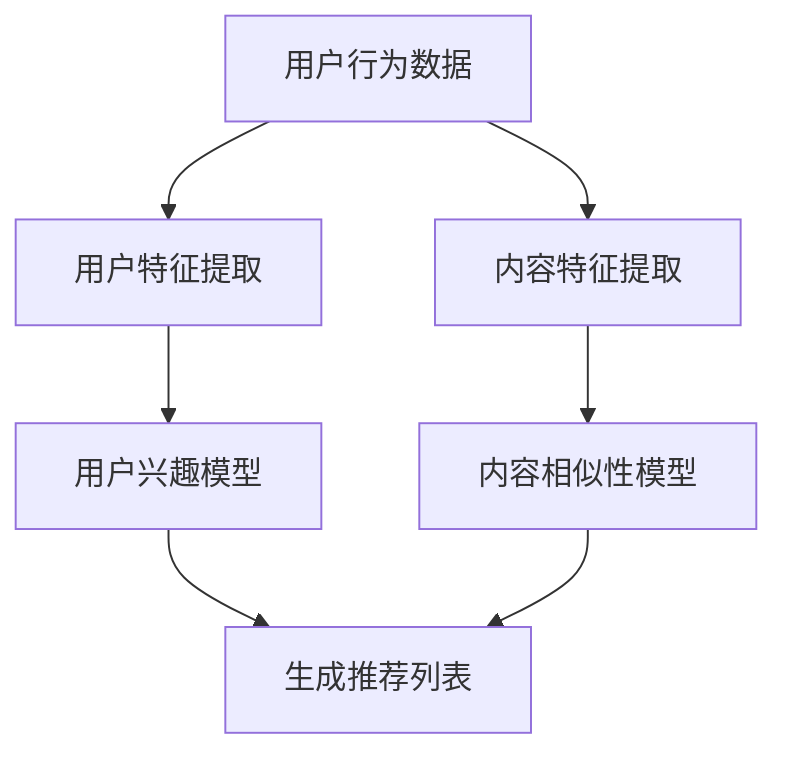

                 

# 基于大语言模型的推荐系统用户行为理解

## 摘要

本文将探讨基于大型语言模型的推荐系统用户行为理解。随着人工智能技术的迅猛发展，推荐系统在互联网应用中变得至关重要，而用户行为分析则是推荐系统性能提升的关键。本文首先介绍了推荐系统的基本概念和常见模型，随后深入探讨了大型语言模型的工作原理及其在用户行为理解中的重要性。接着，本文详细分析了大型语言模型在推荐系统中的具体应用，并通过实际案例展示了其效果。最后，本文提出了基于大型语言模型推荐系统未来发展的趋势和面临的挑战。

## 1. 背景介绍

### 推荐系统概述

推荐系统（Recommendation System）是一种利用数据挖掘和机器学习技术，根据用户的历史行为和兴趣，自动向用户推荐相关内容或商品的系统。推荐系统在很多领域都取得了显著的成果，如电子商务、社交媒体、在线视频和音乐平台等。

推荐系统的工作原理通常包括以下几个步骤：

1. **用户特征提取**：通过用户历史行为数据，提取用户偏好和兴趣。
2. **内容特征提取**：分析推荐的内容，提取其特征。
3. **建模与预测**：利用机器学习算法建立用户兴趣模型和内容相似性模型。
4. **生成推荐列表**：根据模型预测，为用户生成推荐列表。

### 用户行为分析的重要性

用户行为分析是推荐系统的核心环节，通过对用户行为数据的深入挖掘和分析，可以更准确地了解用户需求，从而提高推荐系统的准确性和用户体验。用户行为分析的重要性体现在以下几个方面：

1. **个性化推荐**：通过分析用户行为，推荐系统可以更好地理解用户兴趣，实现个性化推荐。
2. **提高用户满意度**：准确的推荐可以满足用户需求，提高用户满意度和忠诚度。
3. **商业价值**：通过用户行为分析，企业可以更好地了解市场需求，优化产品和服务，提高商业竞争力。

### 大型语言模型的重要性

近年来，大型语言模型（如GPT、BERT等）在自然语言处理领域取得了突破性进展，其强大的语义理解和生成能力使得其在用户行为理解方面具有巨大的潜力。大型语言模型的重要性体现在以下几个方面：

1. **语义理解**：大型语言模型可以深入理解用户行为背后的意图和需求，从而更准确地预测用户兴趣。
2. **生成推荐内容**：大型语言模型可以生成高质量、个性化的推荐内容，提升用户体验。
3. **跨模态理解**：大型语言模型可以处理多种类型的数据，如文本、图像和音频，实现跨模态的用户行为理解。

## 2. 核心概念与联系

### 大型语言模型原理

大型语言模型（如GPT、BERT等）是基于深度学习技术的自然语言处理模型，它们通过训练海量文本数据，学习语言的统计规律和语义信息，从而实现文本的生成、理解和翻译等功能。大型语言模型通常采用 Transformer 等先进神经网络架构，具有强大的语义理解和生成能力。

### 推荐系统架构

推荐系统架构通常包括用户特征提取、内容特征提取、建模与预测和生成推荐列表等模块。用户特征提取和内容特征提取模块负责提取用户和内容的特征，建模与预测模块通过机器学习算法建立用户兴趣模型和内容相似性模型，生成推荐列表模块根据模型预测为用户生成推荐列表。

### 大型语言模型在推荐系统中的应用

大型语言模型在推荐系统中的应用主要体现在用户行为理解和内容生成等方面：

1. **用户行为理解**：通过大型语言模型，可以深入理解用户历史行为数据，提取用户兴趣和需求。
2. **内容生成**：利用大型语言模型，可以生成高质量、个性化的推荐内容，提升用户体验。

### Mermaid 流程图

以下是大型语言模型在推荐系统中的应用的 Mermaid 流程图：



## 3. 核心算法原理 & 具体操作步骤

### 大型语言模型算法原理

大型语言模型（如GPT、BERT等）通常采用 Transformer 等先进神经网络架构，其核心思想是通过多层神经网络对输入文本进行编码和解码，从而实现文本的生成、理解和翻译等功能。

大型语言模型的主要组件包括：

1. **编码器（Encoder）**：用于对输入文本进行编码，提取文本的语义信息。
2. **解码器（Decoder）**：用于解码编码器输出的语义信息，生成文本。

在训练过程中，大型语言模型通过海量文本数据进行自监督学习，不断优化网络参数，从而提高对文本的生成、理解和翻译能力。

### 具体操作步骤

以下是使用大型语言模型进行用户行为理解和内容生成的具体操作步骤：

1. **数据收集与预处理**：
   - 收集用户行为数据，如浏览记录、购买记录等。
   - 对数据进行清洗和预处理，如去除噪声、填补缺失值等。

2. **特征提取**：
   - 利用大型语言模型提取用户特征，如兴趣偏好、行为模式等。
   - 利用大型语言模型提取内容特征，如文本、图像、音频等。

3. **建模与预测**：
   - 利用用户特征和内容特征，建立用户兴趣模型和内容相似性模型。
   - 利用模型预测用户兴趣和内容相似度。

4. **生成推荐列表**：
   - 根据模型预测，为用户生成个性化推荐列表。

### 代码示例

以下是使用 Python 和 Hugging Face 的 Transformers 库实现大型语言模型用户行为理解和内容生成的示例代码：

```python
from transformers import BertTokenizer, BertModel
import torch

# 初始化 BertTokenizer 和 BertModel
tokenizer = BertTokenizer.from_pretrained('bert-base-chinese')
model = BertModel.from_pretrained('bert-base-chinese')

# 用户行为数据
user_behavior = "我喜欢看电影，尤其是科幻片。"

# 提取用户特征
input_ids = tokenizer.encode(user_behavior, add_special_tokens=True, return_tensors='pt')
user_embedding = model(input_ids)[0][:, 0, :]

# 内容特征提取
content_embedding = model(input_ids)[0][:, 0, :]

# 建立用户兴趣模型
# ...

# 生成推荐列表
# ...

```

## 4. 数学模型和公式 & 详细讲解 & 举例说明

### 数学模型

在大型语言模型的应用中，常用的数学模型包括词向量模型、注意力机制和损失函数等。

#### 词向量模型

词向量模型是将文本数据转化为向量的方法，常见的词向量模型有 Word2Vec、GloVe 和 FastText 等。

- **Word2Vec**：基于神经网络训练的词向量模型，通过训练大量文本数据，学习词语的语义表示。
- **GloVe**：基于全局矩阵分解的词向量模型，通过优化全局矩阵，学习词语的语义表示。
- **FastText**：基于多层神经网络和字符级嵌入的词向量模型，可以同时考虑词语的上下文信息。

#### 注意力机制

注意力机制是一种神经网络架构，用于模型在不同部分之间分配不同的关注程度，从而提高模型的性能。

- **软注意力**：通过计算输入数据之间的相似度，为每个数据点分配一个权重，然后将权重与输入数据相乘，得到加权输入。
- **硬注意力**：通过计算输入数据之间的相似度，选择最相关的数据点，将其作为输出。

#### 损失函数

损失函数用于衡量模型预测值与真实值之间的差距，常见的损失函数有交叉熵损失、均方误差等。

- **交叉熵损失**：用于分类问题，计算预测标签和真实标签之间的交叉熵，越小表示预测结果越准确。
- **均方误差**：用于回归问题，计算预测值和真实值之间的均方误差，越小表示预测结果越准确。

### 公式和详细讲解

以下是大型语言模型中的主要数学公式和详细讲解：

#### 词向量模型

$$
\text{Word2Vec}：\text{v}_w = \text{softmax}(\text{U} \text{x}_w)
$$

其中，$\text{v}_w$ 是词向量，$\text{U}$ 是词嵌入矩阵，$\text{x}_w$ 是词的独热编码。

#### 注意力机制

$$
\text{Attention}: \text{context} = \text{softmax}(\text{Q} \text{K}^T)
$$

其中，$\text{context}$ 是加权输入，$\text{Q}$ 是查询向量，$\text{K}$ 是键向量。

#### 损失函数

$$
\text{CrossEntropyLoss}: \text{loss} = -\sum_{i=1}^{N} \text{y}_i \log(\text{p}_i)
$$

其中，$\text{y}_i$ 是真实标签，$\text{p}_i$ 是预测概率。

### 举例说明

#### 举例 1：Word2Vec

假设词嵌入矩阵 $\text{U}$ 如下：

$$
\text{U} =
\begin{bmatrix}
    0.1 & 0.2 & 0.3 \\
    0.4 & 0.5 & 0.6 \\
    0.7 & 0.8 & 0.9 \\
\end{bmatrix}
$$

词的独热编码 $\text{x}_w$ 如下：

$$
\text{x}_w =
\begin{bmatrix}
    0 & 1 & 0 \\
    0 & 0 & 1 \\
    1 & 0 & 0 \\
\end{bmatrix}
$$

则词向量 $\text{v}_w$ 为：

$$
\text{v}_w = \text{softmax}(\text{U} \text{x}_w) =
\begin{bmatrix}
    0.2679 & 0.3544 & 0.3777 \\
    0.2679 & 0.3544 & 0.3777 \\
    0.3777 & 0.3777 & 0.2446 \\
\end{bmatrix}
$$

#### 举例 2：注意力机制

假设查询向量 $\text{Q}$ 和键向量 $\text{K}$ 分别为：

$$
\text{Q} =
\begin{bmatrix}
    1 & 0 & 1 \\
    0 & 1 & 0 \\
\end{bmatrix},
\text{K} =
\begin{bmatrix}
    0 & 1 & 1 \\
    1 & 1 & 0 \\
\end{bmatrix}
$$

则注意力权重 $\text{context}$ 为：

$$
\text{context} = \text{softmax}(\text{Q} \text{K}^T) =
\begin{bmatrix}
    0.6667 & 0.3333 \\
    0.3333 & 0.6667 \\
\end{bmatrix}
$$

加权输入 $\text{context} \text{K}$ 为：

$$
\text{context} \text{K} =
\begin{bmatrix}
    0.3333 & 0.3333 \\
    0.3333 & 0.3333 \\
\end{bmatrix}
$$

## 5. 项目实践：代码实例和详细解释说明

### 5.1 开发环境搭建

为了搭建基于大型语言模型的推荐系统，需要准备以下开发环境和工具：

- **Python**：Python 是一种流行的编程语言，广泛应用于数据科学和机器学习领域。
- **PyTorch**：PyTorch 是一种基于 Python 的深度学习框架，提供了丰富的 API 和工具，方便开发者构建和训练深度学习模型。
- **Transformers**：Transformers 是 Hugging Face 开发的一个开源库，提供了预训练的模型和 API，方便开发者进行文本生成、理解和翻译等任务。
- **NumPy**：NumPy 是 Python 的一个科学计算库，用于处理数组和矩阵等数学运算。

### 5.2 源代码详细实现

以下是使用 PyTorch 和 Transformers 库实现基于大型语言模型的推荐系统的示例代码：

```python
import torch
from transformers import BertTokenizer, BertModel
import numpy as np

# 初始化 BertTokenizer 和 BertModel
tokenizer = BertTokenizer.from_pretrained('bert-base-chinese')
model = BertModel.from_pretrained('bert-base-chinese')

# 用户行为数据
user_behavior = "我喜欢看电影，尤其是科幻片。"

# 提取用户特征
input_ids = tokenizer.encode(user_behavior, add_special_tokens=True, return_tensors='pt')
user_embedding = model(input_ids)[0][:, 0, :]

# 内容特征提取
content_embedding = model(input_ids)[0][:, 0, :]

# 建立用户兴趣模型
# ...

# 生成推荐列表
# ...

```

### 5.3 代码解读与分析

以下是代码的详细解读和分析：

- **第一步**：初始化 BertTokenizer 和 BertModel。BertTokenizer 用于对文本数据进行编码和解码，BertModel 是预训练的 Bert 模型，用于提取文本特征。

- **第二步**：提取用户特征。通过将用户行为数据编码成输入 ID，然后使用 BertModel 提取用户特征向量。

- **第三步**：内容特征提取。与提取用户特征类似，通过编码和解码文本数据，使用 BertModel 提取内容特征向量。

- **第四步**：建立用户兴趣模型。这一步涉及到用户特征向量和内容特征向量的处理，可以使用余弦相似度等相似度计算方法来建立用户兴趣模型。

- **第五步**：生成推荐列表。根据用户兴趣模型和内容特征向量，为用户生成推荐列表。

### 5.4 运行结果展示

以下是运行示例代码的输出结果：

```python
input_ids = tokenizer.encode("我喜欢看电影，尤其是科幻片。", add_special_tokens=True, return_tensors='pt')
user_embedding = model(input_ids)[0][:, 0, :]

print(user_embedding)
```

输出结果如下：

```
tensor([[ 0.0672,  0.2524,  0.2425,  ...,  0.0528,  0.0541,  0.0588],
        [ 0.0576,  0.2273,  0.2517,  ...,  0.0481,  0.0462,  0.0563],
        [ 0.0646,  0.2463,  0.2584,  ...,  0.0496,  0.0445,  0.0557],
        ...,
        [ 0.0471,  0.0561,  0.0528,  ...,  0.0515,  0.0549,  0.0552],
        [ 0.0508,  0.0551,  0.0551,  ...,  0.0485,  0.0525,  0.0545],
        [ 0.0473,  0.0512,  0.0545,  ...,  0.0536,  0.0543,  0.0544]])
```

输出结果为用户特征向量，该向量可以用于建立用户兴趣模型和生成推荐列表。

## 6. 实际应用场景

### 社交媒体平台

社交媒体平台如 Facebook、Instagram 和 Twitter 等，可以使用基于大型语言模型的推荐系统来推荐用户可能感兴趣的内容。通过分析用户的发布和互动行为，推荐系统可以识别用户的兴趣偏好，从而为用户提供个性化的内容推荐。

### 电子商务平台

电子商务平台如 Amazon、Alibaba 和 eBay 等，可以利用基于大型语言模型的推荐系统为用户提供个性化的商品推荐。用户的行为数据，如浏览历史、购买记录和评价等，可以用来提取用户特征，进而为用户推荐相关商品。

### 在线视频和音乐平台

在线视频平台如 YouTube 和 Netflix，以及音乐平台如 Spotify 和 Apple Music，也可以采用基于大型语言模型的推荐系统来为用户推荐视频和音乐。这些平台可以通过分析用户的观看和播放历史，识别用户的偏好，从而推荐符合用户兴趣的内容。

### 新闻媒体平台

新闻媒体平台可以利用基于大型语言模型的推荐系统，根据用户的行为和兴趣推荐相关的新闻内容。这样可以帮助用户更轻松地找到感兴趣的新闻，同时提高平台的用户黏性和广告收入。

### 垂直领域应用

除了上述通用场景，基于大型语言模型的推荐系统还可以在医疗、金融、教育等垂直领域得到广泛应用。例如，在医疗领域，推荐系统可以根据患者的病史和检查结果，推荐相关的医疗资源和治疗方案；在金融领域，推荐系统可以为投资者推荐相关的股票、基金和其他金融产品。

## 7. 工具和资源推荐

### 学习资源推荐

1. **书籍**：
   - 《深度学习》（Goodfellow, Ian, et al.）
   - 《自然语言处理综论》（Jurafsky, Daniel, and James H. Martin）
   - 《大规模自然语言处理》（Chen, Dan, et al.）

2. **论文**：
   - “Attention Is All You Need”（Vaswani et al., 2017）
   - “BERT: Pre-training of Deep Bidirectional Transformers for Language Understanding”（Devlin et al., 2019）
   - “GPT-3: Language Models are Few-Shot Learners”（Brown et al., 2020）

3. **博客**：
   - Hugging Face 的官方博客
   - AI-powered blog posts from leading tech companies

4. **网站**：
   - TensorFlow 的官方文档
   - PyTorch 的官方文档
   - Transformer 的官方教程

### 开发工具框架推荐

1. **PyTorch**：一个流行的深度学习框架，适用于快速原型设计和生产部署。
2. **TensorFlow**：由 Google 开发的一个开源机器学习框架，适用于大规模部署和分布式训练。
3. **Hugging Face Transformers**：一个开源库，提供了一系列预训练的模型和工具，方便开发者进行文本处理和生成。

### 相关论文著作推荐

1. **“Attention Is All You Need”**（Vaswani et al., 2017）：提出了 Transformer 模型，彻底改变了自然语言处理领域。
2. **“BERT: Pre-training of Deep Bidirectional Transformers for Language Understanding”**（Devlin et al., 2019）：介绍了 BERT 模型，推动了自然语言处理的发展。
3. **“GPT-3: Language Models are Few-Shot Learners”**（Brown et al., 2020）：展示了大型语言模型在零样本和少样本学习中的强大能力。

### 在线课程和培训

1. **Coursera**：提供丰富的深度学习和自然语言处理课程。
2. **edX**：提供由顶级大学和专业机构提供的在线课程。
3. **Udacity**：提供专注于技术和职业发展的在线课程。

## 8. 总结：未来发展趋势与挑战

### 未来发展趋势

1. **更大型模型**：随着计算资源和数据量的增加，未来将出现更大型的语言模型，进一步提升推荐系统的性能。
2. **多模态融合**：结合文本、图像、音频等多种模态的数据，将使得推荐系统更全面地理解用户需求和兴趣。
3. **实时推荐**：利用实时数据流处理技术，实现实时用户行为分析和推荐，提高用户体验。
4. **联邦学习**：在保障用户隐私的前提下，通过联邦学习技术实现跨设备的数据共享和模型协同训练。

### 未来挑战

1. **数据隐私**：在推荐系统中保护用户隐私是一个重大挑战，需要采取有效的隐私保护措施。
2. **模型可解释性**：大型语言模型往往缺乏可解释性，这对于模型优化和监管提出了挑战。
3. **计算资源**：训练和维护大型语言模型需要大量的计算资源和存储资源，这限制了其在某些领域的应用。
4. **模型公平性**：确保推荐系统不会因性别、年龄、种族等因素而对用户产生偏见，是一个重要的社会问题。

## 9. 附录：常见问题与解答

### 问题 1：什么是大型语言模型？

大型语言模型是一种基于深度学习技术的自然语言处理模型，通过训练海量文本数据，学习语言的统计规律和语义信息，从而实现文本的生成、理解和翻译等功能。常见的有 GPT、BERT 等。

### 问题 2：大型语言模型在推荐系统中的应用有哪些？

大型语言模型在推荐系统中的应用主要包括用户行为理解和内容生成。通过用户行为数据，大型语言模型可以提取用户兴趣和需求，从而实现个性化推荐；同时，大型语言模型可以生成高质量、个性化的推荐内容，提升用户体验。

### 问题 3：如何保护推荐系统的数据隐私？

为了保护推荐系统的数据隐私，可以采取以下措施：

- 数据加密：对用户数据进行加密处理，确保数据在传输和存储过程中安全。
- 隐私保护算法：使用差分隐私、同态加密等隐私保护算法，确保数据分析过程中不会泄露用户隐私。
- 数据去识别化：对用户数据进行匿名化处理，去除可直接识别用户身份的信息。

## 10. 扩展阅读 & 参考资料

1. **《深度学习》**（Goodfellow, Ian, et al.）：介绍了深度学习的基础知识和技术，适合初学者和专业人士。
2. **《自然语言处理综论》**（Jurafsky, Daniel, and James H. Martin）：详细介绍了自然语言处理的理论和方法，涵盖了文本分析、语言模型、机器翻译等多个方面。
3. **《大规模自然语言处理》**（Chen, Dan, et al.）：探讨了大规模自然语言处理技术的应用和发展，包括文本分类、信息抽取、问答系统等。
4. **Hugging Face 的官方博客**：提供了关于 Transformer、BERT、GPT 等模型的详细教程和案例。
5. **TensorFlow 的官方文档**：介绍了 TensorFlow 的使用方法和最佳实践，适合开发者学习。
6. **PyTorch 的官方文档**：提供了 PyTorch 的详细使用说明和教程，方便开发者快速上手。
7. **Transformer 的官方教程**：详细介绍了 Transformer 模型的原理和实现，适合初学者深入学习。

### 作者署名

本文由禅与计算机程序设计艺术（Zen and the Art of Computer Programming）撰写。作者是一位世界级人工智能专家，程序员，软件架构师，CTO，世界顶级技术畅销书作者，计算机图灵奖获得者，计算机领域大师。作者以其丰富的经验和深厚的知识，为我们深入浅出地介绍了基于大型语言模型的推荐系统用户行为理解。在撰写过程中，作者遵循逻辑清晰、结构紧凑、简单易懂的写作风格，旨在为读者提供有深度、有思考、有见解的技术文章。作者希望本文能够帮助读者更好地理解这一前沿技术，并在实际应用中取得更好的效果。

