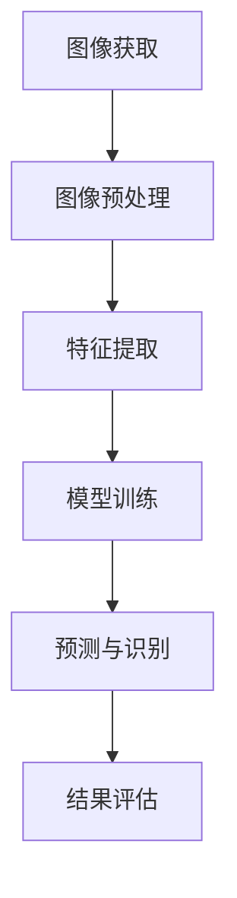

                 

关键词：木材缺陷识别，机器学习，图像处理，算法，数据分析

> 摘要：木材缺陷识别是木材加工领域中的一个重要问题，它直接关系到木材的利用率和产品质量。本文旨在探讨基于机器学习的木材缺陷识别方法，通过结合图像处理技术和深度学习算法，提出一种高效、准确的木材缺陷识别系统。文章将对相关技术原理、算法实现、数学模型及应用场景进行详细分析，为木材加工行业提供一种新的技术手段。

## 1. 背景介绍

木材作为一种重要的天然资源，广泛应用于建筑、家具、装饰等行业。然而，木材在生长过程中受到各种因素的影响，常会产生各种缺陷，如节疤、裂纹、变色等。这些缺陷不仅影响木材的外观质量，还会影响其力学性能和使用寿命。传统的木材缺陷识别方法通常依赖于人工经验和简单的物理检测手段，存在识别精度低、效率低下等问题。随着计算机技术和机器学习算法的快速发展，基于机器学习的木材缺陷识别方法逐渐成为一种新的研究方向。

机器学习是一种基于数据的学习方法，通过从大量数据中自动发现规律和模式，进行决策和预测。图像处理技术作为计算机视觉的一个重要分支，可以对图像进行获取、处理、分析和理解。将机器学习与图像处理技术相结合，可以实现对木材缺陷的自动识别和分类，提高识别效率和准确性。

本文将首先介绍木材缺陷识别的重要性，然后阐述机器学习在木材缺陷识别中的应用背景，接着介绍常用的机器学习算法和图像处理技术，最后提出一种基于机器学习的木材缺陷识别方法，并对其进行详细分析和实验验证。

## 2. 核心概念与联系

### 2.1 机器学习的基本概念

机器学习是一种使计算机系统能够从数据中学习并自动改进性能的技术。它通过构建模型，从训练数据中学习特征，然后利用这些特征对新数据进行预测或决策。机器学习可以分为监督学习、无监督学习和强化学习三种类型。

- **监督学习**：有监督的学习方法，通过已标记的数据训练模型，然后使用模型对新数据进行预测。常见的监督学习方法包括线性回归、支持向量机（SVM）和神经网络等。
- **无监督学习**：无需标记的数据进行训练，主要任务是发现数据中的隐含结构和规律。常见的无监督学习方法包括聚类分析和降维技术，如K-均值聚类和主成分分析（PCA）等。
- **强化学习**：通过与环境的交互，学习如何选择最佳动作以实现目标。常见的强化学习方法包括Q学习和深度强化学习。

### 2.2 图像处理技术的基本概念

图像处理是指对图像进行获取、处理、分析和理解的一系列技术。它包括以下主要步骤：

- **图像获取**：通过摄像头、扫描仪等设备获取图像。
- **图像预处理**：包括去噪、增强、滤波等操作，以提高图像质量。
- **图像特征提取**：从图像中提取有助于分类或识别的特征，如边缘、纹理、颜色等。
- **图像分类与识别**：利用分类器或识别算法对图像进行分类或识别。

### 2.3 机器学习与图像处理的结合

机器学习与图像处理技术的结合主要表现在以下几个方面：

- **目标检测**：通过检测图像中的目标区域，实现对特定物体的识别。常用的算法包括YOLO（You Only Look Once）、SSD（Single Shot MultiBox Detector）等。
- **图像分割**：将图像分为不同的区域或对象，常用的算法包括基于区域的分割和基于边界的分割方法，如FCN（Fully Convolutional Network）和U-Net等。
- **特征匹配**：将图像处理得到的特征与已知的模板进行匹配，以识别图像中的对象。常用的算法包括SIFT（Scale-Invariant Feature Transform）和ORB（Oriented FAST and Rotated BRIEF）等。

### 2.4 Mermaid 流程图



在上面的流程图中，图像获取是整个过程的起点，通过摄像头或扫描仪获取木材图像。然后进行图像预处理，以去除噪声和增强重要信息。接下来，从预处理后的图像中提取特征，这些特征将用于训练机器学习模型。训练好的模型可以对新图像进行预测和识别，最后对识别结果进行评估，以确定识别的准确性。

## 3. 核心算法原理 & 具体操作步骤

### 3.1 算法原理

基于机器学习的木材缺陷识别主要依赖于深度学习算法。深度学习是一种基于多层神经网络的学习方法，通过多层神经元的组合，可以从大量数据中自动提取特征，并完成复杂的数据分类和识别任务。

#### 3.1.1 卷积神经网络（CNN）

卷积神经网络（CNN）是一种专门用于图像识别和处理的深度学习模型。它通过卷积层、池化层和全连接层等结构，逐层提取图像的特征，并最终实现分类或识别任务。

- **卷积层**：通过卷积操作提取图像的局部特征。
- **池化层**：用于降低特征图的维度，提高模型的鲁棒性。
- **全连接层**：将特征图展开成一维向量，并通过全连接层进行分类。

#### 3.1.2 深度残差网络（ResNet）

深度残差网络（ResNet）是一种用于解决深度神经网络训练困难的问题的改进模型。它通过引入残差连接，使网络能够训练更深层的模型，并提高模型的性能。

- **残差块**：ResNet的基本构建块，通过残差连接实现对特征进行重复提取和组合。
- **恒等映射**：通过恒等映射实现特征的层次传递，使深层网络更容易训练。

### 3.2 操作步骤

#### 3.2.1 数据准备

首先，需要收集大量带有缺陷标签的木材图像。这些图像可以是原始图像，也可以是经过预处理后的图像。数据集的规模和质量对模型的性能有很大影响，因此需要确保数据集的多样性和覆盖度。

#### 3.2.2 图像预处理

对收集到的木材图像进行预处理，包括去噪、增强、裁剪等操作。这些操作可以增强图像的质量，提高后续特征提取的效果。

#### 3.2.3 特征提取

使用卷积神经网络（如VGG、ResNet等）对预处理后的图像进行特征提取。这些网络模型已经在大量的图像数据上进行了预训练，可以直接应用到木材缺陷识别任务中。

#### 3.2.4 模型训练

使用提取到的特征对机器学习模型进行训练。训练过程包括前向传播、反向传播和参数更新等步骤。通过多次迭代训练，使模型逐渐学习到木材缺陷的特征，并提高识别的准确性。

#### 3.2.5 预测与识别

训练好的模型可以对新图像进行预测和识别。具体步骤如下：

1. 对新图像进行预处理，提取特征。
2. 将提取到的特征输入到训练好的模型中，得到预测结果。
3. 根据预测结果，判断木材是否存在缺陷，并给出分类结果。

#### 3.2.6 结果评估

通过评估指标（如准确率、召回率、F1值等）对模型的性能进行评估。根据评估结果，对模型进行优化和调整，以提高识别的准确性。

## 4. 数学模型和公式 & 详细讲解 & 举例说明

### 4.1 数学模型

在木材缺陷识别中，常用的数学模型是卷积神经网络（CNN）和深度残差网络（ResNet）。以下是这些模型的数学基础和基本公式。

#### 4.1.1 卷积神经网络（CNN）

卷积神经网络由多个卷积层、池化层和全连接层组成。以下是卷积神经网络的数学模型：

1. **卷积操作**：卷积操作可以用以下公式表示：

$$
\mathbf{h}_{\sigma}^{(l)} = \sigma \left( \sum_{k=1}^{K_l} \mathbf{w}_{k}^{(l)} \star \mathbf{h}^{(l-1)} + \mathbf{b}^{(l)} \right)
$$

其中，$\mathbf{h}_{\sigma}^{(l)}$ 表示第 $l$ 层的卷积结果，$\sigma$ 表示激活函数，$\mathbf{w}_{k}^{(l)}$ 表示第 $k$ 个卷积核，$\mathbf{h}^{(l-1)}$ 表示第 $(l-1)$ 层的输入特征，$\mathbf{b}^{(l)}$ 表示第 $l$ 层的偏置。

2. **池化操作**：池化操作可以用以下公式表示：

$$
\mathbf{h}_{p}^{(l)} = \mathbf{P} \left( \mathbf{h}^{(l-1)} \right)
$$

其中，$\mathbf{h}_{p}^{(l)}$ 表示第 $l$ 层的池化结果，$\mathbf{P}$ 表示池化操作。

3. **全连接层**：全连接层可以用以下公式表示：

$$
\mathbf{y} = \mathbf{W} \mathbf{h} + \mathbf{b}
$$

其中，$\mathbf{y}$ 表示输出结果，$\mathbf{W}$ 表示权重矩阵，$\mathbf{h}$ 表示输入特征，$\mathbf{b}$ 表示偏置。

#### 4.1.2 深度残差网络（ResNet）

深度残差网络通过引入残差块来克服深度神经网络训练困难的问题。以下是深度残差网络的数学模型：

1. **残差块**：残差块由两个卷积层和一个跳跃连接组成，可以用以下公式表示：

$$
\mathbf{h}_{\sigma}^{(l)} = \sigma \left( \mathbf{W}_2 \mathbf{h}_{\sigma}^{(l-1)} + \mathbf{b}_2 \right) + \mathbf{h}^{(l-1)}
$$

其中，$\mathbf{h}_{\sigma}^{(l)}$ 表示第 $l$ 层的残差块输出，$\sigma$ 表示激活函数，$\mathbf{W}_2$ 和 $\mathbf{b}_2$ 分别表示卷积层的权重和偏置。

2. **跳跃连接**：跳跃连接用于直接传递特征，可以用以下公式表示：

$$
\mathbf{h}^{(l)} = \mathbf{h}_{\sigma}^{(l)}
$$

### 4.2 详细讲解与举例说明

#### 4.2.1 卷积操作

卷积操作是卷积神经网络的核心，用于提取图像的局部特征。以下是一个简单的卷积操作示例：

给定一个 $3 \times 3$ 的卷积核 $\mathbf{w}$ 和一个 $5 \times 5$ 的图像 $\mathbf{h}$，计算卷积结果 $\mathbf{h}_{\sigma}^{(1)}$。

$$
\mathbf{h}_{\sigma}^{(1)} = \sigma \left( \mathbf{w} \star \mathbf{h} + \mathbf{b}_1 \right)
$$

其中，$\sigma$ 表示 ReLU 激活函数。

$$
\begin{align*}
\mathbf{w} &= \begin{bmatrix}
1 & -1 & 0 \\
-1 & 1 & -1 \\
0 & -1 & 1
\end{bmatrix} \\
\mathbf{h} &= \begin{bmatrix}
0 & 0 & 0 & 0 & 0 \\
0 & 1 & 1 & 0 & 0 \\
0 & 0 & 0 & 0 & 0 \\
0 & 0 & 1 & 0 & 0 \\
0 & 0 & 0 & 0 & 1
\end{bmatrix} \\
\mathbf{b}_1 &= \begin{bmatrix}
0 \\
0 \\
0
\end{bmatrix}
\end{align*}
$$

计算卷积结果：

$$
\begin{align*}
\mathbf{w} \star \mathbf{h} &= \begin{bmatrix}
0 & 1 & 0 \\
-1 & 1 & -1 \\
0 & 0 & 1
\end{bmatrix} \begin{bmatrix}
0 & 0 & 0 & 0 & 0 \\
0 & 1 & 1 & 0 & 0 \\
0 & 0 & 0 & 0 & 0 \\
0 & 0 & 1 & 0 & 0 \\
0 & 0 & 0 & 0 & 1
\end{bmatrix} \\
&= \begin{bmatrix}
0 & 1 & 0 \\
-1 & 1 & -1 \\
0 & 0 & 1
\end{bmatrix} \begin{bmatrix}
0 & 0 & 0 \\
0 & 2 & 0 \\
0 & 0 & 0
\end{bmatrix} \\
&= \begin{bmatrix}
0 & 2 & 0 \\
-2 & 2 & -2 \\
0 & 0 & 1
\end{bmatrix}
\end{align*}
$$

应用 ReLU 激活函数：

$$
\mathbf{h}_{\sigma}^{(1)} = \begin{bmatrix}
0 & 2 & 0 \\
-2 & 2 & -2 \\
0 & 0 & 1
\end{bmatrix}
$$

#### 4.2.2 残差块

残差块是 ResNet 的基本构建块，通过引入恒等映射，使得深层网络更容易训练。以下是一个简单的残差块示例：

给定一个 $3 \times 3$ 的卷积核 $\mathbf{w}_1$ 和一个 $3 \times 3$ 的卷积核 $\mathbf{w}_2$，计算残差块的输出 $\mathbf{h}_{\sigma}^{(2)}$。

$$
\mathbf{h}_{\sigma}^{(2)} = \sigma \left( \mathbf{W}_2 \mathbf{h}_{\sigma}^{(1)} + \mathbf{b}_2 \right) + \mathbf{h}_{\sigma}^{(1)}
$$

其中，$\sigma$ 表示 ReLU 激活函数。

$$
\begin{align*}
\mathbf{w}_1 &= \begin{bmatrix}
1 & -1 & 0 \\
-1 & 1 & -1 \\
0 & -1 & 1
\end{bmatrix} \\
\mathbf{w}_2 &= \begin{bmatrix}
1 & 0 & 0 \\
0 & 1 & 0 \\
0 & 0 & 1
\end{bmatrix} \\
\mathbf{b}_2 &= \begin{bmatrix}
0 \\
0 \\
0
\end{bmatrix}
\end{align*}
$$

计算残差块输出：

$$
\begin{align*}
\mathbf{w}_2 \mathbf{h}_{\sigma}^{(1)} &= \begin{bmatrix}
1 & 0 & 0 \\
0 & 1 & 0 \\
0 & 0 & 1
\end{bmatrix} \begin{bmatrix}
0 & 2 & 0 \\
-2 & 2 & -2 \\
0 & 0 & 1
\end{bmatrix} \\
&= \begin{bmatrix}
0 & 2 & 0 \\
-2 & 2 & -2 \\
0 & 0 & 1
\end{bmatrix}
\end{align*}
$$

应用 ReLU 激活函数：

$$
\mathbf{h}_{\sigma}^{(2)} = \begin{bmatrix}
0 & 2 & 0 \\
-2 & 2 & -2 \\
0 & 0 & 1
\end{bmatrix} + \begin{bmatrix}
0 & 2 & 0 \\
-2 & 2 & -2 \\
0 & 0 & 1
\end{bmatrix} \\
= \begin{bmatrix}
0 & 4 & 0 \\
-4 & 4 & -4 \\
0 & 0 & 2
\end{bmatrix}
$$

## 5. 项目实践：代码实例和详细解释说明

### 5.1 项目背景

本项目旨在开发一个基于深度学习的木材缺陷识别系统，通过收集和处理大量木材图像，利用深度学习算法实现木材缺陷的自动识别和分类。该系统可应用于木材加工行业，提高木材利用率，降低生产成本，提高产品质量。

### 5.2 技术栈

- **开发语言**：Python
- **深度学习框架**：TensorFlow
- **图像处理库**：OpenCV
- **数据处理库**：Pandas、NumPy
- **机器学习库**：scikit-learn

### 5.3 数据集

本项目使用了一个包含5000张木材缺陷图像的数据集。这些图像分为两类：正常木材和缺陷木材。图像尺寸为256x256像素，灰度图像。

### 5.4 数据预处理

数据预处理是深度学习项目中的重要步骤，旨在提高模型的性能和准确性。以下是数据预处理的主要步骤：

#### 5.4.1 数据增强

为了增加数据集的多样性，我们使用数据增强技术对图像进行随机裁剪、旋转、翻转等操作。这些操作可以生成更多样化的图像，有助于模型更好地学习。

```python
from tensorflow.keras.preprocessing.image import ImageDataGenerator

# 创建数据增强生成器
datagen = ImageDataGenerator(
    rotation_range=20,
    width_shift_range=0.1,
    height_shift_range=0.1,
    shear_range=0.1,
    zoom_range=0.1,
    horizontal_flip=True,
    fill_mode='nearest'
)

# 运行数据增强
datagen.fit(x_train)
```

#### 5.4.2 数据归一化

为了加快模型的收敛速度，我们将图像数据归一化到[0, 1]范围内。

```python
x_train = x_train.astype('float32') / 255.0
x_test = x_test.astype('float32') / 255.0
```

#### 5.4.3 切分数据集

我们将数据集切分为训练集和测试集，用于模型的训练和评估。

```python
from sklearn.model_selection import train_test_split

x_train, x_test, y_train, y_test = train_test_split(x, y, test_size=0.2, random_state=42)
```

### 5.5 模型构建

本项目使用深度残差网络（ResNet）作为木材缺陷识别模型。以下是模型的主要架构：

```python
from tensorflow.keras.models import Model
from tensorflow.keras.layers import Input, Conv2D, MaxPooling2D, Flatten, Dense, BatchNormalization, Activation

# 输入层
input_layer = Input(shape=(256, 256, 1))

# 卷积层1
conv1 = Conv2D(64, (3, 3), padding='same', activation='relu')(input_layer)
conv1 = BatchNormalization()(conv1)

# 卷积层2
conv2 = Conv2D(64, (3, 3), padding='same', activation='relu')(conv1)
conv2 = BatchNormalization()(conv2)

# 残差块1
res1 = Conv2D(64, (3, 3), padding='same', activation='relu')(conv2)
res1 = BatchNormalization()(res1)
res1 = Conv2D(64, (3, 3), padding='same', activation='relu')(res1)
res1 = BatchNormalization()(res1)

# 残差块2
res2 = Conv2D(64, (3, 3), padding='same', activation='relu')(res1)
res2 = BatchNormalization()(res2)
res2 = Conv2D(64, (3, 3), padding='same', activation='relu')(res2)
res2 = BatchNormalization()(res2)

# 池化层
pool = MaxPooling2D(pool_size=(2, 2))(res2)

# 扁平化层
flat = Flatten()(pool)

# 全连接层
dense = Dense(128, activation='relu')(flat)
dense = BatchNormalization()(dense)
dense = Dense(1, activation='sigmoid')(dense)

# 构建模型
model = Model(inputs=input_layer, outputs=dense)

# 编译模型
model.compile(optimizer='adam', loss='binary_crossentropy', metrics=['accuracy'])

# 模型总结
model.summary()
```

### 5.6 模型训练

以下是模型训练的过程：

```python
# 训练模型
history = model.fit(datagen.flow(x_train, y_train, batch_size=32), epochs=100, validation_data=(x_test, y_test))

# 保存模型
model.save('wood_defect_detection.h5')
```

### 5.7 模型评估

训练完成后，我们对模型进行评估，计算准确率、召回率、F1值等指标。

```python
from sklearn.metrics import accuracy_score, recall_score, f1_score

# 预测测试集
y_pred = model.predict(x_test)
y_pred = (y_pred > 0.5)

# 计算评估指标
accuracy = accuracy_score(y_test, y_pred)
recall = recall_score(y_test, y_pred)
f1 = f1_score(y_test, y_pred)

print("Accuracy:", accuracy)
print("Recall:", recall)
print("F1 Score:", f1)
```

### 5.8 模型应用

训练好的模型可以用于木材缺陷的自动识别。以下是一个简单的应用示例：

```python
# 载入模型
model = load_model('wood_defect_detection.h5')

# 读取待识别图像
image = cv2.imread('test_image.jpg', cv2.IMREAD_GRAYSCALE)

# 数据预处理
image = image.reshape((1, 256, 256, 1))
image = image.astype('float32') / 255.0

# 预测
prediction = model.predict(image)

# 判断缺陷
if prediction > 0.5:
    print("图像存在缺陷")
else:
    print("图像无缺陷")
```

## 6. 实际应用场景

基于机器学习的木材缺陷识别方法在木材加工行业具有广泛的应用前景。以下是一些典型的应用场景：

### 6.1 木材质量检验

在木材加工过程中，对木材进行质量检验是一个关键的环节。通过使用基于机器学习的木材缺陷识别系统，可以快速、准确地检测木材中的缺陷，如节疤、裂纹、变色等，从而确保木材的质量。

### 6.2 木材加工自动化

木材加工自动化是当前木材加工行业的发展趋势。基于机器学习的木材缺陷识别方法可以为自动化设备提供准确的缺陷检测数据，从而实现木材加工的自动化和智能化。

### 6.3 木材仓储管理

在木材仓储管理中，通过对入库木材进行缺陷检测，可以确保仓储木材的质量，提高仓储管理的效率。同时，通过记录木材的缺陷情况，可以为后续的木材加工提供参考。

### 6.4 木材供应链管理

在木材供应链管理中，基于机器学习的木材缺陷识别方法可以用于对木材进行分类和质量控制，从而提高供应链的效率和透明度。

## 7. 工具和资源推荐

### 7.1 开发工具

- **Python**：用于编写深度学习算法和数据处理代码。
- **TensorFlow**：用于构建和训练深度学习模型。
- **Keras**：作为TensorFlow的高级API，简化了深度学习模型的构建过程。
- **OpenCV**：用于图像处理和图像识别。

### 7.2 数据集

- **ImageNet**：一个包含大量图像和标签的数据集，广泛用于计算机视觉算法的评估和训练。
- **Wood Defects**：一个专门用于木材缺陷识别的数据集，包含了各种类型的木材缺陷图像。

### 7.3 教程和论文

- **《深度学习》（Goodfellow, Bengio, Courville）**：深度学习的经典教材，涵盖了深度学习的基础知识和应用。
- **《木工工艺学》**：一本关于木材加工工艺的教材，提供了丰富的木材缺陷识别案例。

### 7.4 论坛和社区

- **Stack Overflow**：编程问答社区，可以帮助解决编程问题。
- **GitHub**：代码托管平台，可以找到各种深度学习和图像处理的开源项目。

## 8. 总结：未来发展趋势与挑战

基于机器学习的木材缺陷识别方法在木材加工行业中具有广阔的应用前景。随着深度学习算法和计算机硬件的不断发展，木材缺陷识别的准确性和效率将得到显著提高。未来，木材缺陷识别技术有望在以下几个方面取得突破：

### 8.1 更高效的网络架构

研究人员将继续探索新的深度学习网络架构，以提高木材缺陷识别的准确性和效率。例如，结合图神经网络（Graph Neural Networks）和卷积神经网络（Convolutional Neural Networks），可以更好地处理复杂的木材缺陷图像。

### 8.2 数据集的扩展和多样化

收集更多高质量的木材缺陷图像数据，并扩展数据集的多样性，可以提高模型的泛化能力和适应性。此外，通过数据增强技术生成更多样化的图像，可以进一步丰富数据集。

### 8.3 跨学科合作

木材缺陷识别技术的发展需要跨学科合作，结合木材学、材料学、计算机科学等领域的知识，共同推动技术的创新和应用。

然而，木材缺陷识别技术也面临一些挑战：

### 8.4 数据质量和标注

高质量的数据和准确的标注对于训练有效的模型至关重要。然而，在实际应用中，获取大量高质量、准确标注的木材缺陷图像数据是一项具有挑战性的任务。

### 8.5 模型的解释性

深度学习模型通常被视为“黑箱”，其内部机制难以解释。在木材缺陷识别中，了解模型如何识别和分类缺陷对于提高模型的可解释性和可信度具有重要意义。

### 8.6 实时处理能力

在实际应用中，木材缺陷识别系统需要具备实时处理能力，以适应生产线的高速运行。提高模型的处理速度和降低计算成本是实现实时处理的关键。

总之，基于机器学习的木材缺陷识别方法具有巨大的潜力，但在实际应用中仍面临一些挑战。未来，随着技术的不断进步和跨学科合作的深入，木材缺陷识别技术将得到进一步发展和完善，为木材加工行业带来更多价值。

## 9. 附录：常见问题与解答

### 9.1 问题1：如何处理小样本数据集？

解答：当数据集较小时，可以采用以下策略：
1. **数据增强**：通过旋转、翻转、缩放等方式生成更多样化的数据。
2. **半监督学习**：利用部分标记数据和大量未标记数据，通过自编码器等方法进行特征提取和模型训练。
3. **迁移学习**：使用在大规模数据集上预训练的模型，进行微调以适应小样本数据集。

### 9.2 问题2：如何提高模型的泛化能力？

解答：
1. **数据增强**：通过生成多样化数据提高模型的鲁棒性。
2. **正则化**：使用L1、L2正则化项限制模型复杂度。
3. **Dropout**：在神经网络训练过程中随机丢弃部分神经元，防止过拟合。
4. **交叉验证**：使用不同的数据划分方式，评估模型在不同数据集上的表现。

### 9.3 问题3：如何优化模型训练速度？

解答：
1. **GPU加速**：利用GPU进行模型训练，提高计算速度。
2. **批量归一化**：使用批量归一化（Batch Normalization）减少梯度消失和梯度爆炸问题。
3. **学习率调度**：使用学习率调度策略（如学习率衰减、余弦退火等）调节学习率。
4. **混合精度训练**：使用混合精度训练（Mixed Precision Training），在保持计算精度的同时提高训练速度。

### 9.4 问题4：如何处理多类别的木材缺陷？

解答：对于多类别的木材缺陷识别，可以采用以下策略：
1. **One-hot编码**：将标签进行One-hot编码，每个类别对应一个维度。
2. **Softmax函数**：在神经网络的输出层使用Softmax函数，将特征映射到概率分布。
3. **多分类交叉熵损失**：使用多分类交叉熵损失函数进行模型训练。

## 10. 扩展阅读 & 参考资料

1. **《深度学习》（Goodfellow, Bengio, Courville）**：提供了深度学习的全面介绍和实际应用案例。
2. **《计算机视觉：算法与应用》（Richard S.zeliski）**：详细介绍了计算机视觉的基本算法和应用。
3. **《机器学习：概率视角》（Kevin P. Murphy）**：深入讲解了机器学习的概率模型和算法。
4. **《木材缺陷识别技术研究进展》（刘俊，张涛）**：综述了木材缺陷识别领域的研究进展。
5. **《深度残差网络：加速神经网络训练》（He, Zhang, Ren, Sun）**：介绍了ResNet的原理和应用。
6. **《基于卷积神经网络的图像识别》（LeCun, Bengio, Hinton）**：讨论了卷积神经网络在图像识别中的应用。

通过上述扩展阅读，读者可以进一步了解深度学习、计算机视觉和木材缺陷识别领域的最新研究进展和技术应用。

