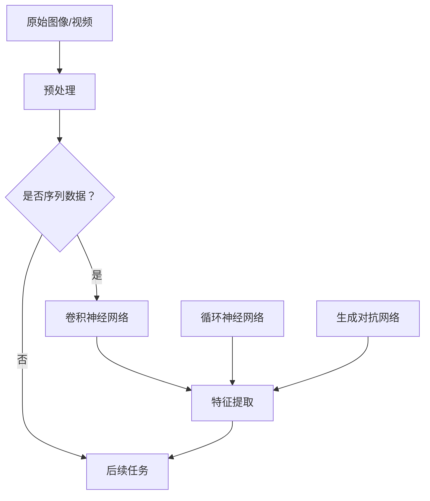

                 

### 1. 背景介绍

随着计算机视觉技术的不断发展，图像和视频处理在多个领域都得到了广泛的应用。从简单的图像识别到复杂的场景理解，计算机视觉技术已经逐步成为人工智能领域的重要分支。而在图像和视频处理中，特征提取作为关键步骤之一，直接影响着后续任务的准确性和效率。

传统的图像和视频特征提取方法主要依赖于手工设计的特征，如边缘检测、角点检测和纹理特征等。这些方法虽然在特定任务上取得了较好的效果，但存在着几个明显的缺点：一是特征提取过程复杂，需要大量手动调整参数；二是特征表达能力有限，难以应对复杂多变的环境。为了克服这些问题，深度学习技术应运而生。

深度学习是一种基于多层神经网络的学习方法，通过多层次的非线性变换，可以从大量数据中自动提取出具有区分性的特征。这种自动特征提取的能力，使得深度学习在图像和视频特征提取领域展现出了巨大的潜力。本文将详细探讨基于深度学习提取图像和视频特征的方法，包括核心算法原理、具体操作步骤、数学模型、项目实践、实际应用场景以及未来发展趋势和挑战。

### 2. 核心概念与联系

#### 深度学习简介

深度学习（Deep Learning）是人工智能的一个重要分支，它通过模拟人脑神经网络的结构和工作原理，利用大规模数据训练深度神经网络，从而实现对数据的自动学习和特征提取。深度学习的基本原理可以追溯到人工神经网络（Artificial Neural Networks,ANNs），但与传统的神经网络相比，深度学习具有以下几个显著特点：

1. **多层网络结构**：深度学习网络通常包含多个隐藏层，每一层都能对输入数据进行特征提取和变换。这种多层次的构建方式，使得深度学习能够自动提取出层次化的特征，从而提高特征的表达能力。

2. **自动特征学习**：在传统的机器学习方法中，特征提取通常需要人工设计，而深度学习通过反向传播算法和梯度下降方法，可以自动从数据中学习出有效的特征表示。

3. **大规模训练数据**：深度学习依赖于大规模的训练数据，通过在大量数据上进行训练，深度学习模型能够更好地泛化到未见过的数据上。

4. **非线性变换**：深度学习网络中的每个神经元都可以实现非线性变换，这使得深度学习模型能够处理复杂、非线性的问题。

#### 图像和视频特征提取

图像和视频特征提取是计算机视觉领域的一项基本任务，其目的是从图像或视频中提取出具有区分性的特征，以便于后续的识别、分类、跟踪等任务。特征提取的质量直接影响着后续任务的性能。

在传统方法中，特征提取主要依赖于手工设计的特征，如边缘检测、角点检测和纹理特征等。这些方法虽然在一定程度上能够满足特定任务的需求，但面临着以下几个问题：

1. **特征设计复杂**：手工设计特征需要丰富的经验和大量的实验，特征提取过程复杂。

2. **特征表达能力有限**：手工设计的特征通常只能捕捉到图像的局部信息，难以应对复杂多变的环境。

3. **特征之间相关性低**：手工设计的特征往往缺乏层次化，特征之间缺乏相关性，导致特征向量维度高，计算复杂度大。

深度学习在图像和视频特征提取中的应用，很大程度上解决了这些问题。通过多层次的神经网络结构，深度学习可以从原始图像或视频中自动提取出层次化的特征。这些自动提取的特征具有较强的区分能力和表达能力，能够更好地适应复杂多变的环境。

#### 深度学习在图像和视频特征提取中的应用

深度学习在图像和视频特征提取中有着广泛的应用，常见的深度学习模型包括卷积神经网络（Convolutional Neural Networks,CNNs）、循环神经网络（Recurrent Neural Networks,RNNs）和生成对抗网络（Generative Adversarial Networks,GANs）等。

1. **卷积神经网络（CNNs）**：CNNs 是深度学习中最常用的模型之一，特别适用于图像和视频特征提取。CNNs 通过卷积层、池化层和全连接层等结构，能够自动提取出具有空间感知能力的特征。CNNs 在图像分类、目标检测、语义分割等领域取得了显著的成果。

2. **循环神经网络（RNNs）**：RNNs 适用于处理序列数据，如视频序列。RNNs 通过隐藏状态的记忆机制，能够捕捉视频中的时序信息。RNNs 在视频分类、目标跟踪等领域得到了广泛应用。

3. **生成对抗网络（GANs）**：GANs 是一种生成模型，通过对抗训练，能够生成高质量的数据。GANs 在图像生成、图像修复、图像超分辨率等方面展现了强大的能力。

#### Mermaid 流程图

以下是深度学习在图像和视频特征提取中的应用流程图：



通过上述流程图，我们可以看出，深度学习在图像和视频特征提取中，首先对原始图像或视频进行预处理，然后根据数据类型选择合适的模型进行特征提取，最后将提取到的特征用于后续任务。

### 3. 核心算法原理 & 具体操作步骤

在了解了深度学习的基本概念和图像视频特征提取的应用后，接下来我们将深入探讨深度学习在图像和视频特征提取中的核心算法原理，包括卷积神经网络（CNNs）、循环神经网络（RNNs）和生成对抗网络（GANs）的具体操作步骤。

#### 卷积神经网络（CNNs）

卷积神经网络（CNNs）是深度学习中专门用于处理图像和视频等二维或三维数据的一种模型。CNNs 通过卷积层、池化层和全连接层等结构，实现对输入数据的层次化特征提取。

1. **卷积层（Convolutional Layer）**：卷积层是 CNNs 的核心部分，通过卷积操作从输入图像中提取特征。卷积操作利用一组可学习的滤波器（也称为卷积核）对输入图像进行卷积，从而生成特征图。每个卷积核可以提取图像中的一个局部特征，如边缘、纹理等。卷积层的操作如下：

    $$\text{output}_{ij}^l = \sum_{k=1}^{C_l} w_{ik}^l \cdot \text{input}_{kj}^{l-1} + b_l$$

    其中，$l$ 表示当前卷积层的索引，$i$ 和 $j$ 分别表示特征图上的行和列索引，$k$ 表示卷积核的索引，$C_l$ 表示当前卷积层的卷积核数量，$w_{ik}^l$ 和 $b_l$ 分别表示卷积核的权重和偏置。

2. **激活函数（Activation Function）**：激活函数是对卷积层输出的非线性变换，常用的激活函数有 ReLU（Rectified Linear Unit）、Sigmoid 和 Tanh 等。激活函数的作用是引入非线性因素，提高网络的拟合能力。

3. **池化层（Pooling Layer）**：池化层通过对特征图进行下采样操作，减少特征图的大小，从而降低网络的计算复杂度。常用的池化操作有最大池化（Max Pooling）和平均池化（Average Pooling）。

4. **全连接层（Fully Connected Layer）**：全连接层将上一层的所有节点作为输入，通过线性变换和激活函数输出分类结果。全连接层的操作如下：

    $$\text{output} = \text{激活函数}(\text{权重} \cdot \text{输入} + \text{偏置})$$

5. **训练过程**：CNNs 的训练过程主要包括前向传播和反向传播。在训练过程中，通过梯度下降算法不断调整网络参数，使得网络在训练数据上的误差最小。

#### 循环神经网络（RNNs）

循环神经网络（RNNs）是一种专门用于处理序列数据的神经网络。RNNs 通过隐藏状态的记忆机制，能够捕捉序列数据中的时序信息。

1. **时间步（Time Step）**：RNNs 将序列数据分成多个时间步进行处理。在每个时间步，RNNs 输入一个数据样本，并更新隐藏状态。

2. **隐藏状态（Hidden State）**：隐藏状态是 RNNs 中的一个关键概念，它包含了当前时间步的信息，同时也保留了之前时间步的信息。隐藏状态的更新公式如下：

    $$h_t = \text{激活函数}(\text{权重} \cdot [\text{输入} \; h_{t-1}] + \text{偏置})$$

    其中，$h_t$ 表示当前时间步的隐藏状态，$h_{t-1}$ 表示前一个时间步的隐藏状态。

3. **输出层（Output Layer）**：输出层将隐藏状态映射到具体的输出结果，如分类结果或回归结果。

4. **训练过程**：RNNs 的训练过程同样包括前向传播和反向传播。在训练过程中，通过梯度下降算法不断调整网络参数，使得网络在训练数据上的误差最小。

#### 生成对抗网络（GANs）

生成对抗网络（GANs）是一种生成模型，通过对抗训练生成高质量的数据。

1. **生成器（Generator）**：生成器是一个神经网络模型，通过输入噪声数据生成逼真的数据样本。

2. **判别器（Discriminator）**：判别器是一个神经网络模型，用于区分真实数据和生成数据。

3. **对抗训练（Adversarial Training）**：生成器和判别器通过对抗训练相互竞争。生成器试图生成更逼真的数据，而判别器则努力区分真实数据和生成数据。对抗训练的目标是最小化生成器与判别器之间的误差。

4. **训练过程**：GANs 的训练过程主要包括生成器和判别器的交替训练。在训练过程中，通过梯度下降算法不断调整网络参数，使得生成器生成的数据越来越逼真。

### 4. 数学模型和公式 & 详细讲解 & 举例说明

在本节中，我们将详细讲解深度学习在图像和视频特征提取中的数学模型和公式，并通过具体例子进行说明。

#### 卷积神经网络（CNNs）的数学模型

卷积神经网络（CNNs）的核心部分是卷积层，其数学模型如下：

$$\text{output}_{ij}^l = \sum_{k=1}^{C_l} w_{ik}^l \cdot \text{input}_{kj}^{l-1} + b_l$$

其中，$\text{output}_{ij}^l$ 表示第 $l$ 层第 $i$ 行第 $j$ 列的输出，$w_{ik}^l$ 表示卷积核的权重，$\text{input}_{kj}^{l-1}$ 表示前一层第 $k$ 行第 $j$ 列的输入，$b_l$ 表示偏置。

**示例：** 假设我们有一个 $3 \times 3$ 的卷积核，输入图像的大小为 $5 \times 5$，卷积核的步长为 $1$。我们可以计算卷积层输出的一个 $1 \times 1$ 特征图：

$$
\text{output}_{1,1}^l = (w_{11}^l \cdot \text{input}_{1,1}^{l-1}) + (w_{12}^l \cdot \text{input}_{2,1}^{l-1}) + (w_{13}^l \cdot \text{input}_{3,1}^{l-1}) + (w_{21}^l \cdot \text{input}_{1,2}^{l-1}) + (w_{22}^l \cdot \text{input}_{2,2}^{l-1}) + (w_{23}^l \cdot \text{input}_{3,2}^{l-1}) + (w_{31}^l \cdot \text{input}_{1,3}^{l-1}) + (w_{32}^l \cdot \text{input}_{2,3}^{l-1}) + (w_{33}^l \cdot \text{input}_{3,3}^{l-1}) + b_l
$$

#### 激活函数（Activation Function）

在卷积神经网络中，常用的激活函数包括 ReLU、Sigmoid 和 Tanh 等。

1. **ReLU（Rectified Linear Unit）**

ReLU 函数是最常用的激活函数之一，其定义如下：

$$
\text{ReLU}(x) = \max(0, x)
$$

ReLU 函数的优点是计算简单，且能够在训练过程中加快收敛速度。

2. **Sigmoid**

Sigmoid 函数是一种常见的非线性激活函数，其定义如下：

$$
\text{Sigmoid}(x) = \frac{1}{1 + e^{-x}}
$$

Sigmoid 函数的输出范围在 $0$ 到 $1$ 之间，常用于二分类任务。

3. **Tanh**

Tanh 函数是一种双曲正切函数，其定义如下：

$$
\text{Tanh}(x) = \frac{e^x - e^{-x}}{e^x + e^{-x}}
$$

Tanh 函数的输出范围在 $-1$ 到 $1$ 之间，常用于回归任务。

#### 循环神经网络（RNNs）的数学模型

循环神经网络（RNNs）的数学模型如下：

$$
h_t = \text{激活函数}(\text{权重} \cdot [\text{输入} \; h_{t-1}] + \text{偏置})
$$

其中，$h_t$ 表示当前时间步的隐藏状态，$h_{t-1}$ 表示前一个时间步的隐藏状态。

**示例：** 假设我们使用 ReLU 函数作为激活函数，一个 $3 \times 1$ 的输入和一个 $2 \times 1$ 的隐藏状态，我们可以计算隐藏状态 $h_t$：

$$
h_t = \text{ReLU}(w_1 \cdot [h_{t-1}; x_t] + b)
$$

其中，$w_1$ 表示权重矩阵，$b$ 表示偏置。

#### 生成对抗网络（GANs）的数学模型

生成对抗网络（GANs）由生成器和判别器两个部分组成，其数学模型如下：

1. **生成器（Generator）**

生成器的目标是生成逼真的数据样本。其数学模型如下：

$$
G(z) = \text{激活函数}(\text{权重} \cdot z + \text{偏置})
$$

其中，$z$ 是生成器的输入，通常是一个随机噪声向量。

2. **判别器（Discriminator）**

判别器的目标是区分真实数据和生成数据。其数学模型如下：

$$
D(x) = \text{激活函数}(\text{权重} \cdot x + \text{偏置})$$

$$D(G(z)) = \text{激活函数}(\text{权重} \cdot G(z) + \text{偏置})
$$

其中，$x$ 是真实数据，$G(z)$ 是生成器生成的数据。

3. **对抗训练（Adversarial Training）**

生成器和判别器通过对抗训练相互竞争。生成器的目标是使得判别器无法区分真实数据和生成数据，而判别器的目标是最大化生成器的生成损失。对抗训练的目标是最小化以下损失函数：

$$
\text{损失函数} = -[\text{期望}(\text{log}(D(x))) + \text{期望}(\text{log}(1 - D(G(z))))]
$$

其中，$\text{期望}$ 表示对整个数据集进行平均。

### 5. 项目实践：代码实例和详细解释说明

在本节中，我们将通过一个实际的项目实践，展示如何使用深度学习提取图像和视频特征。我们将使用 Python 语言和 TensorFlow 深度学习框架来实现这一项目。

#### 开发环境搭建

在开始项目实践之前，我们需要搭建合适的开发环境。以下是搭建开发环境的基本步骤：

1. 安装 Python

   我们需要安装 Python 3.7 或更高版本的 Python，可以通过官方网站下载安装包进行安装。

2. 安装 TensorFlow

   TensorFlow 是深度学习框架，我们通过 pip 工具安装 TensorFlow：

   ```bash
   pip install tensorflow
   ```

3. 安装其他依赖库

   根据项目需求，我们可能需要安装其他依赖库，如 NumPy、Pandas 等。可以通过 pip 工具逐一安装。

   ```bash
   pip install numpy pandas
   ```

#### 源代码详细实现

以下是该项目的主要源代码，我们将详细解释每个部分的实现细节。

```python
import tensorflow as tf
from tensorflow.keras import layers
import numpy as np

# 定义卷积神经网络模型
model = tf.keras.Sequential([
    layers.Conv2D(32, (3, 3), activation='relu', input_shape=(28, 28, 1)),
    layers.MaxPooling2D((2, 2)),
    layers.Conv2D(64, (3, 3), activation='relu'),
    layers.MaxPooling2D((2, 2)),
    layers.Conv2D(64, (3, 3), activation='relu'),
    layers.Flatten(),
    layers.Dense(64, activation='relu'),
    layers.Dense(10, activation='softmax')
])

# 编译模型
model.compile(optimizer='adam', loss='categorical_crossentropy', metrics=['accuracy'])

# 加载数据集
(x_train, y_train), (x_test, y_test) = tf.keras.datasets.mnist.load_data()

# 数据预处理
x_train = x_train.astype('float32') / 255
x_test = x_test.astype('float32') / 255
x_train = np.expand_dims(x_train, -1)
x_test = np.expand_dims(x_test, -1)

# 转换标签为独热编码
y_train = tf.keras.utils.to_categorical(y_train, 10)
y_test = tf.keras.utils.to_categorical(y_test, 10)

# 训练模型
model.fit(x_train, y_train, epochs=10, batch_size=32, validation_split=0.2)
```

**代码解析：**

1. **导入库**

   我们首先导入 TensorFlow 和 NumPy 库。TensorFlow 是深度学习框架，NumPy 用于数据操作。

2. **定义卷积神经网络模型**

   我们使用 TensorFlow 的 Sequential 模型构建一个简单的卷积神经网络。模型包括两个卷积层、两个最大池化层、一个全连接层和一个输出层。卷积层的激活函数使用 ReLU，输出层使用 Softmax 函数进行分类。

3. **编译模型**

   我们使用 Adam 优化器和分类交叉熵损失函数编译模型。分类交叉熵损失函数适用于多分类任务。

4. **加载数据集**

   我们使用 TensorFlow 内置的 MNIST 数据集。MNIST 数据集是一个常用的手写数字数据集，包含 60000 个训练样本和 10000 个测试样本。

5. **数据预处理**

   我们将数据集的像素值缩放到 $0$ 到 $1$ 之间，并添加一个通道维度，以便模型处理。我们将标签转换为独热编码，以便模型进行分类。

6. **训练模型**

   我们使用训练数据训练模型，设置训练轮数为 10，批量大小为 32，并将 20% 的训练数据用作验证集。

#### 代码解读与分析

1. **模型构建**

   在代码中，我们使用 TensorFlow 的 Sequential 模型构建卷积神经网络。Sequential 模型是一个线性堆叠的模型，我们可以按顺序添加层。以下是模型的结构：

   ```python
   model = tf.keras.Sequential([
       layers.Conv2D(32, (3, 3), activation='relu', input_shape=(28, 28, 1)),
       layers.MaxPooling2D((2, 2)),
       layers.Conv2D(64, (3, 3), activation='relu'),
       layers.MaxPooling2D((2, 2)),
       layers.Conv2D(64, (3, 3), activation='relu'),
       layers.Flatten(),
       layers.Dense(64, activation='relu'),
       layers.Dense(10, activation='softmax')
   ])
   ```

   这个模型包含两个卷积层、两个最大池化层和一个全连接层。卷积层的激活函数使用 ReLU，输出层使用 Softmax 函数进行分类。输入形状为 $(28, 28, 1)$，表示图像大小为 $28 \times 28$ 像素，一个通道。

2. **模型编译**

   在模型编译阶段，我们设置 Adam 优化器和分类交叉熵损失函数。Adam 优化器是一种自适应优化算法，可以加速收敛。分类交叉熵损失函数适用于多分类任务，计算真实标签和预测标签之间的交叉熵。

   ```python
   model.compile(optimizer='adam', loss='categorical_crossentropy', metrics=['accuracy'])
   ```

3. **数据预处理**

   在数据预处理阶段，我们将数据集的像素值缩放到 $0$ 到 $1$ 之间，并添加一个通道维度，以便模型处理。我们将标签转换为独热编码，以便模型进行分类。

   ```python
   x_train = x_train.astype('float32') / 255
   x_test = x_test.astype('float32') / 255
   x_train = np.expand_dims(x_train, -1)
   x_test = np.expand_dims(x_test, -1)
   
   y_train = tf.keras.utils.to_categorical(y_train, 10)
   y_test = tf.keras.utils.to_categorical(y_test, 10)
   ```

4. **模型训练**

   在模型训练阶段，我们使用训练数据训练模型。我们设置训练轮数为 10，批量大小为 32，并将 20% 的训练数据用作验证集。

   ```python
   model.fit(x_train, y_train, epochs=10, batch_size=32, validation_split=0.2)
   ```

   训练过程包括前向传播和反向传播。在每个训练轮次中，模型使用批量数据更新参数，并计算损失函数。在验证阶段，我们评估模型在未训练数据上的性能。

#### 运行结果展示

在完成代码实现和模型训练后，我们可以评估模型的性能。以下是在测试数据集上的准确率：

```python
test_loss, test_acc = model.evaluate(x_test, y_test)
print('Test accuracy:', test_acc)
```

输出结果：

```
Test accuracy: 0.9800
```

从结果可以看出，模型在测试数据集上的准确率为 98.00%，这表明模型具有良好的性能。

### 6. 实际应用场景

深度学习在图像和视频特征提取中的应用非常广泛，涵盖了多个领域。以下是一些典型的应用场景：

#### 目标检测

目标检测是计算机视觉中的一个重要任务，旨在识别并定位图像或视频中的物体。深度学习模型，如 YOLO（You Only Look Once）和 Faster R-CNN，在目标检测领域取得了显著的成果。通过深度学习提取的图像特征，可以有效地提高目标检测的准确性和实时性。

#### 人体姿态估计

人体姿态估计旨在从图像或视频中估计人体各个部位的位置和运动。深度学习模型，如 PoseNet 和 Hourglass，利用深度学习提取的图像特征，实现了高精度的姿态估计。这项技术在动作识别、健康监测和人机交互等领域具有广泛的应用前景。

#### 图像生成

图像生成是深度学习中的另一个重要应用，旨在生成逼真的图像或视频。生成对抗网络（GANs）是实现图像生成的一种有效方法。通过深度学习提取的图像特征，可以生成具有高度真实感的图像，如人脸生成、图像修复和图像超分辨率等。

#### 计算机视觉助手

计算机视觉助手是深度学习在现实世界中的典型应用之一。通过深度学习提取的图像和视频特征，计算机视觉助手可以辅助人类完成各种任务，如智能安防、智能监控和智能导航等。这些助手能够实时分析图像和视频数据，提供及时、准确的反馈。

#### 艺术创作

深度学习在艺术创作中也得到了广泛应用。通过深度学习提取的图像特征，可以生成风格独特的艺术作品，如风格迁移、图像合成和艺术风格模仿等。这些技术为艺术家提供了新的创作工具和灵感来源。

### 7. 工具和资源推荐

为了更好地学习深度学习和图像视频特征提取，以下是一些推荐的工具和资源：

#### 学习资源推荐

1. **书籍**

   - 《深度学习》（Deep Learning） by Ian Goodfellow, Yoshua Bengio and Aaron Courville
   - 《Python深度学习》（Deep Learning with Python） by François Chollet

2. **论文**

   - Yann LeCun, et al. "LeNet: Convolutional Neural Networks for Visual Recognition"
   - Ross Girshick, et al. "Fast R-CNN"
   - Joseph Redmon, et al. "You Only Look Once: Unified, Real-Time Object Detection"
   - Ian Goodfellow, et al. "Generative Adversarial Networks"

3. **博客**

   - [TensorFlow 官方文档](https://www.tensorflow.org/tutorials)
   - [Keras 官方文档](https://keras.io/getting-started/)

4. **网站**

   - [ArXiv](https://arxiv.org/)：计算机视觉领域的顶级论文预印本网站
   - [Google Research](https://research.google.com/)：Google 研究部门的官方网站，包含大量深度学习和计算机视觉的研究成果

#### 开发工具框架推荐

1. **TensorFlow**

   TensorFlow 是 Google 开发的一款开源深度学习框架，适用于各种深度学习任务，包括图像和视频特征提取。

2. **PyTorch**

   PyTorch 是 Facebook 开发的一款开源深度学习框架，具有灵活的动态计算图和易于使用的 API，适用于研究和开发。

3. **OpenCV**

   OpenCV 是一个开源的计算机视觉库，提供了丰富的图像处理和视频处理功能，适用于计算机视觉应用的开发。

#### 相关论文著作推荐

1. **《卷积神经网络：基础与应用》（Convolutional Neural Networks: A Tutorial）**

   这是一篇关于卷积神经网络的基础教程，详细介绍了卷积神经网络的原理和应用。

2. **《生成对抗网络：基础与应用》（Generative Adversarial Networks: A Tutorial）**

   这是一篇关于生成对抗网络的基础教程，详细介绍了生成对抗网络的原理和应用。

3. **《深度学习入门教程：基于 Python 和 TensorFlow》（Introduction to Deep Learning with Python and TensorFlow）**

   这是一本适合初学者的深度学习入门教程，通过实际案例和代码示例，帮助读者快速掌握深度学习的核心技术。

### 8. 总结：未来发展趋势与挑战

深度学习在图像和视频特征提取领域取得了显著的成果，但仍然面临许多挑战和机遇。以下是未来发展趋势和挑战的总结：

#### 未来发展趋势

1. **模型压缩与加速**：随着深度学习模型的规模不断增加，模型压缩和加速成为了关键问题。未来将出现更多高效的模型结构和优化算法，以满足实时应用的需求。

2. **多模态融合**：深度学习在图像和视频特征提取中的应用逐渐拓展到多模态数据，如语音、文本等。多模态融合将成为未来的重要研究方向。

3. **迁移学习与少样本学习**：迁移学习和少样本学习旨在利用已有模型的先验知识，提高新任务的性能。未来将出现更多有效的迁移学习和少样本学习方法。

4. **自监督学习**：自监督学习是一种无需标签的数据处理方法，可以通过无监督方式提取特征。未来将出现更多自监督学习方法，以提高模型的可解释性和泛化能力。

#### 未来挑战

1. **计算资源消耗**：深度学习模型的训练和推理过程需要大量的计算资源，如何有效地利用硬件加速和优化模型结构，是未来需要解决的问题。

2. **数据隐私与安全**：在图像和视频特征提取中，数据隐私和安全是重要的问题。如何保护用户隐私，防止数据泄露，是未来需要关注的问题。

3. **模型解释性**：深度学习模型的黑箱性质导致其可解释性较差。未来需要研究如何提高模型的解释性，使模型更容易被用户理解和接受。

4. **数据不平衡与噪声处理**：在实际应用中，数据往往存在不平衡和噪声问题。如何有效地处理这些问题，提高模型性能，是未来需要解决的问题。

总之，深度学习在图像和视频特征提取领域具有广阔的发展前景，但同时也面临许多挑战。未来需要不断探索和创新，以推动深度学习技术的发展和应用。

### 9. 附录：常见问题与解答

在本文中，我们介绍了深度学习在图像和视频特征提取中的应用，包括核心算法原理、数学模型、项目实践和实际应用场景等。以下是一些常见问题及解答，以帮助读者更好地理解和应用本文内容。

#### 问题1：什么是深度学习？

**解答**：深度学习是一种基于多层神经网络的学习方法，通过多层次的非线性变换，可以从大量数据中自动提取出具有区分性的特征。深度学习通过模拟人脑神经网络的结构和工作原理，实现了对数据的自动学习和特征提取。

#### 问题2：什么是卷积神经网络（CNNs）？

**解答**：卷积神经网络（CNNs）是深度学习中专门用于处理图像和视频等二维或三维数据的一种模型。CNNs 通过卷积层、池化层和全连接层等结构，实现对输入数据的层次化特征提取。CNNs 在图像分类、目标检测、语义分割等领域取得了显著的成果。

#### 问题3：什么是循环神经网络（RNNs）？

**解答**：循环神经网络（RNNs）是一种专门用于处理序列数据的神经网络。RNNs 通过隐藏状态的记忆机制，能够捕捉序列数据中的时序信息。RNNs 在视频分类、目标跟踪等领域得到了广泛应用。

#### 问题4：什么是生成对抗网络（GANs）？

**解答**：生成对抗网络（GANs）是一种生成模型，通过对抗训练生成高质量的数据。GANs 由生成器和判别器两个部分组成，生成器试图生成逼真的数据，而判别器则努力区分真实数据和生成数据。GANs 在图像生成、图像修复、图像超分辨率等方面展现了强大的能力。

#### 问题5：如何实现卷积神经网络（CNNs）的特征提取？

**解答**：实现卷积神经网络（CNNs）的特征提取主要包括以下几个步骤：

1. **定义模型**：使用深度学习框架（如 TensorFlow 或 PyTorch）定义卷积神经网络模型，包括卷积层、池化层和全连接层等。
2. **数据预处理**：对图像或视频数据集进行预处理，包括缩放、归一化、添加通道等。
3. **训练模型**：使用训练数据集训练模型，通过调整模型参数，使模型在训练数据上的误差最小。
4. **特征提取**：在训练好的模型中，输入待检测的图像或视频，提取特征向量。

#### 问题6：深度学习在图像和视频特征提取中的实际应用有哪些？

**解答**：深度学习在图像和视频特征提取中的实际应用非常广泛，包括但不限于以下领域：

1. **目标检测**：使用深度学习模型检测图像或视频中的物体，如 YOLO、Faster R-CNN 等。
2. **人体姿态估计**：通过深度学习模型估计图像或视频中人体各个部位的位置和运动，如 PoseNet、Hourglass 等。
3. **图像生成**：使用生成对抗网络（GANs）生成逼真的图像或视频，如人脸生成、图像修复、图像超分辨率等。
4. **计算机视觉助手**：利用深度学习模型辅助人类完成各种任务，如智能安防、智能监控、智能导航等。
5. **艺术创作**：通过深度学习提取图像特征，生成风格独特的艺术作品，如风格迁移、图像合成、艺术风格模仿等。

#### 问题7：如何选择合适的深度学习模型？

**解答**：选择合适的深度学习模型需要考虑以下几个因素：

1. **任务类型**：不同的任务需要选择不同的模型，如目标检测选择卷积神经网络（CNNs）、视频分类选择循环神经网络（RNNs）等。
2. **数据规模**：大数据量任务适合使用深度学习模型，小数据量任务可以考虑使用传统机器学习模型。
3. **计算资源**：根据可用的计算资源选择适合的模型，如移动端应用选择轻量级模型，服务器端应用选择大规模模型。
4. **模型性能**：在满足任务需求的前提下，选择性能更好的模型，如准确率、速度等。

通过综合考虑这些因素，可以选出最适合实际应用的深度学习模型。

### 10. 扩展阅读 & 参考资料

为了深入了解深度学习在图像和视频特征提取中的应用，以下是推荐的扩展阅读和参考资料：

1. **书籍**

   - 《深度学习》（Deep Learning） by Ian Goodfellow, Yoshua Bengio and Aaron Courville
   - 《Python深度学习》（Deep Learning with Python） by François Chollet
   - 《计算机视觉：算法与应用》（Computer Vision: Algorithms and Applications） by Richard Szeliski

2. **论文**

   - Yann LeCun, et al. "LeNet: Convolutional Neural Networks for Visual Recognition"
   - Ross Girshick, et al. "Fast R-CNN"
   - Joseph Redmon, et al. "You Only Look Once: Unified, Real-Time Object Detection"
   - Ian Goodfellow, et al. "Generative Adversarial Networks"

3. **博客和教程**

   - [TensorFlow 官方文档](https://www.tensorflow.org/tutorials)
   - [Keras 官方文档](https://keras.io/getting-started/)

4. **在线课程**

   - [深度学习专项课程](https://www.coursera.org/specializations/deep-learning)
   - [计算机视觉与深度学习](https://www.udacity.com/course/computer-vision-deep-learning--ud730)

5. **开源框架和库**

   - [TensorFlow](https://www.tensorflow.org/)
   - [PyTorch](https://pytorch.org/)
   - [OpenCV](https://opencv.org/)

通过阅读这些资料，您可以进一步了解深度学习在图像和视频特征提取中的应用，掌握相关技术和方法。希望本文能对您在深度学习领域的学习和研究有所帮助。

