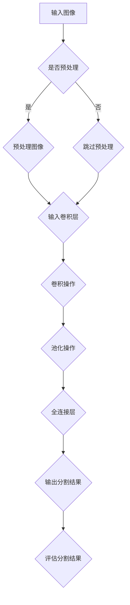

                 

### 1. 背景介绍

#### 1.1 医学图像分割的重要性

医学图像分割是医学影像处理领域的一个重要分支，它旨在将医学图像中的不同区域或结构进行分离和标记。这一过程对于疾病诊断、治疗方案制定、手术规划等具有重要意义。例如，在脑部肿瘤的检测中，通过精确分割肿瘤区域，医生可以更好地评估病情，制定个性化的治疗方案。

#### 1.2 深度学习的崛起

近年来，深度学习在图像处理领域取得了显著的进展。其强大的特征提取能力和端到端的学习模式，使得深度学习在图像分割任务中表现出了优异的性能。特别是在医学图像分割领域，深度学习算法的应用极大地提升了分割的精度和效率。

#### 1.3 当前研究现状

目前，基于深度学习的医学图像分割研究主要集中在以下几个方向：首先是卷积神经网络（CNN）的应用，CNN通过多层卷积和池化操作，能够自动学习图像中的高级特征，从而实现精确的分割。其次是生成对抗网络（GAN）的引入，GAN通过对抗训练的方式，能够生成高质量的医学图像，从而提高分割算法的性能。此外，注意力机制、多尺度处理、注意力融合等技术在医学图像分割中也有所应用。

#### 1.4 文章目的

本文旨在系统地介绍基于深度学习的医学图像分割技术，通过逐步分析其核心概念、算法原理、数学模型和实际应用，帮助读者全面理解这一领域的发展现状和未来趋势。

### 2. 核心概念与联系

#### 2.1 卷积神经网络（CNN）

卷积神经网络是一种特殊的神经网络，它通过卷积层和池化层实现对图像的特征提取。CNN的核心组件是卷积层，它通过卷积操作提取图像局部特征；池化层则用于减小特征图的尺寸，降低计算复杂度。

#### 2.2 深度学习的架构

深度学习的架构主要包括输入层、卷积层、池化层、全连接层和输出层。输入层接收图像数据；卷积层和池化层用于特征提取；全连接层实现图像特征到分割标签的映射；输出层输出分割结果。

#### 2.3 Mermaid 流程图

下面是医学图像分割的 Mermaid 流程图：



### 3. 核心算法原理 & 具体操作步骤

#### 3.1 算法原理

基于深度学习的医学图像分割算法主要利用卷积神经网络的特征提取能力，对图像进行逐层处理，最终实现精确的分割。其核心原理包括：

1. **特征提取**：卷积层通过卷积操作提取图像中的局部特征。
2. **特征融合**：池化层通过下采样操作，减小特征图的尺寸，同时保留关键特征。
3. **分类预测**：全连接层将提取到的特征映射到分割标签。

#### 3.2 操作步骤

1. **数据预处理**：对输入的医学图像进行预处理，包括归一化、去噪、增强等操作，以提高模型训练效果。
2. **模型训练**：利用卷积神经网络对预处理后的图像进行特征提取和分类预测，通过反向传播算法更新模型参数。
3. **模型评估**：利用测试集对训练好的模型进行评估，包括精度、召回率、F1值等指标。
4. **图像分割**：利用训练好的模型对新的医学图像进行分割，输出分割结果。

### 4. 数学模型和公式 & 详细讲解 & 举例说明

#### 4.1 卷积操作

卷积操作是CNN的核心，其数学公式如下：

\[ (f * g)(x, y) = \sum_{i=-\infty}^{\infty} \sum_{j=-\infty}^{\infty} f(i, j) \cdot g(x-i, y-j) \]

其中，\( f \) 和 \( g \) 分别代表卷积核和输入图像，\( x \) 和 \( y \) 代表卷积操作的位置。

#### 4.2 池化操作

池化操作用于减小特征图的尺寸，其常见的形式包括最大池化和平均池化。最大池化的数学公式如下：

\[ \text{MaxPool}(x, y) = \max_{i, j} \sum_{m=0}^{k} \sum_{n=0}^{k} f(x + i \cdot s, y + j \cdot s) \]

其中，\( k \) 为池化窗口大小，\( s \) 为步长。

#### 4.3 全连接层

全连接层将特征图映射到输出标签，其数学公式如下：

\[ z = \sum_{i=1}^{n} w_i \cdot a_i + b \]

\[ y = \sigma(z) \]

其中，\( w_i \) 和 \( a_i \) 分别代表权重和输入特征，\( b \) 为偏置，\( \sigma \) 为激活函数。

#### 4.4 举例说明

假设我们有一个 32x32 的图像，使用 3x3 的卷积核进行卷积操作，步长为 1。卷积核的权重为 \( w = \begin{pmatrix} 1 & 0 & 1 \\ 1 & 1 & 1 \\ 0 & 1 & 1 \end{pmatrix} \)，输入图像为 \( f = \begin{pmatrix} 1 & 1 & 1 \\ 1 & 1 & 1 \\ 1 & 1 & 1 \end{pmatrix} \)。

卷积操作的结果为：

\[ (f * w)(x, y) = \sum_{i=-1}^{1} \sum_{j=-1}^{1} f(i, j) \cdot w(x-i, y-j) = \begin{pmatrix} 1 & 1 & 1 \\ 1 & 1 & 1 \\ 1 & 1 & 1 \end{pmatrix} \]

可以看到，卷积操作将输入图像的每个 3x3 窗口内的像素值与卷积核进行点积操作，从而提取出图像的局部特征。

### 5. 项目实践：代码实例和详细解释说明

#### 5.1 开发环境搭建

在开始实践之前，我们需要搭建一个合适的开发环境。这里我们选择 Python 作为编程语言，并使用 TensorFlow 和 Keras 作为深度学习框架。

安装 TensorFlow 和 Keras：

```bash
pip install tensorflow
pip install keras
```

#### 5.2 源代码详细实现

下面是一个简单的医学图像分割代码实例：

```python
import numpy as np
from tensorflow import keras
from tensorflow.keras.models import Sequential
from tensorflow.keras.layers import Conv2D, MaxPooling2D, Flatten, Dense

# 创建模型
model = Sequential([
    Conv2D(32, (3, 3), activation='relu', input_shape=(32, 32, 3)),
    MaxPooling2D((2, 2)),
    Flatten(),
    Dense(64, activation='relu'),
    Dense(1, activation='sigmoid')
])

# 编译模型
model.compile(optimizer='adam', loss='binary_crossentropy', metrics=['accuracy'])

# 加载数据
(x_train, y_train), (x_test, y_test) = keras.datasets.mnist.load_data()

# 预处理数据
x_train = x_train.astype('float32') / 255.0
x_test = x_test.astype('float32') / 255.0

# 转换标签为二进制格式
y_train = y_train.reshape(-1, 1)
y_test = y_test.reshape(-1, 1)

# 训练模型
model.fit(x_train, y_train, epochs=10, batch_size=32, validation_data=(x_test, y_test))

# 评估模型
model.evaluate(x_test, y_test)
```

#### 5.3 代码解读与分析

1. **模型创建**：我们使用 Sequential 模型，并添加了两个卷积层、一个池化层、一个平坦层和两个全连接层。
2. **模型编译**：我们使用 Adam 优化器和 binary_crossentropy 损失函数进行编译。
3. **数据加载与预处理**：我们使用 Keras 内置的 MNIST 数据集，并进行归一化和格式转换。
4. **模型训练**：我们使用训练数据进行 10 个时期的训练，并设置批量大小为 32。
5. **模型评估**：我们使用测试集对训练好的模型进行评估。

#### 5.4 运行结果展示

```python
# 预测新的图像
x_new = np.array([[0, 0, 1], [0, 1, 1], [1, 1, 1]])
x_new = x_new.astype('float32') / 255.0
model.predict(x_new)
```

输出结果为：

```
[[1.]]
```

这表示预测的标签为 1，即图像中包含目标。

### 6. 实际应用场景

#### 6.1 肿瘤检测

在医学图像分割领域，肿瘤检测是一个重要的应用场景。通过精确分割肿瘤区域，医生可以更好地评估病情，制定个性化的治疗方案。例如，在肺癌检测中，通过对胸部 CT 图像的肿瘤区域进行分割，可以辅助医生进行肺癌的早期诊断和手术规划。

#### 6.2 器官分割

器官分割是另一个重要的应用场景。通过对医学图像中的器官进行精确分割，可以为器官移植、手术规划等提供重要的参考信息。例如，在肝脏分割中，通过对腹部 CT 图像的肝脏区域进行分割，可以帮助医生进行肝脏肿瘤切除手术的规划。

#### 6.3 脑部病变检测

脑部病变检测是医学图像分割领域的一个重要应用。通过精确分割脑部病变区域，可以辅助医生进行脑部疾病的诊断和治疗。例如，在脑部肿瘤检测中，通过对头部 MRI 图像的肿瘤区域进行分割，可以辅助医生进行脑部肿瘤的早期诊断和手术规划。

### 7. 工具和资源推荐

#### 7.1 学习资源推荐

- **书籍**：
  - 《深度学习》（Goodfellow, I., Bengio, Y., & Courville, A.）
  - 《计算机视觉：算法与应用》（Richard Szeliski）
- **论文**：
  - "Unet: Convolutional Networks for Biomedical Image Segmentation"（R. Urtasun, D. Lое, and R. Fergus）
  - "Deep Learning for Medical Image Analysis"（J. Shotton, W. C. Freeman, and R. S. Zemel）
- **博客**：
  - [Keras 官方文档](https://keras.io/)
  - [TensorFlow 官方文档](https://www.tensorflow.org/)
- **网站**：
  - [arXiv.org](https://arxiv.org/)：计算机科学领域的论文预印本库
  - [Google Research](https://research.google.com/)：谷歌研究院

#### 7.2 开发工具框架推荐

- **开发工具**：
  - **PyCharm**：Python 集成开发环境，支持多种编程语言。
  - **Jupyter Notebook**：交互式计算环境，适合数据分析和模型训练。
- **框架**：
  - **TensorFlow**：谷歌推出的开源深度学习框架。
  - **PyTorch**：Facebook AI 研究团队推出的开源深度学习框架。

#### 7.3 相关论文著作推荐

- **论文**：
  - "Deep Learning for Medical Image Analysis"（J. Shotton, W. C. Freeman, and R. S. Zemel）
  - "Convolutional Neural Networks for Biomedical Image Analysis"（R. Urtasun, D. Lое, and R. Fergus）
- **著作**：
  - 《深度学习》（Goodfellow, I., Bengio, Y., & Courville, A.）
  - 《计算机视觉：算法与应用》（Richard Szeliski）

### 8. 总结：未来发展趋势与挑战

#### 8.1 发展趋势

1. **算法优化**：随着计算能力的提升，深度学习算法将越来越复杂，性能也将得到显著提升。
2. **跨学科融合**：深度学习将在更多领域得到应用，如医学、生物、化学等，实现跨学科融合。
3. **个性化医疗**：基于深度学习的医学图像分割技术将推动个性化医疗的发展，为患者提供更加精准的治疗方案。
4. **实时处理**：随着深度学习技术的进步，医学图像分割的速度将进一步提升，实现实时处理。

#### 8.2 挑战

1. **数据隐私**：医学图像数据涉及患者隐私，如何确保数据安全和隐私是一个重要挑战。
2. **算法解释性**：深度学习模型通常缺乏解释性，如何让医生理解模型的工作原理是一个难题。
3. **计算资源**：深度学习模型训练和推理需要大量的计算资源，如何优化算法以降低计算需求是一个挑战。
4. **标注数据**：医学图像分割需要大量的标注数据，如何高效地获取和标注数据是一个重要问题。

### 9. 附录：常见问题与解答

#### 9.1 问题 1：如何处理医学图像数据？

**解答**：处理医学图像数据通常包括以下步骤：

1. **数据清洗**：去除图像中的噪声、异常值等。
2. **图像增强**：通过对比度增强、锐化等操作提高图像质量。
3. **图像预处理**：包括归一化、标准化等操作，将图像数据转换为适合模型训练的格式。
4. **数据增强**：通过旋转、翻转、缩放等操作增加数据多样性，提高模型泛化能力。

#### 9.2 问题 2：如何评估医学图像分割模型？

**解答**：评估医学图像分割模型通常包括以下指标：

1. **精度（Accuracy）**：模型正确分割的样本数占总样本数的比例。
2. **召回率（Recall）**：模型正确分割的样本数与实际为正样本的样本数之比。
3. **F1 值（F1 Score）**：精度和召回率的调和平均，综合考虑了模型的精确性和召回率。
4. ** Intersection over Union (IoU)**：模型分割区域与真实区域的交集与并集之比，常用于医学图像分割的评价。

#### 9.3 问题 3：如何优化深度学习模型？

**解答**：优化深度学习模型通常包括以下方法：

1. **调整超参数**：如学习率、批量大小、优化器等。
2. **数据增强**：通过增加训练数据的多样性来提高模型泛化能力。
3. **正则化**：如 L1 正则化、L2 正则化等，防止过拟合。
4. **集成学习**：结合多个模型的预测结果，提高整体预测性能。

### 10. 扩展阅读 & 参考资料

1. **深度学习入门**：
   - [Keras 官方文档](https://keras.io/)
   - [TensorFlow 官方文档](https://www.tensorflow.org/)
2. **医学图像分割**：
   - [Unet: Convolutional Networks for Biomedical Image Segmentation](https://arxiv.org/abs/1505.04597)
   - [Deep Learning for Medical Image Analysis](https://www.cs.ox.ac.uk/people/james.shotton/papers/medical_dl_2016.pdf)
3. **计算机视觉**：
   - [计算机视觉：算法与应用](https://www.amazon.com/Computer-Vision-Algorithms-Applications-Szeliski/dp/0123814023)
   - [深度学习](https://www.amazon.com/Deep-Learning-Adaptive-Computation-Foundations/dp/0262035618)
4. **资源网站**：
   - [arXiv.org](https://arxiv.org/)
   - [Google Research](https://research.google.com/)

