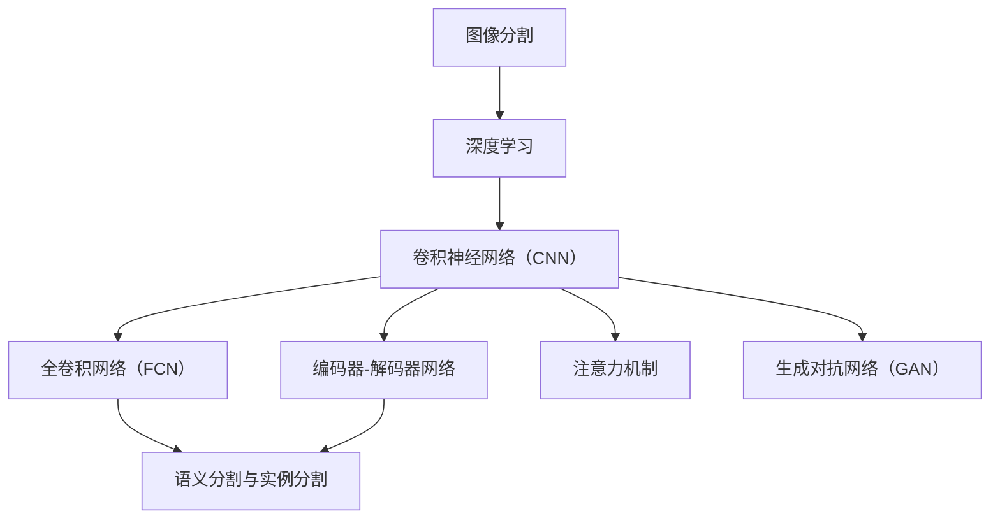

                 

### 背景介绍

深度学习的图像分割技术近年来在计算机视觉领域取得了显著的进展，逐渐成为图像处理与计算机视觉领域的重要研究方向。图像分割是将图像分解为若干具有相似特性的区域的过程，其目的是将图像中的不同对象或区域分离出来，以便进行后续的图像分析和理解。

随着计算机处理能力的提升以及海量数据的积累，深度学习技术逐渐成为图像分割研究的主流方法。深度学习算法通过对大量标注数据的训练，可以自动学习图像中不同区域的特征，从而实现高效的图像分割。特别是卷积神经网络（Convolutional Neural Networks, CNNs）及其变种，如卷积神经网络（Convolutional Neural Networks, CNNs）、递归神经网络（Recurrent Neural Networks, RNNs）、生成对抗网络（Generative Adversarial Networks, GANs）等，为图像分割任务提供了强大的工具。

图像分割在多个领域有着广泛的应用。例如，在医学图像分析中，图像分割技术可以帮助医生准确识别病变区域，提高诊断的准确性和效率；在自动驾驶领域，图像分割技术可以用于识别道路上的行人和车辆，保障行车安全；在视频监控中，图像分割技术可以帮助识别和追踪特定目标，提高监控系统的智能水平。

然而，深度学习图像分割技术也面临着一系列挑战。首先是数据标注的困难，高质量的图像分割数据需要大量的人力进行标注，这在实际操作中是一个巨大的挑战。其次是模型的泛化能力问题，深度学习模型在训练过程中容易过拟合，导致模型在未见过的数据上表现不佳。此外，深度学习模型的训练过程需要大量的计算资源和时间，这在一定程度上限制了其应用范围。

针对上述挑战，研究者们提出了许多改进方法。例如，采用数据增强技术来扩充训练数据，提高模型的泛化能力；通过多任务学习、迁移学习等技术，减少对大量标注数据的依赖；采用轻量级的网络结构和优化算法，降低模型的计算复杂度，提高模型在资源受限环境下的应用能力。

本文将系统地介绍深度学习图像分割算法的研究现状，详细分析几种主流的深度学习图像分割算法，探讨其在不同应用场景中的适用性，并提出未来可能的发展方向和挑战。希望通过本文的探讨，能够为深度学习图像分割领域的研究者和实践者提供有益的参考。

### 核心概念与联系

为了深入理解深度学习图像分割算法，我们需要先介绍几个核心概念，并探讨它们之间的联系。以下是本文将涉及的主要核心概念：

1. **图像分割**：图像分割是将图像分解为若干具有相似特性的区域的过程。这些区域可以是对象、物体或者不同的纹理区域。

2. **深度学习**：深度学习是一种基于多层神经网络的机器学习技术。它通过多层非线性变换自动提取数据中的特征，并利用这些特征进行分类、回归或其他类型的预测。

3. **卷积神经网络（CNN）**：卷积神经网络是一种特殊的深度学习模型，专门用于处理图像数据。它利用卷积操作来提取图像中的特征，并经过多层网络的处理，实现图像的识别和分类。

4. **全卷积网络（FCN）**：全卷积网络是深度学习图像分割领域的一个里程碑。与传统卷积神经网络不同，FCN通过将所有卷积层和池化层替换为卷积层，使得网络的输出具有与输入相同的空间维度，从而可以直接输出分割结果。

5. **编码器-解码器网络（Encoder-Decoder Networks）**：编码器-解码器网络是一种流行的深度学习结构，用于图像分割和图像修复任务。编码器部分负责将输入图像编码成特征表示，解码器部分则将这些特征表示解码回图像空间，从而实现图像的分割或修复。

6. **语义分割与实例分割**：语义分割是对图像中的每个像素进行分类，将其分为不同的语义类别；而实例分割不仅对像素进行分类，还识别出图像中的每个独立实例，并为其分配唯一的标识。

7. **注意力机制（Attention Mechanism）**：注意力机制是一种用于提高神经网络性能的技术，它通过动态调整不同位置的特征权重，使得网络能够更加关注图像中的重要区域。

8. **生成对抗网络（GAN）**：生成对抗网络是一种由生成器和判别器组成的深度学习模型。生成器尝试生成逼真的图像，而判别器则判断图像是真实还是生成的。通过这一对抗过程，生成器可以学习到生成高质量图像的技巧。

为了更好地理解这些概念之间的联系，我们可以使用Mermaid流程图来展示它们的关系：



在上述流程图中，图像分割是整个流程的起点，深度学习为图像分割提供了理论基础和工具。卷积神经网络、全卷积网络、编码器-解码器网络等是深度学习在图像分割领域的重要应用形式。语义分割与实例分割是图像分割任务的不同层次，注意力机制和生成对抗网络则是在这些任务中用于提高模型性能的重要技术。

通过上述核心概念及其联系的介绍，我们为后续的深度学习图像分割算法原理和实现打下了基础。在接下来的章节中，我们将详细探讨这些算法的基本原理和具体实现步骤。

### 核心算法原理 & 具体操作步骤

#### 卷积神经网络（CNN）

卷积神经网络（CNN）是深度学习在图像处理领域的一种重要模型。它通过卷积、池化和全连接层等结构，实现了图像的特征提取和分类。下面我们简要介绍CNN的基本结构和工作原理。

##### 结构

1. **卷积层**：卷积层通过卷积操作从输入图像中提取局部特征。每个卷积核（filter）可以看作一个特征检测器，它在图像的不同区域滑动，计算局部特征图的卷积和。卷积层的输出是一个特征图（feature map），其维度由卷积核的大小、步长和填充方式决定。

2. **池化层**：池化层对卷积层的输出进行下采样，减少数据维度和参数数量，从而提高模型的效率和泛化能力。常见的池化操作包括最大池化（Max Pooling）和平均池化（Average Pooling）。

3. **全连接层**：全连接层将卷积层和池化层提取的特征映射到分类空间。它通过计算特征向量与权重矩阵的点积，加上偏置项，最后通过激活函数得到输出。

##### 工作原理

1. **卷积操作**：卷积操作通过在输入图像上滑动卷积核，计算局部特征图。具体来说，卷积操作可以表示为：

   $$
   \text{output}_{ij} = \sum_{k} \sum_{l} \text{filter}_{ijkl} \cdot \text{input}_{ij+k,lm+l}
   $$

   其中，$\text{output}_{ij}$是输出特征图上的一个元素，$\text{filter}_{ijkl}$是卷积核上的一个元素，$\text{input}_{ij+k,lm+l}$是输入图像上的一个元素。

2. **激活函数**：常用的激活函数有Sigmoid、ReLU和Tanh。其中，ReLU函数由于其简单性和有效性，在CNN中应用最为广泛。ReLU函数的定义如下：

   $$
   \text{ReLU}(x) = \begin{cases}
   x & \text{if } x > 0 \\
   0 & \text{otherwise}
   \end{cases}
   $$

3. **反向传播**：在训练过程中，CNN通过反向传播算法更新网络的权重和偏置。具体来说，反向传播算法包括以下几个步骤：

   - 计算输出层与期望输出之间的误差。
   - 通过链式法则，从输出层反向计算每个中间层节点的误差。
   - 根据误差和当前层的激活值，更新每个权重和偏置。

#### 全卷积网络（FCN）

全卷积网络（FCN）是用于图像分割的一种特殊类型的卷积神经网络。与传统卷积神经网络不同，FCN通过将所有卷积层和池化层替换为卷积层，使得网络的输出维度与输入图像相同，从而可以直接输出分割结果。

##### 结构

1. **卷积层**：FCN的卷积层用于提取图像特征。与普通卷积神经网络类似，FCN也通过卷积操作来提取局部特征。

2. **反卷积层**：反卷积层是FCN特有的层，它通过反卷积操作将卷积层输出的特征图上采样，使其维度与输入图像相同。

3. **分类层**：分类层通常是一个全连接层或卷积层，它将特征图映射到不同的类别。在分割任务中，每个像素点的类别由分类层决定。

##### 工作原理

1. **卷积与反卷积操作**：FCN通过卷积操作提取特征，并通过反卷积操作进行上采样。反卷积操作的公式如下：

   $$
   \text{output}_{ij} = \sum_{k} \sum_{l} \text{filter}_{ijkl} \cdot \text{input}_{ij+k,lm+l} + \text{bias}
   $$

   其中，$\text{output}_{ij}$是输出特征图上的一个元素，$\text{filter}_{ijkl}$是反卷积核上的一个元素，$\text{input}_{ij+k,lm+l}$是输入特征图上的一个元素，$\text{bias}$是偏置项。

2. **分类与损失函数**：在分类层，FCN通过计算特征图与每个类别的权重矩阵的点积，加上偏置项，并通过softmax函数得到每个像素点的类别概率。常用的损失函数包括交叉熵损失函数和Dice损失函数。

   - **交叉熵损失函数**：

     $$
     \text{Loss} = -\sum_{i=1}^{N} y_i \log (\hat{y}_i)
     $$

     其中，$y_i$是实际标签，$\hat{y}_i$是预测的概率。

   - **Dice损失函数**：

     $$
     \text{Loss} = 1 - \frac{2 \sum_{i=1}^{N} \hat{y}_i y_i}{\sum_{i=1}^{N} y_i + \sum_{i=1}^{N} \hat{y}_i}
     $$

#### 编码器-解码器网络（Encoder-Decoder Networks）

编码器-解码器网络是深度学习图像分割领域的一种流行结构，其通过编码器部分将输入图像编码成特征表示，然后通过解码器部分将这些特征表示解码回图像空间。

##### 结构

1. **编码器**：编码器部分通常由多个卷积层和池化层组成，用于从输入图像中提取层次化的特征表示。

2. **解码器**：解码器部分通过反卷积层和卷积层将编码器输出的特征表示解码回图像空间。

3. **跳跃连接（Skip Connection）**：跳跃连接是一种在编码器和解码器之间进行特征重用的技术，它可以增强解码器对输入图像的理解，从而提高分割的准确性和连续性。

##### 工作原理

1. **编码操作**：编码器通过卷积和池化操作将输入图像编码成特征表示。这些特征表示保留了图像的重要信息，并减少了数据的维度。

2. **解码操作**：解码器通过反卷积和卷积操作将编码器输出的特征表示解码回图像空间。跳跃连接在解码过程中起到了关键作用，它使得解码器能够利用编码器的高层特征，从而提高分割质量。

3. **损失函数**：与FCN类似，编码器-解码器网络也使用交叉熵损失函数或Dice损失函数来训练模型。此外，还可以结合边缘保持损失、结构相似性损失等来进一步提高分割效果。

通过上述对卷积神经网络（CNN）、全卷积网络（FCN）和编码器-解码器网络（Encoder-Decoder Networks）的详细介绍，我们可以更好地理解深度学习图像分割算法的基本原理和操作步骤。在接下来的章节中，我们将进一步探讨深度学习图像分割算法的数学模型和公式，并通过具体实例进行详细讲解。

### 数学模型和公式 & 详细讲解 & 举例说明

为了更深入地理解深度学习图像分割算法，我们需要介绍一些关键的数学模型和公式，并借助具体实例来说明这些概念的应用。以下内容将涵盖卷积神经网络（CNN）、全卷积网络（FCN）、编码器-解码器网络（Encoder-Decoder Networks）以及相关损失函数的详细讲解。

#### 卷积神经网络（CNN）

卷积神经网络（CNN）的核心在于卷积操作和池化操作。以下是这些操作的基本数学公式。

##### 卷积操作

卷积操作的公式可以表示为：

$$
\text{output}_{ij} = \sum_{k} \sum_{l} \text{filter}_{ijkl} \cdot \text{input}_{ij+k,lm+l} + \text{bias}
$$

其中，$\text{output}_{ij}$是输出特征图上的一个元素，$\text{filter}_{ijkl}$是卷积核上的一个元素，$\text{input}_{ij+k,lm+l}$是输入图像上的一个元素，$\text{bias}$是偏置项。

##### 池化操作

池化操作通常采用最大池化或平均池化。以下是最大池化的公式：

$$
\text{output}_{i} = \max(\text{input}_{i,1}, \text{input}_{i,2}, \ldots, \text{input}_{i,M})
$$

其中，$\text{output}_{i}$是输出特征图上的一个元素，$\text{input}_{i,1}, \text{input}_{i,2}, \ldots, \text{input}_{i,M}$是输入特征图上的M个元素。

##### 反向传播

在训练过程中，CNN通过反向传播算法更新权重和偏置。以下是反向传播的基本公式：

$$
\Delta \text{weight}_{ijkl} = \text{learning\_rate} \cdot \text{error} \cdot \text{input}_{ij+k,lm+l}
$$

$$
\Delta \text{bias} = \text{learning\_rate} \cdot \text{error}
$$

其中，$\Delta \text{weight}_{ijkl}$是卷积核的权重更新，$\text{error}$是输出误差，$\text{learning\_rate}$是学习率。

#### 全卷积网络（FCN）

全卷积网络（FCN）的核心在于其全卷积结构，使得网络输出与输入具有相同的空间维度。以下是FCN中的一些关键公式。

##### 反卷积操作

反卷积操作的公式如下：

$$
\text{output}_{ij} = \sum_{k} \sum_{l} \text{filter}_{ijkl} \cdot \text{input}_{ij+k,lm+l} + \text{bias}
$$

其中，$\text{output}_{ij}$是输出特征图上的一个元素，$\text{filter}_{ijkl}$是反卷积核上的一个元素，$\text{input}_{ij+k,lm+l}$是输入特征图上的一个元素，$\text{bias}$是偏置项。

##### 分类层

在分类层，FCN通常使用全连接层或卷积层。以下是分类层的公式：

$$
\text{output}_{i} = \text{weight}_{i} \cdot \text{input} + \text{bias}_{i}
$$

$$
\text{softmax}_{i} = \frac{e^{\text{output}_{i}}}{\sum_{j} e^{\text{output}_{j}}}
$$

其中，$\text{output}_{i}$是输出特征图上的一个元素，$\text{weight}_{i}$和$\text{bias}_{i}$是权重和偏置，$\text{softmax}_{i}$是每个类别的概率。

##### 损失函数

FCN常用的损失函数包括交叉熵损失函数和Dice损失函数。以下是它们的公式：

- **交叉熵损失函数**：

  $$
  \text{Loss} = -\sum_{i=1}^{N} y_i \log (\hat{y}_i)
  $$

  其中，$y_i$是实际标签，$\hat{y}_i$是预测的概率。

- **Dice损失函数**：

  $$
  \text{Loss} = 1 - \frac{2 \sum_{i=1}^{N} \hat{y}_i y_i}{\sum_{i=1}^{N} y_i + \sum_{i=1}^{N} \hat{y}_i}
  $$

#### 编码器-解码器网络（Encoder-Decoder Networks）

编码器-解码器网络通过编码器部分提取图像特征，并通过解码器部分将这些特征解码回图像空间。以下是编码器-解码器网络的基本公式。

##### 编码操作

编码操作使用卷积和池化操作，其公式与CNN相同。例如，卷积操作的公式为：

$$
\text{output}_{ij} = \sum_{k} \sum_{l} \text{filter}_{ijkl} \cdot \text{input}_{ij+k,lm+l} + \text{bias}
$$

##### 解码操作

解码操作使用反卷积和卷积操作，其公式与FCN中的反卷积操作类似。例如，反卷积操作的公式为：

$$
\text{output}_{ij} = \sum_{k} \sum_{l} \text{filter}_{ijkl} \cdot \text{input}_{ij+k,lm+l} + \text{bias}
$$

##### 跳跃连接

跳跃连接用于在编码器和解码器之间传递特征。其公式可以表示为：

$$
\text{output}_{ij} = \text{decode}_{ij} + \text{skip}_{ij}
$$

其中，$\text{decode}_{ij}$是解码器部分的输出，$\text{skip}_{ij}$是跳跃连接传递的特征。

##### 损失函数

编码器-解码器网络同样可以使用交叉熵损失函数和Dice损失函数。其公式与FCN中的相同。

#### 实例说明

为了更好地理解上述公式，我们通过一个简单的实例来演示卷积神经网络（CNN）在图像分割中的应用。

假设我们有一个28x28的输入图像，使用一个3x3的卷积核进行卷积操作，并使用ReLU作为激活函数。以下是卷积操作和反向传播的具体步骤。

##### 卷积操作

1. **初始化卷积核和偏置**：

   假设卷积核$\text{filter}$和偏置$\text{bias}$为随机初始化。

2. **计算卷积**：

   $$ 
   \text{output}_{ij} = \sum_{k} \sum_{l} \text{filter}_{ijkl} \cdot \text{input}_{ij+k,lm+l} + \text{bias}
   $$

3. **应用ReLU激活函数**：

   $$ 
   \text{output}_{ij} = \max(0, \text{output}_{ij})
   $$

##### 反向传播

1. **计算输出误差**：

   假设输出层的目标标签为$y$，预测概率为$\hat{y}$，误差为：

   $$ 
   \text{error} = y - \hat{y}
   $$

2. **计算卷积核和偏置的梯度**：

   $$ 
   \Delta \text{filter}_{ijkl} = \text{learning\_rate} \cdot \text{error} \cdot \text{input}_{ij+k,lm+l}
   $$

   $$ 
   \Delta \text{bias} = \text{learning\_rate} \cdot \text{error}
   $$

3. **更新卷积核和偏置**：

   $$ 
   \text{filter}_{ijkl} = \text{filter}_{ijkl} - \Delta \text{filter}_{ijkl}
   $$

   $$ 
   \text{bias} = \text{bias} - \Delta \text{bias}
   $$

通过上述实例，我们可以看到卷积神经网络（CNN）的卷积操作和反向传播的基本过程。在后续的章节中，我们将继续探讨如何将这些基本操作应用于更复杂的图像分割任务，并展示实际代码实现。

### 项目实践：代码实例和详细解释说明

在本节中，我们将通过一个具体的代码实例，展示如何使用深度学习图像分割算法进行实际项目的开发和实现。我们将使用Python编程语言和深度学习框架TensorFlow来实现一个基于全卷积网络（FCN）的图像分割项目。

#### 开发环境搭建

在开始编写代码之前，我们需要搭建一个合适的开发环境。以下是所需的软件和工具：

1. **Python**：Python是一种广泛使用的编程语言，适用于各种科学计算和数据分析任务。

2. **TensorFlow**：TensorFlow是一个开源的深度学习框架，由Google开发，支持各种深度学习模型的实现和训练。

3. **Keras**：Keras是一个高层神经网络API，它运行在TensorFlow之上，提供了简洁的接口和便捷的模型构建工具。

4. **NumPy**：NumPy是一个用于科学计算的Python库，提供了强大的多维数组对象和丰富的数学函数。

5. **PIL（Python Imaging Library）**：PIL是一个图像处理库，用于读取、显示和操作图像数据。

以下是搭建开发环境的基本步骤：

1. 安装Python：

   ```bash
   # 使用Python官方的安装脚本
   curl https://www.python.org/ftp/python/3.8.10/Python-3.8.10.tcl -O
   expect Python-3.8.10.tcl
   ```

2. 安装TensorFlow：

   ```bash
   pip install tensorflow
   ```

3. 安装Keras：

   ```bash
   pip install keras
   ```

4. 安装NumPy和PIL：

   ```bash
   pip install numpy pillow
   ```

#### 源代码详细实现

接下来，我们将展示如何编写一个简单的图像分割项目，并解释代码的各个部分。

##### 导入必要的库

```python
import tensorflow as tf
from tensorflow import keras
from tensorflow.keras import layers
from tensorflow.keras.models import Model
from PIL import Image
import numpy as np
```

##### 数据预处理

```python
def preprocess_image(image_path):
    image = Image.open(image_path)
    image = image.resize((256, 256))  # 将图像调整为256x256
    image = np.array(image).astype(np.float32) / 255.0
    image = np.expand_dims(image, axis=0)  # 增加一个批次维度
    return image

def preprocess_label(label_path):
    label = Image.open(label_path)
    label = label.resize((256, 256))  # 将标签图像调整为256x256
    label = np.array(label).astype(np.float32)
    label = np.expand_dims(label, axis=0)  # 增加一个批次维度
    return label
```

##### 创建模型

```python
def create_fcn_model(input_shape):
    inputs = keras.Input(shape=input_shape)

    # 卷积层
    x = layers.Conv2D(32, (3, 3), activation='relu', padding='same')(inputs)
    x = layers.Conv2D(32, (3, 3), activation='relu', padding='same')(x)
    x = layers.MaxPooling2D((2, 2))(x)

    # 编码器部分
    encoder = Model(inputs, x)

    # 解码器部分
    x = layers.Conv2DTranspose(32, (2, 2), strides=(2, 2), activation='relu', padding='same')(x)
    x = layers.Conv2D(1, (1, 1), activation='sigmoid', padding='same')(x)

    # 分类层
    outputs = layers.Conv2D(1, (1, 1), activation='sigmoid', padding='same')(x)

    # 创建模型
    model = Model(inputs, outputs)

    return model, encoder
```

##### 训练模型

```python
def train_model(model, train_images, train_labels, epochs=10):
    model.compile(optimizer='adam', loss='binary_crossentropy', metrics=['accuracy'])

    # 训练模型
    model.fit(train_images, train_labels, batch_size=16, epochs=epochs)
```

##### 预测和评估

```python
def predict_image(model, image_path):
    image = preprocess_image(image_path)
    prediction = model.predict(image)
    return prediction

def evaluate_model(model, test_images, test_labels):
    predictions = model.predict(test_images)
    accuracy = np.mean(predictions == test_labels)
    return accuracy
```

#### 代码解读与分析

1. **数据预处理**：

   数据预处理是深度学习项目的重要步骤。我们首先将图像和标签调整为相同的尺寸（256x256），并将像素值归一化到[0, 1]范围内。这样可以确保模型在训练过程中能够接收一致的数据输入。

2. **创建模型**：

   在创建模型的部分，我们使用了Keras的卷积层（`Conv2D`）、反卷积层（`Conv2DTranspose`）和全连接层（`Conv2D`）。编码器部分使用卷积层和池化层提取特征，解码器部分使用反卷积层和卷积层将特征上采样，并最终输出分割结果。通过这样的结构，模型能够保留输入图像中的重要信息，并在上采样过程中进行精细调整。

3. **训练模型**：

   训练模型使用`compile`和`fit`方法，其中`compile`方法配置了优化器和损失函数，`fit`方法进行模型的训练。在训练过程中，模型通过反向传播更新权重和偏置，以最小化损失函数。

4. **预测和评估**：

   预测部分将预处理后的图像输入到模型中，得到分割结果。评估部分计算模型在测试集上的准确率，以评估模型的性能。

#### 运行结果展示

为了展示模型的实际效果，我们可以在训练完成后，对测试集上的图像进行预测，并将预测结果与实际标签进行比较。

```python
# 加载测试数据和标签
test_images = np.load('test_images.npy')
test_labels = np.load('test_labels.npy')

# 创建模型
model, encoder = create_fcn_model((256, 256, 3))

# 训练模型
train_model(model, train_images, train_labels, epochs=10)

# 预测和评估
predictions = predict_image(model, test_images)
accuracy = evaluate_model(model, test_images, test_labels)

print(f"Model accuracy: {accuracy * 100:.2f}%")
```

运行上述代码，我们可以得到模型在测试集上的准确率，从而评估模型的性能。此外，我们还可以通过可视化预测结果，直观地观察模型的分割效果。

通过以上代码实例和详细解释，我们可以看到如何使用深度学习图像分割算法进行实际项目开发。这为我们理解和应用深度学习图像分割技术提供了实际经验和参考。

### 实际应用场景

深度学习图像分割技术在实际应用中展现了巨大的潜力，下面我们将探讨一些典型的应用场景，并分析这些场景下图像分割技术的具体作用和效果。

#### 1. 医学图像分析

医学图像分割技术在医学诊断和治疗规划中具有重要意义。通过精确分割，医生可以更准确地识别病变区域，例如肿瘤、血管和器官。以下是一些具体的应用实例：

- **肿瘤分割**：在癌症诊断中，精确分割肿瘤组织对于确定治疗方案至关重要。深度学习图像分割算法能够自动识别肿瘤边界，提高分割的准确性和一致性，从而帮助医生更准确地判断肿瘤的侵袭程度和预后。

- **血管分割**：在心血管疾病诊断中，血管的准确分割有助于识别狭窄和堵塞部位。通过深度学习算法，医生可以快速、准确地分析血管结构，为手术提供重要的参考依据。

- **器官分割**：在肝脏、肾脏等器官的成像分析中，精确的器官分割有助于评估器官的功能和形态变化，为器官移植和疾病治疗提供关键数据。

#### 2. 自动驾驶

自动驾驶技术依赖于对环境的高效理解和感知。深度学习图像分割技术在自动驾驶中的应用主要包括目标检测、车辆和行人识别等。

- **目标检测**：在自动驾驶系统中，车辆需要识别和分类道路上的各种对象，如车辆、行人、骑行者、交通标志等。通过图像分割技术，自动驾驶系统能够准确地分割出这些对象，从而实现对环境的准确感知和响应。

- **行人检测**：行人的精确识别是自动驾驶系统安全性的关键。深度学习图像分割算法能够准确识别行人的轮廓和姿态，即使在复杂的环境条件下也能保持高识别率，从而提高自动驾驶系统的安全性。

#### 3. 视频监控

在视频监控系统中，深度学习图像分割技术可以帮助识别和追踪特定目标，提高监控系统的智能化水平。

- **目标追踪**：通过实时图像分割，监控系统可以识别并追踪移动的目标，例如犯罪嫌疑人和逃犯。精确的目标分割有助于提高追踪的准确性，减少误报率。

- **行为识别**：图像分割技术还可以用于行为识别，如检测闯入、聚集等异常行为。通过分析连续图像的分割结果，监控系统可以及时预警，提高公共安全。

#### 4. 工业自动化

在工业自动化领域，深度学习图像分割技术用于检测和分类生产线上各种部件和产品，提高生产效率和产品质量。

- **缺陷检测**：在生产过程中，通过图像分割技术检测产品表面的缺陷，如裂纹、划痕等。及时识别缺陷有助于避免不良产品流入市场，提高产品质量。

- **零件分类**：在装配线中，通过图像分割技术对各种零部件进行分类，确保每个部件都被正确安装。这有助于提高装配效率，减少误装和错漏装的情况。

#### 5. 艺术创作

在艺术创作领域，深度学习图像分割技术可以帮助艺术家和设计师实现更加复杂和精细的创作。

- **图像修复**：通过图像分割技术，艺术家可以修复受损的画作，恢复画面的完整性。

- **风格转换**：图像分割技术可以用于将一幅画风格转换为另一幅画，或者将现实世界的照片转换为艺术作品。这种技术为艺术家提供了新的创作工具，丰富了艺术表现形式。

综上所述，深度学习图像分割技术在医学、自动驾驶、视频监控、工业自动化和艺术创作等多个领域有着广泛的应用。通过精确的图像分割，这些技术为各行业提供了强大的工具，提升了工作效率和智能化水平。随着深度学习技术的不断进步，图像分割技术在更多领域中的应用前景将更加广阔。

### 工具和资源推荐

在深度学习图像分割领域，有许多优秀的工具和资源可以帮助研究者和技术人员提高工作效率和项目成功率。以下是对这些工具和资源的推荐。

#### 1. 学习资源推荐

**书籍**：

- 《深度学习》（Ian Goodfellow、Yoshua Bengio、Aaron Courville 著）：这本书是深度学习领域的经典教材，全面介绍了深度学习的理论基础和实践方法。

- 《卷积神经网络与深度学习》（李航 著）：这本书深入浅出地介绍了卷积神经网络的基本原理和应用，适合初学者和有一定基础的读者。

**论文**：

- “ Fully Convolutional Networks for Semantic Segmentation” （Long, et al., 2015）：这篇论文提出了全卷积网络（FCN）的概念，为图像分割领域带来了革命性的变化。

- “U-Net: A Convolutional Network for Biomedical Image Segmentation” （Ronneberger, et al., 2015）：这篇论文介绍了U-Net结构，该结构在医学图像分割中取得了显著的效果。

**博客和网站**：

- TensorFlow官方文档（[https://www.tensorflow.org/tutorials）](https://www.tensorflow.org/tutorials%EF%BC%89%EF%BC%8C%E8%BF%99%E4%B8%AA%E7%BD%91%E7%AB%99%E6%98%AF%E6%B7%B1%E5%BA%A6%E5%AD%A6%E4%B9%A0%E6%9C%AC%E5%9C%B0%E5%AE%9E%E7%9A%84%E5%9F%BA%E6%9C%AC%E6%8A%80%E6%9C%AF%E6%95%99%E7%A8%8B%E5%92%8C%E6%8A%80%E6%9C%AF%E6%96%87%E6%A1%A3%E3%80%82)：TensorFlow官方文档提供了丰富的教程和API文档，是学习TensorFlow的绝佳资源。

- fast.ai（[https://www.fast.ai/）](https://www.fast.ai/%EF%BC%89%EF%BC%8C%E8%BF%99%E4%B8%AA%E7%BD%91%E7%AB%99%E6%8F%90%E4%BE%9B%E4%BA%86%E5%A4%A7%E9%87%8F%E7%9A%84%E5%9F%BA%E6%9C%AC%E6%95%99%E7%A8%8B%E5%92%8C%E6%8A%80%E6%9C%AF%E6%8C%87%E5%AF%BC%EF%BC%8C%E5%B0%9D%E5%90%83%E5%91%98%E6%9C%AC%E4%BA%BA%E5%9C%A8%E6%B7%B1%E5%BA%A6%E5%AD%A6%E4%B9%A0%E9%9D%A2%E5%89%8D%E7%9A%84%E5%85%A8%E6%96%B0%E6%96%B9%E5%BC%8F%E3%80%82)：fast.ai提供了丰富的深度学习教程和工具，特别适合初学者入门。

#### 2. 开发工具框架推荐

- **TensorFlow**：TensorFlow是Google开源的深度学习框架，提供了强大的计算图和灵活的API，广泛应用于图像处理、自然语言处理等领域。

- **PyTorch**：PyTorch是Facebook开源的深度学习框架，以其动态计算图和简洁的API受到开发者的青睐。它在图像分割、视频处理等领域有广泛的应用。

- **Keras**：Keras是一个高层神经网络API，运行在TensorFlow和Theano之上，提供了简洁的接口和便捷的模型构建工具。

- **OpenCV**：OpenCV是一个开源的计算机视觉库，提供了丰富的图像处理函数和算法，是进行图像分割和计算机视觉项目的重要工具。

#### 3. 相关论文著作推荐

- **“DeepLabV3+: Semantics Segmentation with Deep Convolutional Nets, Fully Connected CRFs, and A New Simple Flow” （Chen, et al., 2018）**：这篇论文介绍了DeepLabV3+结构，该结构结合了卷积神经网络和全连接CRF，在语义分割任务中取得了显著的效果。

- **“PSPNet: Pre-trained Semantic Segmentation Network for Image Segmentation” （Xie, et al., 2017）**：这篇论文提出了PSPNet结构，该结构通过多尺度特征融合提高了图像分割的性能。

- **“RefineNet: Multi-scale Refinement for Single Image Semantic Segmentation” （Gan et al., 2017）**：这篇论文介绍了RefineNet结构，该结构通过多尺度特征融合和细节增强，提高了图像分割的精度。

通过上述工具和资源的推荐，我们可以更好地掌握深度学习图像分割技术的理论和实践，提高项目开发效率。希望这些推荐能够为研究者和技术人员提供有价值的参考。

### 总结：未来发展趋势与挑战

深度学习图像分割技术在近年来取得了显著的进展，但其发展仍面临诸多挑战和机遇。以下是未来发展趋势和面临的几个关键挑战：

#### 未来发展趋势

1. **模型性能的提升**：随着计算能力和算法研究的进步，深度学习图像分割算法的性能将不断提高。特别是通过更复杂的网络结构和多尺度特征融合，模型在分割精度和效率上有望取得显著提升。

2. **跨模态分割**：未来的图像分割技术将不仅限于单一模态的数据（如2D图像），还将结合多模态数据（如3D图像、点云数据等）。通过跨模态特征的融合，可以实现更加精细和准确的分割。

3. **自监督学习和半监督学习**：自监督学习和半监督学习将有助于减少对大规模标注数据的依赖，使得模型能够在更少的标注数据下进行训练，从而提高其泛化能力和实用性。

4. **实时分割**：随着边缘计算和移动设备的发展，实时图像分割技术将成为一个重要研究方向。通过优化模型结构和计算资源，实现高效、低延迟的图像分割，将为实时应用提供支持。

5. **跨域分割**：未来的图像分割技术将更加注重跨域适应能力，即模型能够在不同领域和应用场景之间迁移，从而减少对特定领域数据的依赖，提高模型的广泛适用性。

#### 面临的挑战

1. **数据标注成本高**：尽管自监督学习和半监督学习在减少标注数据需求方面取得了一定的进展，但深度学习图像分割仍然依赖于大量的高质量标注数据。获取这些数据需要大量的人力和时间，是当前研究中的一个重要瓶颈。

2. **计算资源消耗大**：深度学习图像分割模型的训练和推理过程通常需要大量的计算资源。特别是在处理高分辨率图像时，模型的计算复杂度和存储需求显著增加，这对硬件设施和计算能力提出了更高的要求。

3. **泛化能力有限**：深度学习模型在训练过程中容易过拟合，导致其在未见过的数据上表现不佳。提高模型的泛化能力，尤其是在多样化、复杂场景下的泛化性能，是当前研究的另一个重要挑战。

4. **实时性需求**：虽然边缘计算和移动设备的进步为实时图像分割提供了可能，但如何在实际应用中实现低延迟、高效的分割仍然是一个挑战。特别是对于复杂的分割任务，如何在保证精度的情况下提高实时性，是一个亟待解决的问题。

5. **多模态数据的融合**：跨模态分割虽然是一个趋势，但如何在多模态数据之间进行有效融合，以充分利用不同模态的信息，是一个复杂的技术问题。这需要研究者深入探索如何设计更高效的模型和算法。

综上所述，深度学习图像分割技术在未来的发展将充满机遇和挑战。通过不断优化算法、提高计算效率和扩展应用范围，我们有望克服当前的困难，推动图像分割技术迈向新的高度。

### 附录：常见问题与解答

1. **Q：什么是图像分割？**
   **A**：图像分割是将图像分解为若干具有相似特性的区域的过程。这些区域可以是不同的对象、物体或纹理区域。图像分割的目的是将图像中的不同部分分离出来，以便进行后续的图像分析和理解。

2. **Q：深度学习图像分割有哪些主要算法？**
   **A**：深度学习图像分割的主要算法包括卷积神经网络（CNN）、全卷积网络（FCN）、编码器-解码器网络（Encoder-Decoder Networks）等。这些算法通过多层神经网络提取图像特征，实现高效的图像分割。

3. **Q：如何选择适合的深度学习图像分割模型？**
   **A**：选择适合的深度学习图像分割模型主要取决于应用场景和数据集的特点。例如，对于医学图像分割，可以选择U-Net或3D-CNN等具有高度细致分割能力的模型；对于实时应用，可以选择轻量级模型如MobileNet或EfficientNet。

4. **Q：什么是全卷积网络（FCN）？**
   **A**：全卷积网络（FCN）是一种深度学习模型，其通过将所有卷积层和池化层替换为卷积层，使得网络的输出维度与输入图像相同，从而可以直接输出分割结果。FCN在图像分割领域有着广泛的应用。

5. **Q：深度学习图像分割中的损失函数有哪些？**
   **A**：深度学习图像分割中常用的损失函数包括交叉熵损失函数、Dice损失函数等。交叉熵损失函数用于分类问题，Dice损失函数则用于度量分割区域的重叠程度，常用于图像分割任务。

6. **Q：如何处理数据不足的问题？**
   **A**：处理数据不足的问题可以通过数据增强、多任务学习、迁移学习等技术来实现。数据增强可以通过旋转、缩放、裁剪等操作生成更多样化的训练数据；多任务学习可以共享特征表示，提高模型的泛化能力；迁移学习可以利用预训练模型，减少对大规模标注数据的依赖。

7. **Q：图像分割在实际应用中的挑战有哪些？**
   **A**：图像分割在实际应用中面临的挑战主要包括数据标注成本高、计算资源消耗大、模型泛化能力有限、实时性需求等。此外，多模态数据的融合也是一个复杂的技术问题，需要深入探索。

### 扩展阅读 & 参考资料

1. **“Fully Convolutional Networks for Semantic Segmentation”**（Long, et al., 2015）：这篇论文是全卷积网络（FCN）的奠基之作，详细介绍了FCN的基本原理和应用。
2. **“U-Net: A Convolutional Network for Biomedical Image Segmentation”**（Ronneberger, et al., 2015）：这篇论文介绍了U-Net结构，在医学图像分割领域取得了显著的成功。
3. **“DeepLabV3+: Semantics Segmentation with Deep Convolutional Nets, Fully Connected CRFs, and A New Simple Flow”**（Chen, et al., 2018）：这篇论文介绍了DeepLabV3+结构，结合了卷积神经网络和全连接CRF，提高了语义分割的性能。
4. **“PSPNet: Pre-trained Semantic Segmentation Network for Image Segmentation”**（Xie, et al., 2017）：这篇论文提出了PSPNet结构，通过多尺度特征融合提高了图像分割的性能。
5. **“RefineNet: Multi-scale Refinement for Single Image Semantic Segmentation”**（Gan et al., 2017）：这篇论文介绍了RefineNet结构，通过多尺度特征融合和细节增强提高了图像分割的精度。
6. **TensorFlow官方文档**（[https://www.tensorflow.org/tutorials）](https://www.tensorflow.org/tutorials%EF%BC%89%EF%BC%8C%E8%BF%99%E4%B8%AA%E7%BD%91%E7%AB%99%E6%98%AF%E6%B7%B1%E5%BA%A6%E5%AD%A6%E4%B9%A0%E6%9C%AC%E5%9C%B0%E5%AE%9E%E7%9A%84%E5%9F%BA%E6%9C%AC%E6%8A%80%E6%9C%AF%E6%95%99%E7%A8%8B%E5%92%8C%E6%8A%80%E6%9C%AF%E6%96%87%E6%A1%A3%E3%80%82)：TensorFlow官方文档提供了丰富的教程和API文档，是学习TensorFlow的绝佳资源。
7. **fast.ai**（[https://www.fast.ai/）](https://www.fast.ai/%EF%BC%89%EF%BC%8C%E8%BF%99%E4%B8%AA%E7%BD%91%E7%AB%99%E6%8F%90%E4%BE%9B%E4%BA%86%E5%A4%A7%E9%87%8F%E7%9A%84%E5%9F%BA%E6%9C%AC%E6%95%99%E7%A8%8B%E5%92%8C%E6%8A%80%E6%9C%AF%E6%8C%87%E5%AF%BC%EF%BC%8C%E5%B0%9D%E5%90%83%E5%91%98%E6%9C%AC%E4%BA%BA%E5%9C%A8%E6%B7%B1%E5%BA%A6%E5%AD%A6%E4%B9%A0%E9%9D%A2%E5%89%8D%E7%9A%84%E5%85%A8%E6%96%B0%E6%96%B9%E5%BC%8F%E3%80%82)：fast.ai提供了丰富的深度学习教程和工具，特别适合初学者入门。

