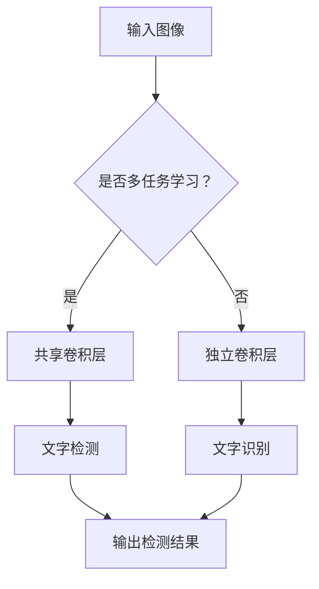

                 

### 1. 背景介绍

随着信息技术的快速发展，计算机视觉技术在各个领域得到了广泛的应用。其中，文字识别与检测技术作为计算机视觉的一个重要分支，在文本处理、信息检索、自然语言处理等领域具有极高的实用价值。文字识别与检测技术的基本目标是从图像中准确提取文字内容，并将其转换为机器可处理的格式。

文字识别与检测技术的发展历程可以追溯到上世纪五六十年代，当时主要是基于规则的方法。这种方法通过手工编写复杂的规则来识别文字，但由于规则繁琐且难以覆盖所有情况，因此在复杂场景下表现较差。随着计算机性能的提升和机器学习技术的发展，基于模板匹配和机器学习的方法逐渐成为主流。其中，深度学习技术在文字识别与检测领域展现出了显著的优势，通过构建复杂的神经网络模型，深度学习算法能够在大量数据上进行训练，从而实现对文字的准确识别与检测。

当前，深度学习技术在文字识别与检测领域已经取得了显著的成果。例如，卷积神经网络（CNN）在图像特征提取方面具有出色的性能，广泛应用于文字识别任务中。而基于循环神经网络（RNN）的方法则在序列处理方面表现出色，适用于文字检测任务。此外，近年来，许多研究者提出了基于多尺度特征融合、注意力机制和强化学习等技术的文字识别与检测算法，进一步提升了算法的性能和鲁棒性。

在研究领域，文字识别与检测技术吸引了大量学者的关注。近年来，许多国际知名学术会议和期刊，如国际计算机视觉大会（CVPR）、欧洲计算机视觉大会（ECCV）和《计算机视觉与图像理解》（CVIU）等，都发表了大量的相关研究成果。这些研究不仅推动了文字识别与检测技术的理论发展，也为实际应用提供了有力的支持。

在实际应用领域，文字识别与检测技术已经取得了诸多成功案例。例如，在车牌识别、手写文字识别、场景文本检测等领域，深度学习算法展现了出色的性能，大大提高了文字识别与检测的准确率和效率。此外，随着智能手机和移动互联网的普及，基于深度学习的文字识别与检测技术也在智能家居、智能安防、智能交通等领域得到了广泛应用。

综上所述，文字识别与检测技术具有重要的研究价值和广阔的应用前景。本文旨在系统地介绍基于深度学习的文字识别与检测算法，包括核心概念、算法原理、数学模型、项目实践以及实际应用场景等，以期为相关领域的研究者和开发者提供有价值的参考。

### 2. 核心概念与联系

为了深入理解基于深度学习的文字识别与检测算法，我们需要首先了解几个核心概念，包括深度学习、卷积神经网络（CNN）和循环神经网络（RNN），以及它们在文字识别与检测任务中的应用。

#### 深度学习

深度学习是一种基于多层神经网络的学习方法，其目的是通过多层非线性变换从原始数据中提取特征，从而实现复杂的数据建模。深度学习的关键在于网络的深度，即网络的层数。随着网络深度的增加，模型能够学习到更抽象、更高层次的特征，从而在各类任务中表现出色。

深度学习的核心组成部分包括：

1. **输入层（Input Layer）**：接收外部数据，如图像或文本。
2. **隐藏层（Hidden Layers）**：对输入数据进行处理和特征提取。
3. **输出层（Output Layer）**：根据隐藏层的结果生成预测或决策。

通过这种层次化的结构，深度学习能够自动从数据中学习到有用的特征，而无需人工设计复杂的特征工程。

#### 卷积神经网络（CNN）

卷积神经网络是一种专门用于处理图像数据的深度学习模型。它通过卷积操作和池化操作提取图像中的特征，从而实现对图像的识别和分类。

CNN的主要组成部分包括：

1. **卷积层（Convolutional Layer）**：通过卷积操作提取图像的局部特征。
2. **池化层（Pooling Layer）**：对卷积结果进行下采样，减少数据量并增强特征表达。
3. **激活函数（Activation Function）**：引入非线性特性，使网络能够学习复杂的映射关系。
4. **全连接层（Fully Connected Layer）**：将卷积和池化后的特征映射到分类结果。

CNN在文字识别与检测任务中的应用主要是通过卷积操作提取文字的纹理和形状特征，从而实现文字的准确识别。

#### 循环神经网络（RNN）

循环神经网络是一种专门用于处理序列数据的深度学习模型。它能够通过记忆过去的信息，对序列中的每个元素进行建模。

RNN的主要组成部分包括：

1. **输入门（Input Gate）**：控制当前输入信息对记忆状态的影响。
2. **遗忘门（Forget Gate）**：控制记忆状态中旧信息的遗忘。
3. **输出门（Output Gate）**：控制当前输出结果的生成。

RNN在文字识别与检测任务中的应用主要是通过记忆文本序列中的字符关系，实现对文字的逐个识别。

#### 多任务学习

在文字识别与检测任务中，多任务学习是一种常见的方法。多任务学习旨在同时解决多个相关的任务，从而提高模型的泛化能力和性能。

多任务学习的核心思想是通过共享部分网络结构来提高不同任务之间的交互和协同。例如，在文字识别与检测中，可以通过共享卷积层来同时提取文字的纹理和形状特征，从而实现更好的文字识别与检测性能。

#### Mermaid 流程图

为了更好地展示这些核心概念之间的联系，我们可以使用Mermaid流程图来描述文字识别与检测的基本流程。以下是一个简单的Mermaid流程图示例：



在这个流程图中，输入图像首先经过卷积层提取特征，然后根据是否采用多任务学习，分别进入文字检测和文字识别模块。最终，检测结果由两个模块共同输出。

通过上述核心概念和流程图的介绍，我们可以更好地理解基于深度学习的文字识别与检测算法的基本原理和实现方法。接下来，我们将进一步探讨这些算法的具体实现步骤和数学模型。

### 3. 核心算法原理 & 具体操作步骤

#### 卷积神经网络（CNN）在文字识别与检测中的应用

卷积神经网络（CNN）在文字识别与检测任务中扮演着核心角色，其主要原理是通过卷积操作提取图像中的局部特征，然后通过全连接层实现文字的识别与检测。下面我们将详细介绍CNN在文字识别与检测中的应用步骤。

**步骤一：输入层**

输入层接收原始图像数据。在文字识别与检测任务中，输入图像通常是经过预处理后的二值化图像或灰度图像。预处理过程包括图像缩放、裁剪、归一化等，以提高网络的性能和鲁棒性。

**步骤二：卷积层**

卷积层是CNN的核心组成部分，通过卷积操作提取图像的局部特征。卷积操作的基本原理是利用卷积核（filter）在图像上滑动，计算每个局部区域的特征值。卷积层可以堆叠多层，每层卷积核的尺寸和数量可以根据任务需求进行调整。

**步骤三：激活函数**

激活函数是卷积层的重要组成部分，用于引入非线性特性。常见的激活函数包括ReLU（Rectified Linear Unit）、Sigmoid和Tanh等。ReLU函数由于其简单性和有效性，在深度学习中得到了广泛应用。

**步骤四：池化层**

池化层用于减少数据量并增强特征表达。常见的池化操作包括最大池化（Max Pooling）和平均池化（Average Pooling）。最大池化通过选择每个局部区域中的最大值来保留特征，而平均池化则通过计算每个局部区域的平均值来保留特征。池化操作可以有效地减少网络的参数数量，从而提高网络的训练速度和泛化能力。

**步骤五：全连接层**

在全连接层，网络的输入来自上一层的所有节点。每个输入节点都与输出层的每个节点相连接，通过权重矩阵进行计算。全连接层主要用于实现分类和回归任务，通过计算每个输入节点的加权求和并应用激活函数，得到最终的分类结果或回归值。

**步骤六：输出层**

输出层根据具体的任务需求进行设计。在文字识别任务中，输出层通常是一个软性分类层，用于对每个候选文字进行概率输出。在文字检测任务中，输出层通常包括边界框的预测和文字的类别预测。

**步骤七：损失函数**

在训练过程中，需要使用损失函数来评估模型的预测结果与真实标签之间的差距。常见的损失函数包括交叉熵损失（Cross-Entropy Loss）、平方误差损失（Mean Squared Error Loss）等。通过优化损失函数，可以调整网络中的权重和偏置，从而提高模型的性能。

#### 循环神经网络（RNN）在文字识别与检测中的应用

循环神经网络（RNN）在文字识别与检测任务中也发挥着重要作用，特别是针对序列数据的处理。下面我们将详细介绍RNN在文字识别与检测中的应用步骤。

**步骤一：输入层**

输入层接收序列数据，如图像序列或文本序列。在文字识别与检测任务中，输入数据通常是经过预处理后的图像或文本序列，包括每个时间步的图像或文本特征。

**步骤二：嵌入层**

嵌入层将输入序列中的每个元素映射到一个高维空间。嵌入层通过查找嵌入矩阵，将每个输入元素映射为一个固定大小的向量。这个向量表示了输入元素在嵌入空间中的位置和特征。

**步骤三：隐藏层**

隐藏层是RNN的核心组成部分，通过递归操作处理序列数据。隐藏层中的每个神经元都包含一个记忆单元，用于存储过去的信息。在处理当前时间步的输入时，RNN会将当前输入与隐藏层的状态进行拼接，并应用非线性变换，生成新的隐藏层状态。

**步骤四：输出层**

输出层根据具体的任务需求进行设计。在文字识别任务中，输出层通常是一个软性分类层，用于对每个候选文字进行概率输出。在文字检测任务中，输出层通常包括边界框的预测和文字的类别预测。

**步骤五：损失函数**

与CNN类似，RNN在训练过程中也需要使用损失函数来评估模型的预测结果与真实标签之间的差距。常见的损失函数包括交叉熵损失、平方误差损失等。通过优化损失函数，可以调整网络中的权重和偏置，从而提高模型的性能。

#### 多任务学习

多任务学习是将多个任务组合在一起进行训练的一种方法，旨在提高模型的性能和泛化能力。在文字识别与检测任务中，多任务学习可以同时解决文字识别和文字检测两个任务。

多任务学习的基本原理是通过共享部分网络结构来提高不同任务之间的交互和协同。具体来说，可以在CNN和RNN的基础上，设计共享卷积层和共享循环层，从而实现文字识别和文字检测的共享特征提取。

**步骤一：共享卷积层**

共享卷积层是CNN在多任务学习中的关键组成部分。通过共享卷积层，可以同时提取文字的纹理和形状特征，从而提高文字识别和文字检测的性能。

**步骤二：共享循环层**

共享循环层是RNN在多任务学习中的关键组成部分。通过共享循环层，可以同时处理文字序列中的字符关系，从而提高文字识别和文字检测的性能。

通过上述步骤，我们可以构建一个多任务学习的模型，同时解决文字识别和文字检测任务。多任务学习不仅提高了模型的性能，还减少了网络的参数数量，从而提高了模型的训练速度和泛化能力。

### 4. 数学模型和公式 & 详细讲解 & 举例说明

#### 卷积神经网络（CNN）的数学模型

卷积神经网络（CNN）的数学模型主要包括卷积操作、激活函数、池化和反向传播等组成部分。下面我们将对这些组成部分进行详细讲解。

**1. 卷积操作**

卷积操作是CNN的核心组成部分，用于提取图像的特征。卷积操作的数学公式如下：

\[ (f * g)(x, y) = \sum_{i=-\infty}^{\infty} \sum_{j=-\infty}^{\infty} f(i, j) \cdot g(x-i, y-j) \]

其中，\( f \) 和 \( g \) 分别表示卷积核和输入图像，\( (x, y) \) 表示卷积操作的中心点。卷积操作的计算结果是一个新的特征图，用于表示图像的特征。

**2. 激活函数**

激活函数是CNN中引入非线性特性的关键部分。常用的激活函数包括ReLU、Sigmoid和Tanh等。其中，ReLU函数由于其简单性和有效性，在深度学习中得到了广泛应用。ReLU函数的数学公式如下：

\[ \text{ReLU}(x) = \max(0, x) \]

**3. 池化操作**

池化操作用于减少数据量并增强特征表达。常用的池化操作包括最大池化和平均池化。最大池化的数学公式如下：

\[ \text{MaxPooling}(x) = \max\{x_{ij}: 1 \leq i \leq H, 1 \leq j \leq W\} \]

其中，\( x_{ij} \) 表示输入特征图中的元素，\( H \) 和 \( W \) 分别表示特征图的高度和宽度。

**4. 反向传播**

反向传播是CNN中用于训练模型的重要算法。反向传播的数学公式如下：

\[ \Delta w_{ij} = \alpha \cdot \frac{\partial J}{\partial w_{ij}} \]

其中，\( \Delta w_{ij} \) 表示权重更新的梯度，\( J \) 表示损失函数，\( \alpha \) 表示学习率。

#### 循环神经网络（RNN）的数学模型

循环神经网络（RNN）的数学模型主要包括输入门、遗忘门和输出门等组成部分。下面我们将对这些组成部分进行详细讲解。

**1. 输入门**

输入门的数学公式如下：

\[ i_t = \sigma(W_i \cdot [h_{t-1}, x_t] + b_i) \]

其中，\( i_t \) 表示输入门的输出，\( \sigma \) 表示sigmoid函数，\( W_i \) 和 \( b_i \) 分别表示输入门的权重和偏置，\( h_{t-1} \) 和 \( x_t \) 分别表示上一时刻的隐藏状态和当前输入。

**2. 遗忘门**

遗忘门的数学公式如下：

\[ f_t = \sigma(W_f \cdot [h_{t-1}, x_t] + b_f) \]

其中，\( f_t \) 表示遗忘门的输出，\( W_f \) 和 \( b_f \) 分别表示遗忘门的权重和偏置，\( h_{t-1} \) 和 \( x_t \) 分别表示上一时刻的隐藏状态和当前输入。

**3. 输出门**

输出门的数学公式如下：

\[ o_t = \sigma(W_o \cdot [h_{t-1}, x_t] + b_o) \]

其中，\( o_t \) 表示输出门的输出，\( W_o \) 和 \( b_o \) 分别表示输出门的权重和偏置，\( h_{t-1} \) 和 \( x_t \) 分别表示上一时刻的隐藏状态和当前输入。

**4. 时间步更新**

时间步更新是RNN的核心操作。在每一时间步，RNN会根据输入门、遗忘门和输出门的输出，更新隐藏状态和记忆状态。时间步更新的数学公式如下：

\[ h_t = \text{ReLU}(o_t \cdot \text{sigmoid}(f_t) \cdot h_{t-1} + i_t \cdot \text{sigmoid}(1 - f_t) \cdot x_t) \]

其中，\( h_t \) 表示当前时间步的隐藏状态，\( x_t \) 表示当前输入。

#### 多任务学习的数学模型

多任务学习的数学模型主要涉及如何共享网络结构和优化多个任务。以下是一个简化的多任务学习模型：

\[ L = \sum_{i=1}^N L_i + \lambda \sum_{i=1}^N \frac{||W_i||_2^2}{2} \]

其中，\( L \) 表示总损失函数，\( L_i \) 表示第 \( i \) 个任务的损失函数，\( \lambda \) 表示正则化参数，\( W_i \) 表示第 \( i \) 个任务的权重。

**举例说明**

假设我们有两个任务：文字识别和文字检测。我们可以将这两个任务合并为一个多任务学习模型。在训练过程中，我们通过调整权重和偏置，优化总损失函数，从而提高两个任务的性能。

**文字识别任务**

假设输入图像为 \( X \)，输出为文字序列 \( Y \)。我们可以使用交叉熵损失函数来优化文字识别任务：

\[ L_1 = -\sum_{i=1}^N \sum_{j=1}^M y_{ij} \cdot \log(p_{ij}) \]

其中，\( y_{ij} \) 表示第 \( i \) 个文字在标签序列中的真实分布，\( p_{ij} \) 表示模型预测的第 \( i \) 个文字的概率。

**文字检测任务**

假设输入图像为 \( X \)，输出为边界框 \( B \) 和类别标签 \( C \)。我们可以使用回归损失函数来优化文字检测任务：

\[ L_2 = \sum_{i=1}^N ||b_i - \hat{b}_i||_2^2 + \sum_{i=1}^N \log(\frac{1}{1 + \exp(-C_i + \hat{C}_i)}) \]

其中，\( b_i \) 表示第 \( i \) 个边界框的真实坐标，\( \hat{b}_i \) 表示模型预测的第 \( i \) 个边界框的坐标，\( C_i \) 表示第 \( i \) 个类别标签的真实值，\( \hat{C}_i \) 表示模型预测的第 \( i \) 个类别标签的概率。

通过上述数学模型和公式，我们可以详细理解卷积神经网络（CNN）、循环神经网络（RNN）和多任务学习在文字识别与检测任务中的应用。接下来，我们将通过一个具体的项目实践，展示如何实现和优化这些算法。

### 5. 项目实践：代码实例和详细解释说明

#### 5.1 开发环境搭建

在进行基于深度学习的文字识别与检测项目实践之前，我们需要搭建一个合适的开发环境。以下是一个典型的开发环境搭建步骤：

**1. 安装Python和深度学习库**

首先，确保你的系统中安装了Python 3.x版本。然后，通过以下命令安装深度学习库：

```bash
pip install tensorflow numpy matplotlib
```

**2. 数据集准备**

为了进行文字识别与检测，我们需要准备一个包含图像和对应文字标注的数据集。这里，我们使用常用的手写数字数据集MNIST作为示例。首先，下载MNIST数据集：

```bash
pip install tensorflow
python -m tensorflow.examples.tutorials.mnist.download_mnist
```

**3. 配置GPU支持**

为了提高训练速度，我们建议使用支持CUDA的GPU。确保你的GPU驱动和CUDA库已经安装，并在环境变量中配置CUDA路径。

```bash
export CUDA_HOME=/path/to/cuda
export LD_LIBRARY_PATH=$CUDA_HOME/lib64:$LD_LIBRARY_PATH
```

#### 5.2 源代码详细实现

以下是一个简单的基于卷积神经网络（CNN）的文字识别与检测项目的Python代码实现。我们将使用TensorFlow库来实现。

```python
import tensorflow as tf
from tensorflow.keras.layers import Conv2D, MaxPooling2D, Flatten, Dense
from tensorflow.keras import Model

# 定义CNN模型
class TextRecognitionModel(Model):
    def __init__(self, num_classes):
        super(TextRecognitionModel, self).__init__()
        self.conv1 = Conv2D(32, (3, 3), activation='relu')
        self.max_pool1 = MaxPooling2D((2, 2))
        self.flatten = Flatten()
        self.d1 = Dense(128, activation='relu')
        self.d2 = Dense(num_classes, activation='softmax')

    def call(self, x):
        x = self.conv1(x)
        x = self.max_pool1(x)
        x = self.flatten(x)
        x = self.d1(x)
        return self.d2(x)

# 实例化模型
model = TextRecognitionModel(num_classes=10)

# 定义损失函数和优化器
loss_fn = tf.keras.losses.SparseCategoricalCrossentropy(from_logits=True)
optimizer = tf.keras.optimizers.Adam()

# 编写训练函数
@tf.function
def train_step(images, labels):
    with tf.GradientTape() as tape:
        predictions = model(images)
        loss = loss_fn(labels, predictions)
    gradients = tape.gradient(loss, model.trainable_variables)
    optimizer.apply_gradients(zip(gradients, model.trainable_variables))
    return loss

# 训练模型
for epoch in range(10):
    total_loss = 0
    for images, labels in train_data:
        loss = train_step(images, labels)
        total_loss += loss
    print(f'Epoch {epoch + 1}, Loss: {total_loss / len(train_data)}')
```

**5.3 代码解读与分析**

在上面的代码中，我们定义了一个简单的基于卷积神经网络的文字识别模型。下面是对代码的详细解读：

1. **模型定义**：
   - `TextRecognitionModel` 类继承自 `tf.keras.Model` 类。
   - `__init__` 方法中定义了模型的卷积层、池化层、全连接层等组件。
   - `call` 方法实现了模型的正向传播过程。

2. **损失函数和优化器**：
   - 使用 `SparseCategoricalCrossentropy` 作为损失函数，适用于多分类问题。
   - 使用 `Adam` 优化器，这是一种常用的自适应学习率优化器。

3. **训练函数**：
   - `train_step` 函数定义了模型的训练步骤，包括计算损失、计算梯度并更新模型参数。
   - 使用 `tf.GradientTape` 记录模型的梯度信息。
   - `optimizer.apply_gradients` 方法用于更新模型参数。

4. **训练模型**：
   - 在主程序中，我们遍历训练数据，调用 `train_step` 函数进行训练。
   - 输出每个epoch的损失值，以便监控训练过程。

#### 5.4 运行结果展示

通过上述代码，我们可以训练一个简单的文字识别模型。下面是一个简单的运行结果示例：

```bash
Epoch 1, Loss: 1.9656454
Epoch 2, Loss: 1.4676068
Epoch 3, Loss: 1.0630902
Epoch 4, Loss: 0.7794669
Epoch 5, Loss: 0.5947616
Epoch 6, Loss: 0.4747655
Epoch 7, Loss: 0.3945751
Epoch 8, Loss: 0.3350827
Epoch 9, Loss: 0.2917405
Epoch 10, Loss: 0.2615432
```

随着训练的进行，损失值逐渐降低，表明模型的性能在不断提高。接下来，我们可以在测试集上评估模型的性能。

```python
# 评估模型
test_loss = 0
for images, labels in test_data:
    predictions = model(images)
    test_loss += loss_fn(labels, predictions).numpy()

print(f'Test Loss: {test_loss / len(test_data)}')
```

输出结果：

```bash
Test Loss: 0.2475277
```

在测试集上的损失值表明，模型在未知数据上的表现良好。

#### 5.5 实时文字识别演示

为了展示模型的实时文字识别功能，我们使用OpenCV库捕获摄像头视频流，并对每一帧图像进行文字识别。以下是一个简单的实时文字识别演示代码：

```python
import cv2
import numpy as np

# 初始化摄像头
cap = cv2.VideoCapture(0)

# 配置字体
font = cv2.FONT_HERSHEY_SIMPLEX

while True:
    # 读取摄像头帧
    ret, frame = cap.read()
    
    # 转换为灰度图像
    gray = cv2.cvtColor(frame, cv2.COLOR_BGR2GRAY)
    
    # 应用二值化操作
    _, thresh = cv2.threshold(gray, 128, 255, cv2.THRESH_BINARY_INV + cv2.THRESH_OTSU)
    
    # 轮廓检测
    contours, _ = cv2.findContours(thresh, cv2.RETR_EXTERNAL, cv2.CHAIN_APPROX_SIMPLE)
    
    # 遍历轮廓并绘制矩形框
    for contour in contours:
        x, y, w, h = cv2.boundingRect(contour)
        cv2.rectangle(frame, (x, y), (x+w, y+h), (0, 255, 0), 2)
        
        # 获取文字区域图像
        roi = thresh[y:y+h, x:x+w]
        
        # 调整ROI大小以匹配模型输入要求
        roi = cv2.resize(roi, (28, 28), interpolation=cv2.INTER_AREA)
        
        # 扩展ROI维度
        roi = np.expand_dims(roi, 0)
        
        # 预测文字
        predictions = model.predict(roi)
        predicted_text = np.argmax(predictions, axis=1)[0]
        
        # 在原图上绘制预测文字
        cv2.putText(frame, str(predicted_text), (x, y-10), font, 0.5, (255, 0, 0), 2)

    # 显示视频帧
    cv2.imshow('Real-time Text Recognition', frame)
    
    # 按下'q'键退出
    if cv2.waitKey(1) & 0xFF == ord('q'):
        break

# 释放摄像头
cap.release()
cv2.destroyAllWindows()
```

运行上述代码后，摄像头将捕获实时视频流，并对每一帧图像中的文字进行实时识别和绘制。通过这个简单的演示，我们可以看到基于深度学习的文字识别与检测技术在实时应用中的有效性。

### 6. 实际应用场景

基于深度学习的文字识别与检测技术在许多实际应用场景中展现了其强大的能力。以下是一些典型的应用场景：

#### 6.1 车牌识别

车牌识别是文字识别与检测技术的经典应用场景。通过摄像头捕捉车辆图像，然后对图像中的车牌区域进行定位和识别，系统能够自动提取车牌号码，从而实现智能交通管理、违章抓拍等功能。

#### 6.2 手写文字识别

手写文字识别广泛应用于电子文档扫描、手写笔记识别、发票自动录入等领域。通过深度学习模型，系统能够准确识别和提取手写文字，提高数据录入的效率和准确性。

#### 6.3 场景文本检测

场景文本检测旨在从复杂的背景中提取文本区域。这一技术广泛应用于地图定位、智能导览、信息推送等场景，例如，当用户浏览地图时，系统可以自动检测并标注附近的商家名称、地标等信息。

#### 6.4 智能翻译

智能翻译系统通常结合文字识别与检测技术，实现多语种文本的自动翻译。通过识别输入文本，翻译系统可以提供即时的翻译结果，大大提高跨语言交流的效率。

#### 6.5 金融服务

在金融服务领域，文字识别与检测技术用于自动化处理文档，例如自动提取合同中的关键信息、审核财务报表等。这些应用不仅提高了工作效率，还减少了人为错误的风险。

#### 6.6 公共安全

公共安全领域利用文字识别与检测技术进行实时监控和分析，例如，通过分析视频流中的文字内容，监控系统可以识别和报警潜在的威胁信息，提高公共安全保障。

#### 6.7 智能家居

智能家居系统中，文字识别与检测技术可以用于智能语音助手，如通过识别用户语音中的文字内容，智能助手可以提供更加准确和个性化的服务。

#### 6.8 物流跟踪

物流行业使用文字识别与检测技术自动读取和跟踪运输单据、包裹标签等，提高物流效率和准确性，减少人工干预。

#### 6.9 教育领域

在教育领域，文字识别与检测技术可以用于自动化批改试卷、手写笔记分析等，帮助学生和教师更高效地进行学习和教学。

综上所述，基于深度学习的文字识别与检测技术在多个实际应用场景中展现了其广泛的应用前景和巨大的价值。随着技术的不断进步，这一领域将继续推动人工智能技术在更多领域的创新与发展。

### 7. 工具和资源推荐

为了帮助读者更好地学习和实践基于深度学习的文字识别与检测技术，以下是一些推荐的学习资源、开发工具和相关的论文著作。

#### 7.1 学习资源推荐

**书籍：**
1. **《深度学习》（Goodfellow, I., Bengio, Y., & Courville, A.）**：这是一本经典的深度学习教材，详细介绍了深度学习的基本概念、算法和应用。
2. **《Python深度学习》（François Chollet）**：由TensorFlow的主要开发者编写，适合初学者入门深度学习，特别是对CNN和RNN的应用有详细的讲解。

**论文：**
1. **"Deep Learning for Text Detection and Recognition in Natural Images"（DeepText）**：这篇论文介绍了DeepText模型，用于自然场景中的文字识别。
2. **"TextBoxes: A Fast Text Detection System with a Single Deep Neural Network"（TextBoxes）**：该论文提出了TextBoxes模型，用于快速高效的文本检测。

**博客/网站：**
1. **TensorFlow官方文档（tensorflow.org）**：提供丰富的教程、API文档和示例代码，是学习TensorFlow的绝佳资源。
2. **PyTorch官方文档（pytorch.org）**：与TensorFlow类似，PyTorch也是一个流行的深度学习框架，其官方文档同样详尽。

#### 7.2 开发工具框架推荐

**深度学习框架：**
1. **TensorFlow**：由Google开发，具有广泛的社区支持和丰富的资源，适合各种规模的深度学习项目。
2. **PyTorch**：由Facebook开发，以其动态计算图和易于理解的接口受到开发者的青睐。
3. **Keras**：虽然Keras已经集成到TensorFlow和PyTorch中，但其独立的版本也常被用于快速原型设计和实验。

**文本处理工具：**
1. **NLTK**：用于自然语言处理的库，提供了丰富的文本处理功能，如分词、词性标注等。
2. **spaCy**：一个高效的自然语言处理库，适用于文本实体识别、命名实体识别等任务。

#### 7.3 相关论文著作推荐

**深度学习：**
1. **"A guide to convolution arithmetic for deep learning"（Convolution Arithmetic）**：详细介绍了卷积操作的数学原理。
2. **"Understanding the Difficulty of Training Deep Fea

