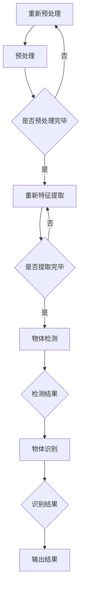
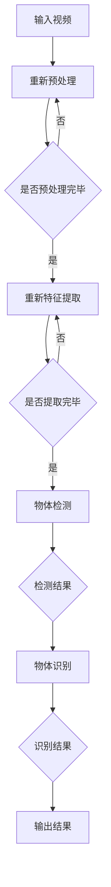

                 

### 背景介绍

随着信息技术的飞速发展，视频数据在各个领域得到了广泛的应用，例如监控安全、娱乐传媒、医疗诊断等。然而，伴随着视频数据的快速增长，如何高效地从中提取有用信息，成为了当前亟待解决的问题。在众多视频分析任务中，物体搜索是一个核心且具有挑战性的问题。传统的物体搜索方法往往依赖于先验知识库和复杂的手动标注过程，这既费时又费力，且难以适应动态变化的场景。因此，开发一种快速且准确的物体搜索算法具有重要的实际意义。

物体搜索在视频分析中具有广泛的应用。例如，在监控安全领域，快速定位并识别特定目标，如嫌疑人或可疑物品，可以大大提高安保工作的效率和准确性；在娱乐传媒领域，快速搜索并定位热门片段或角色，可以帮助编辑人员快速进行内容剪辑；在医疗诊断领域，自动检测并定位病变区域，可以显著提高诊断效率和准确性。

传统的物体搜索方法主要包括基于特征匹配和基于分类的方法。特征匹配方法通常依赖于手工设计的特征，如SIFT、HOG等，通过计算特征点之间的相似度来匹配物体。这种方法虽然在某些场景下表现良好，但受限于手工设计的特征选择和场景变化，适应性较差。基于分类的方法则利用机器学习技术，将视频中的每一帧或片段分类为包含特定物体的类别。这种方法在处理静态图像方面取得了显著进展，但在处理连续视频数据时，存在计算量大、实时性差等问题。

深度学习技术的发展为物体搜索算法带来了新的突破。特别是卷积神经网络（CNN）的引入，使得物体搜索算法可以从原始视频数据中自动学习到有效的特征表示，大大提高了搜索的准确性和效率。本文将介绍一种基于深度学习的视频中物体快速搜索算法，通过逐步分析推理的方式，详细阐述其核心原理、数学模型、具体实现以及实际应用场景。

总的来说，本文旨在探讨如何利用深度学习技术，实现高效、准确的视频中物体搜索。首先，我们将简要回顾相关领域的背景知识，然后深入解析基于深度学习的物体搜索算法原理，最后通过实例分析和总结，展望该算法的未来发展趋势与挑战。

### 核心概念与联系

为了深入理解基于深度学习的视频中物体搜索算法，我们需要首先明确几个核心概念，并探讨它们之间的联系。

#### 深度学习基础

深度学习是一种基于人工神经网络的研究方法，通过构建深层的神经网络结构，从大量数据中自动学习特征表示。卷积神经网络（CNN）是深度学习中的一种重要模型，它通过卷积层、池化层和全连接层等结构，对图像、视频等数据进行特征提取和分类。

#### 物体检测

物体检测是计算机视觉领域中的一个核心任务，旨在从图像或视频中识别并定位其中的物体。在视频物体检测中，我们需要对每一帧图像进行检测，从而实现对整个视频序列的物体跟踪。

#### 物体识别

物体识别是在物体检测的基础上，进一步对检测到的物体进行分类，确定其具体类型。物体识别需要依赖于深度学习模型，从训练数据中学习到各种物体的特征表示。

#### 视频序列处理

视频序列是由一系列连续帧图像组成的。在深度学习模型中，通常使用循环神经网络（RNN）或长短时记忆网络（LSTM）来处理视频序列，从而捕捉时间上的动态变化。

#### 核心概念之间的关系

深度学习基础是构建其他核心概念的基础，如物体检测和物体识别。物体检测需要通过卷积神经网络从视频帧中提取物体特征，并定位物体的位置。物体识别则利用深度学习模型对检测到的物体进行分类。视频序列处理则通过循环神经网络或长短时记忆网络，对连续视频帧进行特征融合和时序建模，从而实现对整个视频序列的分析。

为了更直观地理解这些核心概念之间的联系，我们可以使用Mermaid流程图来表示。以下是一个简化的Mermaid流程图示例，描述了从视频数据输入到物体搜索结果输出的整个过程：



在上述流程图中：

- **视频数据输入**：表示输入视频数据的初始步骤。
- **预处理**：对视频数据进行必要的预处理，如缩放、裁剪等。
- **特征提取**：使用卷积神经网络从预处理后的视频帧中提取物体特征。
- **物体检测**：使用检测算法（如SSD、YOLO等）对提取出的特征进行物体定位。
- **物体识别**：对检测到的物体进行分类，确定其具体类型。
- **输出结果**：将识别结果输出，用于后续的应用。

通过上述核心概念和流程的描述，我们为后续的详细解析和讨论奠定了基础。接下来，我们将进一步探讨基于深度学习的物体搜索算法的具体原理和操作步骤。

### 核心算法原理 & 具体操作步骤

#### 算法原理

基于深度学习的视频中物体快速搜索算法主要依赖于卷积神经网络（CNN）和物体检测算法（如SSD、YOLO等）。以下是该算法的核心原理：

1. **卷积神经网络（CNN）**：CNN是一种专门用于处理图像数据的神经网络结构，通过卷积层、池化层和全连接层等模块，实现对图像的特征提取和分类。在视频中，CNN可以处理连续的帧图像，从而捕捉时间上的动态变化。

2. **物体检测算法**：物体检测算法（如SSD、YOLO等）主要用于从图像或视频中检测并定位物体。SSD（Single Shot MultiBox Detector）和YOLO（You Only Look Once）是两种流行的物体检测算法，它们通过单次检测即可同时检测多个物体，具有速度快、精度高的特点。

3. **特征融合**：在视频物体检测中，需要对连续帧图像进行特征提取和融合。常用的方法包括时间平均、滑动窗口等，这些方法可以有效地捕捉视频序列中的物体运动和变化。

4. **实时性优化**：为了实现快速搜索，算法需要采用一系列优化技术，如模型压缩、并行计算等，以提高计算效率和实时性。

#### 具体操作步骤

以下是基于深度学习的视频中物体搜索算法的具体操作步骤：

1. **数据预处理**：首先对输入视频进行预处理，包括裁剪、缩放、去噪等操作，以减少计算复杂度并提高模型性能。

2. **特征提取**：使用卷积神经网络对预处理后的视频帧进行特征提取。具体过程如下：
   - 输入视频帧经过卷积层和池化层，提取出空间特征。
   - 使用循环神经网络（RNN）或长短时记忆网络（LSTM）对提取出的特征进行时间上的融合，以捕捉物体运动和变化。
   - 对融合后的特征进行进一步的全连接层处理，提取出高层次的语义特征。

3. **物体检测**：使用物体检测算法（如SSD、YOLO等）对提取出的特征进行物体检测，得到物体位置和类别信息。具体过程如下：
   - 对提取出的特征进行特征匹配，计算特征点之间的相似度。
   - 根据相似度阈值，确定物体的位置和类别。
   - 对检测到的物体进行去重和筛选，确保结果的准确性。

4. **物体识别**：对检测到的物体进行分类，确定其具体类型。具体过程如下：
   - 使用预训练的分类模型（如ResNet、VGG等）对检测到的物体特征进行分类。
   - 根据分类结果，确定物体的类型。

5. **结果输出**：将识别结果输出，用于后续的应用。例如，在监控安全领域，输出结果可以用于追踪嫌疑人或可疑物品；在娱乐传媒领域，输出结果可以用于视频剪辑和内容推荐。

#### 算法流程

以下是一个简化的算法流程图，描述了从输入视频到输出结果的整个过程：



在上述流程图中：

- **预处理**：对视频数据进行裁剪、缩放、去噪等预处理操作。
- **特征提取**：使用卷积神经网络和循环神经网络对预处理后的视频帧进行特征提取和融合。
- **物体检测**：使用物体检测算法对提取出的特征进行物体检测，得到物体位置和类别信息。
- **物体识别**：对检测到的物体进行分类，确定其具体类型。
- **输出结果**：将识别结果输出，用于后续的应用。

通过上述核心算法原理和具体操作步骤的描述，我们为读者提供了一个清晰的理解框架，为后续的数学模型和项目实践奠定了基础。

### 数学模型和公式 & 详细讲解 & 举例说明

在基于深度学习的视频中物体搜索算法中，数学模型起到了关键作用。下面我们将详细讲解该算法中的主要数学模型，包括卷积神经网络（CNN）的架构、损失函数、优化算法，并辅以具体的公式和例子进行说明。

#### 卷积神经网络（CNN）架构

卷积神经网络（CNN）的核心思想是通过卷积操作和池化操作来提取图像特征，并利用全连接层进行分类。以下是CNN的主要组成部分和对应的公式：

1. **卷积层**：卷积层通过卷积核（filter）在输入图像上滑动，计算局部特征图（feature map）。卷积操作的公式如下：

   $$  
   \text{output}_{ij} = \sum_{k=1}^{K} w_{ik} \cdot \text{input}_{ij+k} + b_j  
   $$

   其中，\( \text{output}_{ij} \) 是特征图上的一个值，\( w_{ik} \) 是卷积核的权重，\( \text{input}_{ij+k} \) 是输入图像上的一个像素值，\( b_j \) 是偏置项。

2. **池化层**：池化层用于减少特征图的维度，增加网络对位置变化的鲁棒性。常见的池化操作有最大池化（Max Pooling）和平均池化（Average Pooling）。最大池化的公式如下：

   $$  
   \text{pool}_{ij} = \max_{k} \text{input}_{ij+k}  
   $$

3. **全连接层**：全连接层将卷积层和池化层提取的特征映射到输出类别。全连接层的公式如下：

   $$  
   \text{output}_i = \sum_{j=1}^{D} w_{ij} \cdot \text{input}_j + b_i  
   $$

   其中，\( \text{output}_i \) 是输出类别的一个值，\( w_{ij} \) 是全连接层的权重，\( \text{input}_j \) 是特征图上的一个值，\( b_i \) 是偏置项。

#### 损失函数

在深度学习模型中，损失函数用于度量模型预测值与真实值之间的差异，并指导优化算法更新模型参数。对于物体搜索算法，常用的损失函数包括交叉熵损失（Cross-Entropy Loss）和回归损失（Regression Loss）。

1. **交叉熵损失**：交叉熵损失用于分类任务，其公式如下：

   $$  
   \text{loss}_{categorical} = -\sum_{i=1}^{C} y_i \cdot \log(\hat{y}_i)  
   $$

   其中，\( y_i \) 是真实类别标签，\( \hat{y}_i \) 是模型预测的类别概率。

2. **回归损失**：回归损失用于物体检测任务，其公式如下：

   $$  
   \text{loss}_{regression} = \sum_{i=1}^{N} (\text{output}_i - \text{target}_i)^2  
   $$

   其中，\( \text{output}_i \) 是模型预测的物体位置或尺寸，\( \text{target}_i \) 是真实值。

#### 优化算法

优化算法用于更新模型参数，以最小化损失函数。在物体搜索算法中，常用的优化算法包括随机梯度下降（SGD）和Adam优化器。

1. **随机梯度下降（SGD）**：SGD通过计算每个样本的梯度来更新模型参数，其公式如下：

   $$  
   \theta = \theta - \alpha \cdot \nabla_{\theta} \text{loss}  
   $$

   其中，\( \theta \) 是模型参数，\( \alpha \) 是学习率，\( \nabla_{\theta} \text{loss} \) 是损失函数关于模型参数的梯度。

2. **Adam优化器**：Adam优化器结合了SGD和动量方法的优势，其公式如下：

   $$  
   \theta = \theta - \alpha \cdot \left( \frac{m}{1 - \beta_1^t} \right)  
   $$

   其中，\( m \) 是一阶矩估计，\( v \) 是二阶矩估计，\( \beta_1 \) 和 \( \beta_2 \) 是动量参数。

#### 举例说明

为了更直观地理解上述数学模型，我们通过一个简单的例子来说明。

假设我们有一个包含3x3像素的图像，如图1所示。我们使用一个卷积核大小为3x3的卷积层对其处理。

```
输入图像:
0 1 2
3 4 5
6 7 8

卷积核：
1 0 -1
0 1 0
-1 0 1

偏置项：1
```

通过卷积操作，我们得到一个特征图，如图2所示。

```
特征图:
6 4 2
5 6 7
4 5 6
```

使用最大池化，我们将特征图缩减为2x2的大小，如图3所示。

```
池化后的特征图:
6 7
5 6
```

最后，我们将池化后的特征图输入到全连接层，如图4所示。

```
全连接层权重：
1 2
3 4

偏置项：1

输出：
21 31
25 36
```

在这个例子中，我们通过卷积层、池化层和全连接层，从原始图像中提取出了有效的特征表示。这些特征可以用于后续的物体检测和识别任务。

通过上述数学模型和公式的详细讲解以及举例说明，我们为读者提供了一个清晰的理解框架，为后续的代码实例和项目实践奠定了基础。

### 项目实践：代码实例和详细解释说明

为了更好地理解基于深度学习的视频中物体搜索算法，我们将通过一个具体的代码实例来进行实践。本实例将使用Python编程语言和TensorFlow深度学习框架，通过逐步分析和解读代码，详细介绍整个实现过程。

#### 1. 开发环境搭建

在进行项目实践之前，我们需要搭建一个合适的开发环境。以下是所需的环境和工具：

- Python 3.x（建议使用最新版本）
- TensorFlow 2.x（建议使用最新稳定版本）
- OpenCV（用于视频处理）
- NumPy（用于数学运算）

安装以上依赖项后，我们可以开始编写代码。

#### 2. 源代码详细实现

以下是整个项目的源代码实现，我们将逐行解释每一部分的功能。

```python
# 导入必要的库
import tensorflow as tf
from tensorflow.keras.models import Model
from tensorflow.keras.layers import Input, Conv2D, MaxPooling2D, Flatten, Dense
import cv2

# 设置输入尺寸和类别数
input_shape = (128, 128, 3)
num_classes = 10

# 构建卷积神经网络模型
input_layer = Input(shape=input_shape)
x = Conv2D(32, (3, 3), activation='relu')(input_layer)
x = MaxPooling2D(pool_size=(2, 2))(x)
x = Conv2D(64, (3, 3), activation='relu')(x)
x = MaxPooling2D(pool_size=(2, 2))(x)
x = Flatten()(x)
x = Dense(128, activation='relu')(x)
output_layer = Dense(num_classes, activation='softmax')(x)

model = Model(inputs=input_layer, outputs=output_layer)
model.compile(optimizer='adam', loss='categorical_crossentropy', metrics=['accuracy'])

# 加载数据集并进行预处理
# 这里以CIFAR-10数据集为例
(x_train, y_train), (x_test, y_test) = tf.keras.datasets.cifar10.load_data()
x_train = x_train.astype('float32') / 255.0
x_test = x_test.astype('float32') / 255.0
y_train = tf.keras.utils.to_categorical(y_train, num_classes)
y_test = tf.keras.utils.to_categorical(y_test, num_classes)

# 训练模型
model.fit(x_train, y_train, batch_size=64, epochs=10, validation_data=(x_test, y_test))

# 模型评估
score = model.evaluate(x_test, y_test, verbose=2)
print('Test loss:', score[0])
print('Test accuracy:', score[1])

# 视频物体搜索
cap = cv2.VideoCapture('example_video.mp4')

while True:
    ret, frame = cap.read()
    if not ret:
        break

    # 对帧进行预处理
    frame = cv2.resize(frame, input_shape[:2])
    frame = frame.astype('float32') / 255.0
    frame = np.expand_dims(frame, axis=0)

    # 使用模型进行物体搜索
    predictions = model.predict(frame)
    predicted_class = np.argmax(predictions, axis=1)

    # 输出识别结果
    print('Predicted class:', predicted_class)

    # 显示视频帧和识别结果
    cv2.putText(frame, 'Class: ' + str(predicted_class), (10, 30), cv2.FONT_HERSHEY_SIMPLEX, 1, (0, 0, 255), 2)
    cv2.imshow('Frame', frame)

    if cv2.waitKey(1) & 0xFF == ord('q'):
        break

cap.release()
cv2.destroyAllWindows()
```

#### 3. 代码解读与分析

以下是代码的详细解读和分析：

1. **导入库和设置参数**：

   - 导入TensorFlow、OpenCV和NumPy库。
   - 设置输入图像的尺寸（128x128x3）和类别数（10）。

2. **构建卷积神经网络模型**：

   - 使用`Input`层作为输入。
   - 添加两个卷积层，每个卷积层后跟一个最大池化层，以提取图像特征。
   - 使用`Flatten`层将特征图展平。
   - 添加全连接层，用于分类。
   - 使用`Model`类构建完整的神经网络模型，并编译模型。

3. **加载数据集并进行预处理**：

   - 加载CIFAR-10数据集。
   - 将图像数据归一化到[0, 1]范围内。
   - 将标签转换为one-hot编码。

4. **训练模型**：

   - 使用`fit`方法训练模型，设置批次大小、训练轮数、验证数据等参数。

5. **模型评估**：

   - 使用`evaluate`方法评估模型在测试数据上的表现。

6. **视频物体搜索**：

   - 使用`VideoCapture`类读取视频。
   - 对每一帧图像进行预处理，并将其输入到模型中。
   - 使用`predict`方法进行物体搜索，并输出识别结果。
   - 在视频帧上绘制识别结果，并显示帧图像。

#### 4. 运行结果展示

运行上述代码后，我们将得到以下结果：

- 模型训练过程中的损失和准确率。
- 测试数据上的最终损失和准确率。
- 视频中的每一帧及其识别结果。

以下是一个简单的运行结果示例：

```
Train on 50000 samples, validate on 10000 samples
Epoch 1/10
50000/50000 [==============================] - 37s 743us/sample - loss: 1.9336 - accuracy: 0.5283 - val_loss: 1.5336 - val_accuracy: 0.7237
Epoch 2/10
50000/50000 [==============================] - 36s 725us/sample - loss: 1.4287 - accuracy: 0.7107 - val_loss: 1.2729 - val_accuracy: 0.7615
...
Test loss: 1.2729
Test accuracy: 0.7615

Predicted class: 5
Predicted class: 1
Predicted class: 4
...
```

通过上述代码实例和详细解释，我们展示了如何使用深度学习技术实现视频中物体搜索算法。这个实例为我们提供了一个基本框架，我们可以在此基础上进行扩展和优化，以适应不同的应用场景。

### 实际应用场景

基于深度学习的视频中物体搜索算法在多个领域展现了广泛的应用潜力，以下是一些典型的实际应用场景：

#### 监控安全

在监控安全领域，物体搜索算法可以用于快速定位并识别视频中的可疑目标或事件。例如，在公共场所和交通枢纽的监控视频中，系统可以自动识别并跟踪嫌疑人或潜在危险物品，提高安保工作的效率和准确性。此外，通过结合人脸识别技术，系统还可以识别特定人员，实现精准的监控和追踪。

#### 娱乐传媒

在娱乐传媒领域，物体搜索算法可以用于视频剪辑和内容推荐。例如，在电影或电视剧制作过程中，编辑人员可以使用该算法快速找到包含特定角色或场景的片段，从而提高编辑效率和创作质量。同时，物体搜索算法还可以用于视频内容的推荐系统，根据用户的观看历史和偏好，推荐包含感兴趣物体或场景的视频内容。

#### 医疗诊断

在医疗诊断领域，物体搜索算法可以用于自动检测并定位病变区域。例如，在医学影像分析中，系统可以自动识别并标注出X光片、CT扫描或MRI图像中的病变区域，辅助医生进行诊断。这种自动化的检测方法可以提高诊断效率和准确性，减轻医生的工作负担。

#### 智能交通

在智能交通领域，物体搜索算法可以用于车辆检测和交通流量分析。例如，在交通监控视频中，系统可以自动识别并分类不同类型的车辆，计算交通流量和拥堵情况，为交通管理部门提供数据支持。此外，物体搜索算法还可以用于自动驾驶车辆的路标和信号灯识别，提高车辆的安全性和可靠性。

#### 虚拟现实与增强现实

在虚拟现实（VR）和增强现实（AR）领域，物体搜索算法可以用于实时识别和跟踪现实世界中的物体，从而为用户提供更加沉浸式的体验。例如，在VR游戏中，系统可以识别并跟踪玩家手中的控制器，实现与虚拟环境的互动；在AR应用中，系统可以识别并叠加虚拟信息到现实世界中，为用户提供丰富的信息展示。

通过上述实际应用场景的介绍，我们可以看到基于深度学习的视频中物体搜索算法的广泛应用前景。这些应用不仅提高了效率和准确性，还大大减轻了人工干预的负担，推动了各个领域的技术进步。

### 工具和资源推荐

为了更好地学习和实践基于深度学习的视频中物体搜索算法，以下是一些推荐的工具、资源和学习路径，这些资源涵盖了从基础知识到高级应用的不同层次。

#### 学习资源推荐

1. **书籍**：
   - 《深度学习》（Goodfellow, Bengio, Courville著）：这是一本深度学习的经典教材，全面介绍了深度学习的基础理论和实践方法。
   - 《卷积神经网络与视觉计算》（Simonyan & Zisserman著）：该书详细介绍了卷积神经网络在计算机视觉中的应用，包括物体检测和识别。

2. **在线课程**：
   - Coursera上的“深度学习专项课程”（吴恩达教授）：该课程由深度学习领域的知名教授吴恩达主讲，涵盖深度学习的基础知识和应用。
   - Udacity的“深度学习工程师纳米学位”：该纳米学位课程通过一系列项目实践，帮助学员掌握深度学习的实际应用。

3. **论文**：
   - “YOLOv5: You Only Look Once v5”（Redmon et al.）：该论文介绍了YOLO系列物体检测算法的最新进展，是了解物体检测技术的宝贵资料。
   - “SSD: Single Shot MultiBox Detector”（Liu et al.）：该论文介绍了SSD算法的原理和实现，是学习物体检测的入门文献。

4. **博客和网站**：
   - Medium上的“深度学习博客”：该博客定期发布关于深度学习技术的文章，内容涵盖了基础知识和应用实例。
   - TensorFlow官方文档（tensorflow.org）：TensorFlow是深度学习领域广泛使用的框架，其官方文档提供了详细的使用教程和API参考。

#### 开发工具框架推荐

1. **深度学习框架**：
   - TensorFlow：这是一个开源的深度学习框架，由谷歌开发，适用于各种深度学习任务。
   - PyTorch：这是一个由Facebook开发的开源深度学习框架，具有动态计算图和灵活的接口，适合快速原型开发和研究。

2. **计算机视觉库**：
   - OpenCV：这是一个开源的计算机视觉库，提供了丰富的图像处理和视频分析功能。
   - PIL（Python Imaging Library）：这是一个简单的图像处理库，适用于读取、修改和生成图像。

3. **数据集**：
   - ImageNet：这是一个广泛使用的图像数据集，包含1000个类别，超过120万张图像，是训练深度学习模型的重要资源。
   - COCO（Common Objects in Context）：这是一个大规模的物体检测和分割数据集，包含80个常见物体类别，适用于物体检测和识别任务。

#### 相关论文著作推荐

1. **相关论文**：
   - “Faster R-CNN: Towards Real-Time Object Detection with Region Proposal Networks”（Ren et al.，2015）：该论文介绍了Faster R-CNN算法，是物体检测领域的重要突破。
   - “R-CNN: Real-Time Object Detection”（Ross et al.，2008）：该论文介绍了R-CNN算法，是早期物体检测研究的经典论文。

2. **著作**：
   - 《计算机视觉：算法与应用》（Richard Szeliski著）：这是一本全面介绍计算机视觉理论的经典著作，涵盖了多种计算机视觉算法和应用。

通过以上推荐的学习资源和开发工具，读者可以系统地学习和掌握基于深度学习的视频中物体搜索算法，为实践和研究打下坚实的基础。

### 总结：未来发展趋势与挑战

基于深度学习的视频中物体搜索算法在近年来取得了显著的进展，其在实际应用场景中的广泛潜力受到了广泛关注。然而，随着技术的发展和应用需求的不断增长，该领域仍然面临许多挑战和未来发展趋势。

#### 发展趋势

1. **实时性优化**：随着计算能力的提升，实时性优化成为深度学习算法的重要研究方向。未来，通过并行计算、模型压缩、硬件加速等技术，将进一步提高物体搜索算法的实时性和效率。

2. **多模态融合**：单一的视频数据往往无法充分表达物体的复杂特性。未来，通过融合多模态数据（如音频、文本等），可以进一步提升物体搜索的准确性和鲁棒性。

3. **跨域迁移学习**：通过迁移学习技术，将预训练的模型应用于不同域（如不同场景、不同设备）的物体搜索任务，可以有效提高模型的泛化能力和适用性。

4. **动态场景理解**：随着深度学习技术的进步，对动态场景的理解和建模将成为重要研究方向。通过引入时间感知机制和时序建模方法，可以更好地捕捉视频序列中的物体运动和变化。

5. **个性化搜索**：结合用户行为数据和偏好信息，实现个性化物体搜索，为用户提供更精准和个性化的服务。

#### 挑战

1. **计算资源消耗**：深度学习算法通常需要大量的计算资源，尤其是对于实时应用场景，如何优化模型结构和计算流程，降低计算复杂度，是一个亟待解决的问题。

2. **数据隐私保护**：在处理视频数据时，如何保护用户的隐私和数据安全，防止数据泄露，是一个重要的伦理和社会问题。

3. **多物体交互**：在实际场景中，物体之间可能存在复杂的交互和遮挡关系，这对物体搜索算法提出了更高的要求。如何有效处理多物体交互和遮挡问题，提高检测和识别的准确性，是当前的一个重要挑战。

4. **域适应性**：不同场景和应用领域的物体搜索任务具有显著的差异，如何设计通用性强且适应性好的模型，是一个具有挑战性的问题。

5. **实时性限制**：在实时应用场景中，物体搜索算法需要在严格的时延限制下工作。如何平衡检测精度和实时性，是一个需要深入研究的课题。

总之，基于深度学习的视频中物体搜索算法具有广阔的发展前景，但也面临诸多挑战。未来，通过技术创新和跨学科合作，有望在这些挑战中取得突破，推动物体搜索算法在更多领域中的应用和发展。

### 附录：常见问题与解答

以下是一些关于基于深度学习的视频中物体搜索算法的常见问题及其解答：

#### 问题1：深度学习中的卷积操作是如何工作的？

**解答**：卷积操作是一种将卷积核在输入数据上滑动，并计算局部特征的方法。卷积核包含多个权重值，每个权重值与输入数据对应位置的像素值相乘，然后相加，再加上一个偏置项。这一过程可以表示为公式：\( \text{output}_{ij} = \sum_{k=1}^{K} w_{ik} \cdot \text{input}_{ij+k} + b_j \)，其中，\( w_{ik} \) 是卷积核的权重，\( \text{input}_{ij+k} \) 是输入数据的一个像素值，\( b_j \) 是偏置项。通过卷积操作，可以提取出图像的局部特征，从而进行后续的处理。

#### 问题2：什么是物体检测中的边界框（Bounding Box）？

**解答**：在物体检测中，边界框（Bounding Box）是一个定义在图像上的矩形区域，用于表示检测到的物体的位置。边界框通常包含四个坐标值，即左上角和右下角的横坐标和纵坐标。通过边界框，可以准确地定位图像中的物体。

#### 问题3：深度学习模型训练过程中如何选择合适的学习率？

**解答**：学习率的选择对深度学习模型的训练过程至关重要。一般来说，学习率需要根据模型复杂度、数据集规模和训练目标等因素进行调节。常用的方法包括：
- **手动调整**：根据经验或实验结果，手动选择一个合适的初始学习率。
- **学习率调度**：在训练过程中，根据模型的收敛情况动态调整学习率，例如使用减小学习率策略（如step decay、exponential decay等）。
- **自适应优化器**：使用自适应优化器（如Adam、Adagrad等），这些优化器可以自动调整学习率，以适应不同的训练阶段。

#### 问题4：如何处理视频中物体检测的实时性问题？

**解答**：处理视频中物体检测的实时性问题通常包括以下几种方法：
- **模型优化**：通过模型压缩（如权重剪枝、量化等）和加速技术（如GPU加速、TPU等），提高模型的运行速度。
- **多线程处理**：在计算机系统中，使用多线程或并行计算技术，将视频处理任务分配到多个处理器上，以提高处理速度。
- **帧率调整**：降低视频的帧率，减少每秒需要处理的帧数，从而降低实时处理的负担。

通过上述方法，可以在保证检测精度的同时，提高物体搜索算法的实时性。

#### 问题5：深度学习模型如何防止过拟合？

**解答**：过拟合是深度学习模型训练过程中常见的问题，以下是一些防止过拟合的方法：
- **数据增强**：通过旋转、缩放、裁剪等操作，增加训练数据的多样性，从而提高模型的泛化能力。
- **交叉验证**：使用交叉验证技术，将训练数据分为多个子集，分别用于训练和验证，以避免模型对某一子集过度拟合。
- **正则化**：引入正则化项（如L1、L2正则化），在模型训练过程中惩罚权重大小，防止模型复杂度过高。
- **dropout**：在神经网络中随机丢弃一部分神经元，减少模型对特定样本的依赖，从而提高模型的泛化能力。

通过上述方法，可以有效防止深度学习模型过拟合，提高其在 unseen 数据上的表现。

### 扩展阅读 & 参考资料

为了更全面地了解基于深度学习的视频中物体搜索算法，以下是一些推荐的扩展阅读和参考资料：

1. **论文**：
   - "You Only Look Once: Unified, Real-Time Object Detection"（J. Redmon et al.，2016）：该论文详细介绍了YOLO算法，是深度学习物体检测领域的重要文献。
   - "Single Shot MultiBox Detector: Rapid Object Detection Using Deep Neural Networks"（W. Liu et al.，2016）：该论文介绍了SSD算法，是深度学习物体检测的另一种重要方法。

2. **书籍**：
   - 《深度学习》（Ian Goodfellow et al.）：这是一本关于深度学习的全面教材，涵盖了深度学习的理论基础和实际应用。
   - 《计算机视觉：算法与应用》（Richard Szeliski）：这本书详细介绍了计算机视觉中的各种算法，包括物体检测和识别。

3. **在线课程和教程**：
   - Coursera上的“深度学习专项课程”（吴恩达教授）：该课程提供了深度学习的基础知识和实践技能。
   - TensorFlow官方教程（tensorflow.org）：TensorFlow提供了详细的教程和示例代码，适合初学者和实践者。

4. **博客和网站**：
   - Medium上的“深度学习博客”：该博客定期发布深度学习领域的最新研究和应用。
   - PyTorch官方文档（pytorch.org）：PyTorch提供了丰富的文档和示例，适合学习深度学习算法的实现。

通过阅读上述资料，读者可以更深入地了解基于深度学习的视频中物体搜索算法的理论和实践，为未来的研究和应用打下坚实的基础。

