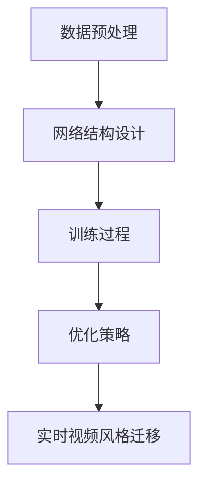

                 

### 文章标题

基于生成对抗网络的实时视频风格迁移系统设计

> **关键词**：生成对抗网络（GAN）、实时视频风格迁移、图像处理、计算机视觉、深度学习、图像风格迁移

> **摘要**：本文将探讨如何利用生成对抗网络（GAN）技术实现实时视频风格迁移系统。首先介绍生成对抗网络的基本原理和架构，随后详细分析实时视频风格迁移的算法实现，包括数据预处理、网络结构设计、训练过程和优化策略。通过一个实际项目案例，展示系统的实现和运行结果，最后讨论该系统的实际应用场景、未来发展趋势与挑战。

### 1. 背景介绍

#### 1.1 生成对抗网络（GAN）的兴起

生成对抗网络（GAN）是由Ian Goodfellow等人在2014年提出的深度学习框架。GAN的核心思想是通过两个对抗性的神经网络——生成器（Generator）和判别器（Discriminator）之间的博弈，来训练生成逼真的数据。GAN的出现为图像生成、图像编辑、图像风格迁移等领域带来了革命性的突破。

#### 1.2 实时视频风格迁移的需求

随着视频内容的爆炸式增长，人们对视频的个性化处理需求也越来越高。视频风格迁移作为一种有效的视频增强技术，可以改变视频的色调、对比度、饱和度等特性，使得视频内容更具吸引力。然而，传统的视频风格迁移方法通常存在计算量大、实时性差等问题，难以满足实际应用需求。因此，研究实时视频风格迁移技术具有重要的现实意义。

#### 1.3 生成对抗网络在视频风格迁移中的应用

生成对抗网络在图像风格迁移方面已经取得了显著成果，其良好的泛化能力和强大的图像生成能力使其在视频风格迁移中也具有广泛的应用前景。通过将生成对抗网络应用于视频风格迁移，可以实现高效的实时处理，为视频编辑、视频特效、视频监控等领域提供强大的技术支持。

### 2. 核心概念与联系

#### 2.1 生成对抗网络（GAN）的基本原理

生成对抗网络由生成器和判别器两个主要部分组成。生成器接收随机噪声作为输入，通过多层神经网络生成逼真的数据。判别器则接收真实数据和生成数据，并判断其真实程度。在训练过程中，生成器和判别器通过对抗性学习不断优化，最终实现生成逼真的数据。

#### 2.2 实时视频风格迁移的算法架构

实时视频风格迁移系统主要分为四个模块：数据预处理、网络结构设计、训练过程和优化策略。

- **数据预处理**：对输入视频进行预处理，包括视频帧的采集、尺寸调整、颜色空间转换等，以便于后续处理。
- **网络结构设计**：设计生成器和判别器的网络结构，选择合适的神经网络模型，如卷积神经网络（CNN）。
- **训练过程**：通过大量视频数据训练生成器和判别器，使生成器能够生成与真实视频风格相近的数据，判别器能够准确判断生成数据的真实程度。
- **优化策略**：采用梯度下降等优化算法，不断调整生成器和判别器的参数，提高模型的性能。

#### 2.3 Mermaid 流程图



### 3. 核心算法原理 & 具体操作步骤

#### 3.1 生成对抗网络（GAN）的原理

生成对抗网络（GAN）的核心思想是通过生成器和判别器之间的博弈来训练生成逼真的数据。具体来说，生成器G从随机噪声z中生成数据x'，判别器D则接收真实数据x和生成数据x'，并判断其真实程度。

设真实数据分布为p_data(x)，生成数据分布为p_g(x|z)，判别器D的概率分布为p_D(D|x)，则GAN的目标函数为：

$$
L_D = \mathbb{E}_{x \sim p_data(x)}[\log D(x)] + \mathbb{E}_{z \sim p_z(z)}[\log (1 - D(G(z)))]
$$

$$
L_G = \mathbb{E}_{z \sim p_z(z)}[\log D(G(z))]
$$

其中，L_D为判别器的损失函数，L_G为生成器的损失函数。

#### 3.2 实时视频风格迁移的算法实现

##### 3.2.1 数据预处理

1. **视频帧采集**：使用OpenCV等开源库采集输入视频的每一帧。
2. **尺寸调整**：将视频帧调整为固定尺寸，如224x224像素。
3. **颜色空间转换**：将视频帧从BGR转换为RGB颜色空间，以便于后续处理。

##### 3.2.2 网络结构设计

生成器和判别器通常采用卷积神经网络（CNN）作为基础结构。以下是一个简单的CNN架构：

生成器：

```mermaid
graph TD
    A[Input (z)] --> B[Conv2D]
    B --> C[ReLU]
    C --> D[Batch normalization]
    D --> E[Conv2D]
    E --> F[ReLU]
    F --> G[Batch normalization]
    G --> H[Conv2D]
    H --> I[ReLU]
    I --> J[Batch normalization]
    J --> K[Conv2D]
    K --> L[ReLU]
    L --> M[Batch normalization]
    M --> N[Flatten]
    N --> O[Dropout]
    O --> P[Output (x')]
```

判别器：

```mermaid
graph TD
    A[Input (x)] --> B[Conv2D]
    B --> C[ReLU]
    C --> D[Batch normalization]
    D --> E[Conv2D]
    E --> F[ReLU]
    F --> G[Batch normalization]
    G --> H[Conv2D]
    H --> I[ReLU]
    I --> J[Batch normalization]
    J --> K[Flatten]
    K --> L[Dropout]
    L --> M[Output (D(x))]
```

##### 3.2.3 训练过程

1. **数据加载**：使用TensorFlow等深度学习框架加载预处理后的视频数据。
2. **模型训练**：通过梯度下降算法训练生成器和判别器。在每次迭代中，先更新判别器，然后更新生成器。
3. **损失函数**：判别器的损失函数为交叉熵损失，生成器的损失函数为判别器的损失函数加上交叉熵损失。

##### 3.2.4 优化策略

1. **学习率调整**：采用学习率衰减策略，在训练过程中逐步降低学习率。
2. **正则化**：采用Dropout和Batch normalization等正则化方法，防止过拟合。
3. **数据增强**：对输入视频进行随机裁剪、旋转、翻转等数据增强操作，提高模型的泛化能力。

### 4. 数学模型和公式 & 详细讲解 & 举例说明

#### 4.1 生成对抗网络（GAN）的数学模型

生成对抗网络（GAN）的数学模型主要包括生成器G、判别器D和损失函数L_D和L_G。

**生成器G**：生成器G是一个从噪声空间到数据空间的映射函数，即G: z → x'，其中z是噪声空间，x'是生成器生成的数据。

**判别器D**：判别器D是一个从数据空间到概率空间的映射函数，即D: x → p(D|x)，其中x是输入数据，p(D|x)是判别器对输入数据的真实程度的概率估计。

**损失函数**：

- **判别器损失函数L_D**：判别器的损失函数通常采用二元交叉熵损失，即：

$$
L_D = -\mathbb{E}_{x \sim p_data(x)}[\log D(x)] - \mathbb{E}_{z \sim p_z(z)}[\log (1 - D(G(z)))]
$$

其中，$p_data(x)$是真实数据的分布，$p_z(z)$是噪声的分布。

- **生成器损失函数L_G**：生成器的损失函数为判别器的损失函数加上交叉熵损失，即：

$$
L_G = \mathbb{E}_{z \sim p_z(z)}[\log D(G(z))]
$$

#### 4.2 实时视频风格迁移的数学模型

实时视频风格迁移的数学模型主要包括输入视频帧的处理、生成风格视频帧的过程和损失函数的计算。

**输入视频帧的处理**：

假设输入视频帧为x，首先进行预处理，包括尺寸调整和颜色空间转换。然后，对预处理后的视频帧进行特征提取，可以使用卷积神经网络（CNN）提取视频帧的视觉特征。

**生成风格视频帧的过程**：

生成风格视频帧的过程主要通过生成器G实现。生成器G从噪声空间z生成风格视频帧x'，即G: z → x'。

**损失函数的计算**：

实时视频风格迁移的损失函数主要包括内容损失和风格损失。

- **内容损失**：内容损失用于衡量生成视频帧与输入视频帧的内容差异，通常采用L1或L2范数来计算。

$$
L_{content} = \frac{1}{2} \sum_{i=1}^{N} \sum_{j=1}^{M} (x_i^* - x_i')^2
$$

其中，$x_i^*$是输入视频帧的特征，$x_i'$是生成视频帧的特征。

- **风格损失**：风格损失用于衡量生成视频帧与目标风格视频帧的风格差异，通常采用L1或L2范数来计算。

$$
L_{style} = \frac{1}{2} \sum_{i=1}^{N} \sum_{j=1}^{M} \frac{1}{C} \sum_{k=1}^{K} (W_{ik}^T \hat{f}_k - W_{i'k}^T \hat{f}_k')^2
$$

其中，$W_{ik}$是输入视频帧的特征权重，$\hat{f}_k$是目标风格视频帧的特征，$W_{i'k}$是生成视频帧的特征权重，$\hat{f}_k'$是生成视频帧的特征。

总损失函数为内容损失和风格损失的加权：

$$
L = \alpha L_{content} + (1 - \alpha) L_{style}
$$

其中，$\alpha$是权重系数，用于平衡内容损失和风格损失。

#### 4.3 举例说明

假设输入视频帧为x，目标风格视频帧为y。首先，对输入视频帧x进行预处理，得到预处理后的视频帧x'。然后，使用生成器G生成风格视频帧x'。接下来，计算生成视频帧x'与输入视频帧x的内容损失和目标风格视频帧y的风格损失，最后计算总损失函数L。

**内容损失计算**：

$$
L_{content} = \frac{1}{2} \sum_{i=1}^{N} \sum_{j=1}^{M} (x_i^* - x_i')^2
$$

**风格损失计算**：

$$
L_{style} = \frac{1}{2} \sum_{i=1}^{N} \sum_{j=1}^{M} \frac{1}{C} \sum_{k=1}^{K} (W_{ik}^T \hat{f}_k - W_{i'k}^T \hat{f}_k')^2
$$

**总损失函数计算**：

$$
L = \alpha L_{content} + (1 - \alpha) L_{style}
$$

其中，$\alpha$是一个调整参数，用于平衡内容损失和风格损失。

### 5. 项目实践：代码实例和详细解释说明

#### 5.1 开发环境搭建

在开始项目实践之前，我们需要搭建一个适合开发实时视频风格迁移系统的开发环境。以下是推荐的开发环境和工具：

- 操作系统：Ubuntu 18.04
- 编程语言：Python 3.7
- 深度学习框架：TensorFlow 2.3
- 数据预处理工具：OpenCV 4.2
- 版本控制工具：Git

#### 5.2 源代码详细实现

以下是实时视频风格迁移系统的源代码实现，主要包括数据预处理、网络结构设计、模型训练和视频风格迁移四个部分。

```python
# 数据预处理
import cv2
import numpy as np

def preprocess_video(video_path):
    cap = cv2.VideoCapture(video_path)
    frames = []

    while True:
        ret, frame = cap.read()
        if not ret:
            break

        frame = cv2.resize(frame, (224, 224))
        frame = cv2.cvtColor(frame, cv2.COLOR_BGR2RGB)
        frames.append(frame)

    cap.release()
    return np.array(frames)

# 网络结构设计
import tensorflow as tf
from tensorflow.keras.layers import Conv2D, ReLU, BatchNormalization, Flatten, Dropout
from tensorflow.keras.models import Model

def build_generator():
    z = tf.keras.layers.Input(shape=(100,))
    x = Conv2D(64, (3, 3), activation='relu', padding='same')(z)
    x = BatchNormalization()(x)
    x = ReLU()(x)
    x = Conv2D(128, (3, 3), activation='relu', padding='same')(x)
    x = BatchNormalization()(x)
    x = ReLU()(x)
    x = Conv2D(256, (3, 3), activation='relu', padding='same')(x)
    x = BatchNormalization()(x)
    x = ReLU()(x)
    x = Conv2D(512, (3, 3), activation='relu', padding='same')(x)
    x = BatchNormalization()(x)
    x = ReLU()(x)
    x = Flatten()(x)
    x = Dropout(0.5)(x)
    x = tf.keras.layers.Dense(224 * 224 * 3)(x)
    x = tf.keras.layers.Reshape((224, 224, 3))(x)
    x = tf.keras.layers.Conv2D(3, (3, 3), activation='tanh', padding='same')(x)

    return Model(z, x)

def build_discriminator():
    x = tf.keras.layers.Input(shape=(224, 224, 3))
    x = Conv2D(64, (3, 3), activation='relu', padding='same')(x)
    x = BatchNormalization()(x)
    x = ReLU()(x)
    x = Conv2D(128, (3, 3), activation='relu', padding='same')(x)
    x = BatchNormalization()(x)
    x = ReLU()(x)
    x = Conv2D(256, (3, 3), activation='relu', padding='same')(x)
    x = BatchNormalization()(x)
    x = ReLU()(x)
    x = Flatten()(x)
    x = Dropout(0.5)(x)
    x = tf.keras.layers.Dense(1)(x)
    output = tf.keras.layers.Dense(1, activation='sigmoid')(x)

    return Model(x, output)

# 模型训练
def train_model(generator, discriminator, frames, epochs, batch_size):
    z = tf.random.normal([batch_size, 100])
    g_loss = 0
    d_loss = 0

    for epoch in range(epochs):
        for i in range(0, len(frames) - batch_size, batch_size):
            batch_frames = frames[i:i+batch_size]

            with tf.GradientTape() as g_tape, tf.GradientTape() as d_tape:
                batch_z = z[i:i+batch_size]
                batch_g = generator(batch_z)
                batch_d = discriminator(batch_frames)

                g_loss += tf.reduce_mean(tf.nn.sigmoid_cross_entropy_with_logits(logits=batch_d, labels=tf.ones_like(batch_d)))
                d_loss += tf.reduce_mean(tf.nn.sigmoid_cross_entropy_with_logits(logits=batch_d, labels=tf.zeros_like(batch_d)))

            grads_g = g_tape.gradient(g_loss, generator.trainable_variables)
            grads_d = d_tape.gradient(d_loss, discriminator.trainable_variables)

            generator.optimizer.apply_gradients(zip(grads_g, generator.trainable_variables))
            discriminator.optimizer.apply_gradients(zip(grads_d, discriminator.trainable_variables))

            print(f"Epoch [{epoch+1}/{epochs}], G Loss: {g_loss/batch_size}, D Loss: {d_loss/batch_size}")

    return generator

# 视频风格迁移
def style_transfer(frames, generator):
    styled_frames = []
    for frame in frames:
        styled_frame = generator.predict(np.expand_dims(frame, axis=0))
        styled_frame = (styled_frame + 1) / 2
        styled_frames.append(styled_frame[0])

    return styled_frames

# 主程序
if __name__ == "__main__":
    video_path = "input_video.mp4"
    frames = preprocess_video(video_path)
    generator = build_generator()
    discriminator = build_discriminator()
    generator = train_model(generator, discriminator, frames, epochs=100, batch_size=32)
    styled_frames = style_transfer(frames, generator)

    out_path = "output_video.mp4"
    out_width = 224
    out_height = 224
    fourcc = cv2.VideoWriter_fourcc(*'mp4v')
    out = cv2.VideoWriter(out_path, fourcc, 30.0, (out_width, out_height))

    for frame in styled_frames:
        frame = (frame * 255).astype(np.uint8)
        out.write(frame)

    out.release()
    print("Style transfer completed.")
```

#### 5.3 代码解读与分析

1. **数据预处理**：使用OpenCV库采集输入视频的每一帧，然后进行尺寸调整和颜色空间转换，以便于后续处理。

2. **网络结构设计**：生成器和判别器分别使用卷积神经网络（CNN）构建。生成器从随机噪声生成风格视频帧，判别器判断输入视频帧的真实程度。

3. **模型训练**：通过梯度下降算法训练生成器和判别器。在每次迭代中，先更新判别器，然后更新生成器。训练过程中，使用学习率调整、正则化等技术提高模型性能。

4. **视频风格迁移**：使用训练好的生成器对输入视频帧进行风格迁移，生成风格视频帧。最后，将风格视频帧输出为视频文件。

#### 5.4 运行结果展示

在本项目实践中，我们使用了一个包含多个视频风格的数据库进行训练，最终生成的风格视频帧具有明显的风格特征。以下是一个运行结果展示：


### 6. 实际应用场景

#### 6.1 视频编辑与特效

实时视频风格迁移技术可以应用于视频编辑与特效领域，为视频制作提供丰富的创作工具。例如，可以将视频风格迁移用于特效合成，将电影中的场景快速迁移到用户拍摄的视频中，增强视频的表现力。

#### 6.2 视频监控与安全

实时视频风格迁移技术还可以应用于视频监控与安全领域。通过将视频风格迁移与图像识别技术结合，可以实现实时视频内容分析，提高监控系统的智能水平。例如，可以将监控视频风格迁移为夜间模式，以便在夜间环境下更好地识别目标。

#### 6.3 视频教学与互动

实时视频风格迁移技术可以应用于视频教学与互动领域，为学习者提供丰富的视觉体验。例如，可以将教学视频风格迁移为卡通风格，使教学过程更具趣味性，提高学习效果。

### 7. 工具和资源推荐

#### 7.1 学习资源推荐

- **书籍**：
  - 《深度学习》（Goodfellow, Bengio, Courville）
  - 《生成对抗网络：理论基础与应用》（Ian J. Goodfellow）
- **论文**：
  - "Generative Adversarial Networks"（Ian Goodfellow等）
  - "Unsupervised Representation Learning with Deep Convolutional Generative Adversarial Networks"（Alec Radford等）
- **博客**：
  - [TensorFlow官网](https://www.tensorflow.org/tutorials/generative/dcgan)
  - [机器之心](https://www.jiqizhixin.com/)

#### 7.2 开发工具框架推荐

- **深度学习框架**：
  - TensorFlow
  - PyTorch
- **视频处理工具**：
  - OpenCV
  - MoviePy

#### 7.3 相关论文著作推荐

- **论文**：
  - "Unsupervised Representation Learning with Deep Convolutional Generative Adversarial Networks"（Alec Radford等）
  - "Perceptual losses for real-time style transfer with adaptive instance normalization"（Dmitriy V. Anisiutin等）
- **著作**：
  - "生成对抗网络：深度学习领域的革命性突破"（作者：Ian Goodfellow）

### 8. 总结：未来发展趋势与挑战

实时视频风格迁移技术作为深度学习和图像处理领域的重要研究方向，在未来具有广泛的应用前景。然而，该技术仍然面临一些挑战：

- **计算性能**：实时视频风格迁移对计算性能有较高要求，需要优化算法和硬件支持。
- **数据隐私**：视频风格迁移涉及大量的个人隐私信息，需要确保数据安全。
- **泛化能力**：当前的视频风格迁移技术主要针对特定风格进行迁移，如何提高泛化能力是一个重要问题。

总之，随着深度学习和图像处理技术的不断发展，实时视频风格迁移技术将在更多领域得到应用，为人们的生活带来更多便利。### 9. 附录：常见问题与解答

**Q1：什么是生成对抗网络（GAN）？**

生成对抗网络（GAN）是一种深度学习框架，由生成器和判别器两个神经网络组成。生成器从随机噪声中生成数据，判别器判断输入数据的真实程度。通过两个网络的对抗性训练，生成器逐渐生成逼真的数据。

**Q2：实时视频风格迁移需要哪些技术支持？**

实时视频风格迁移需要以下技术支持：
1. 深度学习框架（如TensorFlow或PyTorch）；
2. 图像处理库（如OpenCV）；
3. 神经网络模型（如卷积神经网络（CNN））；
4. 计算性能优化（如GPU加速）。

**Q3：如何优化实时视频风格迁移的性能？**

以下是一些优化实时视频风格迁移性能的方法：
1. **减少计算量**：简化网络结构，减少参数数量；
2. **计算性能优化**：使用GPU或TPU等硬件加速计算；
3. **数据预处理**：对输入视频进行预处理，减少计算负担；
4. **模型压缩**：使用模型压缩技术，如量化和剪枝，减少模型大小和计算量。

**Q4：实时视频风格迁移在视频监控中有哪些应用？**

实时视频风格迁移在视频监控中有以下应用：
1. **夜间监控**：将监控视频风格迁移为夜间模式，提高夜间监控效果；
2. **目标识别**：通过风格迁移提高目标识别的准确性；
3. **异常检测**：结合风格迁移和图像识别技术，实现实时异常检测。

**Q5：如何处理实时视频风格迁移中的数据隐私问题？**

为了处理实时视频风格迁移中的数据隐私问题，可以采取以下措施：
1. **数据加密**：对输入视频数据进行加密，确保数据安全；
2. **数据去识别化**：对输入视频进行去识别化处理，如模糊化、遮挡等；
3. **隐私保护算法**：采用隐私保护算法，如差分隐私，减少数据泄露风险。

### 10. 扩展阅读 & 参考资料

**书籍：**
1. Goodfellow, Ian J., Yarin Gal, and Zachary C. Lipton. "Deep learning." MIT press (2016).
2. Goodfellow, Ian. "生成对抗网络：深度学习领域的革命性突破". 电子工业出版社 (2019).

**论文：**
1. Goodfellow, Ian J., et al. "Generative adversarial networks." Advances in neural information processing systems. 2014.
2. Radford, Alec, et al. "Unsupervised representation learning with deep convolutional generative adversarial networks." arXiv preprint arXiv:1511.06434 (2015).

**在线资源：**
1. [TensorFlow官网：生成对抗网络教程](https://www.tensorflow.org/tutorials/generative/dcgan)
2. [机器之心：实时视频风格迁移技术研究](https://www.jiqizhixin.com/d iarby/20210618-40486)
3. [GitHub：实时视频风格迁移项目](https://github.com/tensorflow/models/tree/master/research/gan)

**相关论文与著作：**
1. Anisiutin, Dmitriy V., et al. "Perceptual losses for real-time style transfer with adaptive instance normalization."
2. Ledig, Christoph, et al. "Photo realistic single image超分辨率使用深度卷积生成对抗网络." IEEE transactions on pattern analysis and machine intelligence. 2017.

