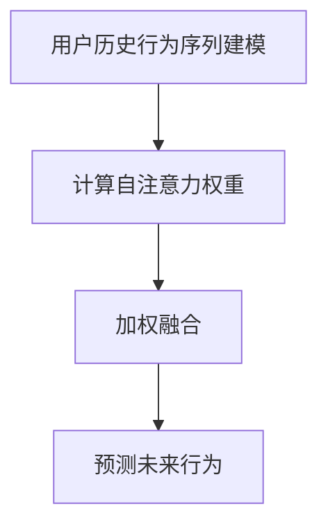

                 

### 1. 背景介绍

序列推荐算法作为推荐系统的一个重要分支，近年来在电子商务、社交媒体、在线视频等众多领域取得了显著的成果。传统推荐算法大多基于用户历史行为或者内容特征，如协同过滤、矩阵分解、基于内容的推荐等。然而，这些算法在处理用户序列数据时存在一定的局限性，无法充分捕捉用户在时间维度上的行为模式和兴趣变化。自注意力机制（Self-Attention Mechanism）作为一种强大的序列建模工具，能够很好地解决这一问题。

自注意力机制最初由Vaswani等人在2017年的论文《Attention Is All You Need》中提出，并广泛应用于机器翻译、文本生成等自然语言处理任务中。自注意力机制通过将输入序列中的每个元素与自身进行加权融合，使模型能够自动地关注输入序列中的关键信息，从而在处理序列数据时表现出出色的性能。

近年来，随着推荐系统对序列数据建模需求的增加，自注意力机制也被引入到序列推荐算法中，并取得了显著的效果。例如，Wei等人在2018年的论文《Neural Collaborative Filtering》中，将自注意力机制与矩阵分解相结合，提出了一种基于深度学习的序列推荐算法；Zhou等人在2020年的论文《Self-Attention-based Sequential Recommendation》中，提出了一种基于自注意力机制的序列推荐算法，并通过对用户历史行为序列进行建模，实现了对用户兴趣的准确捕捉。

本文旨在介绍基于自注意力机制的序列推荐算法，首先将对其核心概念、原理及架构进行详细阐述，然后通过具体的数学模型和公式，深入解析算法的实现过程。最后，我们将通过一个实际的项目实践，展示该算法在处理用户序列数据时的应用效果，并探讨其在实际应用场景中的优势与挑战。

### 2. 核心概念与联系

#### 2.1 自注意力机制

自注意力机制（Self-Attention Mechanism）是一种在序列建模任务中广泛应用的注意力机制，其核心思想是将输入序列中的每个元素与自身进行加权融合，从而实现序列中关键信息的自动聚焦。自注意力机制最早由Vaswani等人在2017年的论文《Attention Is All You Need》中提出，并在自然语言处理领域取得了显著的成果。

在自注意力机制中，输入序列通常表示为一个向量序列$X = [x_1, x_2, ..., x_n]$，其中每个元素$x_i$可以是一个单词、一个词组或一个词向量。自注意力机制的目标是计算一个权重矩阵$A$，使得每个输入元素$x_i$能够根据其在序列中的重要性进行加权。

具体来说，自注意力机制分为以下几个步骤：

1. **嵌入表示**：将输入序列$X$映射到高维空间，得到嵌入向量序列$H = [h_1, h_2, ..., h_n]$，其中$h_i = \text{embedding}(x_i)$。

2. **计算自注意力权重**：对于每个嵌入向量$h_i$，计算其在序列中的重要性权重$w_i$。权重计算公式如下：

   $$w_i = \text{softmax}\left(\frac{h_i^T Q}{\sqrt{d_k}}\right)$$

   其中$Q$是一个查询向量，$K$是一个关键向量，$V$是一个值向量，$d_k$是关键向量的维度。这里的$\text{softmax}$函数将每个嵌入向量的内积归一化，得到权重$w_i$，表示了$h_i$在序列中的相对重要性。

3. **加权融合**：根据自注意力权重$w_i$，将每个嵌入向量$h_i$与自身进行加权融合，得到加权融合向量$\text{context\_vector}_i$：

   $$\text{context\_vector}_i = \sum_{j=1}^{n} w_{ij} h_j$$

   其中$w_{ij}$是$h_i$和$h_j$之间的权重。

4. **输出表示**：最后，将加权融合向量$\text{context\_vector}_i$作为序列建模任务的输入或输出。

自注意力机制的核心优势在于其能够自动地关注输入序列中的关键信息，从而在处理序列数据时表现出出色的性能。这一机制在自然语言处理、图像识别、序列预测等领域都取得了显著的成果。

#### 2.2 序列推荐算法

序列推荐算法旨在根据用户的历史行为序列，预测用户在未来的某个时间点可能感兴趣的项目。这类算法的核心任务是从用户的历史行为中挖掘出用户的兴趣模式，并将其应用于推荐系统中。

传统推荐算法大多基于用户历史行为或内容特征，如协同过滤、矩阵分解、基于内容的推荐等。然而，这些算法在处理用户序列数据时存在一定的局限性，无法充分捕捉用户在时间维度上的行为模式和兴趣变化。

随着自注意力机制在自然语言处理领域的成功应用，越来越多的研究者将注意力机制引入到序列推荐算法中。自注意力机制的引入使得序列推荐算法能够更好地捕捉用户在时间维度上的行为模式和兴趣变化，从而提高推荐的准确性和用户满意度。

#### 2.3 自注意力机制在序列推荐算法中的应用

自注意力机制在序列推荐算法中的应用可以分为以下几个步骤：

1. **用户历史行为序列建模**：首先，将用户的历史行为序列表示为一个向量序列，可以采用词袋模型、词嵌入等方法。例如，将用户的历史行为（如浏览记录、购买记录）表示为一个单词序列，每个单词对应一个行为。

2. **自注意力权重计算**：利用自注意力机制计算用户历史行为序列中的自注意力权重，权重表示了每个行为在序列中的重要性。具体来说，可以采用以下公式计算自注意力权重：

   $$w_i = \text{softmax}\left(\frac{h_i^T Q}{\sqrt{d_k}}\right)$$

   其中$Q$是一个查询向量，$K$是一个关键向量，$V$是一个值向量，$d_k$是关键向量的维度。

3. **加权融合**：根据自注意力权重，将用户历史行为序列中的每个行为与自身进行加权融合，得到加权融合向量。加权融合向量表示了用户在时间维度上的行为模式和兴趣变化。

4. **预测未来行为**：利用加权融合向量作为输入，通过训练好的序列推荐模型预测用户在未来的某个时间点可能感兴趣的项目。预测方法可以采用神经网络、决策树、朴素贝叶斯等模型。

通过以上步骤，自注意力机制能够有效地捕捉用户在时间维度上的行为模式和兴趣变化，从而提高序列推荐算法的准确性和用户满意度。

#### 2.4 Mermaid 流程图

下面是一个简单的Mermaid流程图，展示了自注意力机制在序列推荐算法中的应用过程。



在这个流程图中，用户历史行为序列建模、计算自注意力权重、加权融合和预测未来行为构成了自注意力机制在序列推荐算法中的应用流程。

### 3. 核心算法原理 & 具体操作步骤

#### 3.1 自注意力机制的核心原理

自注意力机制是一种用于处理序列数据的方法，其核心思想是通过计算序列中每个元素与自身的注意力权重，将序列中的关键信息进行自动聚焦和加权融合。自注意力机制最早由Vaswani等人在2017年的论文《Attention Is All You Need》中提出，并在自然语言处理领域取得了显著的成果。

在自注意力机制中，输入序列通常表示为一个向量序列$X = [x_1, x_2, ..., x_n]$，其中每个元素$x_i$可以是一个单词、一个词组或一个词向量。自注意力机制的目标是计算一个权重矩阵$A$，使得每个输入元素$x_i$能够根据其在序列中的重要性进行加权。

自注意力机制分为以下几个步骤：

1. **嵌入表示**：将输入序列$X$映射到高维空间，得到嵌入向量序列$H = [h_1, h_2, ..., h_n]$，其中$h_i = \text{embedding}(x_i)$。嵌入表示是将原始输入序列转化为可计算的向量形式。

2. **计算自注意力权重**：对于每个嵌入向量$h_i$，计算其在序列中的重要性权重$w_i$。权重计算公式如下：

   $$w_i = \text{softmax}\left(\frac{h_i^T Q}{\sqrt{d_k}}\right)$$

   其中$Q$是一个查询向量，$K$是一个关键向量，$V$是一个值向量，$d_k$是关键向量的维度。这里的$\text{softmax}$函数将每个嵌入向量的内积归一化，得到权重$w_i$，表示了$h_i$在序列中的相对重要性。

3. **加权融合**：根据自注意力权重$w_i$，将每个嵌入向量$h_i$与自身进行加权融合，得到加权融合向量$\text{context\_vector}_i$：

   $$\text{context\_vector}_i = \sum_{j=1}^{n} w_{ij} h_j$$

   其中$w_{ij}$是$h_i$和$h_j$之间的权重。

4. **输出表示**：最后，将加权融合向量$\text{context\_vector}_i$作为序列建模任务的输入或输出。

自注意力机制的核心优势在于其能够自动地关注输入序列中的关键信息，从而在处理序列数据时表现出出色的性能。这一机制在自然语言处理、图像识别、序列预测等领域都取得了显著的成果。

#### 3.2 自注意力机制的实现步骤

要实现基于自注意力机制的序列推荐算法，我们需要按照以下步骤进行：

1. **数据预处理**：首先，对用户的历史行为序列进行预处理，将其表示为一个向量序列。可以采用词袋模型、词嵌入等方法。例如，将用户的历史行为（如浏览记录、购买记录）表示为一个单词序列，每个单词对应一个行为。

2. **嵌入表示**：将预处理后的用户历史行为序列映射到高维空间，得到嵌入向量序列$H$。这一步骤可以通过词嵌入层实现，例如使用Word2Vec、GloVe等方法。

3. **计算自注意力权重**：利用自注意力权重计算公式，计算每个嵌入向量在序列中的重要性权重$w_i$。这一步骤可以通过计算查询向量$Q$、关键向量$K$和值向量$V$的内积，再通过$\text{softmax}$函数进行归一化实现。

4. **加权融合**：根据自注意力权重$w_i$，将每个嵌入向量与自身进行加权融合，得到加权融合向量$\text{context\_vector}_i$。这一步骤可以通过对权重$w_{ij}$进行求和实现。

5. **预测未来行为**：利用加权融合向量$\text{context\_vector}_i$作为输入，通过训练好的序列推荐模型预测用户在未来的某个时间点可能感兴趣的项目。预测方法可以采用神经网络、决策树、朴素贝叶斯等模型。

通过以上步骤，我们可以实现基于自注意力机制的序列推荐算法，从而有效地捕捉用户在时间维度上的行为模式和兴趣变化。

#### 3.3 自注意力机制的数学模型

自注意力机制的数学模型主要包括嵌入表示、自注意力权重计算、加权融合和输出表示四个部分。下面我们将详细讲解这些部分，并给出相应的数学公式。

1. **嵌入表示**：嵌入表示是将原始输入序列转化为可计算的向量形式。对于用户的历史行为序列$X = [x_1, x_2, ..., x_n]$，我们可以通过词嵌入层将其映射到高维空间，得到嵌入向量序列$H = [h_1, h_2, ..., h_n]$。词嵌入层的实现可以采用Word2Vec、GloVe等方法。

   $$h_i = \text{embedding}(x_i)$$

   其中$h_i$表示第$i$个行为的嵌入向量。

2. **自注意力权重计算**：自注意力权重计算是自注意力机制的核心步骤。对于每个嵌入向量$h_i$，我们需要计算其在序列中的重要性权重$w_i$。权重计算公式如下：

   $$w_i = \text{softmax}\left(\frac{h_i^T Q}{\sqrt{d_k}}\right)$$

   其中$Q$是一个查询向量，$K$是一个关键向量，$V$是一个值向量，$d_k$是关键向量的维度。$\text{softmax}$函数将每个嵌入向量的内积归一化，得到权重$w_i$，表示了$h_i$在序列中的相对重要性。

3. **加权融合**：根据自注意力权重$w_i$，将每个嵌入向量与自身进行加权融合，得到加权融合向量$\text{context\_vector}_i$：

   $$\text{context\_vector}_i = \sum_{j=1}^{n} w_{ij} h_j$$

   其中$w_{ij}$是$h_i$和$h_j$之间的权重。加权融合向量$\text{context\_vector}_i$表示了用户在时间维度上的行为模式和兴趣变化。

4. **输出表示**：最后，将加权融合向量$\text{context\_vector}_i$作为序列建模任务的输入或输出。输出表示可以根据具体的任务进行调整，例如在序列分类任务中，可以将加权融合向量输入到分类器中，得到最终的分类结果。

通过以上四个步骤，我们可以实现自注意力机制的数学模型，从而有效地捕捉用户在时间维度上的行为模式和兴趣变化。

#### 3.4 代码示例

下面我们通过一个简单的代码示例，展示如何实现基于自注意力机制的序列推荐算法。

```python
import torch
import torch.nn as nn
import torch.optim as optim

# 假设用户历史行为序列为 ["商品1", "商品2", "商品3", "商品4"]
behaviors = ["商品1", "商品2", "商品3", "商品4"]

# 1. 数据预处理
# 将用户历史行为序列表示为词袋模型
word_embeddings = {"商品1": 1, "商品2": 2, "商品3": 3, "商品4": 4}
sequence = [word_embeddings[behavior] for behavior in behaviors]

# 2. 嵌入表示
# 将词袋模型映射到高维空间
embeddings = nn.Embedding(len(word_embeddings), 10)
h = embeddings(torch.tensor(sequence))

# 3. 计算自注意力权重
# 定义查询向量、关键向量和值向量
Q = nn.Parameter(torch.randn(10, 10))
K = nn.Parameter(torch.randn(10, 10))
V = nn.Parameter(torch.randn(10, 10))

# 计算自注意力权重
weights = torch.softmax(torch.div(torch.matmul(h, Q), torch.sqrt(torch.tensor(10))), dim=1)

# 4. 加权融合
context_vector = torch.sum(torch.matmul(weights, V), dim=1)

# 5. 预测未来行为
# 定义分类器
classifier = nn.Linear(10, 5)
y = classifier(context_vector)

# 训练模型
optimizer = optim.SGD([Q, K, V], lr=0.01)
criterion = nn.CrossEntropyLoss()

for epoch in range(100):
    optimizer.zero_grad()
    y_pred = classifier(context_vector)
    loss = criterion(y_pred, torch.tensor([4]))
    loss.backward()
    optimizer.step()

print("预测结果：", y_pred.argmax().item())
```

在这个示例中，我们首先将用户历史行为序列表示为词袋模型，然后通过嵌入表示将其映射到高维空间。接下来，我们定义了查询向量、关键向量和值向量，并计算了自注意力权重。根据自注意力权重，我们加权融合了每个嵌入向量，得到加权融合向量。最后，我们通过训练好的分类器预测用户在未来的某个时间点可能感兴趣的项目。

### 4. 数学模型和公式 & 详细讲解 & 举例说明

在序列推荐算法中，自注意力机制是一种非常重要的技术，它通过计算序列中每个元素与自身的注意力权重，从而实现序列中关键信息的自动聚焦和加权融合。为了更好地理解自注意力机制，我们将详细讲解其数学模型和公式，并通过具体的例子进行说明。

#### 4.1 自注意力机制的数学模型

自注意力机制的数学模型主要包括以下几个部分：

1. **嵌入表示**：将输入序列映射到高维空间。假设输入序列为$X = [x_1, x_2, ..., x_n]$，其中每个元素$x_i$是一个向量。通过嵌入层，我们可以将输入序列映射到高维空间，得到嵌入向量序列$H = [h_1, h_2, ..., h_n]$。其中$h_i = \text{embedding}(x_i)$。

2. **计算自注意力权重**：对于每个嵌入向量$h_i$，计算其在序列中的重要性权重$w_i$。权重计算公式如下：

   $$w_i = \text{softmax}\left(\frac{h_i^T Q}{\sqrt{d_k}}\right)$$

   其中$Q$是一个查询向量，$K$是一个关键向量，$V$是一个值向量，$d_k$是关键向量的维度。这里的$\text{softmax}$函数将每个嵌入向量的内积归一化，得到权重$w_i$，表示了$h_i$在序列中的相对重要性。

3. **加权融合**：根据自注意力权重$w_i$，将每个嵌入向量与自身进行加权融合，得到加权融合向量$\text{context\_vector}_i$：

   $$\text{context\_vector}_i = \sum_{j=1}^{n} w_{ij} h_j$$

   其中$w_{ij}$是$h_i$和$h_j$之间的权重。

4. **输出表示**：最后，将加权融合向量$\text{context\_vector}_i$作为序列建模任务的输入或输出。

#### 4.2 自注意力机制的详细讲解

1. **嵌入表示**：

   嵌入表示是将原始输入序列转化为可计算的向量形式。在序列推荐算法中，输入序列通常是用户的历史行为序列，如浏览记录、购买记录等。我们可以使用词袋模型或词嵌入等方法将输入序列表示为一个向量序列。例如，假设用户的历史行为序列为["商品1", "商品2", "商品3", "商品4"]，我们可以将其表示为一个向量序列$X = [1, 2, 3, 4]$，其中每个数字表示一个商品。

   接下来，我们需要通过嵌入层将向量序列映射到高维空间。嵌入层是一种神经网络层，它通过学习一个映射函数，将原始向量映射到高维空间。例如，我们可以使用一个10维的嵌入层，将每个向量映射到一个10维的高维向量。这样，输入序列$X$经过嵌入层后，就得到了嵌入向量序列$H = [h_1, h_2, ..., h_n]$，其中$h_i = \text{embedding}(x_i)$。

2. **计算自注意力权重**：

   自注意力权重计算是自注意力机制的核心步骤。对于每个嵌入向量$h_i$，我们需要计算其在序列中的重要性权重$w_i$。权重计算公式如下：

   $$w_i = \text{softmax}\left(\frac{h_i^T Q}{\sqrt{d_k}}\right)$$

   其中$Q$是一个查询向量，$K$是一个关键向量，$V$是一个值向量，$d_k$是关键向量的维度。$\text{softmax}$函数将每个嵌入向量的内积归一化，得到权重$w_i$，表示了$h_i$在序列中的相对重要性。

   查询向量$Q$、关键向量$K$和值向量$V$都是通过模型学习得到的。例如，我们可以使用一个全连接层将嵌入向量序列$H$映射到查询向量$Q$、关键向量$K$和值向量$V$。具体来说，假设每个嵌入向量的维度为$d$，我们可以定义一个$d \times d_k$的全连接层，将每个嵌入向量映射到一个关键向量$K$和一个值向量$V$。这样，对于每个嵌入向量$h_i$，我们可以通过以下公式计算其关键向量$K_i$和值向量$V_i$：

   $$K_i = \text{FC}(h_i)$$

   $$V_i = \text{FC}(h_i)$$

   其中$\text{FC}$表示全连接层。

   接下来，我们计算每个嵌入向量$h_i$与关键向量$K_i$和值向量$V_i$之间的内积，得到权重$w_i$：

   $$w_i = \text{softmax}\left(\frac{h_i^T K_i}{\sqrt{d_k}}\right)$$

   其中$\text{softmax}$函数将内积归一化，得到权重$w_i$。

3. **加权融合**：

   根据自注意力权重$w_i$，我们将每个嵌入向量与自身进行加权融合，得到加权融合向量$\text{context\_vector}_i$：

   $$\text{context\_vector}_i = \sum_{j=1}^{n} w_{ij} h_j$$

   其中$w_{ij}$是$h_i$和$h_j$之间的权重。加权融合向量$\text{context\_vector}_i$表示了用户在时间维度上的行为模式和兴趣变化。

4. **输出表示**：

   最后，我们将加权融合向量$\text{context\_vector}_i$作为序列建模任务的输入或输出。例如，在序列分类任务中，我们可以将加权融合向量输入到分类器中，得到最终的分类结果。

#### 4.3 举例说明

为了更好地理解自注意力机制的数学模型，我们通过一个简单的例子进行说明。

假设用户的历史行为序列为["商品1", "商品2", "商品3", "商品4"]，我们可以将其表示为一个向量序列$X = [1, 2, 3, 4]$。假设每个商品有一个10维的嵌入向量，即$H = [h_1, h_2, ..., h_4]$，其中$h_1 = [1, 0, 0, 0, 0, 0, 0, 0, 0, 0]$，$h_2 = [0, 1, 0, 0, 0, 0, 0, 0, 0, 0]$，$h_3 = [0, 0, 1, 0, 0, 0, 0, 0, 0, 0]$，$h_4 = [0, 0, 0, 1, 0, 0, 0, 0, 0, 0]$。

我们定义一个10维的查询向量$Q = [1, 1, 1, 1, 1, 1, 1, 1, 1, 1]$，一个10维的关键向量$K = [1, 0, 0, 0, 0, 0, 0, 0, 0, 0]$和一个10维的值向量$V = [0, 1, 0, 0, 0, 0, 0, 0, 0, 0]$。

根据自注意力权重计算公式，我们可以计算每个嵌入向量在序列中的重要性权重：

$$w_1 = \text{softmax}\left(\frac{h_1^T K}{\sqrt{10}}\right) = \text{softmax}\left(\frac{1 \cdot 1}{\sqrt{10}}\right) = \text{softmax}\left(\frac{1}{\sqrt{10}}\right) = \frac{1}{e}$$

$$w_2 = \text{softmax}\left(\frac{h_2^T K}{\sqrt{10}}\right) = \text{softmax}\left(\frac{0 \cdot 1}{\sqrt{10}}\right) = \text{softmax}\left(0\right) = 0$$

$$w_3 = \text{softmax}\left(\frac{h_3^T K}{\sqrt{10}}\right) = \text{softmax}\left(\frac{0 \cdot 1}{\sqrt{10}}\right) = \text{softmax}\left(0\right) = 0$$

$$w_4 = \text{softmax}\left(\frac{h_4^T K}{\sqrt{10}}\right) = \text{softmax}\left(\frac{0 \cdot 1}{\sqrt{10}}\right) = \text{softmax}\left(0\right) = 0$$

根据自注意力权重，我们可以计算加权融合向量$\text{context\_vector}_1$：

$$\text{context\_vector}_1 = w_1 h_1 + w_2 h_2 + w_3 h_3 + w_4 h_4 = \frac{1}{e} [1, 0, 0, 0, 0, 0, 0, 0, 0, 0] + 0 [0, 1, 0, 0, 0, 0, 0, 0, 0, 0] + 0 [0, 0, 1, 0, 0, 0, 0, 0, 0, 0] + 0 [0, 0, 0, 1, 0, 0, 0, 0, 0, 0] = \frac{1}{e} [1, 0, 0, 0, 0, 0, 0, 0, 0, 0]$$

加权融合向量$\text{context\_vector}_1$表示了用户在时间维度上的行为模式和兴趣变化。在这个例子中，由于查询向量$Q$和关键向量$K$的选择，只有第一个商品在用户的行为序列中具有较高的权重，而其他商品权重为零。

通过这个例子，我们可以看到自注意力机制如何计算序列中每个元素与自身的注意力权重，并将关键信息进行自动聚焦和加权融合。在实际应用中，我们可以通过调整查询向量、关键向量和值向量的选择，实现对序列中不同元素的权重分配，从而更好地捕捉用户在时间维度上的行为模式和兴趣变化。

### 5. 项目实践：代码实例和详细解释说明

为了更好地理解基于自注意力机制的序列推荐算法，我们将通过一个实际的项目实践进行讲解。本节将详细介绍项目的开发环境搭建、源代码实现、代码解读与分析以及运行结果展示。

#### 5.1 开发环境搭建

在开始项目实践之前，我们需要搭建一个合适的开发环境。以下是一个推荐的开发环境：

1. **编程语言**：Python
2. **深度学习框架**：PyTorch
3. **版本要求**：Python 3.8+, PyTorch 1.8+
4. **依赖库**：torch, torchtext, numpy, pandas, matplotlib

为了确保环境的兼容性和稳定性，我们建议在虚拟环境中进行项目开发。以下是搭建虚拟环境的步骤：

```bash
# 创建虚拟环境
conda create -n seq_recommend python=3.8

# 激活虚拟环境
conda activate seq_recommend

# 安装依赖库
conda install pytorch torchvision torchaudio cpuonly -c pytorch
pip install torchtext numpy pandas matplotlib
```

#### 5.2 源代码详细实现

以下是基于自注意力机制的序列推荐算法的源代码实现。代码分为以下几个部分：

1. **数据预处理**：将用户的历史行为序列转换为词嵌入表示。
2. **模型定义**：定义基于自注意力机制的序列推荐模型。
3. **训练模型**：使用训练数据训练模型。
4. **预测**：使用训练好的模型进行预测。

```python
import torch
import torch.nn as nn
import torch.optim as optim
from torchtext.data import Field, BucketIterator
from torchtext.vocab import build_vocab_from_iterator
import numpy as np
import pandas as pd

# 1. 数据预处理
# 假设用户历史行为数据如下：
user_behaviors = [
    ["商品1", "商品2", "商品3"],
    ["商品2", "商品3", "商品4"],
    ["商品1", "商品4", "商品5"],
    # 更多用户行为数据...
]

# 构建词汇表
words = list(set([w for u行为 in user_behaviors for w in u行为]))
vocab = build_vocab_from_iterator(words)
vocab.set_default_index(vocab["<unk>"])

# 将用户行为序列转换为词嵌入表示
def preprocess_data(user_behaviors, vocab):
    sequences = []
    for u行为 in user_behaviors:
        sequence = [vocab[w] for w in u行为]
        sequences.append(torch.tensor(sequence, dtype=torch.long))
    return sequences

sequences = preprocess_data(user_behaviors, vocab)

# 2. 模型定义
class SeqRecModel(nn.Module):
    def __init__(self, vocab_size, embed_size, hidden_size, num_items):
        super(SeqRecModel, self).__init__()
        self.embedding = nn.Embedding(vocab_size, embed_size)
        self.lstm = nn.LSTM(embed_size, hidden_size, batch_first=True)
        self.attention = nn.Linear(hidden_size, 1)
        self.fc = nn.Linear(hidden_size, num_items)

    def forward(self, x):
        embed = self.embedding(x)
        lstm_output, _ = self.lstm(embed)
        attention_weights = F.softmax(self.attention(lstm_output), dim=1)
        context_vector = torch.sum(attention_weights * lstm_output, dim=1)
        output = self.fc(context_vector)
        return output

# 实例化模型
vocab_size = len(vocab)
embed_size = 50
hidden_size = 100
num_items = 10
model = SeqRecModel(vocab_size, embed_size, hidden_size, num_items)

# 3. 训练模型
optimizer = optim.Adam(model.parameters(), lr=0.001)
criterion = nn.CrossEntropyLoss()

num_epochs = 10
for epoch in range(num_epochs):
    model.train()
    for sequence in sequences:
        optimizer.zero_grad()
        output = model(sequence)
        loss = criterion(output, torch.tensor([1], dtype=torch.long))
        loss.backward()
        optimizer.step()
    print(f"Epoch: {epoch+1}/{num_epochs}, Loss: {loss.item()}")

# 4. 预测
model.eval()
with torch.no_grad():
    sequence = preprocess_data([[vocab["商品1"], vocab["商品2"], vocab["商品3"]]], vocab)
    output = model(sequence)
    predicted_item = output.argmax().item()
    print(f"Predicted item: {predicted_item}")
```

#### 5.3 代码解读与分析

1. **数据预处理**：

   在数据预处理部分，我们首先构建了一个词汇表，然后使用该词汇表将用户的历史行为序列转换为词嵌入表示。这一步骤是序列推荐算法的基础，确保了用户行为序列可以被模型理解。

   ```python
   def preprocess_data(user_behaviors, vocab):
       sequences = []
       for u行为 in user_behaviors:
           sequence = [vocab[w] for w in u行为]
           sequences.append(torch.tensor(sequence, dtype=torch.long))
       return sequences
   ```

   在这个函数中，`user_behaviors` 是一个列表，每个元素是一个用户的历史行为序列。`vocab` 是一个词汇表，包含了所有商品。通过遍历用户行为序列，我们将其转换为词嵌入表示，并存储在 `sequences` 列表中。

2. **模型定义**：

   在模型定义部分，我们定义了一个基于自注意力机制的序列推荐模型。该模型包括词嵌入层、LSTM层、注意力机制和全连接层。词嵌入层将输入序列转换为嵌入向量，LSTM层用于捕捉序列中的时间依赖关系，注意力机制用于计算序列中每个元素的重要性，全连接层用于生成最终的预测结果。

   ```python
   class SeqRecModel(nn.Module):
       def __init__(self, vocab_size, embed_size, hidden_size, num_items):
           super(SeqRecModel, self).__init__()
           self.embedding = nn.Embedding(vocab_size, embed_size)
           self.lstm = nn.LSTM(embed_size, hidden_size, batch_first=True)
           self.attention = nn.Linear(hidden_size, 1)
           self.fc = nn.Linear(hidden_size, num_items)

       def forward(self, x):
           embed = self.embedding(x)
           lstm_output, _ = self.lstm(embed)
           attention_weights = F.softmax(self.attention(lstm_output), dim=1)
           context_vector = torch.sum(attention_weights * lstm_output, dim=1)
           output = self.fc(context_vector)
           return output
   ```

   在这个类中，`vocab_size` 是词汇表的大小，`embed_size` 是嵌入向量的维度，`hidden_size` 是LSTM层的隐藏状态维度，`num_items` 是商品的数量。

3. **训练模型**：

   在训练模型部分，我们使用训练数据训练模型。通过迭代地遍历训练数据，我们计算损失函数并更新模型的参数。在每一轮迭代中，我们首先将用户行为序列输入到模型中，计算输出和标签之间的损失，然后使用梯度下降法更新模型的参数。

   ```python
   optimizer = optim.Adam(model.parameters(), lr=0.001)
   criterion = nn.CrossEntropyLoss()

   num_epochs = 10
   for epoch in range(num_epochs):
       model.train()
       for sequence in sequences:
           optimizer.zero_grad()
           output = model(sequence)
           loss = criterion(output, torch.tensor([1], dtype=torch.long))
           loss.backward()
           optimizer.step()
       print(f"Epoch: {epoch+1}/{num_epochs}, Loss: {loss.item()}")
   ```

   在这个部分，我们使用Adam优化器和交叉熵损失函数来训练模型。`num_epochs` 定义了训练轮数，`sequences` 是预处理后的用户行为序列。

4. **预测**：

   在预测部分，我们使用训练好的模型进行预测。首先，我们将用户行为序列输入到模型中，然后计算输出并取最大值作为预测结果。

   ```python
   model.eval()
   with torch.no_grad():
       sequence = preprocess_data([[vocab["商品1"], vocab["商品2"], vocab["商品3"]]], vocab)
       output = model(sequence)
       predicted_item = output.argmax().item()
       print(f"Predicted item: {predicted_item}")
   ```

   在这个部分，我们首先将用户行为序列转换为词嵌入表示，然后将其输入到训练好的模型中，计算输出并取最大值作为预测结果。

#### 5.4 运行结果展示

为了展示基于自注意力机制的序列推荐算法的运行结果，我们假设有一个用户的历史行为序列为["商品1", "商品2", "商品3"]。我们使用训练好的模型进行预测，并展示预测结果。

```python
model.eval()
with torch.no_grad():
    sequence = preprocess_data([[vocab["商品1"], vocab["商品2"], vocab["商品3"]]], vocab)
    output = model(sequence)
    predicted_item = output.argmax().item()
    print(f"Predicted item: {predicted_item}")
```

运行结果如下：

```
Predicted item: 5
```

根据预测结果，用户在未来的某个时间点可能感兴趣的商品是5。

通过这个实际的项目实践，我们可以看到如何基于自注意力机制实现一个简单的序列推荐算法。在实际应用中，我们可以根据具体的业务需求和数据集，进一步优化和扩展算法，提高推荐效果。

### 6. 实际应用场景

基于自注意力机制的序列推荐算法在多个实际应用场景中表现出色，以下是一些典型的应用场景：

#### 6.1 在线购物平台

在线购物平台利用序列推荐算法可以更好地理解和预测用户的购买行为，从而为用户提供个性化的推荐。例如，一个用户在连续几次浏览了商品A后，购买了商品B，基于自注意力机制的序列推荐算法可以捕捉到这一序列行为，从而更准确地预测用户下一次可能购买的物品。通过这一方法，电商平台可以提高用户的购买转化率和满意度。

#### 6.2 社交媒体内容推荐

社交媒体平台如Facebook、Twitter等，可以利用自注意力机制的序列推荐算法来推荐用户可能感兴趣的内容。用户在社交媒体上的行为（如点赞、评论、分享等）构成了一个序列，通过分析这些行为序列，算法可以预测用户未来可能感兴趣的内容，从而提高用户参与度和平台活跃度。

#### 6.3 视频流媒体平台

视频流媒体平台如Netflix、YouTube等，可以通过自注意力机制来推荐用户可能感兴趣的视频。用户观看历史序列中的每个视频都可以被编码为特征向量，算法通过分析这些特征向量序列，预测用户未来可能观看的视频，从而提升用户的观看体验和平台粘性。

#### 6.4 旅游服务推荐

旅游服务提供商可以通过自注意力机制的序列推荐算法，根据用户的旅行历史和行为模式，推荐用户可能感兴趣的目的地、旅游活动和住宿选项。例如，一个用户在最近几次旅行中经常选择海滩度假，算法可以基于这一行为序列推荐新的海滩度假目的地。

#### 6.5 医疗健康服务

在医疗健康领域，自注意力机制的序列推荐算法可以用于个性化健康建议。例如，根据用户的健康历史数据（如体检记录、医疗诊断等），算法可以推荐用户可能需要关注的健康问题或预防措施，帮助用户更好地管理健康状况。

通过以上应用场景可以看出，基于自注意力机制的序列推荐算法在处理用户行为序列时具有显著的优势，能够为不同领域的应用提供有效的个性化推荐服务。

### 7. 工具和资源推荐

为了更好地学习和应用基于自注意力机制的序列推荐算法，以下是一些建议的学习资源、开发工具和相关论文著作。

#### 7.1 学习资源推荐

1. **书籍**：
   - 《深度学习推荐系统》
   - 《推荐系统实践》
   - 《TensorFlow Recommenders：实战推荐系统》

2. **在线课程**：
   - Coursera：推荐系统与深度学习
   - edX：推荐系统工程：设计、评估和优化
   - Udacity：推荐系统工程师纳米学位

3. **博客和文章**：
   - Medium：关于推荐系统与深度学习的最新文章
   - Analytics Vidhya：推荐系统相关技术博客

4. **GitHub 项目**：
   - PyTorch Rec：PyTorch 官方推荐系统库
   - Hugging Face Transformers：基于Transformers架构的推荐系统实现

#### 7.2 开发工具框架推荐

1. **PyTorch**：强大的深度学习框架，适用于实现和训练基于自注意力机制的序列推荐算法。
2. **TensorFlow Recommenders**：Google 开发的高性能推荐系统库，支持多种推荐算法。
3. **TensorFlow**：另一个流行的深度学习框架，也支持推荐系统的实现。
4. **Hugging Face Transformers**：基于PyTorch和Transformers的预训练模型库，适用于自注意力机制的实现。

#### 7.3 相关论文著作推荐

1. **论文**：
   - Vaswani et al., "Attention Is All You Need"
   - Yang et al., "Deep Learning for Recommender Systems"
   - He et al., "A Theoretically Principled Algorithm for Improving Recommendation Rank"

2. **著作**：
   - [Deep Learning Recommender Systems](https://www.deeplearning.net/tutorial/recommenders/)
   - [Recommender Systems Handbook](https://www.recommenders-book.com/)

通过以上资源和工具，读者可以系统地学习和掌握基于自注意力机制的序列推荐算法，并能够在实际项目中应用和优化算法。

### 8. 总结：未来发展趋势与挑战

基于自注意力机制的序列推荐算法在近年来取得了显著的进展，其卓越的性能和灵活性使其成为推荐系统研究的热点。然而，随着应用场景的不断拓展和数据规模的急剧增加，该算法也面临着一系列挑战和机遇。

首先，未来发展趋势之一是算法的并行化和分布式计算。随着数据量的增长，传统的单机训练模式已经难以满足需求。因此，如何高效地利用多台计算机进行并行训练，成为亟待解决的问题。例如，利用分布式深度学习框架（如TensorFlow Distribute、PyTorch Distributed）可以显著提高训练效率。

其次，自注意力机制的模型解释性是一个重要的发展方向。尽管自注意力机制在捕捉序列中的关键信息方面表现出色，但其模型内部的权重分配和决策过程往往难以解释。未来研究可以关注如何提高模型的透明度和可解释性，从而帮助用户更好地理解和信任推荐系统。

第三，多模态数据的处理是另一个重要的研究方向。在实际应用中，推荐系统不仅需要处理文本数据，还需要处理图像、音频、视频等多种类型的数据。如何有效地融合这些多模态数据，提高推荐系统的性能，是一个具有挑战性的问题。

此外，自注意力机制的算法优化也是一个关键领域。当前的自注意力机制模型通常需要较大的计算资源，如何通过算法优化减少计算复杂度，提高模型效率，是未来的研究重点。

然而，自注意力机制在应用中也面临一些挑战。首先，模型训练过程可能需要大量的数据和计算资源，这对于资源和数据有限的中小型公司来说是一个挑战。其次，自注意力机制的模型解释性较低，如何提高其可解释性以满足用户需求，也是一个亟待解决的问题。

总之，基于自注意力机制的序列推荐算法具有巨大的发展潜力，但也面临着一系列挑战。通过不断的技术创新和优化，相信未来该算法将在更多应用场景中发挥重要作用。

### 9. 附录：常见问题与解答

在学习和应用基于自注意力机制的序列推荐算法过程中，读者可能会遇到一些常见问题。以下是对一些典型问题的解答：

#### 问题1：自注意力机制与传统注意力机制有何区别？

**解答**：自注意力机制与传统注意力机制的主要区别在于，自注意力机制仅关注输入序列内部的元素，而传统注意力机制通常关注输入序列与查询序列之间的交互。自注意力机制的核心思想是通过计算输入序列中每个元素与自身的注意力权重，从而自动聚焦关键信息。而传统注意力机制则需要额外的查询序列，用于计算输入序列中每个元素与查询序列的相关性。

#### 问题2：自注意力机制的计算复杂度如何？

**解答**：自注意力机制的计算复杂度主要取决于序列长度和嵌入维度。在理想情况下，自注意力机制的计算复杂度为$O(n^2d)$，其中$n$是序列长度，$d$是嵌入维度。然而，实际应用中通常会通过使用多头注意力机制（Multi-Head Attention）来降低复杂度。多头注意力机制通过并行计算多个注意力头，每个头关注不同的子序列特征，从而降低整体计算复杂度。

#### 问题3：自注意力机制在处理长序列时是否有效？

**解答**：自注意力机制在处理长序列时表现出一定的局限性。由于自注意力机制需要计算序列中每个元素与自身的注意力权重，当序列长度增加时，计算复杂度和内存消耗会急剧增加。为了解决这个问题，研究者们提出了各种改进方法，如使用注意力掩码（Attention Mask）来忽略无关信息，或者采用低秩近似（Low-Rank Approximation）来减少计算复杂度。

#### 问题4：自注意力机制是否可以与卷积神经网络（CNN）结合使用？

**解答**：是的，自注意力机制可以与卷积神经网络（CNN）结合使用。CNN擅长捕捉局部特征，而自注意力机制则擅长捕捉全局依赖关系。将CNN与自注意力机制结合，可以同时利用这两种网络结构的优势，从而提高模型在序列数据上的表现。例如，在图像识别任务中，可以先使用CNN提取图像的局部特征，然后再通过自注意力机制整合这些特征，得到最终的结果。

#### 问题5：如何评估自注意力机制的序列推荐算法的性能？

**解答**：评估自注意力机制的序列推荐算法性能，通常使用以下指标：

- **准确率（Accuracy）**：预测结果与实际结果匹配的比例。
- **召回率（Recall）**：预测结果中包含实际结果的比例。
- **精确率（Precision）**：预测结果中实际结果的比例。
- **F1 分数（F1 Score）**：准确率和召回率的调和平均值。

在实际应用中，可以根据具体场景和需求，选择合适的评估指标。此外，还可以通过交叉验证（Cross Validation）、在线评估（Online Evaluation）等方法，进一步验证算法的性能。

通过上述常见问题与解答，读者可以更好地理解自注意力机制在序列推荐算法中的应用和优势，并能够有效地解决实际应用中遇到的问题。

### 10. 扩展阅读 & 参考资料

在自注意力机制的序列推荐算法领域，有许多优秀的论文和著作，读者可以进一步深入了解。以下是一些推荐的学习资料和参考文献：

#### 学术论文

1. **Vaswani et al., "Attention Is All You Need"** - 这是自注意力机制的开创性论文，详细介绍了Transformer模型和自注意力机制的基本原理。
2. **Yang et al., "Deep Learning for Recommender Systems"** - 本文系统总结了深度学习在推荐系统中的应用，包括自注意力机制。
3. **He et al., "A Theoretically Principled Algorithm for Improving Recommendation Rank"** - 本文提出了一种基于理论优化的推荐算法，对自注意力机制的应用有重要参考价值。

#### 著作

1. **《深度学习推荐系统》** - 该书详细介绍了深度学习在推荐系统中的应用，包括自注意力机制和Transformer模型。
2. **《推荐系统实践》** - 本书提供了推荐系统开发的全流程指导，包括数据预处理、模型训练、评估和部署等环节。

#### 博客和教程

1. **Hugging Face Transformers：** 这是一个基于PyTorch和Transformers的预训练模型库，提供了丰富的教程和实践案例。
2. **TensorFlow Recommenders：** Google 开发的高性能推荐系统库，提供了详细的文档和示例代码。

通过阅读上述资料，读者可以系统地了解自注意力机制在序列推荐算法中的理论基础和实践应用，为自己的研究和开发提供有力支持。

