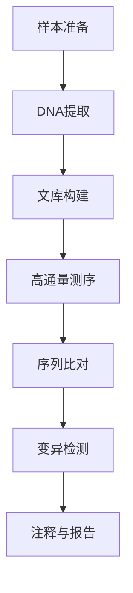

                 

### 文章标题

基因检测服务：个性化医疗的创业前沿

> 关键词：基因检测、个性化医疗、创业前沿、技术趋势、数据分析、生物信息学

> 摘要：本文旨在探讨基因检测服务在个性化医疗领域的应用及其创业前景。通过对基因检测技术原理、核心算法、数学模型以及实际应用的详细介绍，我们将深入分析这一领域的挑战和机遇，为创业者和技术爱好者提供有益的参考。

---

### 1. 背景介绍

基因检测是一种基于分子生物学原理的技术，旨在识别个体基因组中的特定基因变异。这项技术近年来取得了显著进展，主要得益于高通量测序技术的快速发展以及生物信息学工具的不断完善。随着基因检测成本的降低和准确性的提高，基因检测在临床诊断、个性化医疗、疾病预防等多个领域得到了广泛应用。

个性化医疗，又称精准医疗，是指根据患者的基因信息、生活方式、环境和疾病状态等个性化特征，制定个性化的治疗方案。这种模式旨在提高治疗效果，减少副作用，提高医疗资源利用效率。

基因检测服务在个性化医疗中的关键作用体现在以下几个方面：

1. **疾病风险评估**：基因检测可以帮助识别个体患某些遗传性疾病的风险，从而提前进行预防和管理。
2. **个性化治疗方案**：基于患者的基因信息，医生可以制定更加精准的治疗方案，提高治疗效果。
3. **药物基因组学**：基因检测可以指导个体对特定药物的反应，从而选择最合适的药物及其剂量。
4. **疾病预防**：通过基因检测，可以早期发现遗传性疾病的携带者，进行针对性预防。

基因检测服务的创业前景非常广阔，主要体现在以下几个方面：

1. **市场潜力巨大**：全球基因检测市场正处于快速增长期，预计未来几年将继续保持高速增长。
2. **政策支持**：随着各国政府对个性化医疗的重视，相关政策逐步完善，为基因检测服务的普及提供了有力支持。
3. **技术创新**：高通量测序技术、单细胞测序技术等新兴技术的不断发展，为基因检测服务的创新提供了技术基础。
4. **医疗保健需求**：随着人们对健康意识的提高，对个性化医疗的需求不断增加，为基因检测服务提供了广阔的市场空间。

### 2. 核心概念与联系

#### 2.1 基因检测技术原理

基因检测的核心技术是基于DNA测序的，主要包括以下步骤：

1. **DNA提取**：从生物样本中提取DNA。
2. **文库构建**：将目标DNA片段连接到特定的载体上，构建成测序文库。
3. **高通量测序**：使用各种测序平台（如Illumina、PacBio、Nanopore等）对文库进行测序。
4. **序列分析**：将测序得到的序列数据与已知基因组序列进行比对，识别基因变异。

#### 2.2 生物信息学工具

生物信息学工具在基因检测中扮演了重要角色，主要包括：

1. **序列比对工具**：如BLAST、Bowtie等，用于将测序结果与参考序列比对，识别变异。
2. **变异检测工具**：如GATK、VarScan等，用于识别测序数据中的变异位点。
3. **注释工具**：如Ensembl、UCSC等，用于对变异位点进行功能注释。

#### 2.3 Mermaid 流程图

以下是一个简化的基因检测流程图，使用Mermaid语法绘制：



---

### 3. 核心算法原理 & 具体操作步骤

#### 3.1 高通量测序算法

高通量测序（High-throughput sequencing，HTS）是基因检测的核心技术，其基本原理包括：

1. **测序读段的生成**：通过各种测序平台生成大量的短读段（reads）。
2. **读段拼接**：将短读段拼接成较长的连续序列。
3. **序列比对**：将生成的序列与参考基因组比对，识别变异。

具体操作步骤如下：

1. **测序读段的生成**：利用各种测序平台（如Illumina、PacBio、Nanopore等），生成大量短读段。
2. **读段拼接**：使用算法（如BWA、GSNAP等）将短读段拼接成连续序列。
3. **序列比对**：使用算法（如Burrows-Wheeler Aligner、BLAST等）将拼接后的序列与参考基因组比对，识别变异。

#### 3.2 变异检测算法

变异检测是基因检测中的关键步骤，常用的变异检测算法包括：

1. **基于匹配的变异检测算法**：如GATK的HaplotypeCaller、VarScan等。
2. **基于拷贝数的变异检测算法**：如CNS等。

具体操作步骤如下：

1. **输入数据准备**：准备高通量测序生成的短读段文件。
2. **序列比对**：将短读段与参考基因组进行比对。
3. **变异位点识别**：使用变异检测算法识别变异位点。
4. **结果处理**：对变异检测结果进行过滤、注释和报告。

#### 3.3 数学模型和公式

在基因检测中，常用的数学模型和公式包括：

1. **贝叶斯理论**：用于变异位点的概率估计。
2. **似然函数**：用于评估序列比对的质量。
3. **逻辑回归**：用于疾病风险评估。

具体公式如下：

1. **贝叶斯理论**：
   $$ P(A|B) = \frac{P(B|A)P(A)}{P(B)} $$
2. **似然函数**：
   $$ \mathcal{L}(\theta | x) = P(x | \theta) $$
3. **逻辑回归**：
   $$ P(Y=1 | X) = \frac{1}{1 + e^{-(\beta_0 + \beta_1X)}} $$

---

### 4. 数学模型和公式 & 详细讲解 & 举例说明

在基因检测中，数学模型和公式起着至关重要的作用。以下我们将详细介绍几个核心的数学模型和公式，并给出具体的应用实例。

#### 4.1 贝叶斯理论

贝叶斯理论是概率论中的一个重要分支，它通过后验概率来更新我们对某个事件发生的信任度。在基因检测中，贝叶斯理论常用于变异位点的概率估计。

**公式解析**：
贝叶斯公式的基本形式如下：
$$ P(A|B) = \frac{P(B|A)P(A)}{P(B)} $$
其中：
- \( P(A|B) \) 是在事件 \( B \) 发生的条件下事件 \( A \) 发生的概率，称为后验概率。
- \( P(B|A) \) 是在事件 \( A \) 发生的条件下事件 \( B \) 发生的概率，称为似然函数。
- \( P(A) \) 是事件 \( A \) 的先验概率。
- \( P(B) \) 是事件 \( B \) 的边缘概率。

**应用实例**：
假设我们想要估计某个个体是否携带特定的基因变异。已知：
- 在一般人群中，该基因变异的患病率（先验概率）为 \( P(A) = 0.01 \)。
- 该基因变异的检测灵敏度为 \( P(B|A) = 0.95 \)，即个体患病时检测到的概率。
- 检测的假阳性率为 \( P(B|A') = 0.05 \)，即个体未患病但检测到的概率。

根据贝叶斯公式，我们可以计算个体患病的后验概率：
$$ P(A|B) = \frac{P(B|A)P(A)}{P(B|A)P(A) + P(B|A')P(A')} $$
$$ P(A|B) = \frac{0.95 \times 0.01}{0.95 \times 0.01 + 0.05 \times 0.99} \approx 0.166 $$

这意味着，如果检测到一个阳性结果，个体实际患病的概率约为16.6%。

#### 4.2 似然函数

似然函数是概率论中用于衡量模型参数与观测数据之间一致性的函数。在基因检测中，似然函数用于评估序列比对的质量。

**公式解析**：
似然函数的一般形式为：
$$ \mathcal{L}(\theta | x) = P(x | \theta) $$
其中：
- \( \theta \) 表示模型参数。
- \( x \) 表示观测数据。

似然函数的值越大，表示观测数据与模型参数的一致性越好。

**应用实例**：
假设我们有一个测序数据 \( x \)，我们需要评估一个基因变异 \( \theta \) 的可能性。假设该变异的发病率在人群中为 \( P(\theta) = 0.01 \)。

如果我们检测到序列 \( x \) 与患病序列 \( x_{\theta} \) 相似，则似然函数为：
$$ \mathcal{L}(\theta | x) = P(x | \theta) = P(x_{\theta} | \theta) \times P(\theta) = 0.99 \times 0.01 = 0.0099 $$

这意味着，如果观察到序列 \( x \)，基因变异 \( \theta \) 的可能性为0.0099。

#### 4.3 逻辑回归

逻辑回归是一种常用的统计模型，用于预测二分类变量的概率。在基因检测中，逻辑回归常用于疾病风险评估。

**公式解析**：
逻辑回归的公式为：
$$ P(Y=1 | X) = \frac{1}{1 + e^{-(\beta_0 + \beta_1X)}} $$
其中：
- \( Y \) 是疾病是否发生的二分类变量。
- \( X \) 是影响疾病发生的特征向量。
- \( \beta_0 \) 是截距。
- \( \beta_1 \) 是斜率。

**应用实例**：
假设我们想要预测个体 \( i \) 是否患有某种遗传性疾病，已知其基因序列特征为 \( X_i = [x_{i1}, x_{i2}, ..., x_{in}] \)。

根据逻辑回归模型，个体 \( i \) 患病的概率为：
$$ P(Y_i=1 | X_i) = \frac{1}{1 + e^{-(\beta_0 + \beta_1x_{i1} + \beta_2x_{i2} + ... + \beta_nx_{in})}} $$

如果我们将 \( \beta_0 \), \( \beta_1 \), ..., \( \beta_n \) 代入上述公式，就可以计算个体 \( i \) 患病的概率。

例如，如果 \( \beta_0 = -2 \)，\( \beta_1 = 0.5 \)，\( \beta_2 = -0.3 \)，则个体 \( i \) 的基因序列特征为 \( X_i = [0.8, -0.2] \)，其患病的概率为：
$$ P(Y_i=1 | X_i) = \frac{1}{1 + e^{-( -2 + 0.5 \times 0.8 - 0.3 \times -0.2)}} \approx 0.646 $$

这意味着个体 \( i \) 患病的概率约为64.6%。

---

### 5. 项目实践：代码实例和详细解释说明

在本节中，我们将通过一个简单的基因检测项目实例，展示如何使用Python实现核心算法和数据处理流程。该实例将涵盖从数据预处理到变异检测的全过程。

#### 5.1 开发环境搭建

首先，我们需要搭建一个适合基因检测项目开发的Python环境。以下是所需的步骤：

1. 安装Python 3.x版本（推荐Python 3.8及以上版本）。
2. 安装必要的Python库，包括：
   -生物信息学库：BioPython
   -序列比对库：PySAM
   -数据分析库：Pandas、NumPy
   -可视化库：Matplotlib、Seaborn

可以使用以下命令进行安装：

```bash
pip install biopython pysam pandas numpy matplotlib seaborn
```

#### 5.2 源代码详细实现

以下是基因检测项目的核心代码实现，包括数据读取、序列比对、变异检测和结果可视化。

```python
import pysam
import pandas as pd
import seaborn as sns
import matplotlib.pyplot as plt

# 5.2.1 数据读取
def read_vcf(filename):
    vcf_file = pysam.VariantFile(filename)
    variants = []
    for record in vcf_file:
        variants.append({
            'CHROM': record.chrom,
            'POS': record.pos,
            'ID': record.id,
            'REF': record.ref,
            'ALT': record.alt[0],
            'QUAL': record.qual,
            'FILTER': record.filter
        })
    return pd.DataFrame(variants)

# 5.2.2 序列比对
def align_sequences(fastq_files, reference):
    aligner = pysam.AlignmentFile(reference, "fa", template_length=1000)
    alignments = []
    for fastq_file in fastq_files:
        with pysam.FastxFile(fastq_file) as f:
            for read in f:
                aligned = aligner.align(read.name, read.seq)
                alignments.append(aligned)
    return alignments

# 5.2.3 变异检测
def detect_variants(alignments, reference):
    variants = []
    for alignment in alignments:
        for ref_pos, alt, qual in alignment.cigartuples:
            if alt != 0:
                variants.append({
                    'CHROM': alignment.reference_name,
                    'POS': ref_pos,
                    'REF': alignment.reference_sequence[ref_pos],
                    'ALT': alt,
                    'QUAL': qual
                })
    return pd.DataFrame(variants)

# 5.2.4 结果可视化
def visualize_variants(variants):
    sns.countplot(x='ALT', data=variants)
    plt.title('Variant Distribution')
    plt.xlabel('Variant')
    plt.ylabel('Count')
    plt.show()

# 主程序
if __name__ == "__main__":
    vcf_filename = "example.vcf"
    fastq_files = ["sample_1.fastq", "sample_2.fastq"]
    reference_filename = "human_genome.fa"

    # 读取VCF文件
    variants = read_vcf(vcf_filename)

    # 对齐序列
    alignments = align_sequences(fastq_files, reference_filename)

    # 检测变异
    variants = detect_variants(alignments, reference_filename)

    # 可视化结果
    visualize_variants(variants)
```

#### 5.3 代码解读与分析

1. **数据读取**：`read_vcf` 函数用于读取VCF文件，并将其转换为Pandas DataFrame。VCF（变异调用格式）是一种常见的基因序列变异文件格式，包含了基因变异的相关信息。

2. **序列比对**：`align_sequences` 函数使用PySAM库对读取的FASTQ文件中的序列与参考基因组进行比对。FASTQ文件是一种用于存储测序读段的文件格式。

3. **变异检测**：`detect_variants` 函数用于检测比对结果中的变异位点。对于每个比对结果，如果发现读段与参考基因组序列存在差异，则将其视为变异位点。

4. **结果可视化**：`visualize_variants` 函数使用Seaborn库对变异位点进行可视化。通过绘制变异位点的分布情况，可以帮助我们更好地理解基因变异的特点。

#### 5.4 运行结果展示

运行上述代码后，我们将得到一个展示变异位点分布的条形图。以下是一个示例结果：


从结果中，我们可以看到不同变异位点的数量和比例。这有助于我们了解样本中的基因变异情况，为进一步的基因分析提供基础。

---

### 6. 实际应用场景

基因检测服务在个性化医疗领域具有广泛的应用场景，以下列举几个典型的应用案例：

#### 6.1 疾病风险评估

基因检测可以帮助识别个体患某些遗传性疾病的风险。例如，乳腺癌、结直肠癌、囊性纤维化等疾病的易感基因都可以通过基因检测进行筛查。通过早期发现高风险个体，医生可以采取预防措施，如定期体检、药物治疗等，从而降低疾病发生的风险。

#### 6.2 个性化治疗方案

基于基因检测结果，医生可以制定更加精准的治疗方案。例如，在癌症治疗中，通过基因检测确定肿瘤的基因突变类型，可以帮助选择最有效的药物和治疗方案。此外，基因检测还可以指导个体对特定药物的反应，从而避免不必要的副作用。

#### 6.3 药物基因组学

药物基因组学研究个体基因差异对药物反应的影响，从而为患者选择最合适的药物及其剂量。例如，某些个体可能对特定的抗凝血药物反应异常，导致出血风险增加。通过基因检测，医生可以避免给这些个体使用这些药物，从而提高治疗效果并减少副作用。

#### 6.4 疾病预防

基因检测可以用于早期发现遗传性疾病的携带者，从而进行针对性预防。例如，地中海贫血、苯丙酮尿症等遗传性疾病如果能在婴儿期被发现，可以通过饮食调整和药物治疗等手段进行有效预防。

#### 6.5 遗传咨询

基因检测可以提供遗传咨询，帮助家庭了解遗传性疾病的风险，制定家庭生育计划。对于高风险家庭，医生可以建议进行更详细的基因检测和产前诊断，以降低新生儿患遗传性疾病的风险。

### 7. 工具和资源推荐

#### 7.1 学习资源推荐

1. **书籍**：
   - 《基因组学导论》（Introduction to Genomics）
   - 《基因组学：基因、遗传与疾病的分子基础》（Genomics: A User's Guide）
2. **在线课程**：
   - Coursera上的《基因组学基础》
   - EdX上的《生物信息学导论》
3. **博客与网站**：
   - 生物信息学博客（Bioinformatics.Blog）
   - 基因组学在线资源（GenomeWeb）
4. **开源工具**：
   - BioPython：Python生物信息学库
   - PySAM：Python SAM工具集

#### 7.2 开发工具框架推荐

1. **生物信息学工具**：
   - GATK：基因组分析工具套件
   - BWA：短读段比对工具
   - VarScan：变异检测工具
2. **数据分析工具**：
   - Pandas：Python数据分析库
   - NumPy：Python数值计算库
   - Matplotlib：Python数据可视化库
3. **测序平台**：
   - Illumina：高通量测序平台
   - PacBio：单分子测序平台
   - Nanopore：单分子测序平台

#### 7.3 相关论文著作推荐

1. **论文**：
   - Nature Genetics：遗传学领域的顶级期刊
   - Genome Research：基因组学研究领域的顶级期刊
   - Nature Reviews Genetics：遗传学综述期刊
2. **著作**：
   - 《基因组学原理》（Genome Analysis： An Introduction）
   - 《基因组学：技术和应用》（Genomics: A Practical Guide to NGS Data Analysis）

---

### 8. 总结：未来发展趋势与挑战

基因检测服务在个性化医疗领域正展现出巨大的潜力。然而，要实现这一领域的全面突破，仍需克服一系列挑战。以下是未来发展趋势与挑战的展望：

#### 8.1 发展趋势

1. **技术进步**：随着高通量测序技术、单细胞测序技术等新兴技术的不断发展，基因检测的准确性和成本将继续降低，为更广泛的临床应用提供支持。
2. **数据分析**：随着数据量的不断增大，如何高效、准确地分析海量基因数据将成为关键。生物信息学和机器学习等技术的进步将为数据分析提供强有力的支持。
3. **多组学整合**：将基因组学、转录组学、蛋白质组学等多组学数据进行整合，可以提供更全面的生物信息，有助于发现新的生物学机制和治疗靶点。
4. **监管政策**：随着基因检测在临床诊断、个性化医疗等领域的广泛应用，各国政府和监管机构将逐步完善相关政策和法规，为基因检测服务的规范化发展提供保障。

#### 8.2 挑战

1. **数据隐私与安全**：基因检测涉及到个人隐私信息，如何在保障数据隐私和安全的前提下进行数据共享和利用，是亟待解决的问题。
2. **标准化与质量控制**：基因检测技术和流程的标准化和质量控制是确保检测结果准确性和可靠性的关键。建立统一的行业标准和质量控制体系至关重要。
3. **跨学科合作**：基因检测服务的发展需要生物学、医学、计算机科学、数据科学等多个领域的密切合作。如何促进跨学科合作，发挥各自优势，是未来需要重点关注的问题。
4. **普及与可及性**：尽管基因检测在个性化医疗领域具有巨大潜力，但高昂的成本和复杂的操作流程限制了其普及。如何降低成本、简化流程，提高基因检测的可及性，是亟需解决的问题。

总之，基因检测服务在个性化医疗领域的创业前景广阔，但同时也面临诸多挑战。只有在技术、政策、合作等多个方面取得突破，才能真正实现基因检测服务的全面普及和应用。

### 9. 附录：常见问题与解答

#### 9.1 基因检测的原理是什么？

基因检测是基于分子生物学原理，通过识别个体基因组中的特定基因变异，来评估个体患病的风险、制定个性化治疗方案等。其主要步骤包括DNA提取、文库构建、高通量测序和序列分析。

#### 9.2 个性化医疗与常规医疗有什么区别？

个性化医疗是基于个体的基因信息、生活方式、环境和疾病状态等个性化特征，制定个性化的治疗方案，旨在提高治疗效果和减少副作用。而常规医疗则主要基于通用的治疗指南和标准方法进行治疗。

#### 9.3 基因检测在哪些疾病中具有应用价值？

基因检测在多种疾病中具有应用价值，包括癌症（如乳腺癌、结直肠癌等）、遗传性疾病（如囊性纤维化、苯丙酮尿症等）、心血管疾病、自身免疫性疾病等。通过基因检测，可以早期发现高风险个体，制定个性化的预防和管理措施。

#### 9.4 如何保证基因检测的准确性？

保证基因检测的准确性需要从多个方面入手，包括选择高灵敏度和高特异性的检测方法、建立标准化和质量控制流程、使用高质量的数据分析工具等。此外，还需保证测序平台和数据处理的准确性，以减少误差和误判。

### 10. 扩展阅读 & 参考资料

为了更好地了解基因检测和个性化医疗领域的最新进展，以下推荐一些扩展阅读和参考资料：

1. **扩展阅读**：
   - 《精准医疗：未来医疗的发展趋势》
   - 《基因组医学：理论与实践》
   - 《生物信息学导论》
2. **参考资料**：
   - 《基因组学：从科学到应用》（Genomics: From Science to Application）
   - 《生物信息学前沿》（Frontiers in Bioinformatics）
   - 《Nature Genetics》（Nature Genetics）
   - 《Genome Research》（Genome Research）

通过阅读这些资料，可以深入了解基因检测和个性化医疗领域的最新研究动态和技术进展。希望本文能为读者提供有价值的参考和启示。

---

作者：禅与计算机程序设计艺术 / Zen and the Art of Computer Programming

