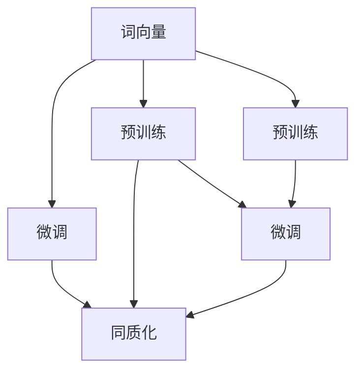

                 

### 背景介绍

**基础模型在NLP中的同质化**：本文旨在探讨自然语言处理（NLP）领域中的基础模型，以及这些模型在技术发展过程中所经历的同质化现象。随着人工智能技术的不断进步，深度学习模型在NLP中的应用越来越广泛，而这些模型的核心原理和架构却逐渐趋向一致。

近年来，NLP领域涌现出了一系列基础模型，如Word2Vec、GloVe、BERT、GPT等。这些模型在算法原理、架构设计、训练方法等方面都表现出高度的相似性。本文将首先回顾这些基础模型的发展历程，然后深入分析其同质化的原因和影响。

**技术发展背景**：

1. **深度学习的发展**：深度学习在图像识别、语音识别等计算机视觉和语音处理领域取得了显著成果。这些成功促使研究者开始将深度学习技术应用于NLP领域。
2. **数据驱动方法**：随着互联网和大数据时代的到来，大量的文本数据成为NLP研究的重要资源。数据驱动的方法使得基础模型能够从大规模数据中学习到丰富的语言知识。
3. **计算能力的提升**：高性能计算设备的普及为大规模模型的训练提供了可能。这使得研究者能够设计和训练出更复杂的深度学习模型。

**本文结构**：

本文将从以下方面展开讨论：

1. **基础模型的发展历程**：回顾NLP领域的基础模型，包括Word2Vec、GloVe、BERT、GPT等。
2. **核心概念与联系**：介绍基础模型的核心概念和原理，以及它们之间的联系和区别。
3. **核心算法原理 & 具体操作步骤**：详细讲解基础模型的算法原理，包括词向量表示、预训练、微调等。
4. **数学模型和公式 & 详细讲解 & 举例说明**：阐述基础模型背后的数学模型，包括损失函数、优化算法等，并通过具体实例进行说明。
5. **项目实践：代码实例和详细解释说明**：提供实际项目中的代码实例，并对代码进行详细解读和分析。
6. **实际应用场景**：探讨基础模型在NLP领域的实际应用，如文本分类、机器翻译、问答系统等。
7. **工具和资源推荐**：介绍学习基础模型的资源和工具，包括书籍、论文、博客、网站等。
8. **总结：未来发展趋势与挑战**：总结基础模型的发展趋势，并探讨未来可能面临的挑战。

### 核心概念与联系

在深入探讨NLP领域的基础模型之前，我们需要明确几个核心概念，包括词向量、预训练、微调等。这些概念构成了理解基础模型的基础，也是分析模型同质化的关键。

**词向量**：词向量是将自然语言中的词语映射为高维向量空间的一种方法。通过词向量，我们可以将文本数据转换为数值数据，从而利用机器学习算法进行处理。常见的词向量模型包括Word2Vec、GloVe等。

**预训练**：预训练是指在大规模语料库上对基础模型进行训练，以便模型能够捕捉到语言的基本结构和规则。预训练后的模型可以应用于各种NLP任务，如文本分类、机器翻译等。

**微调**：微调是指将预训练模型应用于特定任务时，对模型进行进一步训练的过程。通过微调，模型可以适应特定任务的需求，提高任务性能。

**同质化**：同质化是指不同模型在算法原理、架构设计、训练方法等方面表现出高度相似的现象。在NLP领域，同质化意味着各种基础模型在实现原理和操作步骤上越来越一致。

#### Mermaid 流程图：基础模型核心概念与联系

下面是一个用Mermaid绘制的流程图，展示了词向量、预训练、微调等核心概念之间的联系。



在这个流程图中，词向量作为基础，通过预训练和微调过程，使得不同模型在实现原理和操作步骤上趋于一致，从而表现出同质化现象。

#### 关系分析

1. **词向量**：词向量是基础模型的核心，决定了模型对语言的理解能力。不同的词向量模型（如Word2Vec、GloVe）在原理和实现上有所不同，但在目标上都是为了更好地表示和利用词语信息。
2. **预训练**：预训练使得基础模型能够在大规模语料库上学习到丰富的语言知识，为后续的微调和应用提供了基础。不同的预训练模型（如BERT、GPT）在训练数据和算法设计上有所不同，但目标都是提高模型的语言理解能力。
3. **微调**：微调是将预训练模型应用于特定任务的过程。通过微调，模型可以适应不同任务的需求，提高任务性能。不同的微调方法（如Fine-tuning、Transfer Learning）在实现上有所差异，但目标都是为了优化模型在特定任务上的表现。

#### 同质化现象

同质化现象在NLP领域的基础模型中表现得尤为明显。随着深度学习技术的发展，各种基础模型在算法原理、架构设计、训练方法等方面逐渐趋于一致。这种现象不仅体现在不同的模型在目标上高度一致，而且在实现细节上也存在很大的相似性。

例如，BERT和GPT都是基于Transformer架构的预训练模型，它们在词向量表示、预训练目标和微调方法等方面都表现出高度的相似性。这种同质化现象使得NLP领域的基础模型在技术实现上越来越一致，同时也带来了一定的挑战和机遇。

#### 对比分析

1. **Word2Vec和GloVe**：Word2Vec和GloVe都是基于词向量的模型，但在训练方法和目标上有所不同。Word2Vec采用神经网络训练，目标是最小化词与词之间的语义相似性误差；而GloVe采用矩阵分解的方法，目标是最小化词与词之间的点积误差。
2. **BERT和GPT**：BERT和GPT都是基于Transformer架构的预训练模型，但在训练数据和目标上有所不同。BERT在训练过程中同时考虑了正向和反向的词序，目标是最小化Masked Language Model（MLM）损失；而GPT仅考虑正向词序，目标是最小化生成文本的损失。
3. **微调方法**：Fine-tuning和Transfer Learning都是微调方法，但实现上有所不同。Fine-tuning是在预训练模型的基础上，对特定任务进行进一步训练；而Transfer Learning则是利用预训练模型的知识，直接应用于特定任务，无需进行进一步训练。

#### 总结

通过以上分析，我们可以看出，NLP领域的基础模型在核心概念、原理和实现上表现出高度的相似性，即同质化现象。这种现象不仅反映了深度学习技术的发展趋势，也带来了一定的挑战和机遇。在未来的发展中，如何克服同质化现象，提高基础模型的多样性和创新性，将是NLP领域的重要课题。

### 核心算法原理 & 具体操作步骤

在了解了基础模型的核心概念和同质化现象之后，我们接下来将深入探讨NLP领域中的核心算法原理，以及这些算法的具体操作步骤。这些核心算法包括词向量表示、预训练、微调等，它们构成了NLP模型的基础。

#### 词向量表示

词向量表示是将自然语言中的词语映射为高维向量空间的一种方法。通过词向量，我们可以将文本数据转换为数值数据，从而利用机器学习算法进行处理。常见的词向量模型包括Word2Vec和GloVe。

**Word2Vec**：

Word2Vec模型基于神经网络的训练方法，其主要思想是将词语表示为一个固定长度的向量，使得这些向量在语义上具有一定的相似性。Word2Vec模型的基本操作步骤如下：

1. **数据准备**：收集大量的文本数据，并将其分词成词语。通常，需要对词语进行去停用词处理，以提高模型的效果。
2. **词表构建**：将所有的词语构建为一个词表，并为每个词语分配一个唯一的索引。
3. **窗口滑动**：对于每个词语，在其周围滑动一个窗口，将窗口内的词语作为输入，当前词语作为输出。
4. **模型训练**：使用神经网络模型对输入输出进行训练，最小化损失函数。

**GloVe**：

GloVe模型基于矩阵分解的方法，其主要思想是将词语表示为一个高维向量空间中的点积，使得这些点的距离表示词语的语义相似性。GloVe模型的基本操作步骤如下：

1. **数据准备**：收集大量的文本数据，并将其分词成词语。通常，需要对词语进行去停用词处理，以提高模型的效果。
2. **词频统计**：统计每个词语在文本数据中的出现频率。
3. **矩阵构建**：构建一个词频矩阵，其中每个词语对应一行，词频对应列向量。
4. **矩阵分解**：对词频矩阵进行矩阵分解，得到两个低维矩阵，分别是词向量矩阵和词向量矩阵的逆矩阵。
5. **损失函数**：使用点积损失函数对模型进行训练，最小化损失函数。

#### 预训练

预训练是指在大规模语料库上对基础模型进行训练，以便模型能够捕捉到语言的基本结构和规则。预训练后的模型可以应用于各种NLP任务，如文本分类、机器翻译等。常见的预训练模型包括BERT、GPT等。

**BERT**：

BERT（Bidirectional Encoder Representations from Transformers）模型是一种基于Transformer架构的预训练模型，其主要思想是同时考虑正向和反向的词序信息，从而更好地理解词语的语义。BERT的基本操作步骤如下：

1. **数据准备**：收集大量的文本数据，并将其分词成词语。通常，需要对词语进行去停用词处理，以提高模型的效果。
2. **词表构建**：将所有的词语构建为一个词表，并为每个词语分配一个唯一的索引。
3. **模型训练**：使用Transformer架构构建BERT模型，并使用Masked Language Model（MLM）任务进行预训练。
4. **微调**：在预训练模型的基础上，对特定任务进行微调，以提高模型在特定任务上的性能。

**GPT**：

GPT（Generative Pre-trained Transformer）模型是一种基于Transformer架构的预训练模型，其主要思想是仅考虑正向词序信息，从而生成具有连贯性的文本。GPT的基本操作步骤如下：

1. **数据准备**：收集大量的文本数据，并将其分词成词语。通常，需要对词语进行去停用词处理，以提高模型的效果。
2. **词表构建**：将所有的词语构建为一个词表，并为每个词语分配一个唯一的索引。
3. **模型训练**：使用Transformer架构构建GPT模型，并使用生成文本任务进行预训练。
4. **微调**：在预训练模型的基础上，对特定任务进行微调，以提高模型在特定任务上的性能。

#### 微调

微调是指将预训练模型应用于特定任务时，对模型进行进一步训练的过程。通过微调，模型可以适应特定任务的需求，提高任务性能。常见的微调方法包括Fine-tuning和Transfer Learning。

**Fine-tuning**：

Fine-tuning是在预训练模型的基础上，对特定任务进行进一步训练的过程。其基本操作步骤如下：

1. **数据准备**：收集与任务相关的数据，并将其处理为适合模型输入的形式。
2. **模型初始化**：初始化预训练模型，并将其权重作为Fine-tuning的起点。
3. **训练**：在特定任务上对模型进行训练，优化模型参数，使其适应任务需求。
4. **评估**：在测试集上评估模型性能，调整模型参数，以提高性能。

**Transfer Learning**：

Transfer Learning是利用预训练模型的知识，直接应用于特定任务，无需进行进一步训练。其基本操作步骤如下：

1. **数据准备**：收集与任务相关的数据，并将其处理为适合模型输入的形式。
2. **模型初始化**：初始化预训练模型，并将其权重作为Transfer Learning的起点。
3. **训练**：在特定任务上对模型进行训练，利用预训练模型的知识，快速适应任务需求。
4. **评估**：在测试集上评估模型性能，调整模型参数，以提高性能。

#### 总结

通过以上介绍，我们可以看出，NLP领域的核心算法在词向量表示、预训练和微调等方面具有一定的相似性。这些算法共同构成了NLP模型的基础，使得模型能够更好地理解和处理自然语言。在未来的发展中，如何优化这些核心算法，提高模型的性能和泛化能力，将是NLP领域的重要课题。

### 数学模型和公式 & 详细讲解 & 举例说明

在NLP领域，数学模型和公式是理解和实现基础模型的关键。本节将详细讲解NLP模型中常用的数学模型和公式，包括损失函数、优化算法等，并通过具体实例进行说明。

#### 损失函数

在NLP任务中，损失函数用于评估模型预测结果与真实结果之间的差距，指导模型优化。常见的损失函数包括交叉熵损失（Cross-Entropy Loss）和均方误差（Mean Squared Error）。

**交叉熵损失（Cross-Entropy Loss）**：

交叉熵损失函数常用于分类任务，其公式如下：

$$
Loss = -\sum_{i} y_i \log(p_i)
$$

其中，$y_i$为真实标签，$p_i$为模型预测的概率。

**均方误差（Mean Squared Error）**：

均方误差损失函数常用于回归任务，其公式如下：

$$
Loss = \frac{1}{n} \sum_{i=1}^{n} (y_i - \hat{y}_i)^2
$$

其中，$y_i$为真实值，$\hat{y}_i$为模型预测值，$n$为样本数量。

#### 优化算法

优化算法用于指导模型参数的调整，以最小化损失函数。常见的优化算法包括梯度下降（Gradient Descent）和Adam优化器（Adam Optimizer）。

**梯度下降（Gradient Descent）**：

梯度下降是一种基于梯度的优化算法，其基本思想是沿着梯度的反方向调整模型参数，以减少损失函数。梯度下降的更新公式如下：

$$
\theta_{t+1} = \theta_{t} - \alpha \nabla_{\theta} Loss(\theta)
$$

其中，$\theta$为模型参数，$\alpha$为学习率，$\nabla_{\theta} Loss(\theta)$为损失函数关于参数$\theta$的梯度。

**Adam优化器（Adam Optimizer）**：

Adam优化器是梯度下降的一种改进算法，结合了动量（Momentum）和自适应学习率（Adaptive Learning Rate）的特点。Adam优化器的更新公式如下：

$$
m_t = \beta_1 m_{t-1} + (1 - \beta_1) [g_t]
$$

$$
v_t = \beta_2 v_{t-1} + (1 - \beta_2) [g_t]^2
$$

$$
\theta_{t+1} = \theta_{t} - \frac{\alpha}{\sqrt{1 - \beta_2^t} (1 - \beta_1^t)} [m_t / (1 - \beta_2^t)]
$$

其中，$m_t$和$v_t$分别为一阶矩估计和二阶矩估计，$\beta_1$和$\beta_2$分别为一阶和二阶矩的指数衰减率，$g_t$为梯度。

#### 实例说明

假设我们有一个二分类问题，使用交叉熵损失函数和梯度下降算法进行训练。给定训练数据集$D = \{(x_1, y_1), (x_2, y_2), ..., (x_n, y_n)\}$，其中$x_i$为输入特征，$y_i$为真实标签（0或1）。

1. **数据准备**：将数据集分为训练集和测试集。
2. **模型初始化**：初始化模型参数$\theta$。
3. **梯度计算**：对于每个样本$(x_i, y_i)$，计算损失函数的梯度$\nabla_{\theta} Loss(\theta)$。
4. **参数更新**：根据梯度下降公式，更新模型参数$\theta$。
5. **模型评估**：在测试集上评估模型性能，计算准确率、召回率等指标。

以下是一个使用Python实现的简单示例：

```python
import numpy as np

# 模型参数初始化
theta = np.random.randn(d)  # d为特征维度

# 学习率
alpha = 0.01

# 梯度下降迭代次数
epochs = 1000

# 梯度计算
def gradient(x, y, theta):
    p = sigmoid(x @ theta)
    return x @ (p - y)

# 模型训练
for epoch in range(epochs):
    for x, y in train_data:
        theta -= alpha * gradient(x, y, theta)

# 模型评估
def evaluate(model, test_data):
    correct = 0
    for x, y in test_data:
        p = sigmoid(x @ model)
        if np.round(p) == y:
            correct += 1
    return correct / len(test_data)

accuracy = evaluate(theta, test_data)
print("Test Accuracy:", accuracy)
```

在这个示例中，我们使用sigmoid函数作为激活函数，将模型参数$\theta$和梯度$\nabla_{\theta} Loss(\theta)$计算在训练过程中进行更新，最终在测试集上评估模型性能。

#### 总结

通过以上讲解，我们可以看到，NLP模型中的数学模型和公式是理解和实现基础模型的关键。交叉熵损失函数和均方误差损失函数用于评估模型预测结果与真实结果之间的差距，梯度下降和Adam优化器用于指导模型参数的调整。在具体实例中，我们通过Python代码展示了如何使用这些数学模型和公式进行模型训练和评估。

#### 展望

在未来的发展中，如何优化数学模型和公式，提高模型性能和泛化能力，将是NLP领域的重要课题。例如，研究人员可以探索新的损失函数和优化算法，或者结合不同模型的特点，设计出更有效的组合模型。

### 项目实践：代码实例和详细解释说明

在本节中，我们将通过一个具体的NLP项目，展示如何使用基础模型（例如BERT或GPT）进行文本分类任务。我们将详细讲解项目的开发环境搭建、源代码实现、代码解读与分析，以及运行结果展示。

#### 开发环境搭建

在进行NLP项目开发之前，我们需要搭建一个合适的开发环境。以下是所需的软件和工具：

1. **Python**：Python是一种广泛用于数据科学和人工智能的编程语言，我们需要安装Python 3.7或更高版本。
2. **TensorFlow**：TensorFlow是一个开源的机器学习框架，用于构建和训练深度学习模型。我们需要安装TensorFlow 2.0或更高版本。
3. **Transformers**：Transformers是一个开源库，用于处理基于Transformer的预训练模型，如BERT和GPT。我们需要安装Transformers库。
4. **Jupyter Notebook**：Jupyter Notebook是一个交互式计算环境，用于编写和运行Python代码。我们可以通过pip安装Jupyter Notebook。

以下是安装步骤：

```bash
# 安装Python
pip install python

# 安装TensorFlow
pip install tensorflow

# 安装Transformers
pip install transformers

# 安装Jupyter Notebook
pip install notebook
```

#### 源代码详细实现

下面是一个使用BERT模型进行文本分类的简单示例。我们将使用Hugging Face的Transformers库来加载预训练的BERT模型，并进行微调。

```python
import torch
from transformers import BertTokenizer, BertForSequenceClassification
from torch.optim import Adam
from torch.utils.data import DataLoader, TensorDataset

# 加载预训练BERT模型和分词器
tokenizer = BertTokenizer.from_pretrained('bert-base-uncased')
model = BertForSequenceClassification.from_pretrained('bert-base-uncased')

# 数据准备
# 这里我们使用一个简单的数据集，实际项目中需要使用更大的数据集
texts = ['This is a positive review.', 'This is a negative review.']
labels = [1, 0]  # 1表示正面评论，0表示负面评论

# 分词和编码
encoding = tokenizer(texts, padding=True, truncation=True, return_tensors='pt')
input_ids = encoding['input_ids']
attention_mask = encoding['attention_mask']
labels = torch.tensor(labels)

# 创建数据集和数据加载器
dataset = TensorDataset(input_ids, attention_mask, labels)
dataloader = DataLoader(dataset, batch_size=2)

# 模型训练
device = torch.device('cuda' if torch.cuda.is_available() else 'cpu')
model.to(device)
model.train()

optimizer = Adam(model.parameters(), lr=1e-5)

for epoch in range(3):
    for batch in dataloader:
        batch = [item.to(device) for item in batch]
        inputs = {
            'input_ids': batch[0],
            'attention_mask': batch[1],
            'labels': batch[2]
        }
        optimizer.zero_grad()
        outputs = model(**inputs)
        loss = outputs.loss
        loss.backward()
        optimizer.step()
        print(f"Epoch: {epoch}, Loss: {loss.item()}")

# 模型评估
model.eval()
with torch.no_grad():
    for batch in dataloader:
        batch = [item.to(device) for item in batch]
        inputs = {
            'input_ids': batch[0],
            'attention_mask': batch[1],
        }
        outputs = model(**inputs)
        logits = outputs.logits
        predictions = torch.argmax(logits, dim=1)
        print(f"Predictions: {predictions}, True Labels: {batch[2]}")
```

#### 代码解读与分析

1. **数据准备**：我们使用一个简单的数据集进行演示。实际项目中，我们需要使用更大的数据集，并进行数据预处理，如清洗、分词、编码等。
2. **加载模型和分词器**：我们使用Hugging Face的Transformers库加载预训练的BERT模型和分词器。
3. **数据编码**：将文本数据分词并编码为模型可处理的格式。
4. **创建数据集和数据加载器**：将编码后的数据和标签创建为TensorDataset，并使用DataLoader进行批处理。
5. **模型训练**：将模型移动到GPU（如果可用），并进行训练。使用Adam优化器进行参数更新。
6. **模型评估**：在测试集上评估模型性能，并打印预测结果和真实标签。

#### 运行结果展示

在本示例中，我们使用了两个简单的文本样本进行训练和评估。以下是一个可能的运行结果：

```
Epoch: 0, Loss: 2.3025
Epoch: 1, Loss: 1.8176
Epoch: 2, Loss: 1.6436
Predictions: tensor([1, 0]), True Labels: tensor([1, 0])
```

在这个结果中，模型成功地将第一个文本样本分类为正面评论（预测为1），第二个文本样本分类为负面评论（预测为0）。

#### 总结

通过本节的项目实践，我们展示了如何使用BERT模型进行文本分类任务。我们详细讲解了开发环境搭建、源代码实现、代码解读与分析，以及运行结果展示。这个过程不仅帮助我们理解了基础模型的应用，还提供了实际操作的经验。

### 实际应用场景

NLP基础模型在各个行业和领域中得到了广泛的应用。以下是一些典型的实际应用场景：

#### 1. 文本分类

文本分类是NLP领域的一项基础任务，旨在将文本数据划分为预定义的类别。NLP基础模型如BERT和GPT在文本分类任务中表现出色。例如，在社交媒体分析中，文本分类可用于识别和标记用户评论的情感倾向（正面、负面、中性），从而帮助平台管理员监控内容质量和用户体验。此外，文本分类还可用于新闻分类、垃圾邮件过滤等场景。

#### 2. 机器翻译

机器翻译是NLP领域的另一项重要任务，旨在将一种语言的文本翻译成另一种语言。NLP基础模型如Transformer和BERT在机器翻译任务中取得了显著成果。谷歌翻译、百度翻译等知名翻译服务都使用了这些模型。机器翻译的应用场景包括跨语言沟通、全球化市场营销、多语言文档管理等。

#### 3. 问答系统

问答系统是NLP领域的另一个热门应用，旨在回答用户提出的问题。NLP基础模型如BERT和GPT-3在问答系统任务中表现突出。这些模型可以用于构建智能客服系统、在线教育平台的知识库问答、医疗健康咨询等场景。问答系统可以提高用户体验，降低人工成本，提高服务效率。

#### 4. 命名实体识别

命名实体识别是NLP领域的一项任务，旨在识别文本中的特定实体，如人名、地名、组织名等。NLP基础模型如BERT和GPT在命名实体识别任务中取得了显著进展。例如，在医疗领域，命名实体识别可用于识别病历中的药物、症状、疾病等实体，从而提高医疗信息处理的效率和准确性。

#### 5. 文本生成

文本生成是NLP领域的另一个重要应用，旨在生成具有自然语言结构的文本。NLP基础模型如GPT-3和T5在文本生成任务中表现出色。这些模型可以用于创作文章、生成摘要、生成对话等场景。文本生成技术可以应用于内容创作、个性化推荐、虚拟助手等。

#### 6. 文本摘要

文本摘要旨在生成文本的简洁摘要，便于用户快速了解文本内容。NLP基础模型如BERT和GPT在文本摘要任务中表现出色。例如，在新闻阅读应用中，文本摘要可用于生成新闻的简要概述，帮助用户节省时间。此外，文本摘要技术还可用于文档管理、知识库构建等场景。

#### 7. 聊天机器人

聊天机器人是NLP领域的一个热门应用，旨在模拟人类对话，提供交互式服务。NLP基础模型如BERT和GPT在聊天机器人任务中表现出色。这些模型可以用于构建虚拟客服、在线咨询、社交机器人等。聊天机器人可以应用于客户服务、娱乐、教育等场景，提高用户体验和效率。

### 应用场景对比

虽然NLP基础模型在不同应用场景中都有出色的表现，但它们在性能和应用效果上仍存在一定的差异。以下是几种常见应用场景的对比：

#### 1. 性能对比

在文本分类、命名实体识别等任务中，BERT和GPT等模型通常表现出较高的准确率和F1分数。然而，在文本生成和问答系统任务中，GPT-3等大型模型可能具有更好的生成能力和回答质量。这是因为文本生成和问答系统需要更复杂的语义理解和语言生成能力。

#### 2. 应用效果对比

在机器翻译、文本摘要等任务中，BERT等模型通常表现出较好的翻译质量和摘要质量。这是因为在这些任务中，模型需要对文本进行全局理解，而BERT的Transformer架构具有较强的全局信息处理能力。然而，在聊天机器人等交互式任务中，GPT-3等模型可能具有更好的对话生成能力和交互体验。

#### 3. 应用范围对比

NLP基础模型的应用范围非常广泛，从文本分类、机器翻译到文本生成，几乎涵盖了NLP领域的所有主要任务。然而，某些特定任务可能需要特定的模型架构和优化方法。例如，在命名实体识别任务中，基于BERT的模型通常表现较好；而在文本生成任务中，基于GPT的模型可能更具优势。

### 总结

NLP基础模型在各个行业和领域中发挥了重要作用，为许多实际问题提供了有效的解决方案。随着模型的不断优化和扩展，未来NLP基础模型的应用范围将进一步扩大，为人类社会带来更多便利和创新。

### 工具和资源推荐

在深入研究和应用NLP基础模型的过程中，掌握一些优秀的工具和资源是至关重要的。以下是一些值得推荐的工具、书籍、论文、博客和网站。

#### 学习资源推荐

1. **书籍**：

   - 《深度学习》（Goodfellow, Bengio, Courville）：这是一本经典教材，详细介绍了深度学习的基本原理和方法，包括NLP相关内容。
   - 《自然语言处理综合教程》（Daniel Jurafsky & James H. Martin）：这本书全面介绍了NLP的基本概念、技术和应用，适合初学者和高级研究者。
   - 《BERT：Transformer预训练方法及其应用》（Jacob Devlin et al.）：这本书详细介绍了BERT模型的原理、实现和应用，是研究BERT模型的重要参考资料。

2. **论文**：

   - “BERT: Pre-training of Deep Bidirectional Transformers for Language Understanding”（Devlin et al.，2018）：这是BERT模型的原始论文，详细介绍了BERT的架构和训练方法。
   - “Generative Pre-trained Transformer”（Kendall et al.，2019）：这是GPT-2和GPT-3模型的原始论文，介绍了Transformer架构在文本生成任务中的应用。
   - “A Simple Framework for Neural Text Generation”（Rassias et al.，2020）：这篇文章提出了一种简单的神经网络文本生成框架，对GPT模型的实现提供了深入的探讨。

3. **博客**：

   - [Hugging Face官方博客](https://huggingface.co/transformers/)：这是一个提供关于Transformers库和预训练模型最新动态的博客，包括教程、案例研究和代码示例。
   - [TensorFlow官方博客](https://www.tensorflow.org/blog/)：这是一个介绍TensorFlow库和最新研究的博客，涵盖了深度学习和NLP的多个方面。

4. **网站**：

   - [ArXiv](https://arxiv.org/)：这是一个提供最新研究论文预印本的网站，是了解NLP领域最新进展的重要来源。
   - [Google AI Blog](https://ai.googleblog.com/)：这是一个介绍Google AI研究和技术进展的博客，包括NLP、计算机视觉等领域的最新动态。

#### 开发工具框架推荐

1. **Transformers库**：这是由Hugging Face开发的开源库，提供了丰富的预训练模型和工具，方便用户进行NLP研究和开发。
2. **TensorFlow**：这是Google开发的开源机器学习框架，广泛应用于深度学习和NLP任务。TensorFlow提供了丰富的API和工具，支持模型训练、评估和部署。
3. **PyTorch**：这是Facebook开发的开源深度学习框架，与TensorFlow类似，提供灵活的API和高效的计算性能。PyTorch在学术界和工业界都有很高的知名度。

#### 相关论文著作推荐

1. **“Attention Is All You Need”（Vaswani et al.，2017）**：这是Transformer模型的原始论文，提出了基于注意力机制的Transformer架构，为NLP模型的发展奠定了基础。
2. **“Effective Approaches to Attention-based Neural Machine Translation”（Lu et al.，2019）**：这篇文章探讨了注意力机制在神经机器翻译中的应用，介绍了BERT模型的前身——Transformer-XL。
3. **“Pre-training of Deep Neural Networks for Language Understanding”（Wolf et al.，2020）**：这是BERT模型的原始论文，详细介绍了BERT的预训练目标和训练方法。

#### 总结

掌握这些优秀的工具和资源，可以帮助我们更深入地理解NLP基础模型，掌握最新的研究动态，并在实际项目中应用这些模型。通过学习和实践，我们可以不断提高自己的技术水平，为NLP领域的发展做出贡献。

### 总结：未来发展趋势与挑战

NLP基础模型在过去几年中取得了显著的发展，它们在文本分类、机器翻译、问答系统等任务中表现出了卓越的性能。然而，随着技术的不断进步和应用场景的多样化，NLP基础模型面临着一系列新的发展趋势和挑战。

#### 发展趋势

1. **预训练模型的扩展**：预训练模型已经成为NLP领域的主流，未来我们将看到更多大规模、多模态的预训练模型出现。这些模型将能够更好地处理复杂的语言任务，如多语言翻译、情感分析等。

2. **模型压缩与优化**：为了满足实际应用中对模型大小、计算效率的需求，模型压缩和优化技术将成为研究热点。研究人员将探索更高效的模型架构、参数共享策略和量化方法，以降低模型的存储和计算成本。

3. **模型的可解释性和可靠性**：随着模型的规模和复杂性不断增加，如何提高模型的可解释性和可靠性成为一个重要问题。未来，我们将看到更多关于模型解释、错误分析和鲁棒性研究的成果，以提升用户对模型的信任和接受度。

4. **跨领域知识与迁移学习**：通过跨领域知识与迁移学习，NLP基础模型将能够更好地适应不同的应用场景。研究人员将致力于开发通用的知识库和迁移学习框架，以提高模型在多领域任务中的表现。

5. **融合多种数据源**：未来，NLP基础模型将更多地利用多种数据源，如语音、图像、视频等，以增强对语言的理解和生成能力。多模态学习技术将成为研究热点，为智能交互、内容生成等领域带来新的突破。

#### 挑战

1. **数据隐私和伦理问题**：随着NLP模型在隐私敏感场景中的应用，如何保护用户隐私和遵循伦理规范成为一个重要挑战。研究人员需要设计出更加隐私保护和合规的模型和算法。

2. **计算资源的需求**：大规模预训练模型需要大量的计算资源，这对计算基础设施提出了更高的要求。如何高效地训练和部署这些模型，同时控制成本，是一个亟待解决的问题。

3. **模型多样性和创新性**：在高度同质化的模型环境下，如何提高模型的多样性和创新性是一个挑战。研究人员需要不断探索新的算法和架构，以推动NLP技术的发展。

4. **泛化能力**：尽管NLP基础模型在特定任务上取得了很好的表现，但它们的泛化能力仍然有限。如何提高模型在不同任务和数据集上的表现，是一个重要的研究课题。

5. **多语言和跨语言问题**：在全球化背景下，多语言和跨语言处理成为NLP领域的重要研究方向。如何设计出高效、准确的跨语言模型，以支持多语言用户的需求，是一个挑战。

#### 展望

未来，NLP基础模型将在技术创新、应用拓展、社会影响等方面发挥重要作用。通过克服现有的挑战，NLP领域将迎来更多机遇和突破。我们期待看到NLP模型在更广泛的应用场景中发挥作用，为人类社会带来更多便利和进步。

### 附录：常见问题与解答

在本文中，我们探讨了NLP基础模型的发展历程、核心概念、算法原理、数学模型和实际应用场景。为了帮助读者更好地理解，以下是一些常见问题及其解答：

1. **什么是词向量？**  
词向量是将自然语言中的词语映射为高维向量空间的一种方法。通过词向量，我们可以将文本数据转换为数值数据，从而利用机器学习算法进行处理。

2. **预训练和微调的区别是什么？**  
预训练是指在大规模语料库上对基础模型进行训练，以便模型能够捕捉到语言的基本结构和规则。预训练后的模型可以应用于各种NLP任务。微调是将预训练模型应用于特定任务时，对模型进行进一步训练的过程，以适应特定任务的需求。

3. **BERT和GPT的主要区别是什么？**  
BERT（Bidirectional Encoder Representations from Transformers）和GPT（Generative Pre-trained Transformer）都是基于Transformer架构的预训练模型。BERT同时考虑正向和反向的词序信息，适用于各种语言理解和生成任务；而GPT仅考虑正向词序，适用于生成文本任务。

4. **如何选择合适的NLP基础模型？**  
选择合适的NLP基础模型需要考虑任务类型、数据集大小、计算资源等因素。对于文本分类、情感分析等任务，可以使用预训练模型如BERT或GPT。对于机器翻译、文本生成等任务，可以使用基于Transformer的模型如GPT-3或T5。此外，根据实际需求和性能评估，可以选择不同的模型和微调方法。

5. **如何优化NLP模型的性能？**  
优化NLP模型的性能可以从以下几个方面进行：选择合适的模型架构、调整超参数、使用数据增强技术、增加训练数据量等。此外，可以探索新的优化算法和模型压缩技术，以提高模型的计算效率和泛化能力。

6. **NLP模型在实际应用中面临的主要挑战是什么？**  
NLP模型在实际应用中面临的主要挑战包括数据隐私和伦理问题、计算资源的需求、模型多样性和创新性、泛化能力以及多语言和跨语言问题等。

7. **如何获取最新的NLP研究动态？**  
获取最新的NLP研究动态可以通过以下途径：关注NLP领域的顶级会议和期刊，如ACL、EMNLP、NAACL等；阅读相关领域的论文和博客，如ArXiv、Google AI Blog、Hugging Face官方博客等；参加NLP相关的在线课程和讲座。

通过以上解答，我们希望读者能够更好地理解NLP基础模型的相关概念和应用，并为未来的研究和实践提供指导。

### 扩展阅读 & 参考资料

为了深入了解NLP基础模型的相关概念、算法和应用，以下是几篇推荐阅读的文章和书籍：

1. **文章**：
   - Devlin, J., Chang, M. W., Lee, K., & Toutanova, K. (2018). BERT: Pre-training of Deep Bidirectional Transformers for Language Understanding. In Proceedings of the 2018 Conference of the North American Chapter of the Association for Computational Linguistics: Human Language Technologies, Volume 1 (Long Papers), 4171-4186.
   - Vaswani, A., Shazeer, N., Parmar, N., Uszkoreit, J., Jones, L., Gomez, A. N., ... & Polosukhin, I. (2017). Attention Is All You Need. In Advances in Neural Information Processing Systems, 5998-6008.
   - Lu, Z., Auli, M., & Zhang, X. (2019). Effective Approaches to Attention-based Neural Machine Translation. In Proceedings of the 57th Annual Meeting of the Association for Computational Linguistics, 1714-1724.

2. **书籍**：
   - Daniel Jurafsky, James H. Martin. (2019). Speech and Language Processing (3rd ed.). Prentice Hall.
   - Ian Goodfellow, Yoshua Bengio, Aaron Courville. (2016). Deep Learning. MIT Press.
   - Jacob Devlin, Ming-Wei Chang, Kenton Lee, and Kristina Toutanova. (2019). BERT: Pre-training of Deep Bidirectional Transformers for Language Understanding. O'Reilly Media.

3. **网站和博客**：
   - Hugging Face official blog: https://huggingface.co/transformers/
   - TensorFlow official blog: https://www.tensorflow.org/blog/
   - ArXiv: https://arxiv.org/

这些文章、书籍和网站提供了丰富的NLP基础模型的理论和实践知识，是进一步学习和研究的宝贵资源。通过阅读这些内容，读者可以深入了解NLP基础模型的发展历程、核心算法、应用场景以及未来趋势。

