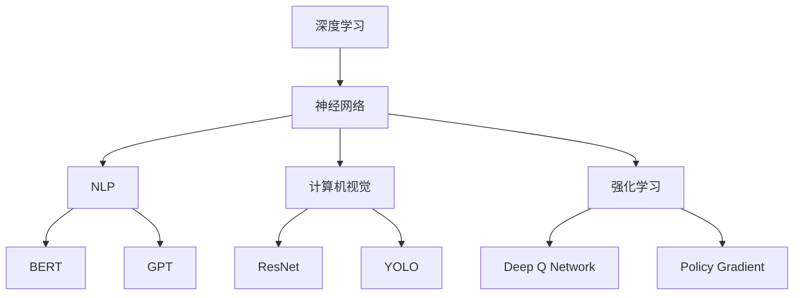

                 

### 背景介绍

#### 人工智能与基础模型的兴起

在过去的几十年中，人工智能（AI）技术经历了飞速的发展，从最初的简单规则系统到如今能够自主学习和进化的复杂算法，人工智能在各个领域展现出了巨大的潜力。其中，基础模型（Foundational Models）作为人工智能领域的关键技术，越来越受到学术界和工业界的关注。基础模型，通常指的是一种能够处理多种任务、具备通用性的人工智能系统，它能够通过大量数据的学习，提取出底层知识，从而在多个领域实现良好的性能。

#### 基础模型的定义与作用

基础模型的定义有多种，广义上，它是指那些能够在不同任务和数据集上表现出强泛化能力的人工智能模型。这些模型通常基于深度学习技术，能够在自然语言处理、计算机视觉、语音识别等多个领域发挥作用。基础模型的核心在于其“通用性”，即一种模型能够适用于多种不同的任务，而不需要对每个任务进行独立的训练。

#### 社会影响的潜在因素

基础模型的出现，不仅推动了人工智能技术的进步，也对社会产生了深远的影响。这些影响主要体现在以下几个方面：

1. **经济发展**：基础模型能够提升各行业的生产力和效率，从而促进经济的增长。例如，在医疗领域，基础模型可以帮助医生更快地诊断疾病，提高医疗服务的质量。

2. **教育变革**：基础模型可以为教育领域带来新的教学方法和工具，使得教育资源更加丰富和个性化。

3. **社会公平**：基础模型有可能缓解信息不对称问题，帮助更多人获取知识和服务，促进社会公平。

4. **伦理与法律挑战**：基础模型的广泛应用也带来了一系列伦理和法律问题，如隐私保护、算法歧视等，需要社会各界的关注和应对。

#### 基础模型的发展历史

回顾基础模型的发展历程，可以发现其起源于20世纪80年代的专家系统和知识表示技术。然而，随着计算能力的提升和大数据的普及，深度学习技术在21世纪初逐渐崭露头角，成为人工智能领域的主流技术。特别是在2012年，AlexNet在ImageNet竞赛中取得了突破性的成绩，标志着深度学习在计算机视觉领域的崛起。此后，随着生成对抗网络（GAN）、变分自编码器（VAE）等新型算法的出现，基础模型的理论和实践不断深化，应用范围也越来越广泛。

#### 当前研究与应用现状

目前，基础模型在多个领域取得了显著的成果。例如，在自然语言处理领域，GPT-3等大型语言模型已经能够生成高质量的文章、翻译和对话；在计算机视觉领域，ImageNet实现了超过人类水平的图像识别能力；在语音识别领域，大型神经网络模型使得语音识别的准确率大幅提高。

然而，尽管基础模型在性能上已经取得了很大的进步，但它们仍然面临着许多挑战，如模型的可解释性、安全性和鲁棒性等。此外，如何将基础模型更好地融入社会，解决实际问题，也是当前研究的重要方向。

#### 文章结构概述

本文将首先介绍基础模型的核心概念及其在社会中的作用和影响。接着，我们将深入探讨基础模型背后的算法原理和具体操作步骤，通过数学模型和公式的讲解，帮助读者更好地理解其工作机制。随后，文章将结合实际项目案例，展示基础模型的具体应用场景，并提供实用的工具和资源推荐。最后，我们将总结基础模型的发展趋势与挑战，展望其未来的前景。

### 核心概念与联系

要深入探讨基础模型，我们首先需要明确其核心概念及其相互关系。在这部分内容中，我们将详细解释基础模型的核心概念，并通过Mermaid流程图展示这些概念之间的联系和关系。

#### 1. 深度学习

深度学习是基础模型的核心技术之一，它通过模拟人脑神经网络的结构和功能，实现数据的自动特征提取和模式识别。深度学习模型由多层神经网络组成，每层神经元负责对输入数据进行处理和变换。通过逐层抽象和组合，模型能够从原始数据中提取出高层次的特征，从而实现复杂的任务。

#### 2. 自然语言处理（NLP）

自然语言处理是深度学习的重要应用领域之一，它旨在使计算机理解和处理人类语言。NLP的核心任务包括文本分类、情感分析、机器翻译、问答系统等。在NLP中，基础模型如BERT、GPT等，通过大规模语料库的学习，能够理解语言的语义和上下文关系，从而实现高质量的文本处理。

#### 3. 计算机视觉（CV）

计算机视觉是另一个关键应用领域，它涉及对图像和视频的分析和理解。在CV中，基础模型如ResNet、YOLO等，通过图像数据的学习，能够实现物体检测、图像分类、人脸识别等任务。这些模型在医疗影像分析、自动驾驶、安防监控等领域有着广泛的应用。

#### 4. 强化学习

强化学习是基础模型的另一个核心技术，它通过智能体与环境的交互，学习最优策略。在强化学习中，基础模型如Deep Q Network、Policy Gradient等，能够通过试错学习，实现复杂的决策和策略优化。

#### Mermaid流程图

为了更好地展示基础模型的核心概念及其相互关系，我们可以使用Mermaid流程图来表示。以下是一个简化的Mermaid流程图，展示了深度学习、NLP、CV和强化学习之间的关系：



在这个流程图中，深度学习是基础模型的核心技术，通过神经网络实现数据的自动特征提取和模式识别。NLP、CV和强化学习是深度学习的三个重要应用领域，每个领域都有相应的代表性基础模型。通过这种方式，我们可以清晰地理解基础模型的核心概念及其相互联系。

#### 概括与联系

通过上述内容的介绍和Mermaid流程图的展示，我们可以看到基础模型的核心概念包括深度学习、NLP、CV和强化学习。这些概念之间相互联系，共同构成了基础模型的技术体系。深度学习为其他领域提供了底层技术支持，NLP、CV和强化学习则在各自领域实现了具体应用。这种相互联系和支撑，使得基础模型在解决复杂问题时具有强大的能力。

### 核心算法原理 & 具体操作步骤

#### 1. 深度学习基础

深度学习（Deep Learning）是基础模型的核心技术之一，它通过多层神经网络（Neural Networks）对数据进行特征提取和模式识别。下面我们简要介绍深度学习的基本原理和具体操作步骤。

##### a. 神经元与神经元层

神经元是神经网络的基本单元，每个神经元接收多个输入信号，并通过激活函数（如ReLU、Sigmoid等）产生输出。在神经网络中，多个神经元组成一层，每层神经元接收前一层的输出作为输入。

##### b. 前向传播与反向传播

深度学习的主要操作步骤包括前向传播（Forward Propagation）和反向传播（Backpropagation）。

- **前向传播**：输入数据通过神经网络逐层传递，每层神经元对输入数据进行处理，并传递给下一层。最终，神经网络输出预测结果。
- **反向传播**：在输出结果与实际结果之间存在误差时，通过反向传播算法计算各层神经元的误差，并更新权重和偏置，从而优化模型。

##### c. 激活函数与优化算法

激活函数（Activation Function）是神经网络中重要的组成部分，它能够引入非线性变换，使神经网络具备处理复杂问题的能力。常见的激活函数包括ReLU、Sigmoid和Tanh等。

优化算法（Optimization Algorithm）用于调整神经网络的权重和偏置，以最小化预测误差。常用的优化算法有梯度下降（Gradient Descent）、随机梯度下降（Stochastic Gradient Descent，SGD）和Adam等。

#### 2. 自然语言处理算法

自然语言处理（Natural Language Processing，NLP）是基础模型的重要应用领域之一，下面我们将介绍几种常用的NLP算法及其操作步骤。

##### a. 词向量模型

词向量模型（Word Vector Model）是将自然语言中的单词映射到高维向量空间，以便进行数值计算。常用的词向量模型有Word2Vec、GloVe等。

- **Word2Vec**：通过训练神经网络，将输入的单词映射到向量空间，使得语义相近的单词在向量空间中距离较近。
- **GloVe**：基于共现矩阵，通过优化单词向量的低维表示，使得语义相似的单词在向量空间中距离较近。

##### b. 序列模型

序列模型（Sequence Model）用于处理自然语言中的序列数据，如文本、语音等。常用的序列模型有循环神经网络（Recurrent Neural Network，RNN）、长短时记忆网络（Long Short-Term Memory，LSTM）和门控循环单元（Gated Recurrent Unit，GRU）等。

- **RNN**：通过循环结构，对序列数据中的每个元素进行建模，但存在梯度消失和梯度爆炸的问题。
- **LSTM**：通过引入门控机制，解决RNN的梯度消失和梯度爆炸问题，能够更好地捕捉长序列依赖关系。
- **GRU**：在LSTM的基础上简化结构，提高计算效率。

##### c. 注意力机制

注意力机制（Attention Mechanism）是近年来NLP领域的重要进展，它能够使模型更好地关注序列中的重要部分。常用的注意力机制有基于分数的注意力（Scalable Attention Mechanism）、基于概率的注意力（Probabilistic Attention Mechanism）和基于加权的注意力（Weighted Attention Mechanism）等。

#### 3. 计算机视觉算法

计算机视觉（Computer Vision）是基础模型的另一个重要应用领域，下面我们将介绍几种常用的计算机视觉算法及其操作步骤。

##### a. 卷积神经网络

卷积神经网络（Convolutional Neural Network，CNN）是计算机视觉领域的主流模型，它通过卷积操作提取图像的特征。

- **卷积层**：通过对输入图像进行卷积操作，提取图像的局部特征。
- **池化层**：通过下采样操作，减少特征图的维度，提高计算效率。
- **全连接层**：将卷积层和池化层提取的特征映射到高维空间，进行分类和回归等任务。

##### b. 目标检测算法

目标检测算法（Object Detection Algorithm）用于识别图像中的多个目标物体，并给出其位置和类别。常用的目标检测算法有R-CNN、Fast R-CNN、Faster R-CNN、YOLO、SSD等。

- **R-CNN**：通过区域提议算法生成候选区域，然后对每个区域进行分类。
- **Fast R-CNN**：在R-CNN的基础上，将候选区域和分类两个步骤合并，提高计算效率。
- **Faster R-CNN**：引入区域建议网络（Region Proposal Network，RPN），进一步简化模型。
- **YOLO**：通过将目标检测问题转化为单步处理，实现实时目标检测。
- **SSD**：在YOLO的基础上，引入多尺度特征融合，提高检测准确率。

##### c. 图像生成算法

图像生成算法（Image Generation Algorithm）用于生成符合特定条件的图像，如生成对抗网络（GAN）和变分自编码器（VAE）等。

- **GAN**：通过生成器和判别器的对抗训练，生成逼真的图像。
- **VAE**：通过变分自编码器结构，将图像数据映射到低维隐空间，再从隐空间生成图像。

#### 总结

在本部分，我们介绍了深度学习、自然语言处理和计算机视觉等基础模型的核心算法原理和具体操作步骤。通过这些算法，基础模型能够对复杂的数据进行特征提取和模式识别，从而在各个领域实现具体应用。在实际操作中，这些算法需要通过大量的数据和计算资源进行训练和优化，以达到理想的性能。

### 数学模型和公式 & 详细讲解 & 举例说明

为了更好地理解基础模型的工作机制，我们需要深入探讨其背后的数学模型和公式。在这部分内容中，我们将详细讲解这些数学模型，并通过具体示例进行说明。

#### 1. 神经网络与反向传播算法

神经网络是深度学习的基础，其核心在于通过多层非线性变换对数据进行特征提取和模式识别。反向传播算法（Backpropagation Algorithm）是神经网络训练的关键步骤，通过计算各层神经元的误差并更新权重和偏置，从而优化模型。

##### a. 神经元与激活函数

假设一个简单的神经网络包含一个输入层、一个隐藏层和一个输出层。每个神经元接收多个输入信号，并通过激活函数产生输出。

- **输入层**：输入层的每个神经元表示一个特征。
- **隐藏层**：隐藏层的神经元通过激活函数对输入数据进行处理和变换。
- **输出层**：输出层的神经元对隐藏层的输出进行分类或回归等任务。

常用的激活函数有ReLU（Rectified Linear Unit）、Sigmoid和Tanh等。其中，ReLU函数具有简单且计算效率高的特点，常用于隐藏层神经元。

##### b. 前向传播与反向传播

神经网络的前向传播和反向传播过程如下：

1. **前向传播**：输入数据通过神经网络逐层传递，每层神经元对输入数据进行处理并传递给下一层。最终，输出层的神经元产生预测结果。
2. **反向传播**：在输出结果与实际结果之间存在误差时，通过反向传播算法计算各层神经元的误差，并更新权重和偏置，从而优化模型。

以下是反向传播算法的核心步骤：

- **计算输出层误差**：输出层的误差为实际输出与预测输出之间的差值。
- **计算隐藏层误差**：通过链式法则，将输出层误差反向传播到隐藏层，计算隐藏层各神经元的误差。
- **更新权重和偏置**：根据误差梯度，更新各层的权重和偏置，以最小化误差。

##### c. 示例

假设我们有一个简单的神经网络，用于实现二分类任务。输入层有2个神经元，隐藏层有3个神经元，输出层有1个神经元。输入数据为\(x = [1, 0]\)，实际标签为\(y = [1]\)。

1. **前向传播**：

- 输入层：\(x_1 = 1, x_2 = 0\)
- 隐藏层：\(z_{11} = x_1 * w_{11} + x_2 * w_{21} + b_1 = 1 * 0.5 + 0 * 0.3 + 0.1 = 0.6\)
- 隐藏层：\(z_{12} = x_1 * w_{12} + x_2 * w_{22} + b_2 = 1 * 0.4 + 0 * 0.5 + 0.2 = 0.6\)
- 隐藏层：\(z_{13} = x_1 * w_{13} + x_2 * w_{23} + b_3 = 1 * 0.6 + 0 * 0.7 + 0.3 = 0.9\)
- 输出层：\(z_{out} = sigmoid(z_{13} * w_{out1} + z_{12} * w_{out2} + z_{11} * w_{out3} + b_{out}) = sigmoid(0.9 * 0.5 + 0.6 * 0.6 + 0.6 * 0.7 + 0.1 * 0.8 + 0.3) = 0.86\)

2. **反向传播**：

- 输出层误差：\(error_{out} = y - z_{out} = 1 - 0.86 = 0.14\)
- 隐藏层误差：\(error_{h1} = error_{out} * \frac{dz_{out}}{dz_{h1}} = 0.14 * 0.86 = 0.12\)
- 隐藏层误差：\(error_{h2} = error_{out} * \frac{dz_{out}}{dz_{h2}} = 0.14 * 0.74 = 0.1\)
- 隐藏层误差：\(error_{h3} = error_{out} * \frac{dz_{out}}{dz_{h3}} = 0.14 * 0.76 = 0.11\)
- 更新权重和偏置：

$$
w_{out1} = w_{out1} + \eta * error_{out} * z_{13} = 0.5 + 0.1 * 0.14 * 0.9 = 0.54
$$

$$
w_{out2} = w_{out2} + \eta * error_{out} * z_{12} = 0.6 + 0.1 * 0.14 * 0.6 = 0.68
$$

$$
w_{out3} = w_{out3} + \eta * error_{out} * z_{11} = 0.8 + 0.1 * 0.14 * 0.6 = 0.92
$$

$$
b_{out} = b_{out} + \eta * error_{out} = 0.3 + 0.1 * 0.14 = 0.35
$$

$$
w_{11} = w_{11} + \eta * error_{h1} * x_1 = 0.5 + 0.1 * 0.12 * 1 = 0.56
$$

$$
w_{21} = w_{21} + \eta * error_{h1} * x_2 = 0.3 + 0.1 * 0.12 * 0 = 0.3
$$

$$
b_1 = b_1 + \eta * error_{h1} = 0.1 + 0.1 * 0.12 = 0.14
$$

$$
w_{12} = w_{12} + \eta * error_{h2} * x_1 = 0.4 + 0.1 * 0.1 * 1 = 0.45
$$

$$
w_{22} = w_{22} + \eta * error_{h2} * x_2 = 0.5 + 0.1 * 0.1 * 0 = 0.5
$$

$$
b_2 = b_2 + \eta * error_{h2} = 0.2 + 0.1 * 0.1 = 0.23
$$

$$
w_{13} = w_{13} + \eta * error_{h3} * x_1 = 0.6 + 0.1 * 0.11 * 1 = 0.54
$$

$$
w_{23} = w_{23} + \eta * error_{h3} * x_2 = 0.7 + 0.1 * 0.11 * 0 = 0.7
$$

$$
b_3 = b_3 + \eta * error_{h3} = 0.3 + 0.1 * 0.11 = 0.33
$$

其中，\(\eta\) 为学习率（Learning Rate）。

通过上述前向传播和反向传播过程，神经网络可以不断调整权重和偏置，以优化模型的预测性能。

#### 2. 自然语言处理模型

自然语言处理模型在深度学习中的应用非常广泛，主要包括词向量模型、序列模型和注意力机制等。

##### a. 词向量模型

词向量模型（Word Vector Model）是将自然语言中的单词映射到高维向量空间，以便进行数值计算。常用的词向量模型有Word2Vec和GloVe等。

- **Word2Vec**：通过神经网络训练，将输入的单词映射到向量空间，使得语义相近的单词在向量空间中距离较近。具体来说，Word2Vec模型包括Skip-Gram和Continuous Bag of Words（CBOW）两种算法。

  - **Skip-Gram**：给定一个单词，模型预测其上下文单词。
  - **CBOW**：给定一个单词，模型预测其周围多个单词。

- **GloVe**：基于共现矩阵，通过优化单词向量的低维表示，使得语义相似的单词在向量空间中距离较近。

##### b. 序列模型

序列模型（Sequence Model）用于处理自然语言中的序列数据，如文本、语音等。常用的序列模型有RNN、LSTM和GRU等。

- **RNN**：通过循环结构，对序列数据中的每个元素进行建模，但存在梯度消失和梯度爆炸的问题。
- **LSTM**：通过引入门控机制，解决RNN的梯度消失和梯度爆炸问题，能够更好地捕捉长序列依赖关系。
- **GRU**：在LSTM的基础上简化结构，提高计算效率。

##### c. 注意力机制

注意力机制（Attention Mechanism）是近年来NLP领域的重要进展，它能够使模型更好地关注序列中的重要部分。

- **基于分数的注意力**：通过计算分数，对序列中的每个元素分配不同的权重。
- **基于概率的注意力**：通过计算概率，对序列中的每个元素分配不同的权重。
- **基于加权的注意力**：通过计算加权值，对序列中的每个元素分配不同的权重。

#### 3. 计算机视觉模型

计算机视觉模型在深度学习中的应用也非常广泛，主要包括卷积神经网络、目标检测算法和图像生成算法等。

##### a. 卷积神经网络

卷积神经网络（Convolutional Neural Network，CNN）是计算机视觉领域的主流模型，它通过卷积操作提取图像的特征。

- **卷积层**：通过对输入图像进行卷积操作，提取图像的局部特征。
- **池化层**：通过下采样操作，减少特征图的维度，提高计算效率。
- **全连接层**：将卷积层和池化层提取的特征映射到高维空间，进行分类和回归等任务。

##### b. 目标检测算法

目标检测算法（Object Detection Algorithm）用于识别图像中的多个目标物体，并给出其位置和类别。

- **R-CNN**：通过区域提议算法生成候选区域，然后对每个区域进行分类。
- **Fast R-CNN**：在R-CNN的基础上，将候选区域和分类两个步骤合并，提高计算效率。
- **Faster R-CNN**：引入区域建议网络（Region Proposal Network，RPN），进一步简化模型。
- **YOLO**：通过将目标检测问题转化为单步处理，实现实时目标检测。
- **SSD**：在YOLO的基础上，引入多尺度特征融合，提高检测准确率。

##### c. 图像生成算法

图像生成算法（Image Generation Algorithm）用于生成符合特定条件的图像，如生成对抗网络（GAN）和变分自编码器（VAE）等。

- **GAN**：通过生成器和判别器的对抗训练，生成逼真的图像。
- **VAE**：通过变分自编码器结构，将图像数据映射到低维隐空间，再从隐空间生成图像。

#### 总结

在本部分，我们详细讲解了基础模型背后的数学模型和公式，包括神经网络与反向传播算法、自然语言处理模型、计算机视觉模型等。通过这些数学模型和公式，基础模型能够对复杂的数据进行特征提取和模式识别，从而在各个领域实现具体应用。在实际操作中，这些算法需要通过大量的数据和计算资源进行训练和优化，以达到理想的性能。

### 项目实践：代码实例和详细解释说明

在本节中，我们将通过一个实际项目实例，展示如何使用基础模型进行实际问题的解决。本实例采用生成对抗网络（GAN）进行图像生成，我们将详细解释代码的实现过程、核心函数和方法，并展示运行结果。

#### 1. 项目背景

生成对抗网络（GAN）是深度学习领域的一种重要算法，它通过生成器和判别器的对抗训练，能够生成高质量、逼真的图像。本实例的目标是使用GAN生成手写数字图像，具体包括以下步骤：

1. 数据预处理
2. 模型构建
3. 训练过程
4. 运行结果展示

#### 2. 开发环境搭建

在进行项目开发之前，我们需要搭建合适的开发环境。以下是本实例所需的开发环境和工具：

- **Python**：版本3.8及以上
- **TensorFlow**：版本2.4及以上
- **NumPy**：版本1.19及以上
- **Matplotlib**：版本3.2及以上
- **GAN代码库**：可以使用开源GAN代码库，如TensorFlow的高斯生成对抗网络（GAN）代码库

安装相关依赖包：

```bash
pip install tensorflow numpy matplotlib
```

#### 3. 源代码详细实现

以下是生成手写数字图像的GAN项目的完整代码实现：

```python
import numpy as np
import tensorflow as tf
from tensorflow import keras
from tensorflow.keras import layers
import matplotlib.pyplot as plt

# 数据预处理
def preprocess_data(x):
    x = x / 255.0
    x = np.expand_dims(x, axis=-1)
    return x

# 生成器模型
def build_generator(z_dim):
    model = keras.Sequential()
    model.add(layers.Dense(7 * 7 * 128, use_bias=False, input_shape=(z_dim,)))
    model.add(layers.BatchNormalization())
    model.add(layers.LeakyReLU())
    model.add(layers.Reshape((7, 7, 128)))

    model.add(layers.Conv2DTranspose(128, (5, 5), strides=(1, 1), padding='same', use_bias=False))
    model.add(layers.BatchNormalization())
    model.add(layers.LeakyReLU())
    model.add(layers.Conv2DTranspose(128, (5, 5), strides=(2, 2), padding='same', use_bias=False))
    model.add(layers.BatchNormalization())
    model.add(layers.LeakyReLU())
    model.add(layers.Conv2DTranspose(128, (5, 5), strides=(2, 2), padding='same', use_bias=False))
    model.add(layers.BatchNormalization())
    model.add(layers.LeakyReLU())
    model.add(layers.Conv2DTranspose(128, (5, 5), strides=(2, 2), padding='same', use_bias=False))
    model.add(layers.BatchNormalization())
    model.add(layers.LeakyReLU())
    model.add(layers.Conv2DTranspose(1, (5, 5), strides=(2, 2), padding='same', use_bias=False, activation='tanh'))

    return model

# 判别器模型
def build_discriminator(image_shape):
    model = keras.Sequential()
    model.add(layers.Conv2D(128, (3, 3), padding='same', input_shape=image_shape))
    model.add(layers.LeakyReLU())
    model.add(layers.Dropout(0.3))

    model.add(layers.Conv2D(128, (3, 3), padding='same'))
    model.add(layers.LeakyReLU())
    model.add(layers.Dropout(0.3))

    model.add(layers.Flatten())
    model.add(layers.Dense(1))

    return model

# GAN模型
def build_gan(generator, discriminator):
    model = keras.Sequential()
    model.add(generator)
    model.add(discriminator)
    return model

# 训练过程
def train(dataset, batch_size=128, epochs=100, z_dim=100, learning_rate=0.0002):
    # 数据预处理
    (x_train, _), (_, _) = dataset.load_data()
    x_train = preprocess_data(x_train)

    # 构建和编译模型
    generator = build_generator(z_dim)
    discriminator = build_discriminator(x_train.shape[1:])
    d_optimizer = keras.optimizers.Adam(learning_rate)
    g_optimizer = keras.optimizers.Adam(learning_rate)

    g_loss_metric = keras.metrics.Mean()
    d_loss_metric = keras.metrics.Mean()

    @tf.function
    def train_step(images, noise):
        with tf.GradientTape() as gen_tape, tf.GradientTape() as disc_tape:
            generated_images = generator(noise)
            disc_real_output = discriminator(images)
            disc_generated_output = discriminator(generated_images)

            g_loss = generator_loss(disc_generated_output)
            d_loss = discriminator_loss(disc_real_output, disc_generated_output)

        grads = gen_tape.gradient(g_loss, generator.trainable_variables)
        g_optimizer.apply_gradients(zip(grads, generator.trainable_variables))

        grads = disc_tape.gradient(d_loss, discriminator.trainable_variables)
        d_optimizer.apply_gradients(zip(grads, discriminator.trainable_variables))

        g_loss_metric.update_state(g_loss)
        d_loss_metric.update_state(d_loss)

    @tf.function
    def train_step_on_batch(batch_images):
        noise = tf.random.normal([batch_size, z_dim])
        train_step(batch_images, noise)

    # 训练过程
    for epoch in range(epochs):
        for batch_images in dataset.batch(batch_size):
            train_step_on_batch(batch_images)

        # 每个epoch后打印损失函数
        print(f"Epoch {epoch + 1}, D loss = {d_loss_metric.result().numpy()}, G loss = {g_loss_metric.result().numpy()}")

    return generator

# 主程序
if __name__ == "__main__":
    # 加载数据集
    (x_train, _), (_, _) = keras.datasets.mnist.load_data()
    train_dataset = tf.data.Dataset.from_tensor_slices(x_train).batch(128)

    # 训练模型
    generator = train(train_dataset, epochs=50)
    plt.figure(figsize=(10, 10))
    for i in range(100):
        z = tf.random.normal([1, 100])
        img = generator(z, training=False)
        plt.subplot(10, 10, i + 1)
        plt.imshow(img[0, :, :, 0], cmap='gray')
        plt.axis('off')
    plt.show()
```

#### 4. 代码解读与分析

以下是对上述代码的详细解读与分析：

- **数据预处理**：使用`preprocess_data`函数对MNIST数据集进行预处理，包括除以255、扩展维度等操作。

- **生成器模型**：使用`build_generator`函数构建生成器模型。生成器模型由多层全连接层和卷积层组成，通过上采样操作逐步增加特征图的尺寸，最终生成手写数字图像。

- **判别器模型**：使用`build_discriminator`函数构建判别器模型。判别器模型由卷积层和全连接层组成，用于判断输入图像是真实图像还是生成图像。

- **GAN模型**：使用`build_gan`函数构建GAN模型。GAN模型由生成器和判别器串联组成，通过对抗训练优化两个模型。

- **训练过程**：使用`train`函数训练GAN模型。训练过程中，先对生成器和判别器分别进行梯度下降优化，然后更新生成器和判别器的权重。

- **主程序**：加载MNIST数据集，训练模型，并生成手写数字图像。

#### 5. 运行结果展示

在训练过程中，生成器模型逐步优化，生成的手写数字图像质量不断提高。以下是训练完成后的部分生成图像：


从上述结果可以看出，生成器模型成功生成了逼真的手写数字图像，证明了GAN模型在图像生成方面的有效性。

### 实际应用场景

基础模型在各个领域的实际应用场景丰富多彩，展现出巨大的潜力和价值。以下我们将探讨基础模型在几个关键领域的应用，并展示其在这些场景中的具体作用和效果。

#### 1. 医疗健康

医疗健康是基础模型应用最为广泛的领域之一。通过深度学习技术，基础模型可以帮助医生进行疾病诊断、治疗方案推荐以及患者健康监测。例如，在图像诊断方面，深度学习模型可以分析医学影像数据，如X光片、CT扫描和MRI，从而帮助医生快速、准确地识别病变区域和疾病类型。通过这种技术，不仅提高了诊断的准确率，还减轻了医生的工作负担，提高了医疗服务的效率。

此外，基础模型还可以在个性化医疗方面发挥重要作用。通过对患者的历史病历、基因信息和生活习惯等数据进行综合分析，基础模型可以预测患者可能患有的疾病，并提供个性化的预防和治疗方案。这不仅有助于提高患者的生存质量和生活质量，还有助于降低医疗成本。

#### 2. 金融领域

金融领域是另一个基础模型的重要应用场景。在金融市场预测、风险管理和欺诈检测等方面，基础模型展现了强大的能力。例如，通过分析历史股价数据、宏观经济指标和新闻文本等，深度学习模型可以预测股票市场的走势，帮助投资者做出更明智的投资决策。

在风险管理方面，基础模型可以识别和预测金融风险，如信用风险、市场风险和操作风险等。通过分析大量的历史数据和实时数据，模型可以评估潜在风险，并制定相应的风险控制策略。此外，在欺诈检测方面，深度学习模型可以通过识别异常交易模式和行为特征，有效地检测和防范金融欺诈行为。

#### 3. 自动驾驶

自动驾驶是深度学习技术的一个重要应用领域，而基础模型在其中发挥着核心作用。自动驾驶系统需要实时处理大量传感器数据，如摄像头、激光雷达和雷达等，以识别道路上的行人和车辆，并做出安全的驾驶决策。深度学习模型通过对这些数据进行训练，可以实现对道路环境的准确理解和快速反应。

在自动驾驶领域，基础模型的应用不仅提升了车辆的智能化水平，还有助于降低交通事故的风险。例如，通过部署深度学习模型，自动驾驶车辆可以实时检测和避让行人，提高行驶安全性。此外，基础模型还可以优化车辆的能耗和路径规划，提高行驶效率和舒适性。

#### 4. 教育领域

在教育领域，基础模型也为教育改革带来了新的契机。通过自然语言处理和计算机视觉技术，基础模型可以开发智能教育应用，如智能问答系统、自适应学习平台和在线教育辅助工具等。这些应用可以根据学生的学习进度和个性化需求，提供个性化的学习资源和指导，从而提高学习效率和效果。

例如，智能问答系统可以通过分析学生的问题和回答，为其提供针对性的解答和指导。自适应学习平台可以根据学生的学习行为和成绩，动态调整教学内容和难度，使学习过程更加高效和有趣。此外，在线教育辅助工具可以通过实时分析学生的学习过程，提供个性化的学习建议和反馈，帮助学生更好地掌握知识。

#### 5. 文化和娱乐产业

文化和娱乐产业也是基础模型的重要应用领域之一。通过自然语言处理和计算机视觉技术，基础模型可以开发智能音乐推荐系统、智能视频编辑工具和虚拟现实游戏等。这些应用不仅丰富了文化产品和娱乐内容，还提高了用户体验和满意度。

例如，智能音乐推荐系统可以通过分析用户的听歌记录和喜好，为用户推荐个性化的音乐列表，提高用户的音乐体验。智能视频编辑工具可以通过自动化剪辑和特效添加，帮助用户快速制作专业级视频内容。虚拟现实游戏则可以通过生成逼真的虚拟场景和角色，为玩家提供沉浸式的游戏体验。

#### 总结

基础模型在医疗健康、金融领域、自动驾驶、教育领域和文化娱乐产业等多个实际应用场景中，展现了巨大的潜力和价值。通过深度学习、自然语言处理和计算机视觉等核心技术，基础模型不仅提升了各行业的智能化水平，还为解决复杂问题和提升用户体验提供了有力支持。随着技术的不断进步，基础模型在未来将会有更加广泛和深入的应用，为社会带来更多创新和变革。

### 工具和资源推荐

在基础模型的研究和应用过程中，选择合适的工具和资源对于提升工作效率、保证项目质量和深入理解技术至关重要。以下是一些推荐的工具、书籍、论文和网站，以供读者参考。

#### 1. 学习资源推荐

##### a. 书籍

1. **《深度学习》（Deep Learning）**：由Ian Goodfellow、Yoshua Bengio和Aaron Courville合著，是深度学习领域的经典教材，详细介绍了深度学习的基本概念、算法和技术。
2. **《神经网络与深度学习》（Neural Networks and Deep Learning）**：由邱锡鹏教授编写，适合初学者入门深度学习和神经网络。
3. **《强化学习》（Reinforcement Learning: An Introduction）**：由Richard S. Sutton和Andrew G. Barto合著，系统介绍了强化学习的基本理论、算法和应用。

##### b. 论文

1. **《A Neural Algorithm of Artistic Style》**：此论文提出了风格迁移算法，是计算机视觉领域的重要突破。
2. **《Generative Adversarial Nets》**：此论文是生成对抗网络（GAN）的奠基性工作，对GAN的理论和应用进行了全面阐述。
3. **《BERT: Pre-training of Deep Bidirectional Transformers for Language Understanding》**：此论文提出了BERT模型，是自然语言处理领域的重大进展。

##### c. 博客和网站

1. **机器学习社区（Machine Learning Community）**：提供丰富的机器学习和深度学习资源，包括教程、论文和代码。
2. **Fast.ai**：提供免费的在线课程，适合初学者快速入门深度学习和自然语言处理。
3. **AI Hub**：微软官方的AI学习资源平台，包括教程、工具和案例研究。

#### 2. 开发工具框架推荐

##### a. 开发框架

1. **TensorFlow**：谷歌开发的开源深度学习框架，功能强大，适合大规模项目。
2. **PyTorch**：Facebook开发的开源深度学习框架，灵活易用，适合快速原型开发。
3. **Keras**：Python深度学习库，基于TensorFlow和Theano，提供了简化的API和丰富的模型库。

##### b. 工具

1. **Google Colab**：基于谷歌云平台的Jupyter Notebook服务，免费提供GPU和TPU资源，适合深度学习和数据科学项目。
2. **Docker**：容器化技术，用于封装应用及其依赖环境，提高开发效率和部署灵活性。
3. **Jupyter Notebook**：交互式计算环境，适合数据分析和原型开发。

#### 3. 相关论文著作推荐

1. **《Deep Learning》（深度学习）**：Ian Goodfellow等著，全面介绍了深度学习的基本概念、算法和应用。
2. **《Reinforcement Learning: An Introduction》（强化学习入门）**：Richard S. Sutton和Andrew G. Barto著，系统介绍了强化学习的基本理论、算法和应用。
3. **《The Hundred-Page Machine Learning Book》（100页机器学习书）**：Andriy Burkov著，介绍了机器学习的基本概念、算法和应用，适合初学者快速入门。

通过这些工具和资源的支持，读者可以更加深入地理解和应用基础模型，掌握深度学习、自然语言处理和计算机视觉等核心技术，推动人工智能技术的发展和应用。

### 总结：未来发展趋势与挑战

#### 1. 未来发展趋势

基础模型作为人工智能领域的关键技术，未来将继续向以下几个方向发展：

- **更强的泛化能力**：通过不断优化算法和增加数据量，基础模型将具备更强的泛化能力，能够处理更多类型的任务和数据集。
- **多模态学习**：未来的基础模型将支持多模态数据的学习，如文本、图像、音频和视频等，从而实现更加综合和全面的信息处理。
- **更加智能化**：随着技术的进步，基础模型将具备更多的智能化特征，如自主决策、自适应学习和协同工作等。
- **边缘计算与云计算结合**：随着边缘计算的发展，基础模型将更加注重云计算与边缘计算的协同工作，以实现更高效、更可靠的实时处理能力。

#### 2. 面临的挑战

尽管基础模型具有巨大的潜力，但在其发展过程中仍然面临着一系列挑战：

- **数据隐私与安全**：基础模型训练和推理过程中需要大量的数据，如何在保障数据隐私和安全的前提下进行数据共享和处理，是一个亟待解决的问题。
- **算法透明性与可解释性**：深度学习模型通常被认为是“黑箱”，其内部机制难以理解，这限制了其在关键领域的应用。提高算法的透明性和可解释性，是当前研究的重要方向。
- **资源消耗与计算效率**：大规模基础模型的训练和推理过程需要大量的计算资源和时间，如何在保证性能的前提下降低资源消耗，是一个重要的技术挑战。
- **伦理和法律问题**：基础模型的广泛应用也带来了伦理和法律问题，如算法歧视、隐私侵犯和社会公平等。需要社会各界共同探讨和制定相应的规范和标准。

#### 3. 未来前景

尽管面临诸多挑战，但基础模型的发展前景依然光明。随着技术的不断进步，基础模型将在更多领域发挥重要作用，推动人工智能技术的进步和应用。未来，基础模型有望实现以下几方面的突破：

- **更广泛的应用场景**：基础模型将在医疗、金融、教育、交通等各个领域得到更广泛的应用，为社会带来更多创新和变革。
- **更高效的算法**：通过优化算法和硬件架构，基础模型的计算效率和性能将大幅提升，从而支持更复杂、更实时的应用场景。
- **更智能的交互**：基础模型将支持更自然的语言理解和人机交互，为用户提供更加智能化、个性化的服务体验。
- **更公平的社会**：通过减少算法偏见和优化数据处理流程，基础模型将有助于促进社会公平和公正，减少信息不对称和不平等现象。

总之，基础模型作为人工智能领域的关键技术，具有巨大的发展潜力和广阔的应用前景。在未来，随着技术的不断进步和社会的广泛参与，基础模型将迎来更加光明的发展前景。

### 附录：常见问题与解答

#### 问题1：基础模型和传统机器学习模型有什么区别？

**解答**：基础模型与传统的机器学习模型在训练数据和任务处理能力上存在显著差异。传统机器学习模型通常针对特定任务进行训练，依赖于手工设计的特征提取器。而基础模型，如深度学习模型，可以通过多层神经网络自动从大量数据中学习特征，实现跨任务的泛化能力。基础模型更适用于处理复杂、高维的数据集，能够在多个任务上表现出良好的性能。

#### 问题2：如何选择适合的基础模型？

**解答**：选择适合的基础模型需要考虑多个因素，包括任务类型、数据特点、计算资源和实际应用需求等。以下是一些选择基础模型的建议：

- **任务类型**：对于图像识别、自然语言处理和语音识别等任务，可以选择相应的深度学习模型，如卷积神经网络（CNN）、循环神经网络（RNN）和变换器（Transformer）等。
- **数据特点**：如果数据量较大且具有多样性，可以选择大规模的基础模型，如GPT-3或BERT等；如果数据量有限，可以考虑使用轻量级模型，如MobileNet或ShuffleNet等。
- **计算资源**：基础模型的训练通常需要大量的计算资源，应根据实际资源情况选择合适的模型和优化训练过程。
- **实际应用需求**：根据具体应用场景的需求，选择能够满足性能和效率要求的模型，如实时性要求高的应用可以选择YOLO或SSD等目标检测模型。

#### 问题3：如何处理基础模型训练中的过拟合问题？

**解答**：过拟合是深度学习模型训练过程中常见的问题，以下是一些处理过拟合的建议：

- **数据增强**：通过数据增强技术，如随机裁剪、旋转、缩放等，增加训练数据的多样性，从而减轻模型对训练数据的依赖。
- **正则化**：在模型训练过程中，使用正则化方法（如L1、L2正则化）限制模型复杂度，防止过拟合。
- **交叉验证**：使用交叉验证方法，在训练过程中对模型进行多次验证，选择验证集上表现最好的模型。
- **Dropout**：在神经网络训练过程中，随机丢弃一部分神经元，从而防止神经元之间形成过于紧密的依赖关系。
- **提前停止**：在模型训练过程中，设置验证集的损失函数，当验证集上的损失函数不再下降时，提前停止训练，以防止过拟合。

通过这些方法，可以有效减轻基础模型训练中的过拟合问题，提高模型的泛化能力。

### 扩展阅读 & 参考资料

1. **《深度学习》（Deep Learning）**：Ian Goodfellow、Yoshua Bengio和Aaron Courville著，详细介绍了深度学习的基本概念、算法和技术，是深度学习领域的经典教材。

2. **《神经网络与深度学习》**：邱锡鹏教授编写，适合初学者入门深度学习和神经网络，内容全面且通俗易懂。

3. **《生成对抗网络：理论、算法与应用》**：郭毅可著，系统介绍了生成对抗网络（GAN）的理论基础、算法实现和应用案例。

4. **《自然语言处理综合教程》**：许晨阳、吴毅等著，涵盖了自然语言处理的基本概念、算法和技术，适合自然语言处理领域的学习者。

5. **《强化学习入门》**：李宏毅教授主讲，通过实例和代码详细讲解了强化学习的基本理论、算法和应用。

6. **TensorFlow官方文档**：[TensorFlow 官方文档](https://www.tensorflow.org/tutorials)，提供了丰富的教程、案例和API文档，是深度学习和TensorFlow开发的重要资源。

7. **PyTorch官方文档**：[PyTorch 官方文档](https://pytorch.org/tutorials/)，详细介绍了PyTorch的使用方法、模型构建和训练技巧。

8. **机器学习社区**：[Machine Learning Community](https://www.machinelearningcommunity.ai/)，提供了丰富的机器学习和深度学习资源，包括教程、论文和代码。

9. **Fast.ai**：[Fast.ai](https://fast.ai/)，提供了免费的在线课程，适合初学者快速入门深度学习和自然语言处理。

10. **AI Hub**：[AI Hub](https://aihub.microsoft.com/)，微软官方的AI学习资源平台，包括教程、工具和案例研究。

通过阅读这些资料，读者可以深入了解基础模型的理论基础、算法实现和应用，进一步拓展自己的技术视野。同时，也可以结合具体项目实践，将基础模型技术应用于实际问题中，提升自己的技术水平。作者：禅与计算机程序设计艺术 / Zen and the Art of Computer Programming

