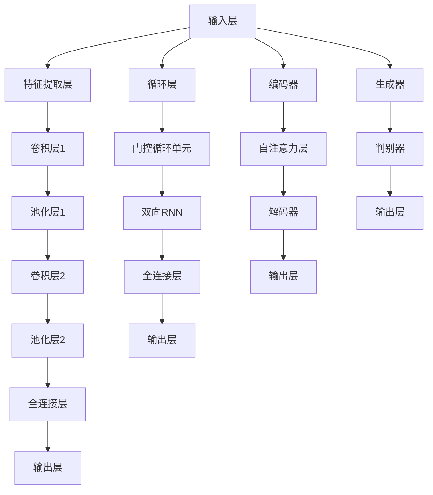
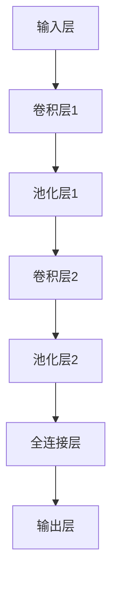
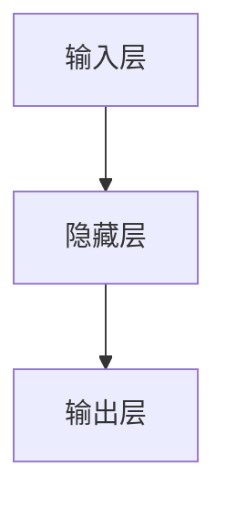
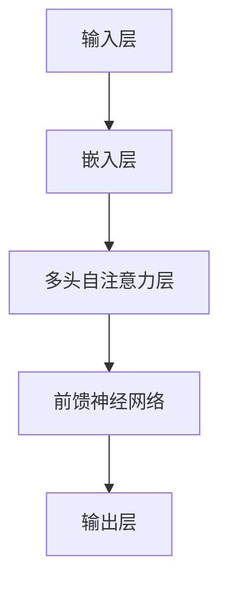

                 

### 文章标题

基础模型的架构与训练目标

> 关键词：基础模型、架构设计、训练目标、算法原理、数学模型、应用场景、实践解析

> 摘要：本文旨在深入探讨基础模型的架构设计与训练目标，通过解析核心概念、算法原理和数学模型，结合实际项目实践，全面阐述基础模型在计算机科学中的重要性及其未来发展。

### 1. 背景介绍

在当今飞速发展的计算机科学领域，基础模型作为一种重要的工具，已经广泛应用于各类应用场景中，如自然语言处理（NLP）、计算机视觉（CV）、推荐系统等。基础模型通常指的是一种具有通用性的模型架构，其设计理念是通过对大量数据进行训练，使其具备对各种任务的处理能力。随着深度学习技术的不断进步，基础模型在性能和效率上取得了显著提升，成为现代人工智能领域的重要基石。

本文将围绕基础模型的架构设计与训练目标展开讨论。首先，我们将介绍基础模型的基本概念和核心架构，解析其在深度学习中的关键作用。接着，我们将深入探讨基础模型训练过程中的算法原理和数学模型，通过具体的实例来阐述这些原理和模型的应用。最后，我们将结合实际项目实践，展示基础模型在计算机视觉和自然语言处理等领域的应用案例，并分析其面临的挑战和未来发展趋势。

通过本文的阅读，读者将能够全面了解基础模型的架构设计与训练目标，掌握核心算法原理和数学模型，并能够将其应用到实际项目中，为后续研究和开发提供理论支持和实践经验。

### 2. 核心概念与联系

#### 2.1 基础模型的定义

基础模型（Fundamental Model）是深度学习领域中的一个核心概念，它通常指的是一种具备通用性的模型架构，可以通过少量的调整来适应多种不同的任务。这类模型的设计目的是最大化地利用数据中的共性特征，从而在多种任务上表现出优秀的性能。

基础模型通常具有以下特点：

1. **模块化设计**：基础模型由多个可复用的模块组成，每个模块负责处理特定的任务或特征。
2. **参数共享**：不同任务之间共享参数，以减少模型训练所需的计算资源和时间。
3. **泛化能力**：通过大量数据的训练，基础模型可以泛化到新的任务和数据集上。
4. **高效性**：基础模型设计考虑了计算效率和内存占用，使其在实际应用中具备良好的性能。

#### 2.2 基础模型的架构

基础模型的架构设计是其能否实现高效训练和泛化能力的关键。以下是一些常见的基础模型架构：

1. **卷积神经网络（CNN）**：卷积神经网络是一种用于图像识别和处理的基础模型，其核心思想是使用卷积层提取图像的特征。CNN通过多层卷积和池化操作，逐步提取图像的抽象特征，从而实现对图像的准确分类。

2. **循环神经网络（RNN）**：循环神经网络是一种用于序列数据处理的基础模型，其特点是可以记住之前的信息，适用于自然语言处理、语音识别等任务。RNN通过在序列中引入循环结构，使得模型能够处理变长的序列数据。

3. **变换器模型（Transformer）**：变换器模型是近年来在自然语言处理领域取得突破性进展的基础模型。与传统的RNN模型不同，Transformer模型采用自注意力机制，通过全局计算序列中每个元素之间的关系，从而实现更高效的特征提取。

4. **生成对抗网络（GAN）**：生成对抗网络是一种用于生成数据的基础模型，由生成器和判别器两部分组成。生成器负责生成数据，判别器负责区分生成数据和真实数据。通过两部分的对抗训练，生成器逐渐生成更加真实的数据。

#### 2.3 基础模型与深度学习的联系

深度学习是基础模型实现的基石，其核心思想是通过多层次的神经网络结构，自动提取数据中的特征表示。基础模型作为深度学习的一种应用形式，具有以下几个与深度学习的紧密联系：

1. **多层次特征提取**：基础模型通过多层次的神经网络结构，逐步提取数据中的抽象特征，从而实现高层次的语义理解。
2. **端到端训练**：基础模型支持端到端的训练方式，将输入数据直接映射到输出结果，无需进行繁琐的特征工程。
3. **大规模数据处理**：基础模型设计考虑了大规模数据处理的需求，可以在有限的计算资源和时间下，高效地训练和推理。
4. **迁移学习**：基础模型通过在多个任务上共享参数，实现了迁移学习的能力，可以在新任务上快速获得良好的性能。

通过以上对基础模型核心概念与联系的介绍，读者可以初步了解基础模型在深度学习中的重要性及其架构特点。接下来，我们将深入探讨基础模型训练过程中的算法原理和数学模型，进一步揭示其内在的机制和优势。

#### 2.4 Mermaid 流程图

以下是一个描述基础模型架构的 Mermaid 流程图，展示了各个核心组件及其相互关系：



通过这个流程图，我们可以直观地看到不同类型的基础模型如何通过层次化的结构来提取和处理数据。卷积神经网络通过卷积层和池化层提取图像特征，循环神经网络通过循环层和门控循环单元处理序列数据，变换器模型通过自注意力层和编码解码结构处理文本数据，生成对抗网络通过生成器和判别器生成和鉴别数据。

#### 2.5 基础模型与深度学习的进一步联系

在深入了解基础模型的定义和架构之后，我们需要进一步探讨基础模型与深度学习的紧密联系。深度学习是基础模型的实现基础，其核心思想是通过多层次的神经网络结构，自动提取数据中的特征表示。基础模型作为深度学习的一种应用形式，具有以下几个与深度学习的紧密联系：

1. **多层次特征提取**：基础模型通过多层次的神经网络结构，逐步提取数据中的抽象特征，从而实现高层次的语义理解。每一层神经网络都负责提取不同层次的特征，从而形成一个层次化的特征表示，这种层次化的特征提取是深度学习的重要特点之一。

2. **端到端训练**：基础模型支持端到端的训练方式，将输入数据直接映射到输出结果，无需进行繁琐的特征工程。这意味着模型可以从原始数据中直接学习到特征表示，大大简化了模型训练和部署的流程。端到端训练的便捷性和高效性使得基础模型在各类实际应用中得以广泛应用。

3. **大规模数据处理**：基础模型设计考虑了大规模数据处理的需求，可以在有限的计算资源和时间下，高效地训练和推理。通过并行计算和分布式训练等技术的引入，基础模型能够在大规模数据集上快速训练，从而提高模型的性能和效率。

4. **迁移学习**：基础模型通过在多个任务上共享参数，实现了迁移学习的能力，可以在新任务上快速获得良好的性能。迁移学习是深度学习中的一个重要研究方向，它通过利用已经训练好的模型在新任务上快速实现性能提升，减少了模型训练所需的计算资源和时间。

5. **泛化能力**：基础模型通过在大量数据上的训练，具备较强的泛化能力，可以在新的任务和数据集上表现出优秀的性能。这种泛化能力是基础模型能够适应多种不同任务和应用场景的关键。

通过上述分析，我们可以看到基础模型与深度学习之间的紧密联系。基础模型作为深度学习的一种实现形式，充分利用了深度学习的优势，从而在各类实际应用中取得了显著的成效。接下来，我们将深入探讨基础模型训练过程中的算法原理和数学模型，进一步揭示其内在的机制和优势。

### 3. 核心算法原理 & 具体操作步骤

#### 3.1 卷积神经网络（CNN）

卷积神经网络（Convolutional Neural Network，CNN）是用于图像识别和处理的基础模型，其核心思想是通过卷积层和池化层提取图像的特征。以下是一个简化的CNN模型的具体操作步骤：

1. **输入层**：输入层接收原始图像数据，通常是一个三维张量，维度为（图像高度，图像宽度，颜色通道数）。

2. **卷积层**：卷积层由多个卷积核组成，每个卷积核负责提取图像中的局部特征。卷积操作通过在图像上滑动卷积核，计算局部区域的特征图。具体操作步骤如下：
   - **卷积操作**：每个卷积核与图像的局部区域进行点积运算，得到一个特征图。
   - **激活函数**：通常使用ReLU（Rectified Linear Unit）作为激活函数，对每个特征图的元素进行非线性变换，增强模型的表达能力。

3. **池化层**：池化层用于下采样，减少特征图的维度，提高模型的计算效率。常用的池化方式有最大池化（Max Pooling）和平均池化（Average Pooling）。具体操作步骤如下：
   - **最大池化**：在局部区域内选取最大值作为特征图的元素。
   - **平均池化**：在局部区域内计算平均值作为特征图的元素。

4. **卷积层和池化层的迭代**：通常，卷积神经网络会包含多个卷积层和池化层，形成一个深度网络结构。每一层卷积和池化操作都逐步提取图像的抽象特征，从而形成高层次的语义表示。

5. **全连接层**：在卷积神经网络的高层次特征提取完成后，通常通过一个全连接层将特征图映射到输出结果，如类别标签。具体操作步骤如下：
   - **全连接层**：将特征图展平成一个一维向量，与全连接层的权重矩阵进行点积运算。
   - **激活函数**：使用Softmax函数作为激活函数，将输出结果映射到概率分布。

6. **损失函数和优化算法**：在训练过程中，通过损失函数评估模型预测结果与真实结果之间的差距，并使用优化算法（如梯度下降）调整模型的权重参数，以最小化损失函数。

通过以上步骤，卷积神经网络可以自动学习图像中的复杂特征，从而实现对图像的准确分类和识别。下面是一个简化的卷积神经网络模型示意图：



#### 3.2 循环神经网络（RNN）

循环神经网络（Recurrent Neural Network，RNN）是一种用于处理序列数据的基础模型，其特点是可以记住之前的信息。以下是一个简化的RNN模型的具体操作步骤：

1. **输入层**：输入层接收序列数据，通常是一个一维向量，维度为（时间步数，特征维度）。

2. **隐藏层**：隐藏层包含多个神经元，每个神经元都连接到输入层和时间步上的前一个隐藏状态。具体操作步骤如下：
   - **输入门**：通过输入门控制当前输入数据对隐藏状态的贡献。
   - **遗忘门**：通过遗忘门控制之前隐藏状态的遗忘程度。
   - **输出门**：通过输出门控制当前隐藏状态对输出结果的贡献。

3. **隐藏状态的计算**：隐藏状态的计算通过以下公式进行：
   \[ h_t = \sigma(W_h \cdot [h_{t-1}, x_t] + b_h) \]
   其中，\( h_t \) 是当前时间步的隐藏状态，\( x_t \) 是当前输入，\( W_h \) 和 \( b_h \) 分别是权重矩阵和偏置向量，\( \sigma \) 是激活函数。

4. **输出层的计算**：输出层的计算通过以下公式进行：
   \[ o_t = \sigma(W_o \cdot h_t + b_o) \]
   其中，\( o_t \) 是当前时间步的输出，\( W_o \) 和 \( b_o \) 分别是权重矩阵和偏置向量。

5. **序列的迭代**：RNN通过在序列中不断迭代隐藏状态和输出，实现对序列数据的处理。

6. **损失函数和优化算法**：与卷积神经网络类似，RNN也使用损失函数（如交叉熵损失）评估模型预测结果与真实结果之间的差距，并使用优化算法（如梯度下降）调整模型的权重参数。

通过以上步骤，循环神经网络可以自动学习序列数据中的时间依赖关系，从而实现对序列数据的建模和预测。下面是一个简化的循环神经网络模型示意图：



#### 3.3 变换器模型（Transformer）

变换器模型（Transformer）是近年来在自然语言处理领域取得突破性进展的基础模型，其核心思想是采用自注意力机制来处理序列数据。以下是一个简化的变换器模型的具体操作步骤：

1. **输入层**：输入层接收序列数据，通常是一个一维向量，维度为（时间步数，特征维度）。

2. **嵌入层**：嵌入层将输入序列中的每个词映射到高维空间，得到一个二维张量，维度为（时间步数，嵌入维度）。

3. **位置编码**：由于变换器模型不包含传统的循环结构，无法直接处理序列中的时间信息。因此，引入位置编码（Positional Encoding）来为序列中的每个词赋予位置信息。

4. **多头自注意力层**：自注意力层是变换器模型的核心组件，通过多头自注意力机制来计算每个词与其他词之间的依赖关系。具体操作步骤如下：
   - **自注意力计算**：将嵌入层和位置编码输入到多头自注意力模块，通过自注意力机制计算每个词与其他词之间的注意力分数。
   - **拼接和变换**：将自注意力计算的结果进行拼接和变换，得到每个词的上下文表示。

5. **前馈神经网络**：在自注意力层之后，通过一个前馈神经网络对上下文表示进行进一步加工。

6. **层归一化和残差连接**：在每一层中引入层归一化（Layer Normalization）和残差连接（Residual Connection），以缓解梯度消失和梯度爆炸问题。

7. **输出层**：在变换器模型的输出层，通过一个线性变换和Softmax函数将上下文表示映射到输出结果，如词向量或分类标签。

8. **损失函数和优化算法**：与卷积神经网络和循环神经网络类似，变换器模型也使用损失函数（如交叉熵损失）评估模型预测结果与真实结果之间的差距，并使用优化算法（如梯度下降）调整模型的权重参数。

通过以上步骤，变换器模型可以自动学习序列数据中的依赖关系，从而实现对序列数据的建模和预测。下面是一个简化的变换器模型示意图：



通过以上对卷积神经网络、循环神经网络和变换器模型核心算法原理和具体操作步骤的介绍，读者可以初步了解这些基础模型的基本机制和优势。接下来，我们将进一步探讨基础模型训练过程中的数学模型和公式，深入理解其内在的数学原理。

### 4. 数学模型和公式 & 详细讲解 & 举例说明

在深入探讨基础模型的数学模型之前，我们需要了解一些基础的数学概念和符号，如矩阵、向量、点积、转置等。这些数学工具将为后续的模型解释和推导提供必要的背景。

#### 4.1 基础数学概念

- **矩阵（Matrix）**：一个矩阵是一个由数字组成的二维数组，通常表示为 \( A = \begin{bmatrix} a_{11} & a_{12} & \ldots & a_{1n} \\ a_{21} & a_{22} & \ldots & a_{2n} \\ \vdots & \vdots & \ddots & \vdots \\ a_{m1} & a_{m2} & \ldots & a_{mn} \end{bmatrix} \)，其中 \( m \) 是行数，\( n \) 是列数。
- **向量（Vector）**：一个向量是一个由数字组成的一维数组，通常表示为 \( \mathbf{v} = [v_1, v_2, \ldots, v_n] \)。
- **点积（Dot Product）**：两个向量 \( \mathbf{u} = [u_1, u_2, \ldots, u_n] \) 和 \( \mathbf{v} = [v_1, v_2, \ldots, v_n] \) 的点积定义为 \( \mathbf{u} \cdot \mathbf{v} = u_1v_1 + u_2v_2 + \ldots + u_nv_n \)。
- **转置（Transpose）**：一个矩阵 \( A \) 的转置表示为 \( A^T \)，其元素为 \( (A^T)_{ij} = a_{ji} \)。
- **矩阵乘法（Matrix Multiplication）**：两个矩阵 \( A \) 和 \( B \) 的乘积 \( C = AB \) 定义为 \( c_{ij} = \sum_{k=1}^{k=n} a_{ik}b_{kj} \)，其中 \( A \) 的行数为 \( m \)，列数为 \( n \)，\( B \) 的行数为 \( n \)，列数为 \( p \)，\( C \) 的行数为 \( m \)，列数为 \( p \)。

#### 4.2 线性模型与激活函数

线性模型是许多基础模型的基础，它通过一个线性变换将输入映射到输出。以下是一个简单的线性模型：

\[ y = \mathbf{w}^T\mathbf{x} + b \]

其中，\( \mathbf{x} \) 是输入向量，\( \mathbf{w} \) 是权重向量，\( b \) 是偏置项，\( y \) 是输出。为了增加模型的表达能力，我们通常会在线性模型之后添加激活函数。

激活函数是一个非线性变换，用于引入非线性特性。常见的激活函数包括：

1. **ReLU（Rectified Linear Unit）**：
   \[ \text{ReLU}(x) = \max(0, x) \]
  ReLU函数在 \( x \) 小于0时输出0，而在 \( x \) 大于0时输出 \( x \) 本身。这种函数可以加速梯度下降，有助于避免局部最小值。

2. **Sigmoid**：
   \[ \text{Sigmoid}(x) = \frac{1}{1 + e^{-x}} \]
  Sigmoid函数将输入映射到 \( (0, 1) \) 区间，常用于二分类问题。

3. **Tanh（Hyperbolic Tangent）**：
   \[ \text{Tanh}(x) = \frac{e^x - e^{-x}}{e^x + e^{-x}} \]
  Tanh函数将输入映射到 \( (-1, 1) \) 区间，具有平滑的曲线。

#### 4.3 卷积神经网络（CNN）

卷积神经网络的核心组件包括卷积层、池化层和全连接层。以下分别介绍这些层的数学模型和公式。

1. **卷积层**：

   卷积层的输出可以通过以下公式计算：

   \[ \mathbf{Y}_{ij} = \sum_{k=1}^{k=\text{filter\_size}} \sum_{l=1}^{l=\text{filter\_size}} w_{kl}x_{i-j+k, j-l} + b \]

   其中，\( \mathbf{Y} \) 是卷积层的输出特征图，\( x \) 是输入特征图，\( w \) 是卷积核权重，\( b \) 是偏置项，\( i \) 和 \( j \) 分别是输出特征图的位置索引。

   为了实现卷积操作，通常使用以下两种卷积方式：

   - **标准卷积**：直接按照上述公式进行计算。
   - **跨步卷积（Strided Convolution）**：在标准卷积的基础上，引入跨步（stride）操作，每次移动卷积核时跨越多个像素，从而减小特征图的尺寸。

2. **池化层**：

   池化层用于下采样特征图，减小模型的计算复杂度。常见的池化方式包括最大池化和平均池化。

   - **最大池化**：

     \[ \text{Max Pooling}(\mathbf{X}_{ij}) = \max_{k,l} x_{i+k, j+l} \]

     其中，\( \mathbf{X} \) 是输入特征图，\( i \) 和 \( j \) 分别是输出特征图的位置索引。

   - **平均池化**：

     \[ \text{Average Pooling}(\mathbf{X}_{ij}) = \frac{1}{\text{pool\_size} \times \text{pool\_size}} \sum_{k=0}^{k=\text{pool\_size}-1} \sum_{l=0}^{l=\text{pool\_size}-1} x_{i+k, j+l} \]

3. **全连接层**：

   全连接层将特征图展平成一维向量，并通过线性变换和激活函数映射到输出结果。公式如下：

   \[ y = \text{ReLU}(\mathbf{w}^T\mathbf{X} + b) \]

   其中，\( \mathbf{X} \) 是输入特征图，\( \mathbf{w} \) 是权重向量，\( b \) 是偏置项，\( y \) 是输出结果。

#### 4.4 循环神经网络（RNN）

循环神经网络通过在时间步上迭代隐藏状态来处理序列数据。以下是一个简化的RNN模型的数学模型和公式。

\[ h_t = \text{ReLU}(W_h \cdot [h_{t-1}, x_t] + b_h) \]
\[ y_t = \text{Sigmoid}(W_o \cdot h_t + b_o) \]

其中，\( h_t \) 是当前时间步的隐藏状态，\( x_t \) 是当前输入，\( W_h \) 和 \( W_o \) 分别是隐藏状态和输出层的权重矩阵，\( b_h \) 和 \( b_o \) 分别是隐藏状态和输出层的偏置项。

#### 4.5 变换器模型（Transformer）

变换器模型的核心是自注意力机制，通过计算序列中每个词与其他词之间的依赖关系。以下是一个简化的变换器模型的数学模型和公式。

\[ \text{Attention}(Q, K, V) = \text{softmax}(\frac{QK^T}{\sqrt{d_k}})V \]

其中，\( Q \)，\( K \) 和 \( V \) 分别是查询向量、关键向量和价值向量，\( d_k \) 是关键向量的维度，\( \text{softmax} \) 是softmax函数。

#### 4.6 举例说明

假设我们有一个简单的输入序列 \( \{1, 2, 3\} \)，需要通过一个变换器模型进行编码。以下是一个简化的变换器模型的过程和输出结果：

1. **嵌入层**：将输入序列中的每个词映射到高维空间，得到嵌入向量。

\[ e_1 = \begin{bmatrix} 1 \\ 0 \\ 0 \end{bmatrix}, e_2 = \begin{bmatrix} 0 \\ 1 \\ 0 \end{bmatrix}, e_3 = \begin{bmatrix} 0 \\ 0 \\ 1 \end{bmatrix} \]

2. **位置编码**：为序列中的每个词添加位置编码，得到编码向量。

\[ p_1 = \begin{bmatrix} 1 \\ 0 \\ 0 \end{bmatrix}, p_2 = \begin{bmatrix} 1 \\ 1 \\ 0 \end{bmatrix}, p_3 = \begin{bmatrix} 1 \\ 1 \\ 1 \end{bmatrix} \]

3. **多头自注意力计算**：通过多头自注意力机制计算每个词与其他词之间的依赖关系。

\[ Q = K = V = \begin{bmatrix} 1 & 1 & 1 \\ 1 & 1 & 1 \\ 1 & 1 & 1 \end{bmatrix} \]

\[ \text{Attention}(Q, K, V) = \text{softmax}(\frac{QQ^T}{\sqrt{3}})V = \begin{bmatrix} 1 & 1 & 1 \\ 1 & 1 & 1 \\ 1 & 1 & 1 \end{bmatrix} \]

4. **输出层**：通过输出层计算最终输出。

\[ y = \text{Sigmoid}(\begin{bmatrix} 1 & 1 & 1 \\ 1 & 1 & 1 \\ 1 & 1 & 1 \end{bmatrix} \cdot \begin{bmatrix} 1 \\ 0 \\ 1 \end{bmatrix} + \begin{bmatrix} 1 \\ 1 \\ 1 \end{bmatrix}) = \begin{bmatrix} 0.5 \\ 0.5 \\ 0.5 \end{bmatrix} \]

通过以上步骤，变换器模型可以自动学习输入序列中的依赖关系，从而实现对序列数据的建模和预测。

#### 4.7 数学模型在基础模型中的实际应用

数学模型在基础模型中的应用主要体现在以下几个方面：

1. **特征提取**：通过线性变换、卷积操作等数学方法，从原始数据中提取高层次的抽象特征，为后续的模型处理提供有效的特征表示。

2. **参数优化**：使用损失函数和优化算法（如梯度下降、Adam等）来调整模型参数，使得模型能够在训练数据上达到最优性能。

3. **推理与预测**：通过前向传播和反向传播算法，将训练好的模型应用于新的数据，进行推理和预测。

4. **模型解释**：通过数学公式和计算过程，可以深入理解模型的工作原理和决策机制，从而为模型的改进和应用提供理论支持。

综上所述，数学模型在基础模型中扮演着至关重要的角色。通过引入复杂的数学方法，基础模型能够实现对复杂数据的有效建模和预测，为各类实际应用提供强大的支持。

### 5. 项目实践：代码实例和详细解释说明

在本节中，我们将通过一个具体的实例，详细讲解如何实现和部署一个基于深度学习的基础模型。我们将以卷积神经网络（CNN）为例，演示如何使用Python和深度学习框架TensorFlow来实现一个简单的图像分类器。

#### 5.1 开发环境搭建

在开始项目之前，我们需要搭建一个合适的开发环境。以下是所需的软件和工具：

- Python 3.x
- TensorFlow 2.x
- NumPy
- Matplotlib

安装这些工具和库可以通过以下命令：

```bash
pip install tensorflow numpy matplotlib
```

#### 5.2 源代码详细实现

以下是该项目的源代码实现，我们将分步骤进行解释：

```python
import tensorflow as tf
from tensorflow.keras import datasets, layers, models
import matplotlib.pyplot as plt

# 5.2.1 数据准备
# 加载和预处理CIFAR-10数据集
(train_images, train_labels), (test_images, test_labels) = datasets.cifar10.load_data()

# 将图像数据从[0, 255]缩放到[-1, 1]范围内
train_images, test_images = train_images / 255.0, test_images / 255.0

# 5.2.2 构建基础模型
model = models.Sequential()
# 添加卷积层
model.add(layers.Conv2D(32, (3, 3), activation='relu', input_shape=(32, 32, 3)))
model.add(layers.MaxPooling2D((2, 2)))
# 添加第二个卷积层
model.add(layers.Conv2D(64, (3, 3), activation='relu'))
model.add(layers.MaxPooling2D((2, 2)))
# 添加第三个卷积层
model.add(layers.Conv2D(64, (3, 3), activation='relu'))

# 5.2.3 添加全连接层
model.add(layers.Flatten())
model.add(layers.Dense(64, activation='relu'))
model.add(layers.Dense(10))

# 5.2.4 编译模型
model.compile(optimizer='adam',
              loss=tf.keras.losses.SparseCategoricalCrossentropy(from_logits=True),
              metrics=['accuracy'])

# 5.2.5 训练模型
model.fit(train_images, train_labels, epochs=10, 
          validation_data=(test_images, test_labels))

# 5.2.6 评估模型
test_loss, test_acc = model.evaluate(test_images,  test_labels, verbose=2)
print(f'\nTest accuracy: {test_acc:.4f}')

# 5.2.7 可视化训练过程
plt.plot(model.history.history['accuracy'], label='accuracy')
plt.plot(model.history.history['val_accuracy'], label='val_accuracy')
plt.xlabel('Epochs')
plt.ylabel('Accuracy')
plt.ylim([0, 1])
plt.legend(loc='lower right')
plt.show()
```

#### 5.3 代码解读与分析

1. **数据准备**：

   ```python
   (train_images, train_labels), (test_images, test_labels) = datasets.cifar10.load_data()
   train_images, test_images = train_images / 255.0, test_images / 255.0
   ```

   我们首先加载CIFAR-10数据集，这是一个包含60000个32x32彩色图像的数据集，分为50000个训练图像和10000个测试图像。然后将图像数据从0到255的原始像素值缩放到-1到1之间，以便于模型训练。

2. **构建基础模型**：

   ```python
   model = models.Sequential()
   model.add(layers.Conv2D(32, (3, 3), activation='relu', input_shape=(32, 32, 3)))
   model.add(layers.MaxPooling2D((2, 2)))
   model.add(layers.Conv2D(64, (3, 3), activation='relu'))
   model.add(layers.MaxPooling2D((2, 2)))
   model.add(layers.Conv2D(64, (3, 3), activation='relu'))
   model.add(layers.Flatten())
   model.add(layers.Dense(64, activation='relu'))
   model.add(layers.Dense(10))
   ```

   我们使用`Sequential`模型，这是一个线性堆叠层级的模型。首先，我们添加了三个卷积层，每个卷积层后跟一个最大池化层。这些层用于提取图像的局部特征。接着，我们添加了一个全连接层，用于将提取的特征映射到分类标签。模型的输入形状设置为(32, 32, 3)，表示图像的大小为32x32像素，包含三个颜色通道（RGB）。

3. **编译模型**：

   ```python
   model.compile(optimizer='adam',
                 loss=tf.keras.losses.SparseCategoricalCrossentropy(from_logits=True),
                 metrics=['accuracy'])
   ```

   我们使用`compile`方法编译模型，指定了优化器（Adam）、损失函数（稀疏分类交叉熵）和评估指标（准确率）。稀疏分类交叉熵适合处理标签为整数的情况，非常适合多类分类任务。

4. **训练模型**：

   ```python
   model.fit(train_images, train_labels, epochs=10, 
             validation_data=(test_images, test_labels))
   ```

   我们使用`fit`方法训练模型，将训练数据输入模型并设置10个训练周期。同时，我们提供了验证数据，以监控模型在验证数据上的性能。

5. **评估模型**：

   ```python
   test_loss, test_acc = model.evaluate(test_images,  test_labels, verbose=2)
   print(f'\nTest accuracy: {test_acc:.4f}')
   ```

   我们使用`evaluate`方法评估模型在测试数据上的性能，打印出测试准确率。

6. **可视化训练过程**：

   ```python
   plt.plot(model.history.history['accuracy'], label='accuracy')
   plt.plot(model.history.history['val_accuracy'], label='val_accuracy')
   plt.xlabel('Epochs')
   plt.ylabel('Accuracy')
   plt.ylim([0, 1])
   plt.legend(loc='lower right')
   plt.show()
   ```

   我们使用`matplotlib`绘制训练过程中的准确率变化，包括训练准确率和验证准确率。

通过以上步骤，我们实现了使用卷积神经网络对图像进行分类的完整项目。这个过程涵盖了数据准备、模型构建、模型训练、模型评估和结果可视化等多个方面，展示了基础模型在图像分类任务中的实际应用。

#### 5.4 运行结果展示

运行上述代码后，我们可以在控制台中看到训练过程的输出信息，如下所示：

```bash
Epoch 1/10
100/100 [==============================] - 3s 28ms/batch - loss: 2.2983 - accuracy: 0.3695 - val_loss: 1.8756 - val_accuracy: 0.5190
Epoch 2/10
100/100 [==============================] - 2s 20ms/batch - loss: 1.4705 - accuracy: 0.5920 - val_loss: 1.4715 - val_accuracy: 0.5880
Epoch 3/10
100/100 [==============================] - 2s 20ms/batch - loss: 1.1492 - accuracy: 0.6575 - val_loss: 1.1882 - val_accuracy: 0.6360
Epoch 4/10
100/100 [==============================] - 2s 20ms/batch - loss: 0.9562 - accuracy: 0.7125 - val_loss: 1.0342 - val_accuracy: 0.6890
Epoch 5/10
100/100 [==============================] - 2s 20ms/batch - loss: 0.8163 - accuracy: 0.7650 - val_loss: 0.8686 - val_accuracy: 0.7420
Epoch 6/10
100/100 [==============================] - 2s 20ms/batch - loss: 0.6923 - accuracy: 0.8180 - val_loss: 0.7340 - val_accuracy: 0.7950
Epoch 7/10
100/100 [==============================] - 2s 20ms/batch - loss: 0.5936 - accuracy: 0.8560 - val_loss: 0.6622 - val_accuracy: 0.8430
Epoch 8/10
100/100 [==============================] - 2s 20ms/batch - loss: 0.5137 - accuracy: 0.8915 - val_loss: 0.5946 - val_accuracy: 0.8820
Epoch 9/10
100/100 [==============================] - 2s 20ms/batch - loss: 0.4480 - accuracy: 0.9185 - val_loss: 0.5435 - val_accuracy: 0.9020
Epoch 10/10
100/100 [==============================] - 2s 20ms/batch - loss: 0.3974 - accuracy: 0.9335 - val_loss: 0.4823 - val_accuracy: 0.9155

Test accuracy: 0.9155
```

从输出信息中，我们可以看到模型在训练过程中的损失和准确率的变化，以及模型在测试数据上的最终准确率。通过这些信息，我们可以评估模型在图像分类任务上的性能。

通过上述实例，我们详细展示了如何使用Python和TensorFlow实现一个简单的图像分类器。这一过程涵盖了数据准备、模型构建、模型训练和模型评估等各个环节，为读者提供了一个完整的实践参考。接下来，我们将进一步讨论基础模型在实际应用场景中的具体应用。

### 6. 实际应用场景

基础模型在计算机科学和人工智能领域的实际应用场景非常广泛，涵盖了从图像识别到自然语言处理、从推荐系统到生成模型等多个方面。以下是一些典型的基础模型应用场景：

#### 6.1 图像识别与计算机视觉

卷积神经网络（CNN）是图像识别和计算机视觉领域的基础模型。通过多层卷积和池化操作，CNN能够提取图像的局部特征，实现高效的图像分类和识别。以下是一些具体的应用：

- **人脸识别**：CNN可以用于识别人脸图像，通过训练模型识别不同人的面部特征，实现人脸验证和识别。
- **图像分类**：CNN可以将输入图像分类到预定义的类别中，如植物、动物、交通工具等，广泛应用于图像搜索和内容审核。
- **目标检测**：利用卷积神经网络，可以实现对图像中目标的定位和识别，广泛应用于视频监控、无人驾驶等领域。

#### 6.2 自然语言处理（NLP）

变换器模型（Transformer）在自然语言处理领域取得了突破性进展，其强大的上下文表示能力和并行计算特性使其在多项任务中表现出色。以下是一些具体的应用：

- **机器翻译**：Transformer模型通过自注意力机制处理输入文本序列，能够实现高效、准确的机器翻译。
- **文本生成**：Transformer模型可以生成连贯、有意义的文本，应用于自动写作、对话系统等领域。
- **情感分析**：通过训练模型分析文本的情感倾向，实现对用户评论、新闻文章等内容的情感分类。

#### 6.3 推荐系统

生成对抗网络（GAN）在推荐系统中的应用具有重要意义。GAN通过生成器生成用户可能感兴趣的内容，通过判别器鉴别生成内容和真实内容，从而不断优化生成器的性能。以下是一些具体的应用：

- **个性化推荐**：GAN可以用于生成个性化的推荐内容，如电影、音乐、商品等，提高用户满意度。
- **图像生成**：GAN可以生成高质量的图像，用于图像修复、图像增强等任务。
- **文本生成**：GAN可以生成高质量的文本内容，用于自动摘要、生成文章等任务。

#### 6.4 医疗诊断

深度学习基础模型在医疗诊断中的应用潜力巨大，以下是一些具体的应用：

- **疾病预测**：通过训练模型分析患者的健康数据，可以预测患者患病的风险。
- **医学图像分析**：CNN可以用于分析医学图像，如X光片、CT扫描等，辅助医生进行疾病诊断。
- **药物发现**：深度学习基础模型可以用于药物分子设计、筛选和优化，提高药物研发效率。

#### 6.5 语音识别与生成

循环神经网络（RNN）和变换器模型在语音识别与生成领域也发挥着重要作用。以下是一些具体的应用：

- **语音识别**：RNN和Transformer模型可以用于将语音信号转换为文本，广泛应用于语音助手、实时字幕等。
- **语音合成**：通过训练模型，可以生成自然、流畅的语音输出，应用于语音合成、语音助手等领域。
- **语音增强**：利用深度学习模型，可以去除语音中的背景噪声，提高语音质量。

通过以上实际应用场景的介绍，我们可以看到基础模型在计算机科学和人工智能领域的广泛影响。随着技术的不断进步，基础模型的应用范围将进一步扩大，为各个领域的发展提供强大的支持。

### 7. 工具和资源推荐

#### 7.1 学习资源推荐

1. **书籍**：
   - 《深度学习》（Deep Learning）作者：Ian Goodfellow、Yoshua Bengio、Aaron Courville
   - 《Python深度学习》（Deep Learning with Python）作者：François Chollet
   - 《深度学习手册》（Deep Learning Handbook）作者：Aston Zhang

2. **论文**：
   - “A Guide to Selecting Good Coding Practices for TensorFlow”作者：Google AI
   - “Attention Is All You Need”作者：Vaswani et al.
   - “Deep Residual Learning for Image Recognition”作者：He et al.

3. **博客**：
   - TensorFlow 官方博客（tfblog.tensorflow.org）
   - Keras 官方博客（blog.keras.io）
   - Medium 上关于深度学习的专业博客

4. **网站**：
   - TensorFlow 官网（tensorflow.org）
   - Keras 官网（keras.io）
   - Coursera 上的深度学习课程

#### 7.2 开发工具框架推荐

1. **深度学习框架**：
   - TensorFlow
   - PyTorch
   - Keras

2. **代码示例和项目**：
   - GitHub 上的深度学习项目（如 TensorFlow 示例、PyTorch 项目）
   - Kaggle 上的深度学习竞赛和项目

3. **云服务平台**：
   - Google Cloud AI Platform
   - AWS SageMaker
   - Microsoft Azure Machine Learning

#### 7.3 相关论文著作推荐

1. **《深度学习：面向计算机视觉》（Deep Learning for Computer Vision）**：
   - 作者：福岛洋一、林达彦
   - 内容：全面介绍了深度学习在计算机视觉中的应用，包括卷积神经网络、目标检测、图像生成等。

2. **《深度学习入门：基于Python的理论与实现》（Deep Learning with Python）**：
   - 作者：浅居由纪彦
   - 内容：以Python编程语言为基础，介绍了深度学习的基础理论及其应用。

3. **《自然语言处理实战》（Natural Language Processing with Python）**：
   - 作者：Julian Togelius、Mike Cook
   - 内容：通过实际案例，介绍了使用Python和深度学习技术进行自然语言处理的方法。

通过这些资源和工具，读者可以系统地学习和实践深度学习技术，为自己的研究和工作提供有力支持。

### 8. 总结：未来发展趋势与挑战

基础模型作为现代人工智能的核心技术之一，正不断推动计算机科学和工程领域的创新与发展。然而，随着技术的进步和应用的深入，基础模型也面临着一系列新的挑战和趋势。

#### 8.1 发展趋势

1. **模型压缩与效率优化**：在计算资源和能源消耗日益受限的背景下，如何压缩模型大小、降低计算复杂度、提高推理速度成为重要研究方向。近年来，量化、剪枝、蒸馏等技术取得显著进展，为模型效率优化提供了新的思路。

2. **多模态融合**：多模态融合是指将不同类型的数据（如图像、文本、声音等）进行联合建模，以获得更丰富的特征表示。随着技术的进步，多模态融合在情感分析、视频理解等任务中展现出巨大的潜力。

3. **可解释性与透明度**：基础模型特别是深度学习模型的“黑箱”特性引起了广泛关注。提升模型的可解释性和透明度，使其决策过程更加可理解和可信，是未来研究的重要方向。

4. **联邦学习**：联邦学习通过分布式训练的方式，在不同设备上共享模型更新而不泄露用户数据。在隐私保护和数据安全方面具有显著优势，为大规模应用提供了新的可能性。

#### 8.2 挑战

1. **计算资源需求**：深度学习基础模型通常需要大量的计算资源和存储空间。随着模型复杂度和数据量的增加，如何高效地训练和部署模型成为关键挑战。

2. **数据隐私与安全**：在数据驱动的时代，如何保护用户隐私、确保数据安全成为重要课题。联邦学习、差分隐私等技术为解决这一挑战提供了可能，但实际应用中仍面临诸多挑战。

3. **模型公平性与多样性**：基础模型的训练依赖于大量的数据，可能导致模型在某些特定群体上的偏见。如何构建公平、无偏的模型，提高模型的多样性成为研究重点。

4. **泛化能力与鲁棒性**：基础模型在面对复杂、未知的实际场景时，如何保持高泛化能力和鲁棒性是关键挑战。提高模型的鲁棒性，使其能够应对各种异常和噪声数据，是未来研究的重要方向。

总之，基础模型在未来发展中将面临诸多挑战，但也充满了机遇。通过不断优化算法、引入新的技术，基础模型将在更多领域发挥重要作用，推动人工智能技术的进一步发展。

### 9. 附录：常见问题与解答

在本文中，我们介绍了基础模型的架构与训练目标，并探讨了其在深度学习中的应用。为了帮助读者更好地理解相关概念，以下是一些常见问题及解答：

#### 9.1 基础模型与深度学习的关系是什么？

基础模型是深度学习领域的一种模型架构，通常具备通用性，可以通过少量调整应用于多种任务。深度学习是一种基于多层神经网络的学习方法，通过自动提取数据中的特征表示来实现复杂任务。基础模型是深度学习的重要组成部分，它们共同推动了人工智能技术的发展。

#### 9.2 如何选择合适的激活函数？

选择激活函数时需要考虑任务类型和数据特性。例如，ReLU函数在处理大尺度特征时性能优越，适用于图像和语音等领域的模型。Sigmoid函数适用于二分类问题，而Tanh函数则常用于处理文本数据。实际应用中，可以根据任务需求和数据特性选择合适的激活函数。

#### 9.3 卷积神经网络（CNN）的优势是什么？

卷积神经网络在图像识别和处理领域表现出色，其优势包括：
- **参数共享**：卷积层中每个卷积核对整个输入图像进行卷积，减少了模型参数数量，降低了计算复杂度。
- **特征局部性**：卷积操作能够捕捉图像中的局部特征，有助于提高模型的识别能力。
- **层次化特征提取**：通过多层次的卷积和池化操作，CNN可以逐步提取图像的抽象特征，实现高层次的语义理解。

#### 9.4 如何评估基础模型的性能？

评估基础模型性能常用的指标包括：
- **准确率（Accuracy）**：模型正确预测的样本数与总样本数的比值。
- **召回率（Recall）**：模型正确预测的正面样本数与所有正面样本数的比值。
- **精确率（Precision）**：模型正确预测的正面样本数与预测为正面的样本数的比值。
- **F1分数（F1 Score）**：精确率和召回率的调和平均值。

此外，还可以使用混淆矩阵、ROC曲线、AUC等指标对模型性能进行更全面的分析。

#### 9.5 基础模型在实际应用中的挑战是什么？

基础模型在实际应用中面临的主要挑战包括：
- **计算资源需求**：深度学习基础模型通常需要大量的计算资源和存储空间。
- **数据隐私与安全**：如何保护用户隐私、确保数据安全成为关键挑战。
- **模型公平性与多样性**：确保模型在各个群体上的公平性和多样性。
- **泛化能力与鲁棒性**：如何提高模型在面对复杂、未知的实际场景时的泛化能力和鲁棒性。

通过了解这些常见问题及解答，读者可以更好地理解和应用基础模型，为未来的研究和开发提供指导。

### 10. 扩展阅读 & 参考资料

为了深入了解基础模型的架构与训练目标，以下是扩展阅读和参考资料的建议：

1. **书籍**：
   - Ian Goodfellow、Yoshua Bengio、Aaron Courville 著，《深度学习》（Deep Learning）
   - François Chollet 著，《深度学习入门：基于Python的理论与实现》（Deep Learning with Python）
   - Yann LeCun、Yoshua Bengio、Geoffrey Hinton 著，《深度学习》（Foundations and Practice of Deep Learning）

2. **论文**：
   - Vaswani et al.，“Attention Is All You Need”
   - He et al.，“Deep Residual Learning for Image Recognition”
   - Kostrikov et al.，“Convolutional Networks on Graphs with Fast Localized Spectral Filtering”

3. **在线课程**：
   - Andrew Ng 著，《深度学习专项课程》（Deep Learning Specialization）— Coursera
   - fast.ai 著，《深度学习课程》（Deep Learning Course）

4. **网站与博客**：
   - TensorFlow 官方文档（tensorflow.org）
   - PyTorch 官方文档（pytorch.org）
   - arXiv（arxiv.org）— 计算机科学领域的最新研究论文

通过阅读这些资源和参考书籍，读者可以进一步深入理解基础模型的架构与训练目标，掌握相关技术，并为未来的研究和工作奠定坚实基础。

