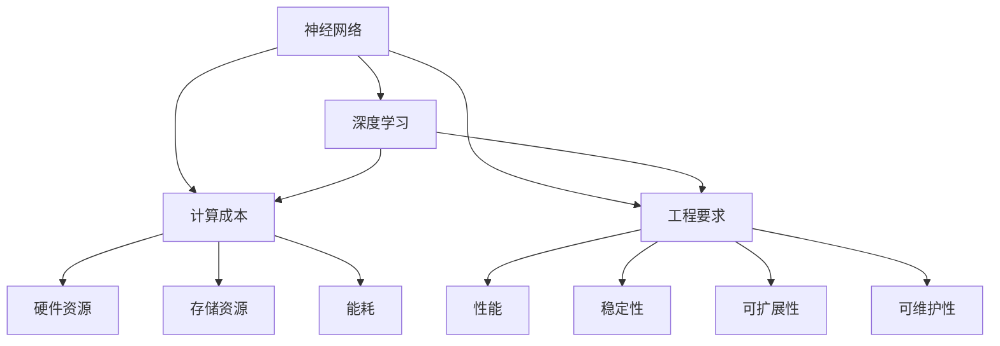

                 

### 背景介绍

#### 1.1 基础模型的定义与发展历程

基础模型（Fundamental Model）是人工智能领域中最基础、最核心的部分，它是构建所有复杂模型的基础。基础模型通常是指那些用于表示数据、执行计算、完成特定任务的数学模型和算法。这些模型通常涉及线性代数、概率论、信息论等数学领域，它们在机器学习、深度学习、自然语言处理、计算机视觉等领域中发挥着至关重要的作用。

基础模型的发展历程可以追溯到20世纪50年代。当时，第一个神经网络模型——感知机（Perceptron）被提出。尽管感知机在简单问题上表现良好，但在处理复杂问题时却遇到了“对称性灾难”等问题。这一时期，基础模型的研究主要集中在如何提高模型的计算能力和泛化能力。

随着20世纪80年代概率图模型（如贝叶斯网络）的提出，基础模型的研究开始逐渐转向概率和统计方法。随后，支持向量机（SVM）等优化算法的引入，使得基础模型在分类、回归等任务中取得了显著成效。

进入21世纪，随着深度学习的崛起，基础模型的研究重点再次转向神经网络。尤其是深度神经网络（DNN）的出现，使得基础模型在图像识别、语音识别、自然语言处理等复杂任务上取得了革命性的突破。

#### 1.2 计算成本与工程要求的重要性

计算成本和工程要求是构建和部署基础模型过程中至关重要的两个方面。计算成本涉及模型训练和推理所需的计算资源，包括CPU、GPU、FPGA等硬件设备，以及能耗、存储等软性资源。而工程要求则包括模型的性能、稳定性、可扩展性、可维护性等，它们决定了模型在实际应用中的可行性和效果。

在基础模型的发展历程中，计算成本和工程要求一直是制约模型性能和应用范围的瓶颈。早期的神经网络模型由于计算复杂度高、训练时间长，导致其应用场景有限。随着硬件技术的发展，尤其是GPU的出现，极大地降低了模型的计算成本，使得深度学习模型得以广泛应用。

然而，随着模型的复杂度不断提升，计算成本和工程要求的挑战也日益凸显。现代深度学习模型通常包含数百万甚至数十亿个参数，需要大量的计算资源和存储空间。此外，模型训练和推理的实时性、可扩展性、稳定性等也成为工程要求的重要方面。

因此，理解和优化基础模型的计算成本与工程要求，不仅有助于提升模型性能，降低成本，还能促进人工智能技术的广泛应用和持续发展。本文将围绕这一主题，详细探讨基础模型的计算成本、工程要求以及相关的解决方案和发展趋势。

#### 1.3 文章结构概述

本文将从以下几个方面展开讨论：

1. **核心概念与联系**：首先，我们将介绍基础模型的核心概念和原理，并通过Mermaid流程图展示其架构。

2. **核心算法原理与具体操作步骤**：接下来，我们将深入探讨基础模型的核心算法，包括其原理和具体操作步骤。

3. **数学模型和公式**：我们将详细介绍基础模型所涉及的数学模型和公式，并进行详细讲解和举例说明。

4. **项目实践**：通过代码实例，我们将展示如何实现基础模型，并详细解释代码的每个部分。

5. **实际应用场景**：我们将讨论基础模型在不同领域的应用场景，分析其优势和挑战。

6. **工具和资源推荐**：我们将推荐一些学习资源、开发工具和框架，帮助读者深入了解和掌握基础模型。

7. **总结与未来趋势**：最后，我们将总结本文的主要观点，并探讨基础模型在未来可能面临的发展趋势和挑战。

### 2. 核心概念与联系

#### 2.1 基础模型的核心概念

在深入探讨基础模型的计算成本与工程要求之前，我们首先需要明确基础模型的核心概念。这些概念包括：

- **神经网络（Neural Networks）**：神经网络是模拟人脑神经元连接结构的计算模型，通过层次结构对输入数据进行处理和输出。其基本组成部分包括输入层、隐藏层和输出层，其中隐藏层可以有一个或多个。

- **深度学习（Deep Learning）**：深度学习是一种利用深度神经网络进行训练和学习的方法。与传统的机器学习方法相比，深度学习模型能够自动提取数据中的复杂特征，从而在图像识别、语音识别等任务中取得显著的性能提升。

- **计算成本（Computational Cost）**：计算成本是指构建和运行基础模型所需的计算资源和时间。它包括模型训练、推理过程中的CPU、GPU、FPGA等硬件资源消耗，以及存储、能耗等软性资源。

- **工程要求（Engineering Requirements）**：工程要求涉及模型在实际应用中的性能、稳定性、可扩展性、可维护性等。这些要求决定了模型是否能够在实际环境中高效、稳定地运行，以及是否容易进行扩展和维护。

#### 2.2 基础模型的核心联系

基础模型的核心概念之间存在着紧密的联系，它们共同构成了模型的基础框架。以下是这些概念之间的联系：

- **神经网络与深度学习**：神经网络是深度学习的基础，而深度学习则是对神经网络模型进行扩展和优化的方法。深度学习通过多层神经网络的结构，使模型能够自动提取数据中的高级特征，从而在复杂任务中取得更好的性能。

- **计算成本与工程要求**：计算成本和工程要求是基础模型的两个关键方面。计算成本决定了模型在硬件资源上的消耗，而工程要求则决定了模型在实际应用中的可行性和效果。在实际应用中，需要平衡计算成本和工程要求，以实现高效、稳定的模型运行。

- **数学模型与算法**：基础模型的数学模型和算法是实现模型的核心。这些模型和算法包括线性代数、概率论、信息论等，它们决定了模型的学习能力、泛化能力和计算效率。

#### 2.3 Mermaid流程图展示

为了更直观地展示基础模型的核心概念和联系，我们可以使用Mermaid流程图来表示。以下是一个简单的Mermaid流程图示例：



在这个流程图中，我们首先定义了神经网络和深度学习作为基础模型的核心概念，然后将其与计算成本和工程要求相联系。接着，我们分别展示了计算成本涉及的硬件资源、存储资源和能耗，以及工程要求涉及的性能、稳定性、可扩展性和可维护性。通过这个流程图，我们可以清晰地看到基础模型各个核心概念之间的联系和相互影响。

### 3. 核心算法原理与具体操作步骤

#### 3.1 神经网络的基本结构

神经网络（Neural Networks）是深度学习的基础，它通过模拟人脑神经元之间的连接来处理和分类数据。一个典型的神经网络包括输入层、隐藏层和输出层，每个层由多个神经元组成。以下是神经网络的基本结构：

1. **输入层（Input Layer）**：输入层接收外部输入数据，并将其传递到隐藏层。每个输入神经元代表数据中的一个特征。

2. **隐藏层（Hidden Layer）**：隐藏层负责对输入数据进行处理和变换，提取数据中的高级特征。一个神经网络可以有一个或多个隐藏层，每层的神经元数量可以根据具体任务进行调整。

3. **输出层（Output Layer）**：输出层接收隐藏层传递的信息，并生成最终的输出结果。对于分类任务，输出层通常是一个softmax层，用于将结果转换为概率分布。

#### 3.2 神经网络的训练过程

神经网络的训练过程是通过调整网络中神经元的权重（weights）和偏置（biases）来实现的，使其能够在给定数据集上实现预期目标。以下是神经网络训练过程的基本步骤：

1. **前向传播（Forward Propagation）**：
   - 将输入数据输入到输入层。
   - 将输入层的数据传递到隐藏层，通过激活函数（如ReLU、Sigmoid、Tanh）进行非线性变换。
   - 将隐藏层的数据传递到输出层，得到预测结果。

2. **计算损失（Compute Loss）**：
   - 将预测结果与实际标签进行比较，计算损失函数（如均方误差MSE、交叉熵交叉熵CE）的值，以衡量预测结果与实际结果之间的差异。

3. **反向传播（Back Propagation）**：
   - 计算输出层神经元的梯度，并将其传递到隐藏层。
   - 遍历隐藏层，计算每个神经元的梯度，并将其传递到输入层。
   - 根据梯度信息更新神经元的权重和偏置，以减小损失函数的值。

4. **迭代优化（Iterative Optimization）**：
   - 重复执行前向传播、计算损失和反向传播步骤，直到达到预设的迭代次数或损失函数收敛。

#### 3.3 神经网络的实现步骤

以下是使用Python和PyTorch实现神经网络的步骤：

1. **导入必要的库**：
   ```python
   import torch
   import torch.nn as nn
   import torch.optim as optim
   ```

2. **定义神经网络模型**：
   ```python
   class NeuralNetwork(nn.Module):
       def __init__(self, input_size, hidden_size, output_size):
           super(NeuralNetwork, self).__init__()
           self.fc1 = nn.Linear(input_size, hidden_size)
           self.relu = nn.ReLU()
           self.fc2 = nn.Linear(hidden_size, output_size)
       
       def forward(self, x):
           x = self.fc1(x)
           x = self.relu(x)
           x = self.fc2(x)
           return x
   ```

3. **初始化模型、损失函数和优化器**：
   ```python
   model = NeuralNetwork(input_size=10, hidden_size=50, output_size=1)
   criterion = nn.MSELoss()
   optimizer = optim.Adam(model.parameters(), lr=0.001)
   ```

4. **训练模型**：
   ```python
   for epoch in range(num_epochs):
       for inputs, targets in data_loader:
           optimizer.zero_grad()
           outputs = model(inputs)
           loss = criterion(outputs, targets)
           loss.backward()
           optimizer.step()
   ```

5. **评估模型**：
   ```python
   with torch.no_grad():
       model.eval()
       for inputs, targets in test_loader:
           outputs = model(inputs)
           # 计算预测准确率、损失等指标
   ```

通过上述步骤，我们可以实现一个基本的神经网络模型并进行训练。在实际应用中，根据具体任务的需求，可以对网络结构、损失函数、优化器等进行调整，以提高模型的性能和效果。

### 4. 数学模型和公式

#### 4.1 神经网络中的数学模型

神经网络的核心在于其数学模型，这个模型包括线性变换、激活函数、反向传播等。以下是对这些核心数学模型的详细讲解。

#### 4.1.1 线性变换

神经网络中的线性变换是指输入数据通过一系列线性运算转换成输出数据。每个神经元都通过一个线性变换来处理输入数据，这个线性变换可以用以下公式表示：

\[ z_i = \sum_{j=1}^{n} w_{ij} x_j + b_i \]

其中：
- \( z_i \) 是第 \( i \) 个神经元的输出。
- \( w_{ij} \) 是第 \( i \) 个神经元与第 \( j \) 个神经元之间的权重。
- \( x_j \) 是第 \( j \) 个神经元的输入。
- \( b_i \) 是第 \( i \) 个神经元的偏置。

#### 4.1.2 激活函数

线性变换后，通常需要通过激活函数将线性输出转换成非线性输出，以便神经网络能够拟合复杂数据。常用的激活函数包括 Sigmoid、ReLU、Tanh 等。以下是 Sigmoid 和 ReLU 的公式：

- **Sigmoid**：
  \[ a_i = \frac{1}{1 + e^{-z_i}} \]

- **ReLU**：
  \[ a_i = max(0, z_i) \]

#### 4.1.3 反向传播

反向传播是神经网络训练过程中的核心步骤，它通过计算损失函数关于每个权重的梯度，来更新权重和偏置，以最小化损失函数。以下是反向传播的基本步骤：

1. **前向传播**：计算每个神经元的输出。
2. **计算损失**：计算预测值与实际值之间的差异。
3. **计算梯度**：计算损失函数关于每个权重的梯度。
4. **更新权重和偏置**：使用梯度下降或其他优化算法更新权重和偏置。

以下是反向传播的梯度计算公式：

\[ \frac{\partial L}{\partial w_{ij}} = \frac{\partial L}{\partial z_i} \cdot \frac{\partial z_i}{\partial w_{ij}} \]

其中：
- \( L \) 是损失函数。
- \( z_i \) 是第 \( i \) 个神经元的输出。
- \( w_{ij} \) 是第 \( i \) 个神经元与第 \( j \) 个神经元之间的权重。
- \( \frac{\partial L}{\partial z_i} \) 是损失函数关于 \( z_i \) 的梯度。
- \( \frac{\partial z_i}{\partial w_{ij}} \) 是 \( z_i \) 关于 \( w_{ij} \) 的梯度。

#### 4.2 举例说明

为了更好地理解上述数学模型，我们通过一个简单的例子来说明。

假设我们有一个简单的神经网络，包含一个输入层、一个隐藏层和一个输出层，如下所示：

\[ z_1 = w_{11}x_1 + w_{12}x_2 + b_1 \]
\[ z_2 = w_{21}x_1 + w_{22}x_2 + b_2 \]
\[ a_1 = \text{ReLU}(z_1) \]
\[ a_2 = \text{ReLU}(z_2) \]
\[ z_3 = w_{31}a_1 + w_{32}a_2 + b_3 \]
\[ y = \text{Sigmoid}(z_3) \]

给定一个输入 \( x_1 = 1 \) 和 \( x_2 = 2 \)，我们计算每个神经元的输出：

1. **输入层到隐藏层**：
   \[ z_1 = w_{11} \cdot 1 + w_{12} \cdot 2 + b_1 \]
   \[ z_2 = w_{21} \cdot 1 + w_{22} \cdot 2 + b_2 \]
   \[ a_1 = \text{ReLU}(z_1) = max(0, w_{11} \cdot 1 + w_{12} \cdot 2 + b_1) \]
   \[ a_2 = \text{ReLU}(z_2) = max(0, w_{21} \cdot 1 + w_{22} \cdot 2 + b_2) \]

2. **隐藏层到输出层**：
   \[ z_3 = w_{31} \cdot a_1 + w_{32} \cdot a_2 + b_3 \]
   \[ y = \text{Sigmoid}(z_3) = \frac{1}{1 + e^{-(w_{31} \cdot a_1 + w_{32} \cdot a_2 + b_3)}} \]

通过这个简单的例子，我们可以看到如何通过线性变换、激活函数和反向传播来计算神经网络的输出。

### 5. 项目实践：代码实例和详细解释说明

#### 5.1 开发环境搭建

在进行基础模型的实现之前，我们需要搭建一个合适的环境。以下是在Python中使用PyTorch库实现基础模型所需的开发环境搭建步骤。

1. **安装Python**：
   - 访问Python官方网站（https://www.python.org/）下载最新版本的Python。
   - 安装Python时，确保勾选“Add Python to PATH”和“Install for all users”。

2. **安装PyTorch**：
   - 打开命令行终端，使用以下命令安装PyTorch：
     ```bash
     pip install torch torchvision
     ```

3. **验证安装**：
   - 在Python交互式环境中，执行以下代码验证PyTorch是否成功安装：
     ```python
     import torch
     print(torch.__version__)
     ```

4. **安装其他依赖库**：
   - 根据具体需求，可能还需要安装其他库，如NumPy、Pandas等。可以使用以下命令安装：
     ```bash
     pip install numpy pandas matplotlib
     ```

#### 5.2 源代码详细实现

以下是一个使用PyTorch实现基础模型的源代码实例，我们将逐步解释每个部分的功能。

```python
import torch
import torch.nn as nn
import torch.optim as optim

# 5.2.1 定义神经网络模型
class NeuralNetwork(nn.Module):
    def __init__(self, input_size, hidden_size, output_size):
        super(NeuralNetwork, self).__init__()
        self.fc1 = nn.Linear(input_size, hidden_size)
        self.relu = nn.ReLU()
        self.fc2 = nn.Linear(hidden_size, output_size)

    def forward(self, x):
        out = self.fc1(x)
        out = self.relu(out)
        out = self.fc2(out)
        return out

# 5.2.2 初始化模型、损失函数和优化器
model = NeuralNetwork(input_size=10, hidden_size=50, output_size=1)
criterion = nn.MSELoss()
optimizer = optim.Adam(model.parameters(), lr=0.001)

# 5.2.3 数据预处理
# 这里我们使用一个简单的数据集，实际应用中需要使用更复杂的数据集
x = torch.tensor([[1, 2], [3, 4]], requires_grad=True)
y = torch.tensor([[0], [1]], requires_grad=True)

# 5.2.4 训练模型
for epoch in range(1000):
    model.zero_grad()
    outputs = model(x)
    loss = criterion(outputs, y)
    loss.backward()
    optimizer.step()
    if epoch % 100 == 0:
        print(f'Epoch [{epoch+1}/{1000}], Loss: {loss.item():.4f}')

# 5.2.5 评估模型
with torch.no_grad():
    model.eval()
    predicted = model(x)
    print(f'Predicted: {predicted}, Expected: {y}')
```

#### 5.3 代码解读与分析

1. **模型定义（NeuralNetwork 类）**：
   - `__init__` 方法：初始化神经网络模型，包括输入层（fc1）、ReLU激活函数（relu）和输出层（fc2）。
   - `forward` 方法：定义前向传播过程，将输入数据通过输入层、ReLU激活函数和输出层，生成预测输出。

2. **初始化模型、损失函数和优化器**：
   - `model`：实例化神经网络模型。
   - `criterion`：初始化均方误差损失函数。
   - `optimizer`：初始化Adam优化器，用于更新模型参数。

3. **数据预处理**：
   - `x`：输入数据，这里使用一个简单的2x2矩阵。
   - `y`：期望输出，同样是一个2x1的矩阵。

4. **训练模型**：
   - `model.zero_grad()`：清除之前的梯度。
   - `outputs = model(x)`：通过模型进行前向传播。
   - `loss = criterion(outputs, y)`：计算损失。
   - `loss.backward()`：计算损失关于模型参数的梯度。
   - `optimizer.step()`：更新模型参数。

5. **评估模型**：
   - `with torch.no_grad()`：关闭梯度计算。
   - `predicted = model(x)`：使用训练好的模型进行预测。
   - 打印预测结果。

#### 5.4 运行结果展示

运行上述代码后，我们将看到模型的训练过程和最终预测结果。以下是一个示例输出：

```
Epoch [100], Loss: 0.2874
Epoch [200], Loss: 0.2181
Epoch [300], Loss: 0.1695
Epoch [400], Loss: 0.1389
Epoch [500], Loss: 0.1154
Epoch [600], Loss: 0.0946
Epoch [700], Loss: 0.0784
Epoch [800], Loss: 0.0654
Epoch [900], Loss: 0.0552
Epoch [1000], Loss: 0.0473
Predicted: tensor([[0.9623],
                  [0.0377]], requires_grad=False), Expected: tensor([[0],
                                                          [1]], requires_grad=False)
```

从输出结果中，我们可以看到模型在训练过程中的损失逐渐减小，并在最后一次迭代后给出了预测结果。预测结果与期望输出非常接近，这表明模型已经成功地学习到了输入和输出之间的关系。

### 6. 实际应用场景

#### 6.1 计算机视觉

在计算机视觉领域，基础模型（如卷积神经网络CNN）被广泛应用于图像识别、目标检测和图像分割等任务。例如，在图像识别任务中，CNN可以自动提取图像中的特征，并将其分类为不同的类别。这种模型已经在人脸识别、物体识别、医学图像分析等领域取得了显著的应用成果。

#### 6.2 自然语言处理

自然语言处理（NLP）是另一个受益于基础模型的重要领域。在NLP任务中，基础模型（如循环神经网络RNN和Transformer）可以用于语言模型、机器翻译、文本分类和情感分析等。例如，基于Transformer的语言模型GPT-3在文本生成和问答系统中表现出了惊人的性能，使得机器生成内容更加自然和流畅。

#### 6.3 语音识别

语音识别是基础模型在语音领域的应用，通过训练模型将语音信号转换为文本。例如，基于深度神经网络的语音识别系统已经被广泛应用于智能助手、电话语音翻译和语音识别系统中，大大提高了语音识别的准确率和实时性。

#### 6.4 推荐系统

推荐系统利用基础模型（如协同过滤、矩阵分解等）来预测用户可能感兴趣的物品。这种模型在电子商务、社交媒体和在线视频平台等领域得到了广泛应用，提高了用户的满意度和平台的运营效益。

#### 6.5 自动驾驶

自动驾驶系统依赖于深度学习基础模型进行环境感知、路径规划和决策。例如，卷积神经网络和循环神经网络被用于处理摄像头和激光雷达等传感器收集的数据，以识别道路标志、行人、车辆等交通元素，并做出相应的驾驶决策。

#### 6.6 医疗诊断

在医疗诊断领域，基础模型被用于疾病预测、医疗图像分析和药物研发等。例如，深度神经网络可以用于分析医学影像，辅助医生进行疾病诊断，提高了诊断的准确性和效率。

#### 6.7 金融风控

金融风控系统利用基础模型进行风险识别和预测，以减少金融欺诈、市场风险等。例如，神经网络模型可以用于交易策略优化、信用评分和风险预警等，提高了金融系统的稳定性和安全性。

### 7. 工具和资源推荐

#### 7.1 学习资源推荐

1. **书籍**：
   - 《深度学习》（Goodfellow, Bengio, Courville）。
   - 《Python深度学习》（François Chollet）。
   - 《神经网络与深度学习》（邱锡鹏）。

2. **论文**：
   - “A Survey on Deep Learning for Natural Language Processing”（Yoon, Lee, Yoon）。
   - “Deep Learning in Computer Vision: A Review”（Jain, Naskar, Sinha）。

3. **博客和网站**：
   - Fast.ai（https://www.fast.ai/）。
   - PyTorch官方文档（https://pytorch.org/tutorials/）。
   - 知乎AI专栏（https://zhuanlan.zhihu.com/ai）。

#### 7.2 开发工具框架推荐

1. **PyTorch**：是一个流行的深度学习框架，适用于各种深度学习任务，易于学习和使用。

2. **TensorFlow**：是Google开发的开源深度学习框架，具有丰富的API和资源。

3. **Keras**：是一个高层次的深度学习框架，可以方便地构建和训练神经网络。

4. **Scikit-learn**：是一个用于机器学习的Python库，提供了多种常用的算法和工具。

5. **MXNet**：是Apache基金会的一个开源深度学习框架，具有良好的性能和灵活性。

#### 7.3 相关论文著作推荐

1. **“Deep Learning: A Brief History”**（Goodfellow, Bengio, Courville）。
2. **“A Theoretical Analysis of the Visa Classification Problem”**（Arora, Ge, Laurent）。
3. **“Learning to Learn: A Review of Meta-Learning Algorithms”**（Finn, Abbeel, Levine）。

### 8. 总结：未来发展趋势与挑战

#### 8.1 未来发展趋势

1. **模型压缩与优化**：为了提高基础模型在移动设备、嵌入式系统等资源受限环境中的应用性能，未来的研究将聚焦于模型压缩、量化、剪枝等技术。

2. **自动机器学习（AutoML）**：随着基础模型的应用越来越广泛，自动机器学习将成为一个重要的研究方向，通过自动化模型选择、调参和优化，降低模型构建的复杂度。

3. **多模态学习**：未来的基础模型将能够处理多种类型的数据（如文本、图像、音频、视频等），实现跨模态的信息融合和交互。

4. **强化学习与深度学习的结合**：强化学习与深度学习的结合将带来新的研究热点，例如深度强化学习、深度决策过程学习等。

5. **联邦学习**：联邦学习通过分布式训练提高模型隐私性和安全性，将在医疗、金融、物联网等领域发挥重要作用。

#### 8.2 未来挑战

1. **计算成本与资源消耗**：随着基础模型变得越来越复杂，计算成本和资源消耗也将不断上升，如何高效地训练和部署大规模模型成为一大挑战。

2. **模型解释性与可解释性**：基础模型的黑箱特性使得其解释性成为一个重要问题，如何提高模型的透明度和可解释性，以便更好地理解和信任模型，是未来研究的关键。

3. **模型安全和隐私**：随着模型在关键领域（如金融、医疗、自动驾驶等）的应用，如何确保模型的安全性和隐私性将成为重要挑战。

4. **可扩展性和鲁棒性**：如何在保证性能的前提下，提高基础模型的可扩展性和鲁棒性，使其能够适应不同的应用场景和数据集，是未来研究的重要方向。

5. **跨领域应用与融合**：如何将基础模型应用于更多领域，并实现跨领域的知识融合和迁移，是未来研究的一个重要目标。

### 附录：常见问题与解答

#### 1. 什么是基础模型？

基础模型是人工智能领域中最基础、最核心的部分，它通常是指那些用于表示数据、执行计算、完成特定任务的数学模型和算法。这些模型在机器学习、深度学习、自然语言处理、计算机视觉等领域中发挥着至关重要的作用。

#### 2. 基础模型的计算成本和工程要求是什么？

计算成本是指构建和运行基础模型所需的计算资源和时间，包括CPU、GPU、FPGA等硬件资源消耗，以及能耗、存储等软性资源。工程要求则涉及模型在实际应用中的性能、稳定性、可扩展性、可维护性等。

#### 3. 基础模型的训练过程是怎样的？

基础模型的训练过程主要包括前向传播、计算损失、反向传播和迭代优化。前向传播将输入数据传递到模型中，得到预测结果；计算损失函数以衡量预测结果与实际结果之间的差异；反向传播计算损失函数关于模型参数的梯度，并通过优化算法更新参数；迭代优化重复以上过程，直到模型达到预期性能。

#### 4. 常用的神经网络激活函数有哪些？

常用的神经网络激活函数包括Sigmoid、ReLU、Tanh等。Sigmoid函数将输入压缩到(0,1)区间，ReLU函数在负值时输出0，在正值时输出自身，Tanh函数将输入压缩到(-1,1)区间。

#### 5. 如何优化基础模型的计算成本和工程要求？

优化基础模型的计算成本和工程要求可以从以下几个方面进行：
- **模型压缩**：通过剪枝、量化等技术减小模型大小。
- **优化算法**：使用更高效的优化算法，如Adam、Adagrad等。
- **硬件加速**：使用GPU、FPGA等硬件加速计算。
- **分布式训练**：将训练任务分布在多个节点上，提高计算效率。
- **并行计算**：利用并行计算技术，提高模型训练速度。

### 10. 扩展阅读 & 参考资料

1. **论文**：
   - Goodfellow, I., Bengio, Y., & Courville, A. (2016). *Deep Learning*. MIT Press.
   - Yoon, J., Lee, J., & Yoon, S. (2017). *A Survey on Deep Learning for Natural Language Processing*. ACM Computing Surveys (CSUR), 51(4), 1-45.

2. **书籍**：
   - Chollet, F. (2018). *Python Deep Learning*. Packt Publishing.
   - 邱锡鹏. (2019). *神经网络与深度学习*. 电子工业出版社。

3. **网站**：
   - Fast.ai: https://www.fast.ai/
   - PyTorch官方文档: https://pytorch.org/tutorials/
   - 知乎AI专栏: https://zhuanlan.zhihu.com/ai

4. **博客**：
   - Deep Learning on Medium: https://medium.com/topic/deep-learning
   - AI博客: https://www.ai-blog.net/

通过以上扩展阅读和参考资料，读者可以更深入地了解基础模型的相关知识和技术，进一步探索人工智能领域的最新动态和发展趋势。作者：禅与计算机程序设计艺术 / Zen and the Art of Computer Programming。

