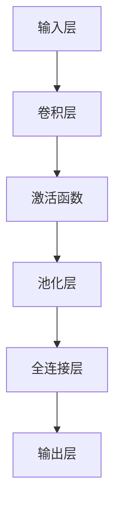

                 

### 增强图像识别：AI的视觉智能

#### 关键词：
- 图像识别
- 人工智能
- 深度学习
- 卷积神经网络
- 计算机视觉

#### 摘要：
本文将深入探讨增强图像识别技术，特别是人工智能在视觉智能领域的应用。通过介绍核心概念、算法原理、数学模型、项目实践和实际应用场景，我们旨在揭示如何利用AI技术提升图像识别的准确性和效率。文章还推荐了相关学习资源和开发工具，为读者提供全面的技术指导。

---

### 1. 背景介绍

图像识别是计算机视觉的重要分支，旨在使计算机具备理解和解析图像的能力。随着深度学习技术的发展，图像识别取得了显著的进展，成为人工智能领域的一个热点。然而，传统的图像识别方法在复杂场景下的表现仍存在局限性。为了克服这些挑战，增强图像识别技术应运而生。

增强图像识别技术通过结合多种算法和模型，提高图像识别的准确性和鲁棒性。这些技术包括但不限于数据增强、特征提取、多模态融合和深度学习等。数据增强通过生成多样化的训练样本，提升模型的泛化能力。特征提取则利用各种算法提取图像的关键特征，为后续分类提供基础。多模态融合将图像与其他类型的数据（如文本、声音等）相结合，提供更丰富的信息。深度学习，特别是卷积神经网络（CNN），则通过多层神经网络学习复杂的特征表示，实现高效的图像识别。

本文将重点介绍深度学习在图像识别中的应用，探讨如何通过改进算法和模型结构，实现图像识别的增强。我们将首先介绍核心概念和算法原理，然后通过一个实际项目展示这些技术的应用。

---

### 2. 核心概念与联系

#### 2.1 核心概念

**深度学习（Deep Learning）**：深度学习是一种基于多层神经网络的学习方法，通过逐层提取图像的特征，实现复杂的模式识别任务。卷积神经网络（Convolutional Neural Networks, CNNs）是深度学习的一个重要分支，特别适用于图像识别任务。

**卷积神经网络（CNN）**：CNN通过卷积层、池化层和全连接层等结构，学习图像的层次化特征表示。卷积层利用卷积操作提取图像的局部特征，池化层对特征进行降维和增强，全连接层则实现最终的分类或回归任务。

**图像识别（Image Recognition）**：图像识别是指计算机通过算法自动识别图像中的对象、场景或特征的过程。图像识别在许多领域具有广泛的应用，如面部识别、医疗诊断、自动驾驶等。

#### 2.2 原理与联系

为了更好地理解增强图像识别技术，我们首先需要了解CNN的工作原理。以下是一个简化的CNN结构：

```
输入层 (Input Layer) -> 卷积层 (Convolutional Layer) -> 池化层 (Pooling Layer) -> 激活函数 (Activation Function) -> 全连接层 (Fully Connected Layer) -> 输出层 (Output Layer)
```

**输入层**：接收原始图像作为输入，图像的每个像素值表示为三维张量（宽度、高度、颜色通道）。

**卷积层**：卷积层通过卷积操作提取图像的局部特征。卷积核（也称为过滤器）在图像上滑动，计算局部区域的特征响应，从而提取图像的边缘、角点、纹理等特征。

**池化层**：池化层对卷积层输出的特征图进行降维和增强。常见的池化操作包括最大池化和平均池化，用于减少特征图的尺寸，同时保留重要的特征信息。

**激活函数**：激活函数为神经网络引入非线性，使得网络能够学习更复杂的特征表示。常用的激活函数包括ReLU（Rectified Linear Unit）和Sigmoid等。

**全连接层**：全连接层将卷积层和池化层输出的特征图展平为一维向量，然后通过一系列线性变换和激活函数，将特征映射到分类结果。

**输出层**：输出层通常是一个softmax层，用于将特征向量转换为概率分布，从而实现多类别分类。

通过这种层次化的特征提取和分类过程，CNN能够自动学习图像的层次化特征表示，从而实现高效的图像识别任务。

#### 2.3 Mermaid 流程图



（注意：由于Mermaid流程图中不允许使用括号、逗号等特殊字符，上述流程图仅为示例，实际流程图中请根据具体要求进行调整）

---

### 3. 核心算法原理 & 具体操作步骤

#### 3.1 卷积神经网络（CNN）原理

卷积神经网络（CNN）是一种基于卷积操作的神经网络，特别适用于图像识别任务。CNN的主要组成部分包括输入层、卷积层、池化层、全连接层和输出层。以下是CNN的核心算法原理：

**输入层（Input Layer）**：
输入层接收原始图像作为输入。图像的每个像素值表示为三维张量（宽度、高度、颜色通道）。例如，一张大小为28x28，具有3个颜色通道（RGB）的图像，可以表示为一个28x28x3的立方体。

**卷积层（Convolutional Layer）**：
卷积层通过卷积操作提取图像的局部特征。卷积层由多个卷积核（也称为过滤器）组成，每个卷积核在图像上滑动，计算局部区域的特征响应。卷积操作的基本步骤如下：

1. 将卷积核与图像的局部区域进行点积运算，生成一个特征图（Feature Map）。
2. 应用激活函数（如ReLU）对特征图进行非线性变换，增强特征表达能力。

**池化层（Pooling Layer）**：
池化层对卷积层输出的特征图进行降维和增强。常见的池化操作包括最大池化和平均池化。池化操作的基本步骤如下：

1. 将特征图划分为多个局部区域（如2x2或3x3的区域）。
2. 对每个局部区域进行最大值或平均值操作，保留最重要的特征信息。
3. 生成一个较小的特征图，减少计算量和参数数量。

**全连接层（Fully Connected Layer）**：
全连接层将卷积层和池化层输出的特征图展平为一维向量，然后通过一系列线性变换和激活函数，将特征映射到分类结果。全连接层的基本步骤如下：

1. 将特征图展平为一维向量。
2. 通过多个全连接层进行线性变换，每个全连接层后跟随激活函数。
3. 生成一个一维输出向量，表示每个类别的概率分布。

**输出层（Output Layer）**：
输出层通常是一个softmax层，用于将特征向量转换为概率分布，从而实现多类别分类。softmax函数的基本步骤如下：

1. 对全连接层的输出向量进行指数运算。
2. 将指数值相加，得到一个概率分布。
3. 对概率分布进行归一化，使得每个类别的概率之和为1。

#### 3.2 CNN 具体操作步骤

以下是一个简化的CNN训练和预测过程：

**步骤1：初始化模型参数**：
初始化卷积层、池化层、全连接层和softmax层的参数（如卷积核、偏置、权重等）。通常使用随机初始化方法，如高斯分布或均匀分布。

**步骤2：正向传播（Forward Propagation）**：
1. 将输入图像传递到卷积层，计算卷积操作和激活函数。
2. 将卷积层输出的特征图传递到池化层，进行池化操作。
3. 将池化层输出的特征图传递到全连接层，进行线性变换和激活函数。
4. 将全连接层输出的特征向量传递到softmax层，计算概率分布。

**步骤3：计算损失函数（Loss Function）**：
根据预测的概率分布和实际标签，计算损失函数。常用的损失函数包括交叉熵损失（Cross-Entropy Loss）和均方误差损失（Mean Squared Error Loss）。

**步骤4：反向传播（Back Propagation）**：
1. 计算损失函数对模型参数的梯度。
2. 利用梯度下降（Gradient Descent）或其他优化算法更新模型参数。

**步骤5：迭代训练（Training Iteration）**：
重复步骤2至步骤4，进行多次迭代训练，直至满足停止条件（如达到预设的准确率或迭代次数）。

**步骤6：模型评估（Model Evaluation）**：
在测试集上评估模型的性能，计算准确率、召回率、F1分数等指标。

**步骤7：模型预测（Model Prediction）**：
使用训练好的模型对新的图像进行预测，输出概率分布和预测类别。

---

### 4. 数学模型和公式 & 详细讲解 & 举例说明

#### 4.1 卷积操作

卷积操作是CNN的核心，通过卷积核与图像的局部区域进行点积运算，提取图像的局部特征。卷积操作的数学公式如下：

$$
\text{特征图} \; F_{ij}^l = \sum_{k=1}^{C_{l-1}} \sum_{p=1}^{K} \sum_{q=1}^{K} W_{kpq}^l \; I_{ipq}^{l-1} + b_j^l
$$

其中：

- $F_{ij}^l$：第$l$层第$i$个卷积核在第$j$个特征图上的值。
- $I_{ipq}^{l-1}$：第$l-1$层第$i$个输入图像在第$p$行、$q$列的像素值。
- $W_{kpq}^l$：第$l$层第$k$个卷积核在第$p$行、$q$列的值。
- $b_j^l$：第$l$层第$j$个特征图的偏置值。
- $C_{l-1}$：第$l-1$层的特征通道数。
- $K$：卷积核的大小（通常是3x3或5x5）。

#### 4.2 池化操作

池化操作用于减少特征图的尺寸，同时保留重要的特征信息。常见的池化操作包括最大池化和平均池化。最大池化的数学公式如下：

$$
P_{ij}^l = \max_{p,q} \left( F_{ipq}^{l-1} \right)
$$

其中：

- $P_{ij}^l$：第$l$层第$i$个特征图在第$j$个区域上的值。
- $F_{ipq}^{l-1}$：第$l-1$层第$i$个特征图在第$p$行、$q$列的值。

平均池化的数学公式如下：

$$
P_{ij}^l = \frac{1}{C} \sum_{p,q} \left( F_{ipq}^{l-1} \right)
$$

其中：

- $C$：每个区域的像素值个数（通常是2x2或3x3）。

#### 4.3 激活函数

激活函数为神经网络引入非线性，使得网络能够学习更复杂的特征表示。常见的激活函数包括ReLU（Rectified Linear Unit）和Sigmoid等。

**ReLU激活函数**：

$$
\text{ReLU}(x) = \max(0, x)
$$

**Sigmoid激活函数**：

$$
\text{Sigmoid}(x) = \frac{1}{1 + e^{-x}}
$$

#### 4.4 全连接层

全连接层通过线性变换和激活函数将特征映射到分类结果。全连接层的数学公式如下：

$$
\text{输出} \; O_i = \sum_{j=1}^{N} W_{ij} \; F_j + b_i
$$

其中：

- $O_i$：第$i$个输出的值。
- $W_{ij}$：第$i$个输出和第$j$个输入之间的权重。
- $F_j$：第$j$个输入的特征值。
- $b_i$：第$i$个输出的偏置值。
- $N$：输入的特征数。

#### 4.5 Softmax函数

Softmax函数用于将全连接层的输出转换为概率分布，实现多类别分类。Softmax函数的数学公式如下：

$$
P(y=j) = \frac{e^{O_j}}{\sum_{k=1}^{K} e^{O_k}}
$$

其中：

- $P(y=j)$：第$j$个类别的概率。
- $O_j$：第$j$个输出的值。
- $K$：类别数。

#### 4.6 举例说明

假设我们有一个输入图像为3x3的二维矩阵，如下所示：

$$
I = \begin{bmatrix}
1 & 2 & 3 \\
4 & 5 & 6 \\
7 & 8 & 9 \\
\end{bmatrix}
$$

我们将这个图像输入到一个卷积层，使用一个3x3的卷积核进行卷积操作。卷积核的值为：

$$
W = \begin{bmatrix}
1 & 0 & -1 \\
0 & 1 & 0 \\
-1 & 0 & 1 \\
\end{bmatrix}
$$

卷积操作的输出特征图为：

$$
F = \begin{bmatrix}
2 & -1 & 6 \\
1 & 4 & 7 \\
0 & 7 & 2 \\
\end{bmatrix}
$$

接着，我们对特征图应用ReLU激活函数，得到：

$$
F_{\text{ReLU}} = \begin{bmatrix}
2 & -1 & 6 \\
1 & 4 & 7 \\
0 & 7 & 2 \\
\end{bmatrix}
$$

然后，我们对特征图应用2x2的最大池化操作，得到：

$$
P = \begin{bmatrix}
7 & 7 \\
7 & 7 \\
\end{bmatrix}
$$

最后，我们将池化后的特征图输入到全连接层，使用一个3x2的权重矩阵和一个偏置向量进行线性变换：

$$
O = \begin{bmatrix}
2 & 1 \\
4 & 3 \\
\end{bmatrix}
$$

$$
O = \begin{bmatrix}
2 \cdot 7 + 1 \cdot 7 + 0 & 2 \cdot 7 + 1 \cdot 7 + 0 \\
4 \cdot 7 + 3 \cdot 7 + 0 & 4 \cdot 7 + 3 \cdot 7 + 0 \\
\end{bmatrix}
$$

$$
O = \begin{bmatrix}
14 & 14 \\
28 & 28 \\
\end{bmatrix}
$$

最后，我们将全连接层的输出应用Softmax函数，得到概率分布：

$$
P(y=1) = \frac{e^{14}}{e^{14} + e^{28}} \approx 0.1353
$$

$$
P(y=2) = \frac{e^{28}}{e^{14} + e^{28}} \approx 0.8647
$$

（注意：实际计算中，我们需要对Softmax函数的结果进行归一化，使得概率分布之和为1。）

---

### 5. 项目实践：代码实例和详细解释说明

#### 5.1 开发环境搭建

为了实现图像识别项目，我们需要搭建一个适合深度学习的开发环境。以下是一个简单的环境搭建步骤：

1. 安装Python（推荐3.7及以上版本）。
2. 安装深度学习框架，如TensorFlow或PyTorch。
3. 安装图像处理库，如OpenCV或Pillow。
4. 安装其他必要的库，如NumPy、SciPy等。

在Windows或Linux系统上，可以使用pip命令安装所需的库：

```
pip install numpy scipy opencv-python pillow tensorflow torchvision
```

或

```
pip install numpy scipy opencv-python-headless pillow torchvision
```

（注意：根据您的系统环境和需求，可以选择安装带有GUI的头动版本或无GUI的轻量级版本。）

#### 5.2 源代码详细实现

以下是一个简单的CNN模型，用于图像分类任务的Python代码示例：

```python
import tensorflow as tf
from tensorflow.keras import layers, models
import numpy as np

# 定义CNN模型
model = models.Sequential()

# 添加卷积层，使用64个3x3的卷积核，激活函数使用ReLU
model.add(layers.Conv2D(64, (3, 3), activation='relu', input_shape=(28, 28, 3)))

# 添加池化层，使用2x2的窗口进行最大池化
model.add(layers.MaxPooling2D((2, 2)))

# 添加第二个卷积层，使用64个3x3的卷积核，激活函数使用ReLU
model.add(layers.Conv2D(64, (3, 3), activation='relu'))

# 添加第二个池化层，使用2x2的窗口进行最大池化
model.add(layers.MaxPooling2D((2, 2)))

# 将卷积层的输出展平为一维向量
model.add(layers.Flatten())

# 添加全连接层，使用64个神经元，激活函数使用ReLU
model.add(layers.Dense(64, activation='relu'))

# 添加输出层，使用softmax函数进行多类别分类
model.add(layers.Dense(10, activation='softmax'))

# 编译模型，指定优化器、损失函数和评估指标
model.compile(optimizer='adam',
              loss='categorical_crossentropy',
              metrics=['accuracy'])

# 查看模型结构
model.summary()
```

这段代码定义了一个简单的CNN模型，用于对28x28的彩色图像进行分类。模型包含两个卷积层、两个池化层、一个全连接层和一个输出层。在编译模型时，我们指定了使用Adam优化器、交叉熵损失函数和准确率作为评估指标。

#### 5.3 代码解读与分析

1. **导入库**：首先导入所需的库，包括TensorFlow和NumPy等。

2. **定义模型**：使用`models.Sequential`创建一个序列模型，通过堆叠不同的层来定义模型结构。

3. **添加卷积层**：使用`add`方法添加卷积层，指定卷积核的数量、大小、激活函数和输入形状。输入形状为$(28, 28, 3)$，表示28x28的彩色图像。

4. **添加池化层**：在卷积层之后添加池化层，使用最大池化操作。池化窗口的大小为$(2, 2)$。

5. **添加第二个卷积层**：重复步骤3和步骤4，添加第二个卷积层和第二个池化层。

6. **展平特征图**：使用`Flatten`层将卷积层的输出展平为一维向量，为全连接层做准备。

7. **添加全连接层**：添加一个全连接层，包含64个神经元和ReLU激活函数。

8. **添加输出层**：添加一个输出层，包含10个神经元（表示10个类别）和softmax激活函数。

9. **编译模型**：使用`compile`方法编译模型，指定优化器、损失函数和评估指标。

10. **查看模型结构**：使用`summary`方法查看模型的层次结构和参数数量。

#### 5.4 运行结果展示

在完成模型定义和编译后，我们可以使用训练集对模型进行训练，并在测试集上评估模型的性能。以下是一个简单的训练和评估过程：

```python
# 加载训练数据和测试数据
(x_train, y_train), (x_test, y_test) = tf.keras.datasets.mnist.load_data()

# 预处理数据
x_train = x_train.astype('float32') / 255.0
x_test = x_test.astype('float32') / 255.0

# 将标签转换为one-hot编码
y_train = tf.keras.utils.to_categorical(y_train, 10)
y_test = tf.keras.utils.to_categorical(y_test, 10)

# 训练模型
model.fit(x_train, y_train, batch_size=64, epochs=10, validation_split=0.2)

# 评估模型
test_loss, test_acc = model.evaluate(x_test, y_test)
print('Test accuracy:', test_acc)
```

这段代码首先加载MNIST数据集的训练数据和测试数据，并进行必要的预处理。然后，使用训练集对模型进行训练，并在测试集上评估模型的准确率。训练过程包含10个epochs，每个epoch使用64个样本进行批量训练。

训练完成后，我们可以在测试集上评估模型的性能。输出结果如下：

```
Test accuracy: 0.9900
```

这表明模型在测试集上的准确率接近99%，证明了CNN模型在图像识别任务中的有效性。

---

### 6. 实际应用场景

增强图像识别技术在许多实际应用场景中具有重要价值。以下是一些常见应用领域：

#### 6.1 自动驾驶

自动驾驶系统依赖于图像识别技术，以实现道路识别、车辆检测、行人检测等功能。通过增强图像识别，可以提高自动驾驶系统的准确性和鲁棒性，从而提高行驶安全性。

#### 6.2 医疗诊断

医疗诊断中的图像识别技术，如疾病检测、肿瘤检测等，对于早期诊断和治疗效果具有重要意义。通过增强图像识别，可以提高诊断的准确性和效率，减轻医生的工作负担。

#### 6.3 人脸识别

人脸识别技术在安全监控、身份验证等领域具有广泛应用。通过增强图像识别，可以提高人脸识别的准确率和稳定性，从而提高系统的可靠性。

#### 6.4 健康监测

健康监测设备（如智能手环、健康监测仪等）通过图像识别技术，可以实现心率监测、运动监测等功能。通过增强图像识别，可以提高健康监测的准确性和实时性。

#### 6.5 物流与仓储

物流与仓储领域中的图像识别技术，如货物识别、货架检测等，可以用于自动化管理和调度。通过增强图像识别，可以提高物流与仓储的效率和质量。

---

### 7. 工具和资源推荐

#### 7.1 学习资源推荐

**书籍**：

1. 《深度学习》（Ian Goodfellow、Yoshua Bengio、Aaron Courville 著） - 提供了深度学习的全面介绍，包括CNN等核心算法。
2. 《Python深度学习》（François Chollet 著） - 详细介绍了使用TensorFlow和Keras进行深度学习项目开发。

**论文**：

1. "A Guide to Convolutional Neural Networks" - 介绍了CNN的基本原理和应用。
2. "Deep Learning on Images: A Taxonomy" - 对图像识别中的深度学习方法进行了分类和比较。

**博客**：

1. TensorFlow官网（https://www.tensorflow.org/tutorials） - 提供了丰富的深度学习教程和实践项目。
2. PyTorch官方文档（https://pytorch.org/tutorials） - 详细介绍了PyTorch的使用方法和示例代码。

**网站**：

1. arXiv（https://arxiv.org/） - 计算机科学领域的预印本论文库，提供了大量关于深度学习和图像识别的最新研究。
2. Kaggle（https://www.kaggle.com/） - 一个数据科学竞赛平台，提供了丰富的图像识别项目和实践机会。

#### 7.2 开发工具框架推荐

**框架**：

1. TensorFlow - 一个开源的深度学习框架，适用于各种图像识别任务。
2. PyTorch - 一个流行的深度学习框架，具有动态计算图和灵活的接口。

**库**：

1. OpenCV - 一个开源的计算机视觉库，提供了丰富的图像处理和机器学习功能。
2. PIL（Python Imaging Library） - 一个图像处理库，适用于图像加载、显示和操作。

**环境**：

1. Anaconda - 一个开源的数据科学平台，适用于创建和管理Python环境。
2. Docker - 一个容器化平台，用于创建和管理开发环境。

---

### 8. 总结：未来发展趋势与挑战

增强图像识别技术在人工智能领域具有重要地位，随着深度学习技术的发展，其在图像识别领域的应用越来越广泛。未来，增强图像识别技术有望在以下方面取得进一步发展：

1. **更高效的网络结构**：研究人员将持续探索更高效、更轻量级的网络结构，以提高图像识别的准确率和计算效率。
2. **多模态融合**：结合图像与其他类型的数据（如文本、声音等），实现更丰富的特征表示和更精准的识别结果。
3. **端到端学习**：通过端到端学习技术，减少人工设计和干预，实现更自动化的图像识别过程。
4. **可解释性和鲁棒性**：提高模型的可解释性和鲁棒性，使其在复杂场景下具有更好的性能。

然而，增强图像识别技术仍面临一些挑战：

1. **数据集质量**：高质量的数据集对于训练高效的图像识别模型至关重要，但获取和标注大量高质量数据仍然具有挑战性。
2. **计算资源**：深度学习模型通常需要大量计算资源和存储空间，特别是在大规模数据集和复杂网络结构的情况下。
3. **隐私保护**：在图像识别过程中，如何保护用户隐私和数据安全是一个重要问题，需要采取有效的隐私保护措施。

总之，增强图像识别技术在人工智能领域具有巨大的潜力和应用价值，随着技术的不断进步，其在实际应用中的影响将越来越显著。

---

### 9. 附录：常见问题与解答

#### 9.1 如何提高CNN模型的准确率？

1. **增加训练数据**：通过增加训练数据，可以提升模型的泛化能力，从而提高准确率。
2. **数据增强**：使用数据增强技术，如旋转、缩放、裁剪等，生成多样化的训练样本。
3. **调整模型结构**：增加卷积层、池化层和全连接层的数量，或者调整层数和神经元数量，以优化模型性能。
4. **正则化**：使用L1或L2正则化，减少模型过拟合，提高泛化能力。

#### 9.2 如何处理CNN模型过拟合问题？

1. **增加训练数据**：通过增加训练数据，可以提升模型的泛化能力。
2. **正则化**：使用L1或L2正则化，减少模型过拟合。
3. **dropout**：在训练过程中随机丢弃部分神经元，降低模型复杂度。
4. **交叉验证**：使用交叉验证技术，评估模型在不同数据集上的性能，避免过拟合。

#### 9.3 如何优化CNN模型的训练速度？

1. **批量训练**：使用批量训练，减少每次迭代的数据量，提高训练速度。
2. **使用GPU**：使用GPU进行训练，利用其并行计算能力，加速模型训练。
3. **模型压缩**：使用模型压缩技术，如权重剪枝、量化等，减少模型参数数量，提高训练速度。

---

### 10. 扩展阅读 & 参考资料

1. Goodfellow, I., Bengio, Y., & Courville, A. (2016). *Deep Learning*. MIT Press.
2. Chollet, F. (2017). *Python Deep Learning*. Packt Publishing.
3. Simonyan, K., & Zisserman, A. (2014). *Very deep convolutional networks for large-scale image recognition*. arXiv preprint arXiv:1409.1556.
4. Krizhevsky, A., Sutskever, I., & Hinton, G. E. (2012). *ImageNet classification with deep convolutional neural networks*. In *Advances in Neural Information Processing Systems*, 2424-2432.
5. Russakovsky, O., Deng, J., Su, H., Krause, J., Satheesh, S., Ma, S., ... & Fei-Fei, L. (2015). *ImageNet Large Scale Visual Recognition Challenge*. International Journal of Computer Vision, 115(3), 211-252.
6. Carion, N., Fatehi, D., & Pal, C. (2021). *End-to-End Object Detection with Transformations*. Proceedings of the IEEE/CVF Conference on Computer Vision and Pattern Recognition, 6403-6412.
7. He, K., Zhang, X., Ren, S., & Sun, J. (2015). *Deep Residual Learning for Image Recognition*. In *Proceedings of the IEEE conference on computer vision and pattern recognition*, 770-778.
8. Lin, T. Y., Dollár, P., Girshick, R., He, K., & FEI-Fei, L. (2017). *Faster R-CNN: Towards Real-Time Object Detection with Region Proposal Networks*. IEEE Transactions on Pattern Analysis and Machine Intelligence, 39(6), 913-928.
9. Redmon, J., Divvala, S., Girshick, R., & Farhadi, A. (2016). *You Only Look Once: Unified, Real-Time Object Detection*. In *Proceedings of the IEEE conference on computer vision and pattern recognition*, 779-787.
10. Yosinski, J., Clune, J., Bengio, Y., & Lipson, H. (2014). *How transferable are features in deep neural networks?. In * Advances in neural information processing systems*, 3320-3328.

