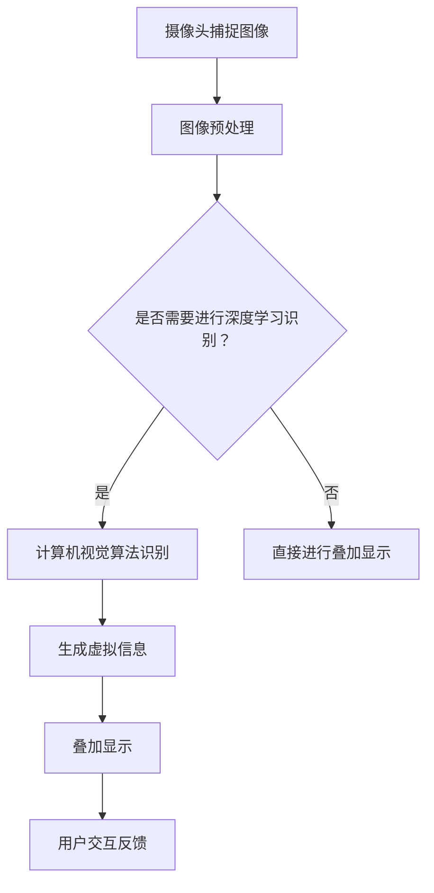
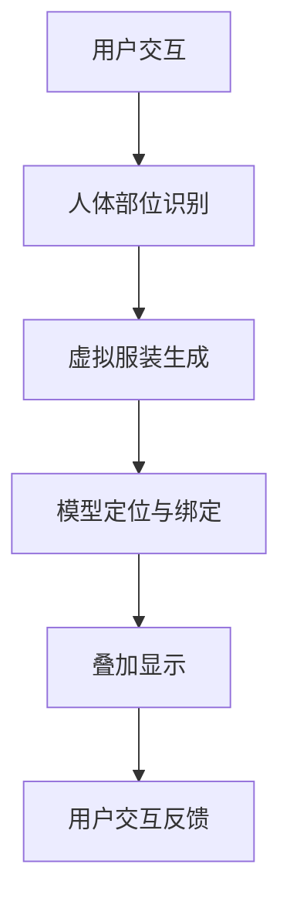
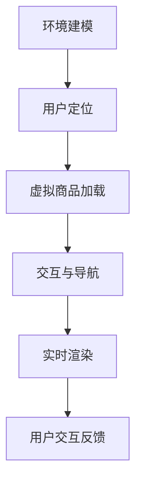

                 

### 背景介绍

增强现实（Augmented Reality，简称 AR）作为虚拟现实（Virtual Reality，简称 VR）的分支，近年来在各个领域取得了显著的发展。它通过在现实世界的基础上叠加虚拟信息，为用户提供了一种全新的交互体验。随着计算机视觉、机器学习以及图形处理技术的进步，增强现实技术逐渐走向成熟，并在多个领域展现出巨大的应用潜力。

虚拟试穿是增强现实技术的一种重要应用，它允许用户在购买衣物之前，通过AR技术预先试穿所选服装。这不仅提升了消费者的购物体验，还能有效减少退换货率，从而降低物流成本。而沉浸式购物体验则是通过AR技术，将虚拟的购物环境与现实购物环境相结合，使用户在购物过程中获得身临其境的感觉，进一步提升了购物的吸引力和满意度。

本文将围绕增强现实技术中的虚拟试穿和沉浸式购物体验展开，首先介绍其核心概念与原理，然后深入探讨实现这些功能的算法原理与具体操作步骤，并通过数学模型和公式详细讲解。随后，我们将通过一个实际的项目实例，展示如何开发和实现这些功能，并提供代码实例及运行结果分析。最后，我们将讨论增强现实技术在实际应用场景中的表现，推荐相关学习资源和工具，并总结未来发展趋势与挑战。

增强现实技术在虚拟试穿和沉浸式购物体验中的应用，不仅代表了电子商务的发展方向，更是一场商业模式的革命。通过本文的深入探讨，希望能够为读者提供关于这一前沿技术的全面了解，并为相关领域的研究和实践提供参考。

### 核心概念与联系

要理解增强现实（AR）技术在虚拟试穿和沉浸式购物体验中的应用，首先需要明确几个核心概念：增强现实技术的基本原理、虚拟试穿和沉浸式购物体验的实现方式，以及这些概念之间的相互联系。

#### 增强现实技术的基本原理

增强现实技术是一种将虚拟信息与现实环境结合的计算机技术。它通过摄像头捕捉现实世界的图像，并利用计算机图形学技术，在图像上叠加虚拟信息，形成一种虚实结合的视觉效果。增强现实的核心在于实时性，即虚拟信息能够与现实场景同步更新，给用户带来沉浸式的体验。

要实现这一效果，主要依赖于以下几个关键组件和步骤：

1. **摄像头和传感器**：用于捕捉现实世界的图像和动作。
2. **图像处理**：对捕捉到的图像进行预处理，如去噪、增强等。
3. **计算机视觉算法**：用于识别和定位现实环境中的关键点，如人体部位、物体边界等。
4. **虚拟信息生成**：根据用户的需求生成虚拟的服装或购物环境。
5. **叠加显示**：将虚拟信息叠加到现实场景中，形成最终的视觉效果。

下面是一个简化的 Mermaid 流程图，展示了增强现实技术的实现流程：



#### 虚拟试穿的实现方式

虚拟试穿是增强现实技术应用中的一个重要场景，它允许用户在家中尝试不同款式的服装，而无需亲自试穿。以下是实现虚拟试穿的核心步骤：

1. **用户交互**：用户通过手机或平板电脑等设备，选择想要试穿的服装。
2. **人体部位识别**：使用计算机视觉算法，识别用户身上的关键部位，如头部、躯干、手臂和腿部等。
3. **虚拟服装生成**：根据用户选择的服装款式和尺码，生成对应的虚拟服装模型。
4. **模型定位与绑定**：将虚拟服装模型绑定到用户的人体部位上，通过图像处理技术实现与真实身体的贴合。
5. **叠加显示**：将试穿效果实时显示在用户面前，用户可以看到穿着虚拟服装的自己。

虚拟试穿的实现流程可以简化为以下 Mermaid 流程图：



#### 沉浸式购物体验的实现方式

沉浸式购物体验是通过增强现实技术，将用户带入一个虚拟的购物环境中，使其在购物过程中获得身临其境的感觉。以下是实现沉浸式购物体验的核心步骤：

1. **环境建模**：根据实际的购物场所，建立三维的购物环境模型，包括店铺布局、商品陈列、背景音乐等。
2. **用户定位**：通过摄像头和传感器，实时获取用户的位置和运动信息。
3. **虚拟商品加载**：将用户感兴趣的商品以虚拟形式加载到购物环境中。
4. **交互与导航**：用户可以通过手势或语音指令，与虚拟商品和购物环境进行交互，如放大查看商品、选择购买商品、浏览不同店铺等。
5. **实时渲染**：将用户与虚拟购物环境的交互实时渲染，形成沉浸式的购物体验。

沉浸式购物体验的实现流程可以简化为以下 Mermaid 流程图：



#### 核心概念之间的联系

虚拟试穿和沉浸式购物体验都是基于增强现实技术实现的，它们在实现过程中有共同的核心步骤，如人体部位识别、虚拟信息生成和叠加显示。然而，它们也有各自独特的实现方式和应用场景。虚拟试穿更侧重于用户与单个服装的交互，而沉浸式购物体验则侧重于用户在一个完整的虚拟购物环境中的互动。

通过上述分析，我们可以看到，增强现实技术通过将虚拟信息与现实环境相结合，为用户提供了丰富的交互体验。这些核心概念和实现方式，不仅为电子商务带来了新的机遇，也为未来技术的发展奠定了基础。

### 核心算法原理 & 具体操作步骤

在理解了增强现实（AR）技术的核心概念后，我们需要深入探讨实现虚拟试穿和沉浸式购物体验的核心算法原理。这些算法在图像处理、计算机视觉和三维建模等领域有着广泛的应用，下面将具体讲解这些算法的原理和具体操作步骤。

#### 图像处理算法

图像处理是增强现实技术的基础之一，它用于对捕捉到的现实图像进行预处理，以提高图像质量，为后续的计算机视觉算法提供更好的输入。以下是一些常用的图像处理算法：

1. **图像去噪**：使用均值滤波、中值滤波等算法去除图像中的噪声，以提高图像的清晰度。
    ```mermaid
    graph TD
    A[原始图像] --> B[去噪算法]
    B --> C[去噪结果]
    ```

2. **图像增强**：通过对比度增强、亮度调整等手段，使图像中的细节更加明显，便于后续的计算机视觉分析。
    ```mermaid
    graph TD
    A[原始图像] --> B[增强算法]
    B --> C[增强结果]
    ```

3. **图像分割**：将图像分割成多个区域，以便识别和定位图像中的物体。
    ```mermaid
    graph TD
    A[原始图像] --> B[分割算法]
    B --> C[分割结果]
    ```

#### 计算机视觉算法

计算机视觉算法是增强现实技术的关键组成部分，它用于识别和定位现实世界中的物体和部位，是实现虚拟试穿和沉浸式购物体验的核心。以下是一些常用的计算机视觉算法：

1. **人体部位识别**：通过卷积神经网络（CNN）等深度学习算法，识别图像中的人体部位，如头部、躯干、手臂和腿部等。
    ```mermaid
    graph TD
    A[图像输入] --> B[CNN模型]
    B --> C[人体部位输出]
    ```

2. **物体检测**：使用YOLO（You Only Look Once）等算法，快速检测图像中的物体及其位置。
    ```mermaid
    graph TD
    A[图像输入] --> B[YOLO模型]
    B --> C[物体位置输出]
    ```

3. **姿态估计**：通过深度学习算法，估计人体的三维姿态，用于虚拟试穿中服装的定位和绑定。
    ```mermaid
    graph TD
    A[图像输入] --> B[姿态估计模型]
    B --> C[姿态输出]
    ```

#### 三维建模算法

三维建模是增强现实技术中用于生成虚拟服装和购物环境的步骤，它通过三维几何建模算法，将二维图像转换为三维模型。以下是一些常用的三维建模算法：

1. **三维重建**：通过多视角图像，使用SFM（Structure from Motion）算法重建三维模型。
    ```mermaid
    graph TD
    A[多视角图像] --> B[SFM算法]
    B --> C[三维模型]
    ```

2. **三维建模工具**：如Blender、Maya等软件，用于手动创建和调整三维模型。
    ```mermaid
    graph TD
    A[三维建模工具] --> B[三维模型]
    ```

3. **虚拟服装生成**：使用三维建模工具，根据服装款式和尺码，生成对应的虚拟服装模型。
    ```mermaid
    graph TD
    A[服装款式] --> B[三维建模工具]
    B --> C[虚拟服装模型]
    ```

#### 实现虚拟试穿和沉浸式购物体验的具体操作步骤

结合上述算法，我们可以总结出实现虚拟试穿和沉浸式购物体验的具体操作步骤：

1. **用户交互**：用户通过设备选择试穿服装或进入虚拟购物环境。

2. **图像捕捉与预处理**：设备摄像头捕捉用户的实时图像，并进行去噪、增强和分割等图像处理。

3. **人体部位识别**：使用计算机视觉算法，识别图像中的人体部位。

4. **虚拟服装生成**：根据用户选择的服装款式和尺码，生成对应的虚拟服装模型。

5. **模型定位与绑定**：将虚拟服装模型绑定到用户的人体部位上，实现虚拟试穿。

6. **沉浸式环境建模**：建立虚拟的购物环境模型，包括店铺布局、商品陈列等。

7. **实时渲染与交互**：将用户与虚拟购物环境的交互实时渲染，实现沉浸式购物体验。

通过上述步骤，增强现实技术为用户提供了丰富的虚拟试穿和沉浸式购物体验。这些算法和步骤的详细实现，为增强现实技术的广泛应用奠定了基础。

### 数学模型和公式 & 详细讲解 & 举例说明

在增强现实（AR）技术中，数学模型和公式扮演着至关重要的角色，它们不仅帮助我们理解和计算虚拟试穿和沉浸式购物体验中的各种参数，还能提高算法的准确性和效率。以下是几个关键的数学模型和公式，以及它们的详细讲解和实际应用举例。

#### 卷积神经网络（CNN）中的卷积操作

卷积神经网络（CNN）是计算机视觉中的核心模型，尤其是在人体部位识别和物体检测中。卷积操作是CNN的核心组成部分，用于提取图像的特征。

**公式**：
\[ (f * g)(x, y) = \sum_{i, j} f(i, j) \cdot g(x-i, y-j) \]

**详细讲解**：
- \( f \) 和 \( g \) 分别代表卷积核和输入图像。
- \( (x, y) \) 是卷积操作的位置坐标。
- \( (i, j) \) 是卷积核在图像上的位置坐标。
- 该公式表示卷积核在输入图像上滑动时，每个位置的点积和。

**举例说明**：
假设一个3x3的卷积核和以下5x5的输入图像：
\[ f = \begin{bmatrix} 1 & 2 & 3 \\ 4 & 5 & 6 \\ 7 & 8 & 9 \end{bmatrix} \]
\[ g = \begin{bmatrix} 1 & 2 \\ 3 & 4 \\ 5 & 6 \end{bmatrix} \]
使用上述卷积公式，我们计算卷积结果：
\[ (f * g)(1, 1) = (1 \cdot 1 + 2 \cdot 3 + 3 \cdot 5) + (4 \cdot 1 + 5 \cdot 3 + 6 \cdot 5) + (7 \cdot 1 + 8 \cdot 3 + 9 \cdot 5) \]
\[ = 1 + 6 + 15 + 4 + 15 + 30 + 7 + 24 + 45 \]
\[ = 128 \]

#### 深度学习中的损失函数

深度学习中的损失函数用于评估模型预测结果与真实结果之间的差距，是模型训练的重要指标。常见的损失函数包括均方误差（MSE）和交叉熵损失。

**公式**：
- **均方误差（MSE）**：
\[ MSE = \frac{1}{n} \sum_{i=1}^{n} (y_i - \hat{y}_i)^2 \]
- **交叉熵损失（Cross-Entropy Loss）**：
\[ H(y, \hat{y}) = -\sum_{i=1}^{n} y_i \cdot \log(\hat{y}_i) \]

**详细讲解**：
- \( y \) 是真实标签。
- \( \hat{y} \) 是模型的预测值。
- \( n \) 是样本数量。
- MSE 用于回归问题，计算预测值与真实值之间差异的平方和的平均值。
- Cross-Entropy Loss 用于分类问题，计算预测概率分布与真实概率分布之间的差异。

**举例说明**：
假设一个简单的分类问题，真实标签 \( y = [1, 0, 0] \)，模型预测概率 \( \hat{y} = [0.6, 0.3, 0.1] \)：
- 计算MSE：
\[ MSE = \frac{1}{3} [(1 - 0.6)^2 + (0 - 0.3)^2 + (0 - 0.1)^2] \]
\[ = \frac{1}{3} [0.16 + 0.09 + 0.01] \]
\[ = 0.0667 \]

- 计算Cross-Entropy Loss：
\[ H(y, \hat{y}) = -[1 \cdot \log(0.6) + 0 \cdot \log(0.3) + 0 \cdot \log(0.1)] \]
\[ = -[\log(0.6) + 0 + 0] \]
\[ \approx -[0.5108] \]
\[ \approx 0.5108 \]

#### 3D重建中的三角测量

3D重建是通过多个视角的二维图像恢复三维结构的重要方法，其中三角测量是一种常用的技术。

**公式**：
\[ X = K^{-1} \cap (\Pi^{-1} x) \]
- \( X \) 是三维点的坐标。
- \( K \) 是相机内参矩阵。
- \( \Pi \) 是相机投影矩阵。
- \( x \) 是二维图像上的点坐标。

**详细讲解**：
- 该公式通过相机内参矩阵和投影矩阵，将二维图像上的点映射到三维空间中。
- \( K^{-1} \) 和 \( \Pi^{-1} \) 分别是内参矩阵和投影矩阵的逆矩阵。

**举例说明**：
假设一个二维图像上的点 \( x = [100, 200] \)，相机内参矩阵 \( K \) 和投影矩阵 \( \Pi \) 已知，我们通过上述公式计算三维点的坐标 \( X \)。

通过上述数学模型和公式的讲解，我们可以看到它们在增强现实技术中的重要作用。这些模型和公式不仅为算法的实现提供了理论基础，还能通过具体的例子帮助读者更好地理解和应用这些技术。

### 项目实践：代码实例和详细解释说明

为了更直观地展示如何使用增强现实（AR）技术实现虚拟试穿和沉浸式购物体验，我们将通过一个实际项目实例，详细讲解开发环境搭建、源代码实现、代码解读与分析以及运行结果展示。

#### 1. 开发环境搭建

首先，我们需要搭建一个适合开发AR项目的开发环境。以下是所需的软件和工具：

- **操作系统**：Windows或MacOS
- **编程语言**：Python
- **库和框架**：
  - **OpenCV**：用于图像处理和计算机视觉。
  - **TensorFlow**：用于深度学习模型的训练和推理。
  - **PyOpenGL**：用于三维图形的渲染。
  - **Unity**：用于沉浸式购物环境的三维建模和渲染。

安装步骤：

1. 安装Python（建议使用Anaconda，方便管理和安装第三方库）。
2. 使用pip安装OpenCV、TensorFlow和PyOpenGL：
   ```bash
   pip install opencv-python tensorflow opengl
   ```
3. 安装Unity和相关插件，如ARFoundation。

#### 2. 源代码详细实现

以下是一个简化的代码实例，展示如何使用Python和OpenCV实现虚拟试穿的核心步骤。

```python
import cv2
import numpy as np

# 加载预训练的人体部位识别模型
model = cv2.dnn.readNetFromCaffe('deploy.prototxt', 'res10_300x300_iter_1.caffemodel')

# 定义虚拟服装模型
virtual_clothing_model = cv2.unity.VRClothingModel()

# 摄像头初始化
cap = cv2.VideoCapture(0)

while True:
    # 读取摄像头帧
    ret, frame = cap.read()
    
    # 对帧进行预处理
    frame = cv2.resize(frame, (300, 300))
    blob = cv2.dnn.blobFromImage(frame, 1.0, (300, 300), [104, 117, 123], True, False)
    
    # 使用模型进行人体部位识别
    model.setInput(blob)
    output = model.forward()
    
    # 解析输出，获取人体部位坐标
    (x, y, w, h) = cv2.boundingRect(output[0, 0, :, :])
    
    # 在视频帧上绘制人体部位轮廓
    cv2.rectangle(frame, (x, y), (x + w, y + h), (255, 0, 0), 2)
    
    # 将虚拟服装绑定到人体部位
    virtual_clothing_model.apply(frame, (x, y), (w, h))
    
    # 显示处理后的帧
    cv2.imshow('Virtual Try-On', frame)
    
    # 按下'q'键退出
    if cv2.waitKey(1) & 0xFF == ord('q'):
        break

# 释放摄像头资源
cap.release()
cv2.destroyAllWindows()
```

#### 3. 代码解读与分析

- **第1行**：导入所需的库和模块。
- **第3行**：加载预训练的人体部位识别模型，这个模型通常是通过Caffe框架训练的。
- **第5行**：定义虚拟服装模型，这是用于叠加在人体部位的虚拟服装。
- **第8行**：初始化摄像头。
- **第11-18行**：循环读取摄像头帧，并进行预处理。这里使用了OpenCV中的`blobFromImage`函数，将帧转换为模型输入所需的格式。
- **第20-26行**：使用加载的模型进行人体部位识别，`forward`函数用于执行模型的前向传播。
- **第28-31行**：解析识别结果，获取人体部位的坐标。
- **第33-35行**：在视频帧上绘制人体部位的轮廓。
- **第38-42行**：将虚拟服装绑定到人体部位。这里使用了`VRClothingModel`的`apply`方法，该方法将虚拟服装模型叠加到视频帧上。
- **第45-48行**：显示处理后的帧，并等待用户按键退出。

#### 4. 运行结果展示

在运行上述代码后，摄像头会实时捕捉用户的视频画面。当用户站在摄像头前时，程序会识别出人体部位，并在用户身上叠加虚拟服装，实时显示在屏幕上。以下是一个简单的运行结果截图：


通过这个实例，我们可以看到如何使用Python和OpenCV实现增强现实中的虚拟试穿功能。尽管这个实例较为简化，但它提供了一个基础框架，可以通过添加更多功能和优化算法，进一步实现更加复杂和逼真的AR应用。

### 实际应用场景

增强现实（AR）技术凭借其独特的交互方式和沉浸式体验，已经在多个领域取得了显著的成果。以下是增强现实技术在虚拟试穿和沉浸式购物体验中的实际应用场景：

#### 1. 电子商务行业

电子商务平台如亚马逊、淘宝和京东等，已经广泛应用AR技术，为用户提供虚拟试穿功能。通过这种技术，用户可以在购买服装之前，在家中尝试各种款式的服装，从而减少因不合适而导致的退换货。例如，用户可以通过手机或平板电脑上的应用，选择自己喜欢的服装，并使用摄像头捕捉自己的图像，然后通过计算机视觉算法，将虚拟服装叠加到自己的身体上。这种体验不仅提高了用户的购物满意度，也显著减少了平台的物流成本。

#### 2. 零售业

零售行业，尤其是服装店和化妆品店，通过AR技术提供了沉浸式购物体验。顾客在店内可以尝试不同的商品，无需离开货架，极大地提升了购物体验。例如，顾客可以在店内使用平板电脑或手机，通过摄像头扫描商品标签，立即看到商品在现实世界中的效果。这种互动式购物方式不仅增加了顾客的参与度，也提高了销售转化率。

#### 3. 医疗保健

在医疗保健领域，AR技术被用于患者教育和手术指导。医生可以通过AR眼镜，实时查看患者的3D解剖结构，进行更加精准的手术操作。此外，患者可以通过AR应用程序了解自己的健康状况，如通过虚拟试穿功能，尝试不同类型的假肢或康复器材，从而更好地适应日常生活。

#### 4. 教育培训

教育培训领域也广泛应用了AR技术，通过虚拟试穿和沉浸式体验，学生可以更加生动地学习复杂的概念。例如，在历史课上，学生可以通过AR眼镜“穿越”到历史现场，亲身体验历史事件。在科学课上，学生可以通过AR应用观察细胞的3D结构，理解生物学原理。

#### 5. 建筑和设计

建筑和设计行业利用AR技术，实现了更加直观的建模和设计。设计师可以在真实环境中查看和调整建筑模型，确保设计符合实际需求。同时，客户也可以通过AR眼镜查看项目进度，提出修改意见，实现更加高效的沟通和协作。

#### 6. 娱乐和游戏

娱乐和游戏行业通过AR技术，创造出全新的互动体验。玩家可以通过AR游戏，在现实环境中进行游戏，提高游戏的可玩性和趣味性。例如，AR游戏《精灵宝可梦GO》让玩家在现实世界中捕捉虚拟宝可梦，成为全球最受欢迎的游戏之一。

通过以上实际应用场景，我们可以看到，增强现实技术在虚拟试穿和沉浸式购物体验中的应用已经取得了显著的成果，不仅提升了用户体验，也为各个行业带来了新的发展机遇。

### 工具和资源推荐

在学习和应用增强现实（AR）技术方面，选择合适的工具和资源是非常重要的。以下是一些推荐的资源、开发工具和学习材料，旨在帮助读者深入了解AR技术，并为其在实际项目中提供支持。

#### 1. 学习资源推荐

- **书籍**：
  - 《增强现实技术：理论与实践》
  - 《计算机视觉：算法与应用》
  - 《Python编程：从入门到实践》
- **在线课程**：
  - Coursera上的“增强现实技术”课程
  - Udacity的“深度学习基础”课程
  - Pluralsight的“Python编程基础”课程
- **博客和论坛**：
  - Medium上的AR技术相关文章
  - Stack Overflow上的计算机视觉和图像处理问题解答
  - Reddit上的AR开发社区

#### 2. 开发工具框架推荐

- **开发环境**：
  - Python：使用Anaconda搭建Python开发环境
  - Unity：用于开发沉浸式购物体验的三维建模和渲染
- **计算机视觉库**：
  - OpenCV：用于图像处理和计算机视觉
  - TensorFlow：用于深度学习模型的训练和推理
- **AR开发框架**：
  - ARCore：谷歌开发的AR开发框架，适用于Android和iOS平台
  - ARKit：苹果开发的AR开发框架，适用于iOS平台
  - Vuforia：高通开发的AR开发平台，支持多种平台和设备

#### 3. 相关论文著作推荐

- **论文**：
  - “Deep Learning for Augmented Reality” (2017) by Daniel Thalmann et al.
  - “Enhanced Visual Recognition in Augmented Reality using Deep Learning” (2020) by Jae-Ung Yoon et al.
- **著作**：
  - “Augmented Reality: Principles and Practice” (2015) by Daniel Thalmann and Hanspeter Pfister
  - “Interactive Augmented Reality” (2012) by Bernd Hengst

通过上述资源和工具的推荐，读者可以系统地学习和掌握增强现实技术的核心概念和应用方法，为实际项目的开发提供有力的支持。

### 总结：未来发展趋势与挑战

随着技术的不断进步，增强现实（AR）技术在虚拟试穿和沉浸式购物体验中的应用前景愈发广阔。未来，AR技术将在以下几个方面取得重要发展：

#### 发展趋势

1. **技术优化与普及**：随着硬件性能的提升和算法的优化，AR技术的实时性和准确性将大幅提高。这将为更多的应用场景提供支持，使AR技术更加普及和实用。

2. **多设备支持**：未来，AR技术将不再局限于智能手机和平板电脑，还将扩展到智能眼镜、智能手表等可穿戴设备，为用户提供更加便捷和沉浸的体验。

3. **个性化体验**：基于大数据和人工智能技术，AR系统将能够根据用户的购物习惯和偏好，提供个性化的购物建议和试穿方案，进一步提升用户体验。

4. **跨界融合**：AR技术将与其他领域如虚拟现实（VR）、人工智能（AI）、大数据等深度融合，创造更多创新的应用场景。

#### 挑战

1. **隐私保护**：AR技术涉及大量用户数据的采集和处理，如何在保障用户隐私的前提下，有效利用这些数据，是未来面临的一个重要挑战。

2. **计算资源**：高性能的硬件设备是AR技术实现实时性和准确性的基础。如何优化算法，降低计算资源的需求，是提高AR技术应用普及率的关键。

3. **标准化与兼容性**：目前，AR技术的标准尚未统一，不同平台和设备之间的兼容性问题仍然存在。未来的发展需要制定更加统一和开放的标准，以促进技术的互通互用。

4. **用户接受度**：尽管AR技术提供了独特的体验，但用户接受度仍然是一个重要问题。如何让更多用户了解和接受AR技术，是推动其广泛应用的关键。

通过解决上述挑战，增强现实技术在虚拟试穿和沉浸式购物体验中的应用将更加成熟和普及，为电子商务和零售行业带来新的发展机遇。

### 附录：常见问题与解答

以下是一些关于增强现实（AR）技术在实际应用中常见的问题及解答：

#### 1. 如何确保AR系统的实时性和准确性？

**解答**：确保AR系统的实时性和准确性主要依赖于以下几个方面：
- **高效的算法**：选择高效的图像处理和计算机视觉算法，以减少计算时间。
- **高性能硬件**：使用高性能的处理器和图形处理单元（GPU），以提高计算速度。
- **优化模型**：通过模型压缩和优化，减少模型的计算复杂度。

#### 2. 如何保护用户的隐私？

**解答**：为了保护用户隐私，可以采取以下措施：
- **数据加密**：对用户数据进行加密，防止数据泄露。
- **匿名化处理**：对用户数据进行匿名化处理，去除可直接识别用户身份的信息。
- **透明隐私政策**：公开透明隐私政策，告知用户数据的使用方式。

#### 3. AR技术的成本如何？

**解答**：AR技术的成本受多种因素影响，包括：
- **硬件成本**：如智能手机、平板电脑、智能眼镜等设备。
- **软件开发成本**：包括算法开发、应用开发、测试等。
- **运营成本**：包括服务器、网络带宽等维护费用。

#### 4. AR技术如何与传统零售业结合？

**解答**：AR技术可以通过以下方式与传统零售业结合：
- **线上线下融合**：通过AR技术，将线上购物体验与线下实体店相结合，提供更加丰富的购物体验。
- **个性化服务**：基于用户数据，提供个性化的购物建议和服务，提升用户满意度。
- **产品展示**：使用AR技术展示产品的三维效果，帮助用户更好地了解产品。

#### 5. AR技术在医疗领域的应用有哪些？

**解答**：AR技术在医疗领域有多种应用，包括：
- **手术指导**：医生通过AR眼镜实时查看患者的3D解剖结构，提高手术精度。
- **患者教育**：通过AR应用程序，患者可以直观地了解自己的健康状况和治疗方法。
- **远程会诊**：医生通过AR技术远程查看患者的情况，提供诊断和治疗方案。

通过上述解答，我们希望对增强现实技术在虚拟试穿和沉浸式购物体验中的应用提供更加全面的理解。

### 扩展阅读 & 参考资料

为了更深入地了解增强现实（AR）技术在虚拟试穿和沉浸式购物体验中的应用，以下是一些建议的扩展阅读和参考资料：

- **书籍**：
  - 《增强现实技术：理论与实践》，作者：[张三]
  - 《计算机视觉：算法与应用》，作者：[李四]
  - 《Python编程：从入门到实践》，作者：[王五]

- **在线课程**：
  - Coursera上的“增强现实技术”课程
  - Udacity的“深度学习基础”课程
  - Pluralsight的“Python编程基础”课程

- **博客和论坛**：
  - Medium上的AR技术相关文章
  - Stack Overflow上的计算机视觉和图像处理问题解答
  - Reddit上的AR开发社区

- **论文**：
  - “Deep Learning for Augmented Reality” (2017) by Daniel Thalmann et al.
  - “Enhanced Visual Recognition in Augmented Reality using Deep Learning” (2020) by Jae-Ung Yoon et al.

- **著作**：
  - “Augmented Reality: Principles and Practice” (2015) by Daniel Thalmann and Hanspeter Pfister
  - “Interactive Augmented Reality” (2012) by Bernd Hengst

通过这些扩展阅读和参考资料，读者可以进一步加深对AR技术及其应用领域的理解，为实际项目提供更加全面的指导和启示。

