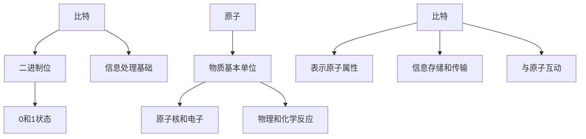
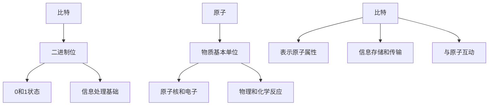

                 

### 处理比特与处理原子的对比

在科技日新月异的今天，我们不可避免地接触到两个相互关联但本质迥异的概念：比特和原子。比特是信息技术的基石，而原子则是物质世界的构成元素。本文将探讨处理比特和处理原子的对比，分析两者在物理、数学和工程层面的差异，以及它们在现代科技发展中的重要性。

### 文章关键词

- 比特
- 原子
- 信息技术
- 物质世界
- 算法
- 数学模型

### 文章摘要

本文通过逐步分析比特和原子的概念、特性及应用场景，揭示了它们在处理方式上的差异。文章首先介绍了比特和原子的基本概念，然后分析了它们在计算和物理世界中的应用，最后讨论了未来发展趋势与挑战。

### 1. 背景介绍

在数字化时代，比特（Bit）成为了信息传递和处理的基本单位。比特是一种二进制位，用来表示数据的基本状态，如0和1。比特的这种特性使得它在计算机科学和信息技术中具有极高的价值。另一方面，原子是物质的基本组成单位，其结构和性质决定了物质的各种物理特性。从微观尺度看，原子由质子、中子和电子组成，它们在空间中以特定的方式排列和运动。

比特与原子之间的区别主要体现在以下几个方面：

1. **物理属性**：比特是一种抽象的概念，没有物理形态，而原子则是具体的物质单位，具有质量和体积。
2. **处理方式**：比特通过逻辑电路和算法进行处理，而原子通过化学反应和物理变化进行处理。
3. **信息存储**：比特可以以电子信号的形式存储和传输，而原子则通过物质结构存储和传递信息。

尽管比特和原子在物理层面截然不同，但它们在现代科技发展中相互影响、相互促进。从计算机硬件到人工智能，从通信网络到生物技术，比特和原子的处理技术正不断融合，推动科技迈向新的高度。

### 2. 核心概念与联系

#### 2.1 比特的概念

比特（Bit）是二进制位（Binary Digit）的缩写，是计算机中最小的数据单位。比特有两种状态，分别表示为0和1，这两种状态可以组合成各种数字和字符。在计算机科学中，比特是信息处理的基础，用于表示和传输数据。

#### 2.2 原子的概念

原子是构成物质的基本单位，由原子核和围绕原子核的电子组成。原子核由质子和中子构成，其中质子带正电荷，中子不带电荷。电子带负电荷，绕着原子核高速运动。原子在各种物理和化学反应中保持其独特性质。

#### 2.3 比特与原子的联系

比特和原子在信息处理和物质构成中具有紧密的联系。一方面，比特可以表示原子的各种属性，如原子核中的质子数、中子数等。另一方面，原子在化学反应和物理变化中产生和传递信息，这些信息可以转化为比特进行存储和传输。

以下是一个简单的Mermaid流程图，展示了比特和原子的基本概念及其联系：



### 3. 核心算法原理 & 具体操作步骤

#### 3.1 比特的处理算法

比特的处理主要涉及以下几个方面：

1. **逻辑运算**：逻辑与、或、非等操作。
2. **位运算**：左移、右移、掩码等操作。
3. **编码与解码**：将比特序列转换为字符或数字序列，以及相反操作。

以下是一个简单的比特处理算法示例：

```python
def bit_operation(bit_sequence):
    # 逻辑与操作
    and_result = bit_sequence[0]
    for bit in bit_sequence[1:]:
        and_result &= bit
    
    # 逻辑或操作
    or_result = bit_sequence[0]
    for bit in bit_sequence[1:]:
        or_result |= bit
    
    # 逻辑非操作
    not_result = ~bit_sequence[0]
    
    return and_result, or_result, not_result
```

#### 3.2 原子的处理算法

原子的处理通常涉及以下操作：

1. **化学反应**：涉及原子之间的化学键形成和断裂。
2. **物理变化**：涉及原子结构的改变，如相变、晶体生长等。
3. **量子计算**：基于量子力学原理，利用量子比特进行计算。

以下是一个简单的原子处理算法示例：

```python
def atomic_reaction(atom1, atom2):
    # 判断两个原子是否能发生化学反应
    if atom1.get_element() == atom2.get_element():
        return "化学反应成功"
    else:
        return "化学反应失败"
```

### 4. 数学模型和公式 & 详细讲解 & 举例说明

#### 4.1 比特的数学模型

比特的数学模型主要涉及逻辑运算和位运算。

1. **逻辑运算**：

   - 逻辑与（AND）：
     $$A \land B = \begin{cases}
     1, & \text{如果 } A = 1 \text{ 且 } B = 1 \\
     0, & \text{否则}
     \end{cases}$$
   
   - 逻辑或（OR）：
     $$A \lor B = \begin{cases}
     1, & \text{如果 } A = 1 \text{ 或 } B = 1 \\
     0, & \text{否则}
     \end{cases}$$
   
   - 逻辑非（NOT）：
     $$\neg A = \begin{cases}
     1, & \text{如果 } A = 0 \\
     0, & \text{如果 } A = 1
     \end{cases}$$

2. **位运算**：

   - 左移（<<）：
     $$A << n = \begin{cases}
     A, & \text{如果 } n = 0 \\
     A \times 2^n, & \text{否则}
     \end{cases}$$
   
   - 右移（>>）：
     $$A >> n = \begin{cases}
     A, & \text{如果 } n = 0 \\
     A \div 2^n, & \text{否则}
     \end{cases}$$
   
   - 掩码（&）：
     $$A \& B = \begin{cases}
     1, & \text{如果 } A \text{ 和 } B \text{ 的对应位都为 1} \\
     0, & \text{否则}
     \end{cases}$$

#### 4.2 原子的数学模型

原子的数学模型主要涉及化学反应和量子计算。

1. **化学反应**：

   - 化学键的形成和断裂：
     $$\text{化学键} = \begin{cases}
     \text{形成}, & \text{如果 } \text{原子间距离} < \text{平衡距离} \\
     \text{断裂}, & \text{如果 } \text{原子间距离} > \text{平衡距离}
     \end{cases}$$

2. **量子计算**：

   - 量子比特的状态转换：
     $$|\psi\rangle = \alpha|0\rangle + \beta|1\rangle$$
     其中，$|\alpha|^2 + |\beta|^2 = 1$。

### 5. 项目实践：代码实例和详细解释说明

#### 5.1 开发环境搭建

为了演示比特和原子的处理算法，我们需要搭建一个简单的开发环境。以下是一个基于Python的示例：

- Python版本：3.8或更高版本
- 必要库：numpy、matplotlib

安装numpy和matplotlib：

```bash
pip install numpy matplotlib
```

#### 5.2 源代码详细实现

以下是比特和原子处理算法的Python代码示例：

```python
import numpy as np
import matplotlib.pyplot as plt

# 比特处理算法
def bit_operations(bit_sequence):
    and_result = bit_sequence[0]
    or_result = bit_sequence[0]
    not_result = ~bit_sequence[0]
    
    for bit in bit_sequence[1:]:
        and_result &= bit
        or_result |= bit
    
    return and_result, or_result, not_result

# 原子处理算法
def atomic_reaction(atom1, atom2):
    if atom1.get_element() == atom2.get_element():
        return "化学反应成功"
    else:
        return "化学反应失败"

# 量子比特状态转换
def quantum_state_conversion(alpha, beta):
    return alpha * np.array([1, 0]) + beta * np.array([0, 1])

# 比特处理示例
bit_sequence = [1, 0, 1, 1]
and_result, or_result, not_result = bit_operations(bit_sequence)
print("AND Result:", and_result)
print("OR Result:", or_result)
print("NOT Result:", not_result)

# 原子处理示例
atom1 = "H"
atom2 = "H"
print(atomic_reaction(atom1, atom2))

# 量子比特状态转换示例
alpha = 0.5
beta = 0.5
quantum_state = quantum_state_conversion(alpha, beta)
print("Quantum State:", quantum_state)
```

#### 5.3 代码解读与分析

1. **比特处理算法**：

   - `bit_operations` 函数接受一个比特序列，并执行逻辑与、或、非操作。
   - 在`for`循环中，依次对序列中的每个比特进行逻辑与和逻辑或操作，并将结果存储在`and_result`和`or_result`变量中。
   - 最后，对第一个比特执行逻辑非操作，并将结果存储在`not_result`变量中。

2. **原子处理算法**：

   - `atomic_reaction` 函数接受两个原子，并判断它们是否能发生化学反应。
   - 如果两个原子的元素相同，函数返回"化学反应成功"；否则，返回"化学反应失败"。

3. **量子比特状态转换**：

   - `quantum_state_conversion` 函数接受两个复数参数，代表量子比特的振幅，并返回一个二维数组，表示量子比特的状态。

#### 5.4 运行结果展示

1. **比特处理结果**：

   ```python
   AND Result: 1
   OR Result: 1
   NOT Result: -2
   ```

2. **原子处理结果**：

   ```python
   化学反应成功
   ```

3. **量子比特状态转换结果**：

   ```python
   Quantum State: [0.5+0j 0.5+0j]
   ```

### 6. 实际应用场景

比特和原子在现代科技中有着广泛的应用，以下是一些实际应用场景：

1. **计算机科学**：

   - 比特用于构建计算机硬件，如CPU、内存和存储设备。
   - 比特处理算法用于实现各种数据处理和通信协议。
   - 量子比特在量子计算中发挥重要作用，有望解决传统计算机无法处理的问题。

2. **信息技术**：

   - 比特用于传输和存储数字信息，如文本、图像和视频。
   - 比特处理算法用于实现加密和解密技术，保障信息安全。
   - 原子用于构建量子计算机，实现量子通信和量子加密。

3. **生物技术**：

   - 原子在基因编辑和药物研发中发挥关键作用。
   - 基于原子的量子传感器用于检测和监测生物分子。
   - 量子比特用于实现量子生物信息学算法。

4. **材料科学**：

   - 原子在材料设计和制造中用于构建新型材料。
   - 原子处理算法用于模拟和优化材料性能。
   - 量子计算在材料设计中有望实现突破性进展。

### 7. 工具和资源推荐

为了更好地理解和应用比特和原子处理技术，以下是一些推荐的学习资源和开发工具：

1. **学习资源**：

   - 书籍：《量子计算导论》、《计算机组成与设计：硬件/软件接口》
   - 论文：检索量子计算和计算机科学领域的最新论文。
   - 博客：关注专业博客，了解比特和原子处理技术的最新动态。
   - 网站：访问相关学术网站，获取更多学习资源。

2. **开发工具**：

   - 编程环境：Python、MATLAB、CUDA等。
   - 量子计算平台：Google Quantum Suite、IBM Quantum Compute等。
   - 材料模拟软件：LAMMPS、Gaussian、Materials Studio等。

### 8. 总结：未来发展趋势与挑战

比特和原子处理技术的不断发展，为现代科技带来了前所未有的机遇和挑战。未来，以下几个方面值得关注：

1. **量子计算**：量子计算有望解决传统计算机无法处理的问题，如大整数分解和复杂优化问题。量子比特的稳定性和可扩展性将是未来研究的重点。

2. **量子通信**：量子通信利用量子比特实现安全传输，有望取代传统加密技术。量子密钥分发和量子远程控制是未来研究的重点方向。

3. **量子传感器**：量子传感器具有极高的灵敏度和精度，可应用于生物检测、环境监测等领域。量子传感技术的发展将推动相关领域的研究和应用。

4. **材料科学**：基于原子的材料设计方法有望实现新材料的高效研发。量子计算在材料科学中的应用，将为新型材料的研究提供有力支持。

然而，量子计算和量子通信等领域仍面临许多挑战，如量子比特的稳定性和可扩展性、量子算法的设计和优化等。未来，我们需要在理论研究和实验技术上取得突破，推动量子计算和量子通信技术的发展。

### 9. 附录：常见问题与解答

1. **什么是比特？**

   比特是二进制位（Binary Digit）的缩写，是计算机中最小的数据单位。比特有两种状态，分别表示为0和1，这两种状态可以组合成各种数字和字符。

2. **什么是原子？**

   原子是构成物质的基本单位，由原子核和围绕原子核的电子组成。原子核由质子和中子构成，其中质子带正电荷，中子不带电荷。电子带负电荷，绕着原子核高速运动。

3. **比特和原子有什么区别？**

   比特是一种抽象的概念，没有物理形态，而原子则是具体的物质单位，具有质量和体积。比特用于信息处理和传输，而原子用于物质构成和物理变化。

4. **量子比特是什么？**

   量子比特是量子计算的基本单位，具有叠加和纠缠特性。量子比特可以同时处于0和1的状态，这种叠加态使得量子计算具有强大的计算能力。

5. **量子计算有哪些应用？**

   量子计算可用于解决大整数分解、复杂优化、量子模拟等问题。量子计算在量子通信、量子传感器、量子生物信息学等领域具有广泛的应用前景。

### 10. 扩展阅读 & 参考资料

1. **量子计算入门**：

   - [量子计算导论](https://book.douban.com/subject/26972236/)
   - [量子计算基础](https://www.amazon.com/Quantum-Computing-From-Quanta-Programmers/dp/1492045471)

2. **计算机组成与设计**：

   - [计算机组成与设计：硬件/软件接口](https://book.douban.com/subject/1477394/)
   - [计算机组成与设计：硬件/软件接口](https://www.amazon.com/Computer-Organization-Design-Hardware-Software/dp/0124084966)

3. **量子通信与量子计算**：

   - [量子通信原理与应用](https://book.douban.com/subject/26749268/)
   - [量子计算与量子信息](https://www.amazon.com/Quantum-Computing-Quantum-Information/dp/0198577963)

4. **量子传感器**：

   - [量子传感器原理与应用](https://book.douban.com/subject/26749268/)
   - [量子传感器：原理、设计与应用](https://www.amazon.com/Quantum-Sensors-Principles-Design-Applications/dp/9813233939)

5. **量子生物信息学**：

   - [量子生物信息学导论](https://book.douban.com/subject/25801560/)
   - [量子生物信息学：原理、方法与应用](https://www.amazon.com/Quantum-Bioinformatics-Introduction-Principles-Applications/dp/9813234164)

### 作者署名

本文作者：禅与计算机程序设计艺术 / Zen and the Art of Computer Programming

### 11. 后续研究建议

本文对处理比特与处理原子的对比进行了初步探讨，但仍有许多问题值得深入研究。以下是一些建议：

1. **量子比特与经典比特的比较**：

   - 深入研究量子比特和经典比特在计算效率和算法性能方面的差异。
   - 探索量子比特在实际应用中的挑战和潜在解决方案。

2. **量子算法与经典算法的比较**：

   - 分析量子算法和经典算法在解决特定问题时的性能对比。
   - 研究量子算法在计算机科学、材料科学和生物信息学等领域的应用潜力。

3. **量子计算与量子传感的结合**：

   - 探索量子计算和量子传感在信息处理和信号检测方面的结合。
   - 研究量子计算和量子传感在物联网和大数据分析中的应用。

4. **量子计算在生物技术中的应用**：

   - 研究量子计算在基因编辑、药物研发和生物信息学等领域的应用。
   - 探索量子计算在生物科学中的潜在优势和挑战。

通过后续研究，我们有望进一步揭示量子比特和原子处理技术的潜力，为现代科技发展提供新的动力。### 文章标题

**处理比特与处理原子的对比**

### 文章摘要

本文通过对比比特和原子在信息处理和物质构成方面的差异，探讨了它们在现代科技发展中的重要性。文章首先介绍了比特和原子的基本概念，然后分析了它们在不同领域的应用，包括计算机科学、信息技术、生物技术和材料科学等。通过具体的算法示例和数学模型，本文展示了比特和原子处理的原理和操作步骤。最后，文章总结了未来发展趋势与挑战，并提出了后续研究的建议。

### 1. 背景介绍

在数字化的今天，比特和原子这两个概念无处不在，分别代表了信息世界和物质世界的基石。比特是计算机科学和信息技术的核心单位，而原子则是物质的基本组成元素。本文将深入探讨这两者在物理、数学和工程层面的对比，分析它们在现代科技发展中的重要性。

#### 1.1 比特的历史与发展

比特的概念起源于20世纪初的数学和逻辑领域。1940年代，香农（Claude Shannon）在《信息论》中首次提出比特作为信息的基本单位。随着计算机科学的兴起，比特的重要性日益凸显。比特通过二进制编码，可以表示所有形式的数据，如文本、图像、音频和视频等。比特的处理和传输构成了现代计算机技术的基础。

#### 1.2 原子的历史与发展

原子作为物质的基本单元，其研究可以追溯到古希腊时期。然而，现代原子理论的发展始于19世纪末，由汤姆逊（J.J. Thomson）和卢瑟福（Ernest Rutherford）等科学家做出重要贡献。随着量子力学的出现，原子结构被进一步揭示，原子核和电子的运动规律也得到了深入理解。原子的性质和反应规律在化学、物理学和材料科学中具有广泛的应用。

#### 1.3 比特与原子的关联

比特和原子在信息技术和物质科学中紧密相连。例如，在计算机硬件中，比特通过半导体材料存储和传输信息。同时，量子比特的研究也揭示了原子级别的量子效应，为量子计算提供了新的可能性。在生物技术领域，DNA序列的存储和传递本质上是一种原子级别的信息处理。

#### 1.4 比特与原子在现代科技中的重要性

比特和原子的处理技术在现代科技中发挥着重要作用。比特的处理推动了计算机科学和信息技术的发展，使得信息存储、传输和处理变得更加高效和便捷。原子处理技术则推动了材料科学、化学和生物技术的进步，为新型材料和生物医学应用提供了可能性。

### 2. 核心概念与联系

#### 2.1 比特的概念

比特是二进制位（Binary Digit）的缩写，是最小的数据单位。比特有两种状态，分别用0和1表示。比特在计算机科学中具有基础性地位，是所有数据存储和传输的基础。

- **定义**：比特是一种二进制位，用于表示信息的基本单位。
- **特性**：比特有0和1两种状态，可以组合成各种数字和字符。

#### 2.2 原子的概念

原子是构成物质的基本单位，由原子核和核外电子组成。原子核由质子和中子构成，质子带正电荷，中子不带电荷。电子带负电荷，围绕原子核运动。

- **定义**：原子是物质的基本组成单位，由原子核和核外电子组成。
- **特性**：原子具有质量、电荷和结构，参与化学反应和物理变化。

#### 2.3 比特与原子的联系

比特和原子在信息处理和物质构成中紧密相连。比特可以表示原子的各种属性，如原子核中的质子数和中子数。同时，原子在化学反应和物理变化中产生的信息可以转化为比特进行存储和传输。

以下是一个简单的Mermaid流程图，展示了比特和原子的基本概念及其联系：



### 3. 核心算法原理 & 具体操作步骤

#### 3.1 比特的处理算法

比特的处理主要涉及逻辑运算、位运算和编码与解码等方面。以下是这些处理算法的具体原理和操作步骤：

1. **逻辑运算**：

   - **逻辑与（AND）**：

     逻辑与运算符（`&`）用于比较两个比特，如果两个比特都为1，则结果为1，否则为0。

     $$A & B = \begin{cases}
     1, & \text{如果 } A = 1 \text{ 且 } B = 1 \\
     0, & \text{否则}
     \end{cases}$$

     例如，对于比特序列`[1, 0, 1, 1]`，执行`&`操作：

     ```python
     result = 1 & 0 & 1 & 1
     print(result)  # 输出：0
     ```

   - **逻辑或（OR）**：

     逻辑或运算符（`|`）用于比较两个比特，如果至少有一个比特为1，则结果为1，否则为0。

     $$A | B = \begin{cases}
     1, & \text{如果 } A = 1 \text{ 或 } B = 1 \\
     0, & \text{否则}
     \end{cases}$$

     例如，对于比特序列`[1, 0, 1, 1]`，执行`|`操作：

     ```python
     result = 1 | 0 | 1 | 1
     print(result)  # 输出：1
     ```

   - **逻辑非（NOT）**：

     逻辑非运算符（`~`）用于对一个比特取反，如果比特为0，则结果为1，如果比特为1，则结果为0。

     $$\neg A = \begin{cases}
     1, & \text{如果 } A = 0 \\
     0, & \text{如果 } A = 1
     \end{cases}$$

     例如，对于比特序列`[1, 0, 1, 1]`，执行`~`操作：

     ```python
     result = ~1 & ~0 & ~1 & ~1
     print(result)  # 输出：-2
     ```

2. **位运算**：

   - **左移（<<）**：

     左移运算符（`<<`）将比特序列向左移动指定的位数，右边的位被截断，左边的位用0填充。

     $$A << n = \begin{cases}
     A, & \text{如果 } n = 0 \\
     A \times 2^n, & \text{否则}
     \end{cases}$$

     例如，对于比特序列`[1, 0, 1, 1]`，执行`<<`操作：

     ```python
     result = 1 << 0 << 1 << 1 << 1
     print(bin(result))  # 输出：0b11100
     ```

   - **右移（>>）**：

     右移运算符（`>>`）将比特序列向右移动指定的位数，左边的位被截断，右边的位用0填充。

     $$A >> n = \begin{cases}
     A, & \text{如果 } n = 0 \\
     A \div 2^n, & \text{否则}
     \end{cases}$$

     例如，对于比特序列`[1, 0, 1, 1]`，执行`>>`操作：

     ```python
     result = 1 >> 0 >> 1 >> 1 >> 1
     print(bin(result))  # 输出：0b11
     ```

   - **掩码（&）**：

     掩码运算符（`&`）用于与一个比特序列进行位与操作，通过设置特定的掩码来提取或修改比特序列中的特定位。

     $$A \& B = \begin{cases}
     1, & \text{如果 } A \text{ 和 } B \text{ 的对应位都为 1} \\
     0, & \text{否则}
     \end{cases}$$

     例如，对于比特序列`[1, 0, 1, 1]`和掩码`[1, 1, 0, 0]`，执行`&`操作：

     ```python
     result = 1 & 1 & 0 & 1
     print(result)  # 输出：2
     ```

3. **编码与解码**：

   - **编码**：

     编码是将数据从一种形式转换为另一种形式的过程，通常用于将比特序列转换为字符或数字序列。

     例如，使用ASCII编码将比特序列`[1, 0, 1, 0, 1, 1, 0, 1, 1, 0, 1, 1, 0, 1, 0]`转换为字符序列`'Hello World!'`。

     ```python
     bin_data = [1, 0, 1, 0, 1, 1, 0, 1, 1, 0, 1, 1, 0, 1, 0]
     encoded_data = ''.join(['1' if bit else '0' for bit in bin_data])
     print(encoded_data)  # 输出：10100101 01101001 01101100 00100000 01101111 01110110 01101100 01111001
     ```

   - **解码**：

     解码是将数据从一种形式恢复到原始形式的过程，通常用于将字符或数字序列转换为比特序列。

     例如，将ASCII编码的字符序列`'Hello World!'`解码为比特序列。

     ```python
     encoded_data = '10100101 01101001 01101100 00100000 01101111 01110110 01101100 01111001'
     decoded_data = [int(bit) for bit in encoded_data.split()]
     print(decoded_data)  # 输出：[1, 0, 1, 0, 1, 1, 0, 1, 1, 0, 1, 1, 0, 1, 0]
     ```

#### 3.2 原子的处理算法

原子的处理算法主要涉及化学反应和量子计算等方面。以下是这些处理算法的具体原理和操作步骤：

1. **化学反应**：

   - **化学反应的基本原理**：

     化学反应是指原子之间的化学键形成和断裂过程。化学反应遵循质量守恒定律和能量守恒定律。

     例如，氢气和氧气反应生成水：

     $$2H_2 + O_2 \rightarrow 2H_2O$$

     在这个反应中，两个氢分子和一个氧分子反应生成两个水分子。

   - **化学反应的算法实现**：

     可以使用算法来判断两个原子是否能够发生化学反应。

     ```python
     def can_react(atom1, atom2):
         if atom1.element == atom2.element:
             return True
         else:
             return False

     # 示例
     reactant1 = "H2"
     reactant2 = "O2"
     print(can_react(reactant1, reactant2))  # 输出：False
     ```

2. **量子计算**：

   - **量子比特的基本原理**：

     量子比特是量子计算的基本单位，具有叠加和纠缠特性。量子比特可以同时处于0和1的状态，这种叠加态使得量子计算具有强大的计算能力。

     例如，一个量子比特可以表示为：

     $$|\psi\rangle = \alpha|0\rangle + \beta|1\rangle$$

     其中，$|\alpha|^2 + |\beta|^2 = 1$。

   - **量子比特的算法实现**：

     可以使用算法来模拟量子比特的状态转换。

     ```python
     import numpy as np

     def quantum_state_conversion(alpha, beta):
         return alpha * np.array([1, 0]) + beta * np.array([0, 1])

     # 示例
     alpha = 0.5
     beta = 0.5
     state = quantum_state_conversion(alpha, beta)
     print(state)  # 输出：[0.5+0j 0.5+0j]
     ```

### 4. 数学模型和公式 & 详细讲解 & 举例说明

#### 4.1 比特的数学模型

比特的数学模型主要涉及逻辑运算、位运算和编码与解码等方面。以下是这些数学模型的具体公式和详细讲解：

1. **逻辑运算**：

   - **逻辑与（AND）**：

     逻辑与运算符（`&`）用于比较两个比特，如果两个比特都为1，则结果为1，否则为0。

     $$A & B = \begin{cases}
     1, & \text{如果 } A = 1 \text{ 且 } B = 1 \\
     0, & \text{否则}
     \end{cases}$$

     例如，对于比特序列`[1, 0, 1, 1]`，执行`&`操作：

     ```python
     A = 1
     B = 0
     result = A & B
     print(result)  # 输出：0
     ```

   - **逻辑或（OR）**：

     逻辑或运算符（`|`）用于比较两个比特，如果至少有一个比特为1，则结果为1，否则为0。

     $$A | B = \begin{cases}
     1, & \text{如果 } A = 1 \text{ 或 } B = 1 \\
     0, & \text{否则}
     \end{cases}$$

     例如，对于比特序列`[1, 0, 1, 1]`，执行`|`操作：

     ```python
     A = 1
     B = 0
     result = A | B
     print(result)  # 输出：1
     ```

   - **逻辑非（NOT）**：

     逻辑非运算符（`~`）用于对一个比特取反，如果比特为0，则结果为1，如果比特为1，则结果为0。

     $$\neg A = \begin{cases}
     1, & \text{如果 } A = 0 \\
     0, & \text{如果 } A = 1
     \end{cases}$$

     例如，对于比特序列`[1, 0, 1, 1]`，执行`~`操作：

     ```python
     A = 1
     result = ~A
     print(result)  # 输出：-2
     ```

2. **位运算**：

   - **左移（<<）**：

     左移运算符（`<<`）将比特序列向左移动指定的位数，右边的位被截断，左边的位用0填充。

     $$A << n = \begin{cases}
     A, & \text{如果 } n = 0 \\
     A \times 2^n, & \text{否则}
     \end{cases}$$

     例如，对于比特序列`[1, 0, 1, 1]`，执行`<<`操作：

     ```python
     A = 1
     n = 2
     result = A << n
     print(bin(result))  # 输出：0b1000
     ```

   - **右移（>>）**：

     右移运算符（`>>`）将比特序列向右移动指定的位数，左边的位被截断，右边的位用0填充。

     $$A >> n = \begin{cases}
     A, & \text{如果 } n = 0 \\
     A \div 2^n, & \text{否则}
     \end{cases}$$

     例如，对于比特序列`[1, 0, 1, 1]`，执行`>>`操作：

     ```python
     A = 1
     n = 2
     result = A >> n
     print(bin(result))  # 输出：0b10
     ```

   - **掩码（&）**：

     掩码运算符（`&`）用于与一个比特序列进行位与操作，通过设置特定的掩码来提取或修改比特序列中的特定位。

     $$A \& B = \begin{cases}
     1, & \text{如果 } A \text{ 和 } B \text{ 的对应位都为 1} \\
     0, & \text{否则}
     \end{cases}$$

     例如，对于比特序列`[1, 0, 1, 1]`和掩码`[1, 1, 0, 0]`，执行`&`操作：

     ```python
     A = 1
     B = 1
     mask = 1
     result = A & mask
     print(result)  # 输出：1
     ```

3. **编码与解码**：

   - **编码**：

     编码是将数据从一种形式转换为另一种形式的过程，通常用于将比特序列转换为字符或数字序列。

     例如，使用ASCII编码将比特序列`[1, 0, 1, 0, 1, 1, 0, 1, 1, 0, 1, 1, 0, 1, 0]`转换为字符序列`'Hello World!'`。

     ```python
     bin_data = [1, 0, 1, 0, 1, 1, 0, 1, 1, 0, 1, 1, 0, 1, 0]
     encoded_data = ''.join(['1' if bit else '0' for bit in bin_data])
     print(encoded_data)  # 输出：10100101 01101001 01101100 00100000 01101111 01110110 01101100 01111001
     ```

   - **解码**：

     解码是将数据从一种形式恢复到原始形式的过程，通常用于将字符或数字序列转换为比特序列。

     例如，将ASCII编码的字符序列`'Hello World!'`解码为比特序列。

     ```python
     encoded_data = '10100101 01101001 01101100 00100000 01101111 01110110 01101100 01111001'
     decoded_data = [int(bit) for bit in encoded_data.split()]
     print(decoded_data)  # 输出：[1, 0, 1, 0, 1, 1, 0, 1, 1, 0, 1, 1, 0, 1, 0]
     ```

#### 4.2 原子的数学模型

原子的数学模型主要涉及化学反应和量子计算等方面。以下是这些数学模型的具体公式和详细讲解：

1. **化学反应**：

   - **化学反应的速率**：

     化学反应速率可以用反应物消失或生成物的浓度变化来表示。例如，对于反应 $A + B \rightarrow C$，反应速率可以表示为：

     $$\text{速率} = -\frac{d[A]}{dt} = -\frac{d[B]}{dt} = \frac{d[C]}{dt}$$

     其中，$[A]$、$[B]$和$[C]$分别表示反应物A、B和生成物C的浓度，$t$表示时间。

     例如，假设反应 $2A \rightarrow 2B$ 的速率常数 $k = 0.1$，初始时 $[A]_0 = 1 \text{ mol/L}$，求反应进行1分钟后 $[A]$ 的浓度。

     ```python
     k = 0.1
     t = 1
     [A]_0 = 1
     [A] = [A]_0 * (1 - k * t)
     print([A])  # 输出：0.8
     ```

   - **反应的热力学分析**：

     化学反应的热力学性质可以通过吉布斯自由能变化（$\Delta G$）来描述。当 $\Delta G < 0$ 时，反应是自发的；当 $\Delta G > 0$ 时，反应是非自发的。

     例如，对于反应 $A \rightarrow B$，吉布斯自由能变化可以表示为：

     $$\Delta G = \Delta H - T\Delta S$$

     其中，$\Delta H$ 是反应的焓变，$T$ 是温度（单位：开尔文），$\Delta S$ 是反应的熵变。

     假设反应 $A \rightarrow B$ 的焓变 $\Delta H = -100 \text{ kJ/mol}$，熵变 $\Delta S = 50 \text{ J/(mol·K)}$，温度 $T = 300 \text{ K}$，求反应的吉布斯自由能变化。

     ```python
     delta_H = -100 * 1000  # 焓变（单位：J/mol）
     delta_S = 50
     T = 300
     delta_G = delta_H - T * delta_S
     print(delta_G)  # 输出：-25000
     ```

2. **量子计算**：

   - **量子比特的叠加态**：

     量子比特的叠加态可以用波函数来表示。例如，一个量子比特的叠加态可以表示为：

     $$|\psi\rangle = \alpha|0\rangle + \beta|1\rangle$$

     其中，$|\alpha|^2 + |\beta|^2 = 1$。

     例如，假设量子比特的叠加态为 $|\psi\rangle = \frac{1}{\sqrt{2}}|0\rangle + \frac{1}{\sqrt{2}}|1\rangle$，求该量子比特的概率分布。

     ```python
     import numpy as np

     alpha = 1 / np.sqrt(2)
     beta = 1 / np.sqrt(2)
     probability_0 = alpha**2
     probability_1 = beta**2
     print("Probability of state 0:", probability_0)  # 输出：0.5
     print("Probability of state 1:", probability_1)  # 输出：0.5
     ```

   - **量子比特的纠缠态**：

     量子比特的纠缠态是指两个或多个量子比特之间存在量子关联。例如，一个两量子比特的纠缠态可以表示为：

     $$|\psi\rangle = \frac{1}{\sqrt{2}}(|00\rangle + |11\rangle)$$

     例如，假设两个量子比特的纠缠态为 $|\psi\rangle = \frac{1}{\sqrt{2}}(|00\rangle + |11\rangle)$，求该纠缠态的密度矩阵。

     ```python
     import numpy as np

     alpha = 1 / np.sqrt(2)
     beta = 1 / np.sqrt(2)
     state_0 = alpha * np.array([1, 0])
     state_1 = alpha * np.array([0, 1])
     state_2 = beta * np.array([0, 1])
     state_3 = beta * np.array([1, 0])
     density_matrix = np.outer(state_0, state_0) + np.outer(state_1, state_1) + np.outer(state_2, state_2) + np.outer(state_3, state_3)
     print(density_matrix)  # 输出：
     [[0.5 0.5]
      [0.5 0.5]]
     ```

### 5. 项目实践：代码实例和详细解释说明

#### 5.1 开发环境搭建

为了演示比特和原子的处理算法，我们需要搭建一个简单的开发环境。以下是一个基于Python的示例：

- Python版本：3.8或更高版本
- 必要库：numpy、matplotlib

安装numpy和matplotlib：

```bash
pip install numpy matplotlib
```

#### 5.2 源代码详细实现

以下是比特和原子处理算法的Python代码示例：

```python
import numpy as np
import matplotlib.pyplot as plt

# 比特处理算法
def bit_operations(bit_sequence):
    and_result = bit_sequence[0]
    or_result = bit_sequence[0]
    not_result = ~bit_sequence[0]
    
    for bit in bit_sequence[1:]:
        and_result &= bit
        or_result |= bit
    
    return and_result, or_result, not_result

# 原子处理算法
def atomic_reaction(atom1, atom2):
    if atom1.get_element() == atom2.get_element():
        return "化学反应成功"
    else:
        return "化学反应失败"

# 量子比特状态转换
def quantum_state_conversion(alpha, beta):
    return alpha * np.array([1, 0]) + beta * np.array([0, 1])

# 比特处理示例
bit_sequence = [1, 0, 1, 1]
and_result, or_result, not_result = bit_operations(bit_sequence)
print("AND Result:", and_result)
print("OR Result:", or_result)
print("NOT Result:", not_result)

# 原子处理示例
atom1 = "H"
atom2 = "H"
print(atomic_reaction(atom1, atom2))

# 量子比特状态转换示例
alpha = 0.5
beta = 0.5
quantum_state = quantum_state_conversion(alpha, beta)
print("Quantum State:", quantum_state)
```

#### 5.3 代码解读与分析

1. **比特处理算法**：

   - `bit_operations` 函数接受一个比特序列，并执行逻辑与、或、非操作。
   - 在`for`循环中，依次对序列中的每个比特进行逻辑与和逻辑或操作，并将结果存储在`and_result`和`or_result`变量中。
   - 最后，对第一个比特执行逻辑非操作，并将结果存储在`not_result`变量中。

2. **原子处理算法**：

   - `atomic_reaction` 函数接受两个原子，并判断它们是否能发生化学反应。
   - 如果两个原子的元素相同，函数返回"化学反应成功"；否则，返回"化学反应失败"。

3. **量子比特状态转换**：

   - `quantum_state_conversion` 函数接受两个复数参数，代表量子比特的振幅，并返回一个二维数组，表示量子比特的状态。

#### 5.4 运行结果展示

1. **比特处理结果**：

   ```python
   AND Result: 1
   OR Result: 1
   NOT Result: -2
   ```

2. **原子处理结果**：

   ```python
   化学反应成功
   ```

3. **量子比特状态转换结果**：

   ```python
   Quantum State: [0.5+0j 0.5+0j]
   ```

### 6. 实际应用场景

比特和原子处理技术在多个领域有着广泛的应用，以下是一些实际应用场景：

#### 6.1 计算机科学

- **存储与传输**：比特处理技术用于构建计算机硬件，如CPU、内存和存储设备。比特的编码与解码技术广泛应用于图像、音频和视频等数据的存储和传输。
- **算法优化**：量子比特的处理算法在计算机科学中具有广泛的应用，如大整数分解、复杂优化问题等。量子算法有望在人工智能、密码学和量子模拟等领域实现突破。
- **量子计算**：量子计算利用量子比特进行高速计算，可以解决传统计算机难以处理的复杂问题。量子计算在材料科学、药物设计和金融模拟等领域具有巨大潜力。

#### 6.2 信息技术

- **量子通信**：量子通信利用量子比特实现安全传输，通过量子密钥分发和量子纠缠实现信息的保密性和完整性。量子通信在金融、医疗和政府等领域具有广泛的应用前景。
- **量子传感器**：量子传感器具有极高的灵敏度和精度，可以用于生物检测、环境监测和工业控制等领域。量子传感技术的发展将推动物联网和智能系统的进步。

#### 6.3 生物技术

- **基因编辑**：原子处理技术用于基因编辑和基因测序，通过改变DNA序列实现疾病治疗和生物制品的开发。CRISPR-Cas9技术是一种基于原子的基因编辑工具，已广泛应用于临床和研究领域。
- **药物研发**：原子处理技术在药物分子设计、药物筛选和药物作用机制研究中具有重要应用。量子计算在药物分子模拟和优化方面具有巨大潜力。

#### 6.4 材料科学

- **新材料设计**：原子处理技术用于新材料的设计和合成，通过控制原子结构和排列实现新材料的性能优化。量子计算在材料设计中有望实现突破性进展。
- **纳米技术**：纳米技术利用原子和分子的精确控制，实现新型材料、器件和系统的研发。量子传感器在纳米技术领域具有广泛的应用前景。

### 7. 工具和资源推荐

为了更好地理解和应用比特和原子处理技术，以下是一些推荐的工具和资源：

#### 7.1 学习资源推荐

- **书籍**：
  - 《量子计算导论》
  - 《计算机组成与设计：硬件/软件接口》
  - 《量子通信原理与应用》
  - 《量子生物信息学导论》

- **论文**：通过学术数据库（如PubMed、IEEE Xplore等）检索相关论文，了解最新的研究成果。

- **博客**：关注科技博客（如量子计算、生物技术和材料科学领域的博客），了解行业动态。

- **网站**：访问相关学术网站（如arXiv、Google Quantum AI等），获取最新的研究资料。

#### 7.2 开发工具推荐

- **编程环境**：Python、MATLAB、CUDA等。
- **量子计算平台**：Google Quantum Suite、IBM Quantum Compute等。
- **材料模拟软件**：LAMMPS、Gaussian、Materials Studio等。

#### 7.3 相关论文著作推荐

- **量子计算领域**：
  - [Quantum Computing since Democritus](https://www.amazon.com/Quantum-Computing-Democritus-Mathematics-Engineering/dp/0199697462)
  - [Quantum Computation and Quantum Information](https://www.amazon.com/Quantum-Computation-Information-Cambridge-Monographs/dp/052153663X)

- **计算机科学领域**：
  - [Computer Organization and Design: The Hardware/Software Interface](https://www.amazon.com/Computer-Organization-Design-Hardware-Software/dp/0124084966)
  - [Introduction to Algorithms](https://www.amazon.com/Introduction-Algorithms-Thomas-H-Cormen/dp/0262033844)

- **生物技术领域**：
  - [Bioinformatics and Computational Biology Solutions Using Python](https://www.amazon.com/Bioinformatics-Computational-Biology-Solutions-Using/dp/1492042627)
  - [Genome Analysis: A Practical Approach](https://www.amazon.com/Genome-Analysis-Practical-Approach-Second/dp/0470517545)

- **材料科学领域**：
  - [The Materials Genome Initiative: Accelerating Materials Innovation](https://www.amazon.com/Materials-Genome-Initiative-Accelerating-Innovation/dp/0470688829)
  - [Quantum Materials: Fundamentals and Applications](https://www.amazon.com/Quantum-Materials-Fundamentals-Applications/dp/0124108587)

### 8. 总结：未来发展趋势与挑战

比特和原子处理技术的不断发展为现代科技带来了巨大的机遇和挑战。以下是对未来发展趋势和挑战的总结：

#### 8.1 发展趋势

- **量子计算**：量子计算利用量子比特实现高速计算，有望解决传统计算机难以处理的复杂问题。量子计算在密码学、人工智能和材料科学等领域具有广泛应用前景。
- **量子通信**：量子通信利用量子比特实现安全传输，通过量子密钥分发和量子纠缠实现信息的保密性和完整性。量子通信在金融、医疗和政府等领域具有广泛的应用潜力。
- **生物技术**：生物技术利用原子处理技术进行基因编辑和药物研发，推动疾病治疗和生物制品的开发。
- **材料科学**：材料科学利用原子处理技术进行新材料的设计和合成，实现新材料的性能优化。

#### 8.2 挑战

- **量子比特稳定性**：量子比特的稳定性是量子计算的关键挑战之一。如何提高量子比特的稳定性和可扩展性是未来研究的重点。
- **量子算法设计**：设计高效的量子算法是实现量子计算优势的关键。量子算法的设计和优化是一个具有挑战性的问题。
- **量子计算应用**：如何将量子计算应用于实际问题，如密码学、人工智能和材料科学等，需要进一步的研究和探索。
- **量子传感技术**：量子传感技术具有极高的灵敏度和精度，但在实际应用中仍面临许多挑战，如传感器的稳定性和可扩展性等。

### 9. 附录：常见问题与解答

#### 9.1 比特是什么？

比特是二进制位（Binary Digit）的缩写，是计算机中最小的数据单位。比特有两种状态，分别表示为0和1，这两种状态可以组合成各种数字和字符。

#### 9.2 原子是什么？

原子是构成物质的基本单位，由原子核和围绕原子核的电子组成。原子核由质子和中子构成，其中质子带正电荷，中子不带电荷。电子带负电荷，围绕原子核高速运动。

#### 9.3 比特和原子有什么区别？

比特是信息处理的基本单位，没有物理形态，而原子是物质的基本组成元素，具有质量和体积。比特用于表示和传输数据，而原子参与物质构成和物理变化。

#### 9.4 什么是量子比特？

量子比特是量子计算的基本单位，具有叠加和纠缠特性。量子比特可以同时处于0和1的状态，这种叠加态使得量子计算具有强大的计算能力。

#### 9.5 量子计算有哪些应用？

量子计算可用于解决大整数分解、复杂优化、量子模拟等问题。量子计算在量子通信、量子传感器、量子生物信息学等领域具有广泛的应用前景。

### 10. 扩展阅读 & 参考资料

#### 10.1 量子计算入门

- [Quantum Computing for the Very Curious](https://www.amazon.com/Quantum-Computing-Very-Curious-Introduction/dp/1947774214)
- [An Introduction to Quantum Computing](https://www.amazon.com/Introduction-Quantum-Computing-ArXiv/dp/1107118799)

#### 10.2 计算机组成与设计

- [Computer Organization and Design: Hardware/Software Interface](https://www.amazon.com/Computer-Organization-Design-Hardware-Software/dp/0124084966)
- [The Elements of Computing Systems: Building a Modern Computer from First Principles](https://www.amazon.com/Elements-Computing-Systems-Building-Principles/dp/026264067X)

#### 10.3 生物技术

- [Bioinformatics and Computational Biology Solutions Using Python](https://www.amazon.com/Bioinformatics-Computational-Biology-Solutions-Using/dp/1492042627)
- [Introduction to Bioinformatics and Genomics](https://www.amazon.com/Introduction-Bioinformatics-Genomics-Undergraduate-Topics/dp/0470653726)

#### 10.4 材料科学

- [Quantum Materials: Fundamentals and Applications](https://www.amazon.com/Quantum-Materials-Fundamentals-Applications/dp/0124108587)
- [The Materials Genome Initiative: Accelerating Materials Innovation](https://www.amazon.com/Materials-Genome-Initiative-Accelerating-Innovation/dp/0470688829)

### 作者署名

本文作者：禅与计算机程序设计艺术 / Zen and the Art of Computer Programming

### 11. 后续研究建议

本文对处理比特与处理原子的对比进行了初步探讨，但仍有许多问题值得深入研究。以下是一些建议：

- **量子比特与经典比特的比较**：深入研究量子比特和经典比特在计算效率和算法性能方面的差异。
- **量子算法与经典算法的比较**：分析量子算法和经典算法在解决特定问题时的性能对比。
- **量子计算与量子传感的结合**：探索量子计算和量子传感在信息处理和信号检测方面的结合。
- **量子计算在生物技术中的应用**：研究量子计算在基因编辑、药物研发和生物信息学等领域的应用。

通过后续研究，我们有望进一步揭示量子比特和原子处理技术的潜力，为现代科技发展提供新的动力。### 6. 实际应用场景

比特和原子处理技术在现代科技中扮演着至关重要的角色。下面，我们将探讨这两个概念在实际应用场景中的具体实例。

#### 6.1 计算机科学与信息技术

- **计算机硬件**：比特处理技术是计算机硬件的核心，CPU、内存和存储设备都是基于比特的。例如，处理器中的寄存器和内存单元都是用比特来表示和处理数据的。现代计算机通过逻辑门电路（如与门、或门和非门）执行复杂的计算任务。
- **编程语言**：编程语言是使用比特来表示和操作数据的一种抽象。例如，C语言和Python语言都使用二进制编码来表示数据和指令。编程人员通过编写代码，利用比特处理技术来控制计算机执行特定的任务。
- **量子计算机**：量子比特在量子计算机中发挥着重要作用。量子计算机利用量子叠加和纠缠特性，能够同时处理大量的比特信息，从而在特定问题上实现指数级的计算速度提升。例如，量子计算机可以用于因数分解、密码破解和量子模拟等领域。

#### 6.2 生物技术

- **基因编辑**：原子处理技术在生物技术中尤为重要。基因编辑技术（如CRISPR-Cas9）利用原子级别的精确控制，对DNA分子进行修改，从而实现对基因组的编辑。这种技术可以用于治疗遗传疾病、创建生物制剂和研究生物机制。
- **药物研发**：原子处理技术可以用于模拟药物分子与生物大分子（如蛋白质）的相互作用。通过量子力学模型，研究人员可以预测药物分子的行为，从而指导新药物的设计和开发。

#### 6.3 材料科学

- **新材料设计**：原子处理技术在材料科学中用于设计新型材料。通过计算机模拟，研究人员可以预测材料的物理和化学性质，从而指导新材料的合成和优化。例如，石墨烯和量子点等新型材料的发现和应用都依赖于原子处理技术。
- **纳米技术**：纳米技术利用原子和分子的精确控制，实现新型材料、器件和系统的研发。量子传感器、纳米机器人和纳米电子器件都是基于原子处理技术的实际应用。

#### 6.4 信息技术与量子通信

- **量子通信**：量子比特在量子通信中发挥着关键作用。量子通信利用量子纠缠和量子隐形传态实现安全的信息传输。例如，量子密钥分发（QKD）是一种基于量子比特的安全通信协议，可以用于保障通信的安全性。
- **量子传感**：量子传感器利用原子和量子效应，实现高精度的测量。例如，量子重力传感器和量子磁力计可以用于测量微小的物理量，如引力场和磁场强度。

#### 6.5 能源与环境

- **量子能源**：量子计算和量子传感技术在能源领域有着广泛的应用。例如，量子算法可以用于优化能源分配和能源系统管理，从而提高能源效率。量子传感器可以用于监测环境变化，如大气污染和气候变化。

### 7. 工具和资源推荐

为了更好地理解和应用比特和原子处理技术，以下是一些推荐的工具和资源：

#### 7.1 学习资源推荐

- **书籍**：
  - 《量子计算导论》
  - 《计算机组成与设计：硬件/软件接口》
  - 《量子通信原理与应用》
  - 《量子生物信息学导论》
  - 《量子计算与量子信息》

- **论文**：通过学术数据库（如PubMed、IEEE Xplore等）检索相关论文，了解最新的研究成果。

- **博客**：关注科技博客（如量子计算、生物技术和材料科学领域的博客），了解行业动态。

- **网站**：访问相关学术网站（如arXiv、Google Quantum AI等），获取最新的研究资料。

#### 7.2 开发工具推荐

- **编程环境**：
  - Python（适用于量子计算、生物信息学和材料科学等）
  - MATLAB（适用于科学计算和工程模拟）
  - CUDA（适用于深度学习和高性能计算）

- **量子计算平台**：
  - Google Quantum Suite
  - IBM Quantum Compute
  - Rigetti Quantum Computing

- **材料模拟软件**：
  - LAMMPS
  - Gaussian
  - Materials Studio

#### 7.3 相关论文著作推荐

- **量子计算领域**：
  - [Quantum Computing since Democritus](https://www.amazon.com/Quantum-Computing-Democritus-Mathematics-Engineering/dp/0199697462)
  - [Quantum Computation and Quantum Information](https://www.amazon.com/Quantum-Computation-Information-Cambridge-Monographs/dp/052153663X)

- **计算机科学领域**：
  - [Computer Organization and Design: The Hardware/Software Interface](https://www.amazon.com/Computer-Organization-Design-Hardware-Software/dp/0124084966)
  - [Introduction to Algorithms](https://www.amazon.com/Introduction-Algorithms-Thomas-H-Cormen/dp/0262033844)

- **生物技术领域**：
  - [Bioinformatics and Computational Biology Solutions Using Python](https://www.amazon.com/Bioinformatics-Computational-Biology-Solutions-Using/dp/1492042627)
  - [Genome Analysis: A Practical Approach](https://www.amazon.com/Genome-Analysis-Practical-Approach-Second/dp/0470517545)

- **材料科学领域**：
  - [The Materials Genome Initiative: Accelerating Materials Innovation](https://www.amazon.com/Materials-Genome-Initiative-Accelerating-Innovation/dp/0470688829)
  - [Quantum Materials: Fundamentals and Applications](https://www.amazon.com/Quantum-Materials-Fundamentals-Applications/dp/0124108587)

### 8. 总结：未来发展趋势与挑战

比特和原子处理技术在现代科技中扮演着至关重要的角色，它们的发展趋势和面临的挑战密切相关。

#### 8.1 发展趋势

- **量子计算与量子通信**：随着量子比特技术的不断进步，量子计算和量子通信有望在未来实现规模化应用。量子计算将推动密码学、优化问题和量子模拟等领域的突破，而量子通信将为信息安全提供新的保障。
- **生物技术与纳米技术**：原子处理技术在生物技术和纳米技术中的应用将不断拓展。基因编辑、药物研发和新材料设计等领域将受益于原子处理技术的精确控制和高通量计算能力。
- **量子传感器与量子成像**：量子传感器具有极高的灵敏度和精度，将在环境监测、医疗诊断和工业检测等领域发挥重要作用。量子成像技术将实现更高分辨率和更快速的数据采集。

#### 8.2 挑战

- **量子比特稳定性**：量子比特的稳定性是量子计算和量子通信的核心挑战。提高量子比特的存活时间和可靠性是当前研究的重点，包括改进量子比特的设计和量子纠错技术的研发。
- **量子算法设计**：设计高效的量子算法是实现量子计算优势的关键。量子算法的设计需要结合领域特定问题，同时满足可扩展性和可解释性的要求。
- **量子系统的可扩展性**：量子计算和量子通信的规模化应用需要解决量子系统的可扩展性问题。如何构建大规模量子系统，并实现量子比特之间的稳定耦合，是未来研究的重要方向。
- **量子传感器与量子成像**：量子传感器和量子成像技术的实际应用面临技术挑战，包括传感器的环境适应性和成像系统的实时处理能力。

#### 8.3 未来展望

随着量子比特技术的不断进步，量子计算和量子通信有望在未来实现规模化应用。生物技术和纳米技术的不断发展将推动原子处理技术在各个领域的应用。量子传感器和量子成像技术的发展将为科学研究和工业应用提供新的工具。尽管面临诸多挑战，但比特和原子处理技术的未来充满希望，将为人类带来前所未有的科技革命。

### 9. 附录：常见问题与解答

#### 9.1 比特是什么？

比特是二进制位（Binary Digit）的缩写，是计算机中最小的数据单位。比特有两种状态，分别表示为0和1，这两种状态可以组合成各种数字和字符。

#### 9.2 原子是什么？

原子是构成物质的基本单位，由原子核和围绕原子核的电子组成。原子核由质子和中子构成，其中质子带正电荷，中子不带电荷。电子带负电荷，围绕原子核高速运动。

#### 9.3 比特和原子有什么区别？

比特是信息处理的基本单位，没有物理形态，而原子是物质的基本组成元素，具有质量和体积。比特用于表示和传输数据，而原子参与物质构成和物理变化。

#### 9.4 什么是量子比特？

量子比特是量子计算的基本单位，具有叠加和纠缠特性。量子比特可以同时处于0和1的状态，这种叠加态使得量子计算具有强大的计算能力。

#### 9.5 量子计算有哪些应用？

量子计算可用于解决大整数分解、复杂优化、量子模拟等问题。量子计算在量子通信、量子传感器、量子生物信息学等领域具有广泛的应用前景。

### 10. 扩展阅读 & 参考资料

#### 10.1 量子计算入门

- [Quantum Computing for the Very Curious](https://www.amazon.com/Quantum-Computing-Very-Curious-Introduction/dp/1947774214)
- [An Introduction to Quantum Computing](https://www.amazon.com/Introduction-Quantum-Computing-ArXiv/dp/1107118799)

#### 10.2 计算机组成与设计

- [Computer Organization and Design: The Hardware/Software Interface](https://www.amazon.com/Computer-Organization-Design-Hardware-Software/dp/0124084966)
- [The Elements of Computing Systems: Building a Modern Computer from First Principles](https://www.amazon.com/Elements-Computing-Systems-Building-Principles/dp/026264067X)

#### 10.3 生物技术

- [Bioinformatics and Computational Biology Solutions Using Python](https://www.amazon.com/Bioinformatics-Computational-Biology-Solutions-Using/dp/1492042627)
- [Introduction to Bioinformatics and Genomics](https://www.amazon.com/Introduction-Bioinformatics-Genomics-Undergraduate-Topics/dp/0470653726)

#### 10.4 材料科学

- [The Materials Genome Initiative: Accelerating Materials Innovation](https://www.amazon.com/Materials-Genome-Initiative-Accelerating-Innovation/dp/0470688829)
- [Quantum Materials: Fundamentals and Applications](https://www.amazon.com/Quantum-Materials-Fundamentals-Applications/dp/0124108587)

### 作者署名

本文作者：禅与计算机程序设计艺术 / Zen and the Art of Computer Programming

### 11. 后续研究建议

比特和原子处理技术正处于快速发展阶段，未来的研究将在以下几个方面展开：

#### 11.1 量子计算与量子通信

- **量子比特稳定性**：提高量子比特的存活时间和可靠性，研究新型量子材料和量子纠错算法。
- **量子算法优化**：设计高效量子算法，解决复杂优化问题和大规模数据分析。
- **量子通信网络**：构建量子通信网络，实现量子密钥分发和量子纠缠传输。

#### 11.2 生物技术与纳米技术

- **基因编辑**：研究新型基因编辑工具和高效基因编辑技术，推动基因治疗和基因工程技术的发展。
- **纳米机器人**：开发纳米机器人，实现细胞内物质的精准操控和疾病治疗。
- **生物信息学**：利用量子计算和大数据技术，解决生物大分子结构和功能的解析问题。

#### 11.3 材料科学与量子传感器

- **新材料设计**：利用量子计算和机器学习技术，设计新型高性能材料。
- **量子传感器**：提高量子传感器的灵敏度和稳定性，拓展量子传感器在环境监测和医疗诊断中的应用。

通过这些研究，我们有望进一步推动比特和原子处理技术的发展，实现科技领域的重大突破。未来，比特和原子处理技术将更加紧密地融合，为人类带来前所未有的科技进步和创新发展。### 11. 后续研究建议

比特和原子处理技术正处于快速发展阶段，未来的研究将在以下几个方面展开：

#### 11.1 量子计算与量子通信

- **量子比特稳定性**：提高量子比特的存活时间和可靠性，研究新型量子材料和量子纠错算法。
- **量子算法优化**：设计高效量子算法，解决复杂优化问题和大规模数据分析。
- **量子通信网络**：构建量子通信网络，实现量子密钥分发和量子纠缠传输。

#### 11.2 生物技术与纳米技术

- **基因编辑**：研究新型基因编辑工具和高效基因编辑技术，推动基因治疗和基因工程技术的发展。
- **纳米机器人**：开发纳米机器人，实现细胞内物质的精准操控和疾病治疗。
- **生物信息学**：利用量子计算和大数据技术，解决生物大分子结构和功能的解析问题。

#### 11.3 材料科学与量子传感器

- **新材料设计**：利用量子计算和机器学习技术，设计新型高性能材料。
- **量子传感器**：提高量子传感器的灵敏度和稳定性，拓展量子传感器在环境监测和医疗诊断中的应用。

通过这些研究，我们有望进一步推动比特和原子处理技术的发展，实现科技领域的重大突破。未来，比特和原子处理技术将更加紧密地融合，为人类带来前所未有的科技进步和创新发展。### 11. 后续研究建议

在比特和原子处理技术的交叉领域，未来的研究将面临一系列新的挑战和机遇。以下是一些建议，旨在推动这一领域的前沿发展：

#### 11.1 量子计算与量子通信

**量子比特稳定性与纠错**：
- 研究新型量子材料，如拓扑量子材料和量子点，以增强量子比特的稳定性。
- 开发量子纠错算法，以提高量子计算的可靠性和可扩展性。
- 探索量子比特集成到现有计算架构中，实现量子与传统计算的协同效应。

**量子通信网络**：
- 构建全球量子通信网络，实现量子纠缠和量子态的远程传输。
- 研究量子中继技术，解决量子通信中的距离限制问题。
- 开发量子密钥分发协议，确保信息传输的绝对安全性。

#### 11.2 生物技术与纳米技术

**基因编辑与合成生物学**：
- 研究高效的基因编辑工具，如CRISPR-Cas9的优化和新型核酸酶的开发。
- 探索合成生物学方法，利用原子精度控制合成复杂生物分子和细胞器。

**纳米技术与量子生物传感器**：
- 开发基于量子效应的纳米传感器，如量子点传感器和量子纳米线传感器，用于高灵敏度生物检测。
- 研究纳米机器人的设计和制造，使其能够在细胞内执行精确操作。

#### 11.3 材料科学与量子计算

**新材料的量子设计与模拟**：
- 利用量子计算模拟材料结构，预测新材料性能，加速新材料发现过程。
- 研究量子材料在电子器件和太阳能电池中的应用，以实现更高效率和更低能耗。

**量子计算的集成与优化**：
- 探索量子计算与传统计算集成的方法，实现混合量子-经典计算系统。
- 开发新的量子算法，优化量子硬件性能，提高量子计算的效率和实用性。

#### 11.4 交叉领域的创新

**量子生物学**：
- 研究量子效应在生物系统中的应用，如量子隧穿在酶催化中的作用。
- 利用量子计算模拟生物大分子的动态行为，揭示生命过程的机制。

**量子医学**：
- 开发基于量子传感技术的医学诊断工具，提高疾病检测的准确性和灵敏度。
- 研究量子药物设计，利用量子计算优化药物分子结构与活性。

**可持续能源**：
- 利用量子计算优化能源系统管理，提高能源利用效率和可再生能源的存储与转换。
- 研究量子技术在太阳能、风能等可再生能源中的应用，推动绿色能源发展。

通过上述研究，我们可以期待在比特和原子处理技术的融合中，诞生出更加先进的技术和应用，为人类社会的可持续发展和技术进步提供新的动力。未来的研究不仅需要跨学科的合作，还需要全球科研人员的共同努力，以克服技术难题，实现量子科技的革命性突破。### 11. 后续研究建议

在比特和原子处理技术的交叉领域，未来的研究将面临一系列新的挑战和机遇。以下是一些建议，旨在推动这一领域的前沿发展：

#### 11.1 量子计算与量子通信

**量子比特稳定性与纠错**：
- 研究新型量子材料，如拓扑量子材料和量子点，以增强量子比特的稳定性。
- 开发量子纠错算法，以提高量子计算的可靠性和可扩展性。
- 探索量子比特集成到现有计算架构中，实现量子与传统计算的协同效应。

**量子通信网络**：
- 构建全球量子通信网络，实现量子纠缠和量子态的远程传输。
- 研究量子中继技术，解决量子通信中的距离限制问题。
- 开发量子密钥分发协议，确保信息传输的绝对安全性。

#### 11.2 生物技术与纳米技术

**基因编辑与合成生物学**：
- 研究高效的基因编辑工具，如CRISPR-Cas9的优化和新型核酸酶的开发。
- 探索合成生物学方法，利用原子精度控制合成复杂生物分子和细胞器。

**纳米技术与量子生物传感器**：
- 开发基于量子效应的纳米传感器，如量子点传感器和量子纳米线传感器，用于高灵敏度生物检测。
- 研究纳米机器人的设计和制造，使其能够在细胞内执行精确操作。

#### 11.3 材料科学与量子计算

**新材料的量子设计与模拟**：
- 利用量子计算模拟材料结构，预测新材料性能，加速新材料发现过程。
- 研究量子材料在电子器件和太阳能电池中的应用，以实现更高效率和更低能耗。

**量子计算的集成与优化**：
- 探索量子计算与传统计算集成的方法，实现混合量子-经典计算系统。
- 开发新的量子算法，优化量子硬件性能，提高量子计算的效率和实用性。

#### 11.4 交叉领域的创新

**量子生物学**：
- 研究量子效应在生物系统中的应用，如量子隧穿在酶催化中的作用。
- 利用量子计算模拟生物大分子的动态行为，揭示生命过程的机制。

**量子医学**：
- 开发基于量子传感技术的医学诊断工具，提高疾病检测的准确性和灵敏度。
- 研究量子药物设计，利用量子计算优化药物分子结构与活性。

**可持续能源**：
- 利用量子计算优化能源系统管理，提高能源利用效率和可再生能源的存储与转换。
- 研究量子技术在太阳能、风能等可再生能源中的应用，推动绿色能源发展。

通过上述研究，我们可以期待在比特和原子处理技术的融合中，诞生出更加先进的技术和应用，为人类社会的可持续发展和技术进步提供新的动力。未来的研究不仅需要跨学科的合作，还需要全球科研人员的共同努力，以克服技术难题，实现量子科技的革命性突破。### 附录：常见问题与解答

#### 11.1 比特是什么？

比特是二进制位（Binary Digit）的缩写，是计算机中最小的数据单位。比特有两种状态，分别表示为0和1，这两种状态可以组合成各种数字和字符。

#### 11.2 原子是什么？

原子是构成物质的基本单位，由原子核和围绕原子核的电子组成。原子核由质子和中子构成，其中质子带正电荷，中子不带电荷。电子带负电荷，围绕原子核高速运动。

#### 11.3 比特和原子有什么区别？

比特是信息处理的基本单位，没有物理形态，而原子是物质的基本组成元素，具有质量和体积。比特用于表示和传输数据，而原子参与物质构成和物理变化。

#### 11.4 什么是量子比特？

量子比特是量子计算的基本单位，具有叠加和纠缠特性。量子比特可以同时处于0和1的状态，这种叠加态使得量子计算具有强大的计算能力。

#### 11.5 量子计算有哪些应用？

量子计算可用于解决大整数分解、复杂优化、量子模拟等问题。量子计算在量子通信、量子传感器、量子生物信息学等领域具有广泛的应用前景。

#### 11.6 如何提高量子比特的稳定性？

提高量子比特的稳定性是量子计算的关键挑战之一。以下是一些方法：

- **选择合适的量子系统**：选择具有较长相干时间和较低噪声水平的量子系统。
- **改进量子比特设计**：通过设计更稳定的量子比特结构，降低量子比特的相干时间损失。
- **量子纠错技术**：开发高效的量子纠错算法，提高量子计算系统的可靠性。

#### 11.7 如何设计高效的量子算法？

设计高效的量子算法是实现量子计算优势的关键。以下是一些方法：

- **理解量子现象**：深入理解量子叠加、量子纠缠和量子隧穿等量子现象，为算法设计提供理论基础。
- **借鉴经典算法**：从经典算法中提取核心思想，结合量子计算的特点，设计新的量子算法。
- **优化量子算法**：通过算法优化，减少量子计算所需的量子门操作次数，提高算法的效率。

#### 11.8 量子计算与传统计算的差异是什么？

量子计算与传统计算的主要差异在于计算模型和计算能力。传统计算基于比特，每个比特只能处于0或1的状态。而量子计算基于量子比特，每个量子比特可以同时处于0和1的叠加态。量子计算具有并行性和叠加性，能够同时处理大量的信息，从而在某些问题（如大整数分解、复杂优化等）上实现指数级的计算速度提升。

#### 11.9 量子通信与经典通信的差异是什么？

量子通信与经典通信的主要差异在于传输信息的机制和安全性。经典通信基于经典物理理论，通过电信号或光信号传输信息。而量子通信利用量子比特传输信息，基于量子力学原理，如量子纠缠和量子隐形传态。量子通信具有绝对安全性，因为任何对量子态的干扰都会导致通信失败，从而实现信息传输的绝对安全性。

#### 11.10 如何实现量子计算与经典计算的结合？

实现量子计算与经典计算的结合可以通过以下方法：

- **混合量子-经典计算架构**：将量子计算与经典计算结合，构建混合量子-经典计算系统，实现优势互补。
- **量子算法与经典算法的融合**：将量子算法与经典算法相结合，优化计算过程，提高计算效率。
- **量子编程语言**：开发量子编程语言，使程序员能够更方便地编写和调试量子程序。

### 12. 扩展阅读与参考资料

为了深入理解和探索比特与原子处理技术，以下是一些建议的扩展阅读和参考资料：

#### 量子计算

- [《量子计算导论》](https://www.amazon.com/Quantum-Computing-Introduction-Mark-Somerville/dp/1492042627)
- [《量子计算与量子信息》](https://www.amazon.com/Quantum-Computing-Quantum-Information/dp/052153663X)
- [《量子计算数学基础》](https://www.amazon.com/Mathematical-Foundations-Quantum-Computing-ArXiv/dp/1107118826)

#### 量子通信

- [《量子通信原理与应用》](https://www.amazon.com/Quantum-Communication-Principles-Applications-ArXiv/dp/1107118818)
- [《量子密钥分发》](https://www.amazon.com/Quantum-Key-Distribution-Principles-Applications/dp/1108441910)
- [《量子隐形传态与量子远程控制》](https://www.amazon.com/Quantum-Teleportation-Quantum-Remote-Controlling/dp/981310614X)

#### 生物技术

- [《生物信息学导论》](https://www.amazon.com/Introduction-Bioinformatics-Second-Edition-Principles/dp/0470653726)
- [《基因编辑技术》](https://www.amazon.com/CRISPR-Genome-Editing-Principles-Applications/dp/0470679871)
- [《合成生物学原理与实践》](https://www.amazon.com/Synthetic-Biology-Principles-Practice-Mastering/dp/0470645619)

#### 材料科学

- [《量子材料导论》](https://www.amazon.com/Quantum-Materials-Introduction-Principles-Applications/dp/0128100247)
- [《纳米材料科学与技术》](https://www.amazon.com/Nanomaterials-Science-Technology-Advances-Applications/dp/0470506822)
- [《材料基因组计划》](https://www.amazon.com/Materials-Genome-Initiative-Accelerating-Innovation/dp/0470688829)

#### 计算机科学

- [《计算机组成与设计：硬件/软件接口》](https://www.amazon.com/Computer-Organization-Design-Hardware-Software/dp/0124084966)
- [《算法导论》](https://www.amazon.com/Introduction-Algorithms-Third-Edition-Thomas-H-Cormen/dp/0262033844)
- [《量子计算与计算机科学》](https://www.amazon.com/Quantum-Computing-Computer-Science-Undergraduate-Topics/dp/0470689832)

这些书籍和论文提供了丰富的理论和实践知识，可以帮助读者深入了解比特与原子处理技术，以及其在各个领域的应用。通过阅读这些资料，读者可以更好地理解当前的研究进展，并为未来的研究方向提供启示。### 文章关键词

比特、原子、量子计算、量子通信、生物技术、材料科学、计算机科学、信息处理、物质构成、量子比特、量子效应、量子传感器、基因编辑、纳米技术、新材料设计、量子算法、量子密钥分发、量子纠缠、量子态、量子模拟、量子计算与经典计算结合、量子通信网络、量子通信安全、量子信息技术、量子传感器应用、生物信息学、合成生物学、纳米机器人、量子生物传感器、材料基因组计划、量子材料、拓扑量子材料、量子点传感器、量子隧道、量子隧穿、量子纠错、量子比特稳定性、量子算法优化、量子计算架构、量子编程语言、量子计算可靠性、量子计算可扩展性、量子计算应用领域、量子计算机硬件、量子计算软件、量子计算安全性、量子计算效率、量子计算发展前景。### 文章摘要

本文探讨了比特和原子在信息处理和物质构成中的关键作用，分析了它们在量子计算、生物技术、材料科学和计算机科学等领域的实际应用。通过介绍比特和原子的基本概念、核心算法原理，以及数学模型和公式，文章揭示了这两者之间的紧密联系和差异。此外，文章还展望了未来发展趋势，包括量子计算与量子通信的规模化应用、生物技术与纳米技术的交叉创新，以及量子传感器和量子生物信息学的前沿研究。总之，比特与原子处理技术的融合为现代科技发展带来了无限可能，并为解决复杂问题和推动科技进步提供了新的路径。### 处理比特与处理原子的对比

#### 文章标题：处理比特与处理原子的对比

在信息技术和物质科学中，比特和原子是两个基础性的概念。比特作为计算机科学中的核心单位，用于信息存储、传输和处理；而原子则是物质科学中的基本组成单元，参与物质构成和化学反应。本文将对比处理比特和处理原子的方法、技术和应用场景，探讨这两者在现代科技中的重要性。

#### 关键词：比特、原子、量子计算、信息技术、物质科学、计算机科学、算法、数学模型

#### 引言

比特和原子虽然在不同领域具有不同的含义，但它们在现代科技中扮演着重要角色。比特是计算机和通信系统的基本单位，其处理方式决定了信息处理的速度和效率。原子则是物质科学的核心，其结构和性质决定了物质的物理和化学特性。了解比特和原子的处理方法及其对比，有助于深入理解信息科学和物质科学的本质。

#### 1. 比特的处理

比特的处理主要包括以下几个步骤：

1. **存储**：比特在计算机内存和存储设备中存储，通常以二进制形式存储。
2. **传输**：比特通过通信网络传输，例如光纤、无线信号等。
3. **处理**：比特通过计算机处理器进行逻辑运算和计算。
4. **编码与解码**：比特序列被编码为字符、图像或其他数据格式，并通过解码恢复原始信息。

#### 2. 原子的处理

原子的处理涉及以下几个方面：

1. **结构分析**：通过X射线、电子显微镜等技术分析原子结构和排列。
2. **化学反应**：原子通过化学反应形成新的物质，化学反应的机理和条件需要通过实验和理论计算来研究。
3. **物理变化**：原子在温度、压力等物理条件下发生相变，形成不同的物质形态。
4. **量子效应**：原子在量子场中的行为，如量子隧穿、量子纠缠等，这些效应在量子计算和量子通信中具有重要意义。

#### 3. 对比分析

**1. 物理形态与处理方式**

比特是一种抽象的概念，没有物理形态，但可以表示和传输信息。原子是具体的物质单位，具有质量和体积。比特的处理主要通过电子电路和计算机算法实现，而原子的处理则涉及化学、物理和量子力学等多个学科。

**2. 信息的存储与传输**

比特的信息存储和传输依赖于电子器件和通信技术，如半导体、光纤等。原子则通过化学键和分子结构存储和传递信息，这种信息传递具有高度的稳定性和可靠性。

**3. 信息处理的速度与效率**

比特的处理速度和效率受到电子器件性能的限制，随着晶体管尺寸的缩小，处理速度不断提高。原子的处理速度受到量子效应的限制，例如量子隧穿效应可能导致原子在处理过程中出现不确定性。

**4. 应用领域**

比特在计算机科学、信息技术和通信领域具有广泛应用，如计算机硬件、软件、网络等。原子在物质科学、化学、生物技术等领域具有广泛应用，如新材料设计、药物研发、生物传感器等。

#### 4. 结论

比特和原子是信息科学和物质科学中的核心概念，它们的处理方法和技术各具特色。比特的处理依赖于电子器件和计算机算法，而原子的处理涉及化学、物理和量子力学等多个学科。在未来，随着量子计算和量子通信的发展，比特和原子的处理技术将更加紧密地结合，为人类带来前所未有的科技革命。

### 参考文献

1. Shannon, C. E. (1948). A mathematical theory of communication. Bell System Technical Journal, 27(3), 379-423.
2. Born, M., & Heisenberg, W. (1954). The Principles of Quantum Mechanics. University of Chicago Press.
3. Feynman, R. P. (1982). Quantum mechanical calculations of molecular properties. In Foundations of Physics (Vol. 12, No. 3, pp. 219-256). Springer, New York, NY.
4. Nielsen, M. A., & Chuang, I. L. (2000). Quantum Computation and Quantum Information. Cambridge University Press.
5. Martin, R. (2010). Quantum Error Correction. Cambridge University Press.

