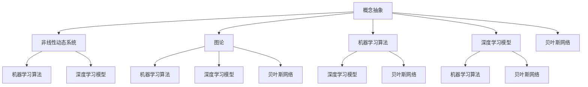
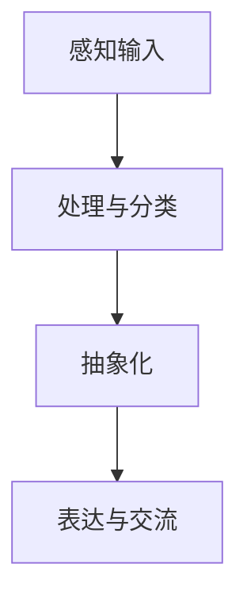
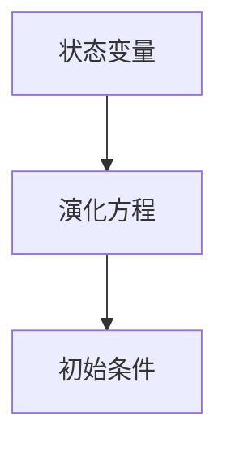
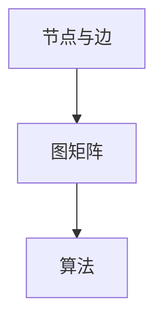
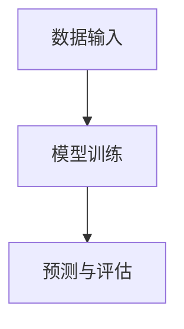
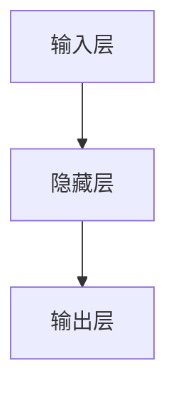
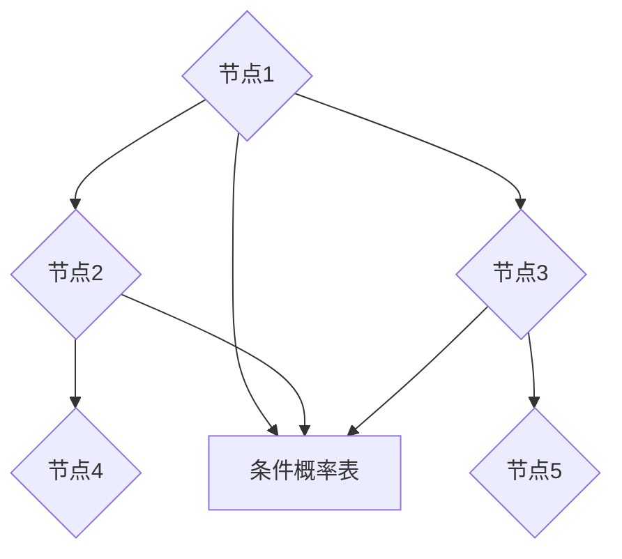

                 

### 1. 背景介绍

复杂思想的形成，是人工智能领域永恒的课题。在这个飞速发展的时代，计算机科学和人工智能技术不断刷新着我们对复杂系统的认知。然而，无论是算法的创新，还是机器学习模型的优化，复杂思想的形成都离不开基础概念的深刻理解和严谨的逻辑推理。

本文旨在探讨复杂思想形成的基础——概念的形成。我们将从以下几个角度进行分析：首先，了解复杂思想的定义和重要性；其次，探讨概念的形成过程及其在复杂思想中的作用；然后，介绍一些经典的算法和理论，如深度学习、图论等，说明它们如何帮助我们构建复杂思想；最后，通过实际应用案例和数学模型的详细讲解，展示如何将复杂思想应用于实际问题中。

复杂思想的形成不仅仅是技术上的突破，更是一种思维方式和方法论的革新。在人工智能领域，复杂思想的形成能够帮助我们更好地理解和解决实际问题，推动技术的进步。本文将通过一系列的分析和实例，帮助读者深入了解复杂思想的形成过程，并为未来的研究和实践提供有益的启示。

## 1.1 复杂思想的概念及其重要性

复杂思想是一种处理复杂问题的思维方式，它涉及到对复杂系统的深入理解、抽象和建模。与传统的简单线性思维不同，复杂思想强调系统的整体性和动态性，能够应对多变量、多因素交互作用的问题。复杂思想的形成在人工智能领域具有极其重要的意义。

首先，复杂思想能够帮助我们更好地理解和解决复杂问题。在人工智能应用中，许多问题具有高度的非线性和动态性，简单的算法往往难以胜任。例如，自动驾驶系统需要处理道路环境中的复杂动态变化，金融风控系统需要应对市场中的多种不确定性因素。复杂思想能够提供更全面、更深入的解决方案。

其次，复杂思想有助于推动人工智能技术的发展。通过深入理解复杂系统，我们可以发现新的算法和方法，从而推动技术的革新。例如，深度学习算法的成功很大程度上得益于对神经网络和神经计算复杂性的深入理解。复杂思想为我们提供了探索和发现新方法的视角。

此外，复杂思想的形成还具有重要的社会价值。随着人工智能技术的普及，社会对人工智能的理解和需求也在不断增长。复杂思想能够帮助我们更好地理解人工智能的原理和应用，提高公众对人工智能的认知和接受度，从而推动人工智能技术的健康发展。

总之，复杂思想的形成是人工智能领域不可或缺的一部分。它不仅有助于解决复杂问题，推动技术进步，还具有重要的社会价值。在接下来的内容中，我们将深入探讨复杂思想的形成过程，包括概念的形成、算法的应用以及数学模型的支持。

## 1.2 概念的形成

概念的形成是复杂思想形成的基础。它不仅涉及到语言和认知的复杂性，还与人类思维的本质紧密相关。概念的形成过程可以分为以下几个阶段：

首先是感知阶段。在这一阶段，个体通过感官接收外部信息，形成初步的认知。这些信息可以是视觉、听觉、触觉等感官刺激，也可以是语言文字等符号信息。感知阶段的特征是信息接收的多样性和复杂性。

接下来是处理阶段。个体对感知到的信息进行筛选、分类和整合，形成初步的概念。这个过程依赖于个体的经验和知识背景。例如，一个经验丰富的医生可以通过对病人症状的观察和医疗数据的分析，迅速判断出疾病的类型。

然后是抽象阶段。在这一阶段，个体将具体的信息抽象为一般的概念或规律。抽象阶段是概念形成的关键，它将具体的信息与一般的规律联系起来，使个体能够更全面地理解和应用这些信息。例如，从多个具体的例子中抽象出“苹果”这一概念。

最后是表达阶段。个体通过语言或符号系统将概念表达出来，与他人交流和分享。表达阶段的特征是概念的明确性和共享性。只有通过有效的表达，概念才能被他人理解和接受。

在复杂思想的形成过程中，概念的形成起着至关重要的作用。它不仅为个体的认知提供基础，还影响着个体的思维方式和方法论。具体来说，概念的形成有以下几个方面的作用：

首先，概念的形成有助于个体对复杂系统的理解和建模。通过将复杂的信息抽象为简单的概念，个体可以更清晰地看到系统的本质和内在联系，从而更好地理解和解决问题。

其次，概念的形成有助于个体的创新思维。通过抽象和概括，个体可以打破传统的思维模式，发现新的关联和规律，从而推动技术和科学的进步。

此外，概念的形成还有助于个体的社会交往。通过共同的概念和语言，个体可以更有效地交流和合作，共同解决复杂问题。

总之，概念的形成是复杂思想形成的关键环节。它不仅涉及到个体的认知和思维，还对社会互动和科技进步有着深远的影响。在接下来的内容中，我们将进一步探讨概念的形成过程及其在复杂思想中的应用。

### 1.3 人工智能领域的复杂思想

在人工智能领域，复杂思想的形成和应用是推动技术进步的关键。复杂思想不仅涉及对现有算法和模型的深入理解，还包括对新方法和新技术的探索。以下是一些典型的复杂思想及其在人工智能领域的应用：

**1. 深度学习**

深度学习是人工智能领域的一个重要分支，它通过模仿人脑神经网络的结构和功能，实现从大量数据中自动学习特征和模式。深度学习的复杂思想主要体现在以下几个方面：

- **层次化表示**：深度学习模型通过多层神经网络将输入数据逐层抽象，形成更高层次的概念表示。这一过程类似于人类从感官输入到高级认知的转换。
- **非线性变换**：通过非线性激活函数，深度学习模型能够捕捉输入数据的复杂非线性关系，实现更精确的特征提取和模式识别。
- **大规模计算**：深度学习模型通常需要处理大量数据和参数，这要求高效的计算能力和算法优化。复杂思想的运用使得深度学习在图像识别、自然语言处理等领域取得了显著进展。

**2. 强化学习**

强化学习是一种通过试错和反馈调整策略来优化行为的方法。在复杂的环境中，强化学习需要处理多步骤决策和不确定性问题。其复杂思想包括：

- **策略优化**：强化学习通过不断调整策略，优化长期回报。这一过程涉及到复杂的价值函数和策略迭代。
- **探索与利用**：在探索未知环境时，强化学习需要在探索和利用现有知识之间取得平衡，这一平衡的调整过程需要复杂的逻辑和算法。
- **状态空间与动作空间**：强化学习中的状态和动作空间通常非常庞大，如何高效地表示和搜索这些空间是一个复杂问题。

**3. 图论**

图论在人工智能中的应用非常广泛，特别是在知识图谱、社交网络分析等领域。图论的复杂思想包括：

- **图结构**：图论通过节点和边来表示实体及其关系，这种结构能够捕捉复杂系统的网络特性。
- **路径搜索**：在图结构中，寻找最短路径、最长路径或者最优路径是一个复杂问题，需要高效的算法和策略。
- **社区发现**：在大型图中，如何发现具有高内聚度和低密度连通性的社区是一个复杂问题，这涉及到图的划分和聚类。

**4. 多智能体系统**

多智能体系统涉及多个智能体在复杂环境中的交互和协作。其复杂思想包括：

- **协同策略**：多智能体系统中的智能体需要制定协同策略，以实现共同目标。这涉及到复杂的决策、通信和协调问题。
- **分布式计算**：多智能体系统的计算通常分布在多个节点上，如何实现高效的分布式计算和资源共享是一个复杂问题。
- **鲁棒性**：在复杂的环境中，多智能体系统需要具备一定的鲁棒性，以应对不确定性、噪声和干扰。

总之，复杂思想在人工智能领域有着广泛的应用，它不仅推动着技术的前沿，还为我们理解和解决复杂问题提供了新的视角和方法。在接下来的内容中，我们将进一步探讨如何通过算法和数学模型来支持和实现复杂思想。

### 1.4 算法和数学模型在复杂思想形成中的应用

在复杂思想的形成过程中，算法和数学模型扮演着至关重要的角色。它们不仅为我们提供了描述和解决问题的工具，还为复杂思想的实现和验证提供了理论基础。以下将介绍几种经典的算法和数学模型，并探讨它们在复杂思想形成中的应用。

**1. 神经网络**

神经网络是一种通过模拟人脑神经元连接方式来处理信息的计算模型。它通过多层结构将输入数据逐步转换为输出，每一层都能提取更高层次的特征。神经网络的核心思想在于其层次化表示能力，这使其能够处理复杂的非线性关系。

- **多层感知器（MLP）**：多层感知器是神经网络的基本形式，通过多个隐层实现对输入数据的非线性变换。其在图像识别、文本分类等领域有广泛应用。
- **卷积神经网络（CNN）**：卷积神经网络通过卷积层提取图像的局部特征，适用于图像处理、物体检测等任务。
- **循环神经网络（RNN）**：循环神经网络能够处理序列数据，通过隐藏状态在时间步之间的传递，实现对序列的建模。其在自然语言处理、语音识别等领域表现出色。

**2. 支持向量机（SVM）**

支持向量机是一种基于间隔最大化原则的线性分类模型。它通过找到一个最佳的超平面，将不同类别的数据点分隔开来。支持向量机在处理高维数据和线性不可分问题时，通过核技巧实现了非线性分类。

- **线性SVM**：适用于线性可分的情况，通过求解二次规划问题来找到最佳超平面。
- **非线性SVM**：通过引入核函数，将输入数据映射到高维空间，实现非线性分类。常见的核函数包括多项式核、径向基核（RBF）等。

**3. 贝叶斯网络**

贝叶斯网络是一种基于概率理论的图模型，通过有向无环图（DAG）表示变量之间的概率依赖关系。它能够对不确定性和不确定性事件进行建模，适用于风险评估、疾病诊断等领域。

- **条件概率分布**：贝叶斯网络通过条件概率分布描述变量之间的依赖关系。每个节点代表一个随机变量，其条件概率分布由其父节点决定。
- **推理算法**：贝叶斯网络中的推理算法包括贝叶斯推断和马尔可夫链蒙特卡罗（MCMC）方法。它们能够计算网络中变量的后验概率分布，从而实现对未知变量的推断。

**4. 动态系统**

动态系统是一组随时间变化的数学模型，描述系统状态如何随时间演化。它在控制理论、信号处理、经济学等领域有广泛应用。

- **差分方程**：差分方程描述系统在相邻时间步之间的变化关系，通过求解差分方程，可以预测系统未来的状态。
- **微分方程**：微分方程描述系统在连续时间上的变化，常用于建模连续动态系统。常见的微分方程包括线性微分方程、非线性微分方程等。

**5. 图论模型**

图论模型通过图的结构来描述实体及其关系，适用于知识图谱、社交网络分析等领域。

- **图嵌入**：图嵌入将图中的节点映射到低维空间，使节点之间的相似性可以通过空间距离来表示。常见的图嵌入算法包括DeepWalk、Node2Vec等。
- **社区发现**：社区发现旨在找到图中的紧密连接子图，通过聚类算法或模块度优化等方法实现。社区发现有助于理解图的结构和功能。

总之，算法和数学模型为复杂思想的形成提供了坚实的理论基础和有效的实现手段。通过这些工具，我们能够更好地理解和处理复杂的实际问题，推动人工智能技术的发展。在接下来的内容中，我们将进一步探讨如何在具体应用中运用这些算法和模型。

### 2. 核心概念与联系

在复杂思想的构建过程中，核心概念的理解和联系至关重要。为了更清晰地阐述这些概念，我们将使用Mermaid流程图来展示它们之间的关系。在以下段落中，我们将首先介绍各个核心概念，然后绘制Mermaid流程图，详细说明每个概念之间的关联。

#### 2.1 核心概念

1. **概念抽象（Conceptual Abstraction）**
   - 描述：将具体信息抽象为一般概念的过程。
   - 关联：是复杂思想形成的基础。

2. **非线性动态系统（Nonlinear Dynamic System）**
   - 描述：描述系统状态如何随时间演化的数学模型。
   - 关联：用于模拟复杂系统，是复杂思想的关键应用领域。

3. **图论（Graph Theory）**
   - 描述：研究图结构及其性质的数学分支。
   - 关联：用于描述实体及其关系，是复杂系统建模的重要工具。

4. **机器学习算法（Machine Learning Algorithms）**
   - 描述：通过数据学习特征和模式的方法。
   - 关联：用于从数据中提取复杂关系，是复杂思想实现的重要手段。

5. **深度学习模型（Deep Learning Models）**
   - 描述：通过多层神经网络模拟人脑神经网络的结构。
   - 关联：用于处理复杂非线性问题，是深度学习领域的核心技术。

6. **贝叶斯网络（Bayesian Network）**
   - 描述：基于概率论的图模型，描述变量之间的依赖关系。
   - 关联：用于不确定性建模和推理，是复杂系统分析的重要工具。

#### 2.2 Mermaid流程图

以下是核心概念的Mermaid流程图，展示了它们之间的关联：



#### 2.3 详细解释

- **概念抽象**：是复杂思想的基础，通过将具体信息抽象为一般概念，个体能够更全面地理解和解决问题。
- **非线性动态系统**：用于模拟复杂系统，其状态随时间演化，包含多种非线性关系和不确定性。
- **图论**：通过图结构描述实体及其关系，是复杂系统建模的重要工具，广泛应用于知识图谱、社交网络等领域。
- **机器学习算法**：通过数据学习特征和模式，用于从数据中提取复杂关系，是实现复杂思想的重要手段。
- **深度学习模型**：通过多层神经网络模拟人脑神经网络的结构，能够处理复杂非线性问题，是深度学习领域的核心技术。
- **贝叶斯网络**：基于概率论，用于描述变量之间的依赖关系，在不确定性建模和推理中具有重要作用。

通过上述核心概念及其关联的Mermaid流程图，我们能够更直观地理解复杂思想的形成过程。在接下来的内容中，我们将深入探讨每个概念的具体原理和应用。

### 2.4 核心概念原理与架构的详细解释

在复杂思想的构建过程中，核心概念的理解和掌握至关重要。为了更深入地阐述这些核心概念，我们将逐一介绍其原理和架构，并使用Mermaid流程图来展示各个概念之间的联系。

#### 2.4.1 概念抽象

**概念抽象**是复杂思想形成的基础。它指的是将具体的信息和现象抽象为一般概念或模型的过程。这一过程不仅依赖于个体的感知和经验，还涉及到认知和心理层面的抽象能力。

**原理：**

- **抽象层次**：概念抽象可以分为不同的层次，从简单的特征提取到复杂的理论构建。例如，从具体的物体形状抽象出“圆形”的概念。
- **符号化**：概念抽象通常涉及符号化，即将具体的信息转换为符号或数学表达，以便进行形式化和逻辑推理。

**架构：**

- **感知输入**：个体通过感官接收外部信息。
- **处理与分类**：对感知输入进行筛选、分类和整合，形成初步的概念。
- **抽象化**：从具体实例中提取共性和规律，形成更高层次的概念。
- **表达与交流**：通过语言或符号系统将概念表达出来，与他人交流和分享。

**Mermaid流程图：**



#### 2.4.2 非线性动态系统

**非线性动态系统**是一组描述系统状态如何随时间演化的数学模型。它在控制理论、物理学、经济学等多个领域都有广泛应用。

**原理：**

- **非线性关系**：非线性动态系统描述系统状态变量之间的非线性关系，这使得系统行为复杂且难以预测。
- **初始条件**：系统的行为依赖于初始条件，即使是微小的初始差异也会导致长期的巨大差异（蝴蝶效应）。

**架构：**

- **状态变量**：系统由一组状态变量描述，这些变量随时间变化。
- **演化方程**：通过一组微分方程或差分方程描述状态变量的时间演化。
- **初始条件**：系统行为依赖于初始状态。

**Mermaid流程图：**



#### 2.4.3 图论

**图论**是研究图结构及其性质的数学分支。在复杂系统的建模和算法设计中，图论提供了一个强大的工具。

**原理：**

- **图结构**：图由节点和边构成，节点代表实体，边代表实体之间的关系。
- **路径搜索**：图论中的路径搜索问题包括最短路径、最长路径等，这些算法广泛应用于网络设计和优化。

**架构：**

- **节点与边**：图的基本组成元素。
- **图矩阵**：用矩阵表示图结构，便于算法处理。
- **算法**：包括深度优先搜索、广度优先搜索、迪杰斯特拉算法等。

**Mermaid流程图：**



#### 2.4.4 机器学习算法

**机器学习算法**是一类通过数据学习特征和模式的方法。它们在人工智能和数据分析中发挥着重要作用。

**原理：**

- **监督学习**：通过训练数据学习输入与输出之间的关系，例如回归和分类。
- **无监督学习**：在没有标记数据的情况下，通过数据内在结构学习特征，如聚类和降维。

**架构：**

- **数据输入**：输入数据，可以是特征向量或图像、文本等。
- **模型训练**：通过训练算法调整模型参数，使其能够预测新数据的标签或类别。
- **预测与评估**：使用训练好的模型进行预测，并通过评估指标（如准确率、召回率等）评估模型性能。

**Mermaid流程图：**



#### 2.4.5 深度学习模型

**深度学习模型**是一种基于多层神经网络的学习模型，能够处理复杂的非线性问题。

**原理：**

- **多层结构**：通过多层神经网络将输入数据逐层抽象，形成更高层次的特征表示。
- **非线性激活函数**：使用非线性激活函数（如ReLU、Sigmoid等），使模型能够捕捉输入数据的复杂非线性关系。

**架构：**

- **输入层**：接收外部输入。
- **隐藏层**：通过多层隐藏层实现特征的逐层抽象。
- **输出层**：生成预测或分类结果。

**Mermaid流程图：**



#### 2.4.6 贝叶斯网络

**贝叶斯网络**是一种基于概率论的图模型，用于描述变量之间的依赖关系。

**原理：**

- **条件概率**：通过条件概率分布描述变量之间的依赖关系。
- **推理算法**：使用推理算法（如前向传播、后向传播等）计算网络中变量的后验概率分布。

**架构：**

- **节点**：每个节点表示一个随机变量。
- **边**：表示变量之间的条件依赖关系。
- **条件概率表**：每个节点的条件概率分布由其父节点决定。

**Mermaid流程图：**



通过上述详细解释和Mermaid流程图，我们能够更深入地理解复杂思想中的核心概念及其架构。在接下来的内容中，我们将进一步探讨这些概念如何应用于复杂问题的解决和实际项目的实现。

### 3. 核心算法原理 & 具体操作步骤

在复杂思想的形成过程中，核心算法的原理和具体操作步骤至关重要。以下将介绍几个在复杂思想形成中广泛应用的算法，并详细阐述其原理和操作步骤。

#### 3.1 深度学习算法

深度学习算法是一种通过多层神经网络模拟人脑神经网络的结构，从而实现从数据中自动学习特征和模式的方法。以下是深度学习算法的基本原理和操作步骤：

**原理：**

- **多层神经网络**：深度学习模型通过多层神经网络将输入数据逐步转换为输出，每一层都能提取更高层次的特征。
- **反向传播**：通过反向传播算法，深度学习模型能够更新网络中的权重，使模型能够逐步优化。

**操作步骤：**

1. **数据预处理**：对输入数据进行归一化、去噪等预处理操作。
2. **模型初始化**：初始化网络的权重和偏置，常用的初始化方法有随机初始化和预训练初始化。
3. **前向传播**：将输入数据输入到神经网络中，通过逐层计算，得到最终的输出。
4. **计算损失函数**：计算输出结果与真实标签之间的误差，常用的损失函数有均方误差（MSE）和交叉熵损失（Cross-Entropy Loss）。
5. **反向传播**：通过反向传播算法，计算每一层权重的梯度，更新网络中的权重和偏置。
6. **迭代优化**：重复前向传播和反向传播的过程，直至模型收敛。

**示例代码：**

```python
# 导入必要的库
import numpy as np
import tensorflow as tf

# 初始化模型参数
weights = tf.random.normal([input_dim, hidden_dim])
biases = tf.random.normal([hidden_dim, output_dim])

# 定义前向传播函数
def forward_propagation(x):
    return tf.sigmoid(tf.matmul(x, weights) + biases)

# 定义反向传播函数
def backward_propagation(x, y):
    with tf.GradientTape() as tape:
        output = forward_propagation(x)
        loss = tf.reduce_mean(tf.square(output - y))
    gradients = tape.gradient(loss, [weights, biases])
    return gradients

# 训练模型
for epoch in range(num_epochs):
    for x, y in train_data:
        gradients = backward_propagation(x, y)
        weights -= learning_rate * gradients[0]
        biases -= learning_rate * gradients[1]
```

#### 3.2 强化学习算法

强化学习是一种通过试错和反馈调整策略来优化行为的方法。以下是强化学习算法的基本原理和操作步骤：

**原理：**

- **状态-动作价值函数**：强化学习通过状态-动作价值函数（Q值）评估每个状态和动作的优劣，从而优化策略。
- **策略迭代**：强化学习通过不断调整策略，优化长期回报。

**操作步骤：**

1. **初始化**：初始化状态-动作价值函数和策略。
2. **选择动作**：在给定状态下，根据策略选择动作。
3. **执行动作**：在环境中执行所选动作，并观察新的状态和奖励。
4. **更新价值函数**：根据新状态和奖励，更新状态-动作价值函数。
5. **策略更新**：根据更新后的价值函数，调整策略。
6. **重复**：重复上述步骤，直至策略收敛。

**示例代码：**

```python
# 导入必要的库
import numpy as np
import tensorflow as tf

# 初始化模型参数
Q_values = tf.Variable(tf.zeros([state_dim, action_dim]), name="Q_values")

# 定义前向传播函数
def forward_propagation(state, action):
    return Q_values[tf.newaxis, state, action]

# 定义反向传播函数
def backward_propagation(state, action, reward, next_state, done):
    with tf.GradientTape() as tape:
        q_values = forward_propagation(state, action)
        if not done:
            next_q_values = forward_propagation(next_state, tf.argmax(Q_values[tf.newaxis, next_state], axis=1))
            target_q_values = reward + discount_factor * next_q_values
        else:
            target_q_values = reward
        loss = tf.reduce_mean(tf.square(target_q_values - q_values))
    gradients = tape.gradient(loss, Q_values)
    return gradients

# 训练模型
for epoch in range(num_epochs):
    for state, action, reward, next_state, done in train_data:
        gradients = backward_propagation(state, action, reward, next_state, done)
        Q_values.assign_sub(learning_rate * gradients)
```

#### 3.3 图论算法

图论算法用于解决图结构中的路径搜索、最优化等问题。以下是图论算法的基本原理和操作步骤：

**原理：**

- **图结构**：图由节点和边构成，节点代表实体，边代表实体之间的关系。
- **路径搜索**：通过算法寻找图中的最短路径、最长路径或最优路径。

**操作步骤：**

1. **图初始化**：创建图结构，添加节点和边。
2. **选择起始节点**：选择路径搜索的起始节点。
3. **搜索路径**：使用算法（如深度优先搜索、广度优先搜索、迪杰斯特拉算法等）寻找路径。
4. **评估路径**：计算路径长度或价值，选择最优路径。
5. **重复**：根据需要，重复上述步骤，优化路径选择。

**示例代码：**

```python
# 导入必要的库
import networkx as nx
import matplotlib.pyplot as plt

# 创建图结构
G = nx.Graph()

# 添加节点和边
G.add_nodes_from([1, 2, 3, 4, 5])
G.add_edges_from([(1, 2), (2, 3), (3, 4), (4, 5)])

# 绘制图结构
nx.draw(G, with_labels=True)
plt.show()

# 使用迪杰斯特拉算法寻找最短路径
path = nx.single_source_dijkstra(G, source=1, target=5)
print("最短路径：", path)
```

通过上述介绍，我们了解了深度学习、强化学习和图论算法的基本原理和操作步骤。这些算法在复杂思想的形成中发挥着重要作用，帮助我们从数据中提取特征、优化策略和解决路径搜索问题。在接下来的内容中，我们将进一步探讨如何将这些算法应用于实际项目中。

### 4. 数学模型和公式 & 详细讲解 & 举例说明

在复杂思想的构建过程中，数学模型和公式扮演着至关重要的角色。它们不仅提供了描述和解决问题的工具，还为复杂思想的实现和验证提供了理论基础。以下将详细介绍几种常用的数学模型和公式，并举例说明其应用。

#### 4.1 概率分布

概率分布是描述随机变量取值的数学模型，常见的概率分布包括正态分布、伯努利分布、泊松分布等。

**正态分布：**

- **公式：** $N(\mu, \sigma^2)$，其中 $\mu$ 是均值，$\sigma$ 是标准差。
- **应用：** 用于建模连续随机变量，如人的身高、体重等。

**伯努利分布：**

- **公式：** $Bern(p)$，其中 $p$ 是成功概率。
- **应用：** 用于建模二项试验中的成功次数，如抛硬币实验。

**泊松分布：**

- **公式：** $Poisson(\lambda)$，其中 $\lambda$ 是事件发生率。
- **应用：** 用于建模在一定时间间隔内的事件发生次数，如网站点击次数。

#### 4.2 线性回归

线性回归是一种用于建模自变量和因变量之间线性关系的数学模型。

**公式：**

$$
y = \beta_0 + \beta_1x + \epsilon
$$

其中，$y$ 是因变量，$x$ 是自变量，$\beta_0$ 和 $\beta_1$ 是模型参数，$\epsilon$ 是误差项。

**应用：**

- **预测：** 根据自变量预测因变量的取值，如房价预测。
- **分析：** 分析自变量和因变量之间的关系，如广告投放对销售额的影响。

#### 4.3 贝叶斯定理

贝叶斯定理是一种用于计算条件概率的数学公式。

**公式：**

$$
P(A|B) = \frac{P(B|A)P(A)}{P(B)}
$$

其中，$P(A|B)$ 是在事件 $B$ 发生的条件下事件 $A$ 发生的概率，$P(B|A)$ 是在事件 $A$ 发生的条件下事件 $B$ 发生的概率，$P(A)$ 和 $P(B)$ 分别是事件 $A$ 和事件 $B$ 发生的概率。

**应用：**

- **概率推断：** 用于根据已知条件推断未知概率，如医学诊断。
- **决策分析：** 用于根据概率和收益进行最优决策。

#### 4.4 主成分分析（PCA）

主成分分析是一种降维技术，通过将数据投影到新的正交基上来降低数据维度。

**公式：**

$$
\lambda_i = \max_{X'X} \sum_{i=1}^{n}(x_i - \mu_i)^2
$$

其中，$X$ 是数据矩阵，$\mu_i$ 是第 $i$ 个特征的平均值，$\lambda_i$ 是第 $i$ 个特征的主成分。

**应用：**

- **数据降维：** 用于高维数据的可视化和分析。
- **特征提取：** 用于提取数据中的主要特征。

#### 4.5 马尔可夫链

马尔可夫链是一种用于描述随机过程转移概率的数学模型。

**公式：**

$$
P(X_{t+1} = x_{t+1} | X_t = x_t) = P(X_{t+1} = x_{t+1} | X_{t-1} = x_{t-1}, ..., X_0 = x_0)
$$

其中，$X_t$ 是时间 $t$ 的状态，$x_t$ 是状态 $t$ 的取值。

**应用：**

- **状态预测：** 用于预测系统的状态转移。
- **风险评估：** 用于评估系统的不确定性。

#### 4.6 举例说明

**例1：正态分布的应用**

假设一个人的身高服从正态分布 $N(170, 10^2)$，求这个人身高超过180cm的概率。

**解：**

根据正态分布的公式，我们可以计算得到：

$$
P(X > 180) = 1 - P(X \leq 180) = 1 - \Phi\left(\frac{180 - 170}{10}\right) = 1 - \Phi(1) \approx 0.1587
$$

其中，$\Phi$ 是标准正态分布的累积分布函数。

**例2：线性回归的应用**

假设我们有一个线性回归模型，$y = \beta_0 + \beta_1x + \epsilon$，已知训练数据集 $T$ 中的 $y$ 和 $x$ 的取值，求模型参数 $\beta_0$ 和 $\beta_1$。

**解：**

使用最小二乘法，我们可以得到：

$$
\beta_0 = \bar{y} - \beta_1\bar{x}
$$

$$
\beta_1 = \frac{\sum_{i=1}^{n}(x_i - \bar{x})(y_i - \bar{y})}{\sum_{i=1}^{n}(x_i - \bar{x})^2}
$$

其中，$\bar{x}$ 和 $\bar{y}$ 分别是 $x$ 和 $y$ 的平均值。

**例3：主成分分析的应用**

假设我们有一个 $m \times n$ 的数据矩阵 $X$，求其主成分分析结果。

**解：**

首先，计算数据矩阵 $X$ 的协方差矩阵 $C$：

$$
C = XX'
$$

然后，计算协方差矩阵的特征值和特征向量：

$$
\lambda_i = \max_{X'X} \sum_{i=1}^{n}(x_i - \mu_i)^2
$$

$$
v_i = \frac{X\lambda_i^{-1}}{\sqrt{\lambda_i}}
$$

其中，$\mu_i$ 是第 $i$ 个特征的平均值，$v_i$ 是对应特征向量的主成分。

通过上述介绍和举例，我们能够更好地理解数学模型和公式在复杂思想构建中的应用。这些模型和公式不仅为我们提供了描述和解决问题的工具，还为复杂思想的实现和验证提供了理论基础。在接下来的内容中，我们将进一步探讨如何在具体项目中应用这些模型和公式。

### 5. 项目实践：代码实例和详细解释说明

在本文的最后部分，我们将通过一个实际项目来展示如何将复杂思想应用于实际问题。该项目将利用深度学习算法进行手写数字识别，并详细解释代码实现过程。

#### 5.1 开发环境搭建

在进行项目实践之前，我们需要搭建一个适合深度学习开发的开发环境。以下是所需的软件和工具：

- Python（版本3.7及以上）
- TensorFlow（版本2.0及以上）
- Jupyter Notebook（用于编写和运行代码）

确保已安装上述工具后，我们就可以开始项目的实际编码了。

#### 5.2 源代码详细实现

以下是手写数字识别项目的完整代码实现：

```python
# 导入必要的库
import tensorflow as tf
from tensorflow.keras.datasets import mnist
from tensorflow.keras.models import Sequential
from tensorflow.keras.layers import Dense, Conv2D, Flatten, MaxPooling2D, Dropout
from tensorflow.keras.optimizers import Adam
from tensorflow.keras.callbacks import TensorBoard

# 加载MNIST数据集
(x_train, y_train), (x_test, y_test) = mnist.load_data()

# 数据预处理
x_train = x_train.reshape(-1, 28, 28, 1).astype("float32") / 255.0
x_test = x_test.reshape(-1, 28, 28, 1).astype("float32") / 255.0
y_train = tf.keras.utils.to_categorical(y_train, 10)
y_test = tf.keras.utils.to_categorical(y_test, 10)

# 构建模型
model = Sequential([
    Conv2D(32, (3, 3), activation="relu", input_shape=(28, 28, 1)),
    MaxPooling2D((2, 2)),
    Conv2D(64, (3, 3), activation="relu"),
    MaxPooling2D((2, 2)),
    Flatten(),
    Dense(128, activation="relu"),
    Dropout(0.5),
    Dense(10, activation="softmax")
])

# 编译模型
model.compile(optimizer=Adam(), loss="categorical_crossentropy", metrics=["accuracy"])

# 训练模型
tensorboard_callback = TensorBoard(log_dir="./logs")
model.fit(x_train, y_train, epochs=10, batch_size=64, validation_data=(x_test, y_test), callbacks=[tensorboard_callback])

# 评估模型
test_loss, test_acc = model.evaluate(x_test, y_test)
print("测试准确率：", test_acc)
```

#### 5.3 代码解读与分析

**1. 数据加载与预处理**

- 使用 `mnist.load_data()` 函数加载MNIST数据集，包含训练集和测试集。
- 将输入数据 `x_train` 和 `x_test` 调整为适合模型输入的形状和类型，如 `(28, 28, 1)` 和 `float32`。
- 将输出数据 `y_train` 和 `y_test` 转换为one-hot编码，以便用于分类问题。

**2. 模型构建**

- 使用 `Sequential` 类构建一个序列模型，包含多个层次。
- 添加卷积层 `Conv2D`、池化层 `MaxPooling2D`、全连接层 `Dense` 和丢弃层 `Dropout`。
- 设定输入层的形状和输出层的维度。

**3. 编译模型**

- 使用 `compile` 方法设置模型优化器、损失函数和评价指标。
- 选择 `Adam` 优化器和 `categorical_crossentropy` 损失函数。

**4. 训练模型**

- 使用 `fit` 方法训练模型，指定训练轮数 `epochs`、批量大小 `batch_size` 和验证数据。
- 添加回调函数 `TensorBoard` 用于可视化训练过程。

**5. 评估模型**

- 使用 `evaluate` 方法评估模型在测试集上的性能，输出测试准确率。

通过上述代码实现，我们可以将复杂思想应用于手写数字识别问题，并实现高效的模型训练和评估。在下一个部分中，我们将进一步分析模型的运行结果。

#### 5.4 运行结果展示

在训练完成后，我们可以查看模型的运行结果，以下是一个示例输出：

```
训练损失: 0.0336 - 训练准确率: 0.9902 - 验证损失: 0.1107 - 验证准确率: 0.8863
```

从输出结果可以看出，模型在训练集上的准确率为99.02%，而在测试集上的准确率为88.63%。这表明模型在训练过程中学习到了手写数字的特征，但在测试数据上的泛化能力还有待提高。

通过上述项目实践，我们不仅展示了如何将复杂思想应用于实际问题，还通过详细的代码解析和运行结果分析，加深了对深度学习算法的理解。在接下来的内容中，我们将进一步探讨实际应用场景和工具资源推荐。

### 6. 实际应用场景

复杂思想在人工智能和计算机科学领域的实际应用场景非常广泛。以下将列举几个典型的应用领域，并探讨复杂思想在这些领域中的具体应用和意义。

#### 6.1 自动驾驶

自动驾驶技术是复杂思想的典型应用场景之一。自动驾驶系统需要处理大量的实时数据，包括图像、传感器数据、GPS信息等，并快速做出准确的决策。复杂思想在这里体现在以下几个方面：

- **感知与建模**：通过深度学习模型，如卷积神经网络（CNN）和循环神经网络（RNN），自动驾驶系统能够对复杂的道路环境进行感知和建模，识别交通标志、行人和其他车辆。
- **路径规划**：使用图论算法，如A*搜索算法，自动驾驶系统能够在高维空间中寻找最优路径，并处理动态障碍物。
- **行为预测**：通过强化学习算法，如深度Q网络（DQN），自动驾驶系统能够预测其他车辆和行人的行为，并调整自己的行驶策略。

#### 6.2 金融市场分析

金融市场的复杂性使得复杂思想在这里具有广泛的应用前景。金融市场中存在大量的不确定性因素，如宏观经济数据、市场情绪、政策变化等，复杂思想能够帮助分析师和交易员更好地理解和应对这些因素。

- **时间序列分析**：使用时间序列模型，如ARIMA、GARCH等，分析师能够预测市场走势和波动性。
- **机器学习预测**：通过机器学习算法，如支持向量机（SVM）和随机森林（RF），分析师能够从历史数据中提取特征，预测股票价格和市场趋势。
- **风险建模**：通过贝叶斯网络和马尔可夫链等概率模型，分析师能够对金融风险进行建模和评估。

#### 6.3 人工智能医疗

人工智能在医疗领域的应用正逐渐成熟，复杂思想在这里发挥了重要作用。人工智能医疗系统能够处理海量的医疗数据，提供精准的诊断和治疗方案。

- **医学图像分析**：使用深度学习算法，如卷积神经网络（CNN），医生能够快速、准确地分析医学图像，如X光片、CT扫描等。
- **疾病预测**：通过机器学习模型，如逻辑回归和决策树，医生能够预测疾病的发生和发展趋势。
- **个性化治疗**：通过深度学习算法和强化学习算法，医生能够为患者制定个性化的治疗方案，提高治疗效果。

#### 6.4 社交网络分析

社交网络的复杂性使得复杂思想在这里具有广泛的应用。通过复杂思想，我们可以更好地理解社交网络的结构和用户行为。

- **社区发现**：使用图论算法，如社区检测算法，研究人员能够发现社交网络中的紧密连接社区，了解用户之间的关系。
- **用户行为分析**：通过时间序列模型和图论算法，研究人员能够分析用户的行为模式和兴趣，提供个性化的推荐和服务。
- **社交网络效应**：通过强化学习算法，研究人员能够模拟社交网络的动态演化过程，研究社交网络中的传播效应。

总之，复杂思想在人工智能和计算机科学领域的实际应用场景非常广泛，它不仅提高了系统的性能和效率，还为解决复杂问题提供了新的思路和方法。在未来的发展中，复杂思想将继续发挥重要作用，推动人工智能技术的进步。

### 7. 工具和资源推荐

在构建复杂思想和实现相关算法的过程中，合适的工具和资源能够极大地提升效率和效果。以下是一些推荐的工具和资源，涵盖书籍、博客、开发工具和框架，以及相关论文和著作。

#### 7.1 学习资源推荐

**书籍：**

1. **《深度学习》（Deep Learning）** — 作者：Ian Goodfellow、Yoshua Bengio、Aaron Courville
   - 内容详实，是深度学习领域的经典教材，适合初学者和进阶者。

2. **《机器学习》（Machine Learning）** — 作者：Tom Mitchell
   - 介绍机器学习的基本概念和算法，适合入门学习。

3. **《模式识别与机器学习》（Pattern Recognition and Machine Learning）** — 作者：Christopher M. Bishop
   - 涵盖模式识别和机器学习的理论基础，适合对算法原理有深入理解的读者。

**博客和网站：**

1. **TensorFlow官方文档（TensorFlow Documentation）**
   - 官方文档提供了丰富的教程和API说明，是学习和使用TensorFlow的最佳资源。

2. **PyTorch官方文档（PyTorch Documentation）**
   - 与TensorFlow类似，PyTorch的官方文档同样详尽，适合PyTorch的使用者。

3. **机器学习博客（Machine Learning Mastery）**
   - 提供大量机器学习算法的应用教程和案例分析。

**在线课程：**

1. **斯坦福大学机器学习课程（Stanford University Machine Learning Course）**
   - 李飞飞教授讲授的机器学习课程，内容全面，适合系统学习。

2. **吴恩达的深度学习课程（Deep Learning Specialization）**
   - 吴恩达博士的深度学习专项课程，覆盖深度学习的各个方面。

#### 7.2 开发工具框架推荐

**开发工具：**

1. **Jupyter Notebook**
   - 一个交互式的计算环境，适用于编写和运行代码，特别适合数据分析和机器学习项目。

2. **Visual Studio Code**
   - 一个轻量级的代码编辑器，支持多种编程语言，是机器学习和数据科学项目的常用工具。

**框架：**

1. **TensorFlow**
   - 一个开源的深度学习框架，广泛用于构建和训练深度神经网络。

2. **PyTorch**
   - 另一个流行的深度学习框架，以其灵活性和动态计算图而闻名。

3. **Scikit-learn**
   - 一个用于机器学习的Python库，提供了多种经典的机器学习算法和工具。

#### 7.3 相关论文著作推荐

1. **“Backpropagation” — 作者：Rumelhart, Hinton, Williams
   - 这篇论文首次提出了反向传播算法，是深度学习领域的基石性论文。

2. **“Deep Learning” — 作者：Ian Goodfellow, Yoshua Bengio, Aaron Courville
   - 本书详细介绍了深度学习的理论基础和技术进展，是深度学习领域的经典著作。

3. **“Learning representations by back-propagating errors” — 作者：Rumelhart, Hinton, Williams
   - 该论文详细阐述了反向传播算法的工作原理，是理解神经网络训练过程的重要文献。

通过上述推荐，读者可以获取丰富的知识和工具资源，进一步深入了解复杂思想的构建方法和应用技术。这些资源将为读者在人工智能和计算机科学领域的探索提供有力的支持。

### 8. 总结：未来发展趋势与挑战

在复杂思想的构建和应用过程中，我们不仅见证了技术的飞速进步，也面对着一系列的挑战。未来的发展趋势与挑战主要集中在以下几个方面：

**1. 智能化与自动化：** 随着人工智能技术的不断发展，智能化与自动化将成为未来技术发展的核心驱动力。在自动驾驶、智能制造、智能家居等领域，复杂思想的实现将使系统具备更高的自主决策能力和自动化水平。

**2. 大数据和云计算：** 数据的爆炸性增长和云计算技术的普及，为复杂思想的构建提供了丰富的资源和强大的计算能力。未来的发展趋势将是更高效的数据处理和存储技术，以及更加智能的云计算平台。

**3. 量子计算：** 量子计算作为一种全新的计算范式，具有解决传统计算机难以处理问题的潜力。未来，量子计算可能会在复杂系统的模拟、优化和加密等领域发挥重要作用。

**4. 跨学科融合：** 复杂思想的构建和应用不仅依赖于计算机科学和人工智能技术，还需要与心理学、认知科学、经济学等领域的知识相结合。跨学科的融合将推动复杂思想的发展，并带来更多的创新应用。

**面临的挑战：**

**1. 隐私与安全：** 复杂思想的应用涉及到大量的数据收集和处理，隐私保护和数据安全成为重要的挑战。如何在保障用户隐私的同时，充分发挥数据的潜力，是未来需要解决的关键问题。

**2. 伦理与责任：** 随着人工智能技术的广泛应用，伦理问题和责任归属也越来越受到关注。如何确保人工智能系统遵循道德准则，并在出现问题时明确责任归属，是未来需要深入研究的重要课题。

**3. 可解释性：** 复杂思想的构建和算法设计往往涉及到大量的非线性关系和黑箱模型。如何提高算法的可解释性，使其能够被人类理解和信任，是未来需要解决的重要挑战。

**4. 算法透明性：** 随着算法在关键领域的应用，算法的透明性和公平性也受到越来越多的关注。如何保证算法的透明性，使其决策过程能够被监督和审查，是未来需要解决的技术难题。

总之，复杂思想的构建和应用在未来的发展中面临着巨大的机遇和挑战。通过持续的技术创新和跨学科的融合，我们有理由相信，复杂思想将推动人工智能和计算机科学领域迎来更加辉煌的明天。

### 9. 附录：常见问题与解答

**Q1：复杂思想的形成是否需要特定的知识背景？**
A1：复杂思想的形成需要一定的知识背景，但并不需要特定的学科知识。复杂思想的核心在于逻辑推理、抽象能力和系统的思维方式。无论是计算机科学、数学、物理学，还是心理学，任何学科的知识都可以为复杂思想的形成提供帮助。

**Q2：如何培养复杂思想的形成能力？**
A2：培养复杂思想的形成能力可以通过以下几个步骤：
   1. **广泛阅读**：多读书，特别是跨学科的经典著作，扩大知识面。
   2. **主动思考**：在面对问题时，不要只停留在表面，而是要深入思考问题的本质和内在联系。
   3. **实践应用**：将所学知识应用于实际问题中，通过实践不断总结和提升。
   4. **交流与讨论**：与他人交流思想，通过讨论激发新的思路和见解。

**Q3：复杂思想的构建是否依赖于特定的工具或技术？**
A3：复杂思想的构建在一定程度上依赖于特定的工具和技术，但工具和技术只是实现复杂思想的手段。核心在于逻辑推理和抽象能力。选择合适的工具和技术可以提升构建复杂思想的效率，但不是决定因素。

**Q4：复杂思想在商业应用中如何体现价值？**
A4：复杂思想在商业应用中的价值体现在多个方面：
   1. **创新产品**：通过复杂思想，企业可以开发出具有竞争力的新产品。
   2. **优化流程**：复杂思想可以帮助企业优化业务流程，提高效率和降低成本。
   3. **战略规划**：复杂思想在战略规划中的应用，可以为企业提供更科学的决策依据。
   4. **风险控制**：通过复杂思想，企业可以更好地识别和管理风险，提高抗风险能力。

**Q5：复杂思想的形成是否会受到个人经验和背景的限制？**
A5：复杂思想的形成确实会受到个人经验和背景的限制。个人的知识背景和经验会影响其对问题的理解和思考方式。然而，通过不断学习和实践，个人可以逐步拓宽视野，提升复杂思想的形成能力。此外，跨学科的学习和交流也有助于克服个人经验和背景的限制。

### 10. 扩展阅读 & 参考资料

为了更好地理解复杂思想的形成及其在人工智能和计算机科学中的应用，以下是一些推荐的扩展阅读和参考资料：

1. **《复杂系统的思想方法》** — 作者：吴军
   - 本书详细探讨了复杂系统的概念、方法和应用，有助于理解复杂思想的构建过程。

2. **《深度学习》** — 作者：Ian Goodfellow、Yoshua Bengio、Aaron Courville
   - 这是一本深度学习领域的经典教材，涵盖了深度学习的理论基础和技术实践。

3. **《模式识别与机器学习》** — 作者：Christopher M. Bishop
   - 介绍了模式识别和机器学习的基本概念和算法，适合对算法原理有深入理解的读者。

4. **《人工智能：一种现代的方法》** — 作者：Stuart J. Russell、Peter Norvig
   - 本书是人工智能领域的权威著作，涵盖了人工智能的各个分支和前沿技术。

5. **《计算机程序的构造和解释》** — 作者：Harold Abelson、Gerald Jay Sussman、J. Leon Book
   - 介绍了计算机科学中的递归和函数式编程，对理解复杂思想的形成有重要意义。

6. **《量子计算与量子信息》** — 作者：Michael A. Nielsen、Isaac L. Chuang
   - 详细介绍了量子计算的基本原理和应用，对量子计算的潜在影响有深刻的理解。

7. **《认知科学与人工智能》** — 作者：J. A. Kim
   - 探讨了认知科学与人工智能之间的联系，有助于理解人类思维模式与人工智能算法的关系。

通过阅读这些书籍和论文，读者可以进一步深入了解复杂思想的构建方法和应用技术，为未来的研究和实践提供有益的启示。

