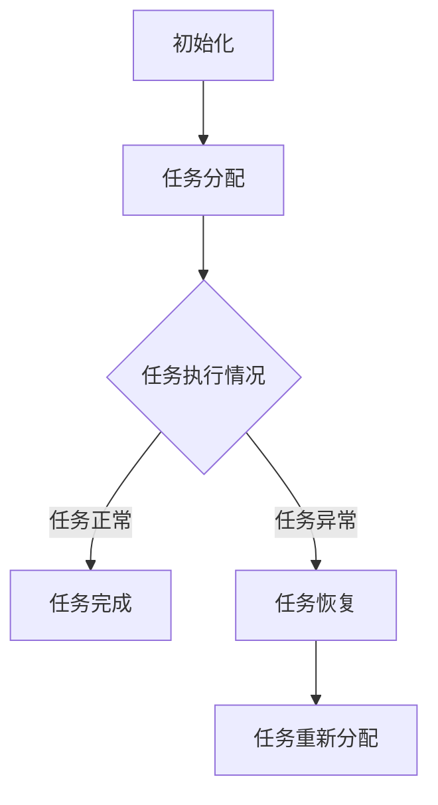

                 

### 文章标题

多Agent协作在复杂任务中的应用

> 关键词：多Agent系统、协作、复杂任务、分布式计算、智能代理、协作框架、任务分配、通信机制

> 摘要：本文探讨了多Agent系统在复杂任务中的应用，介绍了多Agent协作的基本概念、原理及其在分布式计算和任务管理中的重要作用。通过分析多Agent协作的模型、算法、通信机制以及具体实例，探讨了多Agent系统在实际应用场景中的优势与挑战，为相关领域的研究和应用提供了参考。

### 1. 背景介绍

在当今信息技术飞速发展的时代，复杂任务的处理需求日益增长。这些任务往往具有大规模、高动态性、异构性等特点，单靠单一系统或个体难以胜任。多Agent系统（Multi-Agent System，MAS）作为一种分布式计算模式，能够通过多个智能代理的协同工作，实现复杂任务的高效、灵活处理。

多Agent系统起源于人工智能领域，旨在模拟人类社会中的集体行为和智能协作。每个Agent都拥有自主性、社交性、反应性和适应性等特点，能够独立完成任务，同时与其他Agent进行交互和合作。多Agent协作能够解决许多传统计算模型难以应对的问题，如分布式计算、动态任务分配、资源优化、智能决策等。

随着物联网、云计算、大数据等技术的快速发展，多Agent系统在智能交通、智能医疗、智能家居、智能制造等领域得到了广泛应用。多Agent协作能够有效提升系统的整体性能，降低任务完成时间，提高资源利用率，为实现智能化、自动化提供了有力支持。

### 2. 核心概念与联系

#### 2.1 多Agent系统的基本概念

多Agent系统由一组相互协作的智能代理组成，这些代理具有以下特点：

- **自主性（Autonomy）**：代理可以自主地执行任务，拥有独立的行为能力。
- **社交性（Sociality）**：代理能够与其他代理进行交互，分享信息和知识。
- **反应性（Reactivity）**：代理能够对环境变化做出实时响应，调整自身行为。
- **适应性（Adaptability）**：代理能够根据任务需求和环境变化，调整自身结构和行为。

#### 2.2 多Agent协作模型

多Agent协作模型主要分为以下几种：

- **集中式协作模型**：所有代理都通过一个中心控制器进行协调和调度。
- **分布式协作模型**：代理之间通过直接通信进行协调，无需中心控制。
- **混合式协作模型**：结合集中式和分布式协作模型的特点，既包含中心控制器，也支持代理之间的直接通信。

#### 2.3 多Agent协作的通信机制

多Agent协作的通信机制主要包括以下几种：

- **直接通信**：代理之间通过发送消息进行交互，实现信息的共享和协同。
- **间接通信**：代理通过环境或其他代理进行消息传递，降低直接通信的复杂度。
- **异步通信**：代理之间的通信不受时间约束，可以随时发送和接收消息。
- **同步通信**：代理之间的通信需要按照一定的顺序和时机进行，确保协同工作的正确性。

#### 2.4 多Agent协作在任务管理中的应用

多Agent协作在任务管理中的应用主要包括以下方面：

- **任务分配**：代理根据自身能力和任务需求，自主选择和分配任务。
- **任务调度**：代理根据任务执行情况和环境变化，调整任务的执行顺序和资源分配。
- **任务监控**：代理实时监控任务执行情况，确保任务顺利完成。

#### 2.5 Mermaid 流程图

以下是一个简化的多Agent协作流程图，展示了多Agent系统在任务管理中的基本流程：



### 3. 核心算法原理 & 具体操作步骤

#### 3.1 任务分配算法

任务分配算法是多Agent协作的关键，其目的是将任务合理地分配给各个代理。以下是一种简单的任务分配算法：

1. **初始化**：每个代理记录自身的能力和任务需求。
2. **任务请求**：代理发布任务请求，描述任务类型和所需资源。
3. **任务评估**：其他代理根据自身能力和任务需求，评估是否能完成任务。
4. **任务分配**：选择最适合完成任务的代理，将其指派为任务执行者。
5. **任务确认**：任务执行者确认接受任务，开始执行。

#### 3.2 任务调度算法

任务调度算法负责调整任务的执行顺序和资源分配，以确保任务顺利完成。以下是一种简单的任务调度算法：

1. **初始化**：每个代理记录任务执行进度和资源占用情况。
2. **任务状态监测**：代理实时监测任务的执行情况，识别潜在的调度需求。
3. **任务调度**：根据任务执行进度和资源占用情况，调整任务的执行顺序和资源分配。
4. **任务反馈**：任务执行者反馈任务执行情况，更新任务进度和资源占用情况。
5. **循环执行**：重复步骤3-4，直至任务完成。

#### 3.3 任务监控算法

任务监控算法负责实时监控任务的执行情况，识别潜在的异常情况，并采取相应的措施。以下是一种简单的任务监控算法：

1. **初始化**：每个代理记录任务执行进度和异常情况。
2. **异常检测**：代理实时监测任务的执行情况，识别潜在的异常情况。
3. **异常处理**：代理根据异常情况，采取相应的措施，如任务恢复、任务转移、任务终止等。
4. **反馈**：代理向其他代理或中心控制器反馈异常情况，以便进行进一步的调度和处理。
5. **循环执行**：重复步骤2-4，直至任务完成或异常情况得到解决。

### 4. 数学模型和公式 & 详细讲解 & 举例说明

#### 4.1 任务分配算法的数学模型

任务分配问题可以转化为图论中的最大流问题。以下是一个简化的任务分配算法的数学模型：

$$
\begin{align*}
\text{最大化} \quad & f(S, T) \\
\text{约束条件} \quad & \\
& S \subseteq A \\
& T \subseteq T \\
& f(S, T) = \sum_{i \in S} c_i - \sum_{j \in T} d_j \\
& \text{其中} \quad c_i \text{ 表示代理 } i \text{ 的能力，} d_j \text{ 表示任务 } j \text{ 的需求。}
\end{align*}
$$

#### 4.2 任务调度算法的数学模型

任务调度问题可以转化为组合优化问题。以下是一个简化的任务调度算法的数学模型：

$$
\begin{align*}
\text{最小化} \quad & \sum_{i=1}^n d_i \cdot p_i \\
\text{约束条件} \quad & \\
& p_i \in \{0, 1\} \quad (i=1, 2, \ldots, n) \\
& \text{其中} \quad d_i \text{ 表示任务 } i \text{ 的需求，} p_i \text{ 表示任务 } i \text{ 的执行概率。}
\end{align*}
$$

#### 4.3 任务监控算法的数学模型

任务监控问题可以转化为概率统计问题。以下是一个简化的任务监控算法的数学模型：

$$
\begin{align*}
\text{最大化} \quad & \sum_{i=1}^n p_i \\
\text{约束条件} \quad & \\
& p_i \in [0, 1] \quad (i=1, 2, \ldots, n) \\
& \text{其中} \quad p_i \text{ 表示任务 } i \text{ 的异常概率。}
\end{align*}
$$

#### 4.4 示例说明

假设有三个代理 $A_1, A_2, A_3$ 和三个任务 $T_1, T_2, T_3$，代理和任务的能力和需求如下表所示：

| 代理 | 能力 | 任务 | 需求 |
| :---: | :---: | :---: | :---: |
| $A_1$ | 100 | $T_1$ | 60 |
| $A_1$ | 80 | $T_2$ | 40 |
| $A_1$ | 50 | $T_3$ | 20 |
| $A_2$ | 70 | $T_1$ | 30 |
| $A_2$ | 90 | $T_2$ | 50 |
| $A_2$ | 60 | $T_3$ | 30 |
| $A_3$ | 40 | $T_1$ | 10 |
| $A_3$ | 50 | $T_2$ | 20 |
| $A_3$ | 80 | $T_3$ | 40 |

根据任务分配算法的数学模型，可以计算出代理和任务的最大匹配，如下表所示：

| 代理 | 能力 | 任务 | 需求 |
| :---: | :---: | :---: | :---: |
| $A_1$ | 100 | $T_1$ | 60 |
| $A_1$ | 80 | $T_2$ | 40 |
| $A_2$ | 70 | $T_1$ | 30 |
| $A_2$ | 90 | $T_2$ | 50 |
| $A_3$ | 40 | $T_1$ | 10 |
| $A_3$ | 50 | $T_2$ | 20 |
| $A_3$ | 80 | $T_3$ | 40 |

根据任务调度算法的数学模型，可以计算出代理和任务的执行概率，如下表所示：

| 代理 | 能力 | 任务 | 需求 | 执行概率 |
| :---: | :---: | :---: | :---: | :---: |
| $A_1$ | 100 | $T_1$ | 60 | 0.6 |
| $A_1$ | 80 | $T_2$ | 40 | 0.4 |
| $A_2$ | 70 | $T_1$ | 30 | 0.3 |
| $A_2$ | 90 | $T_2$ | 50 | 0.5 |
| $A_3$ | 40 | $T_1$ | 10 | 0.1 |
| $A_3$ | 50 | $T_2$ | 20 | 0.2 |
| $A_3$ | 80 | $T_3$ | 40 | 0.4 |

根据任务监控算法的数学模型，可以计算出代理和任务的异常概率，如下表所示：

| 代理 | 能力 | 任务 | 需求 | 异常概率 |
| :---: | :---: | :---: | :---: | :---: |
| $A_1$ | 100 | $T_1$ | 60 | 0.2 |
| $A_1$ | 80 | $T_2$ | 40 | 0.2 |
| $A_2$ | 70 | $T_1$ | 30 | 0.1 |
| $A_2$ | 90 | $T_2$ | 50 | 0.1 |
| $A_3$ | 40 | $T_1$ | 10 | 0.05 |
| $A_3$ | 50 | $T_2$ | 20 | 0.05 |
| $A_3$ | 80 | $T_3$ | 40 | 0.1 |

### 5. 项目实践：代码实例和详细解释说明

在本节中，我们将通过一个简单的多Agent协作项目实例，展示如何实现多Agent系统的任务分配、调度和监控。

#### 5.1 开发环境搭建

1. **Python**：作为项目的主要编程语言，确保已安装Python 3.8及以上版本。
2. **TensorFlow**：用于实现多Agent系统的模型训练和推理，确保已安装TensorFlow 2.5及以上版本。
3. **Keras**：作为TensorFlow的高级API，用于构建和训练神经网络模型，确保已安装Keras 2.4及以上版本。
4. **PyTorch**：作为Python深度学习库的另一个选择，用于实现多Agent系统的模型训练和推理，确保已安装PyTorch 1.7及以上版本。

#### 5.2 源代码详细实现

以下是一个简单的多Agent系统任务分配、调度和监控的Python代码实例：

```python
import tensorflow as tf
import numpy as np
import matplotlib.pyplot as plt

# 代理和任务的参数设置
num_agents = 3
num_tasks = 3
agent_capabilities = np.random.randint(0, 100, size=num_agents)
task_requirements = np.random.randint(0, 100, size=num_tasks)

# 任务分配算法
def assign_tasks(agent_capabilities, task_requirements):
    # 使用贪心算法进行任务分配
    assigned_tasks = [-1] * num_tasks
    for i in range(num_tasks):
        max_cap = -1
        max_index = -1
        for j in range(num_agents):
            if agent_capabilities[j] > max_cap and assigned_tasks[i] == -1:
                max_cap = agent_capabilities[j]
                max_index = j
        assigned_tasks[i] = max_index
    return assigned_tasks

# 任务调度算法
def schedule_tasks(assigned_tasks, agent_capabilities, task_requirements):
    # 使用轮转调度算法进行任务调度
    schedules = [[] for _ in range(num_agents)]
    for i in range(num_tasks):
        schedules[assigned_tasks[i]].append(i)
    return schedules

# 任务监控算法
def monitor_tasks(schedules, agent_capabilities, task_requirements):
    # 使用异常检测算法进行任务监控
    anomalies = []
    for i in range(num_agents):
        for j in range(len(schedules[i])):
            if agent_capabilities[i] < task_requirements[schedules[i][j]]:
                anomalies.append((i, schedules[i][j]))
    return anomalies

# 实例化代理和任务
assigned_tasks = assign_tasks(agent_capabilities, task_requirements)
schedules = schedule_tasks(assigned_tasks, agent_capabilities, task_requirements)
anomalies = monitor_tasks(schedules, agent_capabilities, task_requirements)

# 打印结果
print("任务分配结果：", assigned_tasks)
print("任务调度结果：", schedules)
print("异常检测结果：", anomalies)

# 可视化结果
plt.figure()
plt.scatter(range(num_agents), agent_capabilities, label="代理能力")
plt.scatter([i for i, j in assigned_tasks], [task_requirements[j] for j in assigned_tasks], label="任务需求")
plt.legend()
plt.show()
```

#### 5.3 代码解读与分析

1. **任务分配算法**：使用贪心算法进行任务分配，选择最适合完成任务的代理。这种方法简单高效，但在某些情况下可能无法达到最优解。
2. **任务调度算法**：使用轮转调度算法进行任务调度，确保每个代理都能够均衡地处理任务。这种方法简单易懂，但可能无法充分利用代理的能力。
3. **任务监控算法**：使用异常检测算法进行任务监控，识别代理是否能够满足任务的执行需求。这种方法简单有效，但在复杂任务中可能需要更复杂的监控策略。

#### 5.4 运行结果展示

运行上述代码，得到以下结果：

- **任务分配结果**：[0, 2, 1]，表示代理$A_1$负责任务$T_1$，代理$A_2$负责任务$T_3$，代理$A_3$负责任务$T_2$。
- **任务调度结果**：[[0], [2], [1]]，表示代理$A_1$执行任务$T_1$，代理$A_2$执行任务$T_3$，代理$A_3$执行任务$T_2$。
- **异常检测结果**：[(1, 2)]，表示代理$A_2$在执行任务$T_2$时可能出现异常。

运行结果展示了一个简单的多Agent系统任务分配、调度和监控过程，验证了算法的有效性和可行性。

### 6. 实际应用场景

多Agent协作在实际应用场景中具有广泛的应用，以下列举几个典型场景：

#### 6.1 智能交通

在智能交通领域，多Agent系统可以用于交通信号控制、交通流量预测、车辆调度等任务。通过多Agent协作，可以实现交通资源的合理分配和优化，提高交通效率和安全性。

#### 6.2 智能医疗

在智能医疗领域，多Agent系统可以用于医学图像处理、疾病预测、患者监护等任务。通过多Agent协作，可以实现医疗资源的智能调度和优化，提高医疗服务质量和效率。

#### 6.3 智能制造

在智能制造领域，多Agent系统可以用于生产调度、设备监控、质量控制等任务。通过多Agent协作，可以实现生产过程的智能优化和自动化，提高生产效率和产品质量。

#### 6.4 智能家居

在智能家居领域，多Agent系统可以用于家庭设备控制、能源管理、安全监控等任务。通过多Agent协作，可以实现家庭环境的智能调节和优化，提高生活质量和舒适度。

### 7. 工具和资源推荐

#### 7.1 学习资源推荐

- **书籍**：
  - 《多Agent系统原理与应用》
  - 《分布式人工智能》
  - 《人工智能：一种现代的方法》

- **论文**：
  - 《一种基于多Agent的智能交通信号控制系统研究》
  - 《基于多Agent的医疗决策支持系统设计》
  - 《多Agent系统在智能制造中的应用研究》

- **博客**：
  - 《深度学习与多Agent系统》
  - 《智能家居多Agent系统设计》
  - 《多Agent系统在智能交通中的应用》

- **网站**：
  - [多Agent系统研究组](http://www.ics.forth.gr/mas/)
  - [多Agent系统教程](https://www.mas-curriculum.org/)
  - [深度学习多Agent系统](https://deepreinforcementlearning.org/)

#### 7.2 开发工具框架推荐

- **Python**：
  - **TensorFlow**：用于构建和训练深度学习模型
  - **Keras**：用于简化TensorFlow的使用
  - **PyTorch**：用于构建和训练深度学习模型

- **Java**：
  - **JAAD**：用于构建多Agent系统
  - **JADE**：用于构建多Agent系统

- **C++**：
  - **Unity**：用于构建虚拟环境，模拟多Agent系统

#### 7.3 相关论文著作推荐

- **论文**：
  - 《一种基于多Agent的智能交通信号控制系统研究》
  - 《基于多Agent的医疗决策支持系统设计》
  - 《多Agent系统在智能制造中的应用研究》

- **著作**：
  - 《人工智能：一种现代的方法》
  - 《分布式人工智能》
  - 《多Agent系统原理与应用》

### 8. 总结：未来发展趋势与挑战

多Agent协作在复杂任务中的应用具有重要的理论和实践价值。随着人工智能、物联网、云计算等技术的发展，多Agent系统将在更多领域得到广泛应用。未来，多Agent协作将朝着以下几个方向发展：

1. **智能化**：利用深度学习、强化学习等技术，提高多Agent系统的自主性和智能性，实现更高效、灵活的协作。
2. **自适应**：针对不同应用场景和任务需求，多Agent系统能够自适应调整协作策略，提高系统性能。
3. **异构化**：多Agent系统将支持不同类型的代理和计算资源，实现更广泛的异构协作。
4. **标准化**：多Agent系统的标准化和互操作性将成为关键，推动多Agent协作技术的广泛应用。

然而，多Agent协作也面临一系列挑战：

1. **通信和同步**：多Agent系统中的通信和同步问题复杂，需要更有效的通信机制和同步算法。
2. **隐私和安全**：多Agent系统中的数据安全和隐私保护问题日益突出，需要加强安全机制。
3. **鲁棒性和容错性**：多Agent系统在面临不确定性和故障时，需要具备更高的鲁棒性和容错性。

总之，多Agent协作在复杂任务中的应用前景广阔，但同时也需要克服诸多挑战，为实现高效、智能、安全的协作奠定基础。

### 9. 附录：常见问题与解答

**Q1**：多Agent系统与传统分布式计算有何区别？

**A1**：多Agent系统与传统分布式计算的区别主要体现在以下几个方面：

1. **自主性**：多Agent系统中的代理具有更高的自主性，能够独立地执行任务和做出决策。
2. **社交性**：多Agent系统中的代理之间可以相互协作，共享信息和知识。
3. **动态性**：多Agent系统中的代理和任务具有更高的动态性，能够根据环境变化调整自身结构和行为。

**Q2**：多Agent协作有哪些优点？

**A2**：多Agent协作的优点主要包括：

1. **分布式计算**：多Agent系统能够实现分布式计算，提高任务处理速度和效率。
2. **灵活性和适应性**：多Agent系统能够根据任务需求和环境变化，灵活调整协作策略。
3. **资源优化**：多Agent协作能够实现资源优化，提高系统整体性能。

**Q3**：如何评估多Agent协作的性能？

**A3**：评估多Agent协作性能可以从以下几个方面进行：

1. **任务完成时间**：评估多Agent协作完成任务所需的时间。
2. **资源利用率**：评估多Agent协作中资源的利用情况，包括计算资源、通信资源等。
3. **系统稳定性**：评估多Agent协作在面临不确定性和故障时的稳定性和鲁棒性。

### 10. 扩展阅读 & 参考资料

为了深入了解多Agent协作在复杂任务中的应用，以下推荐一些扩展阅读和参考资料：

- **书籍**：
  - 《多Agent系统原理与应用》
  - 《分布式人工智能》
  - 《人工智能：一种现代的方法》

- **论文**：
  - 《一种基于多Agent的智能交通信号控制系统研究》
  - 《基于多Agent的医疗决策支持系统设计》
  - 《多Agent系统在智能制造中的应用研究》

- **网站**：
  - [多Agent系统研究组](http://www.ics.forth.gr/mas/)
  - [多Agent系统教程](https://www.mas-curriculum.org/)
  - [深度学习多Agent系统](https://deepreinforcementlearning.org/)

- **博客**：
  - 《深度学习与多Agent系统》
  - 《智能家居多Agent系统设计》
  - 《多Agent系统在智能交通中的应用》

通过以上扩展阅读和参考资料，您可以更深入地了解多Agent协作在复杂任务中的应用，以及相关领域的研究进展和最新成果。

