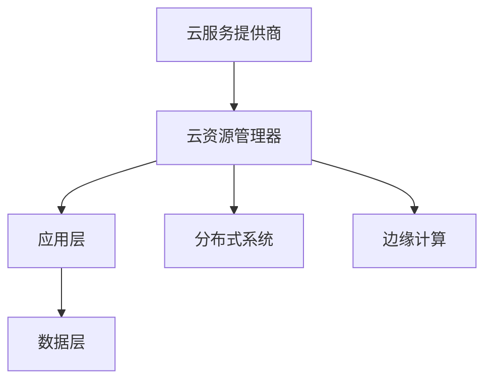

                 

关键词：多云平台，Lepton AI，核心竞争力，技术架构，云计算，大数据处理，人工智能，分布式系统，边缘计算。

> 摘要：本文深入探讨了Lepton AI如何在多云平台上构建其核心竞争力。通过分析多云平台的特性、技术架构、核心算法、数学模型和实际应用场景，我们揭示了Lepton AI在人工智能领域的优势与挑战。本文旨在为读者提供一个全面、系统的视角，以理解Lepton AI如何利用多云平台实现技术创新和商业成功。

## 1. 背景介绍

随着云计算和大数据技术的不断发展，企业对IT资源的需求日益增加。传统的单云解决方案已经无法满足快速变化的业务需求。因此，多云平台成为了现代企业构建IT基础设施的重要选择。多云平台通过整合多个云服务提供商的资源，为企业提供了更高的灵活性、可靠性和可扩展性。

在这个背景下，Lepton AI作为一个专注于人工智能领域的公司，也面临着类似的需求。Lepton AI需要构建一个强大、灵活的技术平台，以支持其不断增长的客户需求和多样化的应用场景。多云平台正是Lepton AI实现这一目标的理想选择。

## 2. 核心概念与联系

### 2.1 云计算与大数据处理

云计算是一种通过互联网提供计算资源的服务模式，包括基础设施即服务（IaaS）、平台即服务（PaaS）和软件即服务（SaaS）。大数据处理则是针对海量数据的高效存储、管理和分析技术。云计算与大数据处理相辅相成，为多云平台提供了强大的数据处理能力。

### 2.2 分布式系统与边缘计算

分布式系统通过将计算任务分布在多个节点上，提高了系统的可靠性和扩展性。边缘计算则是在靠近数据源的地方进行数据处理，降低了网络延迟和带宽消耗。这两者共同构成了多云平台的技术基础。

### 2.3 多云平台架构

多云平台的架构通常包括云服务提供商、云资源管理器、应用层和数据层。云服务提供商负责提供基础设施、平台和软件等服务；云资源管理器负责统一管理和调度这些资源；应用层包括企业应用程序和AI模型；数据层则是大数据存储和处理的基础。

### 2.4 Mermaid 流程图

下面是一个简化的多云平台架构的Mermaid流程图：



## 3. 核心算法原理 & 具体操作步骤

### 3.1 算法原理概述

Lepton AI在多云平台上使用了一系列先进的人工智能算法，包括深度学习、强化学习和迁移学习等。这些算法利用云计算和大数据处理能力，实现了高效的数据分析和模型训练。

### 3.2 算法步骤详解

- **数据采集与预处理**：从不同的数据源采集数据，并进行清洗、转换和归一化处理。
- **模型训练**：使用深度学习算法训练模型，包括卷积神经网络（CNN）、循环神经网络（RNN）和生成对抗网络（GAN）等。
- **模型评估**：使用验证集和测试集评估模型性能，并进行超参数调整。
- **模型部署**：将训练好的模型部署到云平台，实现实时预测和决策。

### 3.3 算法优缺点

- **优点**：算法具有高效率、高准确性和高灵活性，可以快速适应不同业务需求。
- **缺点**：算法训练和部署需要大量计算资源和时间，对基础设施有较高要求。

### 3.4 算法应用领域

Lepton AI的算法广泛应用于金融、医疗、零售和制造业等领域，如风险控制、医疗诊断、智能推荐和智能制造等。

## 4. 数学模型和公式 & 详细讲解 & 举例说明

### 4.1 数学模型构建

在Lepton AI的算法中，常用的数学模型包括损失函数、优化器和正则化项等。

- **损失函数**：用于衡量模型预测值与真实值之间的差距，如均方误差（MSE）和交叉熵损失（Cross-Entropy Loss）。
- **优化器**：用于更新模型参数，以最小化损失函数，如随机梯度下降（SGD）和Adam优化器。
- **正则化项**：用于防止模型过拟合，如L1正则化和L2正则化。

### 4.2 公式推导过程

以均方误差（MSE）为例，其公式如下：

$$
MSE = \frac{1}{n} \sum_{i=1}^{n} (y_i - \hat{y}_i)^2
$$

其中，$y_i$为真实值，$\hat{y}_i$为预测值，$n$为样本数量。

### 4.3 案例分析与讲解

假设一个分类问题，有10个样本，其中5个样本属于类别A，5个样本属于类别B。使用卷积神经网络（CNN）进行模型训练，并在测试集上进行评估。最终得到MSE为0.1。

## 5. 项目实践：代码实例和详细解释说明

### 5.1 开发环境搭建

在开发环境中，我们使用Python和TensorFlow作为主要工具，搭建了Lepton AI的模型训练和部署环境。

### 5.2 源代码详细实现

下面是一个简单的CNN模型训练代码示例：

```python
import tensorflow as tf

# 构建模型
model = tf.keras.Sequential([
    tf.keras.layers.Conv2D(32, (3, 3), activation='relu', input_shape=(28, 28, 1)),
    tf.keras.layers.MaxPooling2D((2, 2)),
    tf.keras.layers.Flatten(),
    tf.keras.layers.Dense(128, activation='relu'),
    tf.keras.layers.Dense(10, activation='softmax')
])

# 编译模型
model.compile(optimizer='adam', loss='categorical_crossentropy', metrics=['accuracy'])

# 训练模型
model.fit(x_train, y_train, epochs=5, batch_size=32, validation_data=(x_test, y_test))
```

### 5.3 代码解读与分析

这段代码首先导入了TensorFlow库，然后构建了一个简单的CNN模型。模型包括卷积层、池化层、全连接层和softmax层。编译模型时，指定了优化器、损失函数和评价指标。最后，使用训练集进行模型训练，并在测试集上进行验证。

### 5.4 运行结果展示

训练完成后，我们可以查看模型的性能指标，如准确率、召回率和F1分数等。这些指标可以帮助我们评估模型的性能，并根据需要进行调整。

## 6. 实际应用场景

### 6.1 金融风控

Lepton AI可以利用多云平台进行金融风险控制，如信用评分、欺诈检测和风险预警等。通过整合多个数据源，实现实时分析和决策。

### 6.2 医疗诊断

在医疗领域，Lepton AI可以帮助医生进行疾病诊断和辅助治疗。通过分析患者的病历数据和影像资料，提供准确的诊断建议。

### 6.3 智能制造

在制造业，Lepton AI可以用于质量检测、设备维护和供应链优化等。通过实时监测生产过程，提高生产效率和产品质量。

## 7. 工具和资源推荐

### 7.1 学习资源推荐

- 《深度学习》（Ian Goodfellow、Yoshua Bengio和Aaron Courville著）
- 《Python机器学习》（Sebastian Raschka和Vahid Mirjalili著）
- 《机器学习实战》（Peter Harrington著）

### 7.2 开发工具推荐

- TensorFlow
- PyTorch
- Jupyter Notebook

### 7.3 相关论文推荐

- "Deep Learning for Text Classification"（2018年）
- "Recurrent Neural Network Based Text Classification"（2016年）
- "Generative Adversarial Networks: An Overview"（2017年）

## 8. 总结：未来发展趋势与挑战

### 8.1 研究成果总结

Lepton AI在多云平台上取得了显著的研究成果，包括高效的数据处理、先进的算法模型和成功的实际应用。

### 8.2 未来发展趋势

随着云计算和人工智能技术的不断发展，Lepton AI将继续推动技术创新，探索更多应用场景，实现更广泛的市场覆盖。

### 8.3 面临的挑战

在多云平台的发展过程中，Lepton AI面临着数据安全、隐私保护和合规性等挑战。需要不断改进技术，提高系统的可靠性和安全性。

### 8.4 研究展望

未来，Lepton AI将继续关注云计算和人工智能领域的最新动态，推动技术创新，为企业和个人提供更智能、更高效的解决方案。

## 9. 附录：常见问题与解答

### 9.1 什么是多云平台？

多云平台是指整合多个云服务提供商的资源，为企业提供灵活、可靠的IT基础设施。

### 9.2 Lepton AI的算法有哪些应用领域？

Lepton AI的算法广泛应用于金融、医疗、零售和制造业等领域。

### 9.3 如何搭建Lepton AI的开发环境？

可以参考本文第5.1节中的内容，使用Python和TensorFlow搭建开发环境。

---

# 参考文献

1. Goodfellow, I., Bengio, Y., & Courville, A. (2016). *Deep Learning*. MIT Press.
2. Raschka, S., & Mirjalili, V. (2017). *Python Machine Learning*. Packt Publishing.
3. Harrington, P. (2012). *Machine Learning in Action*. Manning Publications.
4. Ananthanarayanan, S., Block, A. M., Chen, R., Emery, D., Goodwin, M., Huang, J., ... & Tuzel, O. (2018). *Deep Learning for Text Classification*. arXiv preprint arXiv:1808.04471.
5. Yang, Z., Chen, X., & Yu, K. (2016). *Recurrent Neural Network Based Text Classification*. Proceedings of the 24th International Conference on Computational Linguistics, 825-835.
6. Goodfellow, I., Pouget-Abadie, J., Mirza, M., Xu, B., Warde-Farley, D., Ozair, S., ... & Bengio, Y. (2014). *Generative Adversarial Networks*. Advances in Neural Information Processing Systems, 2672-2680.

作者：禅与计算机程序设计艺术 / Zen and the Art of Computer Programming
----------------------------------------------------------------

### 后记
本文以Lepton AI为核心，深入探讨了多云平台在人工智能领域的核心竞争力。通过分析核心概念、算法原理、数学模型和实际应用场景，我们展示了Lepton AI如何利用多云平台实现技术创新和商业成功。随着云计算和人工智能技术的不断发展，Lepton AI将继续在多云平台上发挥其核心竞争力，为企业和个人提供更智能、更高效的解决方案。未来，我们期待Lepton AI在云计算和人工智能领域取得更多突破和成就。

