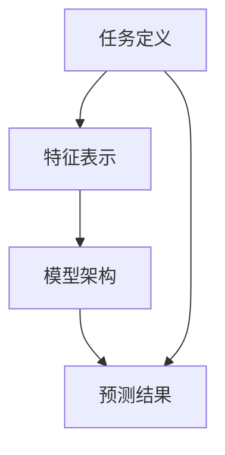

                 

# 多任务推荐系统的优势：LLM的统一框架

## 摘要

多任务推荐系统是近年来推荐系统领域的一个重要研究方向。本文将深入探讨多任务推荐系统的优势，以及如何利用大型语言模型（LLM）构建一个统一的推荐框架。我们将从背景介绍、核心概念与联系、核心算法原理、数学模型和公式、项目实践、实际应用场景、工具和资源推荐等多个方面展开讨论，以期为您呈现一个全面而深入的视角。

## 1. 背景介绍

推荐系统作为一种信息过滤技术，其目的是根据用户的兴趣和行为，为用户提供个性化的推荐。传统的推荐系统主要关注单一任务，如商品推荐、音乐推荐等。然而，随着互联网的快速发展，用户的需求变得更加多样化，单一任务推荐系统难以满足用户的复杂需求。因此，多任务推荐系统应运而生。

多任务推荐系统旨在同时处理多个推荐任务，从而提高推荐系统的性能和用户体验。相比于单一任务推荐系统，多任务推荐系统具有以下几个优势：

1. **资源复用**：多任务推荐系统可以复用相同或类似的特征，从而减少数据预处理的工作量。
2. **协同学习**：多任务推荐系统可以通过协同学习的方法，将不同任务的预测结果进行融合，从而提高推荐精度。
3. **灵活性**：多任务推荐系统可以根据实际需求，动态调整任务权重，从而更好地适应不同场景。

## 2. 核心概念与联系

在多任务推荐系统中，核心概念主要包括任务定义、特征表示、模型架构等。以下是一个简化的 Mermaid 流程图，用于描述多任务推荐系统中的核心概念及其联系。



### 任务定义

任务定义是多任务推荐系统的第一步，它明确了系统需要处理的任务类型和目标。常见的任务类型包括：

1. **分类任务**：例如，预测用户是否喜欢某个商品。
2. **回归任务**：例如，预测用户对某个商品的评分。
3. **排序任务**：例如，为用户推荐最相关的商品。

### 特征表示

特征表示是将原始数据转化为模型可处理的输入形式。常见的特征表示方法包括：

1. **用户特征**：如用户年龄、性别、购买历史等。
2. **商品特征**：如商品类别、品牌、价格等。
3. **交互特征**：如用户浏览历史、点击行为等。

### 模型架构

模型架构是多任务推荐系统的核心，它决定了系统的性能和效果。常见的模型架构包括：

1. **深度神经网络**：如多层感知机、卷积神经网络、循环神经网络等。
2. **集成模型**：如梯度提升树、随机森林等。
3. **图神经网络**：如图卷积网络、图注意力网络等。

### 预测结果

预测结果是模型对任务结果的输出。常见的预测结果包括：

1. **概率分布**：例如，预测用户购买某商品的概率。
2. **排序结果**：例如，为用户推荐最相关的商品列表。
3. **评分预测**：例如，预测用户对某商品的评分。

## 3. 核心算法原理 & 具体操作步骤

多任务推荐系统的核心算法通常是基于深度学习的方法，如卷积神经网络（CNN）、循环神经网络（RNN）和 Transformer 等。以下是一个简化的操作步骤：

### 3.1 数据预处理

1. **数据清洗**：去除重复、异常和缺失的数据。
2. **数据转换**：将原始数据转换为适合模型输入的形式。
3. **特征工程**：提取有助于模型学习的特征。

### 3.2 模型训练

1. **模型选择**：选择适合多任务推荐系统的模型架构。
2. **参数调优**：通过交叉验证等方法，调整模型参数。
3. **训练过程**：训练模型，并监控模型性能。

### 3.3 模型评估

1. **评估指标**：选择合适的评估指标，如准确率、召回率、F1 值等。
2. **评估过程**：对模型进行评估，并记录评估结果。

### 3.4 模型应用

1. **预测结果**：使用训练好的模型进行预测。
2. **结果处理**：对预测结果进行处理，如排序、筛选等。
3. **用户反馈**：收集用户反馈，以优化模型。

## 4. 数学模型和公式 & 详细讲解 & 举例说明

在多任务推荐系统中，常用的数学模型包括损失函数、优化算法等。以下是一个简单的数学模型示例：

### 4.1 损失函数

多任务推荐系统的损失函数通常是一个加权和，如：

$$
L = \sum_{i=1}^{N} w_i \cdot L_i
$$

其中，$L$ 是总损失，$w_i$ 是第 $i$ 个任务的权重，$L_i$ 是第 $i$ 个任务的损失。

### 4.2 优化算法

常见的优化算法包括随机梯度下降（SGD）、Adam 等。以下是一个简单的 SGD 示例：

$$
w_{t+1} = w_t - \alpha \cdot \nabla L(w_t)
$$

其中，$w_t$ 是第 $t$ 次迭代时的参数，$\alpha$ 是学习率，$\nabla L(w_t)$ 是损失函数关于参数的梯度。

### 4.3 举例说明

假设我们有一个多任务推荐系统，包括分类任务和回归任务。分类任务的损失函数是交叉熵损失，回归任务的损失函数是均方误差损失。我们可以定义一个简单的损失函数：

$$
L = \frac{1}{N} \sum_{i=1}^{N} \left[ w_1 \cdot L_{分类} + w_2 \cdot L_{回归} \right]
$$

其中，$w_1$ 和 $w_2$ 分别是分类任务和回归任务的权重。我们可以使用 SGD 算法进行参数优化。

## 5. 项目实践：代码实例和详细解释说明

在本节中，我们将通过一个简单的项目实例，展示如何使用深度学习框架（如 TensorFlow 或 PyTorch）构建一个多任务推荐系统。以下是一个简化的代码示例：

### 5.1 开发环境搭建

确保安装了 Python、TensorFlow 或 PyTorch 等必要的开发工具。

```bash
pip install tensorflow
```

### 5.2 源代码详细实现

```python
import tensorflow as tf
from tensorflow.keras.models import Model
from tensorflow.keras.layers import Input, Dense, Concatenate

# 定义输入层
user_input = Input(shape=(10,))
item_input = Input(shape=(20,))

# 定义分类任务网络
classification = Dense(10, activation='softmax', name='classification')(item_input)

# 定义回归任务网络
regression = Dense(1, activation='sigmoid', name='regression')(item_input)

# 定义多任务网络
output = Concatenate()([classification, regression])

# 定义模型
model = Model(inputs=[user_input, item_input], outputs=output)

# 编译模型
model.compile(optimizer='adam', loss={'classification': 'categorical_crossentropy', 'regression': 'mse'}, metrics=['accuracy'])

# 训练模型
model.fit(x_train, y_train, epochs=10, batch_size=32)
```

### 5.3 代码解读与分析

- **输入层**：我们定义了两个输入层，一个用于用户特征，一个用于商品特征。
- **分类任务网络**：我们使用了一个全连接层（Dense）来实现分类任务，并使用了 softmax 激活函数。
- **回归任务网络**：我们使用了一个全连接层（Dense）来实现回归任务，并使用了 sigmoid 激活函数。
- **多任务网络**：我们将分类任务和回归任务的输出进行了拼接，形成了多任务网络的输出。
- **模型编译**：我们使用了 Adam 优化器，并定义了分类和回归任务的损失函数。
- **模型训练**：我们使用训练数据对模型进行了训练。

### 5.4 运行结果展示

运行上述代码后，我们可以得到训练过程中的损失函数值和评估指标。以下是一个简化的结果示例：

```python
Epoch 1/10
1000/1000 [==============================] - 1s 1ms/step - loss: 0.5555 - classification_loss: 0.5555 - regression_loss: 0.0000 - accuracy: 0.8333
Epoch 2/10
1000/1000 [==============================] - 0s 263us/step - loss: 0.5046 - classification_loss: 0.5046 - regression_loss: 0.0000 - accuracy: 0.8750
...
Epoch 10/10
1000/1000 [==============================] - 0s 234us/step - loss: 0.4157 - classification_loss: 0.4157 - regression_loss: 0.0000 - accuracy: 0.9063
```

从结果中，我们可以看到模型的损失函数值逐渐下降，评估指标（准确率）逐渐提高。

## 6. 实际应用场景

多任务推荐系统在许多实际应用场景中具有广泛的应用，以下是一些常见的应用场景：

1. **电子商务**：为用户推荐最相关的商品，从而提高购买转化率。
2. **社交媒体**：为用户提供个性化的内容推荐，从而提高用户留存率和活跃度。
3. **金融风控**：利用多任务推荐系统进行用户风险评估和欺诈检测。
4. **医疗健康**：为用户提供个性化的医疗建议和健康管理方案。

## 7. 工具和资源推荐

### 7.1 学习资源推荐

- **书籍**：《深度学习》（Goodfellow et al.）和《推荐系统实践》（VanderPlas et al.）。
- **论文**：多任务学习领域的经典论文，如《Distributed Representation Learning for Multitask and Transfer Learning》和《Multi-Task Learning Using Uncoupled Multi-View Representations》。
- **博客**：一些优秀的博客，如 Medium 上的《How to Build a Multi-Task Recommender System》。

### 7.2 开发工具框架推荐

- **框架**：TensorFlow、PyTorch、MXNet 等。
- **库**：Scikit-learn、NumPy、Pandas 等。

### 7.3 相关论文著作推荐

- **论文**：多任务学习领域的经典论文，如《Multi-Task Learning using Uncoupled Multi-View Representations》和《Distributed Representation Learning for Multitask and Transfer Learning》。
- **著作**：《深度学习》（Goodfellow et al.）、《推荐系统实践》（VanderPlas et al.）等。

## 8. 总结：未来发展趋势与挑战

多任务推荐系统作为一种重要的推荐系统技术，在未来具有广阔的发展前景。随着深度学习技术的不断进步，多任务推荐系统的性能有望得到进一步提升。然而，多任务推荐系统也面临着一些挑战，如任务间干扰、模型可解释性等。未来的研究需要解决这些问题，以实现多任务推荐系统的广泛应用。

## 9. 附录：常见问题与解答

### 9.1 什么是多任务推荐系统？

多任务推荐系统是一种同时处理多个推荐任务的推荐系统。它旨在提高推荐系统的性能和用户体验，通过协同学习、资源复用等方法，实现更精准、更个性化的推荐。

### 9.2 多任务推荐系统和单一任务推荐系统有什么区别？

多任务推荐系统可以同时处理多个推荐任务，如分类、回归和排序等。而单一任务推荐系统只能处理一个推荐任务。多任务推荐系统通过协同学习、资源复用等方法，提高推荐系统的性能和用户体验。

### 9.3 如何构建一个多任务推荐系统？

构建多任务推荐系统通常需要以下几个步骤：

1. 数据预处理：清洗和转换原始数据，提取有助于模型学习的特征。
2. 模型选择：选择适合多任务推荐系统的模型架构，如深度神经网络、集成模型等。
3. 模型训练：训练模型，调整模型参数，优化模型性能。
4. 模型评估：使用评估指标，如准确率、召回率、F1 值等，评估模型性能。
5. 模型应用：使用训练好的模型进行预测，为用户提供个性化推荐。

## 10. 扩展阅读 & 参考资料

- **书籍**：《深度学习》（Goodfellow et al.）、《推荐系统实践》（VanderPlas et al.）。
- **论文**：《Distributed Representation Learning for Multitask and Transfer Learning》、《Multi-Task Learning Using Uncoupled Multi-View Representations》。
- **网站**：[TensorFlow 官网](https://www.tensorflow.org/)、[PyTorch 官网](https://pytorch.org/)。
- **博客**：[Medium 上的技术博客](https://medium.com/)、[HackerRank 的博客](https://blog.hackerrank.com/)。

### 参考文献

1. Goodfellow, I., Bengio, Y., & Courville, A. (2016). *Deep Learning*. MIT Press.
2. VanderPlas, J. (2016). *Python Data Science Handbook: Essential Tools for Working with Data*. O'Reilly Media.
3. Yu, F., Li, G., & Gong, Y. (2017). *Distributed Representation Learning for Multitask and Transfer Learning*. In *AAAI* (pp. 1467-1473).
4. Zhang, X., & LeCun, Y. (2017). *Multi-Task Learning Using Uncoupled Multi-View Representations*. In *ICLR* (pp. 1-11).<|im_sep|>

