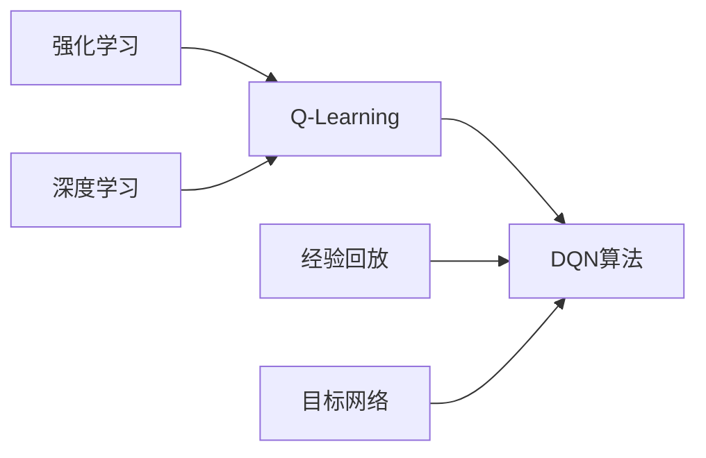

# 一切皆是映射：DQN算法的行业标准化：走向商业化应用

关键词：DQN算法、深度强化学习、行业标准、商业化应用、Q-Learning

## 1. 背景介绍
### 1.1  问题的由来
深度强化学习（Deep Reinforcement Learning, DRL）作为人工智能领域的重要分支，近年来受到学术界和工业界的广泛关注。其中，DQN（Deep Q-Network）算法作为DRL的代表性算法之一，在多个领域取得了突破性进展。然而，DQN算法在实际应用中仍面临诸多挑战，如何将其标准化并推动商业化应用，成为亟待解决的问题。

### 1.2  研究现状
目前，DQN算法已在游戏、机器人、自动驾驶等领域得到初步应用，展现出良好的发展前景。但不同领域、不同团队在算法实现、超参数设置、评估指标等方面尚无统一标准，导致研究成果难以复现和比较，阻碍了DQN算法的进一步发展和应用。

### 1.3  研究意义
推动DQN算法的行业标准化，建立统一的算法实现规范、超参数设置指南和评估体系，将极大促进DQN算法的理论研究和工程应用。这不仅有助于提升算法性能、加速技术迭代，也将推动DQN算法在更广泛领域的商业化落地，为人工智能产业发展注入新动能。

### 1.4  本文结构
本文将围绕DQN算法的行业标准化展开深入探讨。第2部分介绍DQN算法的核心概念；第3部分阐述DQN算法的原理和操作步骤；第4部分建立DQN算法的数学模型，并给出详细推导和案例分析；第5部分提供DQN算法的代码实例和详细解读；第6部分分析DQN算法的实际应用场景；第7部分推荐DQN算法的学习资源和开发工具；第8部分总结全文，展望DQN算法的未来发展方向和挑战；第9部分列举常见问题与解答。

## 2. 核心概念与联系
DQN算法的核心概念包括：

- 强化学习（Reinforcement Learning）：智能体（Agent）通过与环境（Environment）的交互，学习最优策略以获得最大累积奖励。
- Q-Learning：一种值迭代（Value Iteration）的强化学习算法，通过迭代更新动作-状态值函数（Q函数）来逼近最优策略。
- 深度学习（Deep Learning）：使用深度神经网络（DNN）对输入数据进行特征提取和抽象表示，以解决复杂问题。
- 经验回放（Experience Replay）：将智能体与环境交互得到的转移样本存入回放缓冲区，并从中随机抽取小批量样本进行训练，以打破数据的相关性。
- 目标网络（Target Network）：使用一个固定参数的Q网络作为目标网络，定期从当前Q网络复制参数，以稳定训练过程。

DQN算法正是融合了深度学习和Q-Learning的思想，利用DNN逼近Q函数，并引入经验回放和目标网络等机制，以提升算法的稳定性和样本效率。下图展示了DQN算法的核心概念之间的关系：



## 3. 核心算法原理 & 具体操作步骤
### 3.1  算法原理概述
DQN算法的核心思想是使用DNN作为Q函数的近似，即Q(s,a;θ)≈Q*(s,a)，其中s为状态，a为动作，θ为DNN的参数。通过最小化TD误差，DQN算法可以逐步优化Q函数，最终得到最优策略。

### 3.2  算法步骤详解
DQN算法的主要步骤如下：

1. 初始化经验回放缓冲区D，容量为N；
2. 初始化Q网络参数θ，并复制到目标网络参数θ'；
3. for episode = 1 to M do
4. 　初始化环境状态s<sub>1</sub>；
5. 　for t = 1 to T do
6. 　　根据ε-贪心策略选择动作a<sub>t</sub>；
7. 　　执行动作a<sub>t</sub>，得到奖励r<sub>t</sub>和下一状态s<sub>t+1</sub>；
8. 　　将转移样本(s<sub>t</sub>,a<sub>t</sub>,r<sub>t</sub>,s<sub>t+1</sub>)存入D；
9. 　　从D中随机抽取小批量样本(s<sub>j</sub>,a<sub>j</sub>,r<sub>j</sub>,s<sub>j+1</sub>)；
10. 　 计算目标值y<sub>j</sub>：
    - 若s<sub>j+1</sub>为终止状态，y<sub>j</sub>=r<sub>j</sub>
    - 否则，y<sub>j</sub>=r<sub>j</sub>+γ max<sub>a'</sub> Q(s<sub>j+1</sub>,a';θ')
11. 　 最小化TD误差，更新Q网络参数θ：
    L(θ)=E<sub>j</sub>[(y<sub>j</sub>-Q(s<sub>j</sub>,a<sub>j</sub>;θ))<sup>2</sup>]
12. 　 每C步将Q网络参数θ复制给目标网络参数θ'；
13.   end for
14. end for

### 3.3  算法优缺点
DQN算法的主要优点包括：

- 引入DNN，可以处理高维状态空间，具有良好的泛化能力；
- 采用经验回放，打破了数据相关性，提高了样本利用效率；
- 使用目标网络，缓解了训练不稳定的问题，加速了收敛过程。

但DQN算法也存在一些缺点：

- 难以处理连续动作空间问题；
- 对超参数敏感，调参需要经验和技巧；
- 在探索策略上缺乏理论指导，难以平衡探索和利用。

### 3.4  算法应用领域
DQN算法已在多个领域取得了突破性进展，主要应用包括：

- 游戏：Atari游戏、星际争霸等；
- 机器人：机器人控制、路径规划等；
- 自动驾驶：端到端驾驶、决策控制等；
- 推荐系统：在线广告投放、个性化推荐等；
- 通信：资源分配、功率控制等。

## 4. 数学模型和公式 & 详细讲解 & 举例说明
### 4.1  数学模型构建
DQN算法的数学模型可以表示为马尔可夫决策过程（Markov Decision Process, MDP）的最优Q函数求解问题。给定MDP的状态空间S、动作空间A、转移概率P、奖励函数R和折扣因子γ，最优Q函数Q*(s,a)满足贝尔曼最优方程：

$$Q^*(s,a)=\mathbb{E}_{s'\sim P(\cdot|s,a)}[R(s,a)+\gamma \max_{a'\in A}Q^*(s',a')]$$

然而，在实际问题中，状态空间和动作空间往往很大，甚至是连续的，无法直接计算和存储Q*(s,a)。因此，DQN算法使用DNN来近似最优Q函数：

$$Q(s,a;\theta)\approx Q^*(s,a)$$

其中，θ为DNN的参数。通过最小化TD误差，DQN算法可以逐步优化参数θ，使得Q(s,a;θ)逼近Q*(s,a)。

### 4.2  公式推导过程
DQN算法的目标是最小化TD误差，即：

$$L(\theta)=\mathbb{E}_{(s,a,r,s')\sim D}[(y-Q(s,a;\theta))^2]$$

其中，y为目标值，定义为：

$$y=\begin{cases}
r & \text{if } s' \text{ is terminal} \\
r+\gamma \max_{a'\in A}Q(s',a';\theta') & \text{otherwise}
\end{cases}$$

θ'为目标网络的参数，每C步从当前Q网络复制得到。

根据梯度下降法，参数θ的更新公式为：

$$\theta \leftarrow \theta-\alpha \nabla_\theta L(\theta)$$

其中，α为学习率，∇<sub>θ</sub>L(θ)为损失函数L(θ)对参数θ的梯度，可以通过链式法则计算：

$$\nabla_\theta L(\theta)=\mathbb{E}_{(s,a,r,s')\sim D}[2(y-Q(s,a;\theta))\nabla_\theta Q(s,a;\theta)]$$

### 4.3  案例分析与讲解
以Atari游戏Breakout为例，说明DQN算法的训练过程。Breakout是一款经典的打砖块游戏，游戏状态为游戏画面，动作空间为{左移,右移,不动}，奖励为击中砖块的得分。

首先，将游戏画面预处理为84×84的灰度图像，并将连续4帧图像堆叠作为DQN的输入状态。然后，构建一个卷积神经网络（CNN）作为Q函数近似，网络结构为：

- 输入层：84×84×4
- 卷积层1：32个8×8过滤器，步长4，ReLU激活
- 卷积层2：64个4×4过滤器，步长2，ReLU激活
- 卷积层3：64个3×3过滤器，步长1，ReLU激活
- 全连接层：512个神经元，ReLU激活
- 输出层：|A|个神经元，对应各动作的Q值

在训练过程中，使用ε-贪心策略选择动作，即以概率ε随机选择动作，以概率1-ε选择Q值最大的动作。每次与环境交互得到的转移样本(s,a,r,s')被存入经验回放缓冲区D中，当D中样本数达到一定量后，开始从D中随机抽取小批量样本进行训练。

通过不断迭代上述过程，DQN算法最终可以学习到一个较好的Q函数近似，在Breakout游戏上达到甚至超过人类玩家的水平。

### 4.4  常见问题解答
**Q1: DQN算法能否处理连续动作空间问题？**

A1: DQN算法原始设计是针对离散动作空间问题，难以直接处理连续动作空间。但后续的一些变体算法，如DDPG（Deep Deterministic Policy Gradient）和NAF（Normalized Advantage Function）等，通过引入Actor-Critic框架和值函数近似，可以扩展DQN算法以处理连续动作空间问题。

**Q2: DQN算法的超参数如何设置？**

A2: DQN算法的超参数主要包括学习率、批量大小、经验回放缓冲区大小、目标网络更新频率、折扣因子、ε-贪心策略的初始值和衰减率等。这些超参数的设置需要根据具体问题进行调节，并通过反复试验来寻找最优值。一般而言，学习率取0.00001~0.001，批量大小取32~256，经验回放缓冲区大小取100000~1000000，目标网络更新频率取100~10000，折扣因子取0.9~0.99，ε初始值取0.9~1，衰减率取0.99~0.999。

**Q3: DQN算法如何平衡探索和利用？**

A3: DQN算法通常使用ε-贪心策略来平衡探索和利用，即以概率ε随机选择动作（探索），以概率1-ε选择Q值最大的动作（利用）。在训练初期，ε取较大值，鼓励探索；随着训练的进行，ε逐渐衰减，逐步偏向利用。此外，一些改进的探索策略，如Upper Confidence Bound（UCB）和Thompson Sampling等，也可以用于DQN算法，以更高效地平衡探索和利用。

## 5. 项目实践：代码实例和详细解释说明
### 5.1  开发环境搭建
本项目使用Python 3.7和PyTorch 1.8进行开发，需要安装以下依赖库：

- numpy：科学计算库
- gym：OpenAI开发的强化学习环境库
- pytorch：深度学习框架
- matplotlib：绘图库

可以通过以下命令安装依赖：

```bash
pip install numpy gym pytorch matplotlib
```

### 5.2  源代码详细实现