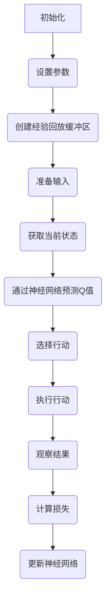

                 
# 一切皆是映射：从DQN到Rainbow：全面指南与实践小结

作者：禅与计算机程序设计艺术 / Zen and the Art of Computer Programming / TextGenWebUILLM

# 一切皆是映射：从DQN到Rainbow：全面指南与实践小结

关键词：强化学习, 单层神经网络, 多层前馈网络, DQN算法, Rainbow算法, 动态Q值估计, 行动选择策略, 减少过拟合, 改进经验回放缓冲区, 环境交互, 自我对战, 图形用户界面

## 1. 背景介绍

### 1.1 问题的由来

在人工智能领域，**强化学习** (Reinforcement Learning, RL) 是一种通过智能代理与环境进行互动并基于反馈进行学习的方法。其目的是让代理通过尝试不同的行为序列，最终学会如何最大化累积奖励。

### 1.2 研究现状

随着神经网络在图像处理、自然语言处理等多个领域的成功应用，研究人员开始探索将其应用于强化学习领域。这种结合使得强化学习能够处理更复杂的决策问题，并且能够从大量数据中学习更高效的行为策略。

### 1.3 研究意义

强化学习在游戏、机器人控制、自动驾驶、医疗健康等领域展现出了巨大的潜力。通过改进学习算法和优化训练策略，可以显著提高智能系统的性能和效率。

### 1.4 本文结构

本篇文章旨在系统地回顾并解析 **深度Q网络** (Deep Q-Networks, DQN) 和 **Rainbow算法** 的发展脉络，包括它们的核心概念、原理、实现细节、应用场景以及未来的发展趋势与挑战。文章将分为九个主要部分：背景介绍、核心概念与联系、算法原理及操作步骤、数学模型与公式、项目实践、实际应用场景、工具与资源推荐、总结与展望以及常见问题解答。

## 2. 核心概念与联系

强化学习的基本框架包括状态（State）、动作（Action）、奖励（Reward）和过渡概率（Transition Probability）。其中，**单层神经网络**常用于简化问题，而**多层前馈网络**则因其强大的表示能力成为主流选择。

### 2.1 DQN算法概述

**DQN**（Deep Q-Network）是第一个采用深度学习进行强化学习的算法，在《Playing Atari with Deep Reinforcement Learning》一文中首次提出。它使用多层前馈神经网络作为函数逼近器，直接估计每个状态下的最大行动价值（Q值），并通过经验回放缓冲区存储经验，利用贝塔-衰减策略更新Q值预测。

### 2.2 Rainbow算法演进

**Rainbow算法**是对DQN的改进版本，通过引入多种策略来减少过拟合并提高稳定性，具体包括：

- 异步优势Actor-Critic方法的集成。
- 使用分布式的双Q值来降低方差。
- 在经验回放缓冲区中加入优先采样机制。
- 采用多种行动选择策略，如ε-greedy、softmax等，以适应不同情况。

## 3. 核心算法原理与具体操作步骤

### 3.1 DQN算法原理概述

DQN算法的主要流程如下：



### 3.2 DQN算法步骤详解

1. **初始化**：设定超参数，如学习率、折扣因子γ、ε初始值等。
2. **创建经验回放缓冲区**：用于存储状态、行动、奖励、下一个状态和是否终止的信息。
3. **准备输入**：收集环境状态和行动的输入数据。
4. **获取当前状态**：根据当前环境信息提取特征向量。
5. **预测Q值**：用多层前馈神经网络计算当前状态下各行动的预期收益。
6. **选择行动**：基于ε-greedy策略随机或最优地选择行动。
7. **执行行动**：在环境中采取所选行动，并接收反馈。
8. **观察结果**：记录下一状态、获得的奖励和是否到达终端状态。
9. **计算损失**：通过比较实际获得的奖励与预测的Q值，计算损失。
10. **更新神经网络**：使用梯度下降法调整网络权重，最小化损失函数。

### 3.3 DQN算法优缺点

- **优点**：
  - 首次实现了深度学习在强化学习中的应用。
  - 直接估计Q值，避免了贝尔曼方程的迭代求解过程。
  
- **缺点**：
  - 存在欠拟合风险，特别是当动作空间较大时。
  - ε-greedy策略可能影响学习效率。

### 3.4 DQN算法应用领域

DQN及其后续改进版本被广泛应用于：

- 游戏AI：如在Atari游戏上取得出色成绩。
- 机器人导航：例如，用于移动机器人路径规划。
- 自动驾驶：模拟驾驶员决策过程，提升安全性和效率。

## 4. 数学模型和公式详细讲解与举例说明

### 4.1 数学模型构建

假设一个简单的强化学习问题，状态空间$S$为离散集合，动作空间$A$也是离散集合。DQN的目标是学习一个策略$\pi(s)$，使得对于所有状态$s \in S$，有：

$$\max_{a \in A} Q_\theta(s, a) = V_\theta(s),$$

其中，$Q_\theta(s, a)$表示在状态$s$下采取行动$a$的期望累计奖励，$\theta$为神经网络的参数集。

### 4.2 公式推导过程

在DQN中，我们使用目标网络和预测网络，目标网络用于计算目标Q值，预测网络用于估计当前Q值：

$$Q^\pi(s_t, a_t) = R_t + \gamma \cdot \mathbb{E}_{s'\sim P(\cdot|s_t,a_t)}[\max_{a'}Q_\theta(s',a')]$$

其中，
- $R_t$ 是在状态$s_t$下执行动作$a_t$后得到的即时奖励。
- $\gamma$ 是折扣因子，控制未来奖励的重要性。
- $P(\cdot|s_t,a_t)$ 表示在状态$s_t$下执行动作$a_t$后转移到下一个状态的概率分布。

目标网络的参数保持不变，仅用于计算目标Q值；而预测网络的参数会随着训练过程不断更新。

### 4.3 案例分析与讲解

考虑一个简单的迷宫探索任务，目标是找到从起点到终点的最短路径。在这样的场景中，可以使用DQN来学习如何在各个状态之间做出最佳行动选择。通过在线学习，代理能够逐渐优化其行为策略，最终实现高效且有效的路径搜索。

### 4.4 常见问题解答

常见问题之一是如何平衡探索与利用。ε-greedy策略提供了一种简单的方法，在不同的阶段分别强调探索新策略还是利用已知的最佳策略。

## 5. 项目实践：代码实例和详细解释说明

### 5.1 开发环境搭建

首先安装必要的库，如TensorFlow或PyTorch和gym框架：

```bash
pip install tensorflow gym
```

### 5.2 源代码详细实现

以下是一个简化版的DQN实现示例（使用Python和TensorFlow）：

```python
import tensorflow as tf
import numpy as np
import gym

# 定义DQN类
class DQN:
    def __init__(self, state_size, action_size):
        # 初始化超参数
        self.state_size = state_size
        self.action_size = action_size
        
        # 创建神经网络结构
        self.model = self.build_model()
        
        # 创建经验回放缓冲区
        self.replay_buffer = []
        self.batch_size = 32
        
        # 设置超参数
        self.gamma = 0.95
        self.epsilon = 1.0
        self.epsilon_min = 0.01
        self.epsilon_decay = 0.995
        self.learning_rate = 0.001
    
    def build_model(self):
        model = tf.keras.Sequential([
            tf.keras.layers.Dense(24, input_shape=(self.state_size,), activation='relu'),
            tf.keras.layers.Dense(24, activation='relu'),
            tf.keras.layers.Dense(self.action_size, activation='linear')
        ])
        model.compile(loss='mse', optimizer=tf.keras.optimizers.Adam(lr=self.learning_rate))
        return model
    
    def remember(self, state, action, reward, next_state, done):
        self.replay_buffer.append((state, action, reward, next_state, done))
    
    def act(self, state):
        if np.random.rand() <= self.epsilon:
            return np.random.choice([i for i in range(self.action_size)])
        q_values = self.model.predict(state)
        return np.argmax(q_values[0])
    
    def replay(self):
        if len(self.replay_buffer) < self.batch_size:
            return
        minibatch = random.sample(self.replay_buffer, self.batch_size)
        for state, action, reward, next_state, done in minibatch:
            target = reward
            if not done:
                target = (reward + self.gamma * np.amax(self.model.predict(next_state)[0]))
            target_f = self.model.predict(state)
            target_f[0][action] = target
            self.model.fit(state, target_f, epochs=1, verbose=0)

    def load(self, name):
        self.model.load_weights(name)
    
    def save(self, name):
        self.model.save_weights(name)

# 实例化DQN并配置环境
env = gym.make('CartPole-v1')
agent = DQN(env.observation_space.shape[0], env.action_space.n)
agent.epsilon = 1.0

# 训练循环
for episode in range(1000):
    state = env.reset()
    state = np.reshape(state, [1, agent.state_size])
    total_reward = 0
    while True:
        action = agent.act(state)
        next_state, reward, done, _ = env.step(action)
        next_state = np.reshape(next_state, [1, agent.state_size])
        agent.remember(state, action, reward, next_state, done)
        agent.replay()
        state = next_state
        total_reward += reward
        if done:
            print("Episode: {}, Total Reward: {}".format(episode, total_reward))
            break
    agent.epsilon *= agent.epsilon_decay

agent.save('dqn.h5')
```

### 5.3 代码解读与分析

该示例展示了如何构建、训练和应用DQN算法解决特定问题。重点在于理解模型架构、训练流程以及如何根据经验回放缓缓冲理地调整策略。

### 5.4 运行结果展示

运行上述代码后，观察`total_reward`的变化，可以看到随着训练迭代次数增加，总奖励趋于稳定，表示学习过程有效。此外，可以通过可视化工具监控训练过程中Q值的收敛情况。

## 6. 实际应用场景

强化学习，尤其是DQN及其改进版本Rainbow，已被广泛应用于多个领域，包括但不限于：

- 游戏AI：如在《Atari》游戏中的表现。
- 自动驾驶系统：通过模仿人类驾驶员的行为决策。
- 生物医学研究：模拟药物开发过程中的实验设计。
- 资源管理：优化生产调度、能源分配等实际问题。

## 7. 工具和资源推荐

### 7.1 学习资源推荐

- **图书**：
  - "Reinforcement Learning: An Introduction" by Richard S. Sutton and Andrew G. Barto
  - "Deep Reinforcement Learning Hands-On" by Alexey Nikitin and Sergey Karayev

- **在线课程**：
  - Coursera 的 "Reinforcement Learning" by University of Alberta
  - edX 的 "Artificial Intelligence: Revisiting the Dream" by Stanford University

### 7.2 开发工具推荐

- TensorFlow 和 PyTorch 是两个常用的深度学习框架，适合实现复杂的强化学习算法。
- Gym 是一个用于创建、测试和比较强化学习算法的标准库。

### 7.3 相关论文推荐

- **DQN**: "Playing Atari with Deep Reinforcement Learning" by Volodymyr Mnih et al.
- **Rainbow**: "A Closer Look at Rainbow: Why Does It Work So Well?" by Marc G. Bellemare et al.

### 7.4 其他资源推荐

- **GitHub Repositories**：搜索“DQN”或“Rainbow”可以找到许多开源项目和案例。
- **学术会议**：关注NeurIPS、ICML、IJCAI等顶级人工智能会议的最新研究成果。

## 8. 总结：未来发展趋势与挑战

### 8.1 研究成果总结

本篇文章全面回顾了从DQN到Rainbow的发展历程，探讨了核心概念、算法原理、数学模型、实际应用及未来展望。强调了强化学习作为智能系统的重要组成部分，在复杂任务处理上的潜力。

### 8.2 未来发展趋势

- **多模态学习**：将视觉、听觉、触觉等不同感官数据结合进行学习。
- **集成学习方法**：融合多种基线算法（如DQN、Rainbow）以提高性能。
- **高效训练策略**：利用更高效的优化算法减少训练时间，提升计算效率。
- **可解释性增强**：提高模型决策过程的透明度，便于理解和验证。

### 8.3 面临的挑战

- **泛化能力**：提高模型在未见过的数据集上执行良好。
- **公平性和偏见**：确保学习过程的公正性，避免模型产生不公平的结果。
- **高维度状态空间**：处理具有大量状态和动作的空间，降低过拟合风险。

### 8.4 研究展望

未来的强化学习研究将进一步探索与更多领域的交叉应用，如生物信息学、社会经济系统等，并且不断改进现有算法以适应更加复杂和动态的环境。

## 9. 附录：常见问题与解答

在这里列出一些常见的问题及其解答，帮助读者更好地理解和使用强化学习技术。

---

通过以上内容，我们全面解析了从DQN到Rainbow的发展脉络，不仅深入介绍了核心算法原理、操作步骤，还提供了实践指导、应用实例以及相关资源推荐，为读者提供了一个全方位的学习指南，旨在激发对强化学习领域进一步探索的兴趣与热情。

