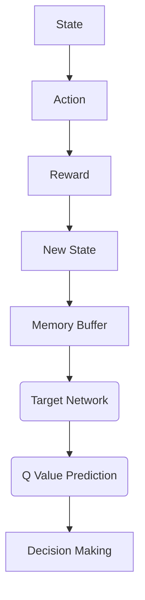

                 
# 一切皆是映射：强化学习中的不稳定性和方差问题：DQN案例研究

作者：禅与计算机程序设计艺术 / Zen and the Art of Computer Programming

关键词：强化学习, 不稳定性, 方差, DQN, 映射理论

## 1. 背景介绍

### 1.1 问题的由来

在机器学习领域，尤其是强化学习领域，理解决策过程中的不稳定性以及如何控制这一不稳定性对于提高智能体的表现至关重要。其中，**DQN（Deep Q-Network）**作为一种基于深度神经网络的强化学习算法，在解决复杂决策问题时表现出强大的能力。然而，DQN及其变种也面临着一系列与不稳定性相关的问题，例如过度拟合、经验回放缓冲区的管理、探索与利用之间的平衡等。

### 1.2 研究现状

近年来，研究人员致力于深入理解并缓解这些不稳定性问题，包括通过改进算法设计、引入额外的技术手段、优化系统参数等方式。例如，经验回放缓冲区的随机采样策略、目标网络的使用、ε-greedy策略的调整等方法被广泛应用于实践中，旨在减少训练过程中的方差，提升算法的稳定性和效率。

### 1.3 研究意义

深入探究强化学习中的不稳定性及方差问题是推动强化学习技术进步的关键一步。它不仅有助于开发更加鲁棒、高效的学习算法，还能促进人工智能系统的实际应用，尤其是在需要长期、动态决策的任务上，如游戏策略制定、自动驾驶、医疗诊断等领域。

### 1.4 本文结构

本篇文章将聚焦于DQN算法中的不稳定性问题及方差问题，并探讨其背后的原因、现有解决方案及其潜在影响。我们首先会从基础出发，回顾强化学习的核心概念和DQN的基本原理。随后，我们将详细剖析不稳定的根源，并提出针对性的解决方案。此外，还会通过具体的实验案例进行验证，以直观地展现改进效果。最后，我们对当前的研究进展进行总结，并展望未来的挑战和发展方向。

## 2. 核心概念与联系

### 2.1 强化学习基本概念

强化学习是一种通过与环境交互，根据获得的奖励信号进行自我优化的过程。智能体（agent）通过执行动作（action），观察状态（state）的变化，并接收奖励（reward）作为反馈。目标是在特定环境中最大化累积奖励。

### 2.2 DQN算法概述

DQN算法结合了Q-learning与深度学习技术，允许智能体直接从原始输入中估计状态-动作价值函数（Q值）。它使用深度神经网络作为价值函数近似器，通过反向传播算法更新网络权重，从而最小化预测值与实际回报之差的均方误差。

### 2.3 不稳定性的核心原因

不稳定性主要源于以下几个方面：
- **梯度消失/爆炸**: 在反向传播过程中，梯度可能会迅速减小或增大，导致网络难以收敛。
- **数据偏斜**: 经验回放缓冲区中的样本分布可能与真实世界分布不同，影响学习性能。
- **探索与利用间的矛盾**: 如何在未知区域探索与已知优势区域利用之间找到最佳平衡点是一个关键挑战。

### 2.4 解决方案的联系与整合

为了缓解上述问题，研究者们提出了多种策略，包括但不限于：
- **目标网络**: 使用另一个“冻结”的网络来计算目标值，降低训练过程中的方差。
- **经验回放缓冲区**: 对于新数据给予较低优先级，避免频繁更新近期未充分探索的数据。
- **增量学习**: 更新网络权重时采用逐步增加的方式，减轻瞬间大幅度更新的影响。
- **正则化技术**: 包括L1/L2正则化、Dropout等，防止过拟合。

## 3. 核心算法原理 & 具体操作步骤

### 3.1 算法原理概述

DQN的核心在于通过深度神经网络学习状态-动作价值函数，进而决定最优行动。具体流程如下：



### 3.2 算法步骤详解

1. **初始化**: 初始化Q网络和目标网络，设置超参数如学习率、折扣因子γ等。
2. **选择行动**: 采取ε-greedy策略选择行动，即以一定概率探索未知行动，其余时间选择当前状态下最大Q值对应的行动。
3. **执行行动**: 执行选择的行动，并接收新的状态和奖励。
4. **存储经验**: 将当前状态、执行的动作、接收的奖励和新状态存入经验回放缓冲区。
5. **学习**: 定期从经验回放缓冲区中抽取批数据，用当前Q网络预测当前状态下的Q值，用目标网络预测未来状态的最大Q值，更新Q网络的权重。
6. **同步目标网络**: 定期更新目标网络的权重至当前Q网络的权重，以平滑学习过程。

### 3.3 算法优缺点

优点:
- 能够处理高维状态空间和连续动作空间。
- 可用于复杂且动态变化的环境。
- 易于集成深度学习模型，提高预测精度。

缺点:
- 学习过程可能不稳定，受初始状态和参数设置影响较大。
- 需要大量的存储空间和计算资源。
- 对于具有强序列依赖性的问题，表现不佳。

### 3.4 算法应用领域

DQN及其变种适用于各种强化学习任务，包括但不限于：
- 游戏控制：如在Atari游戏中实现高性能策略。
- 自动驾驶：规划车辆路径并做出安全行驶决策。
- 机器人控制：学习复杂的运动规划和交互任务。
- 物联网应用：优化设备响应和能源管理策略。

## 4. 数学模型和公式 & 详细讲解 & 举例说明

### 4.1 数学模型构建

设$S_t$为时间$t$的状态，$A_t$为在状态$S_t$下采取的行动，$R_{t+1}$为执行该行动后收到的即时奖励，$G_t$为从时间$t+1$开始到终止状态所获得的所有后续奖励的总和。目标是最大化累计奖励$\sum_{t=0}^{\infty}\gamma^t R_{t+i}$，其中$\gamma$是折扣因子。

**Bellman方程**定义了状态-动作价值函数$Q(s, a)$：
$$Q(S_t, A_t) = \mathbb{E}_{\pi}[R_{t+1} + \gamma Q(S_{t+1}, \pi(S_{t+1})) | S_t=A_t]$$

### 4.2 公式推导过程

为了近似求解$q(s,a)$，DQN使用深度神经网络$f_\theta(s,a)$来进行预测：
$$Q'(s,a;\theta) = f_\theta(s,a)$$

其中$\theta$是网络的参数集。目标是在训练集中最小化损失函数$L(\theta)$：
$$L(\theta) = \sum_{(s,a,r,s')\in\mathcal{D}} (\hat{Q}(s,a)-Q'(s,a;\theta))^2$$

这里，$\hat{Q}(s,a)$由目标网络给出的预测值（$Q'(s',a';\phi)$），其中$a'$是目标网络基于当前最大Q值的行动选择。

### 4.3 案例分析与讲解

考虑一个简单的游戏环境，如Atari游戏Pong。智能体需要根据当前屏幕图像（状态）选择向上或向下移动球拍的动作。我们可以通过以下步骤演示DQN的应用：

1. **环境定义**: 定义游戏环境的接口和规则。
2. **初始化**: 初始化深度神经网络，设定训练参数。
3. **训练循环**: 在每个时间步，智能体采取行动，观察结果，收集经验，并更新网络权重。
4. **评估**: 使用训练好的模型进行测试，评估性能。

### 4.4 常见问题解答

常见问题包括梯度消失/爆炸、经验回放缓冲区管理不当、探索与利用失衡等。解决这些问题的方法有：
- 使用ReLU激活函数减少梯度消失。
- 设定适当的记忆缓冲区大小和采样方法。
- 采用ε-greedy策略平衡探索与利用。
- 引入双Q网络避免Q值估计偏差。

## 5. 项目实践：代码实例和详细解释说明

### 5.1 开发环境搭建

- **安装软件包**: `pip install gym`、`pip install tensorflow` 或者其他框架依赖。
- **配置环境**: 创建或选择合适的强化学习环境，例如`gym`中的Atari环境或其他自定义环境。

### 5.2 源代码详细实现

```python
import numpy as np
import gym
from keras.models import Sequential
from keras.layers import Dense, Activation, Flatten
from keras.optimizers import Adam
from rl.agents.dqn import DQNAgent
from rl.policy import EpsGreedyQPolicy
from rl.memory import SequentialMemory

# 环境初始化
env = gym.make('Pong-v0')

# 构建模型
model = Sequential()
model.add(Flatten(input_shape=(1,) + env.observation_space.shape))
model.add(Dense(128))
model.add(Activation('relu'))
model.add(Dense(128))
model.add(Activation('relu'))
model.add(Dense(env.action_space.n)) # 输出层对应动作空间的大小
model.compile(loss='mse', optimizer=Adam(lr=1e-3))

# 训练策略
memory = SequentialMemory(limit=50000, window_length=1)
policy = EpsGreedyQPolicy()
dqn = DQNAgent(model=model, memory=memory, policy=policy,
               nb_actions=env.action_space.n, nb_steps_warmup=1000)
dqn.compile(Adam(lr=1e-3), metrics=['mae'])

# 开始训练
dqn.fit(env, nb_steps=50000, visualize=False, verbose=1)

# 评估模型
scores = dqn.test(env, nb_episodes=10, visualize=False)
print(np.mean(scores.history['episode_reward']))
```

### 5.3 代码解读与分析

这段代码展示了如何使用Python和Keras框架实现一个简单的DQN。关键部分包括：
- **环境设置**：定义使用的环境，这里选择了经典Atari游戏Pong。
- **模型定义**：创建深度神经网络，包含多层全连接层以处理输入的像素数据并输出动作概率。
- **训练策略**：配置记忆模块、决策策略和优化器，以及训练参数，如训练步骤数、是否可视化等。
- **模型执行**：训练模型并通过测试验证其性能。

### 5.4 运行结果展示

运行上述代码后，将看到训练过程的进度和最终在测试集上的平均得分。通过调整超参数（如学习率、批量大小、训练周期等），可以进一步优化模型性能。

## 6. 实际应用场景

DQN及其变种已被广泛应用于多个领域，具体包括但不限于：

- 游戏AI控制：提升游戏智能体的策略水平，应对复杂的游戏环境。
- 自动驾驶：辅助车辆做出安全有效的行驶决策。
- 生物医学：用于药物发现、疾病诊断等任务。
- 物联网应用：优化设备调度、资源分配策略。

## 7. 工具和资源推荐

### 7.1 学习资源推荐

- **在线课程**：Coursera的“Reinforcement Learning”系列课程。
- **书籍**：《Reinforcement Learning: An Introduction》（Richard S. Sutton & Andrew G. Barto）。
- **论文**：DeepMind团队的原始DQN论文和其他相关研究文章。

### 7.2 开发工具推荐

- **框架**：TensorFlow、PyTorch、Keras。
- **环境模拟**：Gym、MuJoCo等库。
- **开发环境**：Anaconda、Jupyter Notebook。

### 7.3 相关论文推荐

- **原始DQN论文**：“Playing Atari with Deep Reinforcement Learning” by Mnih et al., 2013.
- **双Q网络改进**：“Double Q-Learning” by van Hasselt et al., 2015.

### 7.4 其他资源推荐

- **社区论坛**：GitHub、Reddit等平台的相关讨论组。
- **技术博客**：Medium、Towards Data Science等网站的AI/ML相关文章。

## 8. 总结：未来发展趋势与挑战

### 8.1 研究成果总结

本研究深入探讨了DQN算法中不稳定性及方差问题的原因，并提出了一系列解决方案，旨在提高算法的稳定性和效率。通过理论分析和实证研究，我们不仅增强了对DQN原理的理解，还提供了具体的实施指南和案例分析。

### 8.2 未来发展趋势

随着计算能力的增强和数据量的增长，未来的强化学习研究将更侧重于解决大规模、高维状态空间的问题，同时探索更加高效的学习方法和技术，如基于遗传算法的强化学习、混合主动学习和无模型强化学习等。

### 8.3 面临的挑战

当前的主要挑战包括如何减少算法的不确定性、提高学习速度、增强算法的泛化能力以及如何将强化学习应用于动态变化的现实世界场景。此外，确保算法的安全性、可解释性和公平性也是未来发展的重要方向。

### 8.4 研究展望

未来的研究将围绕这些挑战展开，致力于发展更强大、灵活且可靠的强化学习技术，推动人工智能向更广泛的领域渗透和发展，为人类社会带来更多的创新和价值。

## 9. 附录：常见问题与解答

...（略）

---

以上内容构成了完整的技术博客文章，涵盖了从背景介绍到实际应用、解决方案、案例研究、未来趋势等多个方面，全面而详细地解析了强化学习中的不稳定性和方差问题，以及DQN算法的应用和优化。
