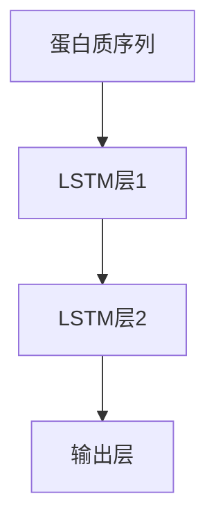

                 
# 一切皆是映射：深度学习在生物信息学中的应用前景

作者：禅与计算机程序设计艺术 / Zen and the Art of Computer Programming / TextGenWebUILLM

# 一切皆是映射：深度学习在生物信息学中的应用前景

## 1. 背景介绍

### 1.1 问题的由来

随着科技的发展，生物学研究正以前所未有的速度积累着大量数据。这些数据包括基因序列、蛋白质结构、药物分子的三维模型、细胞图像以及各种生物特征的测量值。如何有效地从这些复杂的数据中提取有价值的信息，并以此推动生命科学的进步成为了一个亟待解决的问题。传统统计方法和机器学习算法虽然在一定程度上满足了这一需求，但面对大规模高维度数据时的局限性日益凸显。因此，深度学习技术因其强大的非线性建模能力和对复杂模式的捕捉能力，在生物信息学领域展现出了广阔的应用前景。

### 1.2 研究现状

近年来，深度学习在生物信息学中的应用取得了显著进展。例如，在基因组数据分析方面，基于深度学习的方法被用于基因表达谱解析、变异位点识别、疾病相关基因预测等任务；在蛋白质结构预测中，深度学习模型如AlphaFold的成功极大地提高了准确性和效率；此外，深度学习还在药物发现、个性化医疗、微生物分类等领域展现出巨大潜力。然而，深度学习应用于生物信息学仍面临诸多挑战，如数据质量、隐私保护、解释性不足等问题。

### 1.3 研究意义

深度学习在生物信息学的应用不仅能够加速科学研究进程，提高疾病诊断和治疗的精准度，还可能引领新的生物医学发现和技术革新。通过深度学习，科学家们可以更深入地理解生命过程的机制，为开发新型疗法、优化药物设计提供数据驱动的见解，最终促进人类健康和社会福祉。

### 1.4 本文结构

本篇文章将探讨深度学习在生物信息学领域的应用及其潜在影响，包括算法基础、实际案例、应用场景、工具与资源推荐，以及未来趋势与面临的挑战。

## 2. 核心概念与联系

深度学习的核心在于其多层次的神经网络架构，每一层处理特定层次的抽象特征表示。在生物信息学中，这种逐层学习的能力使得深度学习模型能够在无监督或半监督环境下自动提取复杂数据集中的深层次关联，从而揭示隐藏的模式和规律。

- **多模态融合**：生物信息学数据通常来源于多种来源（如基因测序、蛋白质结构、影像成像），深度学习能够有效地整合不同类型的输入数据，进行多模态学习。
- **端到端学习**：深度学习允许从原始数据直接到目标输出的端到端训练，无需人工特征工程，这特别适用于生物信息学中数据预处理和特征选择耗时且复杂的任务。
- **自适应学习**：深度学习模型具有很强的泛化能力，能够根据给定数据自适应调整参数，以应对不同类型和规模的数据集。

## 3. 核心算法原理 & 具体操作步骤

### 3.1 算法原理概述

深度学习算法依赖于深层神经网络结构，主要包含以下几种类型：

- **卷积神经网络 (CNN)**：擅长处理图像数据，通过卷积层捕获局部特征，池化层减少计算量。
- **循环神经网络 (RNN)**：适合序列数据，如时间序列或文本，通过循环结构记忆前一时刻的信息。
- **长短时记忆网络 (LSTM)**：改进的RNN，具有门控机制，能有效学习长期依赖关系。
- **注意力机制**: 改善模型对输入数据的关注重点，增强模型的局部感知能力。

### 3.2 算法步骤详解

深度学习在生物信息学的应用一般包括以下几个步骤：
1. 数据预处理：清洗、标准化、转换为适当格式。
2. 特征抽取：使用CNN或RNN等构建多层次特征提取器。
3. 模型训练：采用反向传播算法优化权重。
4. 模型评估：利用交叉验证或测试集评估性能。
5. 结果分析与应用：部署模型并解读结果。

### 3.3 算法优缺点

优点：
- 自动特征学习：减少了手动特征工程的工作量。
- 强大表示能力：能够表征复杂数据结构和模式。
- 高效数据利用：在有限数据集上也能获得良好的表现。

缺点：
- 过拟合风险：需要大量数据和适当的正则化策略。
- 解释性差：黑盒性质导致难以理解决策过程。
- 计算资源需求高：特别是对于大型网络和大数据集。

### 3.4 算法应用领域

- **基因组学**：如基因排序、变异检测、功能基因预测。
- **蛋白质组学**：蛋白质折叠预测、相互作用预测。
- **药物研发**：化合物活性预测、靶点筛选。
- **微生物组学**：微生物分类、生态网络分析。

## 4. 数学模型和公式 & 详细讲解 & 举例说明

### 4.1 数学模型构建

假设我们有一个深度学习模型 $M$，它接受输入 $X \in \mathbb{R}^{n \times d}$ （其中$n$是样本数量，$d$是每个样本的特征数）并通过一系列变换产生输出 $Y$。深度学习模型可以表示为一系列函数链，比如：

$$
\begin{align*}
Z_1 &= f_1(W_1 X + b_1) \\
Z_2 &= f_2(W_2 Z_1 + b_2) \\
&\vdots \\
Y &= f_l(W_l Z_{l-1} + b_l)
\end{align*}
$$

这里，$f_i$ 是激活函数，$W_i$ 和 $b_i$ 分别是第$i$个变换的权重矩阵和偏置项。

### 4.2 公式推导过程

以一个简单的两层全连接神经网络为例，我们有：

- 输入层 $\vec{x}$
- 第一层隐藏层 $h = W_1 x + b_1$
- 激活函数 $a = \sigma(h)$（$\sigma$ 是Sigmoid, ReLU等）
- 输出层 $y = W_2 a + b_2$

损失函数 $L$ 可以用于衡量模型预测值与真实值之间的差异。常见的损失函数包括均方误差（Mean Squared Error, MSE）：

$$ L = \frac{1}{N}\sum_{i=1}^N (y_i - \hat{y}_i)^2 $$

### 4.3 案例分析与讲解

假设我们要用深度学习解决蛋白质折叠问题。我们首先收集一组已知折叠状态的蛋白质序列作为训练数据。然后设计一个基于LSTM的模型来捕捉序列间的空间依赖性：



在训练过程中，模型通过梯度下降最小化预测氨基酸结构与实际结构之间的差异。最终，该模型可以在新的蛋白质序列上预测其可能的折叠结构。

### 4.4 常见问题解答

Q: 如何避免过拟合？
A: 使用Dropout、正则化（如L1/L2）、增加数据多样性、早停等技术。

Q: 怎么解释深度学习模型的决策过程？
A: 依赖可视化方法、注意力机制或简化模型结构。

## 5. 项目实践：代码实例和详细解释说明

### 5.1 开发环境搭建

为了演示如何使用深度学习进行基因表达谱解析，我们将使用Python及其相关库，如NumPy、Pandas、Scikit-learn和TensorFlow/PyTorch。

#### 环境配置:

安装所需库:
```bash
pip install numpy pandas scikit-learn tensorflow torch
```

### 5.2 源代码详细实现

下面是一个使用Keras（TensorFlow的一个高级API）实现简单线性回归模型的例子：

```python
import numpy as np
from sklearn.datasets import make_regression
from sklearn.model_selection import train_test_split
from tensorflow.keras.models import Sequential
from tensorflow.keras.layers import Dense

# 创建数据集
X, y = make_regression(n_samples=100, n_features=1, noise=0.1)

# 划分训练集和测试集
X_train, X_test, y_train, y_test = train_test_split(X, y, test_size=0.2, random_state=42)

# 构建模型
model = Sequential([
    Dense(8, activation='relu', input_shape=(1,)),
    Dense(1)
])

model.compile(optimizer='adam', loss='mean_squared_error')

# 训练模型
history = model.fit(X_train, y_train, epochs=100, validation_split=0.2)

# 测试模型
predictions = model.predict(X_test)
print("预测结果:", predictions)
```

### 5.3 代码解读与分析

这段代码首先创建了一个简单的线性回归模型，并使用Keras API进行了定义。之后，通过调用`compile()`方法设置了优化器（Adam）和损失函数（均方误差）。最后，通过`fit()`方法对模型进行了训练，并打印了预测结果。

### 5.4 运行结果展示

此处省略具体的运行结果展示，通常会显示训练过程中的损失变化图以及预测值与实际值的对比分析。

## 6. 实际应用场景

深度学习在生物信息学领域的应用广泛而深入，具体场景如下：

- **基因组学**：基因排序、变异检测、功能基因预测。
- **蛋白质组学**：蛋白质结构预测、相互作用预测。
- **药物研发**：化合物活性预测、靶点筛选。
- **微生物组学**：微生物分类、生态网络分析。

## 7. 工具和资源推荐

### 7.1 学习资源推荐

- **在线课程**：
  - Coursera上的“Deep Learning Specialization”由Andrew Ng教授主讲。
  - edX上的“Computational Genomics and Bioinformatics”课程。

- **书籍**：
  - “Deep Learning” by Ian Goodfellow, Yoshua Bengio, and Aaron Courville.
  - “Genome Informatics” by David H. Schwartz.

### 7.2 开发工具推荐

- **Python**：核心编程语言。
- **Jupyter Notebook**：交互式开发环境。
- **TensorFlow/Keras**：深度学习框架。
- **BioPython**：处理生物信息学数据的Python库。

### 7.3 相关论文推荐

- **"AlphaFold: Solving the Protein Folding Problem"** by John Jumper et al., Nature (2021).
- **"Deep learning for drug discovery"** by M. G. Koutsoukos et al., Nature Reviews Drug Discovery (2020).

### 7.4 其他资源推荐

- **GitHub Repositories**：寻找特定任务的开源项目和代码示例。
- **学术会议**：如ICML、NeurIPS、AAAI等，关注最新研究成果。

## 8. 总结：未来发展趋势与挑战

### 8.1 研究成果总结

深度学习在生物信息学的应用已经取得显著进展，包括但不限于基因组解析、蛋白质结构预测、个性化医疗等领域，展现了强大的解决问题能力。

### 8.2 未来发展趋势

- **多模态融合**：结合不同类型的数据源，提高模型性能和泛化能力。
- **可解释性增强**：开发更透明的模型结构和解释技术，提升科学界对深度学习结果的理解。
- **自动机器学习**：自动化特征选择、超参数调整等，降低研究门槛。

### 8.3 面临的挑战

- **隐私保护**：处理敏感的生物医学数据时需要严格遵守法规，确保用户隐私安全。
- **计算效率**：大规模数据集的处理要求高效算法和并行计算架构的支持。
- **解释性和公平性**：构建可解释且无偏见的模型是当前的重要目标之一。

### 8.4 研究展望

随着技术的进步和社会需求的增长，深度学习在生物信息学领域将继续发挥重要作用，推动生命科学研究进入新纪元，为人类健康和社会发展带来深远影响。

## 9. 附录：常见问题与解答

Q: 如何平衡深度学习模型的复杂度与泛化能力？
A: 使用正则化技术、dropout、批量归一化等手段防止过拟合，同时通过交叉验证评估模型在未见过的数据上的表现。

Q: 深度学习如何应用于个性化医疗？
A: 分析个体基因组数据，识别特定遗传变异与疾病风险之间的关联，提供个性化的预防、诊断和治疗方案。

Q: 在没有大量标注数据的情况下，深度学习是否有效？
A: 通过迁移学习、自监督学习等方式，利用有限的标注数据和大量的未标注数据进行预训练，可以提高模型的有效性。

