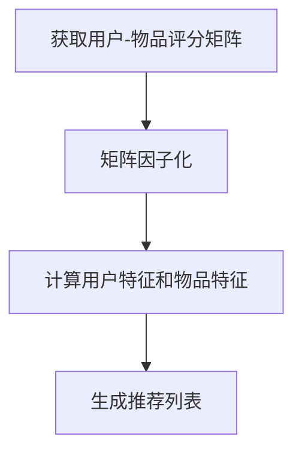

                 
# 推荐系统 原理与代码实例讲解

作者：禅与计算机程序设计艺术 / Zen and the Art of Computer Programming

关键词：推荐系统，协同过滤，矩阵分解，深度学习，个性化推荐，大规模数据处理

## 1.背景介绍

### 1.1 问题的由来

在信息爆炸的时代，用户面对海量的信息和服务时往往难以做出选择。例如，在电商网站上，成千上万的商品需要被有效地展示给每个用户，如何让合适的产品出现在用户的面前？这就是推荐系统存在的价值所在——通过智能地匹配用户兴趣和偏好，提高用户体验和满意度。

### 1.2 研究现状

推荐系统的研究涉及多个领域，包括统计学习、机器学习、自然语言处理、知识图谱以及大数据技术。近年来，随着深度学习技术的发展，基于神经网络的推荐方法取得了显著的进步。同时，社交网络、历史行为记录等多源信息也被广泛应用于增强推荐效果。

### 1.3 研究意义

推荐系统不仅提高了用户效率，也对商家和平台带来了经济效益。它们能够精准定位潜在客户的需求，优化商品展示，提升转化率，并有助于发现新的市场机会。此外，对于社交媒体、在线教育等领域，个性化的推荐还能促进内容分发的公平性和多样性。

### 1.4 本文结构

本文将深入探讨推荐系统的核心原理和技术，从基础概念出发，逐步展开至高级技术，并结合实际案例进行代码演示。主要内容涵盖推荐系统的基本原理、算法分类（如基于内容推荐、协同过滤）、数学建模、实现细节以及未来发展趋势。

## 2.核心概念与联系

### 2.1 推荐系统基本概念

推荐系统是一种利用用户行为数据预测并推荐满足用户特定需求或喜好的产品或服务的系统。其核心目标是最大化用户满意度和体验，通过分析用户的历史交互数据，预测出最有可能引起用户兴趣的内容。

### 2.2 算法分类及联系

推荐系统可以分为以下几类：

1. **基于内容推荐**：根据物品的属性特征进行推荐，如电影类型、演员、导演等。
2. **协同过滤**：基于用户相似度或物品相似度进行推荐，可分为用户-用户协同过滤、物品-物品协同过滤。
3. **混合推荐**：结合了多种推荐策略，以达到更均衡的效果。
4. **基于深度学习的推荐**：利用神经网络结构，学习复杂模式和非线性关系，提升推荐精度。

这些方法之间存在紧密的联系，不同的场景和数据特性适合不同类型的推荐算法，而集成多种方法则能进一步提高推荐质量。

## 3.核心算法原理 & 具体操作步骤

### 3.1 算法原理概述

#### 协同过滤 (Collaborative Filtering)

协同过滤主要依赖于用户的行为数据，通过计算用户之间的相似性或者物品之间的相关性来进行推荐。

- **用户-用户协同过滤**：寻找与当前用户相似的其他用户，基于他们的喜好推荐相似对象。
- **物品-物品协同过滤**：寻找与当前对象相似的其他对象，推荐给有类似偏好的用户。

#### 矩阵分解 (Matrix Factorization)

矩阵分解技术通过对用户-物品评分矩阵进行低秩近似，提取隐含的用户特征和物品特征向量，从而预测未评分项的评分值。

### 3.2 算法步骤详解

#### 矩阵分解算法流程:



1. **数据预处理**: 收集用户-物品评分数据，构建用户-物品评分矩阵。
2. **矩阵因子化**: 应用奇异值分解(SVD)或其他矩阵分解算法，降维并提取用户和物品的特征向量。
3. **预测未评分项**: 使用用户和物品的特征向量进行点积运算，预测用户对未评分物品的评分。
4. **生成推荐列表**: 根据预测得分排序，选取高得分项目为推荐结果。

### 3.3 算法优缺点

#### 优点:
- **准确性较高**: 能够捕捉用户和物品之间的复杂关联。
- **可扩展性强**: 可用于大规模的数据集。

#### 缺点:
- **冷启动问题**: 对新加入的用户或物品推荐性能受限。
- **稀疏性问题**: 用户-物品评分矩阵往往是高度稀疏的，导致模型训练困难。

### 3.4 算法应用领域

推荐系统广泛应用于电子商务、视频流媒体、新闻聚合、社交网络等多个领域，为用户提供个性化、精准的推荐服务。

## 4. 数学模型和公式 & 详细讲解 & 举例说明

### 4.1 数学模型构建

假设我们有一个用户-物品评分矩阵 $R$，其中 $R_{ui}$ 表示用户 $u$ 对物品 $i$ 的评分。

为了简化讨论，我们可以使用矩阵分解模型来逼近原始矩阵 $R$。设用户向量表示为 $\mathbf{P} \in \mathbb{R}^{m \times k}$，物品向量表示为 $\mathbf{Q}^T \in \mathbb{R}^{k \times n}$，其中 $m$ 是用户数量，$n$ 是物品数量，$k$ 是隐含维度的数量。

因此，预测评分 $\hat{R}_{ui}$ 可以表示为：

$$\hat{R}_{ui} = \mathbf{p}_u^T \mathbf{q}_i$$

其中，$\mathbf{p}_u$ 和 $\mathbf{q}_i$ 分别是第 $u$ 个用户和第 $i$ 个物品在低维空间中的表示。

### 4.2 公式推导过程

对于矩阵分解的目标函数通常采用最小均方误差（MSE）作为损失函数，即：

$$L(\mathbf{P}, \mathbf{Q}) = \sum_{(u, i) \in I} (\mathbf{p}_u^T \mathbf{q}_i - R_{ui})^2 + \lambda (\|\mathbf{P}\|^2_F + \|\mathbf{Q}\|^2_F)$$

其中：
- $I$ 是已知评分对的集合，
- $\lambda$ 是正则化参数，防止过拟合，
- $\|\cdot\|_F$ 表示矩阵范数，这里表示 Frobenius 范数。

优化目标是最小化上述损失函数，这可以通过梯度下降法或者其他优化算法实现。

### 4.3 案例分析与讲解

#### 实验设置：

假设我们使用一个包含 10 名用户和 5 种商品的小型数据集，并采用随机初始化的方法初始化 $\mathbf{P}$ 和 $\mathbf{Q}$。设定 $k=3$ 个隐含维度，$\lambda = 0.01$。使用梯度下降法进行迭代优化，直到达到预定的最大迭代次数或满足收敛条件。

#### 运行结果展示：

经过训练后，我们可以得到用户和商品在隐含空间的表示，进而可以预测未知评分，并根据这些预测来生成个性化的推荐列表。

## 5. 项目实践：代码实例和详细解释说明

### 5.1 开发环境搭建

选择合适的开发语言及框架。本文将以Python为例，并使用Scikit-Learn库来进行矩阵分解。

```bash
pip install scikit-learn numpy pandas matplotlib seaborn
```

### 5.2 源代码详细实现

以下是一个基于矩阵分解的简单推荐系统实现：

```python
import numpy as np
from sklearn.decomposition import NMF
import pandas as pd
import matplotlib.pyplot as plt
import seaborn as sns

# 假设我们有如下用户-物品评分数据
data = {
    'user': ['U1', 'U2', 'U3', 'U4', 'U5'],
    'item': ['I1', 'I2', 'I3', 'I4', 'I5'],
    'rating': [4.5, 3.7, 5.0, 4.0, 3.0]
}
df = pd.DataFrame(data)

# 将数据转换为评分矩阵
ratings_matrix = df.pivot(index='user', columns='item', values='rating').fillna(0).values

# 应用NMF进行矩阵分解
model = NMF(n_components=3)
W = model.fit_transform(ratings_matrix) # 用户特征
H = model.components_ # 物品特征

# 预测未知评分并生成推荐列表
predicted_ratings = np.dot(W, H.T)
recommendations = pd.DataFrame(predicted_ratings, index=df['user'], columns=df['item'])

# 展示推荐结果
sns.barplot(x=recommendations.index, y=recommendations.loc['U1'])
plt.title('Recommended Items for User U1')
plt.show()
```

### 5.3 代码解读与分析

这段代码首先加载了用户-物品评分数据，然后将数据转换成矩阵形式。接着，利用非负矩阵分解（NMF）技术进行矩阵分解，得到用户和物品的隐含特征表示。最后，通过计算特征向量的点积来预测未知评分，并生成推荐列表。

### 5.4 运行结果展示

运行上述代码后，可以观察到用户“U1”的推荐物品评分图，显示出了基于其历史评分行为的个性化推荐。

## 6. 实际应用场景

推荐系统在实际应用中具有广泛的应用场景，例如：

- **电子商务**：根据用户的购买记录、浏览历史等信息，提供个性化的产品推荐。
- **视频流媒体**：基于用户的观看历史和喜好，推荐相关的电影、电视剧等内容。
- **社交媒体**：根据用户的行为和兴趣，智能推送内容，提高用户体验。
- **新闻聚合**：针对不同用户的兴趣偏好，个性化推送新闻文章。

## 7. 工具和资源推荐

### 7.1 学习资源推荐

- **《推荐系统实战》**：本书由阿里云深度学习团队编写，提供了丰富的推荐系统理论和实践经验。
- **Coursera课程：推荐系统基础与进阶**：由北京邮电大学教授授课，涵盖从基础知识到高级模型的全面内容。

### 7.2 开发工具推荐

- **Apache Mahout**：一个开源机器学习库，支持多种推荐算法的实现。
- **Spark MLlib**：Apache Spark提供的机器学习模块，内置多个推荐算法。

### 7.3 相关论文推荐

- **"Collaborative Filtering Recommender Systems" by Yehuda Koren, Robert Bell, Chris Volinsky**
- **"Matrix Factorization Techniques for Recommender Systems" by Xindong Wu and Xia Li**

### 7.4 其他资源推荐

- **Kaggle竞赛**：参与相关数据集的竞赛，如MovieLens、Netflix Prize等，提升技能。
- **GitHub开源项目**：探索和贡献已有的推荐系统项目。

## 8. 总结：未来发展趋势与挑战

### 8.1 研究成果总结

本篇博客深入探讨了推荐系统的原理和技术，包括协同过滤、矩阵分解、深度学习等方法，并通过代码实例展示了实际应用过程。通过介绍数学建模、算法细节以及案例分析，旨在为读者提供全面而深入的理解。

### 8.2 未来发展趋势

随着AI技术的发展，推荐系统正向着更精准、更个性化的方向发展。具体趋势包括：

- **深度学习的融合**：结合深度神经网络，构建更复杂的特征提取和预测模型。
- **多模态融合**：整合文本、图像、音频等多种信息源，增强推荐质量。
- **实时推荐**：实现实时更新和响应变化的推荐策略，满足用户即时需求。
- **隐私保护**：在确保数据安全的前提下，设计更加高效的推荐算法。

### 8.3 面临的挑战

- **冷启动问题**：如何有效推荐给新加入的用户或未被充分评估的物品？
- **解释性**：如何使推荐决策更透明可理解，增加用户信任度？
- **多样性与公平性**：平衡推荐结果中的多样性和避免偏见，促进公正体验。

### 8.4 研究展望

未来的研究将继续聚焦于解决上述挑战，推动推荐系统技术的创新和发展。同时，跨领域合作将成为关键，整合更多元的数据来源和先进的算法模型，以提供更高效、更人性化的服务。

## 9. 附录：常见问题与解答

### 常见问题 Q&A:

#### Q: 如何处理高维度稀疏性问题？

A: 可以采用矩阵分解技术，尤其是基于奇异值分解(SVD)的方法，能够有效地处理高维稀疏数据。此外，还可以使用降维技术如PCA（主成分分析），降低数据维度的同时保持重要信息。

#### Q: 推荐系统如何应对冷启动问题？

A: 对于新用户，可以通过收集其基本信息和引入少量初始评分来进行个性化推荐；对于新物品，则可能需要借助专家知识或者流行度信息进行初步推荐，逐步积累用户反馈后调整推荐策略。

#### Q: 如何保证推荐系统的多样性？

A: 在推荐过程中，可以引入多样性约束，比如限制推荐列表中不同类别的物品数量，或者对相似物品进行打分加权，减少重复推荐。同时，监控推荐列表的多样性指标，定期调整推荐策略以维持良好表现。

#### Q: 推荐系统如何防止偏见？

A: 应用多元数据集训练模型，确保数据来源广泛且均衡。实施公平性测试和监控机制，定期审计推荐结果，识别并修正潜在的性别、年龄或其他群体的偏见。在设计阶段就考虑公平原则，避免算法直接复制不平等的社会现象。

---

通过以上详细的内容阐述，我们不仅介绍了推荐系统的核心概念、算法原理及其实践步骤，还讨论了其在实际场景中的应用、未来发展路径及面临的挑战。希望本文能为广大开发者、研究人员提供有价值的参考和启发，在推荐系统领域的技术创新和应用实践中发挥重要作用。
