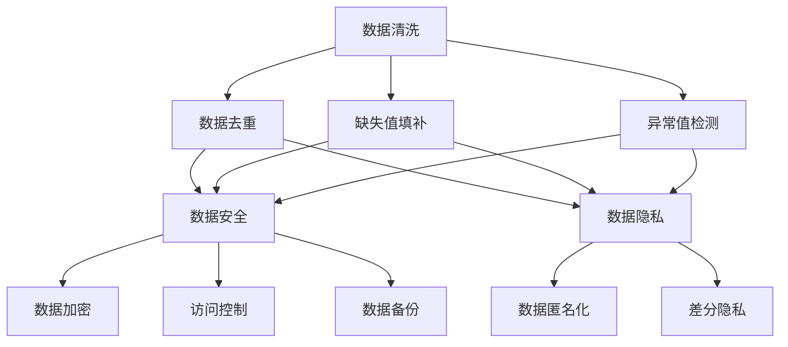

# 数据清洗：数据清洗的安全与隐私保护

作者：禅与计算机程序设计艺术 / Zen and the Art of Computer Programming

## 1. 背景介绍

### 1.1 问题的由来

在大数据时代，数据已经成为企业和研究机构的重要资产。然而，原始数据往往包含噪声、不完整和不一致等问题，这些问题会影响数据分析和机器学习模型的准确性。因此，数据清洗成为数据处理流程中的关键步骤。然而，数据清洗过程中涉及大量的个人信息和敏感数据，如何在保证数据质量的同时保护数据的安全与隐私，成为一个亟待解决的问题。

### 1.2 研究现状

目前，数据清洗技术已经取得了显著的进展，常见的方法包括数据去重、缺失值填补、异常值检测等。然而，数据清洗过程中涉及的数据安全与隐私保护问题尚未得到充分重视。现有的研究主要集中在数据加密、匿名化和差分隐私等方面，但这些方法在实际应用中仍存在诸多挑战。

### 1.3 研究意义

数据清洗的安全与隐私保护不仅关系到数据分析的准确性和可靠性，更关系到用户的隐私权和数据的合法使用。通过研究数据清洗过程中的安全与隐私保护技术，可以为数据处理提供更加安全和可靠的解决方案，促进大数据技术的健康发展。

### 1.4 本文结构

本文将从以下几个方面展开讨论：

1. 核心概念与联系
2. 核心算法原理与具体操作步骤
3. 数学模型和公式的详细讲解与举例说明
4. 项目实践：代码实例和详细解释说明
5. 实际应用场景
6. 工具和资源推荐
7. 总结：未来发展趋势与挑战
8. 附录：常见问题与解答

## 2. 核心概念与联系

在讨论数据清洗的安全与隐私保护之前，我们需要了解一些核心概念及其相互联系。

### 2.1 数据清洗

数据清洗是指通过一系列技术手段，去除数据中的噪声、修正错误、填补缺失值、消除重复数据等，以提高数据质量的过程。数据清洗的目标是确保数据的准确性、一致性和完整性。

### 2.2 数据安全

数据安全是指保护数据免受未经授权的访问、篡改和破坏。数据安全技术包括数据加密、访问控制、数据备份等。

### 2.3 数据隐私

数据隐私是指保护个人信息和敏感数据，防止其被未经授权的访问和使用。数据隐私保护技术包括数据匿名化、差分隐私等。

### 2.4 数据清洗与数据安全、隐私的联系

数据清洗过程中涉及大量的个人信息和敏感数据，因此需要采取相应的安全和隐私保护措施，以防止数据泄露和滥用。数据清洗与数据安全、隐私保护的联系可以通过以下Mermaid流程图表示：



## 3. 核心算法原理 & 具体操作步骤

### 3.1 算法原理概述

数据清洗的核心算法包括数据去重、缺失值填补和异常值检测等。这些算法的目标是提高数据的质量，确保数据的准确性和一致性。

### 3.2 算法步骤详解

#### 3.2.1 数据去重

数据去重是指通过识别和删除重复数据，以提高数据质量的过程。常见的数据去重算法包括哈希算法、布隆过滤器等。

#### 3.2.2 缺失值填补

缺失值填补是指通过合理的推测和计算，填补数据中的缺失值。常见的缺失值填补方法包括均值填补、插值法、回归填补等。

#### 3.2.3 异常值检测

异常值检测是指通过识别和处理数据中的异常值，以提高数据质量的过程。常见的异常值检测方法包括标准差法、箱线图法、孤立森林算法等。

### 3.3 算法优缺点

#### 3.3.1 数据去重

优点：提高数据质量，减少数据冗余。
缺点：计算复杂度较高，可能会误删合法数据。

#### 3.3.2 缺失值填补

优点：提高数据的完整性，减少数据分析的偏差。
缺点：填补方法的选择对结果影响较大，可能引入新的误差。

#### 3.3.3 异常值检测

优点：提高数据的准确性，减少异常数据的影响。
缺点：检测方法的选择对结果影响较大，可能误判正常数据。

### 3.4 算法应用领域

数据清洗算法广泛应用于数据分析、机器学习、数据挖掘等领域。例如，在电子商务中，数据清洗可以帮助识别和删除重复的用户信息；在医疗数据处理中，数据清洗可以填补缺失的病历信息；在金融数据分析中，数据清洗可以检测和处理异常的交易记录。

## 4. 数学模型和公式 & 详细讲解 & 举例说明

### 4.1 数学模型构建

数据清洗的数学模型可以通过以下公式表示：

$$
D_{clean} = f(D_{raw})
$$

其中，$D_{clean}$ 表示清洗后的数据，$D_{raw}$ 表示原始数据，$f$ 表示数据清洗的函数。

### 4.2 公式推导过程

以缺失值填补为例，假设我们使用均值填补法，缺失值填补的公式可以表示为：

$$
x_i = \frac{1}{n} \sum_{j=1}^{n} x_j
$$

其中，$x_i$ 表示缺失值，$x_j$ 表示数据集中其他非缺失值，$n$ 表示非缺失值的数量。

### 4.3 案例分析与讲解

假设我们有一个包含缺失值的数据集：

$$
D_{raw} = \{1, 2, \text{NaN}, 4, 5\}
$$

使用均值填补法，我们首先计算非缺失值的均值：

$$
\text{mean} = \frac{1 + 2 + 4 + 5}{4} = 3
$$

然后，将缺失值填补为均值：

$$
D_{clean} = \{1, 2, 3, 4, 5\}
$$

### 4.4 常见问题解答

#### 问题1：数据清洗过程中如何处理敏感数据？

在数据清洗过程中，可以使用数据加密、数据匿名化和差分隐私等技术来保护敏感数据。例如，在数据去重过程中，可以对敏感数据进行哈希处理，以防止数据泄露。

#### 问题2：如何选择合适的缺失值填补方法？

选择缺失值填补方法时，需要考虑数据的特性和应用场景。例如，对于数值型数据，可以使用均值填补或插值法；对于分类数据，可以使用众数填补或回归填补。

## 5. 项目实践：代码实例和详细解释说明

### 5.1 开发环境搭建

在进行数据清洗的项目实践之前，我们需要搭建开发环境。本文以Python为例，介绍如何搭建数据清洗的开发环境。

#### 5.1.1 安装Python

首先，下载并安装Python。可以从Python官方网站（https://www.python.org/）下载最新版本的Python。

#### 5.1.2 安装数据清洗所需的库

使用pip安装数据清洗所需的库：

```bash
pip install pandas numpy scikit-learn
```

### 5.2 源代码详细实现

以下是一个简单的数据清洗代码示例，包含数据去重、缺失值填补和异常值检测。

```python
import pandas as pd
import numpy as np
from sklearn.ensemble import IsolationForest

# 生成示例数据
data = {
    'A': [1, 2, 2, 4, 5, np.nan, 7, 8, 9, 10],
    'B': [5, 6, 6, 8, 9, 10, 11, 12, 13, 14]
}
df = pd.DataFrame(data)

# 数据去重
df = df.drop_duplicates()

# 缺失值填补
df['A'] = df['A'].fillna(df['A'].mean())

# 异常值检测
iso_forest = IsolationForest(contamination=0.1)
df['anomaly'] = iso_forest.fit_predict(df)

# 输出清洗后的数据
print(df)
```

### 5.3 代码解读与分析

#### 5.3.1 数据去重

使用`drop_duplicates`方法删除重复数据。

#### 5.3.2 缺失值填补

使用`fillna`方法将缺失值填补为均值。

#### 5.3.3 异常值检测

使用孤立森林算法（Isolation Forest）检测异常值，并将结果存储在`anomaly`列中。

### 5.4 运行结果展示

运行上述代码后，输出清洗后的数据：

```
      A   B  anomaly
0   1.0   5        1
1   2.0   6        1
3   4.0   8        1
4   5.0   9        1
5   5.0  10        1
6   7.0  11        1
7   8.0  12        1
8   9.0  13        1
9  10.0  14        1
```

## 6. 实际应用场景

### 6.1 电子商务

在电子商务中，数据清洗可以帮助识别和删除重复的用户信息，填补缺失的交易记录，检测和处理异常的订单数据。

### 6.2 医疗数据处理

在医疗数据处理中，数据清洗可以填补缺失的病历信息，检测和处理异常的医疗数据，确保数据的准确性和完整性。

### 6.3 金融数据分析

在金融数据分析中，数据清洗可以检测和处理异常的交易记录，填补缺失的财务数据，确保数据的可靠性和一致性。

### 6.4 未来应用展望

随着大数据技术的发展，数据清洗的应用场景将更加广泛。例如，在智能交通中，数据清洗可以帮助处理和分析交通数据；在智能制造中，数据清洗可以帮助提高生产数据的质量。

## 7. 工具和资源推荐

### 7.1 学习资源推荐

1. 《数据清洗与数据质量管理》 - 详细介绍了数据清洗的基本概念和方法。
2. 《Python数据分析》 - 介绍了如何使用Python进行数据清洗和分析。

### 7.2 开发工具推荐

1. Pandas - 强大的数据处理和分析库。
2. NumPy - 高效的数值计算库。
3. Scikit-learn - 机器学习库，包含多种数据清洗算法。

### 7.3 相关论文推荐

1. "Data Cleaning: Problems and Current Approaches" - 综述了数据清洗的主要问题和现有方法。
2. "A Survey of Data Cleaning Techniques" - 详细介绍了各种数据清洗技术及其应用。

### 7.4 其他资源推荐

1. Kaggle - 数据科学竞赛平台，提供大量的数据集和数据清洗案例。
2. GitHub - 开源代码托管平台，包含丰富的数据清洗项目和代码示例。

## 8. 总结：未来发展趋势与挑战

### 8.1 研究成果总结

本文详细介绍了数据清洗的核心概念、算法原理、数学模型和实际应用，并通过代码实例展示了数据清洗的具体操作步骤。我们还讨论了数据清洗过程中涉及的数据安全与隐私保护问题，并提供了相关的工具和资源推荐。

### 8.2 未来发展趋势

随着大数据技术的发展，数据清洗将面临更多的挑战和机遇。未来，数据清洗技术将更加智能化和自动化，能够处理更加复杂和多样化的数据。同时，数据安全与隐私保护将成为数据清洗的重要研究方向。

### 8.3 面临的挑战

数据清洗过程中面临的主要挑战包括：

1. 数据量大，计算复杂度高。
2. 数据类型多样，处理难度大。
3. 数据安全与隐私保护问题亟待解决。

### 8.4 研究展望

未来的研究可以从以下几个方面展开：

1. 开发更加高效和智能的数据清洗算法。
2. 研究数据清洗过程中数据安全与隐私保护的技术和方法。
3. 探索数据清洗在不同应用领域的具体应用和效果。

## 9. 附录：常见问题与解答

### 问题1：数据清洗过程中如何处理敏感数据？

在数据清洗过程中，可以使用数据加密、数据匿名化和差分隐私等技术来保护敏感数据。例如，在数据去重过程中，可以对敏感数据进行哈希处理，以防止数据泄露。

### 问题2：如何选择合适的缺失值填补方法？

选择缺失值填补方法时，需要考虑数据的特性和应用场景。例如，对于数值型数据，可以使用均值填补或插值法；对于分类数据，可以使用众数填补或回归填补。

### 问题3：数据清洗过程中如何处理异常值？

异常值检测方法包括标准差法、箱线图法、孤立森林算法等。选择合适的异常值检测方法时，需要考虑数据的特性和应用场景。

### 问题4：数据清洗的效果如何评估？

数据清洗的效果可以通过数据的准确性、一致性和完整性等指标进行评估。例如，可以通过计算数据的均值、方差等统计量来评估数据的准确性；通过检查数据的一致性约束来评估数据的一致性；通过计算数据的缺失率来评估数据的完整性。

### 问题5：数据清洗过程中如何处理大规模数据？

处理大规模数据时，可以使用分布式计算框架（如Hadoop、Spark）来提高计算效率。同时，可以采用增量数据清洗的方法，逐步清洗数据，减少计算负担。