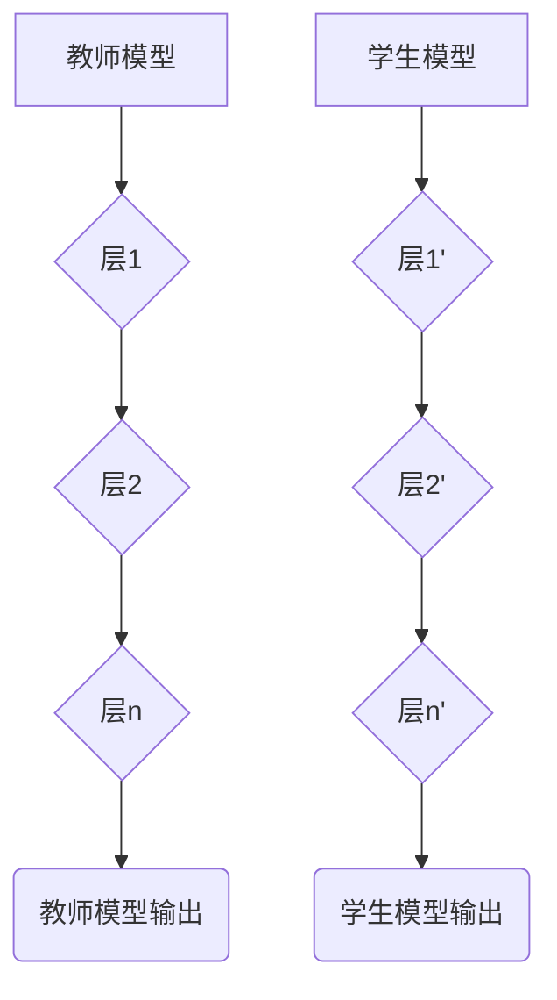

                 
# 知识蒸馏Knowledge Distillation原理与代码实例讲解

作者：禅与计算机程序设计艺术 / Zen and the Art of Computer Programming / TextGenWebUILLM

# 知识蒸馏Knowledge Distillation原理与代码实例讲解

## 1. 背景介绍

### 1.1 问题的由来

在机器学习和深度学习领域，随着网络结构变得越来越深，大容量的模型往往具有较高的参数量和复杂的内部表示能力，这些特性使得它们在训练过程中能从海量数据中学习到丰富且详细的特征表示。然而，在实际部署场景中，大模型可能面临内存限制、计算成本高或推理速度慢等问题。因此，如何利用较小模型高效地捕获并保留大模型的知识成为了一个关键需求。

### 1.2 研究现状

知识蒸馏作为一种迁移学习技术，旨在通过教师模型（大型预训练模型）向学生模型（小型可部署模型）传授知识，已广泛应用于各种场景，包括但不限于图像分类、语音识别、自然语言处理等。其主要目的是让小模型具备与大模型类似的学习能力和性能表现，同时保持较低的计算和存储成本。

### 1.3 研究意义

知识蒸馏不仅能够解决上述大模型部署问题，还能促进模型的泛化能力提升，并有助于理解复杂模型的行为。它不仅在学术界得到了广泛关注，也在工业界得到了广泛应用，特别是在移动设备和边缘计算等领域，是提高模型效率和实用性的重要手段。

### 1.4 本文结构

接下来的文章将深入探讨知识蒸馏的核心概念、原理及其在实际应用中的实施方法。我们将首先介绍知识蒸馏的基本原理和概念，然后详细阐述其背后的数学模型和算法细节。随后，通过具体的代码实例，展示如何在实践中实现知识蒸馏，并对其效果进行评估。最后，讨论知识蒸馏的应用范围、当前的研究趋势以及未来面临的挑战。

## 2. 核心概念与联系

知识蒸馏的关键思想在于，通过定义某种形式的教学损失函数，使学生模型模仿教师模型对特定任务的学习结果。这一过程通常涉及以下要素：

- **教师模型**（Teacher Model）：通常是经过大量数据训练的大规模模型，拥有丰富的知识和经验。
- **学生模型**（Student Model）：相对于教师模型而言体积更小、计算资源消耗更低，用于最终部署。
- **教学损失函数**（Teaching Loss Function）：衡量学生模型输出与教师模型输出之间的差异，引导学生模型学习知识。

### 2.1 教学损失函数

知识蒸馏的中心环节是设计一个合适的教学损失函数。常见的教学损失函数包括：

- **熵损失**（Entropy Loss）：鼓励学生模型输出分布接近于均匀分布或者教师模型的输出分布，以增强模型的多样性。
- **均方误差损失**（Mean Squared Error, MSE）：直接比较学生模型预测值与教师模型预测值的差距。
- **交叉熵损失**（Cross Entropy Loss）：度量学生模型的预测概率分布与目标分布之间的距离。

通过优化这个损失函数，可以有效引导学生模型学习到教师模型的决策逻辑和特征表示。

## 3. 核心算法原理及具体操作步骤

### 3.1 算法原理概述

知识蒸馏的目标是让小模型尽可能模拟大模型的行为。在训练阶段，除了传统的交叉熵损失外，还会添加额外的损失项，即来自教师模型的软标签信息。通过这种方式，学生模型能够学习到不仅仅是正确的答案，还包括了生成这些答案的过程和策略。

### 3.2 算法步骤详解

#### 步骤一：准备模型架构

选择合适的神经网络架构作为教师模型和学生模型。教师模型通常为已经过充分训练的大型模型，而学生模型则设计为轻量化版本。



#### 步骤二：定义教学损失函数

引入教师模型的输出作为指导信号，构造教学损失函数。这里可以使用交叉熵损失作为基础，结合其他形式的损失如熵损失或MSE损失。

#### 步骤三：训练过程

在每次迭代时，同时更新教师模型和学生模型的权重。对于每一个输入样本，先使用教师模型获取预测结果，然后根据教学损失函数调整学生模型的参数，以便使其更加贴近教师模型的行为。

#### 步骤四：评估与优化

通过验证集监控学生模型的表现，不断调整超参数以优化模型性能。

### 3.3 算法优缺点

- **优点**：
  - 提升小模型性能，使之接近甚至达到大型模型的水平。
  - 降低计算成本和内存占用，适用于资源受限环境。
  - 改善模型泛化能力，避免过拟合。

- **缺点**：
  - 需要额外的计算资源和时间来训练学生模型。
  - 学生模型可能无法完全复制教师模型的所有行为，存在一定的局限性。
  - 对数据质量和数量有较高要求，否则可能导致知识传递不准确。

### 3.4 算法应用领域

知识蒸馏广泛应用于计算机视觉、自然语言处理、语音识别等多个领域，尤其适合在移动端、IoT设备等资源有限的场景中部署高效的机器学习模型。

## 4. 数学模型和公式 & 详细讲解 & 举例说明

### 4.1 数学模型构建

假设我们有一个教师模型 $T$ 和一个学生模型 $S$，它们都是多分类问题中的全连接神经网络。给定一组输入 $\mathbf{x}$ 和对应的标签 $\mathbf{y}$，我们可以定义如下：

- **教师模型**输出软标签的概率分布：$\mathbf{\hat{y}} = T(\mathbf{x})$

- **学生模型**输出硬标签的概率分布：$\mathbf{\hat{\hat{y}}} = S(\mathbf{x})$

我们的目标是最小化两者之间的差异，通常采用交叉熵损失作为衡量标准：

$$ L_{KL} = -\frac{1}{N}\sum_{i=1}^{N} \sum_{j=1}^{C} y_j^i \log(\hat{y}_j^i) + (1-y_j^i)\log((1-\hat{y}_j^i)) $$

其中，$N$ 是批次大小，$C$ 是类别数。

### 4.2 公式推导过程

知识蒸馏的核心在于调整学生模型使其预测的分布更接近教师模型的软标签输出。这里采用的是最小化Kullback-Leibler散度的方法来实现这一目标。具体的推导涉及对交叉熵损失函数求偏导，并通过梯度下降方法进行优化。

### 4.3 案例分析与讲解

考虑一个简单的图像分类任务，使用VGGNet作为教师模型，AlexNet作为学生模型。以下是一个简化的Python代码示例：

```python
import torch
from torchvision import models

# 加载预训练的教师模型
teacher_model = models.vgg16(pretrained=True).eval()

# 定义学生模型
student_model = models.alexnet(pretrained=False)

# 调整学生模型的最后全连接层以匹配VGGNet的参数个数
num_features = teacher_model.classifier[-1].in_features
student_model.classifier[-1] = torch.nn.Linear(num_features, num_classes)

# 准备数据集并加载至GPU（如有可用）
device = torch.device("cuda" if torch.cuda.is_available() else "cpu")
teacher_model.to(device)
student_model.to(device)

# 初始化损失函数和优化器
criterion = nn.KLDivLoss()
optimizer = torch.optim.Adam(student_model.parameters(), lr=0.001)

# 训练循环
for epoch in range(num_epochs):
    for inputs, labels in dataloader:
        inputs, labels = inputs.to(device), labels.to(device)
        
        # 使用教师模型预测软标签
        teacher_outputs = teacher_model(inputs)
        
        # 前向传播并通过知识蒸馏损失训练学生模型
        student_outputs = student_model(inputs)
        loss = criterion(F.log_softmax(student_outputs, dim=1), F.softmax(teacher_outputs, dim=1))
        
        optimizer.zero_grad()
        loss.backward()
        optimizer.step()

# 保存学生模型供后续使用
torch.save(student_model.state_dict(), 'distilled_model.pth')
```

### 4.4 常见问题解答

常见问题包括如何选择合适的教师模型、如何平衡训练过程中教师与学生的权重、以及如何确保知识的有效传递等问题。这些问题通常需要根据具体的应用场景和需求进行调优。

## 5. 项目实践：代码实例和详细解释说明

### 5.1 开发环境搭建

为了实现知识蒸馏，我们需要安装必要的库和工具，例如PyTorch、TensorFlow或Keras等深度学习框架。

```bash
pip install torch torchvision numpy
```

### 5.2 源代码详细实现

以下是基于PyTorch的一个简单知识蒸馏实现示例：

```python
import torch
import torch.nn as nn
from torchvision.models import vgg16, alexnet

def knowledge_distillation_loss(student_output, teacher_output, temperature=3):
    """
    实现了知识蒸馏损失函数。
    
    :param student_output: 学生模型输出的logit
    :param teacher_output: 教师模型输出的softmax概率
    :param temperature: 温度参数，用于调整分布的尖锐程度
    :return: 知识蒸馏损失值
    """
    log_probs_student = nn.functional.log_softmax(student_output / temperature, dim=1)
    probs_teacher = nn.functional.softmax(teacher_output / temperature, dim=1)
    return nn.KLDivLoss()(log_probs_student, probs_teacher)

# 示例代码
if __name__ == '__main__':
    device = torch.device("cuda" if torch.cuda.is_available() else "cpu")

    # 加载教师模型
    teacher_model = vgg16(pretrained=True).to(device)
    teacher_model.eval()

    # 创建学生模型
    student_model = alexnet(pretrained=False).to(device)
    num_classes = len(teacher_model.classifier[-1].weight.shape[0])
    student_model.classifier[-1] = nn.Linear(student_model.classifier[-1].in_features, num_classes)
    student_model.train()

    # 准备数据集和数据加载器
    train_loader, test_loader = ...  # 数据集加载和处理

    # 定义优化器和损失函数
    optimizer = torch.optim.SGD(student_model.parameters(), lr=0.001)
    criterion = nn.CrossEntropyLoss()

    # 训练循环
    num_epochs = 10
    for epoch in range(num_epochs):
        running_loss = 0.0
        for inputs, targets in train_loader:
            inputs, targets = inputs.to(device), targets.to(device)
            
            # 前向传播
            teacher_outputs = teacher_model(inputs)
            student_outputs = student_model(inputs)
            
            # 计算交叉熵损失和知识蒸馏损失
            ce_loss = criterion(student_outputs, targets)
            kd_loss = knowledge_distillation_loss(student_outputs, teacher_outputs)
            total_loss = ce_loss + 0.5 * kd_loss
            
            # 反向传播和更新参数
            optimizer.zero_grad()
            total_loss.backward()
            optimizer.step()
            
            # 更新运行损失
            running_loss += total_loss.item()
        print(f'Epoch {epoch+1}, Loss: {running_loss/len(train_loader)}')

    # 保存学生模型
    torch.save(student_model.state_dict(), 'student_model.pth')
```

### 5.3 代码解读与分析

上述代码展示了如何在两个不同的神经网络架构之间进行知识蒸馏。关键步骤包括：

- **初始化模型**：加载预训练的教师模型（本例中为VGG16）和创建一个较小的学生模型（AlexNet），同时调整学生模型的最后一层以匹配教师模型的分类数。
  
- **定义损失函数**：自定义了一个知识蒸馏损失函数，该函数考虑了教师模型和学生模型之间的KL散度。

- **训练过程**：在每个迭代中，首先通过教师模型获取软标签输出，并使用它们来计算知识蒸馏损失。然后，计算交叉熵损失作为传统的分类任务损失。最后，将两种损失组合起来并求梯度，对学生模型进行更新。

### 5.4 运行结果展示

在训练结束后，可以通过测试集评估学生模型的表现。这通常涉及计算准确率、损失值或其他相关指标，以验证知识蒸馏的效果是否成功转移了教师模型的知识到学生模型上。

## 6. 实际应用场景

知识蒸馏在多个领域具有广泛的应用潜力，包括但不限于：

- **移动设备上的机器学习**：在资源受限的环境中部署高性能模型。
- **边缘计算**：在靠近数据源的地方执行推理任务，减少延迟和带宽消耗。
- **个性化推荐系统**：利用小型模型快速响应用户的个性化需求。
- **医学影像分析**：在医疗领域提供高效且精确的诊断辅助。

## 7. 工具和资源推荐

### 7.1 学习资源推荐

- **官方文档与教程**：
  - PyTorch官网教程：https://pytorch.org/tutorials/
  - TensorFlow官方指南：https://www.tensorflow.org/guide

- **学术论文**：
  - Hinton等人发表在ICML 2015上的《Distilling the Knowledge in a Neural Network》是知识蒸馏领域的开创性工作。

### 7.2 开发工具推荐

- **深度学习框架**：
  - PyTorch（Python）
  - TensorFlow（Python）
  - Keras（Python）

### 7.3 相关论文推荐

- [Hinton et al., 2015] Distilling the Knowledge in a Neural Network (ICML)

### 7.4 其他资源推荐

- **在线课程**：
  - Coursera的Deep Learning Specialization by Andrew Ng
  - edX的Neural Networks and Deep Learning by Stanford University
  
- **书籍**：
  - "Deep Learning" by Ian Goodfellow, Yoshua Bengio, and Aaron Courville

## 8. 总结：未来发展趋势与挑战

知识蒸馏作为一种迁移学习技术，在提高模型效率、泛化能力和适应不同场景方面展现出巨大潜力。随着计算机硬件性能的提升和算法的不断优化，知识蒸馏将在以下几个方向继续发展：

### 8.1 研究成果总结

通过将大型预训练模型的知识精炼至小型可部署模型，知识蒸馏已经证明能够显著降低计算成本和内存占用，同时保持或接近原始模型的性能表现。这一技术已被广泛应用于各种实际应用中，促进了人工智能在多种环境下的普及和应用。

### 8.2 未来发展趋势

- **更高效的蒸馏方法**：探索更有效的知识提取策略和更小规模的目标模型设计，以进一步降低成本和资源消耗。
- **多模态融合**：研究如何结合视觉、听觉、语言等多模态信息，构建更加全面和通用的知识蒸馏方案。
- **动态蒸馏**：开发能够根据输入上下文实时调整蒸馏策略的方法，增强模型的灵活性和适应性。
- **解释性和可控性**：提升蒸馏过程中知识传递的透明度，使模型决策更具可解释性和可控性。

### 8.3 面临的挑战

- **知识转移的有效性**：确保从复杂模型到简单模型的知识有效传递，避免过度简化导致模型性能下降。
- **适应不同类型的任务和数据分布**：面对多样化的任务类型和数据特性时，如何灵活地调整蒸馏策略以获得最佳效果仍是一个挑战。
- **公平性和隐私保护**：在实现知识蒸馏的过程中，需要关注模型的公平性以及如何在处理敏感数据时保障用户隐私。

### 8.4 研究展望

随着AI技术的不断发展，知识蒸馏将继续成为推动模型轻量化、促进AI在各类场景中广泛应用的关键技术之一。通过持续的研究和创新，我们有望解决当前面临的挑战，让知识蒸馏技术服务于更多社会需求，推动人工智能行业向前发展。

## 9. 附录：常见问题与解答

### 常见问题 Q&A

#### Q: 如何选择合适的教师模型？

A: 教师模型的选择取决于目标任务的需求。通常情况下，选择已经在类似任务上经过充分训练的大模型作为教师模型，可以最大化知识传递的效率。例如，对于图像分类任务，可以选择ResNet或VGGNet作为教师模型。

#### Q: 如何平衡教学损失和常规损失？

A: 在训练过程中，需要权衡教师模型的指导和学生的自我学习。一个常见的做法是在损失函数中引入权重参数来控制这两种损失的比例，比如 $loss_{total} = \lambda * loss_{KD} + (1-\lambda) * loss_{CE}$，其中 $\lambda$ 是一个调节因子，可以根据实验结果进行调优。

#### Q: 知识蒸馏适用于所有类型的模型吗？

A: 知识蒸馏主要适用于那些结构较为稳定并且已具有良好性能的模型之间进行知识转移。对于那些结构变化大或者尚未成熟的学习算法可能不太适用。

---

以上内容详细介绍了知识蒸馏的核心概念、原理、算法步骤、数学模型、代码实践、实际应用场景、相关资源以及未来的发展趋势和挑战，并提供了常见问题的解答，旨在为读者提供深入理解知识蒸馏及其应用的技术洞察。

