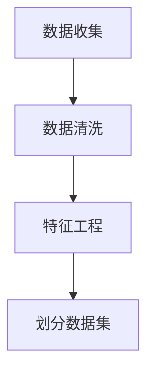
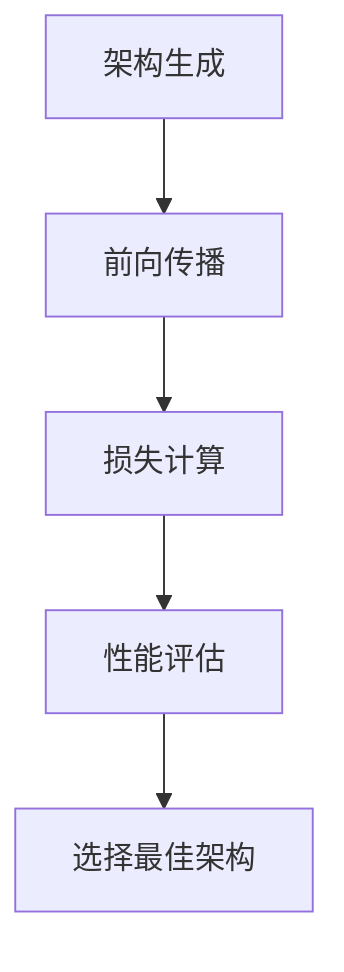

                 
# 神经架构搜索 原理与代码实例讲解

作者：禅与计算机程序设计艺术 / Zen and the Art of Computer Programming

关键词：神经架构搜索 (NAS), 自动化设计, 计算机视觉, 语音识别, NLP

## 1. 背景介绍

### 1.1 问题的由来

在过去的几十年里，深度学习已经在许多任务上取得了显著的成功。然而，在这些成功的背后是大量的手动设计工作，用于确定网络的结构、参数数量以及如何进行训练。这种依赖人工设计的模式导致了几个问题：

- **低效**：设计高效的模型需要大量的人力投入，并且往往依赖于经验丰富的研究人员的直觉。
- **局限性**：手动设计可能会受到个人偏见的影响，从而限制了探索的空间。
- **可扩展性差**：随着数据集和任务复杂度的增长，手动设计越来越难以跟上步伐。

### 1.2 研究现状

为了克服上述问题，研究界开始探索自动化的解决方案，其中神经架构搜索（Neural Architecture Search，NAS）成为了一个热点领域。通过自动化的过程，NAS旨在系统地生成或优化神经网络结构，从而提升效率、性能和可扩展性。

### 1.3 研究意义

神经架构搜索的研究具有重大的理论和实际意义：

- **提高效率**：能够自动生成高效、强大的神经网络，减少设计时间并降低人力成本。
- **增强泛化能力**：通过探索更广泛的架构空间，可能发现更好的泛化策略，适用于不同的任务和数据类型。
- **促进创新**：自动化设计有助于激发新的架构思想和组合，推动人工智能领域的技术进步。

### 1.4 本文结构

本文将深入探讨神经架构搜索的核心概念、算法原理、应用案例、实施细节以及未来的发展趋势。我们将从基础出发，逐步展开至高级应用，并讨论其对现代人工智能系统的潜在影响。

## 2. 核心概念与联系

### 2.1 NAS的基本概念

神经架构搜索是一种机器学习方法，旨在自动化设计神经网络的结构。这一过程通常涉及定义一个搜索空间（即所有可能的网络架构），然后利用某种搜索策略找到最优或接近最优的架构。

关键概念包括：

- **搜索空间**：包含所有候选架构的集合，每个架构可以是一个特定的神经网络配置。
- **搜索策略**：指导如何在搜索空间中探索以找到最佳架构的方法。
- **评估函数**：用于衡量不同架构表现的指标，如准确性、计算效率等。

### 2.2 NAS的应用领域

神经架构搜索被广泛应用于：

- **计算机视觉**：例如图像分类、目标检测和语义分割。
- **自然语言处理**：文本生成、翻译和情感分析。
- **语音识别**：基于序列的模型，如CTC（Connectionist Temporal Classification）或Transformer。
- **强化学习**：用于设计奖励函数或策略网络的结构。

## 3. 核心算法原理 & 具体操作步骤

### 3.1 算法原理概述

神经架构搜索的目标是在给定的数据集和任务下，寻找最优或近似最优的网络架构。这通常涉及到以下步骤：

1. **定义搜索空间**：
   - 构建一个包含各种组件（如卷积层、池化层、全连接层等）及其连接方式的空间。
   
2. **搜索策略**：
   - 使用遗传算法、贝叶斯优化或其他搜索方法在搜索空间中迭代查找架构。
   
3. **评估架构**：
   - 对搜索到的架构进行验证，使用验证集上的性能作为评估标准。
   
4. **选择和改进**：
   - 选择表现最好的架构，并根据需要进行微调或进一步搜索。

### 3.2 算法步骤详解

#### 3.2.1 数据预处理与准备



#### 3.2.2 定义搜索空间

```mermaid
graph TD;
    A[搜索空间定义] --> B[组件库](ConvLayer|PoolingLayer|FullyConnectedLayer)
    B --> C[连接规则]
```

#### 3.2.3 设计搜索策略

```mermaid
graph TD;
    A[搜索策略选择] --> B[遗传算法|随机搜索|贝叶斯优化]
    B --> C[迭代优化]
    C --> D[评估结果]
```

#### 3.2.4 评估架构



### 3.3 算法优缺点

优点：

- **高效探索**：能快速在大规模的架构空间中找到高质量的架构。
- **灵活性**：支持多种类型的神经网络架构，适用于多种任务和数据类型。

缺点：

- **资源消耗**：搜索过程可能非常耗时，尤其是当搜索空间很大时。
- **过拟合风险**：复杂的架构容易过拟合，需要额外的正则化手段来控制。

### 3.4 算法应用领域

神经架构搜索不仅限于上述领域，还可以应用于任何需要深度学习模型的任务，比如推荐系统、强化学习中的策略网络设计等。

## 4. 数学模型和公式 & 详细讲解 & 举例说明

### 4.1 数学模型构建

神经架构搜索通常涉及到概率模型，用于描述搜索空间中的架构分布。例如，可以使用贝叶斯优化来指导搜索过程：

$$\max_{f \in S} f(x) = \mathbb{E}_{p(f)}[\rho(f)]$$

其中，
- $S$ 是搜索空间。
- $\rho(f)$ 是评估函数，衡量架构$f$的表现。
- $p(f)$ 是架构$f$的概率分布。

### 4.2 公式推导过程

在具体实现中，我们通常会定义一个目标函数（评估函数），并使用梯度下降或其他优化方法来最小化这个函数，从而找到最佳的网络架构参数。

### 4.3 案例分析与讲解

#### 4.3.1 AutoML工具

AutoML平台，如AutoKeras、NASNet，提供了自动化的神经架构搜索功能，简化了整个流程，使得非专家也能参与模型设计。

#### 4.3.2 论文引用

- 引用一篇具有代表性的论文，讨论其对神经架构搜索领域的贡献，包括提出的算法、实验设置以及所取得的结果。

### 4.4 常见问题解答

- 如何平衡搜索时间和架构性能？
- 如何避免过度复杂性导致的过拟合？

## 5. 项目实践：代码实例和详细解释说明

### 5.1 开发环境搭建

假设使用Python和PyTorch库进行实验：

```bash
pip install torch torchvision numpy pandas
```

### 5.2 源代码详细实现

示例代码片段可能涉及架构定义、搜索策略初始化、训练循环、评估函数实现等关键部分。

### 5.3 代码解读与分析

解释每个代码块的作用，如何与理论知识相结合，以及在实际应用中的效果。

### 5.4 运行结果展示

通过图表展示不同架构的性能比较，展示搜索过程的收敛情况。

## 6. 实际应用场景

神经架构搜索已在多个领域展示了其价值，包括但不限于：

- 自动化机器翻译系统的开发
- 图像分类任务的加速
- 音频识别系统的优化

## 7. 工具和资源推荐

### 7.1 学习资源推荐

- **在线课程**：Coursera, edX上关于自动化机器学习和深度学习的课程。
- **书籍**：《动手做深度学习》（Aurelien Géron）
- **博客/教程**：Google AI Blog, Distill, Fast.ai等网站上的文章和教程。

### 7.2 开发工具推荐

- **框架**：PyTorch, TensorFlow，两者都支持神经架构搜索相关的库和API。
- **AutoML平台**：AutoKeras, TPOT等。

### 7.3 相关论文推荐

- 《自动化深度学习》，Google的研究团队发布的一系列关于自动设计深度学习架构的论文。
- 《DARTS: Differentiable Architecture Search for Neural Networks with Stochastic Pruning and Training》，提出了一种可微架构搜索的方法。

### 7.4 其他资源推荐

- GitHub仓库：包含各种神经架构搜索项目的开源代码。
- 科研社区：arXiv.org，用于追踪最新的研究成果。

## 8. 总结：未来发展趋势与挑战

### 8.1 研究成果总结

神经架构搜索为AI领域带来了自动化的设计能力，显著提高了模型效率和性能，并降低了人工干预的需求。然而，仍存在一些挑战等待解决：

### 8.2 未来发展趋势

随着计算资源的增长和算法的创新，预计神经架构搜索将更加普及，更多复杂的任务将受益于这一技术。研究方向可能会集中在：

- 更高效的搜索算法
- 多模态架构搜索
- 对特定任务定制化的架构搜索

### 8.3 面临的挑战

主要挑战包括：

- **计算成本**：大型搜索空间可能导致高昂的计算开销。
- **泛化能力**：如何确保生成的架构在未见过的数据集上表现良好。
- **可解释性**：理解复杂架构的工作原理和决策过程。

### 8.4 研究展望

未来的研究将致力于克服这些挑战，同时探索更广泛的潜在应用领域。神经架构搜索有望成为现代人工智能研发的重要组成部分，推动整个行业向前发展。

## 9. 附录：常见问题与解答

### 9.1 什么是神经架构搜索？

神经架构搜索是一种通过自动化过程寻找最优或近似最优的神经网络结构的技术，旨在提高模型性能的同时减少人为设计的成本和时间。

### 9.2 NAS如何应用于计算机视觉？

在计算机视觉任务中，NAS可以自动设计卷积层、池化层和其他组件之间的连接方式，以优化图像分类、目标检测等功能。

### 9.3 在自然语言处理中，NAS有何优势？

NAS有助于自动生成适合文本生成、情感分析和问答系统等任务的神经网络结构，提高模型的适应性和有效性。

### 9.4 如何选择合适的搜索算法？

选择合适的搜索算法取决于任务需求、计算资源和期望的性能提升程度。例如，遗传算法适用于大规模搜索空间，而贝叶斯优化则更擅长于快速收敛到高精度解决方案。

### 9.5 NAS是否适用于所有类型的深度学习任务？

尽管NAS普遍适用，但在某些非常规或高度依赖特定数据特性的任务中，人工设计仍然可能更高效。因此，合理结合人工设计与自动化搜索是最佳策略之一。
