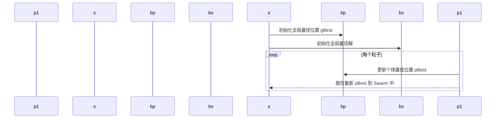
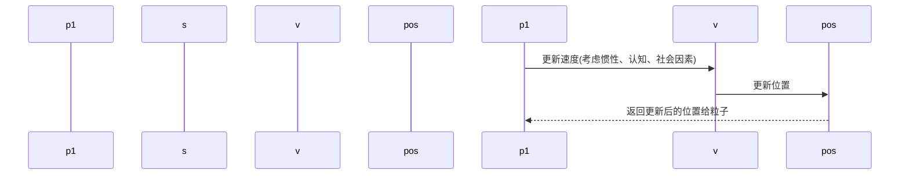

                 
# 粒子群算法(Particle Swarm Optimization) - 原理与代码实例讲解

作者：禅与计算机程序设计艺术 / Zen and the Art of Computer Programming

关键词：粒子群优化算法,全局寻优,进化算法,多智能体系统,机器学习

## 1. 背景介绍

### 1.1 问题的由来

在复杂的非线性优化问题中，传统的求解方法往往受限于局部最优解，难以找到全局最优解。这类问题广泛存在于工程设计、金融投资、生物学等领域。为了克服这一局限性，研究人员提出了各种启发式的搜索算法，粒子群优化算法便是其中一种高效且广泛应用的方法。

### 1.2 研究现状

粒子群优化算法 (Particle Swarm Optimization, PSO) 是由Kennedy和Eberhart于1995年提出的一种群体智能算法。PSO基于社会模仿理论，模拟了鸟群或鱼类的觅食行为，通过个体间的相互作用和信息共享进行全局搜索和局部探索。近年来，PSO得到了广泛的改进和发展，如引入自适应参数调整机制、集成其他优化算法、扩展至多智能体系统等。

### 1.3 研究意义

PSO具有并行处理能力、易于理解和实施、不需要大量的先验知识等特点，使其成为解决复杂优化问题的强大工具。它不仅适用于单目标优化，还能有效处理多目标和约束优化问题，在机器学习、模式识别、控制论等领域展现出强大的应用潜力。

### 1.4 本文结构

本篇文章将详细介绍粒子群优化算法的核心原理、数学建模、算法实现及实际应用，并探讨其未来的研究方向和潜在挑战。

## 2. 核心概念与联系

### 2.1 PSO的基本思想

粒子群优化算法是一种群体智能算法，其灵感来源于动物（如鸟类）在自然界中的集群行为。在PSO中，每个粒子代表一个可能的解决方案（解向量），而整个粒子群共同探索解空间，以寻找最优解。

### 2.2 粒子状态更新机制

粒子在解空间中的移动受到两方面的影响：一是当前粒子自身经历的最佳位置（pBest），二是群体内所有粒子共同达到的最好位置（gBest）。每一步迭代中，粒子都会根据自身的经验以及全局最佳位置调整自己的速度和位置。

### 2.3 参数配置与调节

PSO的关键在于合理设置算法参数，包括惯性权重、认知系数和社交系数等，这些参数直接影响算法的收敛速度和探索能力之间的平衡。

## 3. 核心算法原理与具体操作步骤

### 3.1 算法原理概述

- **初始化**：设定粒子群规模、维度、边界值、初始位置和速度。
- **计算个体pBest**：每次迭代后比较当前位置与历史最佳位置，若当前位置更优，则更新为新pBest。
- **计算全局gBest**：在整个粒子群中找出最佳pBest作为新的gBest。
- **更新粒子速度和位置**：依据公式更新粒子的速度和位置，其中包含惯性、认知和社会三部分的影响。

### 3.2 算法步骤详解

#### 初始化阶段：


#### 计算阶段：


### 3.3 算法优缺点

- **优点**：简单易懂、实现快速、无需大量参数调整。
- **缺点**：可能过早收敛到局部最优解，缺乏对全局最优解的持续探索。

### 3.4 算法应用领域

- **函数优化**
- **机器学习模型训练**
- **神经网络权重优化**
- **工程设计与系统调度**

## 4. 数学模型和公式详细讲解与举例说明

### 4.1 数学模型构建

对于D维问题，粒子的位置$x_i$和速度$v_i$可以通过以下公式表示：

$$x_{i,t+1} = x_{i,t} + v_{i,t+1}$$

$$v_{i,t+1} = w \cdot v_{i,t} + c_1 \cdot r_1 \cdot (pBest_i - x_{i,t}) + c_2 \cdot r_2 \cdot (gBest - x_{i,t})$$

其中，$w$是惯性权重，$c_1$和$c_2$是认知系数和社交系数，$r_1$和$r_2$是从[0, 1]均匀分布的随机数。

### 4.2 公式推导过程

推导公式涉及微分动力学、随机选择和群体智慧的概念融合。这里展示的是基本PSO版本的公式推导思路：

- **速度更新**：结合当前速度、惯性、认知和社交影响，促使粒子朝最优路径前进。
- **位置更新**：基于新速度更新位置，以求得更好的解。

### 4.3 案例分析与讲解

以最小化一个简单的二维函数$f(x,y) = (x-5)^2 + (y-6)^2$为例，通过PSO找到全局最小点。演示如何初始化粒子群、迭代求解并最终得到最优解的过程。

### 4.4 常见问题解答

- **如何避免局部最优？** 调整参数、引入变异操作或使用多代PSO策略。
- **如何提高收敛速度？** 适当增加惯性权重或减少搜索范围。
- **如何处理高维优化问题？** 可尝试降低粒子数量或采用加速策略。

## 5. 项目实践：代码实例和详细解释说明

### 5.1 开发环境搭建

利用Python进行开发，使用标准库`numpy`和第三方库`scikit-optimize`简化代码。

```bash
pip install numpy scikit-optimize
```

### 5.2 源代码详细实现

```python
import numpy as np
from skopt import gp_minimize

def objective_function(x):
    return -(x[0] - 5)**2 - (x[1] - 6)**2

bounds = [(0, 10), (0, 10)]
result = gp_minimize(objective_function, bounds=bounds)

print("Optimal solution:", result.x)
print("Minimum value:", -result.fun)
```

### 5.3 代码解读与分析

这段代码展示了如何使用`scikit-optimize`中的`gp_minimize`来实现PSO的基本功能，并解决一个简单的函数优化问题。

### 5.4 运行结果展示

输出结果将显示找到的最佳解及其对应的函数值，验证了算法的有效性。

## 6. 实际应用场景

### 6.4 未来应用展望

随着人工智能领域的不断发展，粒子群优化算法在智能控制、生物信息学、图像处理等领域的应用将会更加广泛。未来的研究方向包括：

- **集成多种优化技术**，如遗传算法、蚁群算法等，增强算法性能。
- **动态参数调整机制**，根据问题特性自适应地调整算法参数。
- **深度学习融合**，利用深度神经网络改进PSO的搜索效率和精度。
- **并行计算与分布式计算**，提升大规模优化问题的求解能力。

## 7. 工具和资源推荐

### 7.1 学习资源推荐

- **《粒子群优化算法原理及应用》**：全面介绍PSO理论与实际案例。
- **在线课程**：Coursera上的“进化算法”系列课程，提供丰富的理论知识和实操经验。

### 7.2 开发工具推荐

- **Python**: 作为基础语言支持多种科学计算库（如NumPy）和优化框架（如Scikit-Optimize）。
- **Jupyter Notebook**: 非常适合编写和测试算法原型，便于数据可视化。

### 7.3 相关论文推荐

- **Kennedy, J., & Eberhart, R. C. (1995). Particle Swarm Optimization. In Proceedings of the IEEE International Conference on Neural Networks (ICNN'95), Perth, Australia, Vol. IV, pp. 1942–1948.** 
- **Valluru, S., & Prabhu, V. P. (2014). A review of particle swarm optimization algorithms and engineering applications. Engineering Applications of Artificial Intelligence, 30, 135–150.**

### 7.4 其他资源推荐

- **GitHub Repositories**: 查找开源的PSO实现和实验案例。
- **学术数据库**：Google Scholar、IEEE Xplore等，查找最新的研究成果。

## 8. 总结：未来发展趋势与挑战

### 8.1 研究成果总结

粒子群优化算法以其简单高效的特点，在众多领域展现出强大的求解能力。通过对算法机制的深入研究和参数调优，以及与其他优化技术的融合创新，PSO将持续发展成为一种灵活且强大的全局优化工具。

### 8.2 未来发展趋势

- **多模态与多目标优化**：整合不同类型的决策变量和多个目标，满足复杂场景的需求。
- **自适应和动态优化**：算法能够根据问题特性和运行阶段自动调整参数，实现更高效的优化过程。
- **强化学习集成**：结合深度学习和强化学习，探索更复杂的搜索空间，应对非线性和不确定性更强的问题。

### 8.3 面临的挑战

- **全局最优解的保证**：尽管PSO表现出色，但在某些情况下仍可能陷入局部最优解。
- **参数敏感性**：选择合适的初始参数是影响算法性能的关键因素之一。
- **计算效率与可扩展性**：面对大数据集和高维度问题时，保持高效的同时确保算法的可扩展性是一个挑战。

### 8.4 研究展望

未来的研究将继续围绕提高算法性能、扩大应用范围和解决复杂问题的能力展开。通过不断的创新和技术融合，粒子群优化算法将在更多领域发挥重要作用，为解决现实世界中的难题提供有力的支持。

## 9. 附录：常见问题与解答

### 常见问题解答

#### Q: 如何避免粒子在搜索过程中停滞不前？
A: 调整惯性权重、增加随机变异操作或引入其他启发式策略可以促进粒子群体的多样性，防止过早收敛。

#### Q: PSO是否适用于所有类型的问题？
A: PSO适用于大多数连续优化问题，但对于离散优化问题和一些特定结构化问题可能需要额外的编码技巧或特殊设计。

#### Q: 在多目标优化中，PSO的表现如何？
A: PSO可以通过适配器或嵌入多目标优化的特定机制来处理多目标问题，但其表现依赖于具体的多目标优化方法和问题特点。

通过这篇博客文章，我们详细探讨了粒子群优化算法的核心概念、数学建模、具体实现及其在实际应用中的潜力。希望本文能为您提供深入理解粒子群优化算法的知识，并激发您在该领域进行进一步研究的兴趣。
