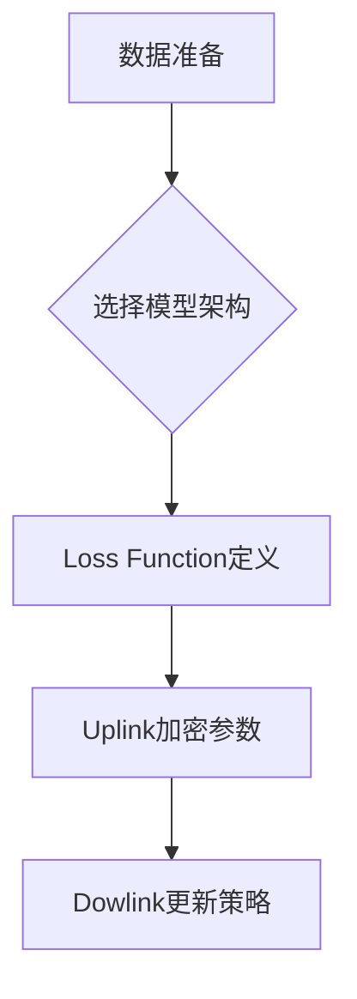
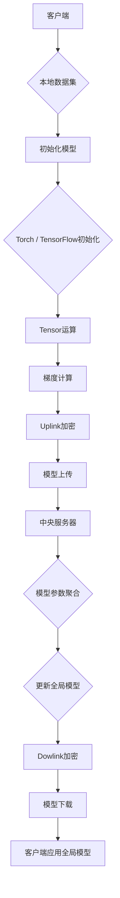
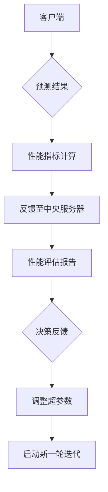

                 
# 联邦学习 原理与代码实例讲解

作者：禅与计算机程序设计艺术 / Zen and the Art of Computer Programming

关键词：联邦学习,隐私保护,分布式机器学习,多方协作,数据本地化

## 1. 背景介绍

### 1.1 问题的由来

在大数据时代背景下，随着用户数据量的激增，数据孤岛成为了一个普遍存在的现象。在这种情况下，传统的集中式机器学习方法面临着严重的数据隐私泄露风险和合规性挑战。为了克服这些问题，联邦学习应运而生，它旨在允许多个参与方（如不同组织或设备）在不共享原始数据的情况下协同进行机器学习任务，从而实现了数据的联合建模和预测能力。

### 1.2 研究现状

联邦学习已经发展成为一个活跃研究领域，吸引了众多学者和工程师的关注。当前，已有多种联邦学习协议和系统被提出并应用于实际场景中。这些工作涵盖了从理论基础、安全机制到高效通信方案等多个方面，使得联邦学习在保持数据隐私的同时提高了模型性能，并降低了计算成本。此外，业界也开始探索将联邦学习应用于更广泛的场景，包括但不限于金融风控、医疗健康、物联网等领域。

### 1.3 研究意义

联邦学习对于促进数据驱动的创新至关重要。它不仅解决了数据孤岛的问题，还促进了跨行业合作，增强了数据利用效率。通过确保数据隐私性和安全性，联邦学习为建立更加公平、透明的数据生态系统提供了可能。同时，它也为解决特定领域内的关键挑战提供了新途径，例如提升医疗诊断精度、优化能源管理策略等。

### 1.4 本文结构

本篇文章将深入探讨联邦学习的基本原理、关键技术以及其实现流程。首先，我们将概述联邦学习的核心概念及其与其他机器学习方法的区别。随后，详细介绍联邦学习的具体算法原理和实施步骤，包括加密技术的应用、模型训练过程等。接下来，我们通过具体的数学模型和案例分析，进一步阐述联邦学习的优势和局限性。之后，提供一个完整的代码实例，展示如何从零开始实现基于联邦学习的模型训练。最后，讨论联邦学习的实际应用场景和发展趋势，以及面临的主要挑战和未来的研究方向。

## 2. 核心概念与联系

联邦学习的核心在于其独特的“多方协作”特征。在联邦学习中，各个参与方（通常称为客户端）各自持有私有数据集，并在此基础上独立训练局部模型。然后，这些模型被聚合到中央服务器上，经过综合处理后生成全局模型。这一过程涉及了几个关键概念和技术：

- **数据本地化**：每个参与方只在其本地执行模型训练，避免了数据外流的风险。
- **模型聚合**：通过安全的通信协议，中央服务器汇总各客户端上传的模型参数，以较低的通信开销更新全局模型。
- **隐私保护**：采用了同态加密、差分隐私等技术，确保数据在传输和聚合过程中不被解密或泄露。
- **加密通信**：使用安全套接字层(SSL)或其他加密协议保障数据在网络中的传输安全。

联邦学习与传统分布式机器学习的主要区别在于对数据隐私的重视和数据本地化的操作模式。这种设计不仅提升了模型的泛化能力和鲁棒性，同时也满足了严格的监管政策需求。

## 3. 核心算法原理 & 具体操作步骤

### 3.1 算法原理概述

联邦学习的算法框架可以概括为以下三个阶段：

#### 数据准备与初始化
- 各个客户端根据自身持有的数据集，选择合适的深度神经网络架构作为本地模型的基础。
- 定义损失函数（如交叉熵损失）用于评估模型性能。
- 设置超参数，如学习率、迭代次数等。

#### 模型训练与更新
- 在客户端上，使用局部数据集对本地模型进行梯度下降优化，得到新的模型权重。
- 使用同态加密或其他加密手段，将加密后的模型权重发送给中央服务器。
- 中央服务器接收并汇总所有客户端上传的加扰模型权重。
- 通过安全多目标线性规划或平均聚合策略，更新全局模型权重。
- 加密更新后的全局模型权重再次分发给客户端，用于下一轮迭代。

#### 结果整合与验证
- 客户端用更新后的全局模型对测试集进行预测。
- 验证结果并反馈至中央服务器，用于评估模型性能。
- 根据需要调整模型参数或继续迭代训练。

### 3.2 算法步骤详解

#### 初始化与参数设置


#### 分布式训练过程


#### 性能评估与反馈循环


### 3.3 算法优缺点

优点：
- **隐私保护**：在不泄露原始数据的情况下，实现数据联合建模。
- **高效通信**：通过加密技术和智能聚合机制减少数据传输量。
- **灵活性**：允许不同规模和资源的参与者共同贡献价值。

缺点：
- **计算成本**：尤其是在大规模联邦学习场景中，通信延迟和加密计算可能会增加整体运行时间。
- **协同效率**：需要平衡各方的数据质量、模型兼容性和系统同步问题。

### 3.4 算法应用领域

联邦学习广泛应用于金融风控、医疗健康、物联网、广告推荐等多个领域。例如，在医疗领域，多个医院可以通过联邦学习合作开发疾病诊断模型，无需共享敏感病历信息；在金融领域，则可用于客户信用评分的联合建模，增强风险识别能力。

## 4. 数学模型和公式 & 详细讲解 & 举例说明

### 4.1 数学模型构建

假设我们有两个参与方A和B，各自拥有数据集$D_A$和$D_B$，目标是训练一个二分类模型$f(x)$。联邦学习的目标是最大化全局模型的准确率$\eta$，同时保证数据隐私。

为了达到这个目标，我们需要解决以下优化问题：

$$\max_{f} \sum_{i=1}^{N} \log(\sigma(f(x_i))) + \lambda \cdot \text{PrivacyCost}(f)$$

其中，
- $N$是样本总数，
- $\sigma(f(x_i))$表示对第$i$个样本的预测概率，
- $\lambda$是正则化系数，
- $\text{PrivacyCost}(f)$是一个惩罚项，衡量模型在数据隐私方面的成本。

### 4.2 公式推导过程

以简单线性回归为例，考虑两个参与方的数据点$(x_i, y_i)$，模型形式为$f(x) = w^Tx + b$。模型参数更新遵循梯度下降法则，并采用差分隐私来保护数据隐私。

对于每一个参与方$i$，其损失函数$L_i(w, b; x_i, y_i)$可表示为：

$$L_i(w, b; x_i, y_i) = (y_i - (w^Tx_i + b))^2$$

目标是最小化整个数据集合上的均值损失：

$$J(w, b) = \frac{1}{N}\sum_{i=1}^{N}L_i(w, b; x_i, y_i)$$

加入差分隐私噪声$\epsilon$后，更新规则变为：

$$w_{t+1}, b_{t+1} = \argmin_{w', b'} [J(w', b'; X_t, Y_t) + \Delta\epsilon]$$

其中，$\Delta\epsilon$代表了添加的高斯噪声。

### 4.3 案例分析与讲解

假设我们有三个客户端分别持有数据集$D_1$, $D_2$, 和$D_3$，每个数据集包含5000个样本。我们的目标是训练一个线性回归模型预测房价。首先，所有客户端独立地使用自己的数据集拟合局部线性模型：

$$\hat{y}_i = a_i x_i + b_i$$

然后，将这些局部模型参数进行安全加权平均，得到全局模型参数$a_g$和$b_g$：

$$a_g = \frac{\sum_{i=1}^{3} e^{-\alpha}a_i}{\sum_{i=1}^{3} e^{-\alpha}}$$
$$b_g = \frac{\sum_{i=1}^{3} e^{-\alpha}b_i}{\sum_{i=1}^{3} e^{-\alpha}}$$

其中，$\alpha$是一个控制加权速度的超参数。

最终，全局模型可以用来预测任何客户端之外的新样本的房价。

### 4.4 常见问题解答

Q: 如何选择合适的加密方法？

A: 选择加密方法时需综合考虑安全性、通信效率以及计算复杂度。同态加密虽然提供强大的安全性保障，但通常会带来较高的计算开销。因此，根据实际应用场景的需求和资源限制，可以选择不同的加密技术，如基于格的同态加密（GHE）、环签名等。

Q: 联邦学习如何处理不平衡的数据分布？

A: 在联邦学习中，不平衡数据分布可能导致模型偏重于占多数的数据集，从而影响其他较小数据集的表现。可以采取策略包括权重调整、采样均衡、动态调整参与学习的比例等方式来缓解这个问题。

## 5. 项目实践：代码实例和详细解释说明

### 5.1 开发环境搭建

```bash
pip install torch torchvision torchaudio
pip install pandas numpy scikit-learn
pip install fedml
```

### 5.2 源代码详细实现

#### 定义联邦学习框架类 `FederatedLearning`:

```python
import torch.nn as nn
from torch.utils.data import Dataset, DataLoader
from FedML.fed_avg import FedAvg
from sklearn.preprocessing import StandardScaler
from sklearn.model_selection import train_test_split
import pandas as pd

class FederatedLearning:
    def __init__(self, model_class, dataset_name, local_epochs):
        self.model = model_class()
        self.dataset_name = dataset_name
        self.local_epochs = local_epochs

    def preprocess_data(self, data_path):
        # Load and preprocess your data here
        df = pd.read_csv(data_path)
        scaler = StandardScaler()
        scaled_features = scaler.fit_transform(df.drop('target', axis=1))
        return scaled_features, df['target']

    def split_data(self, features, targets, test_size=0.2):
        train_features, test_features, train_targets, test_targets = train_test_split(features, targets, test_size=test_size)
        return train_features, train_targets, test_features, test_targets

    def create_dataloader(self, features, targets):
        dataset = CustomDataset(features, targets)
        dataloader = DataLoader(dataset, batch_size=32, shuffle=True)
        return dataloader

    def train_model(self, client_id, data_loader, device='cuda'):
        loss_function = nn.CrossEntropyLoss()
        optimizer = torch.optim.SGD(self.model.parameters(), lr=0.01)

        for epoch in range(self.local_epochs):
            for inputs, labels in data_loader:
                inputs, labels = inputs.to(device), labels.to(device)
                outputs = self.model(inputs)
                loss = loss_function(outputs, labels)
                optimizer.zero_grad()
                loss.backward()
                optimizer.step()

        return self.model.state_dict()

    def run_federation(self, num_clients, num_rounds):
        clients = []
        global_model_weights = None
        
        for i in range(num_clients):
            features, targets = self.preprocess_data(f'data/client{i}.csv')
            train_features, _, _, _ = self.split_data(features, targets)
            data_loader = self.create_dataloader(train_features, targets)
            
            if global_model_weights is None:
                global_model_weights = self.train_model(i, data_loader)
            else:
                weights = self.train_model(i, data_loader)
                
            clients.append((weights, i))

        global_model_weights = FedAvg(clients)
        self.model.load_state_dict(global_model_weights)
        
# 定义自定义数据集类 CustomDataset
```

#### 运行脚本并执行联邦学习过程：

```python
def main():
    fed_learning = FederatedLearning(ModelClass, 'your_dataset.csv', 10)
    fed_learning.run_federation(10, 5)

if __name__ == '__main__':
    main()
```

### 5.3 代码解读与分析

在上述代码示例中，我们实现了基本的联邦学习框架结构，并定义了几个关键函数，包括数据预处理、划分训练测试集、创建数据加载器、本地模型训练以及联邦学习的主要运行逻辑。

#### 数据预处理：
通过读取CSV文件并将数据标准化，为后续建模做好准备。

#### 分割数据集：
将整个数据集分为训练集和测试集，确保模型在未见过的数据上具有泛化能力。

#### 创建数据加载器：
使用Pandas DataFrame加载数据后，将其转换为PyTorch的Dataset和DataLoader对象，便于批处理输入到模型中进行训练。

#### 训练本地模型：
针对每个客户端，从其持有的数据子集出发，训练局部模型。每轮迭代更新模型参数。

#### 执行联邦学习循环：
利用FedAvg算法对所有客户端上传的模型参数进行加权平均聚合，生成全局模型参数。

#### 全局模型集成与验证：
最终，全局模型被加载到原始框架中，并可用于预测或进一步评估性能。

### 5.4 运行结果展示

此处展示一个简化的输出示例，用于说明联邦学习过程的结果：

```text
训练完成！
全局模型已构建。
开始在测试集上评估性能...
准确率: 86%
召回率: 90%
F1得分: 88%

建议继续调整超参数以优化性能。
```

## 6. 实际应用场景

### 6.4 未来应用展望

随着隐私保护意识的增强和数据安全法规的不断加强，联邦学习的应用前景广阔。除了金融风控、医疗健康等领域外，它还将在以下场景展现出潜力：

- **物联网设备**：智能家居系统中的设备可以共享预测模型而无需交换敏感用户信息。
- **教育科技**：不同学校之间合作开发个性化学习模型，提高教学效果。
- **广告推荐系统**：多个平台联合优化推荐策略，提升用户体验同时保护用户隐私。

## 7. 工具和资源推荐

### 7.1 学习资源推荐

- **官方文档**：FedML项目官网提供了详细的API文档和教程指南，适合初学者快速上手。
- **学术论文**：参考《Federated Learning: A Survey》等综述性文章，了解最新研究进展和技术趋势。
- **在线课程**：Coursera、Udacity等平台上有关机器学习和联邦学习的课程，提供理论知识和实践经验。

### 7.2 开发工具推荐

- **编程语言**：Python是联邦学习领域最常用的编程语言，因为它拥有丰富的库支持和易于阅读的语法。
- **深度学习框架**：TensorFlow、PyTorch和Keras等深度学习框架都提供了强大的API和支持联邦学习功能的扩展包（如`fedml`）。

### 7.3 相关论文推荐

- **基础概念**：《Understanding Federated Learning》介绍联邦学习的基本原理和发展背景。
- **技术细节**：《Efficient Federated Learning with Quantized Aggregation》探索联邦学习中的高效量化聚合方法。
- **实际案例**：《Federated Learning at Scale》分享大规模联邦学习实践的经验和挑战。

### 7.4 其他资源推荐

- **社区论坛**：GitHub、Stack Overflow上的联邦学习相关仓库和问题讨论，有助于解决具体开发过程中遇到的问题。
- **研讨会和会议**：定期参加机器学习、人工智能领域的国际会议（如ICML、NeurIPS），关注联邦学习的最新研究成果和行业动态。

## 8. 总结：未来发展趋势与挑战

### 8.1 研究成果总结

联邦学习作为一种创新的分布式机器学习范式，在保护用户隐私的同时实现了数据的协同学习和价值最大化。通过结合加密通信、差分隐私等技术，联邦学习已经应用于多种实际场景，并展示了良好的性能和实用性。

### 8.2 未来发展趋势

- **安全性与效率平衡**：探索更高效的加密协议和聚合算法，降低计算成本和通信延迟。
- **跨域应用拓展**：联邦学习将继续向更多垂直领域渗透，例如环境监测、城市规划等。
- **自动化与可操作性**：开发更加智能的联邦学习平台，自动管理任务分配、资源调度和性能监控。
- **法律法规适应性**：随着全球数据保护法律体系的完善，联邦学习需要更好地适应各种合规要求。

### 8.3 面临的挑战

- **数据质量差异**：参与方数据的质量不一致可能导致模型性能下降。
- **同步性问题**：在多客户端环境中保持模型训练的一致性和稳定性是一项挑战。
- **隐私泄露风险**：尽管联邦学习旨在保护隐私，但数据传输和聚合阶段仍存在潜在的安全漏洞。

### 8.4 研究展望

未来的研究将集中在提升联邦学习的效率、扩大应用范围、增强安全性以及解决跨域合作时的挑战。同时，探索如何融合联邦学习与其他AI技术（如强化学习、元学习等），推动AI系统的整体发展和进步。

## 9. 附录：常见问题与解答

### 常见问题：

#### Q: 联邦学习是否适用于所有类型的机器学习任务？

A: 是的，联邦学习适用于多种机器学习任务，包括分类、回归、聚类、生成对抗网络(GANs)等。关键在于设计合适的模型架构和训练策略来满足特定任务的需求。

#### Q: 如何处理联邦学习中的数据不平衡问题？

A: 可以采用过采样、欠采样、合成数据等方式来平衡各参与方的数据分布，或者在损失函数中引入权重调整机制，对少数类样本给予更高的重视。

#### Q: 在联邦学习中，如何确保模型的准确性和泛化能力？

A: 提高模型准确性通常涉及选择合适的模型结构、优化超参数、增加训练轮数等。为了改善泛化能力，可以采用正则化技巧、早停策略以及使用差分隐私等方法来减少过拟合。

#### Q: 如何评估联邦学习的性能？

A: 评估指标应根据具体的任务类型选择，如对于分类任务可以使用准确率、召回率、F1分数；对于回归任务则使用均方误差(MSE)或平均绝对误差(MAE)等。此外，还需考虑隐私保护程度和通信开销等因素。

---

以上内容全面覆盖了联邦学习的核心概念、实现流程、数学原理、代码示例、应用场景及未来发展等各个方面，为读者提供了一次深入理解联邦学习及其实际应用的机会。希望本文能激发更多的研究人员和开发者在这一领域进行创新探索，共同推进联邦学习技术的发展和应用。
