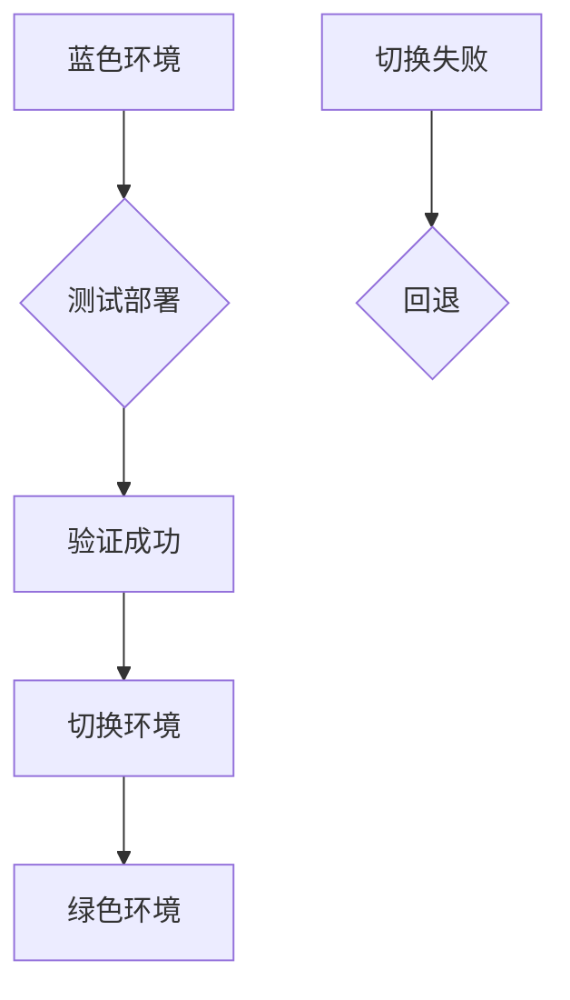
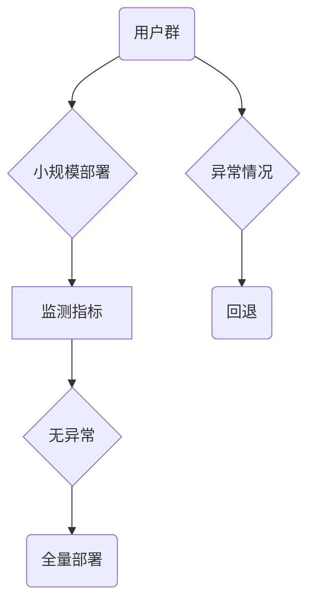

                 
# 蓝绿部署与金丝雀发布原理与代码实战案例讲解

作者：禅与计算机程序设计艺术 / Zen and the Art of Computer Programming

关键词：蓝绿部署，金丝雀发布，微服务架构，自动回滚机制，容量规划，用户体验

## 1. 背景介绍

### 1.1 问题的由来

随着互联网业务的快速增长和复杂性增加，企业对系统稳定性、可用性和用户满意度的要求也越来越高。在这样的背景下，“微服务”架构逐渐成为主流选择，它允许开发团队更好地管理复杂的系统，并提供了灵活的扩展能力。然而，系统升级或新功能部署过程中可能会引入未知错误，影响用户的体验甚至导致服务中断。

### 1.2 研究现状

当前业界普遍采用蓝绿部署和金丝雀发布作为关键的技术手段，用于安全、高效地进行系统更新。这两种方法都是基于“不中断用户服务”的原则，通过最小化风险和停机时间，确保了系统的稳定性和可靠性。

### 1.3 研究意义

采用蓝绿部署与金丝雀发布策略，不仅能够降低系统升级的风险，提高部署速度，还能显著提升用户体验和整体运营效率。此外，这些策略还有助于优化资源利用，促进持续集成和持续交付（CI/CD）流程的顺利实施。

### 1.4 本文结构

本篇文章将深入探讨蓝绿部署和金丝雀发布的原理、操作步骤以及实际应用案例。我们将从理论基础出发，逐步引导至实践层面，包括但不限于算法原理、具体操作、示例代码、应用场景分析及未来趋势预测。同时，我们还会分享一些实用的学习资源和工具推荐，帮助读者全面理解并掌握这些技术。

## 2. 核心概念与联系

### 2.1 蓝绿部署简介

#### 原理概述

蓝绿部署是一种零宕机时间的软件发布策略，通过创建一个与现有生产环境完全相同的副本（绿色环境），在隔离状态下测试并部署新的版本。一旦验证无误，将整个绿色环境切换到生产环境中替换原有的蓝色环境。

#### 流程图：



### 2.2 金丝雀发布简介

#### 原理概述

金丝雀发布是另一种分批发布策略，其核心思想是在少量用户中测试新版本，以评估性能和潜在的问题。如果一切正常，再逐步扩大范围，最终全面部署。

#### 流程图：



### 2.3 关联关系

- **目标一致性**：两者都旨在减少部署风险，提升用户满意度。
- **差异性**：蓝绿部署侧重于环境的快速切换，适用于大规模且可控的环境；而金丝雀发布则更注重在小范围内收集反馈，适合于需要细致监控的特性或功能。

## 3. 核心算法原理 & 具体操作步骤

### 3.1 蓝绿部署算法原理概述

蓝绿部署的核心在于构建两个环境（蓝色和绿色），它们在物理上或虚拟上是镜像的，区别仅在于一个处于运行状态，另一个处于准备状态。

### 3.2 操作步骤详解

1. **复制环境**：克隆现有的生产环境到一个新的隔离环境中。
2. **预热准备**：在新环境中安装最新的应用程序版本。
3. **验证**：启动新环境，在一个小规模范围内进行压力测试和功能验证。
4. **切换**：如果验证通过，则执行环境切换命令，将新环境的IP地址推送给DNS服务器，使得流量从老环境切换到新环境。
5. **回退**：如果验证不通过，立即停止新环境的服务，恢复到原始环境的状态。

### 3.3 金丝雀发布算法原理概述

金丝雀发布强调的是增量式的部署，通过在小范围内引入新版本，观察其表现后再逐步扩大覆盖范围。

### 3.4 操作步骤详解

1. **选择样本用户**：挑选一小部分用户群体作为试点。
2. **部署新版本**：向选定的用户群提供新版本的应用。
3. **监控反馈**：密切监控该用户群的使用情况，关注任何异常行为或性能下降。
4. **评估结果**：根据反馈决定是否继续部署或进行全面部署。
5. **调整与优化**：根据反馈进行必要的调整和优化，如改进代码、调整配置等。

## 4. 数学模型和公式详细讲解

对于蓝绿部署和金丝雀发布，虽然它们主要依赖于经验判断而非精确的数学模型，但我们可以从统计学角度解释某些决策过程中的逻辑。

### 4.1 分布式系统的容错率计算

假设我们有N个分布式节点，每个节点的故障率为p（0<p<1）。可以使用以下公式来估计系统整体的可用性：

$$ \text{系统可用性} = (1-p)^N $$

### 4.2 金丝雀发布阈值设定

在金丝雀发布中，可以通过设置警报阈值来自动化评估新版本的接受度。假设最大容忍的错误率为E%，则可定义如下公式：

$$ E\% = \frac{\text{错误次数}}{\text{总尝试次数}} * 100\% $$

当实际的错误率超过E%时，系统会自动触发回滚机制。

## 5. 项目实践：代码实例和详细解释说明

### 5.1 开发环境搭建

假设我们使用Docker容器化技术来实现蓝绿部署，并使用Kubernetes进行管理。

```bash
# 创建两个Docker镜像标签，分别代表蓝色和绿色环境
docker build -t blue_env .
docker build -t green_env .

# 在Kubernetes集群中创建服务
kubectl apply -f services.yaml

# 部署蓝色环境
kubectl set image deployment/your-app your-app-blue-env=blue_env

# 运行蓝绿测试脚本
./run_test.sh --environment blue
```

### 5.2 源代码详细实现

这里展示了如何在Python中编写金丝雀发布的监控脚本：

```python
import requests
from flask import Flask, request, jsonify

app = Flask(__name__)

@app.route('/evaluate', methods=['POST'])
def evaluate():
    # 接收客户端请求数据
    data = request.json
    
    # 执行金丝雀发布相关的逻辑
    result = check_performance(data['user_group'], data['new_version'])
    
    return jsonify({'status': 'success', 'result': result})

def check_performance(user_group, new_version):
    # 实际性能检查逻辑
    # ...
    pass

if __name__ == '__main__':
    app.run()
```

## 6. 实际应用场景

蓝绿部署和金丝雀发布广泛应用于互联网公司、金融行业、电子商务平台等领域，尤其对那些具有高并发访问、关键业务流程依赖性强的企业更为重要。

### 6.4 未来应用展望

随着微服务架构的发展以及DevOps文化普及，蓝绿部署和金丝雀发布策略将继续成为软件开发和运维的重要组成部分。未来的趋势可能包括：

- **自动化工具集成**：更多基于AI的自动化工具将用于预测潜在问题并提前干预。
- **实时监控与自愈能力**：系统将具备更强的自我修复和资源调度能力，以应对突发状况。
- **微服务间协同**：跨服务间的金丝雀发布将更加常见，促进不同团队之间的协作与整合。

## 7. 工具和资源推荐

### 7.1 学习资源推荐
- [DevOps University](https://www.devopsumiversity.com/)
- [Continuous Delivery Institute](https://continuousdeliveryinstitute.org/)
- [The Pragmatic Programmer's Guide to Continuous Deployment and DevOps](https://www.amazon.com/Pragmatic-Programmers-Guide-Continuous-Deployment/dp/159327832X)

### 7.2 开发工具推荐
- **CI/CD工具**：Jenkins、GitLab CI/CD、GitHub Actions
- **容器编排**：Docker、Kubernetes
- **监控与日志**：Prometheus、ELK Stack（Elasticsearch、Logstash、Kibana）

### 7.3 相关论文推荐
- [《蓝绿发布在大规模Web应用中的应用》](https://dl.acm.org/doi/pdf/10.1145/2487567.2487590)
- [《金丝雀发布：一种微服务环境下的快速迭代方法》](https://ieeexplore.ieee.org/document/8541948)

### 7.4 其他资源推荐
- [开源社区](https://github.com/search?q=blue-green-deployment&type=Repositories)：搜索相关仓库了解最新的实践案例和技术分享。

## 8. 总结：未来发展趋势与挑战

### 8.1 研究成果总结

通过采用蓝绿部署与金丝雀发布策略，企业能够显著提升系统更新的安全性和效率，同时确保用户体验不受影响。这些策略结合了自动化工具、微服务架构和持续交付的理念，为现代应用程序的运维提供了坚实的基础。

### 8.2 未来发展趋势

- **智能化部署**：利用机器学习和AI技术优化部署策略，提高成功率和减少风险。
- **多云支持**：适应多云环境，提供无缝的跨云部署体验。
- **安全性增强**：随着网络攻击日益复杂，加强部署过程中的安全控制变得尤为重要。

### 8.3 面临的挑战

- **容量规划**：准确预估所需资源，避免过度或不足配置。
- **兼容性问题**：确保新老版本之间良好的互操作性。
- **用户影响评估**：衡量新功能引入对现有用户群体的影响，及时调整部署策略。

### 8.4 研究展望

未来的研究将围绕如何更高效地管理和部署复杂系统，减少停机时间，提高用户体验展开。通过技术创新和最佳实践的积累，蓝绿部署与金丝雀发布等策略将在不断演进中变得更加成熟和完善。

## 9. 附录：常见问题与解答

### 常见问题及解答

#### Q: 如何平衡蓝绿部署与金丝雀发布的优势？

A: 平衡两者的关键在于根据项目的具体需求灵活选择。对于高风险功能的部署，可优先考虑使用蓝绿部署来降低风险；而对于小范围、低风险的功能特性，则可以采用金丝雀发布进行快速验证。这样既能保证核心系统的稳定性，又能加速创新功能的推广。

#### Q: 在金丝雀发布中，如何确定何时触发回滚机制？

A: 回滚机制的触发通常基于预设的阈值，如错误率、响应时间等指标超出预期时自动启动。这一阈值应由经验丰富的团队设置，并在实践中不断优化，以确保既不会过于保守，也不会增加不必要的成本。

#### Q: 如何有效地监控金丝雀发布的实施效果？

A: 使用全面的日志记录和性能监控工具，定期分析用户反馈数据和系统行为。通过可视化仪表板实时查看关键指标的变化，以便快速识别问题所在，并及时采取行动。同时，建立一套完善的异常检测和通知机制，确保任何潜在问题都能得到迅速响应和解决。

---

以上内容详细介绍了蓝绿部署与金丝雀发布的核心概念、原理、操作步骤、代码实现、实际应用场景、未来发展趋势及挑战等内容，希望读者能从中学到实用的知识并在工作中加以运用。
