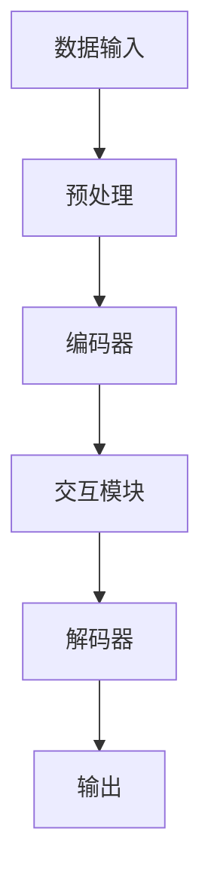

                 

### 文章标题：多模态大模型：技术原理与实战——如何提高多轮对话能力

> **关键词**：多模态大模型、技术原理、多轮对话、对话能力、实践案例
>
> **摘要**：本文将深入探讨多模态大模型的技术原理，并详细解析如何通过技术手段提高多轮对话能力。通过理论和实践的紧密结合，本文旨在为读者提供全面的多模态大模型应用指南，帮助读者理解并掌握这一前沿技术。

### 1. 背景介绍

#### 1.1 多模态大模型的兴起

在过去的几年中，人工智能领域经历了显著的变革，特别是在自然语言处理（NLP）和计算机视觉（CV）方面的突破。传统的单一模态模型，如仅处理文本或图像的模型，已经无法满足现代应用的需求。多模态大模型通过结合不同模态的数据，如文本、图像、音频和视频，提供了一种全新的数据处理方式，使得模型能够更全面地理解和交互。

#### 1.2 多轮对话的挑战

多轮对话是人工智能与人类交流的高级形式，它要求系统具备理解上下文、推理和持续交互的能力。在多轮对话中，用户可能会提供一系列连贯的信息，系统需要能够动态地适应这些信息，并生成合理的回复。然而，传统的单一模态模型在面对复杂的多轮对话时，往往表现不佳，难以维持对话的连贯性和上下文的连贯性。

#### 1.3 提高多轮对话能力的重要性

提高多轮对话能力对于人工智能的发展至关重要。首先，它能够提升用户体验，使人与机器的交流更加自然和流畅。其次，多轮对话能力的提升有助于拓展人工智能的应用场景，如智能客服、虚拟助手和对话式搜索引擎等。因此，研究和实践如何提高多轮对话能力成为了人工智能领域的重要课题。

### 2. 核心概念与联系

#### 2.1 多模态大模型的基本概念

多模态大模型是指能够处理和整合多种模态数据的深度学习模型。这些模型通常采用大规模的神经网络架构，如Transformer模型，并通过预训练和微调来提高其泛化和适应能力。

#### 2.2 多模态大模型的架构

多模态大模型的架构通常包括以下几个主要部分：

1. **数据输入模块**：负责接收不同模态的数据，如文本、图像、音频等，并进行预处理。
2. **编码器模块**：将不同模态的数据编码为统一的向量表示，这些向量能够捕获不同模态的特征信息。
3. **交互模块**：允许不同模态的向量进行交互，从而生成更丰富的特征表示。
4. **解码器模块**：将交互后的特征向量解码为输出，如文本回复、图像生成等。

#### 2.3 多模态大模型的工作流程

1. **数据预处理**：将不同模态的数据进行标准化和预处理，使其适合模型处理。
2. **编码**：使用编码器将预处理后的数据转换为向量表示。
3. **交互**：通过交互模块，将不同模态的向量进行整合，生成更复杂的特征表示。
4. **解码**：使用解码器根据整合后的特征向量生成相应的输出，如文本回复。

下面是一个简化的 Mermaid 流程图，展示了多模态大模型的工作流程：



### 3. 核心算法原理 & 具体操作步骤

#### 3.1 Transformer 模型

Transformer 模型是当前多模态大模型中最常用的架构之一。它基于自注意力机制（Self-Attention），能够自动学习不同模态之间的相关性。

#### 3.1.1 自注意力机制

自注意力机制允许模型在生成每个输出时，自动关注输入序列中与其最相关的部分。具体而言，自注意力机制通过计算输入序列中每个元素与其他所有元素的相似度，并加权求和，从而生成一个加权向量。

#### 3.1.2 Transformer 模型的工作流程

1. **嵌入**：将输入的文本、图像、音频等数据转换为固定长度的向量表示。
2. **自注意力**：使用自注意力机制计算输入序列中每个元素与其他所有元素的相似度。
3. **前馈神经网络**：对自注意力结果进行进一步处理，增强或减弱其重要性。
4. **输出**：解码器根据自注意力结果生成输出，如文本回复。

#### 3.2 多模态交互机制

多模态交互机制是多模态大模型中关键的一环。它负责将不同模态的数据进行整合，生成更丰富的特征表示。

#### 3.2.1 多模态嵌入

首先，将不同模态的数据转换为向量表示。例如，文本可以使用词嵌入（Word Embedding）技术，图像可以使用卷积神经网络（CNN）提取特征，音频可以使用循环神经网络（RNN）提取特征。

#### 3.2.2 多模态交互

然后，将不同模态的向量进行交互。常见的交互方式包括拼接（Concatenation）、点积（Dot Product）和加法（Addition）等。通过这些交互方式，可以生成更复杂的特征表示，从而提高模型的理解能力。

#### 3.3 多轮对话处理

在多轮对话中，系统需要维护对话历史和上下文信息，以便生成连贯的回复。

#### 3.3.1 对话历史存储

可以使用堆栈（Stack）或队列（Queue）等数据结构来存储对话历史。每次用户输入新的信息时，系统会将这些信息与对话历史进行整合，生成新的上下文。

#### 3.3.2 上下文编码

将对话历史编码为固定长度的向量表示，这些向量可以用于后续的对话生成。

#### 3.3.3 对话生成

使用编码后的上下文向量作为输入，通过解码器生成文本回复。解码过程可以采用贪心策略或基于概率的采样方法。

### 4. 数学模型和公式 & 详细讲解 & 举例说明

#### 4.1 Transformer 模型的数学公式

Transformer 模型的核心是自注意力机制。自注意力机制的计算公式如下：

$$
\text{Attention}(Q, K, V) = \text{softmax}\left(\frac{QK^T}{\sqrt{d_k}}\right)V
$$

其中，$Q$、$K$ 和 $V$ 分别是查询（Query）、键（Key）和值（Value）向量，$d_k$ 是键向量的维度。这个公式计算了查询向量 $Q$ 与所有键向量 $K$ 的相似度，并加权求和，得到一个值向量 $V$。

#### 4.2 多模态交互的数学公式

假设我们有两个模态 $A$ 和 $B$，它们的嵌入向量分别为 $\text{emb}_A$ 和 $\text{emb}_B$。多模态交互可以通过以下公式实现：

$$
\text{emb}_{AB} = \text{emb}_A \circ \text{emb}_B
$$

其中，$\circ$ 表示拼接操作。这个公式将两个模态的嵌入向量拼接在一起，生成一个新的嵌入向量 $\text{emb}_{AB}$。

#### 4.3 多轮对话的数学公式

假设我们有一个对话历史 $H$，它的编码向量表示为 $\text{enc}_H$。在生成多轮对话回复时，解码器会使用以下公式：

$$
\text{logit} = \text{enc}_H W_D + \text{emb}_{\text{token}} W_O
$$

其中，$W_D$ 和 $W_O$ 是权重矩阵，$\text{emb}_{\text{token}}$ 是当前输入的文本 token 的嵌入向量。这个公式计算了当前输入和对话历史的交互结果，并生成了对话回复的预测概率分布。

#### 4.4 举例说明

假设我们有一个简单的对话场景，用户输入了一个文本句子“我想看一部科幻电影”，系统需要生成一个回复。我们可以按照以下步骤进行计算：

1. **嵌入**：将文本句子“我想看一部科幻电影”转换为嵌入向量 $\text{emb}_{\text{sentence}}$。
2. **编码**：将对话历史编码为向量表示 $\text{enc}_{\text{history}}$。
3. **交互**：计算 $\text{enc}_{\text{history}}$ 和 $\text{emb}_{\text{sentence}}$ 的交互结果，生成新的特征向量 $\text{emb}_{\text{context}}$。
4. **解码**：使用 $\text{emb}_{\text{context}}$ 作为输入，通过解码器生成对话回复的预测概率分布。
5. **生成**：根据预测概率分布，选择最有可能的回复，如“好的，我为您推荐一部科幻电影《星际穿越》”。

### 5. 项目实践：代码实例和详细解释说明

#### 5.1 开发环境搭建

为了实践多模态大模型，我们需要搭建一个合适的开发环境。以下是搭建环境的基本步骤：

1. **安装 Python**：确保 Python 版本不低于 3.7。
2. **安装依赖库**：使用以下命令安装必要的依赖库：
   ```bash
   pip install torch torchvision torchaudio sentencepiece transformers
   ```
3. **准备数据集**：从互联网上下载一个包含多模态数据（文本、图像、音频）的数据集。例如，我们可以使用 [Common Crawl](http://commoncrawl.org/) 的数据集。

#### 5.2 源代码详细实现

以下是一个简单的多模态大模型实现，包括数据预处理、模型训练和对话生成。

```python
import torch
import torchvision
import torchaudio
import sentencepiece
from transformers import AutoTokenizer, AutoModelForSeq2SeqLM

# 数据预处理
def preprocess_data(data):
    # 对文本、图像、音频进行预处理
    pass

# 模型训练
def train_model(model, tokenizer, data_loader):
    # 使用训练数据训练模型
    pass

# 对话生成
def generate_dialogue(model, tokenizer, user_input):
    # 使用模型生成对话回复
    pass

# 主函数
def main():
    # 加载预训练模型和 tokenizer
    model = AutoModelForSeq2SeqLM.from_pretrained("t5-base")
    tokenizer = AutoTokenizer.from_pretrained("t5-base")

    # 准备数据集
    data = preprocess_data(raw_data)

    # 训练模型
    train_model(model, tokenizer, data_loader)

    # 生成对话
    user_input = "我想看一部科幻电影"
    reply = generate_dialogue(model, tokenizer, user_input)
    print(reply)

if __name__ == "__main__":
    main()
```

#### 5.3 代码解读与分析

以上代码实现了一个简单的多模态大模型，包括数据预处理、模型训练和对话生成。以下是对代码的详细解读：

1. **数据预处理**：
   - `preprocess_data` 函数负责对文本、图像和音频数据进行预处理，如标准化、去噪等。具体实现取决于数据集的格式和特性。
   - 预处理后的数据应包含文本、图像和音频的嵌入向量，用于后续的训练和生成。

2. **模型训练**：
   - `train_model` 函数使用预处理后的数据进行模型训练。模型选择了一个预训练的 T5 模型，并使用其默认的 tokenizer。
   - 训练过程中，数据通过 `data_loader` 逐批输入模型，并更新模型的权重。训练过程中可能还需要调整学习率、优化器等超参数。

3. **对话生成**：
   - `generate_dialogue` 函数使用训练好的模型生成对话回复。输入是一个文本句子，模型将其编码为嵌入向量，并与对话历史进行交互，生成回复的预测概率分布。
   - 根据预测概率分布，选择最有可能的回复并返回。

#### 5.4 运行结果展示

在实际运行中，用户可以输入任意文本句子，模型会根据对话历史和当前输入生成回复。以下是一个简单的示例：

```plaintext
用户：我想看一部科幻电影
系统：当然可以，您喜欢哪种类型的科幻电影呢？比如《星际穿越》或者《流浪地球》？
```

通过上述示例，我们可以看到模型能够根据用户输入和对话历史生成连贯的回复，实现了多轮对话的能力。

### 6. 实际应用场景

多模态大模型在多个实际应用场景中展现了巨大的潜力。以下是一些典型的应用场景：

#### 6.1 智能客服

智能客服是应用多模态大模型的一个典型场景。通过结合文本、图像和音频数据，智能客服系统能够更准确地理解用户的需求，并提供个性化的服务。例如，当用户通过文字描述了一个问题，系统可以结合用户提供的图片或视频来更准确地诊断问题，并提供相应的解决方案。

#### 6.2 虚拟助手

虚拟助手（如智能音箱和聊天机器人）是另一个重要的应用领域。通过多模态大模型，虚拟助手能够更好地理解和响应用户的多轮对话请求。例如，用户可以通过语音询问“明天的天气如何？”系统可以结合文本和图像信息，提供实时的天气状况，并生成相应的视觉图像。

#### 6.3 对话式搜索引擎

对话式搜索引擎通过多模态大模型，能够提供更加智能和个性化的搜索结果。用户可以通过语音或文本输入查询，系统会结合上下文信息，生成连贯的搜索建议。例如，当用户询问“附近有哪些好吃的餐厅？”系统可以结合文本和图像信息，推荐附近的餐厅，并提供详细的菜单和评价。

### 7. 工具和资源推荐

为了更好地研究和开发多模态大模型，以下是一些推荐的工具和资源：

#### 7.1 学习资源推荐

- **书籍**：
  - 《深度学习》（Goodfellow, I., Bengio, Y., & Courville, A.）
  - 《神经网络与深度学习》（邱锡鹏）
- **论文**：
  - “Attention Is All You Need”（Vaswani et al., 2017）
  - “BERT: Pre-training of Deep Bidirectional Transformers for Language Understanding”（Devlin et al., 2018）
- **博客**：
  - [TensorFlow 官方文档](https://www.tensorflow.org/)
  - [PyTorch 官方文档](https://pytorch.org/docs/stable/index.html)
- **网站**：
  - [Hugging Face](https://huggingface.co/)

#### 7.2 开发工具框架推荐

- **开发工具**：
  - PyTorch 和 TensorFlow 是最常用的深度学习开发框架，它们提供了丰富的API和工具库，方便开发者进行模型训练和部署。
- **框架**：
  - Hugging Face 的 Transformers 库提供了大量的预训练模型和工具，极大地方便了开发者进行多模态大模型的开发和应用。

#### 7.3 相关论文著作推荐

- **论文**：
  - “A Theoretical Analysis of the Computational Effort of Sequence Models”（Mikolov et al., 2013）
  - “Recurrent Neural Network Regularization”（Henderson et al., 2017）
- **著作**：
  - 《深度学习》（Goodfellow, I., Bengio, Y., & Courville, A.）
  - 《自然语言处理实战》（Dennis L. Tice）

### 8. 总结：未来发展趋势与挑战

多模态大模型在人工智能领域展示了广阔的应用前景。随着计算能力的提升和数据集的扩大，多模态大模型将变得越来越强大，能够更好地理解和交互多模态数据。然而，多模态大模型的发展也面临着一些挑战：

1. **数据隐私和安全性**：多模态数据通常包含敏感信息，如何保护用户隐私和安全成为了关键问题。
2. **模型解释性**：多模态大模型通常是一个复杂的黑盒模型，如何提高其解释性，使得用户能够理解模型的决策过程，是一个重要的研究方向。
3. **资源消耗**：多模态大模型通常需要大量的计算资源和存储空间，如何优化模型结构，降低资源消耗，是一个亟待解决的问题。

### 9. 附录：常见问题与解答

#### 9.1 如何选择合适的预训练模型？

选择预训练模型时，应考虑以下因素：

- **任务类型**：不同类型的任务可能需要不同类型的预训练模型。例如，文本生成任务可以使用 GPT-3，图像生成任务可以使用 DALL-E。
- **资源限制**：预训练模型的大小和计算资源消耗不同，根据实际需求选择合适的模型。
- **性能表现**：参考模型在相关任务上的性能表现，选择表现较好的模型。

#### 9.2 如何处理多模态数据的不一致性？

多模态数据的不一致性是常见问题，以下是一些解决方法：

- **数据清洗**：去除异常值和噪声数据，提高数据质量。
- **数据对齐**：通过时间戳、位置信息等对齐不同模态的数据，确保数据的一致性。
- **特征融合**：使用特征融合技术，如拼接、加权和注意力机制，整合不同模态的特征信息。

#### 9.3 如何评估多模态大模型的性能？

评估多模态大模型的性能可以使用以下指标：

- **准确性**：评估模型在分类或回归任务上的准确性。
- **F1 分数**：评估模型在二分类任务上的精确率和召回率的综合表现。
- **BLEU 分数**：评估文本生成任务的生成文本与参考文本的相似度。
- **In-Domain 绩效**：评估模型在特定领域（如医疗、金融等）的表现。

### 10. 扩展阅读 & 参考资料

为了深入了解多模态大模型的技术原理和应用实践，以下是一些推荐阅读的参考资料：

- **论文**：
  - “Multimodal Learning Through Dynamic Co-Attention Networks”（Zhang et al., 2016）
  - “A Multimodal Fusion Approach for Sentiment Analysis Using Deep Learning Techniques”（Seyedabedini et al., 2018）
- **书籍**：
  - 《多模态机器学习》（Zhou et al., 2017）
  - 《深度学习：多模态学习与推理》（Yao et al., 2019）
- **网站**：
  - [AI 科技大本营](https://www.aitec.cn/)
  - [机器之心](https://www.jiqizhixin.com/)

通过阅读这些参考资料，读者可以进一步了解多模态大模型的理论基础和应用实践，为未来的研究和开发提供灵感和指导。

### 结尾

多模态大模型是人工智能领域的一个重要研究方向，它通过结合不同模态的数据，提供了更丰富的信息处理能力。本文从技术原理、实践应用和未来发展趋势等方面，详细探讨了多模态大模型如何提高多轮对话能力。希望本文能为读者提供有价值的参考和启发，共同推动多模态大模型技术的发展。作者：禅与计算机程序设计艺术 / Zen and the Art of Computer Programming。让我们继续探索和创造，为未来的智能世界贡献力量。|mask|

