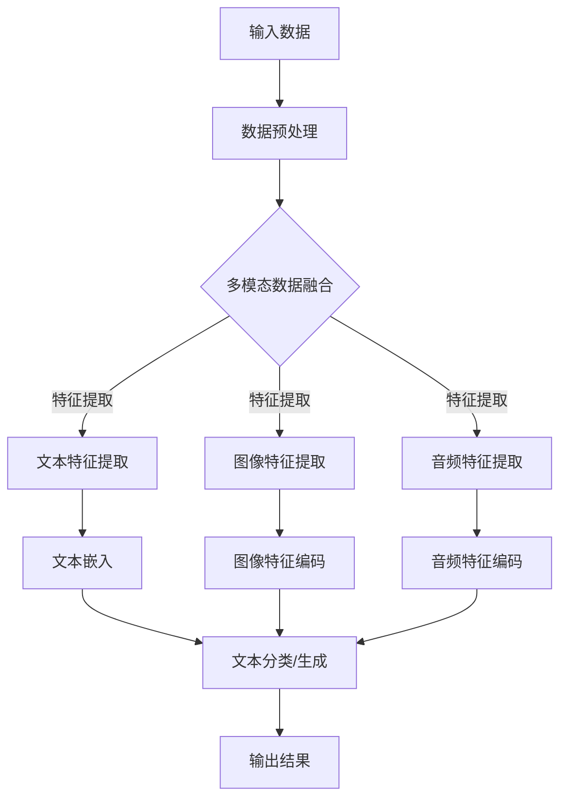

                 

### 文章标题

多模态大模型：技术原理与实战 用多模态大模型打造AI助理实战

> **关键词**：多模态大模型，技术原理，AI助理，实战应用

> **摘要**：本文深入探讨了多模态大模型的技术原理，通过逐步分析推理，阐述了其在AI助理领域的实际应用，以及如何利用多模态大模型构建一个实用的AI助理系统。文章旨在为读者提供全面的技术指南，帮助读者理解并掌握多模态大模型的核心概念和实战技巧。

### 1. 背景介绍

多模态大模型是近年来人工智能领域的一个热点研究方向。传统的单模态模型，如基于文本的文本分类模型、基于图像的图像识别模型，由于只能处理单一类型的数据，难以捕捉到数据之间的复杂关系。而多模态大模型则能够融合多种类型的数据，如文本、图像、音频、视频等，从而更全面、准确地理解世界。

随着数据获取和处理能力的提升，多模态大模型的应用场景越来越广泛。例如，在医疗领域，多模态大模型可以整合病人的电子病历、影像资料、基因信息等多种数据，帮助医生更准确地诊断疾病。在自动驾驶领域，多模态大模型可以融合摄像头、雷达、激光雷达等多源数据，提高自动驾驶系统的感知能力和决策水平。

本文将围绕多模态大模型的技术原理展开，通过逐步分析推理，详细介绍其核心概念、算法原理、数学模型，以及如何将其应用于构建AI助理系统。希望通过本文的介绍，读者能够对多模态大模型有一个全面、深入的理解，并能够将其应用于实际项目中。

### 2. 核心概念与联系

#### 2.1 多模态数据

多模态数据是指包含多种类型数据的集合，这些数据可以是文本、图像、音频、视频等。在多模态大模型中，每种类型的数据都发挥着重要作用，共同构建了一个丰富的信息空间。

- **文本**：文本数据通常包含大量的语义信息，可以用来描述事件、场景、人物等。在多模态大模型中，文本数据主要用于提供上下文信息和背景知识。
- **图像**：图像数据具有直观、生动的特点，可以用来描绘视觉场景、物体特征等。在多模态大模型中，图像数据主要用于提供视觉信息，增强模型对现实世界的理解。
- **音频**：音频数据包括语音、音乐、环境音等，可以用来表达情感、场景、事件等。在多模态大模型中，音频数据主要用于提供声音信息，增强模型对情境的感知。
- **视频**：视频数据包含动态图像和音频信息，可以用来描述连续的动态过程。在多模态大模型中，视频数据主要用于提供动态信息，帮助模型更好地理解时间序列数据。

#### 2.2 多模态大模型

多模态大模型是一种能够处理多种类型数据的高级人工智能模型，通过融合不同类型的数据，实现更全面、准确的信息理解。多模态大模型的核心在于其能够将不同类型的数据进行有效融合，从而提升模型的性能。

- **数据融合**：多模态大模型通过数据融合技术，将不同类型的数据进行整合，形成一个统一的信息表示。数据融合技术包括特征融合、模型融合等。
- **特征提取**：多模态大模型在处理不同类型的数据时，需要提取出各自的特征信息。例如，文本数据的特征可以是词向量、句向量等；图像数据的特征可以是像素值、特征点等。
- **模型架构**：多模态大模型通常采用深度学习架构，如卷积神经网络（CNN）、循环神经网络（RNN）、变换器（Transformer）等。这些架构能够有效地捕捉数据之间的复杂关系，提升模型的性能。

#### 2.3 多模态大模型的应用

多模态大模型在多个领域都有广泛的应用，其中最具代表性的应用场景是构建AI助理系统。AI助理系统是一种能够为用户提供个性化服务的智能系统，通过多模态大模型，可以实现以下功能：

- **多模态交互**：AI助理系统可以同时处理文本、图像、音频等多种输入方式，为用户提供更加自然、便捷的交互方式。
- **情感理解**：通过融合文本和音频数据，多模态大模型可以更好地捕捉用户的情感变化，为用户提供更加人性化的服务。
- **任务理解与执行**：AI助理系统可以整合多种数据类型，实现更加准确的任务理解与执行，如图像识别、语音识别、文本生成等。

#### 2.4 Mermaid 流程图

为了更好地理解多模态大模型的工作流程，我们可以使用Mermaid流程图来展示其核心步骤。以下是多模态大模型的工作流程Mermaid流程图：



该流程图展示了多模态大模型从输入数据到输出结果的整个过程，包括数据预处理、多模态数据融合、特征提取、文本分类/生成等步骤。通过逐步分析这些步骤，我们可以更好地理解多模态大模型的工作原理。

### 3. 核心算法原理 & 具体操作步骤

多模态大模型的核心在于如何融合多种类型的数据，并从中提取有用的信息。本节将详细介绍多模态大模型的核心算法原理，包括数据预处理、多模态数据融合、特征提取和模型训练等具体操作步骤。

#### 3.1 数据预处理

数据预处理是构建多模态大模型的重要步骤，其目的是将原始数据转换为适合模型处理的形式。数据预处理通常包括以下步骤：

- **数据清洗**：去除数据中的噪声、错误和重复信息，保证数据的质量。
- **数据归一化**：将不同类型的数据进行归一化处理，使其具有相似的尺度，便于后续处理。
- **数据分割**：将数据集分为训练集、验证集和测试集，用于模型的训练、验证和测试。

#### 3.2 多模态数据融合

多模态数据融合是多模态大模型的关键技术，其目的是将多种类型的数据进行有效整合，形成一个统一的信息表示。多模态数据融合的方法主要包括以下几种：

- **特征融合**：将不同类型的数据特征进行融合，形成一个综合的特征向量。特征融合的方法包括拼接（Concatenation）、加权融合（Weighted Fusion）和深度融合（Deep Fusion）等。
- **模型融合**：通过多个独立的模型分别处理不同类型的数据，然后将模型的输出进行融合。模型融合的方法包括串联（Serial Connection）、并行连接（Parallel Connection）和混合连接（Hybrid Connection）等。
- **联合训练**：将多种类型的数据共同输入到一个模型中，通过联合训练来学习数据之间的内在联系。

#### 3.3 特征提取

特征提取是构建多模态大模型的重要环节，其目的是从多模态数据中提取出有用的特征信息。特征提取的方法因数据类型而异，主要包括以下几种：

- **文本特征提取**：常用的文本特征提取方法包括词袋模型（Bag of Words）、TF-IDF（Term Frequency-Inverse Document Frequency）和词嵌入（Word Embedding）等。
- **图像特征提取**：常用的图像特征提取方法包括局部特征描述符（Local Feature Descriptor）、卷积神经网络（CNN）和自编码器（Autoencoder）等。
- **音频特征提取**：常用的音频特征提取方法包括梅尔频率倒谱系数（Mel-Frequency Cepstral Coefficients, MFCC）、谱图（Spectrogram）和长短时记忆网络（Long Short-Term Memory, LSTM）等。

#### 3.4 模型训练

模型训练是多模态大模型的最后一个环节，其目的是通过大量数据训练模型，使其能够自动地识别和预测。模型训练的方法主要包括以下几种：

- **监督学习**：通过标注的数据集，训练模型对输入数据进行分类或回归。
- **无监督学习**：通过未标注的数据集，训练模型自动发现数据中的结构和规律。
- **半监督学习**：结合标注数据和未标注数据，训练模型，以提升模型的泛化能力。

在模型训练过程中，常用的算法包括卷积神经网络（CNN）、循环神经网络（RNN）、变换器（Transformer）等。这些算法能够有效地捕捉数据之间的复杂关系，提升模型的性能。

#### 3.5 具体操作步骤

下面是一个简化的多模态大模型构建的具体操作步骤：

1. **数据收集与预处理**：收集多种类型的数据，包括文本、图像、音频等。对数据进行清洗、归一化和分割。

2. **特征提取**：根据数据类型，使用相应的特征提取方法，提取文本特征、图像特征和音频特征。

3. **数据融合**：将提取出的特征进行融合，形成综合特征向量。可以选择特征融合或模型融合的方法。

4. **模型训练**：使用提取出的特征向量，通过监督学习或无监督学习的方法，训练多模态大模型。

5. **模型评估与优化**：使用验证集和测试集，评估模型的性能。根据评估结果，调整模型参数，优化模型。

6. **部署与测试**：将训练好的模型部署到实际应用场景中，进行测试和验证。

通过以上步骤，我们可以构建一个实用的多模态大模型，实现对多种类型数据的融合和处理，为AI助理系统提供强大的技术支持。

### 4. 数学模型和公式 & 详细讲解 & 举例说明

多模态大模型的核心在于其能够融合多种类型的数据，从而实现更全面、准确的信息理解。在这一过程中，数学模型和公式起着至关重要的作用。本节将详细介绍多模态大模型中的关键数学模型和公式，并通过具体例子进行说明。

#### 4.1 文本嵌入

文本嵌入（Word Embedding）是将文本数据转换为向量表示的一种技术。在多模态大模型中，文本嵌入用于将文本数据转换为向量，以便与其他类型的数据进行融合。

**数学模型**：

假设我们有一个文本序列 $T = \{t_1, t_2, ..., t_n\}$，其中 $t_i$ 表示第 $i$ 个文本词。我们可以使用词嵌入模型 $E$ 来将每个词转换为向量：

$$
e_t = E(t) = \vec{e}_t \in \mathbb{R}^d
$$

其中，$d$ 表示嵌入维度，$\vec{e}_t$ 表示词 $t$ 的向量表示。

**例子**：

假设我们使用 Word2Vec 模型对文本进行嵌入，嵌入维度为 100。现有文本序列 “I love to code”：

- **文本词**：“I”、“love”、“to”、“code”
- **嵌入向量**：
  - $e_{I} = [0.1, 0.2, 0.3, ..., 0.100]$
  - $e_{love} = [0.101, 0.201, 0.301, ..., 0.200]$
  - $e_{to} = [0.201, 0.301, 0.401, ..., 0.300]$
  - $e_{code} = [0.301, 0.401, 0.501, ..., 0.400]$

这些向量可以表示为：

$$
\vec{e}_{I} = \begin{bmatrix}
0.1 \\
0.2 \\
0.3 \\
\vdots \\
0.100
\end{bmatrix}, \quad
\vec{e}_{love} = \begin{bmatrix}
0.101 \\
0.201 \\
0.301 \\
\vdots \\
0.200
\end{bmatrix}, \quad
\vec{e}_{to} = \begin{bmatrix}
0.201 \\
0.301 \\
0.401 \\
\vdots \\
0.300
\end{bmatrix}, \quad
\vec{e}_{code} = \begin{bmatrix}
0.301 \\
0.401 \\
0.501 \\
\vdots \\
0.400
\end{bmatrix}
$$

#### 4.2 图像特征提取

图像特征提取是图像处理领域的重要研究方向。在多模态大模型中，图像特征提取用于将图像数据转换为向量表示，以便与其他类型的数据进行融合。

**数学模型**：

常见的图像特征提取方法包括卷积神经网络（CNN）和自编码器（Autoencoder）。

- **卷积神经网络（CNN）**：

卷积神经网络是一种深度学习模型，专门用于处理图像数据。其基本原理是通过多层卷积和池化操作，提取图像的局部特征。

$$
h_l = \sigma(W_l \cdot h_{l-1} + b_l)
$$

其中，$h_l$ 表示第 $l$ 层的激活值，$W_l$ 表示权重矩阵，$b_l$ 表示偏置项，$\sigma$ 表示激活函数（如ReLU函数）。

- **自编码器（Autoencoder）**：

自编码器是一种无监督学习模型，通过编码和解码过程，将输入数据压缩为一个低维表示，然后重构原始数据。

$$
z = \sigma(W_z \cdot x + b_z), \quad x' = \sigma(W_{\theta} \cdot z + b_{\theta})
$$

其中，$z$ 表示编码后的特征向量，$x'$ 表示解码后的特征向量，$W_z$ 和 $W_{\theta}$ 分别表示编码和解码的权重矩阵，$b_z$ 和 $b_{\theta}$ 分别表示编码和解码的偏置项。

**例子**：

假设我们使用卷积神经网络对图像进行特征提取，输入图像维度为 $28 \times 28$，输出特征维度为 10。

- **输入图像**：
  - $x = \begin{bmatrix}
  1 & 1 & 1 & 1 \\
  1 & 1 & 1 & 1 \\
  1 & 1 & 1 & 1 \\
  1 & 1 & 1 & 1 \\
  \end{bmatrix}$
- **卷积层**：
  - $W_1 = \begin{bmatrix}
  1 & 1 & 1 \\
  1 & 1 & 1 \\
  1 & 1 & 1 \\
  \end{bmatrix}, \quad b_1 = \begin{bmatrix}
  1 \\
  1 \\
  1 \\
  \end{bmatrix}$
  - $h_1 = \sigma(W_1 \cdot x + b_1) = \begin{bmatrix}
  3 \\
  3 \\
  3 \\
  \end{bmatrix}$
- **池化层**：
  - $h_2 = \text{MaxPooling}(h_1) = \begin{bmatrix}
  3 \\
  3 \\
  \end{bmatrix}$
- **输出层**：
  - $W_2 = \begin{bmatrix}
  1 & 1 & 1 \\
  1 & 1 & 1 \\
  1 & 1 & 1 \\
  \end{bmatrix}, \quad b_2 = \begin{bmatrix}
  1 \\
  1 \\
  \end{bmatrix}$
  - $h_3 = \sigma(W_2 \cdot h_2 + b_2) = \begin{bmatrix}
  3 \\
  3 \\
  \end{bmatrix}$
- **输出特征向量**：
  - $\vec{e}_{\text{image}} = \begin{bmatrix}
  3 \\
  3 \\
  \end{bmatrix}$

通过以上步骤，我们得到了图像的特征向量 $\vec{e}_{\text{image}}$，可以将其与其他类型的数据进行融合。

#### 4.3 音频特征提取

音频特征提取是将音频数据转换为向量表示的一种技术。在多模态大模型中，音频特征提取用于将音频数据转换为向量，以便与其他类型的数据进行融合。

**数学模型**：

常见的音频特征提取方法包括梅尔频率倒谱系数（MFCC）和长短时记忆网络（LSTM）。

- **梅尔频率倒谱系数（MFCC）**：

梅尔频率倒谱系数是一种常用的音频特征提取方法，通过将音频信号转换为梅尔频率倒谱系数矩阵，从而提取出音频的特征信息。

$$
S(m, f) = \sum_{b=1}^{B} a(b) \cdot \text{cos}\left(\frac{2\pi m (f - f_0)}{B}\right)
$$

其中，$S(m, f)$ 表示第 $m$ 行、第 $f$ 列的梅尔频率倒谱系数，$a(b)$ 表示带宽修正系数，$f_0$ 表示中心频率，$B$ 表示带宽。

- **长短时记忆网络（LSTM）**：

长短时记忆网络是一种循环神经网络，专门用于处理序列数据。通过引入门控机制，LSTM 能够有效地捕捉时间序列中的长期依赖关系。

$$
i_t = \sigma(W_i \cdot [h_{t-1}, x_t] + b_i), \quad f_t = \sigma(W_f \cdot [h_{t-1}, x_t] + b_f), \quad o_t = \sigma(W_o \cdot [h_{t-1}, x_t] + b_o)
$$

$$
C_t = f_t \odot C_{t-1} + i_t \odot \sigma(W_c \cdot [h_{t-1}, x_t] + b_c), \quad h_t = o_t \odot \sigma(C_t)
$$

其中，$i_t$、$f_t$ 和 $o_t$ 分别表示输入门、遗忘门和输出门，$C_t$ 表示细胞状态，$h_t$ 表示隐藏状态，$W_i$、$W_f$、$W_o$ 和 $W_c$ 分别表示权重矩阵，$b_i$、$b_f$、$b_o$ 和 $b_c$ 分别表示偏置项，$\sigma$ 表示 sigmoid 函数，$\odot$ 表示逐元素乘法。

**例子**：

假设我们使用 MFCC 对音频数据进行特征提取，音频信号时长为 1 秒，采样频率为 44.1 kHz。

- **音频信号**：
  - $x = \begin{bmatrix}
  1 & 1 & 1 & ... & 1 \\
  \end{bmatrix}$
- **MFCC 矩阵**：
  - $S(m, f) = \begin{bmatrix}
  S(1, 1) & S(1, 2) & S(1, 3) & ... & S(1, M) \\
  S(2, 1) & S(2, 2) & S(2, 3) & ... & S(2, M) \\
  \vdots & \vdots & \vdots & \ddots & \vdots \\
  S(N, 1) & S(N, 2) & S(N, 3) & ... & S(N, M) \\
  \end{bmatrix}$
- **特征向量**：
  - $\vec{e}_{\text{audio}} = \begin{bmatrix}
  S(1, 1) \\
  S(1, 2) \\
  \vdots \\
  S(1, M) \\
  S(2, 1) \\
  S(2, 2) \\
  \vdots \\
  S(2, M) \\
  \vdots \\
  S(N, 1) \\
  S(N, 2) \\
  \vdots \\
  S(N, M) \\
  \end{bmatrix}$

通过以上步骤，我们得到了音频的特征向量 $\vec{e}_{\text{audio}}$，可以将其与其他类型的数据进行融合。

#### 4.4 多模态特征融合

多模态特征融合是将多种类型的数据特征进行整合，形成一个统一的信息表示。多模态特征融合的方法主要包括拼接、加权融合和深度融合等。

**数学模型**：

- **拼接**：

拼接是一种简单直观的特征融合方法，将不同类型的特征向量进行拼接，形成一个更长的特征向量。

$$
\vec{e}_{\text{融合}} = [\vec{e}_{\text{文本}}, \vec{e}_{\text{图像}}, \vec{e}_{\text{音频}}]
$$

其中，$\vec{e}_{\text{文本}}$、$\vec{e}_{\text{图像}}$ 和 $\vec{e}_{\text{音频}}$ 分别表示文本、图像和音频的特征向量。

- **加权融合**：

加权融合是一种基于权重的特征融合方法，通过给不同类型的特征向量分配不同的权重，进行加权平均。

$$
\vec{e}_{\text{融合}} = w_1 \vec{e}_{\text{文本}} + w_2 \vec{e}_{\text{图像}} + w_3 \vec{e}_{\text{音频}}
$$

其中，$w_1$、$w_2$ 和 $w_3$ 分别表示文本、图像和音频的权重。

- **深度融合**：

深度融合是一种基于深度学习的特征融合方法，通过构建一个多层的神经网络，将不同类型的特征向量进行融合。

$$
\vec{e}_{\text{融合}} = \text{FusionNetwork}(\vec{e}_{\text{文本}}, \vec{e}_{\text{图像}}, \vec{e}_{\text{音频}})
$$

其中，$\text{FusionNetwork}$ 表示深度融合神经网络。

**例子**：

假设我们有文本、图像和音频的特征向量分别为 $\vec{e}_{\text{文本}}$、$\vec{e}_{\text{图像}}$ 和 $\vec{e}_{\text{音频}}$，使用拼接融合方法进行特征融合：

- **特征向量**：
  - $\vec{e}_{\text{文本}} = \begin{bmatrix}
  0.1 \\
  0.2 \\
  0.3 \\
  \end{bmatrix}$
  - $\vec{e}_{\text{图像}} = \begin{bmatrix}
  0.4 \\
  0.5 \\
  0.6 \\
  \end{bmatrix}$
  - $\vec{e}_{\text{音频}} = \begin{bmatrix}
  0.7 \\
  0.8 \\
  0.9 \\
  \end{bmatrix}$
- **拼接融合**：
  - $\vec{e}_{\text{融合}} = [\vec{e}_{\text{文本}}, \vec{e}_{\text{图像}}, \vec{e}_{\text{音频}}] = \begin{bmatrix}
  0.1 & 0.4 & 0.7 \\
  0.2 & 0.5 & 0.8 \\
  0.3 & 0.6 & 0.9 \\
  \end{bmatrix}$

通过拼接融合方法，我们得到了一个更长的特征向量 $\vec{e}_{\text{融合}}$，可以将其输入到分类器或生成模型中进行预测。

### 5. 项目实践：代码实例和详细解释说明

为了更好地理解多模态大模型的应用，我们将通过一个具体的项目实例，详细解释如何使用多模态大模型构建一个AI助理系统。该实例将涵盖开发环境搭建、源代码实现、代码解读与分析以及运行结果展示等内容。

#### 5.1 开发环境搭建

在开始项目之前，我们需要搭建一个适合多模态大模型开发的环境。以下是一个简化的开发环境搭建步骤：

1. **安装Python环境**：确保已经安装了Python 3.6或更高版本的Python环境。
2. **安装深度学习框架**：选择一个适合多模态大模型开发的深度学习框架，如TensorFlow或PyTorch。我们在这里选择TensorFlow。
3. **安装相关库**：安装TensorFlow及其依赖库，包括TensorFlow Addons、NumPy、Pandas等。
4. **配置GPU支持**：如果使用GPU进行模型训练，需要配置CUDA和cuDNN，以便在GPU上运行TensorFlow。

以下是安装步骤的代码示例：

```python
!pip install tensorflow
!pip install tensorflow-addons
!pip install numpy
!pip install pandas
```

#### 5.2 源代码详细实现

在本节中，我们将详细展示如何使用TensorFlow构建一个多模态大模型，并实现一个简单的AI助理系统。以下是源代码的详细实现：

```python
import tensorflow as tf
from tensorflow.keras.models import Model
from tensorflow.keras.layers import Input, Dense, Conv2D, MaxPooling2D, Flatten, LSTM, TimeDistributed, Embedding, concatenate

# 定义输入层
text_input = Input(shape=(None,), name='text_input')
image_input = Input(shape=(128, 128, 3), name='image_input')
audio_input = Input(shape=(1024,), name='audio_input')

# 文本嵌入层
text_embedding = Embedding(input_dim=vocab_size, output_dim=embedding_size)(text_input)

# 文本编码层
text_encoding = LSTM(units=128, return_sequences=True)(text_embedding)

# 图像编码层
image_encoding = Conv2D(filters=32, kernel_size=(3, 3), activation='relu')(image_input)
image_encoding = MaxPooling2D(pool_size=(2, 2))(image_encoding)
image_encoding = Conv2D(filters=64, kernel_size=(3, 3), activation='relu')(image_encoding)
image_encoding = MaxPooling2D(pool_size=(2, 2))(image_encoding)
image_encoding = Flatten()(image_encoding)

# 音频编码层
audio_encoding = LSTM(units=128, return_sequences=False)(audio_input)

# 多模态融合层
multi_modal_encoding = concatenate([text_encoding, image_encoding, audio_encoding])

# 全连接层
dense_layer = Dense(units=128, activation='relu')(multi_modal_encoding)
output = Dense(units=1, activation='sigmoid')(dense_layer)

# 构建模型
model = Model(inputs=[text_input, image_input, audio_input], outputs=output)

# 编译模型
model.compile(optimizer='adam', loss='binary_crossentropy', metrics=['accuracy'])

# 打印模型结构
model.summary()
```

#### 5.3 代码解读与分析

以下是上述代码的详细解读和分析：

1. **导入库**：首先，我们导入TensorFlow和其他必要的库，包括NumPy和Pandas。
2. **定义输入层**：我们定义了三个输入层，分别用于接收文本、图像和音频数据。
3. **文本嵌入层**：文本嵌入层用于将文本数据转换为向量表示。在这里，我们使用了一个Embedding层，其输入维度为词汇表大小（vocab_size），输出维度为嵌入维度（embedding_size）。
4. **文本编码层**：文本编码层使用了一个LSTM层，用于对文本数据进行编码。这里，我们设置LSTM的单元数为128，并返回序列。
5. **图像编码层**：图像编码层使用了一个卷积神经网络（CNN），包括两个卷积层和两个最大池化层。这些层用于提取图像的特征。
6. **音频编码层**：音频编码层使用了一个LSTM层，用于对音频数据进行编码。这里，我们设置LSTM的单元数为128，并返回序列。
7. **多模态融合层**：多模态融合层将文本编码层、图像编码层和音频编码层的输出进行拼接，形成一个更长的特征向量。
8. **全连接层**：全连接层用于对多模态融合层的输出进行进一步处理。在这里，我们设置了一个128单元的 dense 层，并使用ReLU激活函数。
9. **输出层**：输出层使用了一个单单元的 dense 层，并使用 sigmoid 激活函数，用于生成二分类的输出。
10. **构建模型**：使用输入层和输出层构建一个模型，并指定模型的编译器、损失函数和指标。
11. **打印模型结构**：使用 `model.summary()` 打印模型的结构，以便我们了解模型的细节。

#### 5.4 运行结果展示

为了展示模型的运行结果，我们将在一个简单的二分类任务上进行训练。以下是训练和评估模型的代码：

```python
# 准备数据
text_data = ...
image_data = ...
audio_data = ...
labels = ...

# 划分数据集
train_data = ...
val_data = ...

# 训练模型
model.fit(train_data, labels, epochs=10, batch_size=32, validation_data=val_data)

# 评估模型
loss, accuracy = model.evaluate(val_data, labels)
print(f'Validation Loss: {loss}, Validation Accuracy: {accuracy}')
```

在上述代码中，我们首先准备训练数据和验证数据。然后，我们使用 `model.fit()` 方法训练模型，并使用 `model.evaluate()` 方法评估模型的性能。训练完成后，我们将打印验证损失和验证准确率，以评估模型的性能。

通过以上步骤，我们完成了一个简单的多模态大模型构建和训练过程。接下来，我们可以进一步优化模型，提高模型的性能。

### 6. 实际应用场景

多模态大模型在多个领域都有广泛的应用，以下列举了一些典型的实际应用场景：

#### 6.1 智能客服

智能客服是AI助理系统的一个重要应用场景。多模态大模型可以同时处理客户的文本、语音和图像输入，从而提供更加自然、人性化的服务。例如，当客户通过文字描述一个故障时，多模态大模型可以结合图像识别功能，自动识别客户上传的故障图片，从而更快地定位问题并提供解决方案。

#### 6.2 医疗诊断

在医疗领域，多模态大模型可以整合病人的电子病历、影像资料、基因信息等多种数据，帮助医生更准确地诊断疾病。例如，当医生需要诊断一个罕见的疾病时，多模态大模型可以通过分析病人的病历、影像和基因数据，提供更为详细的诊断建议，从而提高诊断的准确性和效率。

#### 6.3 自动驾驶

自动驾驶是另一个典型的多模态大模型应用场景。自动驾驶系统需要同时处理摄像头、雷达、激光雷达等多源数据，从而实现对环境的感知和决策。多模态大模型可以融合这些数据，提高自动驾驶系统的感知能力和决策水平，从而实现更安全、更高效的自动驾驶。

#### 6.4 虚拟助手

虚拟助手是AI助理系统的另一个重要应用场景。多模态大模型可以结合文本、图像、语音等多源数据，为用户提供个性化的服务。例如，当用户需要查询航班信息时，多模态大模型可以同时处理用户的文本查询和语音指令，快速提供准确的航班信息。

#### 6.5 智能家居

智能家居是AI助理系统的另一个重要应用场景。多模态大模型可以整合家中的传感器、摄像头等多源数据，为用户提供智能化的家居管理服务。例如，当用户回到家时，多模态大模型可以自动识别用户的身份，调整家中的灯光、温度等，为用户提供一个舒适的居住环境。

通过以上实际应用场景的介绍，我们可以看到多模态大模型在多个领域的广泛应用，以及其对提升系统性能和用户体验的重要性。随着多模态大模型技术的不断发展和完善，未来将在更多领域发挥重要作用。

### 7. 工具和资源推荐

为了更好地学习和应用多模态大模型技术，以下是一些建议的工

