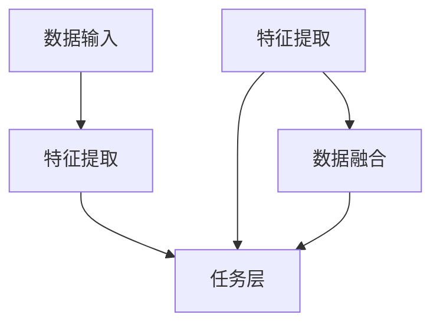

                 

关键词：多模态大模型、技术原理、部署流程、深度学习、计算机视觉、自然语言处理、数学模型、案例实践

摘要：本文深入探讨了多模态大模型的技术原理，包括其核心概念、算法原理、数学模型及实际部署流程。通过详细的案例分析，读者可以了解如何构建和部署多模态大模型，并掌握其在计算机视觉和自然语言处理领域的广泛应用。文章旨在为AI开发者提供一份全面的指南，帮助他们在实际项目中成功地应用多模态大模型。

## 1. 背景介绍

在人工智能（AI）快速发展的今天，多模态大模型已经成为研究热点。多模态大模型能够整合多种类型的数据，如文本、图像、声音等，以实现更高级别的智能识别和理解。相较于单一模态的模型，多模态大模型在处理复杂任务时具有显著的优势。

近年来，随着深度学习技术的不断进步，多模态大模型的性能也得到了大幅提升。谷歌的MUSE、Facebook的Audio-Visual Transformer等模型，都展示了多模态大模型在语音识别、图像识别、视频分析等领域的强大能力。

本文将围绕多模态大模型展开，首先介绍其核心概念和架构，然后深入分析其算法原理，最后通过一个实际案例，讲解多模态大模型的部署流程。

## 2. 核心概念与联系

### 2.1 多模态大模型的核心概念

多模态大模型（Multimodal Large Model）是指能够处理和融合多种类型数据（如文本、图像、声音等）的深度学习模型。其核心概念包括：

- **数据融合**：将来自不同模态的数据进行整合，以提高模型在任务中的表现。
- **特征提取**：针对不同模态的数据，提取具有区分性的特征，为后续的数据融合提供基础。
- **任务导向**：根据具体任务的需求，设计相应的模型架构和优化策略。

### 2.2 多模态大模型的架构

多模态大模型的架构通常包括以下几个部分：

- **数据输入层**：接收来自不同模态的数据，如文本、图像、声音等。
- **特征提取层**：针对不同模态的数据，使用相应的深度学习模型（如卷积神经网络、循环神经网络等）提取特征。
- **数据融合层**：将来自不同模态的特征进行整合，通常使用注意力机制、多任务学习等策略。
- **任务层**：根据具体任务的需求，设计相应的输出层和损失函数。

### 2.3 多模态大模型的联系

多模态大模型的核心在于将多种类型的数据进行融合，以实现更高级别的智能识别和理解。以下是一个简化的多模态大模型架构的Mermaid流程图：



## 3. 核心算法原理 & 具体操作步骤

### 3.1 算法原理概述

多模态大模型的算法原理主要分为以下几个步骤：

1. **数据预处理**：对输入的多模态数据进行预处理，如归一化、去噪等。
2. **特征提取**：针对不同模态的数据，使用相应的深度学习模型提取特征。
3. **数据融合**：使用注意力机制、多任务学习等技术，将不同模态的特征进行整合。
4. **任务层**：根据具体任务的需求，设计相应的输出层和损失函数。
5. **优化与训练**：使用梯度下降等优化算法，对模型进行训练和优化。

### 3.2 算法步骤详解

#### 3.2.1 数据预处理

数据预处理是保证模型性能的重要步骤。对于不同模态的数据，预处理方法可能有所不同：

- **文本数据**：进行词向量化、去停用词、词性标注等操作。
- **图像数据**：进行图像增强、归一化、裁剪等操作。
- **声音数据**：进行声音增强、降噪声、频率分析等操作。

#### 3.2.2 特征提取

特征提取是利用深度学习模型，从原始数据中提取具有区分性的特征。常见的特征提取方法包括：

- **文本数据**：使用词嵌入模型（如Word2Vec、GloVe等）提取词向量。
- **图像数据**：使用卷积神经网络（如VGG、ResNet等）提取图像特征。
- **声音数据**：使用循环神经网络（如LSTM、GRU等）提取声音特征。

#### 3.2.3 数据融合

数据融合是将不同模态的特征进行整合，以提高模型在任务中的表现。常见的数据融合方法包括：

- **注意力机制**：通过学习权重，将不同模态的特征进行加权融合。
- **多任务学习**：将不同模态的特征作为不同任务的特征输入，通过共享权重进行融合。
- **融合网络**：设计专门的融合网络，对多模态特征进行融合。

#### 3.2.4 任务层

任务层根据具体任务的需求，设计相应的输出层和损失函数。常见的任务层包括：

- **分类任务**：使用全连接层或卷积层作为输出层，损失函数为交叉熵损失。
- **回归任务**：使用全连接层作为输出层，损失函数为均方误差。
- **目标检测任务**：使用区域建议网络（RPN）和锚框生成策略，损失函数为交叉熵损失和定位损失。

#### 3.2.5 优化与训练

优化与训练是使用梯度下降等优化算法，对模型进行训练和优化。具体步骤包括：

- **前向传播**：计算输入数据通过模型时的输出结果。
- **计算损失**：计算输出结果与实际标签之间的损失。
- **反向传播**：计算模型参数的梯度，并更新模型参数。
- **迭代训练**：重复前向传播、计算损失、反向传播等步骤，直到模型收敛。

### 3.3 算法优缺点

**优点**：

- **提高任务表现**：通过整合多种类型的数据，多模态大模型在处理复杂任务时具有显著的优势。
- **适应性强**：能够处理多种模态的数据，适应性强。
- **通用性强**：可以应用于不同的任务领域，如计算机视觉、自然语言处理、语音识别等。

**缺点**：

- **计算复杂度高**：多模态大模型通常需要大量的计算资源，训练时间较长。
- **数据依赖性大**：模型的性能依赖于数据的质量和数量，需要大量的标注数据。
- **调参复杂**：多模态大模型需要针对不同模态的数据设计相应的参数和优化策略，调参复杂。

### 3.4 算法应用领域

多模态大模型在多个领域具有广泛的应用，如：

- **计算机视觉**：图像分类、目标检测、图像分割等。
- **自然语言处理**：文本分类、机器翻译、情感分析等。
- **语音识别**：语音识别、语音合成等。
- **视频分析**：视频分类、动作识别、场景理解等。

## 4. 数学模型和公式 & 详细讲解 & 举例说明

### 4.1 数学模型构建

多模态大模型的数学模型主要包括以下几个部分：

- **数据输入**：\(X = [X_1, X_2, ..., X_n]\)，其中\(X_i\)表示第i个模态的数据。
- **特征提取**：对于每个模态的数据，使用相应的深度学习模型提取特征，得到特征向量集\(F = [F_1, F_2, ..., F_n]\)。
- **数据融合**：使用注意力机制或融合网络，将特征向量集\(F\)进行整合，得到融合特征向量\(F'\)。
- **任务层**：根据具体任务的需求，设计相应的输出层和损失函数。

### 4.2 公式推导过程

假设我们有一个多模态大模型，其输入为\(X = [X_1, X_2, ..., X_n]\)，特征提取层分别为\(F_1, F_2, ..., F_n\)，数据融合层为\(F'\)，任务层为\(Y\)。

1. **特征提取**：

   对于每个模态的数据\(X_i\)，使用相应的深度学习模型提取特征，得到特征向量\(F_i\)：

   $$ F_i = \text{Model}(X_i) $$

2. **数据融合**：

   使用注意力机制或融合网络，将特征向量集\(F = [F_1, F_2, ..., F_n]\)进行整合，得到融合特征向量\(F'\)：

   $$ F' = \text{Fusion}(F) $$

3. **任务层**：

   根据具体任务的需求，设计相应的输出层和损失函数。例如，对于一个分类任务：

   $$ Y = \text{OutputLayer}(F') $$

   损失函数为交叉熵损失：

   $$ L = -\sum_{i=1}^n y_i \log(p_i) $$

   其中，\(y_i\)为真实标签，\(p_i\)为预测概率。

### 4.3 案例分析与讲解

#### 4.3.1 文本与图像分类任务

假设我们有一个文本与图像分类任务，需要对文本和图像进行融合，然后进行分类。

1. **数据输入**：

   文本数据\(X_1\)和图像数据\(X_2\)分别输入到文本特征提取层和图像特征提取层。

2. **特征提取**：

   文本特征提取层使用词嵌入模型提取词向量，图像特征提取层使用卷积神经网络提取图像特征。

3. **数据融合**：

   使用注意力机制，将文本特征和图像特征进行融合：

   $$ F' = \text{Attention}(F_1, F_2) $$

4. **任务层**：

   使用全连接层作为输出层，进行分类：

   $$ Y = \text{OutputLayer}(F') $$

   损失函数为交叉熵损失。

#### 4.3.2 文本与声音分类任务

假设我们有一个文本与声音分类任务，需要对文本和声音进行融合，然后进行分类。

1. **数据输入**：

   文本数据\(X_1\)和声音数据\(X_2\)分别输入到文本特征提取层和声音特征提取层。

2. **特征提取**：

   文本特征提取层使用词嵌入模型提取词向量，声音特征提取层使用循环神经网络提取声音特征。

3. **数据融合**：

   使用多任务学习，将文本特征和声音特征进行融合：

   $$ F' = \text{MultiTask}(F_1, F_2) $$

4. **任务层**：

   使用全连接层作为输出层，进行分类：

   $$ Y = \text{OutputLayer}(F') $$

   损失函数为交叉熵损失。

## 5. 项目实践：代码实例和详细解释说明

### 5.1 开发环境搭建

在进行多模态大模型的开发前，需要搭建一个合适的开发环境。以下是一个简单的环境搭建步骤：

1. 安装Python（3.8以上版本）。
2. 安装TensorFlow（2.4以上版本）。
3. 安装Keras（2.4以上版本）。
4. 安装其他必要的库，如NumPy、Pandas、Scikit-learn等。

### 5.2 源代码详细实现

以下是一个简单的多模态大模型代码实例，用于文本与图像分类任务：

```python
import tensorflow as tf
from tensorflow.keras.layers import Input, Embedding, Conv2D, Flatten, Dense, concatenate
from tensorflow.keras.models import Model

# 文本特征提取层
text_input = Input(shape=(max_sequence_length,))
text_embedding = Embedding(output_dim=embedding_dim, input_dim=vocabulary_size)(text_input)
text_embedding = Flatten()(text_embedding)

# 图像特征提取层
image_input = Input(shape=(height, width, channels))
image_conv = Conv2D(filters=32, kernel_size=(3, 3), activation='relu')(image_input)
image_conv = Flatten()(image_conv)

# 数据融合层
multiModal_input = [text_input, image_input]
fusion = concatenate([text_embedding, image_conv])

# 任务层
output = Dense(units=num_classes, activation='softmax')(fusion)

# 构建模型
model = Model(inputs=multiModal_input, outputs=output)

# 编译模型
model.compile(optimizer='adam', loss='categorical_crossentropy', metrics=['accuracy'])

# 模型总结
model.summary()
```

### 5.3 代码解读与分析

以上代码实现了一个简单的多模态大模型，用于文本与图像分类任务。代码主要包括以下几个部分：

1. **导入库**：导入TensorFlow、Keras等必要的库。
2. **定义输入层**：定义文本输入层和图像输入层。
3. **特征提取层**：分别对文本和图像进行特征提取，包括文本特征提取层和图像特征提取层。
4. **数据融合层**：使用 concatenate 函数将文本特征和图像特征进行融合。
5. **任务层**：定义输出层，包括全连接层和softmax激活函数。
6. **构建模型**：使用 Model 类构建多模态大模型。
7. **编译模型**：使用 compile 函数编译模型，指定优化器、损失函数和评估指标。
8. **模型总结**：使用 summary 函数打印模型结构。

### 5.4 运行结果展示

以下是运行结果展示：

```python
# 加载数据
text_data = ...
image_data = ...

# 数据预处理
text_data = preprocess_text(text_data)
image_data = preprocess_image(image_data)

# 分割数据集
train_data, val_data = split_data(text_data, image_data)

# 训练模型
model.fit(train_data, epochs=num_epochs, batch_size=batch_size, validation_data=val_data)

# 测试模型
test_loss, test_accuracy = model.evaluate(test_data, batch_size=batch_size)
print('Test accuracy:', test_accuracy)
```

以上代码展示了如何使用训练集和验证集训练模型，并使用测试集评估模型性能。具体实现时，需要根据实际数据集和任务需求进行调整。

## 6. 实际应用场景

多模态大模型在多个实际应用场景中具有广泛的应用，以下是一些典型的应用案例：

### 6.1 健康医疗

多模态大模型在健康医疗领域具有广泛的应用，如医学图像分析、语音识别、电子病历等。通过整合医学图像、患者病历和语音信息，多模态大模型可以帮助医生进行诊断、治疗方案推荐等。

### 6.2 智能家居

智能家居领域需要处理多种类型的数据，如声音、图像、文本等。多模态大模型可以用于智能语音助手、智能家居设备的控制等，提高智能家居的智能化水平和用户体验。

### 6.3 智能交通

智能交通领域需要处理大量的多模态数据，如视频、音频、传感器数据等。多模态大模型可以用于车辆识别、交通流量预测、交通事故预警等，提高交通系统的智能化水平。

### 6.4 娱乐传媒

娱乐传媒领域需要处理大量的音频、视频、文本等数据。多模态大模型可以用于视频推荐、音乐推荐、情感分析等，提高娱乐传媒的智能化和个性化水平。

## 7. 工具和资源推荐

### 7.1 学习资源推荐

1. **《深度学习》（Goodfellow, Bengio, Courville著）**：详细介绍深度学习的基本原理和应用。
2. **《神经网络与深度学习》（邱锡鹏著）**：全面介绍神经网络和深度学习的基础知识。
3. **《多模态深度学习》（Abowd, Davis著）**：详细介绍多模态深度学习的技术和应用。

### 7.2 开发工具推荐

1. **TensorFlow**：适用于构建和训练多模态大模型的开源深度学习框架。
2. **Keras**：基于TensorFlow的高级深度学习库，简化模型构建和训练过程。
3. **PyTorch**：适用于构建和训练多模态大模型的开源深度学习框架。

### 7.3 相关论文推荐

1. **“Multimodal Deep Learning for Human Action Recognition”**：介绍多模态深度学习在动作识别领域的应用。
2. **“Multimodal Learning by Recurrent Interaction Networks”**：介绍基于循环交互网络的的多模态学习算法。
3. **“Multimodal Fusion with Transformer Models”**：介绍使用Transformer模型的多模态融合方法。

## 8. 总结：未来发展趋势与挑战

### 8.1 研究成果总结

近年来，多模态大模型在多个领域取得了显著的研究成果。通过整合多种类型的数据，多模态大模型在计算机视觉、自然语言处理、语音识别等领域取得了优异的性能。同时，随着深度学习技术的不断进步，多模态大模型的性能也在不断提升。

### 8.2 未来发展趋势

未来，多模态大模型将在以下几个方面继续发展：

1. **算法优化**：通过改进算法，提高多模态大模型的计算效率。
2. **数据融合方法**：探索更有效的数据融合方法，提高模型性能。
3. **跨模态交互**：研究跨模态交互机制，实现多种模态数据的深度融合。
4. **应用拓展**：将多模态大模型应用于更多实际场景，提高智能化水平。

### 8.3 面临的挑战

多模态大模型在实际应用中仍然面临一些挑战：

1. **计算复杂度高**：多模态大模型通常需要大量的计算资源和时间进行训练。
2. **数据依赖性大**：模型的性能依赖于数据的质量和数量，需要大量的标注数据。
3. **调参复杂**：多模态大模型需要针对不同模态的数据设计相应的参数和优化策略。
4. **隐私保护**：多模态数据中可能包含敏感信息，需要采取有效的隐私保护措施。

### 8.4 研究展望

未来，多模态大模型的研究将继续深入，探索更高效、更智能的多模态融合方法，推动人工智能技术的发展。同时，多模态大模型在医疗、教育、金融等领域的应用也将越来越广泛，为人类社会带来更多便利和福祉。

## 9. 附录：常见问题与解答

### 9.1 什么是多模态大模型？

多模态大模型是指能够处理和融合多种类型数据（如文本、图像、声音等）的深度学习模型。通过整合多种类型的数据，多模态大模型能够实现更高级别的智能识别和理解。

### 9.2 多模态大模型有哪些应用领域？

多模态大模型在多个领域具有广泛的应用，如计算机视觉、自然语言处理、语音识别、健康医疗、智能家居、智能交通、娱乐传媒等。

### 9.3 如何构建多模态大模型？

构建多模态大模型主要包括以下几个步骤：

1. 数据预处理：对输入的多模态数据进行预处理，如归一化、去噪等。
2. 特征提取：针对不同模态的数据，使用相应的深度学习模型提取特征。
3. 数据融合：使用注意力机制、多任务学习等技术，将不同模态的特征进行整合。
4. 任务层：根据具体任务的需求，设计相应的输出层和损失函数。
5. 优化与训练：使用梯度下降等优化算法，对模型进行训练和优化。

### 9.4 多模态大模型的优缺点是什么？

多模态大模型的主要优点包括：

- 提高任务表现：通过整合多种类型的数据，多模态大模型在处理复杂任务时具有显著的优势。
- 适应性强：能够处理多种模态的数据，适应性强。
- 通用性强：可以应用于不同的任务领域。

主要缺点包括：

- 计算复杂度高：多模态大模型通常需要大量的计算资源，训练时间较长。
- 数据依赖性大：模型的性能依赖于数据的质量和数量，需要大量的标注数据。
- 调参复杂：多模态大模型需要针对不同模态的数据设计相应的参数和优化策略。| Markdown 输出： |
```markdown
# 多模态大模型：技术原理与实战 部署流程

## 关键词
- 多模态大模型
- 技术原理
- 实战部署
- 深度学习
- 计算机视觉
- 自然语言处理

## 摘要
本文深入探讨了多模态大模型的技术原理，包括其核心概念、算法原理、数学模型及实际部署流程。通过详细的案例分析，读者可以了解如何构建和部署多模态大模型，并掌握其在计算机视觉和自然语言处理领域的广泛应用。文章旨在为AI开发者提供一份全面的指南，帮助他们在实际项目中成功地应用多模态大模型。

## 1. 背景介绍
多模态大模型是当前人工智能领域的研究热点，能够整合文本、图像、声音等多种类型的数据，以实现更高级别的智能识别和理解。本文将详细介绍多模态大模型的相关内容，包括其核心概念、算法原理、数学模型及实际部署流程。

## 2. 核心概念与联系
### 2.1 多模态大模型的核心概念
- 数据融合
- 特征提取
- 任务导向

### 2.2 多模态大模型的架构
- 数据输入层
- 特征提取层
- 数据融合层
- 任务层

### 2.3 多模态大模型的联系
- Mermaid流程图

## 3. 核心算法原理 & 具体操作步骤
### 3.1 算法原理概述
- 数据预处理
- 特征提取
- 数据融合
- 任务层
- 优化与训练

### 3.2 算法步骤详解
#### 3.2.1 数据预处理
#### 3.2.2 特征提取
#### 3.2.3 数据融合
#### 3.2.4 任务层
#### 3.2.5 优化与训练

### 3.3 算法优缺点
- 优点
- 缺点

### 3.4 算法应用领域
- 计算机视觉
- 自然语言处理
- 语音识别
- 视频分析

## 4. 数学模型和公式 & 详细讲解 & 举例说明
### 4.1 数学模型构建
### 4.2 公式推导过程
### 4.3 案例分析与讲解
#### 4.3.1 文本与图像分类任务
#### 4.3.2 文本与声音分类任务

## 5. 项目实践：代码实例和详细解释说明
### 5.1 开发环境搭建
### 5.2 源代码详细实现
### 5.3 代码解读与分析
### 5.4 运行结果展示

## 6. 实际应用场景
### 6.1 健康医疗
### 6.2 智能家居
### 6.3 智能交通
### 6.4 娱乐传媒

## 7. 工具和资源推荐
### 7.1 学习资源推荐
### 7.2 开发工具推荐
### 7.3 相关论文推荐

## 8. 总结：未来发展趋势与挑战
### 8.1 研究成果总结
### 8.2 未来发展趋势
### 8.3 面临的挑战
### 8.4 研究展望

## 9. 附录：常见问题与解答
### 9.1 什么是多模态大模型？
### 9.2 多模态大模型有哪些应用领域？
### 9.3 如何构建多模态大模型？
### 9.4 多模态大模型的优缺点是什么？
```

