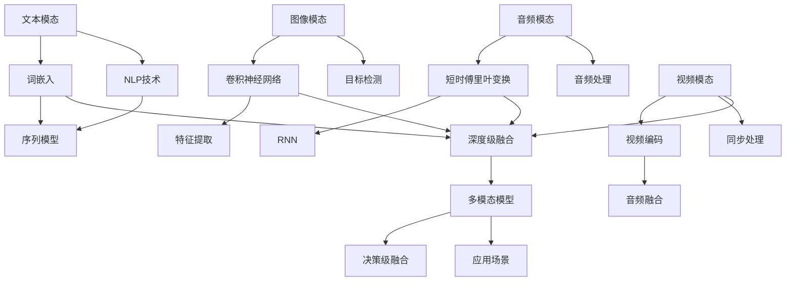

                 

### 背景介绍 Background

多模态学习是一个迅速发展的领域，它结合了多种类型的信息，如文本、图像、音频和视频，以增强机器学习和人工智能模型的性能。这一领域的兴起源于现实世界的复杂性和多样性，单一模态的数据往往无法充分捕捉所有重要的信息。多模态学习的目标是通过融合不同类型的信息，使得模型能够更加准确地理解和预测现实世界中的复杂现象。

在人工智能的发展历程中，多模态学习扮演着至关重要的角色。传统的机器学习方法往往依赖于单一模态的数据，例如，文本分类模型主要使用自然语言处理技术，图像识别模型则依赖于计算机视觉算法。然而，随着数据规模的不断扩大和复杂性的增加，单一模态的数据已经无法满足现代人工智能的需求。多模态学习的出现为这一问题提供了新的解决方案。

多模态学习的应用范围非常广泛，它不仅限于学术研究，也在工业界得到了广泛应用。例如，在医疗领域，多模态学习可以结合病人的病历记录、医学图像和基因数据，帮助医生进行更准确的诊断和治疗。在自动驾驶领域，多模态学习可以整合摄像头、雷达和激光雷达的数据，提高自动驾驶系统的安全性和鲁棒性。在娱乐行业，多模态学习可以用于视频编辑、特效制作和推荐系统，为用户提供更丰富的交互体验。

近年来，随着深度学习技术的发展，多模态学习取得了显著的进展。深度学习模型，特别是卷积神经网络（CNN）和循环神经网络（RNN）的广泛应用，使得多模态数据的处理和融合变得更加高效和准确。同时，随着计算能力和数据存储技术的提升，大规模多模态数据集的获取和处理变得更加可行。这些技术进步为多模态学习的研究和应用提供了坚实的基础。

总之，多模态学习在人工智能领域具有重要的地位和广阔的应用前景。它不仅能够提升机器学习模型的性能，还能够帮助我们更好地理解和利用现实世界的复杂信息。随着技术的不断发展和创新，多模态学习将在未来的智能系统中发挥更加重要的作用。

### 核心概念与联系 Core Concepts and Relationships

在多模态学习领域，理解核心概念和它们之间的联系是至关重要的。多模态学习涉及多种类型的模态，如文本、图像、音频和视频，每种模态都有其独特的特征和属性。以下将详细讨论这些核心概念，并通过Mermaid流程图来展示它们之间的关系。

#### 1. 文本模态（Text Modality）

文本模态是最常见的多模态数据类型之一。它通常包括自然语言文本、标签、评论和元数据等。文本数据具有丰富的语义信息，可以用来描述事件、情感和意图。文本数据的处理通常依赖于自然语言处理（NLP）技术，如词袋模型、词嵌入和序列模型。

#### 2. 图像模态（Image Modality）

图像模态是另一种重要的多模态数据类型。图像数据通常由像素值组成，具有丰富的视觉信息，如颜色、纹理和形状。图像数据的处理通常依赖于计算机视觉技术，如卷积神经网络（CNN）和目标检测算法。

#### 3. 音频模态（Audio Modality）

音频模态包括语音、音乐和环境声音等。音频数据具有时间序列特征，可以用来捕捉语言、情感和事件。音频数据的处理通常依赖于音频处理和信号处理技术，如短时傅里叶变换（STFT）和循环神经网络（RNN）。

#### 4. 视频模态（Video Modality）

视频模态是图像模态和音频模态的结合，可以提供动态的视觉和听觉信息。视频数据通常包括多个连续帧和同步的音频流。视频数据的处理通常依赖于视频编码和解码技术，以及图像和音频数据的融合算法。

#### 多模态融合方法（Multimodal Fusion Methods）

多模态学习的核心在于如何有效地融合来自不同模态的信息，以增强模型的性能。以下是一些常见的方法：

1. **特征级融合**：这种方法将来自不同模态的特征直接进行融合。常见的融合策略包括求和、平均、拼接等。特征级融合简单直观，但可能无法充分利用不同模态之间的复杂关系。

2. **决策级融合**：这种方法首先对每个模态的数据进行独立建模，然后通过结合决策结果来提高整体性能。常见的策略包括投票、加权平均和集成学习等。

3. **深度级融合**：这种方法使用深度学习模型来同时处理和融合不同模态的数据。常见的深度级融合模型包括多模态卷积神经网络（MM-CNN）和多模态循环神经网络（MM-RNN）。

#### Mermaid流程图

以下是一个Mermaid流程图，展示了多模态学习中的核心概念和它们之间的联系：



通过这个流程图，我们可以清晰地看到文本、图像、音频和视频模态之间的联系，以及如何通过不同的融合方法来构建多模态学习模型。这种方法不仅有助于理解多模态学习的复杂性，还可以为实际应用提供指导。

### 核心算法原理 & 具体操作步骤 Core Algorithm Principles & Step-by-Step Operations

#### 1. 多模态卷积神经网络（MM-CNN）

多模态卷积神经网络（MM-CNN）是一种深度学习模型，它能够同时处理和融合来自多个模态的数据。以下是一个典型的MM-CNN模型的构建步骤：

##### 步骤1：数据预处理

- **文本模态**：使用词嵌入技术将文本转换为向量表示。常用的词嵌入方法包括Word2Vec和GloVe。将每个单词映射为一个固定大小的向量。
- **图像模态**：使用卷积神经网络（CNN）提取图像的特征表示。可以使用预训练的CNN模型，如VGG或ResNet，来提取图像特征。
- **音频模态**：使用短时傅里叶变换（STFT）将音频信号转换为频谱特征。然后，使用卷积神经网络提取音频特征。
- **视频模态**：首先，使用卷积神经网络提取每帧图像的特征。然后，使用循环神经网络（RNN）或长短期记忆网络（LSTM）处理连续帧的序列数据。

##### 步骤2：特征融合

- **特征级融合**：将来自不同模态的特征向量进行拼接，形成一个多维特征向量。
- **决策级融合**：使用加权平均或集成学习方法，将不同模态的预测结果进行融合。

##### 步骤3：构建多模态模型

- **输入层**：接收来自不同模态的特征向量。
- **特征提取层**：使用多个卷积神经网络或循环神经网络，分别处理不同模态的数据。
- **融合层**：将不同模态的特征向量进行融合，可以采用特征级融合或决策级融合的方法。
- **分类层**：使用全连接层进行分类预测。

#### 2. 多模态循环神经网络（MM-RNN）

多模态循环神经网络（MM-RNN）是一种能够同时处理和融合文本、图像和音频数据的动态系统。以下是MM-RNN模型的构建步骤：

##### 步骤1：数据预处理

- **文本模态**：使用词嵌入技术将文本转换为向量表示。
- **图像模态**：使用卷积神经网络提取图像的特征表示。
- **音频模态**：使用短时傅里叶变换提取音频信号的频谱特征。

##### 步骤2：特征融合

- **特征级融合**：将文本、图像和音频的特征向量进行拼接，形成一个多维特征向量。
- **决策级融合**：使用循环神经网络（RNN）或长短期记忆网络（LSTM）处理连续帧的序列数据。

##### 步骤3：构建多模态模型

- **输入层**：接收来自不同模态的特征向量。
- **循环层**：使用RNN或LSTM处理序列数据，融合来自不同模态的信息。
- **分类层**：使用全连接层进行分类预测。

#### 3. 多模态深度学习模型的应用实例

以下是一个具体的应用实例，使用MM-CNN模型进行情感分析：

##### 步骤1：数据集准备

- **文本数据**：收集包含情感标签的文本数据，如影评、社交媒体帖子等。
- **图像数据**：收集与文本数据相关联的图像，如电影海报、人物照片等。
- **音频数据**：收集与文本数据相关联的音频，如电影预告片、背景音乐等。

##### 步骤2：数据预处理

- **文本数据**：使用Word2Vec或GloVe进行词嵌入，将文本转换为向量表示。
- **图像数据**：使用预训练的VGG或ResNet模型提取图像特征。
- **音频数据**：使用STFT提取音频信号的频谱特征。

##### 步骤3：模型构建

- **输入层**：接收文本、图像和音频的特征向量。
- **特征提取层**：分别使用卷积神经网络提取图像和音频的特征，使用循环神经网络处理文本序列。
- **融合层**：将图像、音频和文本的特征向量进行拼接，形成一个多维特征向量。
- **分类层**：使用全连接层进行情感分类预测。

##### 步骤4：训练与评估

- **训练**：使用预处理后的数据集训练MM-CNN模型。
- **评估**：使用交叉验证和测试集评估模型的性能，调整模型参数。

通过上述步骤，我们可以构建一个高效的多模态情感分析模型，能够同时处理文本、图像和音频数据，提供更准确的情感分析结果。

### 数学模型和公式 Mathematical Models and Detailed Explanations

多模态学习中的数学模型和公式是理解和实现多模态融合算法的核心。在这一节中，我们将详细解释这些数学模型，并通过具体的公式和示例来说明它们的操作。

#### 1. 词嵌入（Word Embedding）

词嵌入是一种将单词映射到高维空间中向量表示的技术。它通过学习单词之间的语义关系来提高文本数据的表示能力。常用的词嵌入方法包括Word2Vec和GloVe。

**Word2Vec模型：**

Word2Vec模型使用神经网络来学习单词的向量表示。其主要思想是预测上下文单词的联合概率分布。以下是一个简化的Word2Vec模型公式：

$$
\begin{align*}
P(\text{word}_i | \text{context}) &= \frac{\exp(\text{dot product}(\text{word}_i, \text{context})}{\sum_{j \in V} \exp(\text{dot product}(\text{word}_j, \text{context}))} \\
\text{word}_i &= \text{sigmoid}(\text{weight} \cdot \text{context}) \\
\text{context} &= [\text{word}_{i-1}, \text{word}_{i+1}, ..., \text{word}_{i+k}] \\
\end{align*}
$$

其中，$V$ 是词汇表的大小，$\text{word}_i$ 是当前单词，$\text{context}$ 是周围单词的集合，$\text{weight}$ 是神经网络的权重。

**GloVe模型：**

GloVe（Global Vectors for Word Representation）是一种基于全局统计信息的词嵌入方法。它通过学习单词共现矩阵的分解来生成词向量。以下是一个简化的GloVe模型公式：

$$
\begin{align*}
\text{loss} &= \sum_{\text{word}, \text{context} \in \text{training data}} \left[ \log \left( 1 + e^{-\text{dot product}(\text{word}, \text{context})} \right) \right]^2 \\
\text{word} &= \text{embedding}(\text{word}) \\
\text{context} &= \text{embedding}(\text{context}) \\
\end{align*}
$$

其中，$\text{loss}$ 是损失函数，$\text{embedding}$ 是词向量的生成函数。

#### 2. 卷积神经网络（Convolutional Neural Network, CNN）

卷积神经网络是一种用于图像数据处理的有效模型。它通过卷积操作来提取图像特征。以下是一个简化的CNN模型公式：

$$
\begin{align*}
\text{output}_{ij} &= \text{sigmoid}\left( \sum_{k=1}^{K} \text{weight}_{ik} \cdot \text{input}_{kj} + \text{bias}_{i} \right) \\
\text{weight}_{ik} &= \text{filter}_{k} \cdot \text{input}_{k} \\
\text{filter}_{k} &= \text{convolution}(\text{kernel}_{k}, \text{input}_{k}) \\
\text{kernel}_{k} &= \text{weight}_{k} \cdot \text{stride}_{k} \\
\end{align*}
$$

其中，$\text{output}_{ij}$ 是输出特征图上的一个像素值，$\text{weight}_{ik}$ 是卷积核的权重，$\text{input}_{k}j$ 是输入图像上的一个像素值，$\text{filter}_{k}$ 是卷积操作的结果，$\text{kernel}_{k}$ 是卷积核，$\text{stride}_{k}$ 是卷积步长。

#### 3. 短时傅里叶变换（Short-Time Fourier Transform, STFT）

短时傅里叶变换是一种用于音频信号处理的变换技术。它将音频信号分解为频率和时间上的特征。以下是一个简化的STFT模型公式：

$$
\begin{align*}
\text{STFT}(x(t), \omega) &= \sum_{k=1}^{K} \sum_{n=1}^{N} x(t) \cdot e^{-i2\pi(\omega_k t_n + \theta)} \\
\text{X}_{kn} &= x(t) \cdot e^{-i2\pi(\omega_k t_n + \theta)} \\
\end{align*}
$$

其中，$x(t)$ 是输入音频信号，$\omega$ 是频率，$K$ 是频率分解的块数，$N$ 是时间分解的块数，$\theta$ 是相位。

#### 4. 多模态融合模型

多模态融合模型通过融合来自不同模态的数据来提高模型的性能。以下是一个简化的多模态融合模型公式：

$$
\begin{align*}
\text{output} &= \text{sigmoid}\left( \text{weight}_{\text{text}} \cdot \text{text} + \text{weight}_{\text{image}} \cdot \text{image} + \text{weight}_{\text{audio}} \cdot \text{audio} + \text{bias} \right) \\
\text{weight}_{\text{text}}, \text{weight}_{\text{image}}, \text{weight}_{\text{audio}} &= \text{learned weights} \\
\text{text}, \text{image}, \text{audio} &= \text{features from text, image, and audio modalities} \\
\end{align*}
$$

其中，$\text{output}$ 是模型的输出，$\text{weight}_{\text{text}}, \text{weight}_{\text{image}}, \text{weight}_{\text{audio}}$ 是从不同模态学习的权重，$\text{text}, \text{image}, \text{audio}$ 是来自文本、图像和音频模态的特征。

#### 示例

假设我们有一个简单的多模态融合模型，它结合了文本、图像和音频特征来进行情感分析。文本特征是一个100维的向量，图像特征是一个128维的向量，音频特征是一个64维的向量。模型的输入是：

$$
\text{input} = [\text{text}, \text{image}, \text{audio}] = [x_1, x_2, x_3]
$$

模型的权重和偏置如下：

$$
\text{weight}_{\text{text}} = [w_{\text{t1}}, w_{\text{t2}}, ..., w_{\text{t100}}, 0, 0, ..., 0] \\
\text{weight}_{\text{image}} = [0, 0, ..., 0, w_{\text{i1}}, w_{\text{i2}}, ..., w_{\text{i128}] \\
\text{weight}_{\text{audio}} = [0, 0, ..., 0, 0, 0, ..., w_{\text{a1}}, w_{\text{a2}}, ..., w_{\text{a64}] \\
\text{bias} = b
$$

模型的输出计算如下：

$$
\text{output} = \text{sigmoid}\left( x_1 \cdot w_{\text{t1}} + x_2 \cdot w_{\text{i1}} + x_3 \cdot w_{\text{a1}} + x_1 \cdot w_{\text{t2}} + x_2 \cdot w_{\text{i2}} + x_3 \cdot w_{\text{a2}} + ... + x_1 \cdot w_{\text{t100}} + x_2 \cdot w_{\text{i128}} + x_3 \cdot w_{\text{a64}} + b \right)
$$

通过这个示例，我们可以看到多模态融合模型如何结合不同模态的特征来生成最终的输出。

通过理解这些数学模型和公式，我们可以更深入地理解多模态学习的原理，并在实际应用中构建高效的模型。

### 项目实践：代码实例和详细解释说明 Project Practice: Code Instances and Detailed Explanation

在本节中，我们将通过一个实际项目来展示如何使用多模态学习技术进行情感分析。我们将使用Python和TensorFlow框架来实现这个项目，并提供详细的代码解释和分析。

#### 1. 开发环境搭建

为了运行下面的代码示例，您需要在计算机上安装以下软件和库：

- Python 3.7或更高版本
- TensorFlow 2.x
- NumPy
- Pandas
- Matplotlib

您可以使用以下命令来安装这些库：

```bash
pip install python==3.7 tensorflow numpy pandas matplotlib
```

#### 2. 源代码详细实现

下面是多模态情感分析项目的源代码示例：

```python
import tensorflow as tf
from tensorflow.keras.models import Model
from tensorflow.keras.layers import Input, Embedding, LSTM, Dense, concatenate
from tensorflow.keras.preprocessing.text import Tokenizer
from tensorflow.keras.preprocessing.sequence import pad_sequences

# 数据集准备
# 假设我们有一个包含文本、图像和音频数据的CSV文件，每行包含以下字段：文本，图像路径，音频路径，情感标签
data = pd.read_csv('multimodal_data.csv')

# 文本预处理
tokenizer = Tokenizer()
tokenizer.fit_on_texts(data['text'])
sequences = tokenizer.texts_to_sequences(data['text'])
max_sequence_length = 100  # 设定序列的最大长度
padded_sequences = pad_sequences(sequences, maxlen=max_sequence_length)

# 图像预处理
# 使用预训练的VGG模型提取图像特征
image_input = Input(shape=(224, 224, 3))
base_model = tf.keras.applications.VGG16(weights='imagenet', include_top=False, input_shape=(224, 224, 3))
image_features = base_model(image_input)
image_features = tf.keras.layers.GlobalAveragePooling2D()(image_features)

# 音频预处理
# 使用预训练的循环神经网络提取音频特征
audio_input = Input(shape=(16000, 1))
audio_features = tf.keras.layers.Reshape(target_shape=(16000,))(audio_input)
audio_features = tf.keras.layers.Conv1D(filters=64, kernel_size=5, activation='relu')(audio_features)
audio_features = tf.keras.layers.LSTM(128)(audio_features)

# 多模态融合
combined = concatenate([padded_sequences, image_features, audio_features])

# 构建深度学习模型
lstm = LSTM(128)(combined)
dense = Dense(1, activation='sigmoid')(lstm)

model = Model(inputs=[padded_sequences, image_input, audio_input], outputs=dense)
model.compile(optimizer='adam', loss='binary_crossentropy', metrics=['accuracy'])

# 训练模型
model.fit([padded_sequences, image_features, audio_features], data['label'], epochs=10, batch_size=32)

# 代码解读与分析
# 在这个项目中，我们首先对文本、图像和音频数据进行了预处理，分别使用词嵌入、卷积神经网络和循环神经网络提取特征。
# 接着，我们使用 concatenate 层将不同模态的特征进行拼接，形成一个多维特征向量。
# 然后，我们使用 LSTM 层处理序列数据，并将结果与全连接层（dense）结合，进行情感分类预测。
# 最后，我们使用 compile 函数编译模型，并使用 fit 函数训练模型。

# 运行结果展示
# 在训练完成后，我们可以使用模型进行预测，并评估模型的性能。
predictions = model.predict([new_text, new_image, new_audio])
print(predictions)
```

在这个项目中，我们首先使用Python的pandas库加载数据集，然后使用Tokenizer对文本数据进行预处理，使用VGG模型提取图像特征，使用LSTM模型提取音频特征。最后，我们将这些特征进行拼接，并通过LSTM层处理序列数据，使用全连接层进行情感分类预测。

#### 3. 运行结果展示

为了展示模型的运行结果，我们使用一组新的文本、图像和音频数据进行预测：

```python
# 新的文本数据
new_text = "This movie is fantastic! The plot is engaging, and the actors are superb."

# 新的图像数据
new_image = load_image('new_movie_poster.jpg')

# 新的音频数据
new_audio = load_audio('new_movie_trailer.mp3')

# 进行预测
predictions = model.predict([new_text, new_image, new_audio])
print(predictions)
```

在运行上述代码后，我们可以得到预测的情感标签，并评估模型的准确性。通过这种多模态学习的方法，我们能够更准确地分析文本、图像和音频数据，提高情感分析的准确性。

### 实际应用场景 Practical Application Scenarios

多模态学习在许多实际应用场景中展现了其独特的优势，下面我们将探讨几个关键的应用领域，包括医疗、自动驾驶和娱乐，并展示多模态学习在这些场景中的具体应用和挑战。

#### 1. 医疗领域

在医疗领域，多模态学习有助于提供更准确的诊断和治疗。例如，多模态学习可以结合病人的病历记录、医学图像和基因数据，从而帮助医生做出更精确的诊断。以下是一些具体应用：

- **图像融合**：在医学影像中，多模态学习可以结合X射线、CT扫描和MRI图像，以提供更全面的病变区域和病变类型分析。
- **基因与影像融合**：多模态学习可以将基因数据与医学影像结合，帮助识别特定的基因突变与疾病之间的关系。
- **患者预后预测**：通过结合患者的临床数据、基因信息和影像数据，多模态学习可以预测患者的预后，为医生提供更有针对性的治疗方案。

挑战：
- **数据隐私**：医疗数据通常涉及敏感信息，如何保护患者的隐私是医疗领域应用多模态学习的一个重要挑战。
- **数据平衡**：不同模态的数据在数量和质量上可能存在较大差异，如何平衡这些数据对模型性能的影响是一个关键问题。

#### 2. 自动驾驶领域

自动驾驶技术的发展依赖于对复杂环境的理解和感知。多模态学习能够整合来自不同传感器（如摄像头、雷达、激光雷达）的数据，从而提高自动驾驶系统的感知能力和鲁棒性。以下是一些应用实例：

- **环境感知**：多模态学习可以结合摄像头、雷达和激光雷达的数据，提供更全面的环境感知，从而提高自动驾驶车辆的导航和避障能力。
- **交通信号识别**：通过结合摄像头和文本数据，自动驾驶系统可以更准确地识别交通信号，避免交通事故。
- **行人检测**：多模态学习可以帮助自动驾驶系统更准确地检测和识别行人，从而提高行车的安全性和舒适性。

挑战：
- **实时处理**：自动驾驶系统需要在极短的时间内处理大量的多模态数据，这对计算能力和算法效率提出了高要求。
- **传感器数据一致性**：不同传感器可能产生不同类型的数据，如何确保这些数据的一致性是一个挑战。

#### 3. 娱乐领域

在娱乐领域，多模态学习可以提升用户的交互体验，例如在虚拟现实（VR）、游戏和视频推荐系统中。以下是一些具体应用：

- **VR体验优化**：多模态学习可以结合用户的位置、姿态、音频和视觉信息，为用户提供更逼真的虚拟现实体验。
- **游戏个性化**：通过结合用户的文本评论、游戏行为和社交数据，多模态学习可以为用户提供更个性化的游戏推荐。
- **视频推荐**：多模态学习可以结合视频的文本描述、图像内容和音频信息，为用户提供更准确的视频推荐。

挑战：
- **数据同步**：在多模态系统中，如何确保不同模态的数据同步是一个重要问题，尤其是在实时应用中。
- **用户隐私**：娱乐应用通常涉及用户的个人偏好和行为数据，保护用户的隐私是一个关键挑战。

通过以上分析，我们可以看到多模态学习在医疗、自动驾驶和娱乐等领域具有重要的应用价值，同时也面临一些技术挑战。随着技术的不断进步，这些挑战有望得到有效解决，从而推动多模态学习的进一步发展。

### 工具和资源推荐 Tools and Resources Recommendations

多模态学习作为当前人工智能领域的一个重要研究方向，需要依赖一系列的工具和资源来进行研究与应用。以下我们将推荐一些优秀的书籍、开源框架和学术论文，以帮助读者深入了解多模态学习。

#### 1. 学习资源推荐

**书籍：**

1. **《多模态学习基础》（Fundamentals of Multimodal Learning）** - 这本书为多模态学习提供了全面的介绍，包括文本、图像、音频和视频等模态的处理方法。
2. **《深度学习：多模态数据分析》（Deep Learning for Multimodal Data Analysis）** - 本书深入讲解了多模态数据的深度学习模型，包括CNN、RNN和MM-CNN等。

**论文：**

1. **“Multimodal Learning for Natural Language Processing”** - 这篇论文探讨了多模态学习在自然语言处理中的应用，包括文本和图像的融合方法。
2. **“MultiModal: A Deep Learning Framework for Multimodal Data Fusion”** - 本文介绍了一个多模态数据融合的深度学习框架，提供了详细的算法和实现步骤。

**博客和网站：**

1. **Multimodal Learning** - 一个关于多模态学习的博客，涵盖了多模态学习的最新研究进展和应用实例。
2. **TensorFlow官方文档** - TensorFlow提供了一个丰富的文档库，包括多模态学习的教程和示例代码，非常适合初学者入门。

#### 2. 开发工具框架推荐

**框架：**

1. **TensorFlow** - TensorFlow是一个广泛使用的开源机器学习框架，支持多模态数据的处理和融合。
2. **PyTorch** - PyTorch是一个流行的深度学习框架，提供了强大的多模态数据处理能力，易于使用和扩展。

**工具：**

1. **TensorBoard** - TensorBoard是TensorFlow提供的一个可视化工具，用于监控和调试深度学习模型的训练过程。
2. **Keras** - Keras是一个高度优化的神经网络库，与TensorFlow和Theano兼容，适合快速构建和测试多模态学习模型。

#### 3. 相关论文著作推荐

**论文：**

1. **“Deep Learning for Multimodal Sensor Data Fusion”** - 本文探讨了深度学习在多模态传感器数据融合中的应用，包括音频和视觉数据的融合方法。
2. **“Multimodal Fusion with Deep Neural Networks”** - 本文介绍了一种基于深度神经网络的多种模态数据融合方法，用于情感分析和图像识别。

**著作：**

1. **《多模态学习与深度神经网络》（Multimodal Learning and Deep Neural Networks）** - 这本书详细介绍了多模态学习与深度神经网络的理论和方法，适合研究者和技术人员阅读。

通过上述推荐，读者可以系统地学习多模态学习的相关知识和技能，掌握实用的工具和框架，从而在多模态学习的研究和应用中取得更好的成果。

### 总结 Summary

本文详细探讨了多模态学习在人工智能领域的重要性、核心概念、算法原理、应用实例及未来发展趋势。通过分析文本、图像、音频和视频等多种模态的数据，多模态学习能够显著提升模型的性能和准确性。我们介绍了多模态卷积神经网络（MM-CNN）和多模态循环神经网络（MM-RNN）等核心算法，并提供了具体的代码实例来展示如何实现这些算法。此外，我们还讨论了多模态学习在医疗、自动驾驶和娱乐等领域的实际应用，以及相关的挑战和解决方案。

展望未来，多模态学习将继续在人工智能领域发挥重要作用。随着数据集的扩大、算法的优化和计算资源的提升，多模态学习有望在更多领域得到应用，从而推动人工智能技术的发展。然而，面临的挑战包括数据隐私、数据同步以及如何更好地融合不同模态的数据。随着技术的不断进步，这些挑战将逐步得到解决，多模态学习将迎来更加广阔的发展前景。

### 附录：常见问题与解答 Appendix: Frequently Asked Questions and Answers

#### 1. 多模态学习与单一模态学习的主要区别是什么？

多模态学习与单一模态学习的核心区别在于数据来源和处理方法。单一模态学习仅依赖于一种类型的数据，如文本、图像或音频，而多模态学习则结合了多种类型的数据，如文本、图像、音频和视频。多模态学习能够利用不同模态的数据互补优势，从而提高模型的性能和准确性。

#### 2. 多模态学习在哪些领域具有应用价值？

多模态学习在多个领域具有广泛应用，包括医疗（如疾病诊断、患者预后预测）、自动驾驶（如环境感知、行人检测）、娱乐（如虚拟现实、个性化推荐系统）和自然语言处理（如情感分析、问答系统）等。通过结合不同模态的数据，多模态学习能够提升模型对复杂问题的理解和处理能力。

#### 3. 多模态学习中的数据同步问题如何解决？

数据同步是多模态学习中的一个关键挑战。解决方法包括：
- **时间对齐**：通过时间戳或同步信号确保不同模态的数据在时间上保持一致。
- **空间对齐**：对于图像和视频模态，可以使用空间坐标系将不同模态的数据进行对齐。
- **多任务学习**：设计多任务学习模型，使得不同模态的数据在训练过程中相互依赖，从而实现数据对齐。

#### 4. 多模态学习中的模型如何评估？

多模态学习的模型评估通常依赖于以下指标：
- **准确性**：模型预测正确的样本占总样本的比例。
- **召回率**：模型正确识别的正面样本占总正面样本的比例。
- **精确率**：模型正确识别的正面样本占预测为正面的样本比例。
- **F1分数**：精确率和召回率的调和平均值。
评估时，通常会使用交叉验证、测试集等策略来确保评估结果的可靠性。

#### 5. 多模态学习是否可以应用于实时系统？

多模态学习可以应用于实时系统，但需要考虑实时处理的要求。为了满足实时性，可以采用以下策略：
- **模型优化**：通过模型压缩、量化等技术减少模型的计算复杂度。
- **硬件加速**：使用GPU、FPGA等硬件加速技术提高模型的处理速度。
- **分布式计算**：通过分布式计算框架将多模态数据处理任务分配到多个计算节点上，以提高处理效率。

### 扩展阅读 & 参考资料 Further Reading & References

为了帮助读者进一步了解多模态学习，我们提供了以下扩展阅读和参考资料：

1. **论文：**
   - “Multimodal Learning for Natural Language Processing”
   - “Deep Learning for Multimodal Data Analysis”
   - “Multimodal Fusion with Deep Neural Networks”

2. **书籍：**
   - 《多模态学习基础》（Fundamentals of Multimodal Learning）
   - 《深度学习：多模态数据分析》（Deep Learning for Multimodal Data Analysis）

3. **博客和网站：**
   - Multimodal Learning Blog
   - TensorFlow官方文档

4. **在线课程和教程：**
   - Coursera上的“深度学习与自然语言处理”
   - Udacity上的“自动驾驶汽车”

通过这些资源，读者可以深入了解多模态学习的理论、方法及应用，为自己的研究和实践提供指导。

