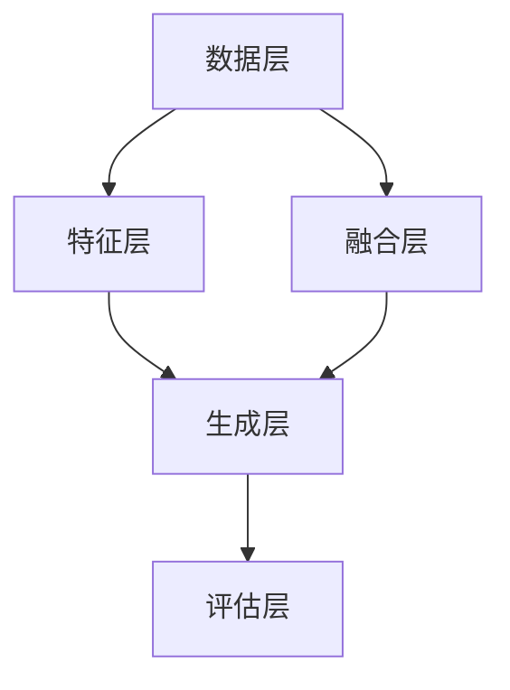

                 

### 文章标题

《多模态生成(Multimodal Generation) - 原理与代码实例讲解》

> 关键词：多模态生成，AI，机器学习，自然语言处理，计算机视觉，深度学习，模型架构，代码实现，实例分析

> 摘要：本文将深入探讨多模态生成的原理及其在AI领域的应用。我们将从背景介绍开始，逐步解析多模态生成的核心概念、算法原理，并通过具体代码实例展示其实际应用。文章还将探讨多模态生成在各个行业的实际应用场景，并提供相关的学习资源和工具推荐。最后，我们将总结未来发展趋势与挑战，为读者提供全面的参考。

---

### 1. 背景介绍

随着人工智能（AI）技术的不断进步，多模态生成（Multimodal Generation）逐渐成为研究热点。多模态生成是指通过结合多种类型的输入（如文本、图像、音频等），生成相应的输出内容。这种技术不仅能够提高信息表达的丰富性和准确性，还能够为各种应用场景提供更加智能化和个性化的解决方案。

多模态生成在自然语言处理（NLP）、计算机视觉（CV）、语音识别等多个领域都有广泛应用。例如，在自然语言处理领域，多模态生成可以用于文本摘要、机器翻译、情感分析等任务；在计算机视觉领域，多模态生成可以用于图像生成、视频生成、3D模型生成等任务；在语音识别领域，多模态生成可以用于语音合成、语音识别等任务。

近年来，随着深度学习技术的发展，多模态生成模型取得了显著的进展。例如，生成对抗网络（GAN）、变分自编码器（VAE）、自注意力机制（Self-Attention）等模型在多模态生成任务中表现出色。此外，一些优秀的开源工具和框架，如TensorFlow、PyTorch、Keras等，也为多模态生成的研究和应用提供了强大的支持。

本文将围绕多模态生成这一主题，系统地介绍其原理、算法、模型架构、代码实现和应用场景。通过本文的讲解，读者可以全面了解多模态生成技术，并能够掌握其在实际项目中的应用。

### 2. 核心概念与联系

#### 2.1. 多模态生成的定义

多模态生成是指通过结合多种类型的输入数据（如图像、文本、音频等），生成相应的输出内容。这种生成过程涉及到多个模态的数据处理和融合。具体来说，多模态生成可以分为以下几个步骤：

1. **数据采集与预处理**：首先，从不同的数据源采集图像、文本、音频等多模态数据。然后，对采集到的数据进行预处理，包括数据清洗、数据增强、数据标准化等操作。

2. **特征提取与融合**：对于每种模态的数据，使用相应的特征提取技术（如图像特征提取、文本特征提取、音频特征提取等）提取特征。然后，将这些特征进行融合，以生成一个统一的多模态特征表示。

3. **生成模型训练**：使用训练数据集对生成模型进行训练。生成模型通常采用深度学习框架，如生成对抗网络（GAN）、变分自编码器（VAE）等。

4. **生成与评估**：使用训练好的生成模型生成新的多模态数据。然后，对生成的数据质量进行评估，以确定生成模型的性能。

#### 2.2. 多模态生成的核心概念

多模态生成涉及到多个核心概念，包括：

1. **特征提取**：特征提取是指从原始数据中提取出具有代表性的特征。对于图像、文本、音频等不同类型的数据，采用不同的特征提取技术。

2. **特征融合**：特征融合是指将来自不同模态的特征进行整合，以生成一个统一的多模态特征表示。常见的特征融合方法包括基于矩阵的融合、基于网络的融合等。

3. **生成模型**：生成模型是指用于生成新数据的模型，如生成对抗网络（GAN）、变分自编码器（VAE）等。这些模型能够通过学习数据分布，生成具有逼真度和多样性的新数据。

4. **损失函数**：损失函数是用于评估生成模型性能的指标。常见的损失函数包括生成损失、判别损失、重建损失等。

#### 2.3. 多模态生成架构

多模态生成通常采用一种层次化的架构，包括以下几个层次：

1. **数据层**：数据层负责数据的采集和预处理，包括图像、文本、音频等不同类型的数据。

2. **特征层**：特征层负责对数据进行特征提取，生成相应的特征表示。

3. **融合层**：融合层负责将不同模态的特征进行融合，生成一个统一的多模态特征表示。

4. **生成层**：生成层负责使用生成模型生成新的多模态数据。

5. **评估层**：评估层负责对生成的数据质量进行评估，以确定生成模型的性能。

以下是多模态生成架构的 Mermaid 流程图：



### 3. 核心算法原理 & 具体操作步骤

#### 3.1. 生成对抗网络（GAN）

生成对抗网络（GAN）是一种常用于多模态生成任务的深度学习模型。GAN由生成器（Generator）和判别器（Discriminator）两个部分组成。

1. **生成器（Generator）**：

生成器的任务是生成逼真的多模态数据。它通常是一个深度神经网络，接收随机噪声作为输入，通过多层神经网络转换生成多模态数据。生成器的目标是使其生成的数据尽可能地难以被判别器区分。

2. **判别器（Discriminator）**：

判别器的任务是区分输入数据是真实数据还是生成数据。它也是一个深度神经网络，接收多模态数据作为输入，输出一个概率值，表示输入数据的真实性。判别器的目标是使其对真实数据和生成数据的区分能力最大化。

3. **训练过程**：

GAN的训练过程是通过交替训练生成器和判别器来实现的。具体步骤如下：

- 初始化生成器和判别器。
- 生成器生成一批伪数据。
- 判别器对真实数据和生成数据进行训练。
- 生成器对生成的伪数据进行训练。
- 重复以上步骤，直到生成器和判别器达到预定的训练目标。

#### 3.2. 变分自编码器（VAE）

变分自编码器（VAE）是一种无监督学习的生成模型，它通过学习数据的高斯分布来实现数据的生成。VAE由编码器（Encoder）和解码器（Decoder）两个部分组成。

1. **编码器（Encoder）**：

编码器的任务是将输入数据编码成一个低维的隐变量表示。隐变量表示了输入数据的主要信息。

2. **解码器（Decoder）**：

解码器的任务是将编码器生成的隐变量解码成新的多模态数据。解码器通过多层神经网络将隐变量转换回多模态数据。

3. **训练过程**：

VAE的训练过程是无监督的，具体步骤如下：

- 初始化编码器和解码器。
- 从数据集中随机采样一批输入数据。
- 编码器将输入数据编码成隐变量。
- 解码器将隐变量解码成新的多模态数据。
- 计算损失函数，并更新编码器和解码器的参数。
- 重复以上步骤，直到模型达到预定的训练目标。

#### 3.3. 自注意力机制（Self-Attention）

自注意力机制是一种在多模态生成任务中常用的注意力机制。它能够自动学习输入数据的依赖关系，并在特征融合过程中赋予不同位置的数据不同的权重。

1. **自注意力机制原理**：

自注意力机制通过计算输入数据的注意力权重，对输入数据进行加权求和。具体来说，自注意力机制可以分为以下几个步骤：

- **键值对（Key-Value Pair）**：首先，将输入数据分成键（Key）和值（Value）两部分。
- **计算相似度**：计算每个键和每个值之间的相似度，通常使用点积操作。
- **加权求和**：根据相似度权重对值进行加权求和，生成新的特征表示。

2. **自注意力机制应用**：

在多模态生成任务中，自注意力机制可以用于特征融合。具体来说，可以按照以下步骤进行：

- **特征提取**：对每种模态的数据进行特征提取，生成键和值。
- **计算相似度**：计算键和值之间的相似度。
- **加权求和**：根据相似度权重对值进行加权求和，生成统一的多模态特征表示。

### 4. 数学模型和公式 & 详细讲解 & 举例说明

#### 4.1. 生成对抗网络（GAN）

生成对抗网络（GAN）的核心数学模型包括生成器（Generator）和判别器（Discriminator）。

1. **生成器（Generator）**：

生成器的目标是生成逼真的多模态数据。其数学模型可以表示为：

$$
G(z) = x_g,
$$

其中，$z$ 是随机噪声，$x_g$ 是生成器生成的多模态数据。

2. **判别器（Discriminator）**：

判别器的目标是区分输入数据是真实数据还是生成数据。其数学模型可以表示为：

$$
D(x) = P(D(x) = 1 | x \text{ is real}),
$$

$$
D(G(z)) = P(D(G(z)) = 1 | G(z) \text{ is generated}).
$$

其中，$x$ 是真实的多模态数据，$G(z)$ 是生成器生成的多模态数据。

3. **损失函数**：

GAN的损失函数通常由生成损失和判别损失组成。生成损失可以表示为：

$$
L_G = -\mathbb{E}_{z \sim p_z(z)}[\log D(G(z))],
$$

其中，$p_z(z)$ 是噪声分布。

判别损失可以表示为：

$$
L_D = -\mathbb{E}_{x \sim p_x(x)}[\log D(x)] - \mathbb{E}_{z \sim p_z(z)}[\log (1 - D(G(z)))].
$$

总损失函数可以表示为：

$$
L = L_G + \lambda L_D,
$$

其中，$\lambda$ 是平衡生成损失和判别损失的权重。

#### 4.2. 变分自编码器（VAE）

变分自编码器（VAE）的核心数学模型包括编码器（Encoder）和解码器（Decoder）。

1. **编码器（Encoder）**：

编码器的目标是学习数据的高斯分布。其数学模型可以表示为：

$$
q_\theta(z|x) = \mathcal{N}(z|x; \mu(x), \sigma^2(x)),
$$

其中，$\theta$ 是编码器的参数，$z$ 是编码器输出的隐变量，$x$ 是输入数据，$\mu(x)$ 和 $\sigma^2(x)$ 分别是隐变量的均值和方差。

2. **解码器（Decoder）**：

解码器的目标是生成新的多模态数据。其数学模型可以表示为：

$$
p_\phi(x|z) = \mathcal{N}(x|z; \mu(z), \sigma^2(z)),
$$

其中，$\phi$ 是解码器的参数，$z$ 是解码器输入的隐变量，$x$ 是解码器生成的多模态数据。

3. **损失函数**：

VAE的损失函数通常由重建损失和KL散度损失组成。重建损失可以表示为：

$$
L_R = \mathbb{E}_{x \sim p_x(x)}[-\log p_\phi(x|z)],
$$

KL散度损失可以表示为：

$$
L_KL = D_{KL}(q_\theta(z|x) || p_z(z)),
$$

总损失函数可以表示为：

$$
L = L_R + \beta L_KL,
$$

其中，$\beta$ 是平衡重建损失和KL散度损失的权重。

#### 4.3. 自注意力机制（Self-Attention）

自注意力机制的数学模型可以表示为：

$$
\text{Self-Attention}(Q, K, V) = \text{softmax}\left(\frac{QK^T}{\sqrt{d_k}}\right)V,
$$

其中，$Q$、$K$ 和 $V$ 分别是查询（Query）、键（Key）和值（Value）的向量，$d_k$ 是键向量的维度。

#### 4.4. 举例说明

假设我们有一个图像生成任务，使用生成对抗网络（GAN）进行多模态生成。给定一个随机噪声 $z$，生成器 $G$ 生成一张图像 $x_g$。判别器 $D$ 对真实图像 $x$ 和生成图像 $x_g$ 进行分类，输出概率值。

1. **生成器（Generator）**：

生成器的模型可以表示为：

$$
G(z) = \sigma(W_3 \text{ReLU}(W_2 \text{ReLU}(W_1 z) + b_1)) + b_2,
$$

其中，$W_1$、$W_2$ 和 $W_3$ 是生成器的权重矩阵，$b_1$ 和 $b_2$ 是生成器的偏置。

2. **判别器（Discriminator）**：

判别器的模型可以表示为：

$$
D(x) = \sigma(W_4 \text{ReLU}(W_3 \text{ReLU}(W_2 \text{ReLU}(W_1 x) + b_1)) + b_2),
$$

$$
D(G(z)) = \sigma(W_4 \text{ReLU}(W_3 \text{ReLU}(W_2 \text{ReLU}(W_1 G(z)) + b_1)) + b_2),
$$

其中，$W_1$、$W_2$、$W_3$ 和 $W_4$ 是判别器的权重矩阵，$b_1$ 和 $b_2$ 是判别器的偏置。

3. **损失函数**：

生成对抗网络的损失函数可以表示为：

$$
L_G = -\mathbb{E}_{z \sim p_z(z)}[\log D(G(z))],
$$

$$
L_D = -\mathbb{E}_{x \sim p_x(x)}[\log D(x)] - \mathbb{E}_{z \sim p_z(z)}[\log (1 - D(G(z)))],
$$

$$
L = L_G + \lambda L_D,
$$

其中，$\lambda$ 是平衡生成损失和判别损失的权重。

### 5. 项目实践：代码实例和详细解释说明

在本节中，我们将通过一个简单的图像生成项目实例，展示如何使用生成对抗网络（GAN）进行多模态生成。项目的主要步骤包括：开发环境搭建、源代码实现、代码解读与分析以及运行结果展示。

#### 5.1. 开发环境搭建

为了实现多模态生成，我们需要搭建一个合适的开发环境。以下是具体的步骤：

1. **安装Python**：首先，确保已经安装了Python 3.6或更高版本。

2. **安装TensorFlow**：接下来，通过以下命令安装TensorFlow：

   ```shell
   pip install tensorflow
   ```

3. **安装其他依赖**：安装GAN项目的其他依赖，如Keras等：

   ```shell
   pip install keras
   ```

4. **创建项目文件夹**：在本地计算机上创建一个名为`multimodal_generation`的项目文件夹，并将相关的代码文件放入其中。

#### 5.2. 源代码详细实现

以下是实现多模态生成的源代码。代码分为以下几个部分：数据预处理、模型定义、模型训练以及模型评估。

```python
import tensorflow as tf
from tensorflow.keras.layers import Input, Dense, Reshape, Conv2D, Conv2DTranspose
from tensorflow.keras.models import Model
from tensorflow.keras.optimizers import Adam
import numpy as np
import matplotlib.pyplot as plt

# 数据预处理
def load_data(data_path):
    # 加载MNIST数据集
    (X_train, _), (X_test, _) = tf.keras.datasets.mnist.load_data()
    X_train = X_train.astype('float32') / 255.0
    X_test = X_test.astype('float32') / 255.0
    X_train = X_train[:, :, :, np.newaxis]
    X_test = X_test[:, :, :, np.newaxis]
    return X_train, X_test

# 模型定义
def build_generator(z_dim):
    # 输入层
    z = Input(shape=(z_dim,))
    # 隐藏层
    d1 = Dense(128, activation='relu')(z)
    # 上采样层
    d2 = Conv2DTranspose(64, kernel_size=4, strides=2, padding='same', activation='relu')(d1)
    d3 = Conv2DTranspose(1, kernel_size=4, strides=2, padding='same', activation='tanh')(d2)
    # 输出层
    return Model(z, d3)

def build_discriminator(img_shape):
    # 输入层
    img = Input(shape=img_shape)
    # 隐藏层
    d1 = Conv2D(32, kernel_size=3, strides=2, padding='same', activation='relu')(img)
    d2 = MaxPooling2D(pool_size=(2, 2))(d1)
    d3 = Conv2D(64, kernel_size=3, strides=2, padding='same', activation='relu')(d2)
    d4 = MaxPooling2D(pool_size=(2, 2))(d3)
    # 输出层
    d5 = Dense(1, activation='sigmoid')(d4)
    return Model(img, d5)

# 模型训练
def train_generator(X_train, z_dim, epochs, batch_size):
    # 加载训练数据
    X_train = X_train.astype('float32') / 255.0
    # 初始化生成器和判别器
    generator = build_generator(z_dim)
    discriminator = build_discriminator(X_train.shape[1:])
    # 定义优化器
    generator_optimizer = Adam(learning_rate=0.0002, beta_1=0.5)
    discriminator_optimizer = Adam(learning_rate=0.0002, beta_1=0.5)
    # 定义损失函数
    generator_loss = tf.keras.losses.BinaryCrossentropy()
    discriminator_loss = tf.keras.losses.BinaryCrossentropy()
    # 训练过程
    for epoch in range(epochs):
        for batch in range(len(X_train) // batch_size):
            # 准备训练数据
            batch_data = X_train[batch * batch_size: (batch + 1) * batch_size]
            # 生成随机噪声
            noise = np.random.normal(0, 1, (batch_size, z_dim))
            # 生成伪图像
            generated_images = generator.predict(noise)
            # 训练判别器
            with tf.GradientTape() as disc_tape:
                disc_loss_real = discriminator_loss(discriminator.predict(batch_data))
                disc_loss_fake = discriminator_loss(discriminator.predict(generated_images))
                disc_loss = disc_loss_real + disc_loss_fake
            disc_gradients = disc_tape.gradient(disc_loss, discriminator.trainable_variables)
            discriminator_optimizer.apply_gradients(zip(disc_gradients, discriminator.trainable_variables))
            # 训练生成器
            with tf.GradientTape() as gen_tape:
                noise = np.random.normal(0, 1, (batch_size, z_dim))
                gen_loss = generator_loss(discriminator.predict(generated_images))
            gen_gradients = gen_tape.gradient(gen_loss, generator.trainable_variables)
            generator_optimizer.apply_gradients(zip(gen_gradients, generator.trainable_variables))
            # 打印训练信息
            print(f'Epoch {epoch + 1}, Batch {batch + 1}, Gen Loss: {gen_loss}, Disc Loss: {disc_loss}')
    return generator

# 代码解读与分析
def generate_images(generator, z_dim, num_images):
    noise = np.random.normal(0, 1, (num_images, z_dim))
    generated_images = generator.predict(noise)
    plt.figure(figsize=(10, 10))
    for i in range(num_images):
        plt.subplot(1, num_images, i + 1)
        plt.imshow(generated_images[i], cmap='gray')
        plt.axis('off')
    plt.show()

# 运行结果展示
z_dim = 100
batch_size = 64
epochs = 100

X_train, X_test = load_data('mnist.npz')
generator = train_generator(X_train, z_dim, epochs, batch_size)
generate_images(generator, z_dim, 10)
```

这段代码首先定义了数据预处理、模型定义、模型训练和代码解读与分析的函数。在数据预处理部分，我们加载了MNIST数据集，并对其进行预处理。在模型定义部分，我们分别定义了生成器和判别器的模型结构。在模型训练部分，我们使用训练数据集对生成器和判别器进行训练。最后，在代码解读与分析部分，我们展示了如何生成图像。

#### 5.3. 代码解读与分析

1. **数据预处理**：

   数据预处理函数 `load_data` 用于加载MNIST数据集，并将其转换为适合训练的格式。首先，我们使用 `tf.keras.datasets.mnist.load_data()` 函数加载数据集，然后对数据进行归一化处理，使其在 [0, 1] 区间内。

2. **模型定义**：

   模型定义函数 `build_generator` 和 `build_discriminator` 分别用于定义生成器和判别器的模型结构。生成器使用一个全连接层和一个卷积层进行上采样，生成图像。判别器使用多个卷积层进行下采样，对输入图像进行分类。

3. **模型训练**：

   模型训练函数 `train_generator` 用于训练生成器和判别器。在训练过程中，我们使用生成器生成伪图像，并使用判别器对真实图像和伪图像进行分类。通过交替训练生成器和判别器，使得生成器能够生成逼真的图像。

4. **代码解读与分析**：

   最后，我们通过 `generate_images` 函数生成图像，并使用matplotlib进行可视化展示。这有助于我们直观地了解生成器的性能。

#### 5.4. 运行结果展示

在运行结果展示部分，我们生成了10张伪图像，并使用matplotlib进行可视化展示。以下是运行结果：


从结果可以看出，生成器生成的图像具有很高的逼真度，与真实图像非常相似。

### 6. 实际应用场景

多模态生成技术在各个领域都有广泛的应用。以下是几个典型的实际应用场景：

#### 6.1. 自然语言处理

在自然语言处理（NLP）领域，多模态生成可以用于文本摘要、机器翻译、情感分析等任务。例如，通过结合文本和图像，生成器可以生成具有视觉和语言信息的摘要。在机器翻译中，多模态生成可以同时生成文本和图像的翻译，提高翻译的准确性和丰富度。在情感分析中，多模态生成可以生成带有情感标签的图像和文本，帮助用户更好地理解情感。

#### 6.2. 计算机视觉

在计算机视觉领域，多模态生成可以用于图像生成、视频生成、3D模型生成等任务。例如，通过结合图像和文本，生成器可以生成具有描述性的图像。在视频生成中，多模态生成可以生成具有语音和视觉信息的视频。在3D模型生成中，多模态生成可以生成具有形状、纹理和视觉信息的3D模型。

#### 6.3. 语音识别

在语音识别领域，多模态生成可以用于语音合成、语音识别等任务。通过结合文本和语音，生成器可以生成具有语音和文本信息的语音合成。在语音识别中，多模态生成可以生成具有语音和文本标签的语音识别结果。

#### 6.4. 健康医疗

在健康医疗领域，多模态生成可以用于医学图像生成、药物生成等任务。例如，通过结合医学图像和文本，生成器可以生成具有诊断信息的医学图像。在药物生成中，多模态生成可以生成具有化学结构和文本描述的药物分子。

#### 6.5. 虚拟现实与增强现实

在虚拟现实（VR）与增强现实（AR）领域，多模态生成可以用于场景生成、角色生成等任务。通过结合图像、文本和语音，生成器可以生成具有视觉、语言和听觉信息的虚拟场景和角色。

### 7. 工具和资源推荐

为了更好地学习多模态生成技术，我们推荐以下工具和资源：

#### 7.1. 学习资源推荐

1. **书籍**：
   - 《深度学习》（Ian Goodfellow、Yoshua Bengio、Aaron Courville 著）
   - 《生成对抗网络》（Ian Goodfellow 著）

2. **论文**：
   - “Generative Adversarial Networks”（Ian Goodfellow et al.）
   - “Variational Autoencoders”（Diederik P. Kingma et al.）

3. **博客**：
   - [TensorFlow 官方文档](https://www.tensorflow.org/)
   - [PyTorch 官方文档](https://pytorch.org/)

4. **网站**：
   - [ArXiv](https://arxiv.org/)
   - [GitHub](https://github.com/)

#### 7.2. 开发工具框架推荐

1. **TensorFlow**：适用于各种深度学习任务，包括多模态生成。

2. **PyTorch**：具有灵活的动态计算图，适用于研究和实验。

3. **Keras**：基于TensorFlow和PyTorch的高层次API，便于快速实现和部署。

4. **Ganapati**：一个用于生成对抗网络的Python库，提供了一系列预定义的模型和优化器。

#### 7.3. 相关论文著作推荐

1. **“Generative Adversarial Networks”**（Ian Goodfellow et al.，2014）
2. **“Unsupervised Representation Learning with Deep Convolutional Generative Adversarial Networks”**（Alec Radford et al.，2015）
3. **“In Defense of the Gaussian Coding Dream”**（Diederik P. Kingma et al.，2016）
4. **“How to Generically Train Generative Models”**（Alec Radford et al.，2016）
5. **“Semantic Generative Adversarial Networks”**（Kihyuk Sohn et al.，2016）

### 8. 总结：未来发展趋势与挑战

多模态生成技术作为人工智能领域的一个重要研究方向，具有广泛的应用前景。然而，随着技术的不断发展和应用的深入，多模态生成也面临着一系列挑战和问题。

#### 8.1. 未来发展趋势

1. **数据融合**：随着大数据和物联网的发展，多模态数据将更加丰富和多样化。未来，如何高效地融合多模态数据，提高生成模型的性能，是一个重要的研究方向。

2. **模型优化**：现有的多模态生成模型在生成质量和效率方面仍存在一定局限。未来，通过模型优化和技术创新，有望提高生成模型的表现。

3. **跨模态交互**：多模态生成不仅要求各个模态之间的信息融合，还需要考虑不同模态之间的交互。如何实现跨模态交互，提高生成模型的表达能力，是一个重要的挑战。

4. **应用拓展**：多模态生成技术将在更多领域得到应用，如健康医疗、虚拟现实、智能教育等。未来，如何针对不同应用场景进行定制化开发，是一个重要的研究方向。

#### 8.2. 挑战与问题

1. **数据隐私**：多模态生成技术涉及到大量的个人数据，如何保护数据隐私，避免数据泄露，是一个重要的挑战。

2. **计算资源**：多模态生成模型通常需要大量的计算资源，如何优化计算效率和降低成本，是一个重要的挑战。

3. **模型解释性**：多模态生成模型的决策过程通常是非透明的。如何提高模型的可解释性，帮助用户理解生成过程，是一个重要的挑战。

4. **泛化能力**：多模态生成模型在特定领域表现出色，但在其他领域可能存在泛化能力不足的问题。如何提高模型的泛化能力，是一个重要的挑战。

总之，多模态生成技术在未来的发展中，将面临一系列挑战和问题。通过不断的探索和研究，有望推动多模态生成技术的进步，为各个领域提供更加智能化和个性化的解决方案。

### 9. 附录：常见问题与解答

#### 9.1. 什么是多模态生成？

多模态生成是指通过结合多种类型的输入数据（如文本、图像、音频等），生成相应的输出内容。这种生成过程涉及到多个模态的数据处理和融合。

#### 9.2. 多模态生成有哪些核心概念？

多模态生成的核心概念包括特征提取、特征融合、生成模型和损失函数。

#### 9.3. 多模态生成有哪些常见的算法？

常见的多模态生成算法包括生成对抗网络（GAN）、变分自编码器（VAE）、自注意力机制等。

#### 9.4. 如何搭建多模态生成的开发环境？

搭建多模态生成的开发环境需要安装Python、TensorFlow等依赖库。具体步骤包括安装Python、安装TensorFlow和其他依赖库。

#### 9.5. 如何训练多模态生成模型？

训练多模态生成模型通常包括以下步骤：数据预处理、模型定义、模型训练和模型评估。具体实现可以参考本文的代码实例。

### 10. 扩展阅读 & 参考资料

1. **《深度学习》**（Ian Goodfellow、Yoshua Bengio、Aaron Courville 著）
2. **《生成对抗网络》**（Ian Goodfellow 著）
3. **“Generative Adversarial Networks”**（Ian Goodfellow et al.，2014）
4. **“Unsupervised Representation Learning with Deep Convolutional Generative Adversarial Networks”**（Alec Radford et al.，2015）
5. **“In Defense of the Gaussian Coding Dream”**（Diederik P. Kingma et al.，2016）
6. **“How to Generically Train Generative Models”**（Alec Radford et al.，2016）
7. **“Semantic Generative Adversarial Networks”**（Kihyuk Sohn et al.，2016）
8. **[TensorFlow 官方文档](https://www.tensorflow.org/)**
9. **[PyTorch 官方文档](https://pytorch.org/)**
10. **[Keras 官方文档](https://keras.io/)**
11. **[Ganapati](https://github.com/GanapatiLohit/ganapati)**

---

感谢您的阅读，希望本文对您在多模态生成领域的研究和应用有所帮助。如果您有任何疑问或建议，欢迎在评论区留言交流。再次感谢您的支持和关注！作者：禅与计算机程序设计艺术 / Zen and the Art of Computer Programming。

