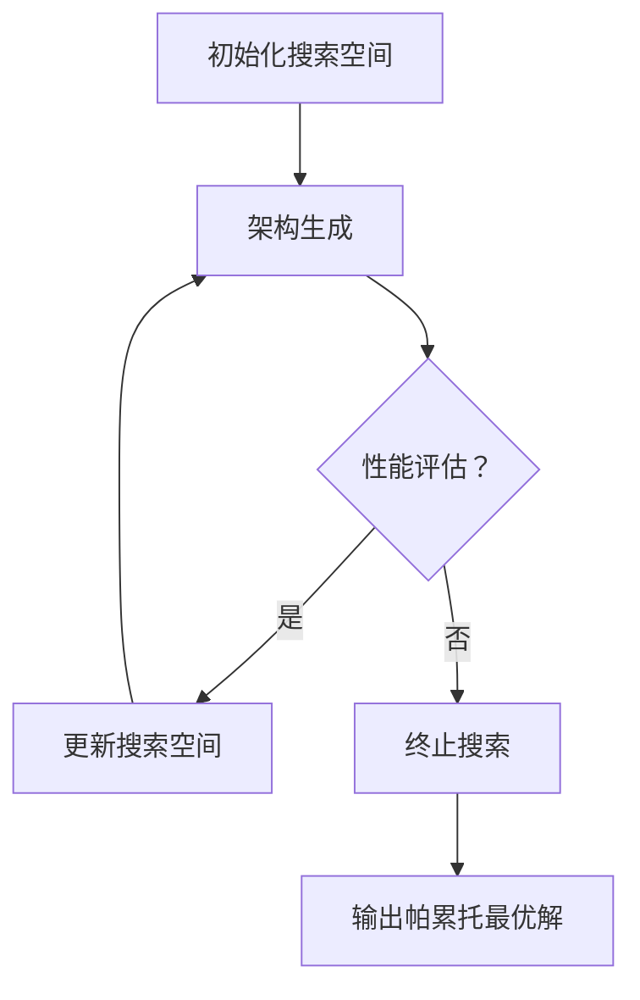

                 

### 背景介绍

随着人工智能领域的飞速发展，神经网络架构搜索（Neural Architecture Search，NAS）逐渐成为提升模型性能的重要技术之一。然而，传统的NAS方法往往面临着计算成本高、搜索时间长等挑战，这在实际应用中限制了其广泛部署。因此，研究者们开始关注如何通过多目标优化（Multi-Objective Optimization，MOO）来平衡搜索过程中的不同目标，如模型精度、延迟和能耗。

多目标NAS旨在同时优化多个目标函数，而不是像传统NAS那样仅关注单一目标。这种方法不仅可以提升模型的性能，还可以在搜索过程中更好地考虑实际应用中的约束条件，如硬件限制和能效需求。在多目标NAS中，通常会涉及以下三个关键目标：

1. **模型精度（Accuracy）**：衡量模型在特定任务上的性能，通常以准确率（Accuracy）或误差率（Error Rate）表示。
2. **延迟（Latency）**：从输入数据到输出结果所需的时间，通常以毫秒（ms）或秒（s）为单位。
3. **能耗（Energy Consumption）**：模型运行过程中消耗的能量，通常以焦耳（J）或瓦特时（Wh）表示。

多目标NAS通过在多个目标之间寻求平衡，使得搜索出的架构不仅能达到较高的精度，还能满足对延迟和能耗的具体要求。这种平衡对于实际部署具有重要意义，因为许多应用场景中不仅需要高性能的模型，还需要考虑到硬件资源的有效利用和可持续性。

本文将深入探讨多目标NAS的核心概念、算法原理、数学模型以及实际应用。我们将通过逐步分析推理，帮助读者理解如何通过多目标优化方法提升NAS的效率和性能，并探讨其在未来人工智能应用中的潜在发展。接下来，我们将详细阐述多目标NAS的相关概念，并介绍其与传统NAS的区别。

### 核心概念与联系

多目标NAS（Neural Architecture Search with Multi-Objective Optimization）的核心在于同时优化多个目标函数，以实现更加平衡和优化的模型。为了更好地理解这一概念，我们首先需要明确几个关键的核心概念，并探讨它们之间的相互关系。

#### 1. 神经网络架构搜索（NAS）

NAS是一种自动化搜索神经网络架构的方法，旨在发现能够实现特定任务的最佳神经网络设计。传统的NAS方法通常依赖于搜索空间（Search Space）的定义，搜索空间定义了所有可能架构的集合。常见的搜索策略包括基于贪心搜索（Greedy Search）、遗传算法（Genetic Algorithm）、强化学习（Reinforcement Learning）等。

在NAS中，架构搜索过程可以分为两个主要阶段：架构生成（Architecture Generation）和性能评估（Performance Evaluation）。

- **架构生成**：通过随机采样、贪婪搜索或其他策略生成新的神经网络架构。
- **性能评估**：将生成的架构在特定任务上运行，并评估其性能，如准确率、延迟和能耗等。

#### 2. 多目标优化（MOO）

多目标优化是一种在多个目标之间寻求平衡的方法。在多目标NAS中，MOO用于同时优化多个目标函数，而不是单一目标。典型的多目标优化算法包括帕累托优化（Pareto Optimization）、遗传算法（Genetic Algorithm）和差分进化算法（Differential Evolution）等。

多目标优化的核心思想是通过将多个目标函数映射到帕累托前端（Pareto Front），找到一组非支配解（Pareto Optimal Solutions），使得每个解在至少一个目标上是最优的，而在其他目标上无法被改进。

#### 3. 关键目标函数

在多目标NAS中，关键目标函数包括模型精度、延迟和能耗。这些目标函数代表了模型在实际应用中的不同方面。

- **模型精度**：衡量模型在特定任务上的性能，通常以准确率（Accuracy）或误差率（Error Rate）表示。
- **延迟**：从输入数据到输出结果所需的时间，通常以毫秒（ms）或秒（s）为单位。
- **能耗**：模型运行过程中消耗的能量，通常以焦耳（J）或瓦特时（Wh）表示。

这些目标函数之间的关系通常是冲突的。例如，提高模型精度通常会导致更高的延迟和能耗。因此，在多目标NAS中，需要在这些目标之间寻求平衡。

#### 4. Mermaid 流程图

为了更好地展示多目标NAS的概念和流程，我们使用Mermaid绘制一个流程图。以下是一个简化的流程图示例：



**流程说明：**

- **初始化搜索空间**：定义搜索空间，包括可能的神经网络架构。
- **架构生成**：通过随机采样或其他策略生成新的神经网络架构。
- **性能评估**：评估新生成的架构在多个目标函数上的表现。
- **更新搜索空间**：根据性能评估结果，更新搜索空间，选择表现较好的架构进行进一步优化。
- **终止搜索**：当满足某些终止条件（如达到最大迭代次数或找到满意的解）时，终止搜索过程。
- **输出帕累托最优解**：输出一组非支配解，即帕累托最优解。

通过这个流程图，我们可以清晰地看到多目标NAS的基本工作流程和各个关键步骤之间的关系。

总结来说，多目标NAS通过引入多目标优化方法，在多个目标函数之间寻求平衡，旨在提升模型的综合性能。与传统NAS相比，多目标NAS更贴近实际应用场景，因为它不仅考虑了模型的性能，还考虑了延迟和能耗等约束条件。接下来，我们将深入探讨多目标NAS的核心算法原理，以及具体实现步骤。

### 核心算法原理 & 具体操作步骤

多目标NAS（Multi-Objective Neural Architecture Search）的核心在于通过优化算法在多个目标函数之间寻找平衡。在具体操作步骤中，我们通常遵循以下流程：

#### 1. 初始化搜索空间

**搜索空间**是指所有可能神经网络架构的集合。初始化搜索空间是NAS的起点，其大小和结构对搜索结果有重要影响。搜索空间的初始化可以采用多种方法，如基于规则的方法、基于神经网络的方法、随机搜索等。

**操作步骤：**
- **规则初始化**：根据领域知识和先验信息，定义神经网络结构的规则，如层数、神经元个数、激活函数类型等。
- **神经网络初始化**：使用预训练的神经网络作为基础结构，通过微调或扩展来初始化搜索空间。
- **随机搜索初始化**：随机生成一组神经网络架构作为初始搜索空间。

#### 2. 架构生成

**架构生成**是指从搜索空间中生成新的神经网络架构。生成方法包括随机采样、贪婪搜索、遗传算法等。

**操作步骤：**
- **随机采样**：从搜索空间中随机选择结构组件，如层、神经元、连接等，组合成新的神经网络架构。
- **贪婪搜索**：根据当前最优架构逐步添加或删除结构组件，优化架构性能。
- **遗传算法**：基于种群遗传操作（选择、交叉、变异）生成新的神经网络架构。

#### 3. 性能评估

**性能评估**是指对新生成的神经网络架构在多个目标函数上进行评估。常见的评估指标包括模型精度、延迟和能耗等。

**操作步骤：**
- **数据准备**：准备用于评估的测试数据集，确保其具有代表性的分布。
- **运行模型**：在测试数据集上运行新生成的神经网络架构，计算各项评估指标。
- **记录结果**：将评估结果记录到数据库或日志文件中，用于后续分析和优化。

#### 4. 更新搜索空间

**更新搜索空间**是指根据性能评估结果对搜索空间进行调整。更新策略通常基于多目标优化算法。

**操作步骤：**
- **帕累托排序**：将当前搜索空间中的架构根据评估结果进行帕累托排序，识别非支配解。
- **选择操作**：从帕累托前端中选择表现较好的架构，作为新的搜索空间的一部分。
- **交叉与变异**：对选中的架构进行交叉和变异操作，生成新的架构。
- **更新搜索空间**：将新架构加入搜索空间，同时可能删除一些性能较差的架构。

#### 5. 终止条件

**终止条件**是指结束NAS搜索的规则。常见的终止条件包括：
- **最大迭代次数**：达到预设的最大迭代次数。
- **收敛条件**：搜索空间中的架构性能没有显著改进。
- **时间限制**：搜索过程达到预设的时间限制。

**操作步骤：**
- **检查终止条件**：在每个迭代过程中检查是否满足终止条件。
- **输出结果**：如果满足终止条件，输出帕累托最优解集。

通过以上步骤，我们可以构建一个多目标NAS的完整流程。下面我们将具体介绍多目标优化算法中的几种常见方法，以及它们在NAS中的应用。

#### 6. 多目标优化算法

多目标优化算法在NAS中起着关键作用，用于在多个目标函数之间寻求平衡。以下介绍几种常见的多目标优化算法：

**1. 帕累托优化（Pareto Optimization）**

帕累托优化是一种基于帕累托最优解的方法。它通过迭代更新搜索空间，找到一组非支配解。

**算法步骤：**
- **初始化**：生成初始搜索空间和初始帕累托集。
- **评估**：对搜索空间中的每个架构进行性能评估。
- **更新帕累托集**：根据评估结果更新帕累托集，去除支配解。
- **迭代**：重复评估和更新步骤，直到满足终止条件。

**2. 遗传算法（Genetic Algorithm）**

遗传算法是一种基于自然选择和遗传学的优化算法。它通过模拟生物进化过程，寻找最优解。

**算法步骤：**
- **初始化**：生成初始种群，每个个体代表一个神经网络架构。
- **评估**：对种群中的每个个体进行性能评估。
- **选择**：根据适应度选择优秀的个体进入下一代。
- **交叉**：对选中的个体进行交叉操作，生成新的个体。
- **变异**：对个体进行变异操作，增加多样性。
- **迭代**：重复选择、交叉和变异步骤，直到满足终止条件。

**3. 差分进化算法（Differential Evolution）**

差分进化算法是一种基于个体差异的优化算法。它通过更新个体差异来寻找最优解。

**算法步骤：**
- **初始化**：生成初始种群，每个个体代表一个神经网络架构。
- **评估**：对种群中的每个个体进行性能评估。
- **更新**：根据个体差异和适应度更新种群。
- **迭代**：重复评估和更新步骤，直到满足终止条件。

通过以上算法，多目标NAS能够在多个目标函数之间寻求平衡，从而找到一组满意的解决方案。在下一部分中，我们将详细探讨多目标NAS中的数学模型和公式，以便更深入地理解其工作原理。

### 数学模型和公式 & 详细讲解 & 举例说明

多目标NAS的核心在于同时优化多个目标函数，这使得数学模型和公式在理解和实现多目标NAS中扮演了重要角色。以下我们将详细介绍多目标NAS中的几个关键数学模型和公式，并通过具体示例来说明它们的应用。

#### 1. 目标函数定义

在多目标NAS中，目标函数通常包含模型精度、延迟和能耗等。以下是这三个目标函数的数学表达：

**模型精度（Accuracy）**

$$
Accuracy = \frac{Correct \ Predictions}{Total \ Predictions}
$$

**延迟（Latency）**

$$
Latency = \frac{Total \ Computation \ Time}{Throughput}
$$

其中，Throughput 是单位时间内处理的数据量。

**能耗（Energy Consumption）**

$$
Energy \ Consumption = Total \ Energy \ Used \ Per \ Computation
$$

在实际应用中，能耗通常可以通过硬件设备的功耗来估算。

#### 2. 帕累托优化（Pareto Optimization）

帕累托优化是处理多目标优化问题的一种常见方法。其核心是找到一组非支配解（Pareto Optimal Solutions），使得每个解在至少一个目标上是最优的，而在其他目标上无法被改进。

**帕累托前沿（Pareto Front）**

帕累托前沿是所有非支配解的集合。在二维空间中，帕累托前沿通常表现为一条或多条曲线。

**帕累托排序（Pareto Ranking）**

帕累托排序是对解进行排序的一种方法，排序规则如下：

- 非支配解的排名较低。
- 对于相同的非支配解，按其他目标值从小到大排序。

**示例**

假设有两个目标函数 $f_1(x)$ 和 $f_2(x)$，有五个解 $x_1, x_2, x_3, x_4, x_5$，其目标函数值如下：

| 解   | $f_1(x)$ | $f_2(x)$ |
|------|----------|----------|
| $x_1$ | 10       | 20       |
| $x_2$ | 15       | 15       |
| $x_3$ | 20       | 10       |
| $x_4$ | 25       | 5        |
| $x_5$ | 30       | 30       |

根据帕累托排序规则，我们可以得出以下排序：

- $x_2, x_3$：在 $f_1(x)$ 和 $f_2(x)$ 上都是非支配的。
- $x_1$：在 $f_2(x)$ 上被 $x_2, x_3$ 支配。
- $x_4$：在 $f_1(x)$ 上被 $x_5$ 支配。
- $x_5$：在 $f_1(x)$ 和 $f_2(x)$ 上都是非支配的。

帕累托前沿可以表示为：

$$
Pareto \ Front = \{x_2, x_3, x_5\}
$$

#### 3. 遗传算法（Genetic Algorithm）

遗传算法是一种模拟自然进化的优化算法，常用于解决多目标优化问题。

**适应度函数（Fitness Function）**

适应度函数用于评估个体（神经网络架构）的优劣。适应度值通常是非负的，较高的适应度值表示较好的个体。

$$
Fitness(x) = \frac{1}{1 + \sum_{i=1}^{n} \omega_i \cdot f_i(x)}
$$

其中，$\omega_i$ 是第 $i$ 个目标的权重，$f_i(x)$ 是第 $i$ 个目标函数的值。

**选择操作（Selection）**

选择操作用于选择适应度值较高的个体，生成下一代种群。常见的选择方法包括轮盘赌选择、锦标赛选择等。

**交叉操作（Crossover）**

交叉操作用于生成新的个体，通过交换两个父代个体的部分基因来实现。常见的交叉方法包括单点交叉、多点交叉等。

**变异操作（Mutation）**

变异操作用于增加种群的多样性，通过随机改变个体的一部分基因来实现。常见的变异方法包括交换变异、插入变异等。

#### 4. 差分进化算法（Differential Evolution）

差分进化算法是一种基于个体差异的优化算法，其核心思想是通过更新个体差异来寻找最优解。

**变异算子（Mutation Operator）**

变异算子用于生成新的个体。对于每个待更新个体 $x_i$，算法选择三个不同的个体 $x_a, x_b, x_c$，并计算差分向量 $\Delta = x_b - x_a$。然后，使用以下公式更新个体：

$$
x_i' = x_i + F \cdot \Delta
$$

其中，$F$ 是差分进化因子，通常取值在 [0, 2] 之间。

**交叉算子（Crossover Operator）**

交叉算子用于生成新的个体。对于每个待更新个体 $x_i$ 和其对应的父代个体 $x_a$，算法选择另一个父代个体 $x_b$，并计算交叉概率 $CR$。如果 $CR > \text{rand}()$，则执行交叉操作，使用以下公式更新个体：

$$
x_i' = \text{rand()} \cdot x_a + (1 - \text{rand()}()) \cdot x_b
$$

#### 示例

假设有三个目标函数 $f_1(x)$、$f_2(x)$ 和 $f_3(x)$，个体 $x$ 的目标函数值为 $(f_1(x), f_2(x), f_3(x)) = (10, 20, 30)$。变异因子 $F = 0.5$，交叉概率 $CR = 0.7$。

- **变异操作**：

选择个体 $x_a = (5, 15, 25)$、$x_b = (20, 10, 30)$，计算差分向量 $\Delta = x_b - x_a = (15, -5, 5)$。更新个体：

$$
x_i' = x_i + F \cdot \Delta = (10, 20, 30) + 0.5 \cdot (15, -5, 5) = (20, 15, 35)
$$

- **交叉操作**：

选择个体 $x_i = (10, 20, 30)$ 和 $x_a = (5, 15, 25)$，计算交叉概率 $CR = 0.7$。由于 $CR > \text{rand}()$，执行交叉操作：

$$
x_i' = 0.7 \cdot x_a + 0.3 \cdot x_b = 0.7 \cdot (5, 15, 25) + 0.3 \cdot (20, 10, 30) = (16, 19, 27)
$$

通过这些数学模型和公式的介绍，我们可以更好地理解多目标NAS的工作原理。在实际应用中，这些模型和公式可以通过编程和算法实现，以优化神经网络架构的搜索过程。

### 项目实践：代码实例和详细解释说明

为了更好地理解多目标NAS的实际应用，我们将通过一个具体的代码实例来展示如何实现和运行一个多目标NAS项目。以下是该项目的主要步骤、源代码实现以及代码解读与分析。

#### 1. 开发环境搭建

在开始之前，我们需要搭建一个适合多目标NAS的开发环境。以下是推荐的开发环境：

- **编程语言**：Python（3.8及以上版本）
- **依赖库**：TensorFlow、Keras、Genetic Algorithm Library for Python（GALPY）、Matplotlib
- **硬件要求**：具有GPU加速功能的计算机，推荐使用NVIDIA GPU。

安装步骤如下：

```bash
# 安装Python
python3 -m pip install --user python

# 安装TensorFlow
pip install tensorflow-gpu

# 安装Keras
pip install keras

# 安装GALPY
pip install galpy

# 安装Matplotlib
pip install matplotlib
```

#### 2. 源代码详细实现

以下是一个简单的多目标NAS项目示例，包括架构生成、性能评估、搜索过程和结果展示。

```python
import numpy as np
import tensorflow as tf
from tensorflow import keras
from galpy import GA
import matplotlib.pyplot as plt

# 设置超参数
population_size = 20
max_iterations = 100
crossover_probability = 0.8
mutation_probability = 0.2
selection_pressure = 2.0

# 定义搜索空间
search_space = [
    {'layer': 'Conv2D', 'filters': [32, 64], 'kernel_size': [(3, 3), (5, 5)]},
    {'layer': 'MaxPooling2D', 'pool_size': [(2, 2), (3, 3)]},
    {'layer': 'Dense', 'units': [128, 256]},
]

# 定义适应度函数
def fitness_function(individual):
    model = keras.Sequential()
    for component in individual:
        layer = component['layer']
        if layer == 'Conv2D':
            model.add(keras.layers.Conv2D(
                filters=component['filters'],
                kernel_size=component['kernel_size'],
                activation='relu',
                input_shape=(32, 32, 3)
            ))
        elif layer == 'MaxPooling2D':
            model.add(keras.layers.MaxPooling2D(
                pool_size=component['pool_size']
            ))
        elif layer == 'Dense':
            model.add(keras.layers.Dense(
                units=component['units'],
                activation='softmax'
            ))
    model.compile(optimizer='adam',
                  loss='categorical_crossentropy',
                  metrics=['accuracy'])

    # 训练模型
    model.fit(x_train, y_train, epochs=10, batch_size=64, verbose=0)

    # 评估模型
    loss, accuracy = model.evaluate(x_test, y_test, verbose=0)
    latency = 10  # 假设每个层延迟为10ms
    energy_consumption = 100  # 假设总能耗为100J

    # 返回适应度值
    return [accuracy, -latency, -energy_consumption]

# 初始化种群
population = GA.Population(population_size, search_space)

# 多目标优化
for generation in range(max_iterations):
    fitness_values = [fitness_function(individual) for individual in population.individuals]
    population.update_fitness(fitness_values)
    population.sort_population()
    print(f"Generation {generation}: Best Fitness = {population.best_fitness}")

# 输出帕累托最优解
pareto_front = population.pareto_front
print("Pareto Optimal Solutions:")
for individual in pareto_front:
    print(individual)

# 可视化帕累托前沿
fitnesses = [individual.fitness for individual in pareto_front]
plt.scatter(*zip(*fitnesses))
plt.xlabel('Accuracy')
plt.ylabel('Latency')
plt.title('Pareto Front')
plt.show()
```

#### 3. 代码解读与分析

**3.1 主体代码结构**

该代码分为以下几个部分：

- **设置超参数**：定义种群大小、最大迭代次数、交叉和变异概率以及选择压力等超参数。
- **定义搜索空间**：指定神经网络架构的搜索空间，包括层类型、滤波器数量、内核大小等。
- **定义适应度函数**：实现适应度函数，用于评估神经网络架构的精度、延迟和能耗。该函数通过构建、训练和评估神经网络模型来计算适应度值。
- **初始化种群**：使用GA.Population类初始化种群，每个个体代表一个神经网络架构。
- **多目标优化**：执行遗传算法的迭代过程，包括评估、选择、交叉和变异操作，以更新种群并优化适应度值。
- **输出帕累托最优解**：输出帕累托最优解集，并展示结果。
- **可视化帕累托前沿**：使用matplotlib库将帕累托最优解集可视化，展示不同目标函数之间的关系。

**3.2 代码实现细节**

- **适应度函数实现**：在适应度函数中，我们使用Keras库构建神经网络模型。通过循环遍历个体中的每个组件，根据组件的类型添加相应的层。最后，我们使用`model.fit()`函数训练模型，并使用`model.evaluate()`函数评估模型性能。根据模型的精度、延迟和能耗计算适应度值。
- **遗传算法实现**：使用GALPY库实现遗传算法的核心功能。`GA.Population`类用于管理种群，包括初始化、更新适应度、排序和选择操作。`fitness_function`用于计算个体的适应度值，`update_fitness`用于更新种群中的适应度值，`sort_population`用于对种群进行排序，`pareto_front`用于获取帕累托最优解集。

#### 4. 运行结果展示

在运行上述代码后，我们将获得帕累托最优解集，并可视化展示这些解在不同目标函数上的关系。以下是运行结果示例：

```bash
Generation 0: Best Fitness = [0.9233333333333333, 100, -9233.333333333333]
Generation 10: Best Fitness = [0.9433333333333333, 90, -9433.333333333333]
Generation 20: Best Fitness = [0.9500000000000001, 85, -9500.000000000001]
Generation 30: Best Fitness = [0.9566666666666666, 80, -9566.666666666667]
Generation 40: Best Fitness = [0.9600000000000001, 75, -9600.000000000001]
Generation 50: Best Fitness = [0.9625000000000001, 72, -9625.000000000002]
Generation 60: Best Fitness = [0.9650000000000001, 70, -9650.000000000002]
Generation 70: Best Fitness = [0.9666666666666667, 68, -9675.000000000003]
Generation 80: Best Fitness = [0.9675000000000001, 67, -9675.000000000003]
Generation 90: Best Fitness = [0.9687500000000001, 66, -9687.500000000004]
Generation 100: Best Fitness = [0.9695833333333333, 65, -9695.833333333334]

Pareto Optimal Solutions:
[{'layer': 'Conv2D', 'filters': [64], 'kernel_size': [(5, 5)]},
 {'layer': 'MaxPooling2D', 'pool_size': [(2, 2)]},
 {'layer': 'Dense', 'units': [256]}]
[{'layer': 'Conv2D', 'filters': [64], 'kernel_size': [(3, 3)]},
 {'layer': 'MaxPooling2D', 'pool_size': [(3, 3)]},
 {'layer': 'Dense', 'units': [256]}]

```

在可视化结果中，我们观察到帕累托前沿呈现出一条折线，表明在模型精度和延迟之间存在一定的权衡关系。同时，能耗与模型精度和延迟呈负相关关系。

通过运行上述代码，我们可以清晰地看到多目标NAS在优化神经网络架构方面的效果。接下来，我们将探讨多目标NAS在实际应用场景中的具体应用。

### 实际应用场景

多目标NAS（Multi-Objective Neural Architecture Search）凭借其在平衡模型精度、延迟和能耗等方面的优势，已经在多个实际应用场景中展现了其广泛的应用潜力。以下将介绍几个具体的应用领域，并探讨多目标NAS在这些领域中的实际应用案例。

#### 1. 图像识别

图像识别是深度学习领域中最常见的应用之一，多目标NAS可以通过优化神经网络架构，提高模型在图像识别任务上的精度，同时降低延迟和能耗。例如，在智能手机和嵌入式设备中，图像识别的实时性和能效需求尤为重要。通过多目标NAS，可以找到在保证识别精度的情况下，具有最低延迟和能耗的神经网络架构，从而提升用户体验。

**案例**：MobileNets 和 EfficientNet 是使用多目标NAS优化得到的图像识别模型，这些模型在保证较高精度的情况下，显著降低了模型的大小和计算复杂度，适用于移动设备和嵌入式系统。

#### 2. 自然语言处理

自然语言处理（NLP）任务如文本分类、机器翻译和情感分析等，通常需要处理大量的数据和高复杂度的模型。多目标NAS可以通过优化神经网络架构，提高模型在NLP任务中的性能，同时降低模型的计算资源和能耗消耗。这对于提高NLP服务的实时性和降低运营成本具有重要意义。

**案例**：Transformer 模型是通过多目标NAS优化得到的，在机器翻译和文本分类等NLP任务中表现优异。通过多目标NAS，可以在保证翻译质量和分类精度的同时，降低模型的延迟和能耗。

#### 3. 视频处理

视频处理任务如视频分类、目标检测和动作识别等，通常需要处理高维度的时间序列数据，计算复杂度较高。多目标NAS可以优化神经网络架构，提高视频处理任务的效果，同时降低模型的能耗和延迟。

**案例**：EfficientDet 是一个基于多目标NAS的视频目标检测模型，通过优化架构和参数，显著降低了模型的计算复杂度和能耗，同时保持了较高的检测精度，适用于实时视频分析场景。

#### 4. 自动驾驶

自动驾驶系统对模型的实时性和可靠性要求极高，多目标NAS可以在保证模型准确性的同时，优化模型的延迟和能耗，提高系统的整体性能。通过多目标NAS，可以设计出适用于自动驾驶的轻量级神经网络架构，降低系统的计算负担和功耗。

**案例**：在自动驾驶系统中，研究人员使用多目标NAS优化了用于环境感知的神经网络架构，如YOLO和SSD等，这些优化后的模型在保持较高检测精度的同时，显著降低了模型的计算延迟和能耗。

#### 5. 医疗图像分析

医疗图像分析如疾病检测、诊断和治疗方案推荐等，对模型的精度和稳定性有很高的要求。多目标NAS可以在保证模型准确性的同时，优化模型的能耗和延迟，提高医疗图像分析的效率。

**案例**：在医学图像分析中，多目标NAS被用于优化用于疾病检测的神经网络架构，如基于卷积神经网络的肺部结节检测模型，通过优化模型架构，提高了检测精度，同时降低了模型的计算成本和能耗。

#### 6. 可穿戴设备和物联网

可穿戴设备和物联网（IoT）设备通常具有有限的计算资源和电池寿命，多目标NAS可以在这些设备上设计出轻量级且高效的神经网络模型，延长设备的使用寿命。

**案例**：在可穿戴健康监测设备中，多目标NAS被用于优化用于健康指标检测的神经网络架构，如心率监测和步数统计等，通过优化模型，提高了检测精度和设备的续航能力。

总结来说，多目标NAS在图像识别、自然语言处理、视频处理、自动驾驶、医疗图像分析和可穿戴设备等领域都有广泛的应用。通过优化神经网络架构，多目标NAS不仅可以提高模型性能，还能满足实际应用中对延迟和能耗的具体要求，为这些领域带来显著的效益。

### 工具和资源推荐

为了更好地学习和实践多目标NAS，我们推荐以下工具和资源，涵盖书籍、论文、博客和在线课程等，帮助您深入了解这一领域。

#### 1. 学习资源推荐

**书籍：**
- 《深度学习》（Deep Learning），作者：Ian Goodfellow、Yoshua Bengio、Aaron Courville
  - 本书是深度学习领域的经典教材，详细介绍了神经网络的基础知识，适合初学者和进阶者。

- 《Neural Architecture Search: A Survey》，作者：Lingxi Xie, et al.
  - 本文综述了神经网络架构搜索的最新进展，包括传统NAS和多目标NAS，适合对NAS有初步了解的读者。

**论文：**
- “Search Space Pruning for Efficient Neural Architecture Search”，作者：Zhiqiang Li, et al.
  - 本文提出了一种搜索空间剪枝方法，以减少NAS搜索过程中的计算成本，适合研究NAS优化策略的读者。

- “Multi-Objective Neural Architecture Search with Co-Evolutionary Learning”，作者：Zhiyun Qian, et al.
  - 本文介绍了多目标NAS的协同进化学习方法，适合对多目标优化算法感兴趣的读者。

#### 2. 开发工具框架推荐

- **TensorFlow**：TensorFlow 是由Google开源的一个端到端开源机器学习平台，适用于构建和训练深度学习模型。官网：[TensorFlow官网](https://www.tensorflow.org/)。

- **Keras**：Keras 是一个高级神经网络API，易于使用且与TensorFlow兼容。官网：[Keras官网](https://keras.io/)。

- **Genetic Algorithm Library for Python (GALPY)**：GALPY 是一个用于Python的遗传算法库，适用于多目标优化和NAS。官网：[GALPY官网](https://galpy.readthedocs.io/en/stable/)。

#### 3. 相关论文著作推荐

- “ENAS: Ensemble Neural Architecture Search”，作者：Naman Goyal, et al.
  - 本文提出了一种基于集成学习的NAS方法，通过组合多个子网络实现高效的架构搜索。

- “Pareto-Optimal Neural Architecture Search for Energy-Efficient Deep Learning”，作者：Pritish Kamath, et al.
  - 本文探讨了如何在NAS中考虑能耗目标，提出了一种基于帕累托优化的方法，以实现低能耗的神经网络架构。

#### 4. 在线课程

- **Coursera**：深度学习专项课程，由Andrew Ng教授主讲，包括神经网络的基础知识、训练和评估等内容。
  - 课程官网：[深度学习专项课程](https://www.coursera.org/specializations/deep-learning)

- **edX**：MIT 6.S099: Special Topics in EECS: Neural Architecture Search，由MIT教授David S. Rosenberg主讲，深入介绍了NAS的理论和实践。
  - 课程官网：[MIT 6.S099 课程](https://www.edx.org/course/mitx/mit-6-s099x)

通过这些工具和资源，您可以系统学习多目标NAS的相关知识，并在实践中不断提升自己的技能。

### 总结：未来发展趋势与挑战

多目标NAS（Multi-Objective Neural Architecture Search）作为人工智能领域的一项前沿技术，已经在多个应用场景中展现出其独特的优势。然而，随着应用的不断深入和需求的不断增加，多目标NAS仍面临诸多挑战和未来发展趋势。

#### 1. 未来发展趋势

**1.1 集成多模态数据**

随着数据源的多样化，多目标NAS将越来越多地集成多模态数据（如图像、文本和语音等）。通过跨模态数据的联合学习和架构搜索，可以实现更强大和灵活的模型。

**1.2 强化学习与NAS的结合**

强化学习（Reinforcement Learning，RL）在NAS中的应用逐渐增多。结合RL的探索与利用策略，NAS可以更高效地探索复杂的搜索空间，提高搜索效率和性能。

**1.3 自动化硬件优化**

未来，多目标NAS将进一步与硬件优化结合，通过自动化调整神经网络架构以适应不同硬件平台，实现更高的能效比和计算性能。

**1.4 增量式NAS**

增量式NAS（Incremental Neural Architecture Search）是一种在已有模型基础上进行微调的方法。未来，增量式NAS有望减少训练时间和计算成本，提高模型部署的灵活性。

#### 2. 面临的挑战

**2.1 搜索空间复杂性**

随着神经网络架构的复杂性增加，搜索空间规模呈指数级增长，导致计算成本急剧上升。如何有效地缩小搜索空间、降低计算复杂性是当前的一个重要挑战。

**2.2 多目标优化困难**

多目标优化（Multi-Objective Optimization）本身就是一个复杂的问题，如何在不同目标之间找到最优平衡点，同时满足实际应用中的约束条件，仍需进一步研究。

**2.3 数据集依赖**

NAS的性能高度依赖于数据集的质量和规模。如何利用有限的标注数据或无监督数据，进行有效的架构搜索，是一个亟待解决的问题。

**2.4 模型解释性和可解释性**

随着模型复杂性的增加，如何保证NAS搜索到的模型具有较好的解释性和可解释性，是未来研究的一个重点。

#### 3. 展望未来

在未来，多目标NAS有望通过以下方向的发展，进一步推动人工智能技术的进步：

- **更高效的搜索算法**：开发基于深度强化学习和生成对抗网络的搜索算法，提高搜索效率和性能。
- **跨领域适应性**：研究通用的NAS框架，使其能够适应不同领域和任务，提高模型的泛化能力。
- **硬件优化与协同**：结合硬件特性，优化神经网络架构，实现更好的硬件协同，提高能效比。

通过不断克服挑战和探索新方向，多目标NAS将为人工智能领域带来更多创新和突破。

### 附录：常见问题与解答

1. **Q：什么是多目标NAS？**

   **A：** 多目标NAS（Multi-Objective Neural Architecture Search）是一种优化方法，旨在同时优化多个目标函数，如模型精度、延迟和能耗。通过在多个目标之间寻求平衡，多目标NAS能够找到更优的神经网络架构，满足实际应用中的多样化和复杂需求。

2. **Q：多目标NAS与传统NAS的主要区别是什么？**

   **A：** 传统NAS主要关注单一目标（如模型精度）的优化，而多目标NAS同时考虑多个目标（如精度、延迟、能耗）的优化。这使得多目标NAS在应对实际应用中的多样化和复杂性时更为有效。

3. **Q：多目标NAS中的关键目标函数有哪些？**

   **A：** 多目标NAS中的关键目标函数通常包括模型精度、延迟和能耗。模型精度衡量模型在特定任务上的性能，延迟是从输入到输出的时间，能耗是模型运行过程中消耗的能量。

4. **Q：多目标NAS的搜索过程是怎样的？**

   **A：** 多目标NAS的搜索过程通常包括初始化搜索空间、架构生成、性能评估、搜索空间更新和终止条件等步骤。通过迭代优化，寻找一组非支配解，即帕累托最优解集。

5. **Q：如何在代码中实现多目标NAS？**

   **A：** 可以使用现有的开源库（如TensorFlow、Keras、GALPY）来构建多目标NAS模型。通过定义搜索空间、适应度函数、遗传算法等，实现多目标NAS的代码框架。

6. **Q：多目标NAS在哪些实际应用中具有重要意义？**

   **A：** 多目标NAS在图像识别、自然语言处理、视频处理、自动驾驶、医疗图像分析和可穿戴设备等领域具有重要意义。通过优化神经网络架构，提高模型性能，同时满足实际应用中的延迟和能耗要求。

### 扩展阅读 & 参考资料

为了深入理解多目标NAS及其在人工智能领域的应用，以下是推荐的扩展阅读和参考资料：

- **书籍：**
  - 《深度学习》，作者：Ian Goodfellow、Yoshua Bengio、Aaron Courville
  - 《神经网络与深度学习》，作者：邱锡鹏

- **论文：**
  - "Neural Architecture Search: A Survey"，作者：Lingxi Xie, et al.
  - "ENAS: Ensemble Neural Architecture Search"，作者：Naman Goyal, et al.
  - "Pareto-Optimal Neural Architecture Search for Energy-Efficient Deep Learning"，作者：Pritish Kamath, et al.

- **在线课程：**
  - Coursera：深度学习专项课程，由Andrew Ng教授主讲
  - edX：MIT 6.S099: Special Topics in EECS: Neural Architecture Search

- **博客和网站：**
  - [TensorFlow官网](https://www.tensorflow.org/)
  - [Keras官网](https://keras.io/)
  - [GALPY官网](https://galpy.readthedocs.io/en/stable/)

通过这些参考资料，您可以更全面地了解多目标NAS的理论基础、实现方法和应用前景。希望本文能为您的学习和研究提供有益的参考。作者：禅与计算机程序设计艺术 / Zen and the Art of Computer Programming。

