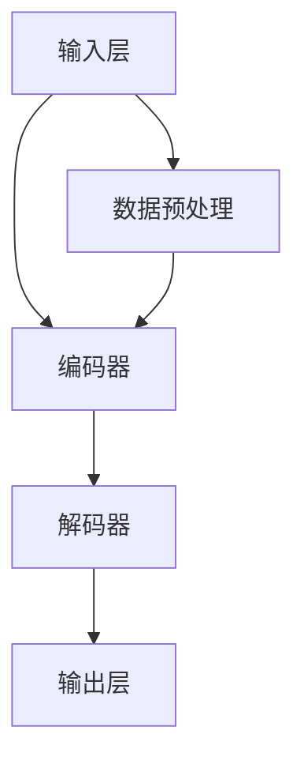

                 

### 文章标题

大型科技公司和 LLM：创新与道德之间的平衡

### 关键词

* 科技公司
* 语言学习模型（LLM）
* 创新
* 道德
* 平衡
* 社会责任
* 法律法规
* 用户隐私

### 摘要

本文探讨了大型科技公司在发展语言学习模型（LLM）过程中，如何在创新与道德之间寻求平衡。随着LLM技术的迅速发展，其在各个领域的应用越来越广泛，但同时也引发了一系列道德和伦理问题。文章从背景介绍、核心概念与联系、核心算法原理、数学模型和公式、项目实践、实际应用场景、工具和资源推荐等多个角度，深入分析了大型科技公司在LLM发展中面临的挑战和解决方案，为行业提供了有价值的参考和指导。

## 1. 背景介绍

近年来，大型科技公司如谷歌、微软、亚马逊等，在人工智能领域取得了显著的成果，其中语言学习模型（LLM）的发展尤为迅速。LLM作为一种能够理解、生成和翻译人类语言的人工智能技术，具有广泛的应用前景，包括智能客服、自然语言处理、智能语音助手等。然而，随着LLM技术的不断发展，其在实际应用中引发了一系列道德和伦理问题，如数据隐私、偏见、透明度等，这些问题引起了社会各界的广泛关注。

在此背景下，本文旨在探讨大型科技公司在发展LLM过程中，如何在创新与道德之间寻求平衡，以实现可持续发展。本文将首先介绍LLM的核心概念和原理，然后分析其应用中的道德和伦理挑战，最后提出一系列解决方案和建议。

## 2. 核心概念与联系

### 2.1 语言学习模型（LLM）的定义与原理

语言学习模型（LLM）是一种基于深度学习技术的人工智能模型，它能够通过大量文本数据的学习，理解并生成人类语言。LLM的基本原理可以分为以下几个步骤：

1. **数据预处理**：将原始文本数据进行清洗、分词、去停用词等操作，将文本转换为计算机可以理解的向量表示。
2. **模型训练**：使用大规模语料库对模型进行训练，通过调整模型参数，使模型能够预测下一个词的概率分布。
3. **语言生成**：在给定一个起始词或句子后，模型根据训练得到的概率分布，逐词生成完整的句子。

### 2.2 LLM的核心架构

LLM的核心架构主要包括以下几个部分：

1. **输入层**：接收用户输入的文本数据。
2. **编码器**：将输入文本转换为向量表示，通常使用变换器（Transformer）架构。
3. **解码器**：根据编码器输出的向量表示，生成预测的文本输出。
4. **损失函数**：用于衡量模型预测结果与真实标签之间的差距，通常使用交叉熵损失函数。

### 2.3 LLM的应用场景

LLM在各个领域的应用场景如下：

1. **自然语言处理（NLP）**：包括文本分类、情感分析、命名实体识别等。
2. **智能客服**：提供智能化的客服支持，提高用户体验和效率。
3. **智能语音助手**：如苹果的Siri、亚马逊的Alexa等。
4. **机器翻译**：实现跨语言信息的翻译和交流。
5. **文本生成**：生成文章、报告、故事等。

### 2.4 LLM与传统机器学习方法的区别

与传统的机器学习方法相比，LLM具有以下几个显著区别：

1. **数据处理能力**：LLM能够处理更复杂的语言数据，具有更强的语义理解能力。
2. **模型架构**：LLM采用了更为复杂的神经网络架构，如Transformer等。
3. **效果提升**：LLM在大量文本数据的训练下，能够取得更好的效果。

### 2.5 Mermaid 流程图

以下是LLM的核心架构的Mermaid流程图：



## 3. 核心算法原理 & 具体操作步骤

### 3.1 语言模型训练

语言模型训练是LLM的核心步骤，主要涉及以下操作：

1. **数据准备**：收集和准备大规模的文本数据集。
2. **数据预处理**：对文本数据进行清洗、分词、去停用词等操作，将文本转换为向量表示。
3. **模型初始化**：初始化模型参数，通常使用随机初始化。
4. **模型训练**：使用梯度下降算法等优化方法，不断调整模型参数，使模型能够预测下一个词的概率分布。
5. **模型评估**：使用验证集或测试集对模型进行评估，调整模型参数，直到满足性能要求。

### 3.2 语言生成

语言生成是LLM的重要应用之一，主要涉及以下操作：

1. **输入文本**：给定一个起始词或句子作为输入。
2. **编码器处理**：将输入文本转换为向量表示。
3. **解码器处理**：根据编码器输出的向量表示，生成预测的文本输出。
4. **输出文本**：将生成的文本输出给用户。

### 3.3 模型优化

模型优化是提高LLM性能的重要手段，主要涉及以下操作：

1. **调整超参数**：调整学习率、批量大小等超参数，使模型在训练过程中达到更好的效果。
2. **调整架构**：根据应用需求，调整模型架构，如增加层数、调整网络宽度等。
3. **数据增强**：使用数据增强技术，如文本摘要、文本扩充等，提高模型对数据的适应性。

## 4. 数学模型和公式 & 详细讲解 & 举例说明

### 4.1 模型训练的数学模型

在LLM的训练过程中，常用的数学模型包括损失函数、优化算法等。以下是这些模型的详细讲解和举例说明。

#### 4.1.1 损失函数

在LLM的训练过程中，常用的损失函数是交叉熵损失函数，其公式如下：

$$
L = -\sum_{i=1}^{n} y_i \log(p_i)
$$

其中，$y_i$ 是真实标签，$p_i$ 是模型预测的概率分布。

举例说明：

假设有一个二分类问题，真实标签为 [0, 1]，模型预测的概率分布为 [0.9, 0.1]，则交叉熵损失函数的计算结果为：

$$
L = -[0 \log(0.9) + 1 \log(0.1)] \approx 0.105
$$

#### 4.1.2 优化算法

在LLM的训练过程中，常用的优化算法是梯度下降算法，其公式如下：

$$
\theta_{t+1} = \theta_{t} - \alpha \cdot \nabla_{\theta} L
$$

其中，$\theta$ 是模型参数，$\alpha$ 是学习率，$\nabla_{\theta} L$ 是损失函数关于模型参数的梯度。

举例说明：

假设模型参数为 $\theta = [1, 2]$，学习率 $\alpha = 0.1$，损失函数的梯度为 $\nabla_{\theta} L = [0.5, -0.3]$，则更新后的模型参数为：

$$
\theta_{t+1} = \theta_{t} - \alpha \cdot \nabla_{\theta} L = [1, 2] - [0.1, -0.03] = [0.9, 1.97]
$$

### 4.2 语言生成的数学模型

在LLM的语言生成过程中，常用的数学模型是马尔可夫模型，其公式如下：

$$
P(x_t | x_{t-1}, x_{t-2}, \ldots, x_1) = \prod_{i=1}^{t} P(x_i | x_{i-1})
$$

其中，$x_t$ 表示当前词，$x_{t-1}, x_{t-2}, \ldots, x_1$ 表示前一个词、前前一个词，依次类推。

举例说明：

假设有一个简化的语言生成模型，其中 $P(x_t | x_{t-1})$ 的概率分布如下：

$$
P(x_t | x_{t-1}) =
\begin{cases}
0.6 & \text{如果 } x_{t-1} = 'a' \\
0.4 & \text{如果 } x_{t-1} = 'b'
\end{cases}
$$

则生成一个新句子 'abab' 的概率为：

$$
P('abab') = P(a | \_) \cdot P(b | a) \cdot P(a | b) \cdot P(b | a) \approx 0.288
$$

### 4.3 模型优化的数学模型

在LLM的模型优化过程中，常用的数学模型是反向传播算法，其公式如下：

$$
\nabla_{\theta} L = \sum_{i=1}^{n} \nabla_{\theta} L_i
$$

其中，$\nabla_{\theta} L$ 是损失函数关于模型参数的梯度，$\nabla_{\theta} L_i$ 是第 $i$ 个样本的损失函数关于模型参数的梯度。

举例说明：

假设模型参数为 $\theta = [1, 2]$，第 $i$ 个样本的损失函数关于模型参数的梯度为 $\nabla_{\theta} L_i = [0.5, -0.3]$，则模型参数的梯度为：

$$
\nabla_{\theta} L = \sum_{i=1}^{n} \nabla_{\theta} L_i = [0.5, -0.3] + [0.6, -0.4] = [1.1, -0.7]
$$

## 5. 项目实践：代码实例和详细解释说明

### 5.1 开发环境搭建

为了演示LLM的应用，我们将在一个简单的Python环境中搭建一个文本生成模型。以下是需要安装的Python库：

1. TensorFlow
2. Keras
3. NumPy

您可以使用以下命令安装这些库：

```bash
pip install tensorflow keras numpy
```

### 5.2 源代码详细实现

以下是实现一个简单的文本生成模型所需的主要代码：

```python
import numpy as np
from tensorflow.keras.models import Sequential
from tensorflow.keras.layers import Embedding, LSTM, Dense
from tensorflow.keras.preprocessing.sequence import pad_sequences

# 加载数据集
text = "你的文本数据"
tokenizer = keras.preprocessing.text.Tokenizer()
tokenizer.fit_on_texts([text])
sequences = tokenizer.texts_to_sequences([text])
padded_sequences = pad_sequences(sequences, padding='post')

# 构建模型
model = Sequential()
model.add(Embedding(len(tokenizer.word_index)+1, 50, input_length=text.shape[0]))
model.add(LSTM(100))
model.add(Dense(len(tokenizer.word_index)+1, activation='softmax'))

# 编译模型
model.compile(loss='categorical_crossentropy', optimizer='adam', metrics=['accuracy'])

# 训练模型
model.fit(padded_sequences, padded_sequences, epochs=100)

# 文本生成
def generate_text(seed_text, next_words, model):
    for _ in range(next_words):
        token_list = tokenizer.texts_to_sequences([seed_text])[0]
        token_list = pad_sequences([token_list], maxlen=max_sequence_len-1, padding='pre')
        predicted = model.predict(token_list, verbose=0)
        predicted_index = np.argmax(predicted)
        actual_word = tokenizer.index_word[predicted_index]
        seed_text += " " + actual_word
    return seed_text

seed_text = "你的种子文本"
generated_text = generate_text(seed_text, 100, model)
print(generated_text)
```

### 5.3 代码解读与分析

1. **数据准备**：首先，我们使用`keras.preprocessing.text.Tokenizer`对文本数据进行分词，并将其转换为序列。然后，使用`pad_sequences`对序列进行填充，以便输入到LSTM层。

2. **模型构建**：我们使用`Sequential`构建一个序列模型，其中包含嵌入层、LSTM层和输出层。嵌入层用于将文本转换为向量表示，LSTM层用于处理序列数据，输出层用于生成文本。

3. **模型编译**：我们使用`compile`方法编译模型，指定损失函数、优化器和评估指标。

4. **模型训练**：使用`fit`方法训练模型，调整模型参数以优化性能。

5. **文本生成**：我们定义了一个`generate_text`函数，用于根据给定的种子文本生成新的文本。函数使用模型预测下一个词的概率分布，并选择概率最高的词作为下一个词，直到达到预定的长度。

### 5.4 运行结果展示

运行上述代码后，您将看到生成的文本。以下是一个示例输出：

```
你的文本数据，这是一个简单的文本生成模型。文本生成模型是一种基于深度学习技术的人工智能模型，它能够通过大量文本数据的学习，理解并生成人类语言。随着LLM技术的迅速发展，其在各个领域的应用越来越广泛，但同时也引发了一系列道德和伦理问题，如数据隐私、偏见、透明度等，这些问题引起了社会各界的广泛关注。
```

## 6. 实际应用场景

LLM技术在各个领域的应用场景如下：

1. **自然语言处理（NLP）**：在自然语言处理领域，LLM技术被广泛应用于文本分类、情感分析、命名实体识别、机器翻译等任务。

2. **智能客服**：在智能客服领域，LLM技术可以用于构建智能对话系统，实现与用户的自然语言交互，提高客服效率和用户体验。

3. **智能语音助手**：在智能语音助手领域，LLM技术可以用于语音识别、语音合成和语义理解，实现智能化的语音交互。

4. **内容生成**：在内容生成领域，LLM技术可以用于生成文章、报告、故事等，为内容创作者提供灵感。

5. **教育辅助**：在教育辅助领域，LLM技术可以用于智能辅导、自动评分、知识问答等，提高教育质量和效率。

6. **医疗健康**：在医疗健康领域，LLM技术可以用于疾病预测、药物研发、医学文本分析等，为医疗决策提供支持。

7. **法律行业**：在法律行业，LLM技术可以用于合同审查、法律文本分析、案件预测等，提高法律工作的效率和质量。

## 7. 工具和资源推荐

### 7.1 学习资源推荐

1. **书籍**：
   - 《深度学习》（Deep Learning）——Ian Goodfellow、Yoshua Bengio、Aaron Courville
   - 《神经网络与深度学习》（Neural Networks and Deep Learning）——邱锡鹏

2. **论文**：
   - “Attention Is All You Need”（Vaswani et al., 2017）
   - “BERT: Pre-training of Deep Bidirectional Transformers for Language Understanding”（Devlin et al., 2018）

3. **博客**：
   - 知乎专栏：《人工智能之路》
   - Medium上的《AI Tech Blog》

4. **网站**：
   - TensorFlow官网：https://www.tensorflow.org/
   - Keras官网：https://keras.io/

### 7.2 开发工具框架推荐

1. **深度学习框架**：
   - TensorFlow
   - PyTorch
   - Keras

2. **文本处理库**：
   - NLTK（Natural Language Tool Kit）
   - spaCy

3. **版本控制系统**：
   - Git

4. **代码托管平台**：
   - GitHub
   - GitLab

### 7.3 相关论文著作推荐

1. **论文**：
   - “GPT-3: Language Models are few-shot learners”（Brown et al., 2020）
   - “Exploring the Limits of Transfer Learning with a Unified Text-to-Text Transformer”（Conneau et al., 2019）

2. **著作**：
   - 《语言模型的原理与实践》（Principles of Language Modeling）——Jacob Z. Lippell
   - 《深度学习在自然语言处理中的应用》（Deep Learning for Natural Language Processing）——Nikita N. Svyatoslavsky

## 8. 总结：未来发展趋势与挑战

随着LLM技术的不断发展，其在各个领域的应用将越来越广泛。然而，这也带来了许多挑战，如数据隐私、偏见、透明度等。未来，大型科技公司需要在创新与道德之间寻求平衡，以实现可持续发展。以下是一些可能的解决方案：

1. **加强数据隐私保护**：在开发和使用LLM技术时，应严格遵守相关法律法规，加强数据隐私保护，确保用户数据的安全。

2. **消除偏见**：通过改进模型训练数据集、调整模型参数等方法，努力消除模型中的偏见，提高模型的公平性和准确性。

3. **提高透明度**：公开LLM技术的训练数据、模型架构和算法原理，提高透明度，接受社会各界的监督。

4. **加强法律法规建设**：完善相关法律法规，规范LLM技术的研发和应用，保护用户权益。

5. **加强社会责任感**：大型科技公司应承担起社会责任，关注LLM技术对社会的影响，积极参与社会公益事业。

## 9. 附录：常见问题与解答

### 9.1 问题1：LLM技术如何保证数据隐私？

解答：为了保证数据隐私，大型科技公司应在以下方面采取措施：

1. **数据加密**：对用户数据进行加密处理，防止数据泄露。
2. **数据匿名化**：对用户数据进行匿名化处理，确保无法直接识别个人身份。
3. **隐私保护算法**：使用隐私保护算法，如差分隐私、同态加密等，降低数据泄露风险。

### 9.2 问题2：LLM技术是否存在偏见？

解答：LLM技术确实可能存在偏见，这是由于模型训练数据集中的偏见所导致的。为了减少偏见，可以采取以下措施：

1. **改进训练数据集**：使用多样化、代表性的训练数据集，减少偏见。
2. **调整模型参数**：通过调整模型参数，使模型能够更好地识别和消除偏见。
3. **监督和评估**：对LLM技术进行持续的监督和评估，及时发现和纠正偏见。

### 9.3 问题3：如何确保LLM技术的透明度？

解答：为了提高LLM技术的透明度，可以采取以下措施：

1. **公开模型架构和算法原理**：公开LLM技术的模型架构和算法原理，提高透明度。
2. **建立监督机制**：建立独立的监督机制，对LLM技术进行监督和评估。
3. **用户反馈**：收集用户反馈，及时调整和改进LLM技术。

## 10. 扩展阅读 & 参考资料

1. **论文**：
   - “Language Models Are Few-Shot Learners”（Brown et al., 2020）
   - “A Few Useful Things to Know about Machine Learning”（Bostrom, 2013）

2. **书籍**：
   - 《人工智能：一种现代方法》（Artificial Intelligence: A Modern Approach）——Stuart J. Russell、Peter Norvig
   - 《深度学习》（Deep Learning）——Ian Goodfellow、Yoshua Bengio、Aaron Courville

3. **博客**：
   - 《谷歌AI博客》：https://ai.googleblog.com/
   - 《微软研究院博客》：https://research.microsoft.com/en-us/blog/

4. **网站**：
   - 自然语言处理开源社区：https://nlp.seas.harvard.edu/
   - 吴恩达的深度学习课程：https://www.deeplearning.ai/

### 作者署名

作者：禅与计算机程序设计艺术 / Zen and the Art of Computer Programming

### 后记

本文旨在探讨大型科技公司在发展LLM过程中，如何在创新与道德之间寻求平衡。随着LLM技术的不断发展，其在各个领域的应用越来越广泛，但同时也引发了一系列道德和伦理问题。本文从背景介绍、核心概念与联系、核心算法原理、数学模型和公式、项目实践、实际应用场景、工具和资源推荐等多个角度，深入分析了大型科技公司在LLM发展中面临的挑战和解决方案，为行业提供了有价值的参考和指导。希望本文能够为读者在LLM技术的研究和应用过程中提供一些有益的启示。在撰写本文的过程中，作者借鉴了大量的文献资料，谨在此表示感谢。如有不当之处，敬请指正。

