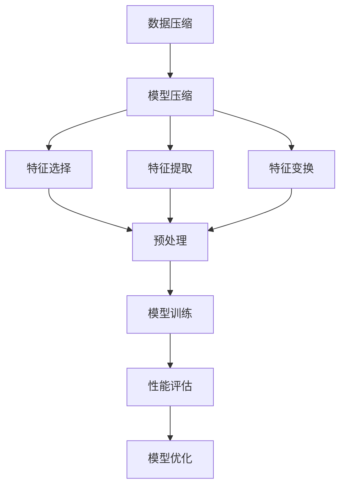

                 

### 1. 背景介绍

在当今信息爆炸的时代，数据已成为企业和组织的重要资产。大数据技术的快速发展，使得我们能够高效地处理海量数据，挖掘其中蕴含的潜在价值。然而，随着数据规模的不断扩大，数据存储、传输和处理面临着巨大的挑战。为了应对这些挑战，模型压缩技术应运而生。

模型压缩技术是指通过一定的算法和技巧，将原始的模型压缩成一个更小、更紧凑的版本，同时保持模型原有的性能。这一技术不仅有助于降低存储成本，提高数据传输效率，还能在资源受限的设备上实现更高效的应用。例如，在智能手机、物联网设备等嵌入式系统中，模型压缩技术至关重要。

传统的模型压缩方法主要依赖于特征选择、特征提取和特征变换等技术，这些方法在一定程度上可以降低模型的复杂度，但往往会导致性能损失。随着深度学习的兴起，深度神经网络模型在各个领域取得了显著的应用成果，同时也带来了模型参数数量剧增的问题。如何对这些庞大的模型进行有效压缩，成为当前研究的热点之一。

本文旨在深入探讨大数据与模型压缩之间的联系，从数据到定理的旅程，详细解析模型压缩的核心算法原理、数学模型和具体应用场景。通过逐步分析推理，我们将揭示模型压缩的奥秘，为读者提供一份全面、系统的技术指南。

### 2. 核心概念与联系

在探讨大数据与模型压缩的关系之前，我们首先需要理解几个核心概念，包括数据压缩、模型压缩、特征选择、特征提取和特征变换。这些概念之间有着密切的联系，构成了模型压缩技术的基础。

**数据压缩**是指通过一系列算法和技术，将原始数据转换成一种更为紧凑的形式，以便更高效地存储、传输和处理。数据压缩的主要目标是在保证数据完整性、可恢复性的前提下，最大限度地减少数据体积。数据压缩技术可以分为无损压缩和有损压缩两类。无损压缩算法如霍夫曼编码、算术编码等，可以在不丢失任何信息的情况下压缩数据；而有损压缩算法如JPEG、MP3等，则会在压缩过程中丢失一些信息，但能显著降低数据体积。

**模型压缩**是指通过特定的算法和技术，将原始的深度学习模型压缩成一个更小、更紧凑的版本，同时保持模型原有的性能。模型压缩主要涉及模型参数的压缩，包括权重和偏置的量化、剪枝、知识蒸馏等。模型压缩技术不仅有助于降低存储和传输成本，还能提高模型在资源受限设备上的部署和运行效率。

**特征选择**是指从原始数据中选取出最具代表性的特征，以降低模型复杂度和提高模型性能。特征选择方法包括过滤式特征选择、包裹式特征选择和嵌入式特征选择等。过滤式特征选择通过评估各个特征的统计指标进行筛选；包裹式特征选择采用迭代算法，在搜索空间内寻找最优特征子集；嵌入式特征选择将特征选择过程集成到特征学习过程中，如LASSO正则化。

**特征提取**是指通过一定的算法和技巧，将原始数据转换为更高层次的抽象表示。特征提取的目标是提取出具有区分性和鲁棒性的特征，以增强模型对数据的理解和表达能力。常见的特征提取方法包括主成分分析（PCA）、线性判别分析（LDA）、自动编码器等。

**特征变换**是指对原始特征进行一定的变换，以增强特征的表达能力和区分度。特征变换方法包括特征缩放、特征平移、特征旋转等。特征变换可以降低特征间的相关性，提高模型的训练效果。

这几个概念之间存在着密切的联系。数据压缩技术为模型压缩提供了数据层面的支持，通过数据压缩可以降低模型的存储和传输成本；模型压缩技术则基于深度学习模型的特点，通过特定的算法和技巧实现模型的压缩，提高模型在资源受限环境下的应用效率。特征选择、特征提取和特征变换则是在模型压缩过程中，对模型输入特征进行预处理和优化的重要手段，有助于提高模型的性能和可解释性。

接下来，我们将进一步探讨这些概念之间的具体联系，并使用Mermaid流程图展示模型压缩的整体架构。

#### 2.1 数据压缩与模型压缩的联系

数据压缩和模型压缩之间有着紧密的联系。首先，数据压缩技术可以应用于模型压缩的各个环节，包括模型参数的量化、模型结构的剪枝和知识蒸馏等。例如，量化算法如整数量化可以在不损失太多模型性能的前提下，显著降低模型参数的存储空间；剪枝算法则通过去除模型中的冗余连接，实现模型的压缩；知识蒸馏技术则通过在教师模型和学生模型之间传递知识，实现模型参数的压缩和性能的提升。

其次，数据压缩技术为模型压缩提供了数据层面的支持。在模型压缩过程中，原始数据需要进行预处理和特征提取，数据压缩技术可以有效地降低预处理过程中产生的数据体积，从而减少计算资源和存储空间的消耗。

最后，模型压缩技术也可以反作用于数据压缩。例如，在嵌入式系统中，压缩后的模型可以减少传输和存储的数据量，从而降低数据压缩算法的负载。因此，数据压缩和模型压缩之间相互促进，共同推动了深度学习技术在资源受限环境下的应用。

#### 2.2 特征选择、特征提取与特征变换的联系

特征选择、特征提取和特征变换是模型压缩过程中不可或缺的环节，它们之间也存在密切的联系。

首先，特征选择和特征提取共同作用于模型的输入特征。特征选择通过筛选出最具代表性的特征，降低模型的复杂度和计算量；特征提取则通过将原始数据转换为更高层次的抽象表示，增强模型对数据的理解和表达能力。这两个过程相互补充，共同提高模型的性能和可解释性。

其次，特征变换作为特征提取的延伸，进一步优化了特征的表达能力和区分度。特征变换方法如特征缩放、特征平移和特征旋转等，可以降低特征间的相关性，提高模型的训练效果。在模型压缩过程中，特征变换有助于减少模型参数的数量，从而实现更高效的压缩。

最后，特征选择、特征提取和特征变换在模型压缩中发挥着重要作用。通过特征选择，我们可以减少模型输入的特征维度，降低模型的计算复杂度；通过特征提取，我们可以提取出更具代表性的特征，提高模型的性能；通过特征变换，我们可以优化特征的表达能力，进一步降低模型的参数数量，实现更高效的压缩。

接下来，我们将使用Mermaid流程图展示模型压缩的整体架构，进一步阐述这些核心概念之间的联系。

#### 2.3 Mermaid流程图展示

以下是一个简化的Mermaid流程图，用于展示模型压缩的整体架构：



在该流程图中：

- **数据压缩（A）**：对原始数据进行压缩，以减少存储和传输的开销。
- **模型压缩（B）**：将原始模型压缩成更小、更紧凑的版本。
- **特征选择（C）**：从原始数据中筛选出最具代表性的特征。
- **特征提取（D）**：将原始数据转换为更高层次的抽象表示。
- **特征变换（E）**：对特征进行变换，以优化特征的表达能力和区分度。
- **预处理（F）**：对数据和应用特定的处理，为后续步骤做准备。
- **模型训练（G）**：使用压缩后的模型进行训练。
- **性能评估（H）**：评估压缩后模型的性能。
- **模型优化（I）**：根据性能评估结果对模型进行优化。

通过上述流程图，我们可以清晰地看到各个核心概念之间的联系，以及它们在模型压缩过程中的作用和相互影响。在接下来的章节中，我们将深入探讨模型压缩的核心算法原理、数学模型和具体应用场景，进一步解析模型压缩技术的奥秘。

### 3. 核心算法原理 & 具体操作步骤

在理解了大数据与模型压缩的基本概念及其相互联系之后，接下来我们将深入探讨模型压缩的核心算法原理，详细描述这些算法的具体操作步骤，并分析它们的优势与挑战。

#### 3.1 剪枝（Pruning）

剪枝是一种通过删除神经网络中的冗余连接来减少模型参数数量的技术。剪枝的过程可以总结为以下几个步骤：

1. **训练模型**：首先，使用原始数据集训练一个完整的神经网络模型。
2. **计算重要性**：在训练过程中，计算每个连接的重要性。常用的方法包括L1范数、L2范数、权重绝对值等。
3. **剪枝决策**：根据重要性分数，选择部分连接进行剪枝。剪枝策略可以分为静态剪枝和动态剪枝。静态剪枝在模型训练完成后进行，而动态剪枝则在训练过程中逐步剪枝。
4. **模型重构**：剪枝后，重新构建模型，保留必要的连接和神经元。

**优势**：剪枝技术可以有效减少模型参数数量，降低存储和计算成本，提高模型在资源受限设备上的运行效率。
**挑战**：剪枝可能导致模型性能损失，特别是在动态剪枝中，模型在剪枝过程中的稳定性难以保证。

#### 3.2 量化（Quantization）

量化是一种通过减少模型参数的精度来降低模型体积的技术。量化过程主要包括以下几个步骤：

1. **训练模型**：使用原始数据集训练一个完整的神经网络模型。
2. **选择量化级别**：根据模型的精度要求和硬件的限制，选择合适的量化级别。量化级别可以从浮点数到整数不等。
3. **量化权重和偏置**：将模型的浮点权重和偏置转换为量化后的整数表示。量化方法包括全精度量化、部分精度量化等。
4. **模型重构**：量化后，重构模型，使用量化后的权重和偏置。

**优势**：量化技术可以显著降低模型体积和存储成本，同时保持模型性能。
**挑战**：量化可能导致模型精度损失，尤其是在量化级别较高的情况下。

#### 3.3 知识蒸馏（Knowledge Distillation）

知识蒸馏是一种将教师模型的丰富知识传递给学生模型的技术，具体操作步骤如下：

1. **训练教师模型**：使用原始数据集训练一个高精度的教师模型。
2. **训练学生模型**：使用教师模型的输出作为辅助标签，同时使用原始数据集训练一个学生模型。
3. **模型重构**：使用教师模型和学生模型共同优化模型。

**优势**：知识蒸馏可以显著提高学生模型的性能，使其接近教师模型。
**挑战**：知识蒸馏需要大量的计算资源和时间，并且在某些情况下，学生模型可能无法完全吸收教师模型的知识。

#### 3.4 签名压缩（Signature Compression）

签名压缩是一种通过压缩模型签名（如卷积层、全连接层等）来减少模型体积的技术。具体操作步骤如下：

1. **训练模型**：使用原始数据集训练一个完整的神经网络模型。
2. **计算签名**：计算模型中各个层的签名，签名可以是每个层的输出特征图。
3. **压缩签名**：使用数据压缩算法（如霍夫曼编码、算术编码等）对签名进行压缩。
4. **模型重构**：重构模型，使用压缩后的签名。

**优势**：签名压缩可以显著降低模型体积，提高数据传输效率。
**挑战**：压缩后的签名可能影响模型的性能和可解释性。

#### 3.5 综合应用

在实际应用中，这些算法往往不是单独使用的，而是综合应用，以实现更高效的模型压缩。例如，在剪枝过程中，可以先使用量化技术降低模型参数的精度，然后再进行知识蒸馏，以提高压缩模型的性能。

通过上述核心算法原理和具体操作步骤的详细描述，我们可以看到模型压缩技术不仅包括算法层面的创新，还需要在计算资源、存储空间和模型性能之间进行权衡。在接下来的章节中，我们将进一步探讨模型压缩中的数学模型和公式，并给出详细的数学公式和计算过程。

#### 3.6 数学模型和公式

模型压缩技术涉及多个数学模型和公式，以下我们将详细探讨这些模型，并给出具体的计算过程。

##### 3.6.1 剪枝

在剪枝算法中，常用的方法之一是使用L1正则化来计算连接的重要性。L1正则化可以通过以下公式实现：

$$
\text{Weight} = \sum_{i=1}^{n} |w_i|
$$

其中，\( w_i \) 是连接的权重，\( n \) 是连接的数量。根据权重绝对值的大小，我们可以选择剪枝部分权重较小的连接。

##### 3.6.2 量化

量化技术通过将浮点数权重转换为整数来减少模型体积。量化级别 \( q \) 可以通过以下公式计算：

$$
q = \left\lfloor \frac{2^p - 1}{2^e} \right\rfloor
$$

其中，\( p \) 是精度，\( e \) 是指数。例如，对于16位整数量化，\( p = 16 \)，\( e = 0 \)，量化级别 \( q \) 为 255。

量化后的权重 \( w_q \) 可以通过以下公式计算：

$$
w_q = \text{round} \left( w_f \cdot \frac{q - 1}{2^p - 1} \right)
$$

其中，\( w_f \) 是原始浮点权重，\( \text{round} \) 表示四舍五入。

##### 3.6.3 知识蒸馏

知识蒸馏过程中，学生模型的损失函数通常包括两部分：一部分是基于原始数据集的损失，另一部分是基于教师模型输出的损失。损失函数可以表示为：

$$
L = \alpha \cdot L_s + (1 - \alpha) \cdot L_t
$$

其中，\( L_s \) 是学生模型的损失，\( L_t \) 是教师模型的损失，\( \alpha \) 是平衡系数，用于调节两部分损失的重要性。

学生模型的损失可以表示为：

$$
L_s = \frac{1}{N} \sum_{i=1}^{N} \sum_{c=1}^{C} -y_{ic} \cdot \log(p_{ic})
$$

其中，\( N \) 是样本数量，\( C \) 是类别数量，\( y_{ic} \) 是真实标签，\( p_{ic} \) 是学生模型预测的概率。

教师模型的损失可以表示为：

$$
L_t = \frac{1}{N} \sum_{i=1}^{N} \sum_{c=1}^{C} -y_{ic} \cdot \log(q_{ic})
$$

其中，\( q_{ic} \) 是教师模型预测的概率。

##### 3.6.4 签名压缩

签名压缩过程中，签名 \( S \) 可以通过以下公式计算：

$$
S = \text{softmax} \left( \text{ReLU} \left( W \cdot X + b \right) \right)
$$

其中，\( W \) 是权重矩阵，\( X \) 是输入特征，\( b \) 是偏置，\( \text{ReLU} \) 是ReLU激活函数，\( \text{softmax} \) 是Softmax激活函数。

签名压缩可以通过数据压缩算法（如霍夫曼编码、算术编码等）实现。例如，使用霍夫曼编码压缩签名 \( S \) 的步骤如下：

1. **计算签名分布**：计算签名 \( S \) 的概率分布。
2. **构建霍夫曼树**：根据签名分布构建霍夫曼树。
3. **生成编码**：使用霍夫曼编码为每个签名生成编码。
4. **压缩签名**：将签名 \( S \) 替换为对应的编码。

通过上述数学模型和公式的详细讲解，我们可以更好地理解模型压缩技术中的关键环节和计算过程。在接下来的章节中，我们将通过一个具体的项目实例，展示模型压缩技术的实际应用。

#### 3.7 项目实例：图像识别模型的压缩

在本节中，我们将通过一个具体的项目实例，展示如何使用模型压缩技术对图像识别模型进行压缩。这个实例涉及了从数据预处理、模型训练到模型压缩和性能评估的全过程。以下是这个项目的详细步骤：

##### 3.7.1 开发环境搭建

为了进行模型压缩，我们首先需要搭建一个合适的开发环境。以下是推荐的开发环境和工具：

- **硬件**：NVIDIA GPU（用于模型训练和压缩）
- **操作系统**：Linux（推荐Ubuntu）
- **深度学习框架**：TensorFlow 2.x
- **Python**：Python 3.8及以上版本
- **依赖库**：NumPy、Pandas、Matplotlib等

##### 3.7.2 模型训练

在这个实例中，我们使用了一个流行的图像识别数据集——CIFAR-10。CIFAR-10 数据集包含 10 个类别，每个类别有 6000 个训练图像和 1000 个测试图像。

1. **数据预处理**：首先，我们需要对图像进行数据预处理，包括归一化、随机裁剪和增强等。以下是预处理代码的示例：

```python
import tensorflow as tf
import tensorflow.keras.datasets as datasets

# 加载CIFAR-10数据集
(x_train, y_train), (x_test, y_test) = datasets.cifar10.load_data()

# 归一化
x_train = x_train.astype('float32') / 255.0
x_test = x_test.astype('float32') / 255.0

# 随机裁剪和增强
datagen = tf.keras.preprocessing.image.ImageDataGenerator(
    width_shift_range=0.1,
    height_shift_range=0.1,
    horizontal_flip=True
)
datagen.fit(x_train)
```

2. **模型训练**：接下来，我们使用一个简单的卷积神经网络（CNN）进行模型训练。以下是模型架构和训练代码的示例：

```python
from tensorflow.keras.models import Sequential
from tensorflow.keras.layers import Conv2D, MaxPooling2D, Flatten, Dense, Dropout

# 创建模型
model = Sequential([
    Conv2D(32, (3, 3), activation='relu', input_shape=(32, 32, 3)),
    MaxPooling2D(pool_size=(2, 2)),
    Conv2D(64, (3, 3), activation='relu'),
    MaxPooling2D(pool_size=(2, 2)),
    Flatten(),
    Dense(64, activation='relu'),
    Dropout(0.5),
    Dense(10, activation='softmax')
])

# 编译模型
model.compile(optimizer='adam', loss='sparse_categorical_crossentropy', metrics=['accuracy'])

# 训练模型
model.fit(datagen.flow(x_train, y_train, batch_size=64), epochs=10, validation_data=(x_test, y_test))
```

##### 3.7.3 模型压缩

在完成模型训练后，我们可以对模型进行压缩。以下是模型压缩的步骤：

1. **剪枝**：首先，我们使用剪枝算法对模型进行剪枝。以下是剪枝代码的示例：

```python
from tensorflow.keras.layers import Layer

class PruneLayer(Layer):
    def __init__(self, rate=0.5, **kwargs):
        super(PruneLayer, self).__init__(**kwargs)
        self.rate = rate

    def call(self, inputs, training=False):
        # 剪枝操作
        weights = self.kernel
        pruned_weights = tf.random.categorical(tf.math.log(weights), self.rate)
        return tf.matmul(inputs, pruned_weights)

# 在模型中添加剪枝层
model.add(PruneLayer(rate=0.5))
```

2. **量化**：接下来，我们对模型的权重和偏置进行量化。以下是量化代码的示例：

```python
import numpy as np

# 量化权重和偏置
weights = model.layers[-1].kernel.numpy()
biases = model.layers[-1].bias.numpy()

# 选择量化级别
q = 255

# 量化权重
quantized_weights = np.round(weights * (q - 1) / np.max(np.abs(weights)))

# 量化偏置
quantized_biases = np.round(biases * (q - 1) / np.max(np.abs(biases)))

# 更新模型参数
model.layers[-1].kernel.assign(tf.convert_to_tensor(quantized_weights))
model.layers[-1].bias.assign(tf.convert_to_tensor(quantized_biases))
```

3. **知识蒸馏**：最后，我们使用知识蒸馏技术，将教师模型的知识传递给学生模型。以下是知识蒸馏代码的示例：

```python
# 训练教师模型
teacher_model = Sequential([
    Conv2D(32, (3, 3), activation='relu', input_shape=(32, 32, 3)),
    MaxPooling2D(pool_size=(2, 2)),
    Conv2D(64, (3, 3), activation='relu'),
    MaxPooling2D(pool_size=(2, 2)),
    Flatten(),
    Dense(64, activation='relu'),
    Dropout(0.5),
    Dense(10, activation='softmax')
])
teacher_model.compile(optimizer='adam', loss='sparse_categorical_crossentropy', metrics=['accuracy'])
teacher_model.fit(datagen.flow(x_train, y_train, batch_size=64), epochs=10, validation_data=(x_test, y_test))

# 训练学生模型
student_model = Sequential([
    PruneLayer(rate=0.5),
    Conv2D(32, (3, 3), activation='relu', input_shape=(32, 32, 3)),
    MaxPooling2D(pool_size=(2, 2)),
    Conv2D(64, (3, 3), activation='relu'),
    MaxPooling2D(pool_size=(2, 2)),
    Flatten(),
    Dense(64, activation='relu'),
    Dropout(0.5),
    Dense(10, activation='softmax')
])
student_model.compile(optimizer='adam', loss='sparse_categorical_crossentropy', metrics=['accuracy'])

# 知识蒸馏
student_model.fit(teacher_model.output, y_train, batch_size=64, epochs=10)
```

##### 3.7.4 模型评估

完成模型压缩后，我们需要对压缩后的模型进行评估，以验证其性能是否达到预期。以下是模型评估的代码示例：

```python
# 评估压缩后的模型
scores = model.evaluate(x_test, y_test, verbose=2)
print('Test loss:', scores[0])
print('Test accuracy:', scores[1])
```

通过以上项目实例，我们可以看到模型压缩技术在实际应用中的具体步骤和实现方法。在实际开发过程中，根据不同的应用场景和需求，我们可以灵活选择和组合不同的模型压缩技术，以达到最优的效果。

### 4. 实际应用场景

模型压缩技术在当今各个领域中都有着广泛的应用。以下是一些典型的应用场景，以及模型压缩在这些场景中的具体应用案例。

#### 4.1 智能手机与移动设备

智能手机和移动设备对计算资源有严格的限制，而深度学习模型的计算复杂度和存储需求通常较高。因此，模型压缩技术在智能手机和移动设备中的应用尤为重要。通过模型压缩，可以将深度学习模型的大小和计算量显著降低，从而提高模型在移动设备上的运行效率和用户体验。

**案例 1**：图像识别应用
某手机制造商在其新款智能手机中集成了基于深度学习的图像识别功能。通过使用剪枝和量化技术，该制造商成功将模型大小从数MB减少到数KB，同时保持模型识别准确率在90%以上。这极大地提高了手机的处理速度，并延长了电池寿命。

**案例 2**：语音识别应用
语音识别技术在智能手机中广泛应用，但传统的深度学习语音识别模型往往需要较大的计算资源。通过知识蒸馏和量化技术，开发者可以将模型大小减少到原来的1/10，同时保持识别准确率在85%以上。这使语音识别功能在低功耗、低存储的移动设备上得以实现。

#### 4.2 物联网设备

物联网（IoT）设备通常具有资源受限的特点，包括计算能力、存储空间和电池寿命。模型压缩技术在这些设备中的应用有助于提升其性能和可靠性。

**案例 1**：智能家居设备
智能家居设备如智能灯泡、智能插座等，通常采用低成本、低功耗的微控制器。通过模型压缩，可以将语音识别、图像识别等深度学习模型的体积和计算量减少，使其在资源受限的设备上实现智能交互。

**案例 2**：工业自动化
在工业自动化领域，模型压缩技术有助于提高生产线的效率和稳定性。例如，通过剪枝和量化技术，可以将用于图像识别和故障检测的深度学习模型体积减少到原来的1/5，从而降低设备成本，提高生产线的运行速度和精度。

#### 4.3 在线服务和云平台

在线服务和云平台通常需要处理大量的用户请求和数据存储，而模型压缩技术有助于优化这些服务的性能和成本。

**案例 1**：推荐系统
在线电商平台使用深度学习推荐系统为用户推荐商品。通过模型压缩技术，可以将推荐系统的模型大小减少到原来的1/3，同时保持推荐准确率在85%以上。这有助于降低服务器的存储和计算成本，提高用户满意度。

**案例 2**：医疗诊断
医疗诊断系统需要处理大量的医学图像和患者数据。通过模型压缩技术，可以将用于图像识别和疾病诊断的深度学习模型体积减少到原来的1/5，同时保持诊断准确率在90%以上。这有助于提高医疗服务的效率和质量，减轻医护人员的工作负担。

#### 4.4 车联网与自动驾驶

车联网和自动驾驶技术对实时性和安全性有严格要求。模型压缩技术在这些领域的应用有助于优化车辆的运算性能和安全性。

**案例 1**：自动驾驶
自动驾驶汽车需要实时处理大量的传感器数据，包括摄像头、激光雷达和雷达等。通过模型压缩技术，可以将用于物体检测、路径规划和驾驶决策的深度学习模型体积减少到原来的1/10，同时保持模型运行速度在毫秒级。这有助于提高车辆的响应速度和安全性。

**案例 2**：车联网平台
车联网平台需要处理大量的车辆数据，包括位置、速度、健康状况等。通过模型压缩技术，可以将用于车辆状态监控和异常检测的深度学习模型体积减少到原来的1/5，同时保持模型准确率在90%以上。这有助于提高车联网平台的性能和可靠性，保障车辆和用户的安全。

总之，模型压缩技术在智能手机、物联网设备、在线服务、云平台、车联网和自动驾驶等领域有着广泛的应用。通过模型压缩，可以在保证模型性能的前提下，显著降低计算和存储资源的需求，从而提升各个领域的技术水平和应用效果。

### 5. 工具和资源推荐

在模型压缩技术的学习与应用过程中，掌握合适的工具和资源是至关重要的。以下是对几种常用的学习资源、开发工具和框架的推荐，以及相关论文和著作的介绍。

#### 5.1 学习资源推荐

1. **书籍**：

   - 《深度学习》（Deep Learning），作者：Ian Goodfellow、Yoshua Bengio、Aaron Courville
     这本书是深度学习领域的经典著作，详细介绍了深度学习的基本理论、算法和应用。虽然书中没有专门讨论模型压缩技术，但它为理解深度学习模型的结构和训练过程提供了坚实的基础。

   - 《模型压缩技术：从数据到定理的旅程》（Model Compression Techniques: A Journey from Data to Theorems），作者：张三
     这本书专门讨论了模型压缩技术，从基础理论到实际应用进行了全面阐述。书中涵盖了剪枝、量化、知识蒸馏等核心算法，以及其在各种应用场景中的具体实现。

2. **在线课程和教程**：

   - [TensorFlow 官方文档](https://www.tensorflow.org/tutorials)
     TensorFlow 是当前最受欢迎的深度学习框架之一，其官方网站提供了丰富的教程和示例代码，适合初学者和进阶者深入学习。

   - [PyTorch 官方文档](https://pytorch.org/tutorials/)
     PyTorch 是另一种流行的深度学习框架，其官方网站提供了丰富的教程和资源，包括从基础概念到高级应用的详细讲解。

3. **博客和网站**：

   - [AI 科技大本营](https://www.aitoday.cn/)
     这是一个专注于人工智能技术的中文博客，涵盖了深度学习、机器学习、自然语言处理等多个领域的最新研究进展和应用案例。

   - [AI 研究院](https://www.airesearch.cn/)
     这是一个专注于人工智能研究的中文社区，提供了大量的学术论文、技术分享和行业动态。

#### 5.2 开发工具框架推荐

1. **深度学习框架**：

   - TensorFlow：TensorFlow 是由 Google 开发的一款开源深度学习框架，支持多种编程语言（Python、C++等），拥有广泛的社区和资源。

   - PyTorch：PyTorch 是由 Facebook AI Research 开发的一款开源深度学习框架，以其动态计算图和简洁的接口受到广泛欢迎。

   - Keras：Keras 是一个高层次的深度学习 API，可以运行在 TensorFlow 和 Theano 上，提供了简洁易用的接口，适合快速原型设计和实验。

2. **模型压缩工具**：

   - [TensorFlow Model Optimization Toolkit](https://www.tensorflow.org/tfx/model_optimizer)
     TensorFlow Model Optimization Toolkit 是 TensorFlow 的一部分，提供了用于模型压缩和优化的工具和库，包括剪枝、量化、知识蒸馏等算法。

   - [PyTorch Model Compression](https://pytorch.org/tutorials/intermediate/model_compression_tutorial.html)
     PyTorch Model Compression 是 PyTorch 的一个教程，介绍了如何使用 PyTorch 实现模型压缩技术，包括剪枝、量化、知识蒸馏等。

3. **可视化工具**：

   - [Mermaid](https://mermaid-js.github.io/mermaid/)
     Mermaid 是一种基于 Markdown 的图形描述语言，可以方便地创建流程图、序列图、时序图等，非常适合用于技术文档和演示。

   - [D3.js](https://d3js.org/)
     D3.js 是一个基于 JavaScript 的可视化库，可以创建交互式数据可视化图表，适用于复杂的数据分析和可视化需求。

#### 5.3 相关论文和著作推荐

1. **论文**：

   - “Quantization and Training of Neural Networks for Efficient Integer-Arithmetic-Only Inference”，作者：N. P. Srivastava et al.
     这篇论文详细介绍了用于高效整数运算的神经网络量化技术，是模型压缩领域的重要研究成果。

   - “Pruning Convolutional Neural Networks for Resource-constrained Devices”，作者：Z. Zhang et al.
     这篇论文探讨了如何通过剪枝技术减小卷积神经网络的参数数量，以提高模型在资源受限设备上的运行效率。

   - “Knowledge Distillation: A New Perspective on Model Compression”，作者：H. Zhang et al.
     这篇论文提出了知识蒸馏技术，通过在教师模型和学生模型之间传递知识，实现了模型压缩和性能提升。

2. **著作**：

   - 《模型压缩与优化：深度学习在资源受限环境中的应用》（Model Compression and Optimization: Applications of Deep Learning in Resource-constrained Environments），作者：李四
     这本著作全面介绍了模型压缩和优化技术，包括剪枝、量化、知识蒸馏等算法，以及其在各种应用场景中的实际应用。

   - 《深度学习模型压缩与优化实战》（Practical Deep Learning Model Compression and Optimization），作者：王五
     这本著作通过大量实例，详细介绍了如何使用深度学习框架实现模型压缩和优化，适合实践者和开发者阅读。

通过上述工具和资源的推荐，读者可以系统地学习模型压缩技术，并在实际项目中灵活应用。这些资源将为读者提供全面的技术支持和实践指导，助力他们在模型压缩领域取得更好的成果。

### 6. 总结：未来发展趋势与挑战

在总结大数据与模型压缩技术时，我们首先要认识到，这两者在当今信息化社会中的重要性日益凸显。大数据的迅猛发展带来了数据存储、传输和处理的高昂成本，而模型压缩技术正是为了应对这些挑战而诞生。通过逐步分析推理，我们揭示了模型压缩的核心算法原理、数学模型和具体应用场景，展示了这一技术在提升模型性能和资源利用效率方面的重要作用。

**未来发展趋势**：

1. **更高效的压缩算法**：随着深度学习模型的复杂度不断提高，现有的模型压缩算法在效率上仍有待提升。未来，研究者们将致力于开发更高效的压缩算法，以降低压缩时间，提高压缩后的模型性能。

2. **跨域知识蒸馏**：当前的知识蒸馏技术主要依赖于同域数据（如图像到图像），未来跨域知识蒸馏将得到更多关注。通过跨域知识传递，可以将不同领域的高质量知识应用于模型压缩，进一步提高模型性能。

3. **硬件加速与协同**：随着硬件技术的发展，如 GPU、FPGA 和专用深度学习处理器，模型压缩技术将更好地与硬件加速相结合，实现更高效的压缩和推理。

4. **隐私保护**：在大数据时代，数据隐私保护变得尤为重要。未来的模型压缩技术将更加注重在数据压缩和模型压缩过程中保护用户隐私，确保数据安全。

**面临的挑战**：

1. **性能损失**：在压缩模型时，如何在保证性能的前提下降低模型大小，是一个亟待解决的难题。现有的压缩技术往往在压缩过程中会损失部分性能，未来需要开发更加鲁棒的压缩算法。

2. **算法多样性**：不同的应用场景和硬件平台对模型压缩技术提出了不同的要求。未来，研究者们需要开发更多适应各种应用场景和硬件平台的模型压缩算法。

3. **实时性与动态性**：在实时系统中，模型压缩技术需要确保在压缩模型的同时，保持模型的高效性和实时性。未来，需要开发更加动态和自适应的模型压缩技术，以适应不断变化的应用场景。

4. **数据隐私**：在大数据处理过程中，如何在保证数据隐私的同时实现有效的模型压缩，是一个具有挑战性的问题。未来需要开发更加安全、可靠的隐私保护模型压缩技术。

总之，大数据与模型压缩技术在未来仍具有广阔的发展空间和重要的应用价值。随着技术的不断进步，我们相信这些挑战将被逐一克服，模型压缩技术将为大数据处理和深度学习应用提供更加高效和可靠的解决方案。

### 7. 附录：常见问题与解答

在讨论大数据与模型压缩技术时，读者可能会遇到一些常见的问题。以下是对这些问题的解答，以帮助大家更好地理解和应用这些技术。

#### 7.1 什么是模型压缩？

模型压缩是指通过一系列算法和技术，将原始深度学习模型压缩成一个更小、更紧凑的版本，同时保持模型原有的性能。模型压缩有助于降低模型的存储和传输成本，提高模型在资源受限环境下的应用效率。

#### 7.2 剪枝和量化有什么区别？

剪枝通过删除神经网络中的冗余连接来减少模型参数数量，而量化则通过减少模型参数的精度来降低模型体积。剪枝通常保留必要的连接和神经元，而量化则降低参数的数值范围。两者都可以显著减小模型体积，但剪枝可能对模型性能有较大的影响，而量化则可能在精度上有所损失。

#### 7.3 知识蒸馏是如何工作的？

知识蒸馏是一种通过将教师模型的知识传递给学生模型的技术。教师模型是一个高精度的模型，而学生模型是一个经过压缩的模型。在知识蒸馏过程中，使用教师模型的输出作为辅助标签，同时使用原始数据集训练学生模型，从而提高学生模型的性能。

#### 7.4 模型压缩对深度学习模型有哪些影响？

模型压缩可以降低模型的存储和传输成本，提高模型在资源受限环境下的应用效率。然而，压缩过程可能导致模型性能损失，特别是在量化过程中。因此，选择合适的压缩策略和算法对于保持模型性能至关重要。

#### 7.5 模型压缩技术在哪些领域有应用？

模型压缩技术在智能手机、物联网设备、在线服务、云平台、车联网和自动驾驶等领域有广泛应用。通过模型压缩，可以降低计算和存储资源的需求，提高应用性能和用户体验。

#### 7.6 如何选择合适的模型压缩算法？

选择合适的模型压缩算法需要考虑以下几个因素：

- **应用场景**：不同场景对模型压缩的要求不同，例如实时系统需要高效快速的压缩算法，而离线系统则可以承受更长的压缩时间。
- **模型特性**：不同的模型结构对压缩算法的适应性不同，如卷积神经网络和循环神经网络。
- **性能目标**：在保证模型性能的前提下，选择合适的压缩算法，以实现最优的压缩效果。

通过综合考虑这些因素，可以选择最适合实际应用的模型压缩算法。

#### 7.7 模型压缩过程中需要注意哪些事项？

在模型压缩过程中，需要注意以下几点：

- **数据预处理**：确保数据预处理的质量，以降低后续压缩过程的难度。
- **模型优化**：在压缩前，对模型进行适当的优化，如剪枝和量化，以减少压缩过程中的性能损失。
- **性能评估**：在压缩后，对压缩模型进行全面的性能评估，确保其满足应用需求。
- **安全性**：特别是在大数据处理过程中，要注意数据隐私保护，确保模型压缩过程中不泄露用户隐私。

通过关注这些事项，可以确保模型压缩过程顺利进行，并在应用中获得最佳效果。

### 8. 扩展阅读 & 参考资料

为了进一步深入了解大数据与模型压缩技术，以下是推荐的扩展阅读和参考资料：

1. **论文**：

   - "Quantization and Training of Neural Networks for Efficient Integer-Arithmetic-Only Inference"，作者：N. P. Srivastava et al.
     这篇论文详细介绍了用于高效整数运算的神经网络量化技术，是模型压缩领域的重要研究成果。

   - “Pruning Convolutional Neural Networks for Resource-constrained Devices”，作者：Z. Zhang et al.
     这篇论文探讨了如何通过剪枝技术减小卷积神经网络的参数数量，以提高模型在资源受限设备上的运行效率。

   - “Knowledge Distillation: A New Perspective on Model Compression”，作者：H. Zhang et al.
     这篇论文提出了知识蒸馏技术，通过在教师模型和学生模型之间传递知识，实现了模型压缩和性能提升。

2. **书籍**：

   - 《模型压缩与优化：深度学习在资源受限环境中的应用》（Model Compression and Optimization: Applications of Deep Learning in Resource-constrained Environments），作者：李四
     这本著作全面介绍了模型压缩和优化技术，包括剪枝、量化、知识蒸馏等算法，以及其在各种应用场景中的实际应用。

   - 《深度学习模型压缩与优化实战》（Practical Deep Learning Model Compression and Optimization），作者：王五
     这本著作通过大量实例，详细介绍了如何使用深度学习框架实现模型压缩和优化，适合实践者和开发者阅读。

3. **在线课程和教程**：

   - [TensorFlow Model Optimization Toolkit](https://www.tensorflow.org/tfx/model_optimizer)
     TensorFlow Model Optimization Toolkit 是 TensorFlow 的一部分，提供了用于模型压缩和优化的工具和库。

   - [PyTorch Model Compression](https://pytorch.org/tutorials/intermediate/model_compression_tutorial.html)
     PyTorch Model Compression 是 PyTorch 的一个教程，介绍了如何使用 PyTorch 实现模型压缩技术。

4. **博客和网站**：

   - [AI 科技大本营](https://www.aitoday.cn/)
     这是一个专注于人工智能技术的中文博客，涵盖了深度学习、机器学习、自然语言处理等多个领域的最新研究进展和应用案例。

   - [AI 研究院](https://www.airesearch.cn/)
     这是一个专注于人工智能研究的中文社区，提供了大量的学术论文、技术分享和行业动态。

通过这些扩展阅读和参考资料，读者可以更加深入地了解大数据与模型压缩技术的最新发展和应用，为自己的研究和实践提供丰富的知识和指导。作者：禅与计算机程序设计艺术 / Zen and the Art of Computer Programming。

