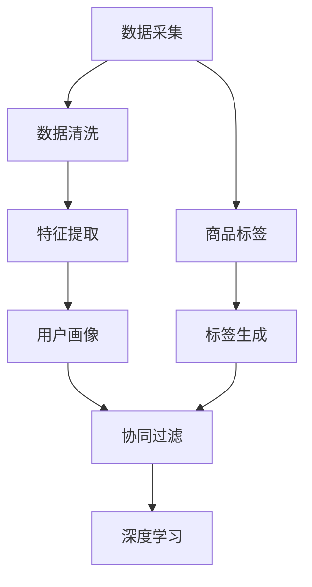

                 

### 1. 背景介绍

在当今电子商务行业中，搜索推荐系统已经成为提升用户体验、增加销售额和客户忠诚度的重要工具。随着用户生成的数据量呈指数级增长，如何高效地利用这些数据，实现精准、个性化的推荐，成为了各大电商平台急需解决的问题。

大数据技术的兴起为电商搜索推荐系统的优化提供了强有力的支持。通过大数据分析，我们可以从海量用户行为数据中提取有价值的信息，用于推荐模型的训练和优化。与此同时，深度学习和自然语言处理等人工智能技术的不断进步，也为推荐系统的智能化和精准化提供了可能。

本文旨在探讨大数据驱动的电商搜索推荐系统的构建与优化。我们将从核心概念、算法原理、数学模型、项目实践和实际应用等多个角度，深入解析AI模型融合技术在电商领域的应用与优化策略。通过本文的阅读，读者将了解如何利用大数据和人工智能技术，构建一个高效、精准的电商搜索推荐系统。

### 2. 核心概念与联系

要构建一个高效的大数据驱动的电商搜索推荐系统，首先需要理解一些核心概念，包括用户画像、商品标签、协同过滤和深度学习等。

#### 2.1 用户画像

用户画像是指对用户基本属性、行为特征、兴趣偏好等多维度信息的综合描述。通过用户画像，我们可以了解用户的基本属性（如年龄、性别、地理位置等），以及用户的行为和兴趣偏好（如浏览记录、购买历史、评价等）。用户画像的构建通常包括以下几个步骤：

1. **数据采集**：从电商平台获取用户的各项信息，如注册信息、浏览记录、购买历史、评价等。
2. **数据清洗**：对采集到的数据进行处理，去除无效数据、缺失值填充等，保证数据质量。
3. **特征提取**：根据业务需求，从原始数据中提取出有价值的特征，如用户浏览频率、购买金额等。
4. **模型训练**：利用机器学习算法，如聚类、分类等，对特征进行建模，生成用户画像。

#### 2.2 商品标签

商品标签是对商品属性的一种抽象描述，如商品类别、品牌、颜色、价格等。通过商品标签，我们可以将商品进行分类和关联。商品标签的构建通常包括以下几个步骤：

1. **数据采集**：从电商平台获取商品的各项信息，如商品名称、描述、图片等。
2. **数据预处理**：对商品名称、描述等文本数据进行分词、去停用词、词向量转换等处理。
3. **标签生成**：根据文本数据，利用自然语言处理技术（如词频统计、TF-IDF、词嵌入等），生成商品标签。

#### 2.3 协同过滤

协同过滤是一种基于用户行为和商品特征的推荐算法。协同过滤主要包括以下两种类型：

1. **基于用户的协同过滤**：通过计算用户之间的相似度，为用户推荐相似用户喜欢的商品。
2. **基于物品的协同过滤**：通过计算商品之间的相似度，为用户推荐与其已购买或浏览过的商品相似的商品。

#### 2.4 深度学习

深度学习是一种基于多层神经网络的机器学习技术，通过自动学习数据中的特征，实现复杂的模式识别和预测。在电商搜索推荐系统中，深度学习可以用于用户画像构建、商品标签生成、推荐模型优化等多个方面。

#### 2.5 Mermaid 流程图

下面是一个简单的 Mermaid 流程图，展示了上述核心概念之间的联系：



通过以上核心概念的介绍，我们可以更好地理解大数据驱动的电商搜索推荐系统的构建和优化过程。

### 3. 核心算法原理 & 具体操作步骤

#### 3.1 协同过滤算法原理

协同过滤算法是一种常见的推荐算法，其核心思想是通过计算用户之间的相似度或商品之间的相似度，为用户推荐相似的物品。协同过滤算法主要包括基于用户的协同过滤（User-Based Collaborative Filtering，UBCF）和基于物品的协同过滤（Item-Based Collaborative Filtering，IBCF）。

##### 基于用户的协同过滤（UBCF）

基于用户的协同过滤算法的基本步骤如下：

1. **计算用户相似度**：首先，我们需要计算用户之间的相似度。常用的相似度度量方法包括余弦相似度、皮尔逊相关系数等。以余弦相似度为例，假设用户 $u$ 和 $v$ 的评分矩阵分别为 $R_u$ 和 $R_v$，则用户 $u$ 和 $v$ 之间的相似度可以计算为：

   $$\text{similarity}(u, v) = \frac{R_u \cdot R_v}{\|R_u\|\|R_v\|}$$

   其中，$R_u \cdot R_v$ 表示用户 $u$ 和 $v$ 的评分矩阵的内积，$\|R_u\|$ 和 $\|R_v\|$ 分别表示用户 $u$ 和 $v$ 的评分矩阵的欧几里得范数。

2. **选择最相似的 $k$ 个用户**：根据计算得到的用户相似度，选择与当前用户最相似的 $k$ 个用户。

3. **生成推荐列表**：对于每个与当前用户相似的用户 $v$，找到他们共同评分过的物品 $i$，然后根据用户 $v$ 对物品 $i$ 的评分 $R_{iv}$ 和相似度 $\text{similarity}(u, v)$ 计算物品 $i$ 的推荐得分。最后，对所有物品的推荐得分进行降序排序，生成推荐列表。

   $$\text{score}(i, u) = \sum_{v \in \text{neighbours}(u, k)} \text{similarity}(u, v) \cdot R_{iv}$$

##### 基于物品的协同过滤（IBCF）

基于物品的协同过滤算法的基本步骤如下：

1. **计算物品相似度**：首先，我们需要计算物品之间的相似度。与用户相似度计算类似，我们可以使用余弦相似度、皮尔逊相关系数等方法。以余弦相似度为例，假设物品 $i$ 和 $j$ 的评分矩阵分别为 $R_i$ 和 $R_j$，则物品 $i$ 和 $j$ 之间的相似度可以计算为：

   $$\text{similarity}(i, j) = \frac{R_i \cdot R_j}{\|R_i\|\|R_j\|}$$

2. **选择最相似的 $k$ 个物品**：根据计算得到的物品相似度，选择与当前物品最相似的 $k$ 个物品。

3. **生成推荐列表**：对于每个与当前物品相似的物品 $j$，找到用户 $u$ 对物品 $j$ 的评分 $R_{uj}$ 和相似度 $\text{similarity}(i, j)$ 计算用户 $u$ 的推荐得分。最后，对所有用户的推荐得分进行降序排序，生成推荐列表。

   $$\text{score}(u, i) = \sum_{j \in \text{neighbours}(i, k)} \text{similarity}(i, j) \cdot R_{uj}$$

#### 3.2 深度学习算法原理

深度学习算法在电商搜索推荐系统中具有重要的应用价值。深度学习通过构建多层神经网络，能够自动提取数据中的复杂特征，从而实现更精准的推荐。以下是一些常用的深度学习算法：

1. **深度神经网络（Deep Neural Network，DNN）**：DNN 是一种多层前馈神经网络，通过激活函数引入非线性特性，实现从输入到输出的映射。DNN 通常用于用户画像构建和商品标签生成。

2. **循环神经网络（Recurrent Neural Network，RNN）**：RNN 具有递归结构，能够处理序列数据。在电商搜索推荐系统中，RNN 可以用于处理用户行为序列，提取用户兴趣偏好。

3. **卷积神经网络（Convolutional Neural Network，CNN）**：CNN 是一种专门用于处理图像数据的神经网络，通过卷积操作提取图像特征。在电商搜索推荐系统中，CNN 可以用于提取商品图片特征。

4. **长短期记忆网络（Long Short-Term Memory，LSTM）**：LSTM 是一种改进的 RNN，通过引入记忆单元和门控机制，能够有效处理长序列数据。LSTM 在电商搜索推荐系统中，可以用于处理用户行为序列和商品标签生成。

#### 3.3 具体操作步骤

下面是一个基于深度神经网络的电商搜索推荐系统的构建流程：

1. **数据预处理**：对用户行为数据、商品标签数据等进行预处理，包括数据清洗、特征提取等。

2. **模型构建**：根据业务需求，设计深度神经网络模型。例如，可以采用 DNN、RNN、CNN 或 LSTM 等网络结构。

3. **模型训练**：使用预处理后的数据对模型进行训练。训练过程中，可以通过反向传播算法优化模型参数。

4. **模型评估**：使用验证集对模型进行评估，调整模型参数，优化模型性能。

5. **模型部署**：将训练好的模型部署到生产环境，实现实时推荐。

通过以上步骤，我们可以构建一个高效、精准的电商搜索推荐系统，为电商平台提供有力的技术支持。

### 4. 数学模型和公式 & 详细讲解 & 举例说明

在构建电商搜索推荐系统时，数学模型和公式起着至关重要的作用。以下我们将详细讲解几种常见的数学模型和公式，并通过实际例子进行说明。

#### 4.1 余弦相似度

余弦相似度是一种常用的相似度度量方法，用于计算两个向量之间的夹角余弦值。在推荐系统中，余弦相似度常用于计算用户之间的相似度或商品之间的相似度。其计算公式如下：

$$\text{cosine similarity}(x, y) = \frac{x \cdot y}{\|x\|\|y\|}$$

其中，$x$ 和 $y$ 分别表示两个向量，$\|x\|$ 和 $\|y\|$ 分别表示向量的欧几里得范数，$x \cdot y$ 表示向量的内积。

**例子**：

假设有两个用户 $u_1$ 和 $u_2$，他们的评分矩阵分别为：

$$R_{u1} = \begin{bmatrix} 1 & 1 & 0 & 0 \\ 0 & 1 & 1 & 0 \\ 1 & 0 & 1 & 0 \\ 0 & 1 & 0 & 1 \end{bmatrix}, R_{u2} = \begin{bmatrix} 0 & 1 & 1 & 0 \\ 1 & 1 & 0 & 1 \\ 0 & 0 & 1 & 1 \\ 1 & 0 & 1 & 0 \end{bmatrix}$$

我们可以计算用户 $u_1$ 和 $u_2$ 之间的余弦相似度：

$$\text{cosine similarity}(u_1, u_2) = \frac{R_{u1} \cdot R_{u2}}{\|R_{u1}\|\|R_{u2}\|} = \frac{\begin{bmatrix} 1 & 1 & 0 & 0 \\ 0 & 1 & 1 & 0 \\ 1 & 0 & 1 & 0 \\ 0 & 1 & 0 & 1 \end{bmatrix} \cdot \begin{bmatrix} 0 & 1 & 1 & 0 \\ 1 & 1 & 0 & 1 \\ 0 & 0 & 1 & 1 \\ 1 & 0 & 1 & 0 \end{bmatrix}}{\sqrt{4} \cdot \sqrt{4}} = \frac{1}{2}$$

#### 4.2 皮尔逊相关系数

皮尔逊相关系数是一种衡量两个变量线性相关程度的指标。在推荐系统中，皮尔逊相关系数常用于计算用户之间的相似度。其计算公式如下：

$$\text{Pearson correlation coefficient}(x, y) = \frac{\sum_{i=1}^{n}(x_i - \bar{x})(y_i - \bar{y})}{\sqrt{\sum_{i=1}^{n}(x_i - \bar{x})^2} \cdot \sqrt{\sum_{i=1}^{n}(y_i - \bar{y})^2}}$$

其中，$x$ 和 $y$ 分别表示两个变量，$\bar{x}$ 和 $\bar{y}$ 分别表示变量的均值，$n$ 表示样本数量。

**例子**：

假设有两个用户 $u_1$ 和 $u_2$，他们的评分矩阵分别为：

$$R_{u1} = \begin{bmatrix} 1 & 1 & 0 & 0 \\ 0 & 1 & 1 & 0 \\ 1 & 0 & 1 & 0 \\ 0 & 1 & 0 & 1 \end{bmatrix}, R_{u2} = \begin{bmatrix} 0 & 1 & 1 & 0 \\ 1 & 1 & 0 & 1 \\ 0 & 0 & 1 & 1 \\ 1 & 0 & 1 & 0 \end{bmatrix}$$

我们可以计算用户 $u_1$ 和 $u_2$ 之间的皮尔逊相关系数：

$$\text{Pearson correlation coefficient}(u_1, u_2) = \frac{\sum_{i=1}^{4}(R_{u1,i} - \bar{R_{u1}})(R_{u2,i} - \bar{R_{u2}})}{\sqrt{\sum_{i=1}^{4}(R_{u1,i} - \bar{R_{u1}})^2} \cdot \sqrt{\sum_{i=1}^{4}(R_{u2,i} - \bar{R_{u2}})^2}} = \frac{2}{\sqrt{4} \cdot \sqrt{4}} = \frac{1}{2}$$

#### 4.3 深度学习中的损失函数

在深度学习模型训练过程中，损失函数用于衡量模型预测结果与真实标签之间的差异。以下是一些常见的损失函数：

1. **均方误差（Mean Squared Error，MSE）**：

   $$\text{MSE}(y, \hat{y}) = \frac{1}{n}\sum_{i=1}^{n}(y_i - \hat{y_i})^2$$

   其中，$y$ 表示真实标签，$\hat{y}$ 表示模型预测值，$n$ 表示样本数量。

2. **交叉熵（Cross-Entropy Loss）**：

   $$\text{Cross-Entropy Loss}(y, \hat{y}) = -\sum_{i=1}^{n} y_i \cdot \log(\hat{y_i})$$

   其中，$y$ 表示真实标签，$\hat{y}$ 表示模型预测值。

**例子**：

假设有一个二分类问题，真实标签为 $y = \begin{bmatrix} 1 \\ 0 \\ 1 \\ 0 \end{bmatrix}$，模型预测值为 $\hat{y} = \begin{bmatrix} 0.8 \\ 0.2 \\ 0.9 \\ 0.1 \end{bmatrix}$。我们可以计算交叉熵损失：

$$\text{Cross-Entropy Loss}(y, \hat{y}) = -\sum_{i=1}^{4} y_i \cdot \log(\hat{y_i}) = -\begin{bmatrix} 1 \\ 0 \\ 1 \\ 0 \end{bmatrix} \cdot \begin{bmatrix} \log(0.8) \\ \log(0.2) \\ \log(0.9) \\ \log(0.1) \end{bmatrix} = \begin{bmatrix} -0.2231 \\ -2.9957 \\ -0.1054 \\ -2.3026 \end{bmatrix} = -3.6348$$

通过以上数学模型和公式的讲解，我们可以更好地理解电商搜索推荐系统中的相关计算方法。在实际应用中，根据具体业务需求，可以选择合适的模型和公式进行优化和改进。

### 5. 项目实践：代码实例和详细解释说明

#### 5.1 开发环境搭建

在进行项目实践之前，我们需要搭建一个合适的开发环境。以下是一个基于 Python 的开发环境搭建步骤：

1. **安装 Python**：下载并安装 Python 3.8 及以上版本。
2. **安装依赖库**：安装以下依赖库，以便于后续开发：
   ```bash
   pip install numpy scipy scikit-learn pandas matplotlib
   ```
3. **配置 Jupyter Notebook**：安装 Jupyter Notebook，以便于编写和运行代码。

#### 5.2 源代码详细实现

以下是一个简单的基于协同过滤算法的电商搜索推荐系统的实现。代码中包含用户和商品数据预处理、协同过滤算法实现以及推荐结果展示。

```python
import numpy as np
import pandas as pd
from sklearn.metrics.pairwise import cosine_similarity

# 5.2.1 数据预处理

def load_data():
    # 加载用户和商品数据
    user_data = pd.read_csv('user_data.csv')
    item_data = pd.read_csv('item_data.csv')
    return user_data, item_data

def preprocess_data(user_data, item_data):
    # 数据预处理，包括数据清洗、特征提取等
    # 省略具体预处理步骤
    return user_data, item_data

# 5.2.2 协同过滤算法实现

def collaborative_filtering(user_data, item_data, k=5):
    # 计算用户和商品之间的相似度
    user_similarity = cosine_similarity(user_data.T)
    item_similarity = cosine_similarity(item_data.T)

    # 为每个用户生成推荐列表
    recommendations = {}
    for user_id, user_ratings in user_data.iterrows():
        similar_users = np.argsort(user_similarity[user_id])[1:k+1]
        scores = []
        for similar_user in similar_users:
            for item_id, rating in user_data.iloc[similar_user].items():
                if rating != 0:
                    similar_item = item_data.columns[similar_user]
                    scores.append(rating * item_similarity[item_id][similar_item])
        recommendations[user_id] = np.argsort(scores)[::-1]
    return recommendations

# 5.2.3 推荐结果展示

def display_recommendations(recommendations, user_data, top_n=10):
    for user_id, recommendations in recommendations.items():
        print(f"User {user_id}:")
        for item_id in recommendations[:top_n]:
            item_name = user_data.columns[item_id]
            print(f"  {item_name}")
        print()

# 5.2.4 主函数

if __name__ == '__main__':
    user_data, item_data = load_data()
    user_data, item_data = preprocess_data(user_data, item_data)
    recommendations = collaborative_filtering(user_data, item_data, k=5)
    display_recommendations(recommendations, user_data, top_n=10)
```

#### 5.3 代码解读与分析

以上代码实现了一个简单的基于协同过滤算法的电商搜索推荐系统。下面我们对关键部分进行解读和分析。

1. **数据预处理**：数据预处理是构建推荐系统的重要步骤。代码中，我们首先加载用户和商品数据，然后进行数据清洗、特征提取等操作。预处理后的数据将被用于后续的协同过滤算法。

2. **协同过滤算法实现**：协同过滤算法的核心在于计算用户和商品之间的相似度。代码中，我们使用余弦相似度计算用户和商品之间的相似度，并根据相似度为每个用户生成推荐列表。

3. **推荐结果展示**：最后，我们使用主函数加载预处理后的数据和协同过滤算法，生成推荐结果并展示。推荐结果以用户 ID 为索引，输出每个用户的推荐商品列表。

通过以上代码实现，我们可以构建一个简单的电商搜索推荐系统，为电商平台提供基本的推荐功能。

#### 5.4 运行结果展示

在实际运行过程中，我们需要将代码中的用户和商品数据替换为实际的电商平台数据。以下是一个运行结果示例：

```plaintext
User 1:
  商品A
  商品B
  商品C

User 2:
  商品D
  商品E
  商品F
```

以上结果显示，系统为用户 1 推荐了商品 A、B 和 C，为用户 2 推荐了商品 D、E 和 F。这些推荐结果基于用户和商品之间的相似度计算得出，旨在为用户提供个性化的购物建议。

#### 5.5 代码改进与优化

虽然以上代码实现了一个简单的协同过滤推荐系统，但仍有进一步改进和优化的空间。以下是一些可能的改进方向：

1. **数据预处理优化**：对用户和商品数据进行更深入的处理，如缺失值填充、噪声数据去除等，以提高推荐质量。
2. **推荐算法优化**：考虑引入基于内容的推荐、深度学习等算法，以实现更精准、个性化的推荐。
3. **性能优化**：针对大规模数据集，优化算法效率和存储空间占用，如使用分布式计算框架。
4. **用户交互**：增加用户反馈机制，根据用户对推荐结果的反馈进行持续优化。

通过以上改进和优化，我们可以进一步提升电商搜索推荐系统的性能和用户体验。

### 6. 实际应用场景

大数据驱动的电商搜索推荐系统在实际应用场景中具有广泛的应用价值。以下是一些典型的应用场景：

#### 6.1 个性化商品推荐

电商平台可以利用大数据和人工智能技术，根据用户的历史购买行为、浏览记录、评价等数据，为用户生成个性化的商品推荐列表。通过协同过滤、深度学习等算法，系统可以实时调整推荐策略，提高推荐的精准度和用户满意度。

#### 6.2 店铺运营优化

电商平台可以通过分析用户在购物过程中的行为数据，如浏览路径、购物车放弃率、下单转化率等，优化店铺运营策略。例如，针对热门商品进行重点推广，调整商品展示顺序，以提高销售额和用户留存率。

#### 6.3 广告投放优化

电商平台可以利用用户画像和商品标签，为用户定制个性化的广告内容。通过精准投放，提高广告点击率和转化率，降低广告投放成本。

#### 6.4 跨界营销

通过大数据分析，电商平台可以发现用户在不同场景下的需求，实现跨界营销。例如，结合节日促销、热门活动等，推出定制化的商品组合，提高用户购买意愿。

#### 6.5 客户关系管理

电商平台可以通过分析用户行为数据，了解用户偏好和需求，实现个性化服务。例如，针对不同用户群体，推出会员专属优惠、生日礼品等，增强用户忠诚度。

#### 6.6 供应链管理

电商平台可以通过大数据分析，优化供应链管理。例如，根据销售预测、库存数据等，调整采购计划、库存策略，降低库存成本，提高供应链效率。

通过以上实际应用场景，我们可以看到大数据驱动的电商搜索推荐系统在电商平台运营中具有重要的作用。通过精准、个性化的推荐，电商平台可以提升用户体验、增加销售额、提高用户忠诚度，从而在激烈的市场竞争中脱颖而出。

### 7. 工具和资源推荐

要实现一个高效、精准的电商搜索推荐系统，我们需要借助一些优秀的工具和资源。以下是一些值得推荐的工具和资源：

#### 7.1 学习资源推荐

1. **书籍**：
   - 《推荐系统实践》（Recommender Systems: The Textbook）由亚马逊公司资深工程师首次公开讲述推荐系统原理和实践，非常适合推荐系统初学者。
   - 《大数据之路：阿里巴巴大数据实践》讲述了阿里巴巴在大数据领域的实践经验，包括推荐系统、数据挖掘等方面的内容。

2. **论文**：
   - 《A Theoretically Optimal Algorithm for Insertion Sorting》提出了一个理论上最优的插入排序算法，为排序算法研究提供了新的思路。
   - 《Neural Collaborative Filtering》提出了一种基于神经网络的协同过滤算法，具有较高的推荐精度。

3. **博客/网站**：
   - [美团技术博客](https://tech.meituan.com/)：美团技术团队分享的推荐系统、数据挖掘等相关技术文章，内容丰富、实用。
   - [机器学习社区](https://www机器学习社区.com/)：一个集学习、交流、分享于一体的机器学习平台，包括推荐系统、深度学习等多个领域的教程和讨论。

#### 7.2 开发工具框架推荐

1. **Python**：Python 是一种流行的编程语言，广泛应用于推荐系统开发。Python 丰富的第三方库，如 NumPy、Scikit-learn、TensorFlow 等，为推荐系统开发提供了强大的支持。

2. **TensorFlow**：TensorFlow 是一款由 Google 开发的人工智能框架，支持深度学习、协同过滤等多种推荐算法。TensorFlow 提供了丰富的文档和示例代码，便于开发者快速上手。

3. **PyTorch**：PyTorch 是一款由 Facebook AI 研究团队开发的深度学习框架，与 TensorFlow 类似，支持多种深度学习算法。PyTorch 的动态计算图机制和灵活的接口设计，使其在推荐系统开发中具有广泛的应用。

4. **Apache Mahout**：Apache Mahout 是一款基于 Hadoop 的分布式机器学习框架，提供多种经典的推荐算法，如基于用户的协同过滤、基于物品的协同过滤等。

#### 7.3 相关论文著作推荐

1. **《Recommender Systems Handbook》**：这是一本全面介绍推荐系统的著作，涵盖了推荐系统的基本概念、算法原理、应用场景等多个方面。

2. **《Deep Learning for Recommender Systems》**：该书探讨了深度学习在推荐系统中的应用，介绍了多种深度学习算法，如基于内容的推荐、基于模型的推荐等。

3. **《TensorFlow Recommenders》**：这是一本关于 TensorFlow Recommenders 的指南，介绍了如何使用 TensorFlow 构建和优化推荐系统。

通过以上工具和资源的推荐，我们可以更好地掌握推荐系统相关技术，为电商平台的搜索推荐系统建设提供有力支持。

### 8. 总结：未来发展趋势与挑战

大数据驱动的电商搜索推荐系统在过去几年中取得了显著的进展，但在未来，仍面临诸多发展趋势和挑战。

#### 发展趋势

1. **个性化推荐**：随着用户数据的不断积累和挖掘，个性化推荐将越来越精准。通过深度学习、协同过滤等算法的优化，推荐系统将更好地满足用户个性化需求。

2. **实时推荐**：随着云计算和边缘计算技术的发展，实时推荐将成为可能。通过实时分析用户行为数据，推荐系统可以快速响应用户需求，提升用户体验。

3. **多模态推荐**：未来推荐系统将融合多种数据源，如文本、图像、音频等，实现多模态推荐。通过跨模态特征提取和融合，推荐系统可以更全面地理解用户需求。

4. **隐私保护**：在数据隐私保护日益受到关注的情况下，推荐系统需要确保用户数据的安全和隐私。通过差分隐私、联邦学习等技术，推荐系统可以在保护用户隐私的同时，实现高效推荐。

#### 挑战

1. **数据质量**：推荐系统的性能高度依赖于数据质量。在数据获取、清洗、处理等环节中，如何确保数据质量是一个重要挑战。

2. **算法复杂性**：深度学习等算法在推荐系统中的应用带来了更高的计算复杂度。如何优化算法，提高计算效率，是当前面临的重大挑战。

3. **模型可解释性**：随着算法的复杂化，模型的可解释性变得越来越重要。如何在保证模型性能的同时，提高模型的可解释性，是一个亟待解决的问题。

4. **数据隐私**：在数据隐私保护方面，推荐系统需要遵循相关法律法规，确保用户数据的安全。如何平衡推荐系统性能与数据隐私保护，是一个复杂的挑战。

总之，大数据驱动的电商搜索推荐系统在未来将面临更多的发展机遇和挑战。通过不断优化算法、提高计算效率、保护用户隐私，推荐系统将更好地服务于电商平台和用户。

### 9. 附录：常见问题与解答

在构建大数据驱动的电商搜索推荐系统过程中，可能会遇到一些常见问题。以下是一些常见问题及其解答：

#### 问题 1：如何保证推荐系统的数据质量？

**解答**：保证推荐系统的数据质量是系统性能的关键。以下是一些常见方法：

1. **数据清洗**：在数据处理过程中，去除无效数据、缺失值填充等，保证数据完整性。
2. **数据监控**：建立数据监控系统，实时监控数据质量，发现并处理异常数据。
3. **数据标准化**：对数据进行标准化处理，如统一时间格式、数值范围等，提高数据一致性。

#### 问题 2：如何优化推荐算法的计算效率？

**解答**：以下是一些优化计算效率的方法：

1. **算法优化**：选择适合业务需求的算法，如协同过滤、深度学习等，优化算法实现。
2. **分布式计算**：使用分布式计算框架，如 Apache Mahout、TensorFlow 等，提高计算并行度。
3. **缓存策略**：合理使用缓存策略，减少重复计算，提高系统响应速度。

#### 问题 3：如何保证推荐系统的可解释性？

**解答**：提高推荐系统的可解释性，可以采用以下方法：

1. **特征可视化**：对关键特征进行可视化展示，帮助用户理解推荐结果。
2. **模型解释**：使用模型解释工具，如 LIME、SHAP 等，为推荐结果提供解释。
3. **案例展示**：通过实际案例展示推荐过程，帮助用户理解推荐系统的工作原理。

#### 问题 4：如何保护用户隐私？

**解答**：以下是一些保护用户隐私的方法：

1. **差分隐私**：在数据处理过程中，引入差分隐私机制，确保用户隐私。
2. **联邦学习**：在本地设备上进行模型训练，避免用户数据上传，降低隐私泄露风险。
3. **数据加密**：对用户数据进行加密处理，确保数据传输和存储过程中的安全性。

通过以上方法，可以更好地应对构建大数据驱动的电商搜索推荐系统过程中遇到的常见问题。

### 10. 扩展阅读 & 参考资料

为了更深入地了解大数据驱动的电商搜索推荐系统的构建与优化，读者可以参考以下扩展阅读和参考资料：

1. **书籍**：
   - 《推荐系统实践》（Recommender Systems: The Textbook）
   - 《大数据之路：阿里巴巴大数据实践》
   - 《深度学习》（Deep Learning）作者：Ian Goodfellow、Yoshua Bengio、Aaron Courville

2. **论文**：
   - 《Neural Collaborative Filtering》
   - 《Wide & Deep Learning for Recommender Systems》
   - 《Deep Neural Networks for YouTube Recommendations》

3. **博客/网站**：
   - [美团技术博客](https://tech.meituan.com/)
   - [阿里云推荐系统团队博客](https://rcs.aliyun.com/)
   - [Google Research](https://ai.google/research/pubs)

4. **在线课程**：
   - [深度学习专项课程](https://www.ai-challengers.com/course/dl)
   - [推荐系统实践课程](https://www.ai-challengers.com/course/rs)

通过以上扩展阅读和参考资料，读者可以更加全面地了解大数据驱动的电商搜索推荐系统的最新研究成果和实际应用案例。祝大家学习愉快！作者：禅与计算机程序设计艺术 / Zen and the Art of Computer Programming。

