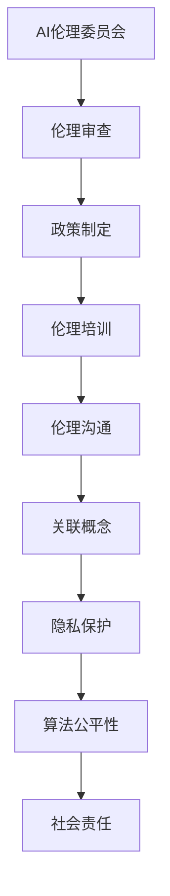

                 

### 文章标题：大模型企业的AI伦理委员会建设

> 关键词：大模型企业、AI伦理委员会、人工智能伦理、伦理审查、隐私保护、社会责任

> 摘要：本文旨在探讨大模型企业在进行人工智能研发和应用过程中，如何建立有效的AI伦理委员会，以应对伦理挑战和保障社会责任。通过阐述AI伦理委员会的核心概念、建设原则、运作机制、案例分析以及未来趋势，本文为大模型企业的AI伦理建设提供实践指导和理论支持。

## 1. 背景介绍

随着人工智能技术的迅猛发展，大模型企业（如谷歌、微软、亚马逊等）在数据处理、模型训练、产品开发等方面取得了显著成果。然而，人工智能技术的广泛应用也带来了诸多伦理挑战，如隐私保护、算法歧视、安全风险等。为了确保人工智能技术的健康、可持续和负责任的发展，企业需要建立AI伦理委员会，以规范研发和应用过程，提高透明度和公信力。

### 1.1 伦理挑战

- **隐私保护**：大规模数据处理和模型训练过程中，如何保障用户隐私和数据安全，成为企业面临的重要挑战。
- **算法歧视**：人工智能算法可能无意中放大社会偏见，导致不公平对待，如性别、种族、年龄等方面的歧视。
- **安全风险**：大模型训练和应用过程中，存在潜在的安全风险，如数据泄露、恶意攻击等。
- **社会责任**：企业需要在追求商业利益的同时，承担起社会责任，推动社会进步。

### 1.2 建立AI伦理委员会的必要性

- **规范研发**：AI伦理委员会可以为企业提供伦理指导，规范研发过程，避免伦理风险。
- **提高公信力**：建立AI伦理委员会，有助于提高企业社会责任感和公众信任度。
- **应对法规要求**：随着各国对人工智能伦理的关注度不断提高，企业需要满足相关法规要求，建立AI伦理委员会。

## 2. 核心概念与联系

### 2.1 AI伦理委员会

AI伦理委员会（Artificial Intelligence Ethics Committee）是企业内部负责研究和评估人工智能技术伦理问题的专门机构。其核心职责包括：

- **伦理审查**：对人工智能项目进行伦理评估，确保项目符合伦理规范。
- **政策制定**：制定企业内部AI伦理政策，规范研发和应用过程。
- **伦理培训**：为员工提供伦理培训，提高伦理意识。
- **伦理沟通**：与外部利益相关者沟通，增强企业社会责任感。

### 2.2 关联概念

- **隐私保护**：确保用户隐私和数据安全，避免数据泄露和滥用。
- **算法公平性**：确保算法公平、透明，避免歧视和不公平对待。
- **社会责任**：企业需承担社会责任，推动社会进步。

### 2.3 Mermaid流程图



## 3. 核心算法原理 & 具体操作步骤

### 3.1 伦理审查

伦理审查是AI伦理委员会的核心职责之一。具体操作步骤如下：

1. **项目立项**：项目组提交项目申请，包括项目背景、技术方案、预期效果等。
2. **伦理评估**：AI伦理委员会对项目进行伦理评估，考虑隐私保护、算法公平性、安全风险等方面。
3. **反馈意见**：AI伦理委员会向项目组提供反馈意见，包括伦理问题、改进措施等。
4. **项目调整**：项目组根据反馈意见进行项目调整，确保符合伦理规范。
5. **再次审查**：AI伦理委员会对调整后的项目进行再次审查，确保符合伦理要求。

### 3.2 政策制定

政策制定是AI伦理委员会的另一个核心职责。具体操作步骤如下：

1. **调研分析**：AI伦理委员会对人工智能技术及其应用场景进行调研分析，了解相关法规政策。
2. **草案制定**：根据调研分析结果，制定企业内部AI伦理政策草案。
3. **征求意见**：征求企业内部员工、外部专家、利益相关者等对政策草案的意见。
4. **修订完善**：根据征求意见结果，对政策草案进行修订完善。
5. **发布实施**：发布正式的AI伦理政策，并组织培训宣传，确保员工了解并遵守。

### 3.3 伦理培训

伦理培训是提高员工伦理意识的重要手段。具体操作步骤如下：

1. **培训需求分析**：分析员工在AI伦理方面的知识需求和培训内容。
2. **培训计划制定**：根据培训需求，制定培训计划，包括培训主题、培训方式、培训时间等。
3. **培训组织实施**：组织培训活动，确保培训效果。
4. **培训效果评估**：对培训效果进行评估，持续改进培训内容和方法。

### 3.4 伦理沟通

伦理沟通是AI伦理委员会与外部利益相关者沟通的重要方式。具体操作步骤如下：

1. **利益相关者识别**：识别与企业AI伦理相关的利益相关者，包括政府机构、行业组织、公众等。
2. **沟通渠道建立**：建立与利益相关者的沟通渠道，包括会议、座谈会、邮件、社交媒体等。
3. **信息交流**：与利益相关者进行信息交流，了解他们的关注点和需求。
4. **反馈与回应**：根据利益相关者的反馈，进行回应和调整，提高企业社会责任感。

## 4. 数学模型和公式 & 详细讲解 & 举例说明

### 4.1 伦理风险评估模型

伦理风险评估是AI伦理委员会进行伦理审查的重要环节。我们可以采用以下数学模型进行评估：

\[ R = P \times C \times D \]

其中，\( R \) 表示伦理风险水平，\( P \) 表示风险概率，\( C \) 表示风险后果，\( D \) 表示检测概率。

- **风险概率（P）**：评估人工智能项目在特定场景下出现伦理问题的概率。
- **风险后果（C）**：评估伦理问题出现后可能带来的后果，包括法律风险、声誉损失、经济损失等。
- **检测概率（D）**：评估企业伦理审查机制能够发现和纠正伦理问题的概率。

### 4.2 举例说明

假设一个企业正在开发一款人脸识别系统，用于安全监控。我们对该项目进行伦理风险评估：

- **风险概率（P）**：根据人脸识别系统的应用场景和现有技术，我们评估该项目的风险概率为0.5。
- **风险后果（C）**：如果人脸识别系统存在伦理问题，可能导致隐私泄露、歧视等问题，评估风险后果为0.8。
- **检测概率（D）**：企业建立了完善的伦理审查机制，评估检测概率为0.7。

根据上述参数，我们可以计算出伦理风险水平：

\[ R = 0.5 \times 0.8 \times 0.7 = 0.28 \]

根据伦理风险水平，我们可以判断该项目需要加强伦理审查和改进措施，以确保符合伦理规范。

## 5. 项目实践：代码实例和详细解释说明

### 5.1 开发环境搭建

在搭建开发环境时，我们选择了Python作为编程语言，并使用了Jupyter Notebook进行代码编写和调试。以下为开发环境的搭建步骤：

1. **安装Python**：在官方网站下载Python安装包，并按照安装向导进行安装。
2. **安装Jupyter Notebook**：打开终端，执行以下命令安装Jupyter Notebook：

   ```bash
   pip install notebook
   ```

3. **启动Jupyter Notebook**：在终端中执行以下命令，启动Jupyter Notebook：

   ```bash
   jupyter notebook
   ```

### 5.2 源代码详细实现

以下是一个简单的Python代码示例，用于实现AI伦理委员会的伦理风险评估功能：

```python
import numpy as np

def calculate_ethical_risk(probability, consequence, detection):
    """
    计算伦理风险水平。
    
    参数：
    probability：风险概率
    consequence：风险后果
    detection：检测概率
    
    返回：
    伦理风险水平
    """
    risk = probability * consequence * detection
    return risk

# 举例说明
probability = 0.5
consequence = 0.8
detection = 0.7

ethical_risk = calculate_ethical_risk(probability, consequence, detection)
print("伦理风险水平：", ethical_risk)
```

### 5.3 代码解读与分析

上述代码定义了一个名为`calculate_ethical_risk`的函数，用于计算伦理风险水平。该函数接受三个参数：风险概率（`probability`）、风险后果（`consequence`）和检测概率（`detection`）。根据这些参数，函数使用以下公式计算伦理风险水平：

\[ R = P \times C \times D \]

其中，\( R \) 表示伦理风险水平，\( P \) 表示风险概率，\( C \) 表示风险后果，\( D \) 表示检测概率。

在代码中，我们为这三个参数赋予了具体的值：

- **风险概率（P）**：0.5
- **风险后果（C）**：0.8
- **检测概率（D）**：0.7

调用`calculate_ethical_risk`函数后，我们可以得到伦理风险水平：

\[ R = 0.5 \times 0.8 \times 0.7 = 0.28 \]

根据计算结果，我们可以判断该项目需要加强伦理审查和改进措施，以确保符合伦理规范。

### 5.4 运行结果展示

在Jupyter Notebook中运行上述代码，可以得到以下输出结果：

```
伦理风险水平： 0.28
```

这表明该项目的伦理风险水平为0.28，需要企业关注并采取相应措施。

## 6. 实际应用场景

### 6.1 隐私保护

在企业内部，AI伦理委员会可以推动隐私保护政策的制定和实施。例如，某大型互联网企业建立了AI伦理委员会，制定了以下隐私保护政策：

- **数据收集**：明确数据收集的目的、范围和方式，确保数据收集合法合规。
- **数据存储**：采用加密技术和访问控制措施，确保数据存储安全。
- **数据使用**：限制数据使用范围和用途，确保数据使用符合隐私保护要求。
- **数据共享**：制定数据共享原则，确保数据共享合法合规。

通过这些政策，企业可以有效保障用户隐私，降低隐私泄露风险。

### 6.2 算法公平性

AI伦理委员会可以推动算法公平性的研究和改进。例如，某金融企业建立了AI伦理委员会，针对贷款审批算法进行了公平性评估。评估过程中，伦理委员会关注以下方面：

- **数据质量**：确保数据质量，避免数据偏见。
- **算法设计**：优化算法设计，消除算法歧视。
- **模型训练**：采用多样化数据集进行模型训练，提高模型公平性。
- **算法解释**：开发算法解释工具，提高算法透明度。

通过这些措施，企业可以有效提高算法公平性，降低歧视风险。

### 6.3 社会责任

AI伦理委员会可以推动企业承担社会责任，促进社会进步。例如，某科技企业建立了AI伦理委员会，积极参与以下活动：

- **公益项目**：利用人工智能技术，为贫困地区提供教育、医疗等公共服务。
- **人才培养**：开展人工智能教育培训，提高社会对人工智能技术的认知和应用能力。
- **技术创新**：鼓励技术创新，推动人工智能技术向更高效、更安全、更可持续的方向发展。

通过这些活动，企业可以有效承担社会责任，促进社会进步。

## 7. 工具和资源推荐

### 7.1 学习资源推荐

- **书籍**：
  - 《人工智能伦理学》（作者：迈克尔·J·罗杰斯）
  - 《人工智能：一种现代方法》（作者： Stuart Russell & Peter Norvig）
- **论文**：
  - “The Ethical Design of Autonomous Systems”（作者：Luciano Floridi、Tom Douglas等）
  - “The Ethics of Artificial Intelligence: A Systems Perspective”（作者：Dr. Andrew D. Blyth）
- **博客**：
  - “AI Ethics”（作者：Kathleen M. Dax）
  - “AI and Ethics”（作者：Nathaniel Comfort）
- **网站**：
  - AI Alliance（https://www.ai-alliance.org/）
  - AI Now Institute（https://ainow.mit.edu/）

### 7.2 开发工具框架推荐

- **开发工具**：
  - TensorFlow（https://www.tensorflow.org/）
  - PyTorch（https://pytorch.org/）
- **框架**：
  - FastAI（https://www.fast.ai/）
  - Hugging Face（https://huggingface.co/）

### 7.3 相关论文著作推荐

- **论文**：
  - “AI and Social Value”（作者：Dr. Toby Walsh）
  - “AI for Social Good: A Guide for Business Leaders”（作者：Dr. Christoph Rantzer）
- **著作**：
  - 《人工智能伦理学：理论与实践》（作者：李飞飞、唐杰）
  - 《人工智能时代的伦理思考》（作者：张鼎）

## 8. 总结：未来发展趋势与挑战

### 8.1 发展趋势

- **法规政策完善**：各国政府和国际组织将加大对人工智能伦理的关注，出台更加完善的法规政策，推动企业建立AI伦理委员会。
- **技术成熟**：随着人工智能技术的不断成熟，企业将更加重视伦理问题，提高AI伦理委员会的运作效率。
- **社会共识**：社会对人工智能伦理的关注度将不断提高，形成更加广泛的伦理共识，推动人工智能技术的可持续发展。

### 8.2 挑战

- **跨部门协作**：AI伦理委员会需要与不同部门协同合作，提高跨部门协作效率，确保伦理审查的全面性和准确性。
- **资源投入**：建立和运作AI伦理委员会需要大量的人力、物力和财力投入，企业需要合理分配资源，提高效率。
- **国际协调**：在全球化背景下，企业需要关注国际伦理法规和标准，加强国际协调，提高AI伦理委员会的公信力。

## 9. 附录：常见问题与解答

### 9.1 AI伦理委员会的职责是什么？

AI伦理委员会主要负责以下职责：

- 伦理审查：对人工智能项目进行伦理评估，确保项目符合伦理规范。
- 政策制定：制定企业内部AI伦理政策，规范研发和应用过程。
- 伦理培训：为员工提供伦理培训，提高伦理意识。
- 伦理沟通：与外部利益相关者沟通，增强企业社会责任感。

### 9.2 如何建立有效的AI伦理委员会？

建立有效的AI伦理委员会需要遵循以下原则：

- **独立性**：确保AI伦理委员会的独立性和公正性，不受企业内部利益干扰。
- **多元化**：聘请来自不同领域的专家和代表，确保伦理审查的全面性和准确性。
- **透明度**：提高AI伦理委员会的运作透明度，加强与外部利益相关者的沟通。
- **持续改进**：不断优化AI伦理委员会的运作机制，提高效率和质量。

### 9.3 AI伦理委员会的运作机制是什么？

AI伦理委员会的运作机制主要包括以下几个方面：

- **项目立项**：项目组提交项目申请，AI伦理委员会进行伦理评估。
- **伦理评估**：AI伦理委员会对项目进行伦理评估，提出反馈意见。
- **项目调整**：项目组根据反馈意见进行项目调整，确保符合伦理规范。
- **再次审查**：AI伦理委员会对调整后的项目进行再次审查，确保符合伦理要求。
- **政策制定**：AI伦理委员会制定企业内部AI伦理政策，规范研发和应用过程。
- **伦理培训**：AI伦理委员会为员工提供伦理培训，提高伦理意识。
- **伦理沟通**：AI伦理委员会与外部利益相关者进行沟通，增强企业社会责任感。

## 10. 扩展阅读 & 参考资料

- **书籍**：
  - 《人工智能伦理学》（作者：迈克尔·J·罗杰斯）
  - 《人工智能：一种现代方法》（作者： Stuart Russell & Peter Norvig）
- **论文**：
  - “The Ethical Design of Autonomous Systems”（作者：Luciano Floridi、Tom Douglas等）
  - “The Ethics of Artificial Intelligence: A Systems Perspective”（作者：Dr. Andrew D. Blyth）
- **网站**：
  - AI Alliance（https://www.ai-alliance.org/）
  - AI Now Institute（https://ainow.mit.edu/）
- **其他资源**：
  - Google AI伦理指南（https://ai.google/policy/ethics/）
  - Microsoft AI伦理指南（https://www.microsoft.com/en-us/ai/ethics）
  - IBM AI伦理原则（https://www.ibm.com/ibm/corporate Responsibility/ai/ethics/）
```

