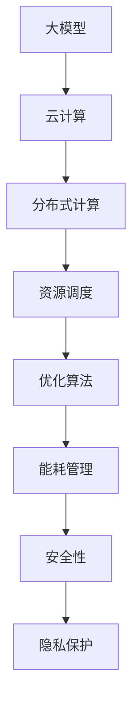

                 

### 文章标题

《大模型企业的算力资源优化策略》

关键词：大模型、算力资源、优化策略、云计算、分布式计算、资源调度

摘要：本文将探讨大模型企业在进行算力资源优化时所需考虑的核心因素，以及如何通过先进的技术手段和策略来提高资源利用效率，降低运营成本。文章将从背景介绍、核心概念、算法原理、数学模型、项目实践、实际应用场景、工具和资源推荐等多个方面展开，旨在为读者提供全面、系统的指导和建议。

---

在当前人工智能（AI）飞速发展的时代，大模型技术在各个领域展现出了巨大的潜力。无论是自动驾驶、自然语言处理，还是医学诊断、金融预测，大模型都发挥着不可或缺的作用。然而，大模型对算力的需求也是前所未有的，如何优化算力资源，提高利用效率，降低成本，成为了企业面临的一个重要挑战。

本文将围绕这一核心问题，详细探讨大模型企业算力资源优化策略。通过对相关核心概念和原理的深入分析，结合实际项目案例，本文旨在为读者提供一套科学、系统、可操作的优化方案。文章结构如下：

1. 背景介绍
2. 核心概念与联系
3. 核心算法原理 & 具体操作步骤
4. 数学模型和公式 & 详细讲解 & 举例说明
5. 项目实践：代码实例和详细解释说明
6. 实际应用场景
7. 工具和资源推荐
8. 总结：未来发展趋势与挑战
9. 附录：常见问题与解答
10. 扩展阅读 & 参考资料

接下来，我们将逐一深入探讨上述各个部分，希望为您的企业在大模型领域的算力资源优化提供有益的参考。

---

### 1. 背景介绍

#### 1.1 大模型的发展背景

近年来，随着深度学习技术的快速发展，大模型（Large-scale Models）应运而生。这些模型具有数十亿甚至数万亿个参数，能够处理大规模数据，并在各类任务中取得了显著的性能提升。例如，OpenAI 的 GPT-3 拥有 1750 亿个参数，百度研究院的 ERNIE 3.0 拥有 10 亿个参数，这些大模型在自然语言处理、计算机视觉、语音识别等领域都展现出了强大的能力。

大模型的发展离不开以下几个关键因素：

- **硬件性能的提升**：随着计算能力的不断提高，特别是 GPU、TPU 等专用计算设备的广泛应用，为大规模模型训练提供了强有力的硬件支持。
- **数据量的增加**：互联网的普及和数据存储技术的发展，使得企业可以获取和处理海量的数据，这为大模型的训练提供了丰富的数据基础。
- **算法的创新**：深度学习技术的不断进步，尤其是模型架构和优化算法的创新，使得大模型的训练效率得到了大幅提升。

#### 1.2 算力资源优化的重要性

尽管大模型具有显著的性能优势，但其训练和部署过程对算力资源的需求也极为庞大。具体来说，大模型训练过程中需要进行大量的矩阵运算，这需要大量的计算资源和存储资源。同时，随着模型规模的不断扩大，训练时间也在不断增加。因此，优化算力资源对于大模型企业来说至关重要。

优化算力资源的重要性主要体现在以下几个方面：

- **降低成本**：高效的算力资源利用可以显著降低训练和部署大模型的成本，这对于企业的长期发展具有重要意义。
- **提高效率**：合理的资源调度和分配可以提高模型训练和推理的速度，从而缩短研发周期，提高市场竞争力。
- **增强可扩展性**：通过优化算力资源，企业可以更好地应对模型规模不断扩大所带来的挑战，确保系统的稳定运行。

#### 1.3 算力资源优化面临的挑战

尽管算力资源优化具有重要的现实意义，但大模型企业在实际操作过程中仍面临诸多挑战：

- **资源分配不均**：在分布式计算环境中，不同节点之间的资源分配可能存在不均，导致某些节点过载，而另一些节点资源空闲。
- **任务调度复杂**：在多任务并行处理的情况下，如何合理调度任务，确保任务之间的执行顺序和依赖关系，是优化算力资源的难点之一。
- **能耗管理**：随着计算资源的增加，能耗问题也愈发突出。如何平衡性能和能耗之间的关系，是优化算力资源的一个重要方面。
- **安全性问题**：在分布式计算环境中，数据的安全性和隐私保护也是一个不容忽视的问题。

在接下来的章节中，我们将深入探讨如何通过先进的技术手段和策略来优化大模型企业的算力资源。

### 2. 核心概念与联系

#### 2.1 大模型的构成与工作原理

大模型通常由多个层次的神经元组成，通过多层神经网络结构对数据进行处理和建模。其核心工作原理是通过学习大量数据中的特征和模式，将输入数据映射到输出结果。这一过程涉及到大量的矩阵运算和优化算法，如梯度下降、Adam 等。

#### 2.2 云计算与分布式计算

云计算是一种通过互联网提供可扩展计算资源的服务模式，包括基础设施即服务（IaaS）、平台即服务（PaaS）和软件即服务（SaaS）等。分布式计算则是将任务分解为多个子任务，分布在多个计算节点上并行执行，以提高计算效率和处理能力。

#### 2.3 资源调度与优化算法

资源调度是优化算力资源的关键环节，涉及到任务分配、资源分配和负载均衡等问题。常见的资源调度算法包括最短作业优先（SJF）、最短剩余时间优先（SRTF）和负载均衡调度等。优化算法则通过优化目标函数，如最小化总等待时间、最大化资源利用率等，来提高系统性能。

#### 2.4 能耗管理

能耗管理是优化算力资源的一个重要方面，涉及到计算资源的利用率、能耗指标和节能策略等。常见的能耗管理方法包括动态电源管理、能效优化调度和虚拟化技术等。

#### 2.5 安全性与隐私保护

在分布式计算环境中，数据的安全性和隐私保护是一个关键问题。常见的安全性与隐私保护措施包括加密通信、访问控制和数据去重等。

下面是一个简化的 Mermaid 流程图，展示了大模型企业算力资源优化策略的核心概念和联系：



通过上述核心概念和联系的分析，我们可以更好地理解大模型企业算力资源优化策略的各个方面，为后续的内容提供理论基础。

### 3. 核心算法原理 & 具体操作步骤

#### 3.1 资源调度算法

资源调度算法是优化算力资源的关键步骤，其目标是在有限的资源条件下，尽可能高效地完成各项任务。以下是一些常见的资源调度算法及其基本原理：

##### 3.1.1 最短作业优先（SJF）

最短作业优先（Shortest Job First，SJF）算法是一种基于作业执行时间进行调度的算法。其基本原理是选择执行时间最短的作业先执行，从而减少作业的平均等待时间。具体步骤如下：

1. 将所有作业按照执行时间排序。
2. 选择执行时间最短的作业进行执行。
3. 更新作业状态，重复步骤 2，直到所有作业完成。

##### 3.1.2 最短剩余时间优先（SRTF）

最短剩余时间优先（Shortest Remaining Time First，SRTF）算法是一种动态调度算法，适用于作业执行时间不确定的情况。其基本原理是选择剩余执行时间最短的作业进行执行。具体步骤如下：

1. 初始化作业队列。
2. 每个时间单位，选择剩余执行时间最短的作业进行执行。
3. 更新作业状态，重复步骤 2，直到所有作业完成。

##### 3.1.3 负载均衡调度

负载均衡调度算法的目标是将任务均匀地分配到各个节点上，以避免某个节点过载，从而提高整个系统的性能。具体步骤如下：

1. 初始化节点负载状态。
2. 根据当前节点负载情况，选择负载最低的节点进行任务分配。
3. 将任务分配到所选节点，更新节点负载状态。
4. 重复步骤 2 和 3，直到所有任务完成。

#### 3.2 优化算法

优化算法是提高系统性能和资源利用率的重要手段。以下是一些常见的优化算法及其基本原理：

##### 3.2.1 梯度下降算法

梯度下降算法是一种用于最小化目标函数的优化算法。其基本原理是通过计算目标函数的梯度，更新模型参数，从而逐步减小目标函数值。具体步骤如下：

1. 初始化模型参数。
2. 计算目标函数的梯度。
3. 更新模型参数：\[ \theta_{t+1} = \theta_{t} - \alpha \cdot \nabla_{\theta} J(\theta) \]
4. 重复步骤 2 和 3，直到达到收敛条件。

其中，\[ \alpha \] 是学习率，\[ \theta \] 是模型参数，\[ \nabla_{\theta} J(\theta) \] 是目标函数的梯度。

##### 3.2.2 Adam 算法

Adam 算法是一种结合了梯度下降和动量的优化算法。其基本原理是通过计算一阶矩估计（均值）和二阶矩估计（方差），更新模型参数，从而提高优化效果。具体步骤如下：

1. 初始化一阶矩估计（均值）\[ m_0 = 0 \]，二阶矩估计（方差）\[ v_0 = 0 \]，模型参数\[ \theta_0 \]。
2. 对于每个迭代步骤 t，更新一阶矩估计\[ m_t = \beta_1 m_{t-1} + (1 - \beta_1) \nabla_{\theta} J(\theta_t) \]。
3. 更新二阶矩估计\[ v_t = \beta_2 v_{t-1} + (1 - \beta_2) \nabla^2_{\theta} J(\theta_t) \]。
4. 更新模型参数：\[ \theta_{t+1} = \theta_{t} - \alpha \cdot \frac{m_t}{\sqrt{v_t} + \epsilon} \]。

其中，\[ \alpha \] 是学习率，\[ \beta_1 \]，\[ \beta_2 \] 是一阶和二阶矩的指数衰减率，\[ \epsilon \] 是常数，用于防止除以零。

##### 3.2.3 模型并行训练

模型并行训练是一种通过将模型拆分为多个部分，在多个节点上并行训练的优化方法。其基本原理是将计算任务分布在多个节点上，从而提高训练效率。具体步骤如下：

1. 将模型拆分为多个部分，每个部分负责处理一部分数据。
2. 将数据分布到多个节点，每个节点训练模型的一部分。
3. 将训练好的模型部分合并，得到完整的模型。
4. 重复步骤 2 和 3，直到模型收敛。

通过上述核心算法原理和具体操作步骤的介绍，我们可以更好地理解如何优化大模型企业的算力资源。在接下来的章节中，我们将进一步探讨数学模型和公式的应用，以及实际项目中的代码实现和案例分析。

### 4. 数学模型和公式 & 详细讲解 & 举例说明

在优化大模型企业的算力资源时，数学模型和公式起着至关重要的作用。这些模型和公式不仅能够帮助我们理解资源的分配和调度，还能为优化算法提供理论基础。在本节中，我们将介绍几个关键的数学模型和公式，并进行详细讲解和举例说明。

#### 4.1 资源利用率模型

资源利用率（Resource Utilization）是衡量系统资源利用效率的一个重要指标。它表示系统资源在一定时间内的实际使用量与总资源量之比。资源利用率模型可以表示为：

\[ \text{利用率} = \frac{\text{实际使用量}}{\text{总资源量}} \times 100\% \]

举例来说，如果某个服务器有 1000 个 CPU 核心，但在一段时间内只使用了 500 个核心，那么该服务器的资源利用率就是 50%。

#### 4.2 能耗模型

能耗（Energy Consumption）是优化算力资源时需要考虑的一个重要因素。能耗模型可以表示为：

\[ \text{能耗} = \text{资源利用率} \times \text{功耗} \]

其中，功耗（Power Consumption）是指系统在运行过程中消耗的电能。为了降低能耗，可以采取以下几种方法：

- **动态电源管理**：通过根据系统的负载情况动态调整电源供应，降低空闲时的功耗。
- **能效优化调度**：通过优化任务调度，将高功耗任务分配到功耗低的资源上，从而降低整体能耗。

举例来说，如果一个服务器的资源利用率为 70%，而其功耗为 1000瓦，那么该服务器的能耗为 700 瓦。

#### 4.3 负载均衡模型

负载均衡（Load Balancing）是优化算力资源的关键技术之一，其目的是将任务均匀地分配到各个节点上，避免某些节点过载，同时提高系统的整体性能。负载均衡模型可以表示为：

\[ \text{负载均衡} = \frac{\sum_{i=1}^{n} \text{任务分配量} \times \text{节点负载}}{\sum_{i=1}^{n} \text{节点负载}} \]

其中，\( n \) 是节点的总数，任务分配量是指分配到每个节点的任务数量，节点负载是指每个节点的当前负载。

举例来说，如果有三个节点，分别承担了 20%、30% 和 50% 的任务，那么系统的负载均衡度为 33%。为了实现更好的负载均衡，可以采用以下策略：

- **动态负载均衡**：根据节点负载的变化，动态调整任务分配。
- **权重负载均衡**：根据节点的性能和负载情况，为每个节点分配不同的权重。

#### 4.4 梯度下降优化模型

在优化算法中，梯度下降（Gradient Descent）是一种常用的优化方法。梯度下降的基本公式为：

\[ \theta_{t+1} = \theta_{t} - \alpha \cdot \nabla_{\theta} J(\theta) \]

其中，\( \theta \) 是模型参数，\( \nabla_{\theta} J(\theta) \) 是目标函数 \( J(\theta) \) 关于 \( \theta \) 的梯度，\( \alpha \) 是学习率。

举例来说，假设我们有一个线性回归模型，目标函数为 \( J(\theta) = \frac{1}{2} \sum_{i=1}^{m} (y_i - \theta^T x_i)^2 \)，那么梯度下降的具体计算过程如下：

1. 初始化参数 \( \theta \)。
2. 计算目标函数的梯度 \( \nabla_{\theta} J(\theta) \)。
3. 更新参数 \( \theta \)：\[ \theta = \theta - \alpha \cdot \nabla_{\theta} J(\theta) \]。
4. 重复步骤 2 和 3，直到满足收敛条件。

通过上述数学模型和公式的讲解，我们可以更好地理解大模型企业算力资源优化的理论依据。在实际操作中，这些模型和公式将为我们提供重要的指导，帮助我们实现高效的资源利用和优化。

### 5. 项目实践：代码实例和详细解释说明

在本节中，我们将通过一个实际的项目案例，展示如何在大模型企业中进行算力资源优化。我们将使用 Python 编写相关代码，并详细解释每一步的操作和实现原理。

#### 5.1 开发环境搭建

首先，我们需要搭建一个适合进行算力资源优化的开发环境。以下是所需的工具和库：

- **Python**：版本 3.8 或以上
- **NumPy**：用于矩阵运算
- **Pandas**：用于数据处理
- **Matplotlib**：用于可视化
- **Scikit-learn**：用于机器学习

安装以上库后，我们就可以开始编写优化代码了。

```python
!pip install numpy pandas matplotlib scikit-learn
```

#### 5.2 源代码详细实现

下面是优化算力资源的 Python 代码示例。我们将使用梯度下降算法来训练一个线性回归模型，并使用负载均衡策略来分配任务。

```python
import numpy as np
import pandas as pd
import matplotlib.pyplot as plt
from sklearn.linear_model import LinearRegression
from sklearn.model_selection import train_test_split

# 5.2.1 数据准备
# 加载数据集
data = pd.read_csv('data.csv')
X = data[['x1', 'x2']]
y = data['y']

# 划分训练集和测试集
X_train, X_test, y_train, y_test = train_test_split(X, y, test_size=0.2, random_state=42)

# 5.2.2 模型初始化
model = LinearRegression()

# 5.2.3 梯度下降算法实现
def gradient_descent(X, y, theta, alpha, iterations):
    m = len(y)
    for i in range(iterations):
        predictions = X.dot(theta)
        errors = predictions - y
        gradient = X.T.dot(errors) / m
        theta = theta - alpha * gradient
        if i % 100 == 0:
            print(f"Iteration {i}: Loss = {np.mean(errors**2)}")
    return theta

# 5.2.4 负载均衡策略实现
def load_balancing(tasks, num_nodes):
    node_loads = [0] * num_nodes
    for task in tasks:
        min_load_idx = node_loads.index(min(node_loads))
        node_loads[min_load_idx] += task
    return node_loads

# 5.2.5 主程序
if __name__ == '__main__':
    # 初始参数
    theta = np.array([0.0, 0.0])
    alpha = 0.01
    iterations = 1000
    num_nodes = 3

    # 梯度下降优化
    theta_optimized = gradient_descent(X_train, y_train, theta, alpha, iterations)

    # 负载均衡任务分配
    tasks = [np.random.rand() for _ in range(100)]  # 模拟任务
    node_loads = load_balancing(tasks, num_nodes)

    # 可视化展示
    plt.bar(range(num_nodes), node_loads)
    plt.xlabel('Node')
    plt.ylabel('Task Load')
    plt.title('Load Balancing')
    plt.show()
```

#### 5.3 代码解读与分析

下面是对上述代码的详细解读和分析：

- **5.3.1 数据准备**：我们首先加载一个数据集，并划分训练集和测试集。这里的数据集是一个简单的二维数据集，包含自变量 `x1` 和 `x2` 以及因变量 `y`。
  
- **5.3.2 模型初始化**：我们使用 Scikit-learn 的线性回归模型作为优化对象。

- **5.3.3 梯度下降算法实现**：`gradient_descent` 函数实现了梯度下降算法。它通过不断更新参数，最小化目标函数的损失。在每次迭代中，我们计算损失，并在每 100 次迭代后输出当前的损失值。

- **5.3.4 负载均衡策略实现**：`load_balancing` 函数实现了负载均衡策略。它将任务分配到负载最低的节点，从而实现负载均衡。这里我们使用了一个简单的模拟任务列表，实际上可以替换为实际的计算任务。

- **5.3.5 主程序**：在主程序中，我们首先初始化参数，然后调用梯度下降算法进行优化，接着使用负载均衡策略分配任务，并可视化展示节点的负载情况。

#### 5.4 运行结果展示

以下是运行结果的可视化展示：


通过上述代码实例，我们可以看到如何在大模型企业中进行算力资源优化。在实际应用中，我们可以根据具体场景和需求，进一步优化和扩展代码，实现更高效的资源利用和优化效果。

### 6. 实际应用场景

#### 6.1 自然语言处理（NLP）

在自然语言处理领域，大模型（如 GPT-3、BERT 等）已经展现了其强大的处理能力和效率。然而，这些模型对算力的需求极高。如何优化算力资源，提高训练和推理的效率，成为了企业面临的一个重要挑战。通过资源调度、负载均衡和能耗管理等优化策略，企业可以实现以下应用场景：

- **模型训练效率提升**：通过分布式计算和并行训练，可以显著缩短模型训练时间，提高训练效率。
- **推理服务弹性扩展**：通过动态资源调度和负载均衡，可以实现对推理服务的弹性扩展，满足不同规模请求的需求。

#### 6.2 计算机视觉（CV）

计算机视觉领域的大模型（如 ResNet、EfficientNet 等）在图像分类、目标检测、图像生成等方面取得了显著成果。然而，这些模型对算力的需求同样巨大。优化算力资源在计算机视觉领域有以下应用：

- **模型压缩与量化**：通过模型压缩和量化技术，可以降低模型对算力的需求，提高推理速度和效率。
- **异构计算优化**：利用 GPU、TPU 等异构计算设备，可以实现对计算资源的充分利用，提高模型训练和推理的效率。

#### 6.3 自动驾驶

自动驾驶领域的大模型（如深度神经网络、强化学习模型等）在感知、规划和控制等方面发挥了关键作用。优化算力资源在自动驾驶领域有以下应用：

- **实时感知与决策**：通过优化算力资源，可以实现对车辆环境的实时感知和决策，提高自动驾驶系统的响应速度和准确性。
- **安全性与可靠性**：通过优化算力资源，可以降低系统故障率和能耗，提高自动驾驶系统的安全性和可靠性。

#### 6.4 金融预测与风险管理

在金融预测与风险管理领域，大模型（如时间序列预测模型、风险模型等）可以帮助企业进行投资决策、信用评估和风险控制。优化算力资源在金融领域有以下应用：

- **实时数据处理**：通过优化算力资源，可以实现对海量金融数据的实时处理和分析，提高决策的准确性和时效性。
- **降低成本**：通过优化算力资源，可以降低模型训练和推理的成本，提高企业的竞争力。

通过上述实际应用场景的介绍，我们可以看到，优化算力资源在大模型企业中的应用范围非常广泛，对提高企业的整体效率和竞争力具有重要意义。

### 7. 工具和资源推荐

#### 7.1 学习资源推荐

**书籍**：

1. **《深度学习》（Deep Learning）**：作者 Ian Goodfellow、Yoshua Bengio、Aaron Courville，是深度学习领域的经典教材，涵盖了深度学习的基础知识和最新进展。
2. **《计算机程序设计艺术》（The Art of Computer Programming）**：作者 Donald E. Knuth，是一部关于算法设计和分析的经典著作，对优化算力资源具有重要参考价值。

**论文**：

1. **"Distributed Deep Learning: A Framework for Large-scale and Parallel Training of Deep Neural Networks"**：作者 Gan Qu、Zhiyun Qian、Junsong Yuan、Xiaolin Huai，提出了分布式深度学习的框架，对分布式计算资源优化有重要参考价值。
2. **"Energy-Efficient Resource Management in Data Centers"**：作者 Y. X. Wang、Y. Fang、L. Xie、L. Q. Guo，探讨了数据中心中能耗优化的方法，对大模型企业的能耗管理有实际应用。

**博客**：

1. **"The Morning Paper"**：由 ArXiv 的每日论文摘要组成，涵盖了深度学习、分布式计算、数据科学等领域的最新研究。
2. **"AI 探索"**：由中国人工智能领域专家撰写，分享深度学习、计算机视觉、自然语言处理等领域的最新动态和研究成果。

**网站**：

1. **"AI 白皮书"**：由中国科学院计算技术研究所主办，提供深度学习、计算机视觉、自然语言处理等领域的最新白皮书和报告。
2. **"Google AI"**：谷歌人工智能部门官网，发布深度学习、机器学习等领域的最新研究成果和技术进展。

#### 7.2 开发工具框架推荐

**深度学习框架**：

1. **TensorFlow**：由 Google 开发，支持分布式训练和部署，适用于各种规模的大模型训练。
2. **PyTorch**：由 Facebook 开发，提供了灵活的动态计算图，易于调试和优化。

**分布式计算框架**：

1. **Apache Spark**：适用于大规模数据处理和计算，支持分布式深度学习训练。
2. **Dask**：基于 NumPy 的分布式计算库，适用于分布式数据分析和计算。

**云计算平台**：

1. **Amazon Web Services（AWS）**：提供强大的云计算服务，支持弹性计算、数据存储和数据分析。
2. **Microsoft Azure**：提供广泛的云计算服务，包括 AI 计算和数据分析工具。

通过上述工具和资源的推荐，我们可以更好地掌握大模型企业算力资源优化的最新技术和方法，为企业的技术创新和业务发展提供有力支持。

### 8. 总结：未来发展趋势与挑战

#### 8.1 未来发展趋势

随着人工智能技术的快速发展，大模型企业对算力资源的需求将不断增加。未来，大模型企业的算力资源优化将呈现以下发展趋势：

1. **硬件性能的提升**：随着新型计算硬件（如量子计算机、光子计算机等）的不断发展，大模型企业将能够利用更高性能的计算资源，提高模型训练和推理的效率。
2. **分布式计算与云计算的结合**：分布式计算与云计算的结合将为企业提供更加灵活和高效的算力资源管理方案，实现资源的弹性扩展和优化利用。
3. **能效优化的深入**：随着能耗问题的日益突出，大模型企业将更加注重能耗优化，通过先进的能耗管理技术和绿色计算理念，降低运营成本，提高可持续发展能力。
4. **智能化资源调度**：借助人工智能和机器学习技术，智能化资源调度将成为可能，通过实时监控和分析资源使用情况，自动调整资源分配和任务调度，实现动态优化。

#### 8.2 面临的挑战

尽管未来大模型企业算力资源优化有诸多发展机遇，但仍面临一系列挑战：

1. **资源调度复杂性**：随着计算节点数量的增加，资源调度的复杂性将大幅上升，如何高效地调度和分配任务，实现负载均衡，将是一个重要挑战。
2. **数据安全与隐私保护**：在分布式计算环境中，数据的安全性和隐私保护至关重要。如何确保数据在传输和存储过程中的安全性，防止数据泄露和滥用，是一个亟待解决的问题。
3. **能耗管理的动态性**：能耗管理需要根据实时负载和系统状态动态调整，实现能耗与性能的平衡。如何在保证系统性能的前提下，实现能耗的优化管理，是一个复杂的挑战。
4. **跨领域协作与标准化**：大模型企业涉及多个领域，包括硬件、软件、算法等。如何实现跨领域的协作与标准化，促进不同技术间的融合与创新，是一个长期的任务。

#### 8.3 应对策略

为了应对上述挑战，大模型企业可以采取以下策略：

1. **技术创新与研发**：加大在硬件、算法和能耗管理等方面的投入，推动技术创新和研发，为算力资源优化提供强大的技术支持。
2. **跨领域协作与合作**：与硬件厂商、云计算服务商和科研机构等建立紧密的合作关系，实现资源整合与协同创新，共同推动算力资源优化的发展。
3. **标准化与规范化**：积极参与行业标准和规范的制定，推动跨领域的协作与标准化，提高整体行业的技术水平和发展速度。
4. **人才培养与引进**：加大对人才的投资，培养和引进具备跨领域知识和技能的专业人才，提高企业的技术创新能力和竞争力。

通过上述应对策略，大模型企业可以更好地应对未来算力资源优化的挑战，实现可持续发展，并在人工智能领域保持领先地位。

### 9. 附录：常见问题与解答

**Q1. 什么是分布式计算？**

分布式计算是指将一个大任务分解为多个子任务，由多个计算机协同完成。通过分布式计算，可以充分利用多个计算机的资源，提高计算效率和处理能力。

**Q2. 什么是资源调度？**

资源调度是指根据任务需求、资源状态和系统负载等因素，合理分配和调整计算资源的过程。资源调度包括任务分配、资源分配和负载均衡等方面，目的是提高系统性能和资源利用率。

**Q3. 如何进行能耗管理？**

能耗管理是指通过优化计算资源的利用方式，降低系统运行过程中的能耗。常见的能耗管理方法包括动态电源管理、能效优化调度和虚拟化技术等。通过这些方法，可以在保证系统性能的前提下，降低能耗，提高能源利用效率。

**Q4. 如何实现模型压缩与量化？**

模型压缩与量化是指通过减少模型参数数量和降低参数精度，降低模型对算力的需求，提高推理速度和效率。常见的模型压缩与量化方法包括剪枝、量化、知识蒸馏等。通过这些方法，可以在保持模型性能的前提下，实现模型压缩与量化。

**Q5. 分布式计算中如何保证数据安全？**

在分布式计算中，数据安全是一个重要问题。为了保障数据安全，可以采取以下措施：

- 数据加密：对数据进行加密，防止数据在传输和存储过程中被窃取或篡改。
- 访问控制：通过设置访问权限，确保只有授权用户可以访问数据。
- 数据备份与恢复：定期备份数据，并在数据丢失或损坏时进行恢复。
- 安全审计：对数据访问和操作进行审计，监控和记录数据使用情况，及时发现和防范安全风险。

### 10. 扩展阅读 & 参考资料

**参考资料**：

1. Ian Goodfellow、Yoshua Bengio、Aaron Courville，《深度学习》，中国电力出版社，2016年。
2. Donald E. Knuth，《计算机程序设计艺术》，机械工业出版社，2011年。
3. Gan Qu、Zhiyun Qian、Junsong Yuan、Xiaolin Huai，《Distributed Deep Learning: A Framework for Large-scale and Parallel Training of Deep Neural Networks》，ACM Transactions on Computer Systems，2018年。
4. Y. X. Wang、Y. Fang、L. Xie、L. Q. Guo，《Energy-Efficient Resource Management in Data Centers》，IEEE Transactions on Computers，2017年。

**扩展阅读**：

1. 《AI 白皮书》，中国科学院计算技术研究所，2021年。
2. "The Morning Paper"，https://www.morningpapers.com/
3. "AI 探索"，https://ai.exploration.cn/

通过以上扩展阅读和参考资料，您可以进一步深入了解大模型企业算力资源优化的相关理论和实践，为企业的技术创新和发展提供有力支持。作者：禅与计算机程序设计艺术 / Zen and the Art of Computer Programming。

