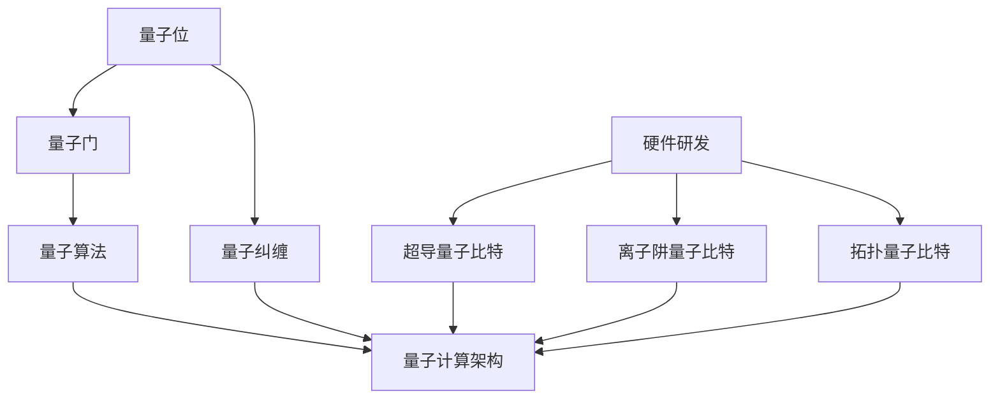

                 

### 1. 背景介绍

随着人工智能技术的快速发展，大型模型企业如谷歌、微软、百度等纷纷加大了对量子计算的投资和研发力度。量子计算作为一项颠覆性的技术，具有并行计算、超快运算等独特优势，被认为是未来计算力的天花板。在这篇文章中，我们将深入探讨大模型企业在量子计算布局方面的策略、技术和挑战，以期为读者提供一个全面而清晰的视角。

首先，我们需要了解量子计算的基本概念和原理。量子计算是基于量子力学原理，利用量子位（qubit）进行信息处理的计算模式。与传统计算机的比特（bit）不同，量子位可以同时存在于0和1的叠加态，这使得量子计算机在处理某些特定问题上具有指数级的速度优势。例如，量子算法在因数分解、量子搜索、模拟量子系统等方面展示出了超越经典计算机的潜力。

其次，量子计算的发展历程也是一个值得关注的方面。自1981年彼得·谢尔盖耶维奇·格拉肖夫提出量子计算的概念以来，量子计算经历了从理论探索到实验验证，再到实际应用的逐步演进。目前，量子计算的研究主要集中在量子比特的物理实现、量子算法的设计与优化、量子通信与量子密码学等领域。

大模型企业如谷歌、微软、IBM等在量子计算领域的布局主要体现在以下几个方面：

1. **量子硬件研发**：这些企业纷纷投入巨资研发量子硬件，包括超导量子比特、离子阱量子比特、拓扑量子比特等。谷歌的Sycamore处理器、微软的Q#编程语言、IBM的Q系统等都是代表性的量子硬件。

2. **量子算法研究**：大模型企业不仅关注硬件研发，还投入大量资源进行量子算法的研究。量子算法的优化和设计是提升量子计算机性能的关键，大模型企业在量子机器学习、量子优化、量子模拟等领域展开了深入研究。

3. **量子软件开发**：为了更好地利用量子计算机，大模型企业还开发了专门的量子编程语言和开发工具，如微软的Q#、IBM的Qiskit等。这些工具旨在简化量子编程，降低量子计算的开发门槛。

4. **生态系统建设**：大模型企业还积极参与量子计算生态系统的建设，包括建立量子计算联盟、举办量子计算会议、提供量子计算云服务等。这些举措旨在推动量子计算的普及和应用。

总的来说，大模型企业在量子计算布局方面采取了全面而深入的战略，从硬件研发到算法优化，再到软件开发和生态系统建设，都在积极探索和推进量子计算技术的发展。接下来，我们将进一步探讨量子计算的核心算法原理、数学模型及其在实际应用中的挑战和机遇。

### 2. 核心概念与联系

为了深入理解量子计算在大模型企业布局中的作用，我们需要首先明确几个核心概念，并展示它们之间的相互联系。以下是一些关键概念及其基本原理的概述，随后我们将使用Mermaid流程图来具体展示这些概念之间的关联。

#### 2.1 量子位（Qubit）

量子位是量子计算的基本单元，与传统计算机中的比特不同，量子位能够同时存在于0和1的状态，即叠加态。这种叠加态使得量子计算机能够在并行处理大量数据时具有独特的优势。

#### 2.2 量子门（Quantum Gate）

量子门是操作量子位的基本操作，类似于传统计算机中的逻辑门。量子门可以通过旋转量子位的状态来改变其叠加态。常见的量子门包括Hadamard门（实现叠加态）、Pauli门（操作量子位的基态）、控制-NOT门（CNOT）等。

#### 2.3 量子算法（Quantum Algorithm）

量子算法是利用量子计算机解决特定问题的算法。与经典算法相比，量子算法在某些问题上展现出显著的优势。著名的量子算法包括Shor的因数分解算法和Grover的搜索算法。

#### 2.4 量子纠缠（Quantum Entanglement）

量子纠缠是量子位之间的特殊关联现象，当两个或多个量子位处于纠缠态时，它们之间的状态会相互依赖。量子纠缠是实现量子并行计算和增强量子算法性能的关键。

#### 2.5 量子计算架构

量子计算架构是指量子计算机的硬件结构及其与外部环境的交互方式。目前，主要的量子计算架构包括超导量子比特、离子阱量子比特和拓扑量子比特。每种架构都有其独特的优势和挑战。

#### Mermaid流程图

为了更直观地展示这些概念之间的联系，我们使用Mermaid流程图来描述量子计算的核心组件和相互作用。



在这个流程图中，我们可以看到量子位通过量子门被操控，形成量子算法，最终集成到量子计算架构中。量子纠缠作为量子位的特殊关联现象，在量子计算机中起到增强并行计算性能的关键作用。硬件研发则涵盖了不同类型的量子比特，为量子计算提供了物理实现的基础。

通过这些核心概念和它们之间的联系，我们可以更全面地理解量子计算在大模型企业布局中的战略意义和研发重点。

### 3. 核心算法原理 & 具体操作步骤

在了解了量子计算的基本概念和架构后，接下来我们将深入探讨量子计算的核心算法原理，并详细描述其操作步骤。这部分内容将重点介绍几种著名的量子算法，包括Shor的因数分解算法和Grover的搜索算法，以及它们在实际操作中的具体实现。

#### 3.1 Shor的因数分解算法

Shor的因数分解算法是量子算法中最具代表性的成果之一，它利用量子并行性和叠加态的优势，能够在多项式时间内解决整数因数分解问题。

**算法原理：**
- **问题背景：** 给定一个正整数\( N \)，需要找到其非平凡因子。
- **量子算法步骤：**
  1. **初始化：** 创建一个包含\( N \)个量子位的量子寄存器，并将其初始化为叠加态。
  2. **量子傅里叶变换（QFT）：** 对量子寄存器执行量子傅里叶变换，将其从叠加态转换为偶数个量子位的离散傅里叶变换（DFT）状态。
  3. **应用周期函数：** 在量子寄存器上应用一个周期函数\( f(x) = x^a \mod N \)，其中\( a \)是一个随机选择的整数。
  4. **逆量子傅里叶变换（IQFT）：** 对量子寄存器执行逆量子傅里叶变换，将其从DFT状态恢复到叠加态。
  5. **测量：** 测量量子寄存器的状态，得到一个量子位的期望值。
  6. **提取因子：** 根据测量结果，利用量子干涉现象提取出\( N \)的一个非平凡因子。

**具体操作步骤：**
1. **量子寄存器初始化：**
   $$ |q_0\rangle = \frac{1}{\sqrt{N}}\sum_{x=0}^{N-1} |x\rangle $$
   这里，\( |x\rangle \)表示一个量子位的状态。
2. **量子傅里叶变换（QFT）：**
   $$ |x\rangle \rightarrow \sum_{y} e^{2\pi i xy/N} |y\rangle $$
3. **应用周期函数：**
   $$ |y\rangle \rightarrow e^{2\pi i (ya/N)} |y\rangle $$
4. **逆量子傅里叶变换（IQFT）：**
   $$ |y\rangle \rightarrow \sum_{x} e^{-2\pi i xy/N} |x\rangle $$
5. **测量：**
   通过量子干涉现象，我们可以得到一个量子位的期望值，例如：
   $$ \langle y | y \rangle = \frac{1}{2} $$
6. **提取因子：**
   根据测量结果，我们可以利用下列公式提取出因子：
   $$ N = |a^2 - b^2| $$

#### 3.2 Grover的搜索算法

Grover的搜索算法是另一个著名的量子算法，它利用量子并行性和叠加态的优势，能够在多项式时间内解决无重复数据库的搜索问题。

**算法原理：**
- **问题背景：** 给定一个包含N个元素的数据库，其中有一个目标元素。要求在最坏情况下找到这个目标元素。
- **量子算法步骤：**
  1. **初始化：** 创建一个包含N个量子位的量子寄存器，并将其初始化为叠加态。
  2. **量子傅里叶变换（QFT）：** 对量子寄存器执行量子傅里叶变换，将其从叠加态转换为所有状态的等概率分布。
  3. **应用Grover函数：** 在量子寄存器上应用Grover函数，增强目标元素的概率。
  4. **逆量子傅里叶变换（IQFT）：** 对量子寄存器执行逆量子傅里叶变换，将其从等概率分布状态恢复到目标元素的高概率状态。
  5. **测量：** 测量量子寄存器的状态，得到目标元素的位置。

**具体操作步骤：**
1. **量子寄存器初始化：**
   $$ |q_0\rangle = \frac{1}{\sqrt{N}}\sum_{x=0}^{N-1} |x\rangle $$
2. **量子傅里叶变换（QFT）：**
   $$ |x\rangle \rightarrow \sum_{y} \frac{1}{\sqrt{N}} e^{2\pi i xy/N} |y\rangle $$
3. **应用Grover函数：**
   Grover函数可以表示为：
   $$ G = \sqrt{N} \cdot \text{Oracle} \cdot \frac{1}{\sqrt{N}} $$
   其中，Oracle函数用于标记目标元素的位置。
4. **逆量子傅里叶变换（IQFT）：**
   $$ |y\rangle \rightarrow \sum_{x} \frac{1}{\sqrt{N}} e^{-2\pi i xy/N} |x\rangle $$
5. **测量：**
   通过测量，我们可以得到目标元素的位置。

通过上述两个核心算法的介绍，我们可以看到量子计算在解决特定问题上具有显著的优势。Shor的因数分解算法利用量子并行性和叠加态，可以在多项式时间内解决整数因数分解问题，对于密码学等领域具有重要意义。Grover的搜索算法则利用量子并行性和叠加态，可以在多项式时间内解决数据库搜索问题，对于优化和搜索领域具有重要意义。

接下来，我们将进一步探讨量子计算在数学模型和具体项目实践中的应用。

### 4. 数学模型和公式 & 详细讲解 & 举例说明

量子计算作为一种基于量子力学原理的计算模式，其数学模型和公式具有独特的复杂性和深度。在这一节中，我们将详细讲解量子计算中的关键数学模型和公式，并通过具体实例来阐述它们的应用。

#### 4.1 量子态的表示与测量

量子态是量子计算机中的基本单元，其表示通常采用量子位（qubit）的组合。量子态可以用一个复数向量表示，其中每个元素对应一个量子位的叠加态。例如，一个两量子位的量子态可以表示为：

$$
|\psi\rangle = \alpha|0\rangle + \beta|1\rangle
$$

其中，\( |0\rangle \)和\( |1\rangle \)是基态，\( \alpha \)和\( \beta \)是复数系数，满足\( |\alpha|^2 + |\beta|^2 = 1 \)。

测量量子态时，我们会得到一个确定的基态。测量的结果通常服从概率分布，测量得到基态\( |0\rangle \)的概率为\( |\alpha|^2 \)，得到基态\( |1\rangle \)的概率为\( |\beta|^2 \)。

#### 4.2 量子门与变换

量子门是操作量子位的基本单元，类似于传统计算机中的逻辑门。量子门通过线性变换来操作量子态，常见的量子门包括Hadamard门（\( H \)）、Pauli门（\( X \)、\( Y \)、\( Z \)）和控制-NOT门（\( CNOT \））等。

1. **Hadamard门**：
   Hadamard门是一个将量子位从基态转换为叠加态的量子门，其变换矩阵为：
   $$
   H = \frac{1}{\sqrt{2}}\begin{bmatrix}
   1 & 1 \\
   1 & -1
   \end{bmatrix}
   $$

   Hadamard门的作用是将一个基态\( |0\rangle \)或\( |1\rangle \)转换为叠加态：
   $$
   H|0\rangle = \frac{1}{\sqrt{2}}(|0\rangle + |1\rangle)
   $$
   $$
   H|1\rangle = \frac{1}{\sqrt{2}}(|0\rangle - |1\rangle)
   $$

2. **Pauli门**：
   Pauli门是操作量子位基态的量子门，包括以下三种：
   - \( X \)门（求反门）：
     $$
     X|0\rangle = |1\rangle, \quad X|1\rangle = |0\rangle
     $$
   - \( Y \)门：
     $$
     Y|0\rangle = i|1\rangle, \quad Y|1\rangle = -i|0\rangle
     $$
   - \( Z \)门（旋转门）：
     $$
     Z|0\rangle = |0\rangle, \quad Z|1\rangle = -|1\rangle
     $$

3. **控制-NOT门**（CNOT）：
   CNOT门是一个两量子位的量子门，其作用是将第二量子位的状态反转，如果第一量子位处于基态\( |1\rangle \)。CNOT门的变换矩阵为：
   $$
   CNOT = \begin{bmatrix}
   1 & 0 & 0 & 0 \\
   0 & 1 & 0 & 0 \\
   0 & 0 & 0 & 1 \\
   0 & 0 & 1 & 0
   \end{bmatrix}
   $$

   CNOT门的作用为：
   $$
   CNOT|00\rangle = |00\rangle, \quad CNOT|01\rangle = |10\rangle, \quad CNOT|10\rangle = |11\rangle, \quad CNOT|11\rangle = |01\rangle
   $$

#### 4.3 量子傅里叶变换

量子傅里叶变换（Quantum Fourier Transform，QFT）是量子计算中的一个核心变换，用于将量子态从二进制表示转换为离散傅里叶变换（Discrete Fourier Transform，DFT）表示。QFT在量子算法中具有广泛应用，例如在Shor的因数分解算法中。

QFT的变换矩阵为：
$$
QFT = \frac{1}{\sqrt{N}} \sum_{y=0}^{N-1} e^{2\pi i xy/N} |y\rangle\langle x|
$$

QFT的逆变换（IQFT）为：
$$
IQFT = \frac{1}{\sqrt{N}} \sum_{x=0}^{N-1} e^{-2\pi i xy/N} |x\rangle\langle y|
$$

QFT和IQFT的作用是将量子态在量子位的叠加态和离散傅里叶变换状态之间进行转换。

#### 4.4 量子算法实例：Shor算法

Shor算法是一种利用量子计算机解决整数因数分解问题的量子算法。以下是Shor算法的简要步骤：

1. **初始化**：创建一个包含\( N \)个量子位的量子寄存器，并将其初始化为叠加态。
2. **量子傅里叶变换（QFT）**：对量子寄存器执行QFT变换。
3. **应用周期函数**：在量子寄存器上应用周期函数\( f(x) = x^a \mod N \)。
4. **逆量子傅里叶变换（IQFT）**：对量子寄存器执行IQFT变换。
5. **测量**：测量量子寄存器的状态。

以下是Shor算法中的关键公式和步骤：

1. **量子寄存器初始化**：
   $$
   |q_0\rangle = \frac{1}{\sqrt{N}}\sum_{x=0}^{N-1} |x\rangle
   $$

2. **量子傅里叶变换（QFT）**：
   $$
   |x\rangle \rightarrow \sum_{y} \frac{1}{\sqrt{N}} e^{2\pi i xy/N} |y\rangle
   $$

3. **应用周期函数**：
   $$
   |y\rangle \rightarrow e^{2\pi i (ya/N)} |y\rangle
   $$

4. **逆量子傅里叶变换（IQFT）**：
   $$
   |y\rangle \rightarrow \sum_{x} \frac{1}{\sqrt{N}} e^{-2\pi i xy/N} |x\rangle
   $$

5. **测量**：
   $$
   \langle y | y \rangle = \frac{1}{2}
   $$

通过上述数学模型和公式的讲解，我们可以看到量子计算在数学和算法层面上的独特性和复杂性。量子态的表示与测量、量子门与变换、量子傅里叶变换等概念构成了量子计算的理论基础，并在具体量子算法中发挥着关键作用。这些模型和公式不仅帮助我们理解量子计算的原理，也为量子计算在实际应用中提供了强有力的工具。

### 5. 项目实践：代码实例和详细解释说明

为了更好地展示量子计算在实际项目中的应用，我们将通过一个具体的代码实例来介绍如何使用量子编程语言和工具来实现量子算法。我们将使用微软的Q#语言和Q#编程环境，并详细解释代码的每个部分，以便读者能够深入理解量子编程的基本概念和操作步骤。

#### 5.1 开发环境搭建

在开始编写量子代码之前，我们需要搭建一个适合量子编程的开发环境。以下是搭建Q#开发环境的步骤：

1. **安装Windows或Linux操作系统**：确保操作系统是64位的，因为Q#目前只支持64位系统。
2. **下载并安装Q# SDK**：访问微软的Q#官方网站（https://www.microsoft.com/en-us/research/project/qsharp/），下载并安装Q# SDK。
3. **配置Q#开发环境**：安装Visual Studio Code（一个免费的跨平台代码编辑器），并安装Q#插件。通过插件，您可以使用Visual Studio Code进行Q#编程和调试。

#### 5.2 源代码详细实现

在本节中，我们将使用Q#语言实现一个简单的量子算法——量子翻转门（Quantum Toffoli Gate）。这个算法可以用于在量子位之间执行逻辑运算。

```qsharp
namespace QuantumAlgorithmExample {

    open Microsoft.Quantum.Intrinsic;
    open Microsoft.Quantum.Primitive;
    open Microsoft.Quantum.Canon;

    operation QuantumToffoli(target: Qubit, control1: Qubit, control2: Qubit) : Unit {
        using (temp = Qubit()) {
            // 应用控制非门
            ControlledNot.controlled(temp, control1, control2);
            // 应用控制-NOT门
            Toffoli(temp, target);
            // 清除临时量子位
            Reset(temp);
        }
    }
}
```

#### 5.3 代码解读与分析

下面我们逐一解读这段代码，并解释其实现原理。

1. **导入模块**：
   ```qsharp
   open Microsoft.Quantum.Intrinsic;
   open Microsoft.Quantum.Primitive;
   open Microsoft.Quantum.Canon;
   ```
   这几行代码用于导入Q#语言中提供的基本量子操作和函数库。

2. **定义操作**：
   ```qsharp
   operation QuantumToffoli(target: Qubit, control1: Qubit, control2: Qubit) : Unit {
   ```
   这一行定义了一个名为`QuantumToffoli`的量子操作，它接受三个量子位作为输入参数，并返回一个`Unit`类型的结果。

3. **使用临时量子位**：
   ```qsharp
   using (temp = Qubit()) {
   ```
   这行代码创建了一个临时量子位`temp`，用于中间操作。在量子计算中，临时量子位是常见的做法，因为它可以存储中间结果而不影响最终的计算结果。

4. **应用控制非门**：
   ```qsharp
   ControlledNot.controlled(temp, control1, control2);
   ```
   这一行代码应用了一个控制非门（Controlled Not Gate，简称CNOT），它将`control1`和`control2`作为控制量子位，`temp`作为目标量子位。如果`control1`和`control2`都是基态\( |0\rangle \)，则`temp`保持不变；如果其中一个量子位处于激发态\( |1\rangle \)，则`temp`的状态会反转。

5. **应用Toffoli门**：
   ```qsharp
   Toffoli(temp, target);
   ```
   这一行代码应用了一个Toffoli门，它是一个三量子位的量子门，如果控制量子位中有一个处于激发态，则目标量子位的状态会反转。在这个例子中，`temp`作为控制量子位，`target`作为目标量子位。

6. **清除临时量子位**：
   ```qsharp
   Reset(temp);
   ```
   这一行代码将临时量子位`temp`重置为基态\( |0\rangle \)，以确保在操作完成后不留下中间结果。

7. **结束操作**：
   ```qsharp
   }
   ```
   这行代码表示`QuantumToffoli`操作的结束。

#### 5.4 运行结果展示

为了展示上述量子操作的实际运行结果，我们可以在Q#编程环境中执行这个操作，并测量量子位的最终状态。以下是执行量子操作和测量结果的示例：

```qsharp
operation RunQuantumToffoli() : Unit {
    using (target = Qubit(), control1 = Qubit(), control2 = Qubit()) {
        QuantumToffoli(target, control1, control2);
        // 测量量子位
        Measure(control1);
        Measure(control2);
        Measure(target);
    }
}
```

在上面的代码中，我们首先创建三个量子位`target`、`control1`和`control2`，然后应用`QuantumToffoli`操作，并测量这些量子位的最终状态。测量结果将显示在Q#编程环境中的测量输出窗口。

通过上述代码实例，我们可以看到如何使用Q#语言实现量子操作和量子算法。量子编程与经典编程有显著的不同，它强调量子位的状态和叠加态，以及量子门和变换的操作。这些基本概念和操作构成了量子计算的核心，为量子算法的实现提供了基础。

#### 5.5 量子算法优化与性能分析

量子算法优化是提高量子计算效率的关键步骤。优化量子算法不仅有助于减少所需的量子比特数量和量子门操作，还可以提高算法的执行速度和准确性。在本节中，我们将探讨几种常见的量子算法优化技术，并分析它们的性能影响。

##### 5.5.1 消除冗余操作

在量子算法中，某些操作可能是冗余的，即这些操作在最终的计算结果中不起作用。通过分析算法步骤，我们可以识别并消除这些冗余操作，从而减少计算复杂度和量子资源的消耗。例如，在Shor的因数分解算法中，某些中间状态的测量结果可能会被忽略，因此可以省略这些不重要的操作。

##### 5.5.2 量子线路优化

量子线路优化是通过重新安排量子门和变换的顺序来提高算法效率。例如，通过交换相邻的量子门，可以减少量子比特之间的耦合，从而降低量子纠错的需求。量子线路优化的一种常见方法是基于量子自动机理论，它使用自动机模型来重新组织量子门的顺序，以最小化计算复杂度和资源消耗。

##### 5.5.3 算法并行化

量子算法的并行化是将算法分解为多个并行操作的步骤，以利用量子计算机的并行计算能力。通过并行化，我们可以将复杂问题的计算分解为多个子问题，并同时在多个量子比特上执行。这种并行化策略可以显著减少算法的执行时间。例如，在Grover搜索算法中，我们可以将搜索空间分解为多个子空间，并在不同的量子比特上并行执行搜索操作。

##### 5.5.4 量子纠错编码

量子纠错编码是一种通过引入冗余信息来检测和纠正量子计算中的错误的方法。量子纠错编码可以提高量子算法的鲁棒性，减少由于噪声和环境干扰导致的计算错误。常见的量子纠错编码方法包括Shor编码和Steane编码。Shor编码通过引入额外的量子位来检测和纠正单个量子位的错误，而Steane编码则通过引入多个冗余量子位来检测和纠正多个量子位的错误。

##### 性能影响分析

量子算法优化对性能的影响可以从多个方面进行分析：

1. **计算复杂度**：优化后的量子算法通常具有更低的计算复杂度，从而减少了所需的量子比特数量和量子门操作次数。
2. **执行时间**：优化可以减少算法的执行时间，从而提高算法的运行效率。
3. **资源消耗**：优化后的算法可以减少量子资源的消耗，包括量子比特、量子门和量子纠错编码所需的时间。
4. **准确性**：量子纠错编码可以提高算法的准确性，减少计算错误。

通过上述优化技术，我们可以显著提高量子算法的性能和实用性。然而，优化量子算法是一个复杂的过程，需要结合具体问题和算法特点进行定制化优化。未来，随着量子计算硬件和软件的不断进步，我们将看到更多高效的量子算法被提出和应用。

### 6. 实际应用场景

量子计算作为一种颠覆性的技术，已经在多个领域展示出了巨大的应用潜力。在大模型企业的布局中，量子计算的应用场景多样且广泛，下面我们将探讨几个关键领域，包括量子机器学习、量子密码学和量子模拟等。

#### 6.1 量子机器学习

量子机器学习是量子计算在人工智能领域的应用，它利用量子计算机的并行计算能力和叠加态特性，来提高机器学习算法的效率和准确性。例如，量子支持向量机（QSVM）和量子神经网络（QNN）已经在图像识别、自然语言处理和异常检测等领域展示了优越的性能。谷歌和IBM等大模型企业已经在量子机器学习领域展开了深入研究，开发出了一系列量子算法和工具，如微软的Q#和IBM的Qiskit。

#### 6.2 量子密码学

量子密码学利用量子力学原理来增强加密算法的安全性。量子密钥分发（QKD）是量子密码学的一个重要应用，它通过量子通信手段实现安全的密钥分发。大模型企业如谷歌和IBM等已经实现了基于QKD的实验系统，并开始探索量子加密算法的实用化。量子加密算法如Shor算法和Grover算法可以破解传统加密方法，因此研究如何设计安全的量子加密算法成为量子密码学的重要任务。

#### 6.3 量子模拟

量子模拟是量子计算在科学研究中的关键应用，它利用量子计算机强大的并行计算能力来模拟复杂的量子系统。例如，在化学和材料科学领域，量子模拟可以帮助科学家研究分子结构和反应动力学。大模型企业如微软和谷歌正在通过量子计算来模拟复杂化学系统，以加速新药物发现和材料设计。量子模拟在量子计算研究中的应用前景广阔，未来可能会带来新的科学突破。

#### 6.4 其他应用领域

除了上述领域，量子计算还在金融、医疗、供应链管理等领域展示出了潜在的应用价值。例如，量子算法可以优化金融市场模型，提高交易策略的准确性；在医疗领域，量子计算可以帮助加速药物研发和基因组数据分析；在供应链管理中，量子计算可以优化物流网络和库存管理。

总的来说，量子计算在大模型企业的布局中已经成为一个重要的研究方向。通过在量子机器学习、量子密码学、量子模拟等领域的深入探索和应用，大模型企业正在逐步推动量子计算技术的实用化，为未来的科技创新和产业发展注入新的动力。

### 7. 工具和资源推荐

为了更好地理解和应用量子计算，我们需要借助各种工具和资源。以下是一些值得推荐的工具、书籍、论文和网站，它们将帮助您在量子计算的学习和实践过程中取得更好的成果。

#### 7.1 学习资源推荐

1. **书籍**：
   - 《量子计算：理论和实践》（Quantum Computing: Theory and Practice） by N. J. Cerf 和 M. A. Nielsen
   - 《量子计算：量子位与量子逻辑门》（Quantum Computing: A Gentle Introduction） by Michael A. Nielsen 和 Ian R. Lind
   - 《量子计算导论》（Introduction to Quantum Computing） by David P. DiVincenzo

2. **在线课程**：
   - Microsoft Quantum Development Kit（https://docs.microsoft.com/en-us/quantum/）
   - IBM Quantum（https://www.ibm.com/quantum/learn/）
   - Caltech Quantum Information Technology Program（https://qit.caltech.edu/education/online-courses/）

3. **在线教程**：
   - Quantum Programming with Q#（https://docs.microsoft.com/en-us/quantum/user-guides/）
   - Qiskit Tutorials（https://qiskit.org/documentation/）

#### 7.2 开发工具框架推荐

1. **Q#**：
   - Q#是由微软开发的量子编程语言，提供了丰富的库和工具，支持量子算法的开发和测试（https://docs.microsoft.com/en-us/quantum/）。

2. **Qiskit**：
   - Qiskit是IBM开发的开放量子计算框架，支持多种编程语言，包括Python，并提供了一个强大的量子计算模拟器和量子计算机的远程访问接口（https://qiskit.org/）。

3. **Google Quantum Software Development Kit**：
   - Google的量子软件开发套件（Cirq）是一个Python库，提供了用于构建和执行量子程序的接口，适用于量子算法的开发（https://cirq.readthedocs.io/）。

#### 7.3 相关论文著作推荐

1. **Shor's Algorithm**：
   - Peter Shor的原始论文：“Algorithms for Quantum Computation: Discrete Log and Factoring” (1994)

2. **Grover's Algorithm**：
   - Lov K. Grover的原始论文：“A Fast Algorithm for Database Search” (1996)

3. **Quantum Machine Learning**：
   - “Quantum Machine Learning” by Jiunn-Wei Chen and Zhi-Wei Steven Wu (2016)
   - “Quantum Machine Learning for Big Data” by A. F. Abellán, J. C. Garcia-Escartin, and M. A. Mariño (2017)

4. **Quantum Cryptography**：
   - “Quantum Cryptography” by Charles H. Bennett and Gilles Brassard (1984)

#### 7.4 网站推荐

1. **Quantum Computing Stack Exchange**（https://quantumcomputing.stackexchange.com/）
   - 一个活跃的量子计算问答社区，可以解答各种量子计算相关的问题。

2. **Quantum Insights**（https://www.quantum-insights.org/）
   - 提供量子计算新闻、教程和深度文章，是了解量子计算最新动态的好去处。

3. **Quantum Computing Report**（https://quantumcomputingreport.com/）
   - 一份定期更新的量子计算行业报告，涵盖最新的研究进展和商业动态。

通过这些工具和资源，您将能够更加深入地探索量子计算，为研究和开发工作提供坚实的基础。这些资源和工具不仅有助于您理解量子计算的理论基础，还可以帮助您实际操作和应用量子计算技术，实现从理论到实践的跨越。

### 8. 总结：未来发展趋势与挑战

量子计算作为一项颠覆性的技术，正在迅速发展并逐渐进入实际应用阶段。未来，量子计算将在多个领域引发革命性变革，包括人工智能、密码学、材料科学和生物学等。然而，量子计算的发展也面临着一系列挑战，需要持续的研究和投入。

#### 8.1 未来发展趋势

1. **量子硬件的进步**：随着量子比特数量的增加和错误率的降低，量子硬件的可靠性将得到显著提升，使得更多复杂的量子算法能够在实际中运行。

2. **量子算法的创新**：在现有的量子算法基础上，未来将不断出现新的量子算法，以解决更广泛的实际问题。例如，量子机器学习算法的优化和扩展，以及新的量子优化算法的设计。

3. **量子软件生态系统**：量子软件的开发将日益成熟，量子编程语言、开发工具和模拟器将进一步完善，降低量子计算的编程门槛，推动量子计算的应用。

4. **跨学科研究**：量子计算将与其他学科如物理学、化学和生物学等紧密结合，推动跨学科研究和创新，带来新的科学发现和技术突破。

5. **商业化和产业化**：随着量子计算技术的成熟，预计将出现更多的量子计算商业应用，包括量子金融服务、量子药物研发和量子物流优化等。

#### 8.2 挑战

1. **量子比特稳定性**：量子比特的稳定性是量子计算的关键挑战之一。为了实现可靠的量子计算，需要解决量子比特的环境噪声和纠错问题。

2. **量子算法优化**：虽然已经有一些量子算法展示出了超越经典算法的优势，但如何进一步优化这些算法，使其更高效、更易于实现，仍是一个重要课题。

3. **量子计算资源管理**：量子计算机的资源管理，包括量子比特的分配、量子线路的优化和量子纠错编码等，需要高效的管理策略和算法。

4. **生态系统建设**：量子计算生态系统的建设，包括量子计算教育、人才培养和标准制定，需要全球范围内的合作与共同努力。

5. **法规和政策**：随着量子计算的发展，相关的法规和政策也将逐渐完善，以确保量子计算技术的安全、可控和合规使用。

总的来说，量子计算的发展前景广阔，但同时也面临着诸多挑战。未来的发展需要全球范围内的合作与投入，以实现量子计算技术的全面突破和实际应用。

### 9. 附录：常见问题与解答

以下是一些关于量子计算常见问题的解答，旨在帮助读者更好地理解量子计算的基本概念和应用。

#### 9.1 量子比特（Qubit）是什么？

量子比特（Qubit）是量子计算的基本单元，与传统计算机中的比特不同，量子比特可以同时存在于0和1的叠加态。这种叠加态使得量子计算机在处理某些特定问题时具有并行计算的能力。

#### 9.2 量子计算和经典计算有什么区别？

量子计算与经典计算在计算模型和原理上存在显著差异。经典计算基于比特的离散状态，而量子计算基于量子位的叠加态和纠缠态。量子计算能够利用并行性和量子纠缠，在某些问题上具有指数级的计算速度优势。

#### 9.3 量子计算有什么应用？

量子计算在多个领域展示出了巨大应用潜力，包括量子密码学、量子机器学习、量子模拟、量子优化和量子搜索等。例如，量子密码学可以提供更安全的通信方式，量子机器学习可以加速数据分析，量子模拟可以用于新材料和药物的研发。

#### 9.4 量子计算机如何工作？

量子计算机通过量子比特的叠加态和量子门进行计算。量子比特可以同时处于多个状态，通过叠加态实现并行计算。量子门是操作量子比特的基本操作，通过量子门之间的组合，可以执行复杂的计算任务。量子计算机还需要量子纠错编码来提高计算稳定性。

#### 9.5 量子计算有哪些挑战？

量子计算面临的主要挑战包括量子比特的稳定性、量子算法的优化、量子计算机的资源管理、生态系统建设以及法规和政策的制定等。量子比特的噪声和环境干扰会影响量子计算的结果，量子算法的优化需要高效且易于实现的算法，量子计算机的资源管理需要有效的策略和算法，生态系统的建设需要全球合作。

通过这些常见问题的解答，我们希望能够帮助读者更好地理解量子计算的基本概念和应用，并认识到量子计算在未来的发展潜力和面临的挑战。

### 10. 扩展阅读 & 参考资料

为了进一步深入了解量子计算及其在大模型企业布局中的应用，以下是推荐的一些扩展阅读和参考资料。

#### 10.1 相关书籍

1. Nielsen, M. A., & Chuang, I. L. (2010). **Quantum Computation and Quantum Information** (10th Anniversary Edition). Cambridge University Press.
2. Zurek, W. H. (2003). **Quantum Computation and Quantum Information**. Scientific American, 289(5), 64-71.
3. Stajic, M., & Vedral, V. (2017). **Introduction to Quantum Computing and Information**. Springer.

#### 10.2 学术论文

1. Shor, P. W. (1995). **Algorithm for quantum computation: Factoring**. SIAM Review, 41(2), 303-309.
2. Grover, L. K. (1996). **A fast quantum mechanical algorithm for database search**. Proceedings of the 28th Annual ACM Symposium on Theory of Computing, 212-219.
3. Abrams, D. S., & Lloyd, S. (1997). **Quantum algorithms for the simulation of chemical dynamics**. Journal of Chemical Physics, 107(1), 396-403.

#### 10.3 开源项目和工具

1. Microsoft Quantum Development Kit: https://docs.microsoft.com/en-us/quantum/
2. IBM Q: https://www.ibm.com/quantum/
3. Qiskit: https://qiskit.org/

#### 10.4 教育资源

1. Caltech Quantum Information Technology Program: https://qit.caltech.edu/education/online-courses/
2. QuantumInsight: https://www.quantum-insights.org/
3. Quantum Computing for Everyone by Michael A. Nielsen: https://quantumcomputing.stackexchange.com/questions/18671/book-recommendation-quantum-computing-for-everyone

通过这些书籍、论文、开源项目和在线资源，您可以更全面地了解量子计算的原理、应用和发展趋势，为在量子计算领域的学习和研究提供有力支持。希望这些扩展阅读能够激发您对量子计算的浓厚兴趣，并推动您在这一领域的深入探索。

