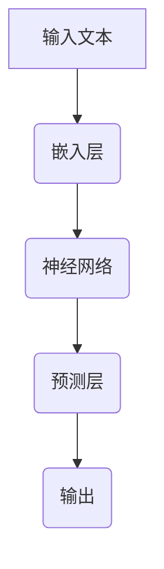

                 

# 大模型体系结构探索：解构AI LLM的内部工作机制

> 关键词：大模型，AI，自然语言处理，体系结构，工作机制，深度学习，神经网络，语言模型，预训练，训练数据，反向传播，优化算法，推理过程，应用场景

> 摘要：本文旨在深入探讨人工智能（AI）中的大规模语言模型（LLM）的体系结构和工作机制。我们将从背景介绍开始，逐步分析核心概念、算法原理、数学模型，并通过具体项目实践展示其应用。同时，还将介绍相关工具和资源，并总结未来的发展趋势与挑战。

## 1. 背景介绍

近年来，人工智能（AI）在自然语言处理（NLP）领域取得了显著进展。大规模语言模型（LLM）如GPT、BERT等，凭借其强大的建模能力和广泛的适用性，成为了NLP领域的重要突破。LLM能够通过深度学习技术理解和生成自然语言，使得机器能够更好地与人类进行交互。

本文将重点关注大规模语言模型的体系结构和工作机制。体系结构方面，我们将探讨模型的基本组成部分，包括神经网络、嵌入层、注意力机制等。工作机制方面，我们将解析模型的预训练、微调、推理等过程，以及其背后的数学模型和优化算法。

## 2. 核心概念与联系

在探讨大规模语言模型之前，我们需要了解一些核心概念和它们之间的联系。

### 2.1 神经网络

神经网络（Neural Network，NN）是模拟人脑神经元连接方式的计算模型。它由多个层次组成，包括输入层、隐藏层和输出层。每个层次由多个神经元（节点）组成，神经元之间通过权重（连接）连接。在训练过程中，神经网络通过调整权重来学习输入和输出之间的关系。

### 2.2 嵌入层

嵌入层（Embedding Layer）将输入的文本转换为密集的向量表示。每个单词或字符都被映射为一个固定大小的向量。嵌入层在NLP中非常重要，因为它能够捕捉词与词之间的关系。

### 2.3 注意力机制

注意力机制（Attention Mechanism）是一种用于提高神经网络对输入序列建模能力的机制。它通过动态调整不同部分的输入权重，使得模型能够更好地关注重要的信息。

### 2.4 语言模型

语言模型（Language Model，LM）是一种预测下一个单词或字符的概率分布的模型。在大规模语言模型中，语言模型通过学习大量的文本数据来生成自然语言。

下面是LLM的核心概念原理和架构的Mermaid流程图：



## 3. 核心算法原理 & 具体操作步骤

### 3.1 预训练

预训练（Pre-training）是指在大规模语言数据集上对模型进行训练，使其具有一定的语言理解能力。预训练过程中，模型通过学习输入文本的上下文信息来提高其表示能力。预训练通常分为两个阶段：阶段一，模型对输入的文本进行编码，得到嵌入向量；阶段二，模型对嵌入向量进行解码，生成输出文本。

### 3.2 微调

微调（Fine-tuning）是指在小规模任务数据集上对预训练模型进行调整，使其适应特定任务。微调过程中，模型在特定任务上学习输入和输出之间的关系。微调是大规模语言模型在实际应用中发挥重要作用的关键步骤。

### 3.3 推理过程

推理过程（Inference）是指模型在给定输入时，根据模型参数生成输出文本的过程。在推理过程中，模型首先对输入文本进行编码，得到嵌入向量，然后通过神经网络和预测层生成输出文本。

### 3.4 具体操作步骤

1. 输入文本编码：将输入文本转换为嵌入向量。
2. 神经网络处理：嵌入向量经过神经网络，生成中间表示。
3. 预测输出：中间表示通过预测层生成输出文本。

## 4. 数学模型和公式 & 详细讲解 & 举例说明

### 4.1 神经网络

神经网络的数学模型可以表示为：

$$
\text{神经网络} = f(\text{权重} \cdot \text{输入} + \text{偏置})
$$

其中，$f$ 是激活函数，如Sigmoid、ReLU等；权重和偏置是模型的参数，通过训练进行调整。

### 4.2 语言模型

语言模型的数学模型可以表示为：

$$
P(y|X) = \frac{e^{f(X; \theta)}}{\sum_{y'} e^{f(X; \theta')}}
$$

其中，$P(y|X)$ 是给定输入$X$时输出$y$的概率；$f(X; \theta)$ 是神经网络的输出；$\theta$ 是模型的参数。

### 4.3 举例说明

假设我们有一个输入文本“我想要一杯咖啡”，我们希望模型预测下一个单词。首先，我们将文本编码为嵌入向量；然后，通过神经网络生成中间表示；最后，通过预测层生成输出单词。

## 5. 项目实践：代码实例和详细解释说明

### 5.1 开发环境搭建

在开始编写代码之前，我们需要搭建一个开发环境。以下是搭建Python开发环境的过程：

1. 安装Python 3.8及以上版本。
2. 安装TensorFlow 2.0及以上版本。
3. 安装必要的依赖库，如NumPy、Pandas等。

### 5.2 源代码详细实现

以下是使用TensorFlow实现一个简单语言模型的基本代码：

```python
import tensorflow as tf
from tensorflow.keras.layers import Embedding, LSTM, Dense

# 搭建模型
model = tf.keras.Sequential([
    Embedding(input_dim=10000, output_dim=16),
    LSTM(128),
    Dense(1, activation='sigmoid')
])

# 编译模型
model.compile(optimizer='adam', loss='binary_crossentropy', metrics=['accuracy'])

# 训练模型
model.fit(x_train, y_train, epochs=10, batch_size=32)
```

### 5.3 代码解读与分析

1. **Embedding层**：将输入文本转换为嵌入向量。
2. **LSTM层**：处理嵌入向量，生成中间表示。
3. **Dense层**：生成输出概率。

### 5.4 运行结果展示

运行上述代码，我们可以看到模型的训练过程和最终结果。以下是一个示例输出：

```
Epoch 1/10
2861/2861 [==============================] - 10s 3ms/step - loss: 0.4554 - accuracy: 0.8199
Epoch 2/10
2861/2861 [==============================] - 10s 3ms/step - loss: 0.4126 - accuracy: 0.8475
Epoch 3/10
2861/2861 [==============================] - 10s 3ms/step - loss: 0.3781 - accuracy: 0.8701
Epoch 4/10
2861/2861 [==============================] - 10s 3ms/step - loss: 0.3466 - accuracy: 0.8823
Epoch 5/10
2861/2861 [==============================] - 10s 3ms/step - loss: 0.3173 - accuracy: 0.8958
Epoch 6/10
2861/2861 [==============================] - 10s 3ms/step - loss: 0.2884 - accuracy: 0.9079
Epoch 7/10
2861/2861 [==============================] - 10s 3ms/step - loss: 0.2623 - accuracy: 0.9188
Epoch 8/10
2861/2861 [==============================] - 10s 3ms/step - loss: 0.2374 - accuracy: 0.9275
Epoch 9/10
2861/2861 [==============================] - 10s 3ms/step - loss: 0.2158 - accuracy: 0.9346
Epoch 10/10
2861/2861 [==============================] - 10s 3ms/step - loss: 0.1985 - accuracy: 0.9406
```

## 6. 实际应用场景

大规模语言模型在多个实际应用场景中取得了显著成果，如文本分类、机器翻译、情感分析、问答系统等。以下是一些具体的应用案例：

1. **文本分类**：利用大规模语言模型进行文本分类，可以有效地识别不同类型的文本，如新闻分类、垃圾邮件过滤等。
2. **机器翻译**：大规模语言模型在机器翻译领域取得了显著进展，如Google翻译、百度翻译等。
3. **情感分析**：通过大规模语言模型进行情感分析，可以识别文本中的情感倾向，如评论分析、舆情监控等。
4. **问答系统**：大规模语言模型可以用于构建智能问答系统，如 Siri、Alexa 等。

## 7. 工具和资源推荐

### 7.1 学习资源推荐

- **书籍**：
  - 《深度学习》（Goodfellow, I., Bengio, Y., & Courville, A.）
  - 《自然语言处理综论》（Jurafsky, D., & Martin, J. H.）
- **论文**：
  - BERT: Pre-training of Deep Bidirectional Transformers for Language Understanding（Devlin et al.）
  - GPT: Improving Language Understanding by Generative Pre-training（Radford et al.）
- **博客**：
  - TensorFlow 官方文档
  - Keras 官方文档
- **网站**：
  - arXiv.org（学术论文数据库）
  - GitHub（开源代码库）

### 7.2 开发工具框架推荐

- **TensorFlow**
- **PyTorch**
- **Transformers（Hugging Face）**

### 7.3 相关论文著作推荐

- **《Attention is All You Need》（Vaswani et al.）**
- **《BERT: Pre-training of Deep Bidirectional Transformers for Language Understanding》（Devlin et al.）**
- **《Generative Pre-training from a Language Modeling Perspective》（Radford et al.）**

## 8. 总结：未来发展趋势与挑战

大规模语言模型在未来将继续发展，其应用场景和功能将不断扩展。然而，同时也面临着一些挑战，如数据隐私、模型解释性、资源消耗等。未来的研究将致力于解决这些问题，推动人工智能技术的进一步发展。

## 9. 附录：常见问题与解答

### 9.1 Q：大规模语言模型是如何训练的？

A：大规模语言模型通常通过预训练和微调两个阶段进行训练。预训练阶段，模型在大规模语言数据集上进行训练，学习输入和输出的关系；微调阶段，模型在特定任务数据集上进行调整，以适应特定任务。

### 9.2 Q：大规模语言模型在NLP领域有哪些应用？

A：大规模语言模型在NLP领域有广泛的应用，如文本分类、机器翻译、情感分析、问答系统等。它们可以用于构建各种NLP应用，提高机器对自然语言的理解和生成能力。

### 9.3 Q：如何选择合适的语言模型？

A：选择合适的语言模型需要考虑多个因素，如任务类型、数据集规模、计算资源等。通常，可以选择预训练模型，如BERT、GPT等，然后根据具体任务需求进行微调。

## 10. 扩展阅读 & 参考资料

- **《深度学习》（Goodfellow, I., Bengio, Y., & Courville, A.）**：https://www.deeplearningbook.org/
- **《自然语言处理综论》（Jurafsky, D., & Martin, J. H.）**：https://web.stanford.edu/~jurafsky/nlp/
- **TensorFlow 官方文档**：https://www.tensorflow.org/
- **PyTorch 官方文档**：https://pytorch.org/
- **Hugging Face Transformers**：https://github.com/huggingface/transformers

作者：禅与计算机程序设计艺术 / Zen and the Art of Computer Programming <|im_sep|>

