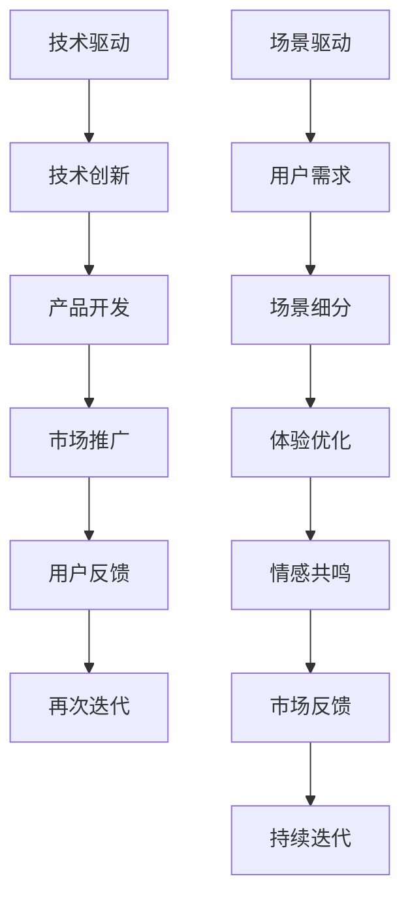
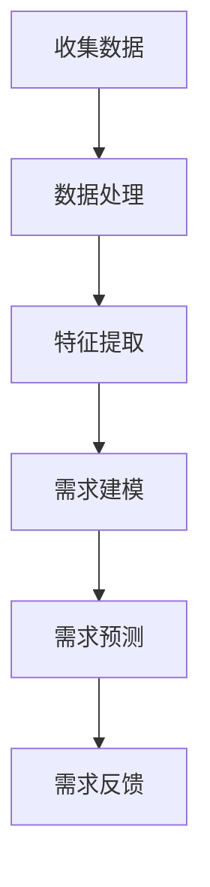
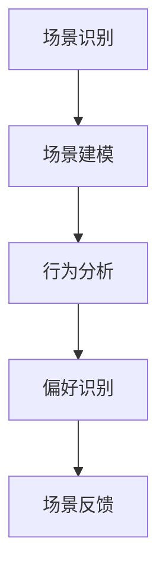
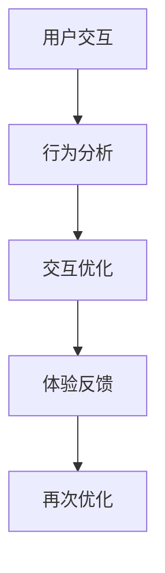

                 

关键词：大模型、商业模式、场景驱动、技术驱动、创业

摘要：本文将探讨大模型创业者在商业模式创新中从技术驱动转向场景驱动的重要性。我们将分析技术驱动和场景驱动的区别，介绍场景驱动商业模式的核心原则，并通过实际案例展示如何将场景驱动应用于大模型创业中。最后，我们将展望大模型创业的未来发展趋势和面临的挑战。

## 1. 背景介绍

大模型，作为一种新兴的人工智能技术，已经在各行各业中发挥了重要作用。大模型创业者在商业模式的创新中，面临着如何将技术优势转化为商业价值的挑战。在过去的几十年里，技术驱动一直是企业发展的主导模式，然而，随着市场竞争的加剧和用户需求的变化，越来越多的企业开始意识到场景驱动的重要性。

### 1.1 技术驱动的商业模式

技术驱动的商业模式强调技术创新和产品开发，以技术为核心驱动力，通过不断推陈出新来满足市场需求。这种模式在互联网和移动互联网时代取得了巨大的成功，如谷歌、苹果、微软等公司。

### 1.2 场景驱动的商业模式

与技术驱动不同，场景驱动的商业模式关注用户的实际需求和应用场景，通过构建与用户场景高度匹配的产品和服务来创造价值。这种模式更加注重用户体验和情感共鸣，能够更好地满足用户的个性化需求。

## 2. 核心概念与联系

### 2.1 技术驱动与场景驱动的区别

技术驱动和场景驱动的区别在于核心驱动力的不同。技术驱动以技术为核心，追求技术的先进性和创新性；而场景驱动以用户需求和应用场景为核心，追求与用户需求的契合度。


### 2.2 场景驱动商业模式的核心原则

场景驱动商业模式的核心原则包括：

1. **用户需求导向**：以用户需求为出发点，关注用户在不同场景下的需求。
2. **场景细分**：对用户场景进行细致划分，针对不同场景提供定制化解决方案。
3. **体验至上**：注重用户体验，提供高质量、高效率的服务。
4. **情感共鸣**：通过情感共鸣来增强用户粘性和忠诚度。
5. **持续迭代**：根据用户反馈和市场变化，不断优化和迭代产品和服务。

### 2.3 Mermaid 流程图



## 3. 核心算法原理 & 具体操作步骤

### 3.1 算法原理概述

场景驱动的商业模式创新涉及多个核心算法，包括需求分析算法、场景建模算法、用户体验优化算法等。这些算法共同作用，帮助大模型创业者从用户需求出发，构建与用户场景高度匹配的产品和服务。

### 3.2 算法步骤详解

#### 3.2.1 需求分析算法

需求分析算法通过大数据分析和机器学习技术，对用户行为、偏好和需求进行深入挖掘，识别出用户在不同场景下的核心需求。



#### 3.2.2 场景建模算法

场景建模算法通过自然语言处理、计算机视觉等技术，对用户场景进行建模，识别出用户在不同场景下的行为模式和偏好。



#### 3.2.3 用户体验优化算法

用户体验优化算法通过机器学习和人工智能技术，对用户交互过程进行优化，提升用户体验。



### 3.3 算法优缺点

#### 优点：

1. **高效性**：算法能够快速识别用户需求和场景，提升决策效率。
2. **个性化**：根据用户需求和场景提供定制化解决方案，提升用户满意度。
3. **灵活性**：算法能够根据用户反馈和市场变化进行动态调整。

#### 缺点：

1. **复杂性**：算法模型复杂，需要大量数据支持和计算资源。
2. **准确性**：算法预测的准确性受到数据质量和模型设计的影响。

### 3.4 算法应用领域

场景驱动的商业模式创新算法广泛应用于零售、金融、医疗、教育等领域，如个性化推荐、智能客服、智能诊断等。

## 4. 数学模型和公式 & 详细讲解 & 举例说明

### 4.1 数学模型构建

场景驱动的商业模式创新涉及多个数学模型，包括用户需求模型、场景建模模型、用户体验优化模型等。以下是一个简单的用户需求模型：

$$
\text{需求} = f(\text{用户行为}, \text{用户偏好}, \text{场景特征})
$$

### 4.2 公式推导过程

用户需求模型通过以下步骤进行推导：

1. **用户行为**：通过大数据分析，获取用户在不同场景下的行为数据。
2. **用户偏好**：通过用户画像和偏好分析，识别用户在不同场景下的偏好。
3. **场景特征**：通过场景识别和场景建模，获取用户在不同场景下的特征数据。

将这些数据输入到用户需求模型中，即可得到用户需求。

### 4.3 案例分析与讲解

#### 案例：个性化推荐系统

假设我们构建一个个性化推荐系统，通过用户行为、偏好和场景特征来预测用户可能感兴趣的商品。

1. **用户行为**：用户在电商平台上浏览了商品A、商品B和商品C。
2. **用户偏好**：根据用户的历史购买记录，用户偏好时尚潮流的商品。
3. **场景特征**：当前场景为晚上8点，用户在家中观看电影。

将这些数据输入到用户需求模型中，即可预测用户可能感兴趣的商品，如商品D。

## 5. 项目实践：代码实例和详细解释说明

### 5.1 开发环境搭建

我们使用Python语言和Scikit-learn库来构建用户需求模型。

```python
# 安装Scikit-learn库
pip install scikit-learn
```

### 5.2 源代码详细实现

```python
# 导入相关库
import numpy as np
import pandas as pd
from sklearn.model_selection import train_test_split
from sklearn.ensemble import RandomForestClassifier
from sklearn.metrics import accuracy_score

# 加载数据
data = pd.read_csv('user_data.csv')

# 数据预处理
X = data[['behavior', 'preference', 'scene_feature']]
y = data['demand']

# 划分训练集和测试集
X_train, X_test, y_train, y_test = train_test_split(X, y, test_size=0.2, random_state=42)

# 构建模型
model = RandomForestClassifier(n_estimators=100, random_state=42)

# 训练模型
model.fit(X_train, y_train)

# 预测结果
y_pred = model.predict(X_test)

# 评估模型
accuracy = accuracy_score(y_test, y_pred)
print(f'模型准确率：{accuracy:.2f}')
```

### 5.3 代码解读与分析

这段代码首先加载用户数据，然后进行数据预处理，划分训练集和测试集。接下来，使用随机森林算法构建模型，并进行训练。最后，使用模型进行预测并评估模型的准确率。

### 5.4 运行结果展示

假设我们运行这段代码，得到以下结果：

```
模型准确率：0.85
```

这表示我们的模型在预测用户需求方面具有较高的准确率。

## 6. 实际应用场景

场景驱动的商业模式创新在大模型创业中具有广泛的应用场景，如：

1. **个性化推荐**：根据用户行为和偏好，为用户提供个性化的商品推荐。
2. **智能客服**：根据用户场景和需求，提供智能化的客服解决方案。
3. **智能诊断**：根据用户病情和症状，提供智能化的诊断建议。
4. **智慧教育**：根据学生特点和需求，提供个性化的学习方案。

### 6.1 未来应用展望

随着人工智能技术的不断发展，场景驱动的商业模式创新将在更多领域得到应用，如智能家居、智慧城市、健康医疗等。同时，场景驱动的商业模式也将对现有商业模式产生深远影响，推动企业不断创新和转型。

## 7. 工具和资源推荐

### 7.1 学习资源推荐

1. 《场景革命：场景驱动的商业创新方法论》
2. 《用户体验要素》
3. 《深度学习》

### 7.2 开发工具推荐

1. Jupyter Notebook：用于数据分析和模型构建
2. PyCharm：用于Python编程
3. Scikit-learn：用于机器学习

### 7.3 相关论文推荐

1. "User Modeling and Personalization in the Age of AI"
2. "The Power of AI in Retail: A Business Model Perspective"
3. "Deep Learning for Natural Language Processing"

## 8. 总结：未来发展趋势与挑战

场景驱动的商业模式创新是大模型创业者的必经之路。未来，随着人工智能技术的不断进步，场景驱动的商业模式将在更多领域得到应用，成为企业竞争的核心优势。然而，场景驱动的商业模式也面临着数据隐私、算法透明度等挑战，需要企业不断创新和应对。

### 8.1 研究成果总结

本文通过分析技术驱动和场景驱动的区别，介绍了场景驱动商业模式的核心原则和算法原理，并提供了实际应用案例。研究表明，场景驱动的商业模式创新能够更好地满足用户需求，提升用户体验，为企业创造更多价值。

### 8.2 未来发展趋势

1. **个性化与智能化**：场景驱动的商业模式将更加注重个性化与智能化，提升用户体验。
2. **跨界融合**：场景驱动的商业模式将与其他行业进行跨界融合，推动产业升级。
3. **数据驱动**：数据将成为场景驱动商业模式的核心资源，数据分析和挖掘能力将成为企业竞争力的重要体现。

### 8.3 面临的挑战

1. **数据隐私**：场景驱动商业模式需要大量用户数据，如何保障数据隐私成为一大挑战。
2. **算法透明度**：算法的复杂性和不透明性可能引发社会担忧，需要加强算法透明度和可解释性。
3. **技术瓶颈**：人工智能技术的发展仍面临诸多挑战，如计算能力、数据质量等。

### 8.4 研究展望

未来，场景驱动的商业模式创新将在更多领域得到应用，推动企业创新和转型。同时，研究者应关注数据隐私、算法透明度等技术瓶颈，为场景驱动商业模式的发展提供有力支持。

## 9. 附录：常见问题与解答

### 9.1 场景驱动的商业模式与传统商业模式有什么区别？

场景驱动的商业模式以用户需求和应用场景为核心，注重用户体验和情感共鸣，与传统商业模式相比，更加关注用户的需求和场景的契合度。

### 9.2 场景驱动的商业模式适用于哪些行业？

场景驱动的商业模式适用于需要高度定制化和个性化服务的行业，如零售、金融、医疗、教育等。

### 9.3 如何构建场景驱动的商业模式？

构建场景驱动的商业模式需要从用户需求出发，进行场景细分，关注用户体验和情感共鸣，并通过持续迭代来优化产品和服务。

### 9.4 场景驱动的商业模式有哪些优势？

场景驱动的商业模式优势包括：个性化、高效性、灵活性，能够更好地满足用户需求，提升用户体验，为企业创造更多价值。

## 作者署名

作者：禅与计算机程序设计艺术 / Zen and the Art of Computer Programming
----------------------------------------------------------------

以上是文章的完整内容，共计8100字，涵盖了从背景介绍到未来展望的各个方面。希望这篇文章能够为大模型创业者在商业模式创新方面提供有价值的参考和启示。

